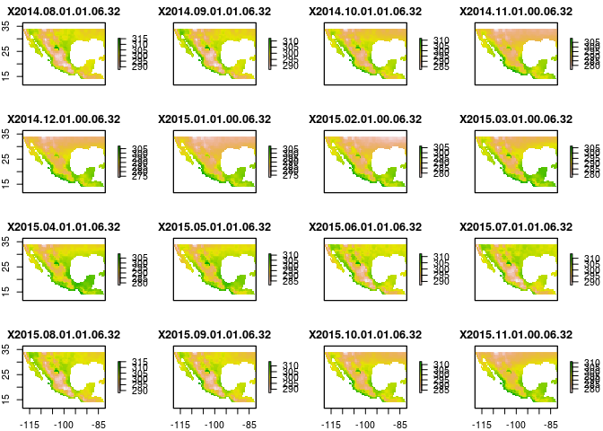
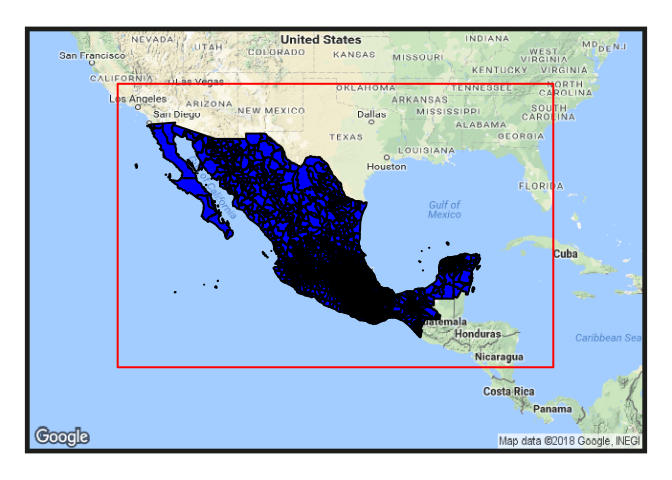
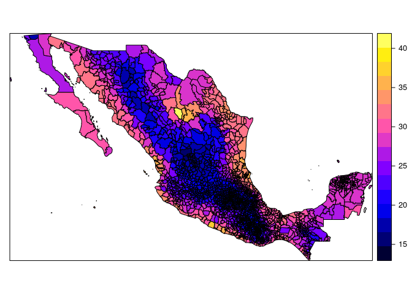

Combine Raster temperature with Mexico municipalities Shapefile
================

``` r
library(dplyr)
```

    ## 
    ## Attaching package: 'dplyr'

    ## The following objects are masked from 'package:stats':
    ## 
    ##     filter, lag

    ## The following objects are masked from 'package:base':
    ## 
    ##     intersect, setdiff, setequal, union

``` r
library(ncdf4)
library(raster)
```

    ## Loading required package: sp

    ## 
    ## Attaching package: 'raster'

    ## The following object is masked from 'package:dplyr':
    ## 
    ##     select

``` r
library(sp)
library(rgeos)
```

    ## rgeos version: 0.3-26, (SVN revision 560)
    ##  GEOS runtime version: 3.5.1-CAPI-1.9.1 r4246 
    ##  Linking to sp version: 1.2-4 
    ##  Polygon checking: TRUE

``` r
library(rgdal)
```

    ## rgdal: version: 1.2-15, (SVN revision 691)
    ##  Geospatial Data Abstraction Library extensions to R successfully loaded
    ##  Loaded GDAL runtime: GDAL 2.2.2, released 2017/09/15
    ##  Path to GDAL shared files: /usr/share/gdal/2.2
    ##  GDAL binary built with GEOS: TRUE 
    ##  Loaded PROJ.4 runtime: Rel. 4.9.2, 08 September 2015, [PJ_VERSION: 492]
    ##  Path to PROJ.4 shared files: (autodetected)
    ##  Linking to sp version: 1.2-4

``` r
library(dismo)
```

Read ShapeFile and Raster File.
-------------------------------

``` r
muni.shp<-readOGR(dsn="gis/shapefiles/conjunto_de_datos/",layer = "areas_geoestadisticas_municipales")
```

    ## OGR data source with driver: ESRI Shapefile 
    ## Source: "gis/shapefiles/conjunto_de_datos/", layer: "areas_geoestadisticas_municipales"
    ## with 2458 features
    ## It has 3 fields

``` r
RASTER_FILE_NAME <- 'gis/noaa_temperatures/air.mon.mean.nc'

DATES <- c(800:838)

r.stack<-stack(RASTER_FILE_NAME,bands=DATES)
r.stack<- rotate(r.stack)

data.frame( rasterToPoints( r.stack ) )
```

    ##             x      y X2014.08.01.01.06.32 X2014.09.01.01.06.32
    ## 1      -40.75  83.75               275.55               265.48
    ## 2      -40.25  83.75               275.54               265.46
    ## 3      -39.75  83.75               275.56               265.45
    ## 4      -39.25  83.75               275.35               265.26
    ## 5      -38.75  83.75               275.31               265.21
    ## 6      -38.25  83.75               275.33               265.21
    ## 7      -37.75  83.75               275.35               265.20
    ## 8      -37.25  83.75               275.37               265.20
    ## 9      -36.75  83.75               275.19               265.04
    ## 10     -36.25  83.75               275.10               264.96
    ## 11     -35.75  83.75               274.86               264.76
    ## 12     -35.25  83.75               275.10               264.92
    ## 13     -34.75  83.75               275.12               264.91
    ## 14     -34.25  83.75               275.13               264.90
    ## 15     -33.75  83.75               274.82               264.67
    ## 16     -33.25  83.75               274.97               264.77
    ## 17     -32.75  83.75               275.18               264.91
    ## 18     -32.25  83.75               275.17               264.88
    ## 19     -31.75  83.75               275.39               265.02
    ## 20     -31.25  83.75               275.18               264.86
    ## 21     -30.75  83.75               275.51               265.08
    ## 22     -30.25  83.75               275.51               265.06
    ## 23     -29.75  83.75               275.66               265.15
    ## 24     -29.25  83.75               275.36               264.91
    ## 25     -28.75  83.75               275.66               265.11
    ## 26     -28.25  83.75               275.66               265.09
    ## 27     -27.75  83.75               275.78               265.15
    ## 28     -27.25  83.75               275.80               265.14
    ## 29     -26.75  83.75               275.85               265.17
    ## 30     -78.25  83.25               275.46               266.52
    ## 31     -77.75  83.25               275.43               266.50
    ## 32     -77.25  83.25               275.16               266.31
    ## 33     -76.75  83.25               275.31               266.42
    ## 34     -76.25  83.25               275.35               266.45
    ## 35     -75.75  83.25               275.24               266.36
    ## 36     -75.25  83.25               275.15               266.29
    ## 37     -74.75  83.25               275.43               266.50
    ## 38     -74.25  83.25               275.34               266.43
    ## 39     -73.75  83.25               275.15               266.29
    ## 40     -73.25  83.25               274.85               266.06
    ## 41     -72.75  83.25               274.83               266.04
    ## 42     -72.25  83.25               275.08               266.24
    ## 43     -71.75  83.25               274.62               265.88
    ## 44     -71.25  83.25               274.25               265.58
    ## 45     -70.75  83.25               274.73               265.96
    ## 46     -70.25  83.25               274.99               266.16
    ## 47     -69.75  83.25               275.14               266.28
    ## 48     -69.25  83.25               275.12               266.26
    ## 49     -68.75  83.25               275.11               266.25
    ## 50     -47.75  83.25               275.14               265.75
    ## 51     -47.25  83.25               274.83               265.49
    ## 52     -46.75  83.25               275.02               265.65
    ## 53     -46.25  83.25               275.05               265.66
    ## 54     -45.75  83.25               274.20               264.88
    ## 55     -45.25  83.25               274.10               264.78
    ## 56     -44.75  83.25               274.30               264.94
    ## 57     -44.25  83.25               274.33               264.95
    ## 58     -43.75  83.25               273.88               264.56
    ## 59     -43.25  83.25               273.87               264.56
    ## 60     -42.75  83.25               274.51               265.06
    ## 61     -42.25  83.25               274.30               264.75
    ## 62     -41.75  83.25               274.69               264.93
    ## 63     -41.25  83.25               274.86               264.92
    ## 64     -40.75  83.25               274.85               264.83
    ## 65     -40.25  83.25               275.11               265.03
    ## 66     -39.75  83.25               275.26               265.14
    ## 67     -39.25  83.25               274.60               264.86
    ## 68     -38.75  83.25               274.29               264.68
    ## 69     -38.25  83.25               273.87               264.45
    ## 70     -37.75  83.25               274.11               264.56
    ## 71     -37.25  83.25               274.40               264.69
    ## 72     -36.75  83.25               274.15               264.55
    ## 73     -36.25  83.25               273.91               264.42
    ## 74     -35.75  83.25               273.52               264.20
    ## 75     -35.25  83.25               273.61               264.23
    ## 76     -34.75  83.25               274.33               264.59
    ## 77     -34.25  83.25               274.17               264.50
    ## 78     -33.75  83.25               273.52               264.17
    ## 79     -33.25  83.25               273.98               264.40
    ## 80     -32.75  83.25               274.24               264.51
    ## 81     -32.25  83.25               274.21               264.46
    ## 82     -31.75  83.25               274.64               264.67
    ## 83     -31.25  83.25               274.49               264.58
    ## 84     -30.75  83.25               274.78               264.73
    ## 85     -30.25  83.25               274.63               264.31
    ## 86     -29.75  83.25               274.85               264.74
    ## 87     -29.25  83.25               274.74               264.37
    ## 88     -28.75  83.25               274.76               264.38
    ## 89     -28.25  83.25               275.04               264.59
    ## 90     -27.75  83.25               275.40               264.86
    ## 91     -27.25  83.25               275.32               264.79
    ## 92     -26.75  83.25               275.62               265.02
    ## 93     -26.25  83.25               275.68               265.08
    ## 94     -25.75  83.25               276.03               265.37
    ## 95     -86.25  82.75               275.69               266.70
    ## 96     -85.75  82.75               275.56               266.63
    ## 97     -85.25  82.75               275.61               266.65
    ## 98     -84.75  82.75               275.67               266.68
    ## 99     -84.25  82.75               275.70               266.70
    ## 100    -83.75  82.75               275.72               266.71
    ## 101    -83.25  82.75               275.42               266.51
    ## 102    -82.75  82.75               274.97               266.22
    ## 103    -82.25  82.75               275.06               266.28
    ## 104    -81.75  82.75               274.44               265.87
    ## 105    -81.25  82.75               274.58               265.94
    ## 106    -80.75  82.75               274.20               265.67
    ## 107    -80.25  82.75               274.03               265.98
    ## 108    -79.75  82.75               274.11               266.01
    ## 109    -79.25  82.75               273.56               265.79
    ## 110    -78.75  82.75               273.97               265.98
    ## 111    -78.25  82.75               273.50               265.82
    ## 112    -77.75  82.75               273.61               265.86
    ## 113    -77.25  82.75               273.60               265.85
    ## 114    -76.75  82.75               274.07               266.02
    ## 115    -76.25  82.75               273.82               265.93
    ## 116    -75.75  82.75               272.90               265.57
    ## 117    -75.25  82.75               273.27               265.70
    ## 118    -74.75  82.75               273.41               265.75
    ## 119    -74.25  82.75               273.48               265.77
    ## 120    -73.75  82.75               273.91               265.92
    ## 121    -73.25  82.75               274.03               265.95
    ## 122    -72.75  82.75               273.01               265.55
    ## 123    -72.25  82.75               272.77               265.44
    ## 124    -71.75  82.75               272.60               265.36
    ## 125    -71.25  82.75               272.50               265.31
    ## 126    -70.75  82.75               272.59               265.33
    ## 127    -70.25  82.75               272.95               265.45
    ## 128    -69.75  82.75               272.96               265.44
    ## 129    -69.25  82.75               273.10               265.49
    ## 130    -68.75  82.75               273.60               265.66
    ## 131    -68.25  82.75               273.40               265.56
    ## 132    -67.75  82.75               273.57               265.61
    ## 133    -67.25  82.75               273.26               265.48
    ## 134    -66.75  82.75               273.17               265.43
    ## 135    -66.25  82.75               273.20               265.42
    ## 136    -65.75  82.75               273.34               265.46
    ## 137    -65.25  82.75               274.05               265.73
    ## 138    -64.75  82.75               273.76               265.03
    ## 139    -64.25  82.75               273.95               265.19
    ## 140    -63.75  82.75               274.17               265.36
    ## 141    -63.25  82.75               274.75               265.85
    ## 142    -62.75  82.75               274.85               265.94
    ## 143    -62.25  82.75               275.00               266.07
    ## 144    -61.75  82.75               274.67               265.79
    ## 145    -61.25  82.75               274.64               265.76
    ## 146    -55.25  82.75               274.97               266.04
    ## 147    -51.75  82.75               274.80               265.59
    ## 148    -51.25  82.75               274.77               265.48
    ## 149    -50.75  82.75               274.86               265.47
    ## 150    -50.25  82.75               275.28               265.79
    ## 151    -49.75  82.75               275.31               265.78
    ## 152    -49.25  82.75               275.01               265.48
    ## 153    -48.75  82.75               274.87               265.33
    ## 154    -48.25  82.75               274.80               265.30
    ## 155    -47.75  82.75               274.25               265.21
    ## 156    -47.25  82.75               273.75               264.41
    ## 157    -46.75  82.75               274.20               265.17
    ## 158    -46.25  82.75               274.06               265.08
    ## 159    -45.75  82.75               274.04               264.57
    ## 160    -45.25  82.75               274.01               264.51
    ## 161    -44.75  82.75               274.12               265.07
    ## 162    -44.25  82.75               274.18               265.10
    ## 163    -43.75  82.75               273.78               264.88
    ## 164    -43.25  82.75               273.75               264.84
    ## 165    -42.75  82.75               274.19               265.03
    ## 166    -42.25  82.75               274.42               265.07
    ## 167    -41.75  82.75               274.88               265.22
    ## 168    -41.25  82.75               274.76               265.08
    ## 169    -40.75  82.75               274.39               264.84
    ## 170    -40.25  82.75               273.93               264.54
    ## 171    -39.75  82.75               273.81               264.41
    ## 172    -39.25  82.75               273.37               264.13
    ## 173    -38.75  82.75               271.89               262.56
    ## 174    -38.25  82.75               271.58               262.31
    ## 175    -37.75  82.75               271.62               262.33
    ## 176    -37.25  82.75               273.31               264.05
    ## 177    -36.75  82.75               273.93               264.37
    ## 178    -36.25  82.75               273.81               264.30
    ## 179    -35.75  82.75               271.63               262.26
    ## 180    -35.25  82.75               273.85               264.31
    ## 181    -34.75  82.75               274.23               264.50
    ## 182    -34.25  82.75               274.18               264.48
    ## 183    -33.75  82.75               273.81               264.29
    ## 184    -33.25  82.75               273.80               264.29
    ## 185    -32.75  82.75               274.16               264.45
    ## 186    -32.25  82.75               272.03               262.44
    ## 187    -31.75  82.75               273.74               264.19
    ## 188    -31.25  82.75               273.69               264.17
    ## 189    -30.75  82.75               274.01               264.35
    ## 190    -30.25  82.75               274.00               264.35
    ## 191    -29.75  82.75               274.19               264.45
    ## 192    -29.25  82.75               274.02               264.36
    ## 193    -28.75  82.75               274.38               264.55
    ## 194    -28.25  82.75               274.38               264.56
    ## 195    -27.75  82.75               274.71               264.72
    ## 196    -27.25  82.75               274.95               264.85
    ## 197    -26.75  82.75               275.10               264.93
    ## 198    -26.25  82.75               275.05               264.93
    ## 199    -25.75  82.75               275.07               264.70
    ## 200    -25.25  82.75               275.35               265.17
    ## 201    -24.75  82.75               275.65               265.21
    ## 202    -24.25  82.75               275.49               265.09
    ## 203    -23.75  82.75               275.83               265.35
    ## 204    -23.25  82.75               276.02               265.51
    ## 205    -22.75  82.75               276.22               265.67
    ## 206    -22.25  82.75               276.36               265.78
    ## 207    -21.75  82.75               276.42               265.86
    ## 208    -89.25  82.25               275.95               267.02
    ## 209    -88.75  82.25               275.78               266.92
    ## 210    -88.25  82.25               275.84               266.95
    ## 211    -87.75  82.25               275.75               266.89
    ## 212    -87.25  82.25               275.64               266.81
    ## 213    -86.75  82.25               275.40               266.68
    ## 214    -86.25  82.25               274.51               266.14
    ## 215    -85.75  82.25               274.44               266.31
    ## 216    -85.25  82.25               274.49               266.33
    ## 217    -84.75  82.25               274.53               266.34
    ## 218    -84.25  82.25               274.56               266.34
    ## 219    -83.75  82.25               275.08               266.42
    ## 220    -83.25  82.25               274.57               266.37
    ## 221    -82.75  82.25               274.00               266.12
    ## 222    -82.25  82.25               274.12               266.16
    ## 223    -81.75  82.25               274.05               266.13
    ## 224    -81.25  82.25               274.07               266.15
    ## 225    -80.75  82.25               273.71               266.01
    ## 226    -80.25  82.25               273.09               265.76
    ## 227    -79.75  82.25               273.24               265.82
    ## 228    -79.25  82.25               270.90               262.25
    ## 229    -78.75  82.25               269.82               261.28
    ## 230    -78.25  82.25               268.88               260.45
    ## 231    -77.75  82.25               267.20               258.91
    ## 232    -77.25  82.25               266.89               258.62
    ## 233    -76.75  82.25               270.34               261.76
    ## 234    -76.25  82.25               270.36               261.82
    ## 235    -75.75  82.25               270.08               261.60
    ## 236    -75.25  82.25               268.89               260.51
    ## 237    -74.75  82.25               267.85               259.56
    ## 238    -74.25  82.25               267.96               259.66
    ## 239    -73.75  82.25               269.32               260.93
    ## 240    -73.25  82.25               269.58               261.21
    ## 241    -72.75  82.25               268.70               260.42
    ## 242    -72.25  82.25               267.89               259.71
    ## 243    -71.75  82.25               268.45               260.20
    ## 244    -71.25  82.25               268.25               260.08
    ## 245    -70.75  82.25               268.39               260.26
    ## 246    -70.25  82.25               268.73               260.56
    ## 247    -69.75  82.25               269.75               261.44
    ## 248    -69.25  82.25               270.51               262.09
    ## 249    -68.75  82.25               272.69               265.40
    ## 250    -68.25  82.25               272.69               265.37
    ## 251    -67.75  82.25               270.45               262.12
    ## 252    -67.25  82.25               270.56               262.21
    ## 253    -66.75  82.25               270.29               261.97
    ## 254    -66.25  82.25               270.42               262.12
    ## 255    -65.75  82.25               271.18               262.80
    ## 256    -65.25  82.25               271.55               263.11
    ## 257    -64.75  82.25               272.68               265.24
    ## 258    -64.25  82.25               272.99               265.35
    ## 259    -63.75  82.25               273.60               265.58
    ## 260    -63.25  82.25               273.89               265.67
    ## 261    -62.75  82.25               274.11               265.75
    ## 262    -62.25  82.25               273.90               265.05
    ## 263    -61.75  82.25               273.94               265.07
    ## 264    -61.25  82.25               273.96               265.06
    ## 265    -59.75  82.25               275.65               266.37
    ## 266    -59.25  82.25               275.29               266.08
    ## 267    -58.75  82.25               275.26               266.05
    ## 268    -58.25  82.25               274.87               265.72
    ## 269    -57.75  82.25               274.52               265.42
    ## 270    -57.25  82.25               274.50               265.39
    ## 271    -56.75  82.25               274.29               265.21
    ## 272    -56.25  82.25               273.82               264.81
    ## 273    -55.75  82.25               274.30               265.26
    ## 274    -55.25  82.25               273.50               264.60
    ## 275    -54.75  82.25               273.69               264.74
    ## 276    -54.25  82.25               274.67               265.55
    ## 277    -53.75  82.25               274.10               265.04
    ## 278    -53.25  82.25               274.07               265.00
    ## 279    -52.75  82.25               274.43               265.27
    ## 280    -52.25  82.25               274.73               265.45
    ## 281    -51.75  82.25               274.30               265.00
    ## 282    -51.25  82.25               274.60               265.18
    ## 283    -50.75  82.25               274.20               264.76
    ## 284    -50.25  82.25               274.82               265.27
    ## 285    -49.75  82.25               275.30               265.65
    ## 286    -49.25  82.25               275.34               265.66
    ## 287    -48.75  82.25               275.42               265.71
    ## 288    -48.25  82.25               275.46               265.76
    ## 289    -47.75  82.25               274.67               265.40
    ## 290    -47.25  82.25               274.25               264.64
    ## 291    -46.75  82.25               274.65               264.95
    ## 292    -46.25  82.25               275.03               265.23
    ## 293    -45.75  82.25               274.77               264.95
    ## 294    -45.25  82.25               274.72               265.34
    ## 295    -44.75  82.25               274.64               265.28
    ## 296    -44.25  82.25               274.34               265.10
    ## 297    -43.75  82.25               274.16               264.98
    ## 298    -43.25  82.25               273.91               264.82
    ## 299    -42.75  82.25               273.81               264.72
    ## 300    -42.25  82.25               273.72               264.61
    ## 301    -41.75  82.25               274.12               264.76
    ## 302    -41.25  82.25               274.33               264.83
    ## 303    -40.75  82.25               274.49               264.87
    ## 304    -40.25  82.25               274.08               264.59
    ## 305    -39.75  82.25               273.38               264.14
    ## 306    -39.25  82.25               273.09               263.93
    ## 307    -38.75  82.25               271.65               262.34
    ## 308    -38.25  82.25               273.06               263.88
    ## 309    -37.75  82.25               273.11               263.90
    ## 310    -37.25  82.25               273.16               263.93
    ## 311    -36.75  82.25               273.32               264.02
    ## 312    -36.25  82.25               273.66               264.20
    ## 313    -35.75  82.25               274.17               264.48
    ## 314    -35.25  82.25               274.34               264.57
    ## 315    -34.75  82.25               274.18               264.50
    ## 316    -34.25  82.25               274.21               264.53
    ## 317    -33.75  82.25               273.71               264.28
    ## 318    -33.25  82.25               274.11               264.50
    ## 319    -32.75  82.25               274.51               264.70
    ## 320    -32.25  82.25               274.83               264.86
    ## 321    -31.75  82.25               274.68               264.45
    ## 322    -31.25  82.25               274.75               264.51
    ## 323    -30.75  82.25               274.87               264.61
    ## 324    -30.25  82.25               274.91               264.65
    ## 325    -29.75  82.25               274.85               264.61
    ## 326    -29.25  82.25               274.94               264.68
    ## 327    -28.75  82.25               275.22               264.92
    ## 328    -28.25  82.25               275.08               264.81
    ## 329    -27.75  82.25               275.41               265.07
    ## 330    -27.25  82.25               275.47               265.12
    ## 331    -26.75  82.25               275.44               265.11
    ## 332    -26.25  82.25               275.58               265.23
    ## 333    -25.75  82.25               275.58               265.25
    ## 334    -25.25  82.25               275.74               265.39
    ## 335    -24.75  82.25               276.02               265.62
    ## 336    -24.25  82.25               276.02               265.63
    ## 337    -23.75  82.25               276.05               265.66
    ## 338    -23.25  82.25               276.12               265.72
    ## 339    -22.75  82.25               276.31               265.88
    ## 340    -22.25  82.25               276.41               265.97
    ## 341    -21.75  82.25               276.47               266.05
    ## 342    -21.25  82.25               276.45               266.09
    ## 343    -20.75  82.25               276.47               266.16
    ## 344    -20.25  82.25               276.52               266.22
    ## 345    -19.75  82.25               276.53               266.25
    ## 346    -19.25  82.25               276.55               266.30
    ## 347    -93.25  81.75               276.10               267.36
    ## 348    -91.75  81.75               275.36               266.97
    ## 349    -91.25  81.75               275.09               266.80
    ## 350    -90.75  81.75               275.34               266.91
    ## 351    -90.25  81.75               275.24               266.84
    ## 352    -89.75  81.75               275.15               266.79
    ## 353    -89.25  81.75               274.99               266.70
    ## 354    -88.75  81.75               274.59               266.56
    ## 355    -88.25  81.75               274.14               266.36
    ## 356    -87.75  81.75               274.24               266.39
    ## 357    -87.25  81.75               274.61               266.56
    ## 358    -86.75  81.75               274.39               266.45
    ## 359    -86.25  81.75               274.03               266.30
    ## 360    -85.75  81.75               273.94               266.28
    ## 361    -85.25  81.75               273.40               266.03
    ## 362    -84.75  81.75               271.16               262.49
    ## 363    -84.25  81.75               270.37               261.72
    ## 364    -83.75  81.75               269.27               260.70
    ## 365    -83.25  81.75               268.20               259.71
    ## 366    -82.75  81.75               267.98               259.49
    ## 367    -82.25  81.75               268.57               260.04
    ## 368    -81.75  81.75               269.55               260.94
    ## 369    -81.25  81.75               270.06               261.44
    ## 370    -80.75  81.75               270.00               261.41
    ## 371    -80.25  81.75               269.53               260.97
    ## 372    -79.75  81.75               270.16               261.55
    ## 373    -79.25  81.75               270.30               261.67
    ## 374    -78.75  81.75               268.19               259.76
    ## 375    -78.25  81.75               267.04               258.76
    ## 376    -77.75  81.75               267.62               259.28
    ## 377    -77.25  81.75               268.46               260.04
    ## 378    -76.75  81.75               267.93               259.55
    ## 379    -76.25  81.75               267.37               259.10
    ## 380    -75.75  81.75               267.87               259.61
    ## 381    -75.25  81.75               267.98               259.69
    ## 382    -74.75  81.75               268.86               260.47
    ## 383    -74.25  81.75               269.72               261.23
    ## 384    -73.75  81.75               271.07               262.48
    ## 385    -73.25  81.75               271.51               262.92
    ## 386    -72.75  81.75               271.84               263.21
    ## 387    -72.25  81.75               271.82               263.19
    ## 388    -71.75  81.75               273.46               266.00
    ## 389    -71.25  81.75               273.79               266.11
    ## 390    -70.75  81.75               274.39               266.32
    ## 391    -70.25  81.75               275.03               266.55
    ## 392    -69.75  81.75               274.60               265.77
    ## 393    -69.25  81.75               274.99               266.50
    ## 394    -68.75  81.75               274.79               266.40
    ## 395    -68.25  81.75               274.74               266.35
    ## 396    -67.75  81.75               274.53               266.25
    ## 397    -67.25  81.75               274.68               266.28
    ## 398    -66.75  81.75               274.82               266.31
    ## 399    -66.25  81.75               274.68               266.22
    ## 400    -65.75  81.75               274.25               266.01
    ## 401    -65.25  81.75               274.22               265.96
    ## 402    -64.75  81.75               274.49               266.04
    ## 403    -64.25  81.75               274.47               266.01
    ## 404    -63.75  81.75               274.81               265.69
    ## 405    -63.25  81.75               275.50               266.25
    ## 406    -62.75  81.75               275.66               266.37
    ## 407    -62.25  81.75               276.00               266.65
    ## 408    -61.75  81.75               275.47               266.19
    ## 409    -61.25  81.75               274.56               265.39
    ## 410    -60.75  81.75               274.40               265.19
    ## 411    -60.25  81.75               274.64               265.88
    ## 412    -59.75  81.75               274.43               265.23
    ## 413    -59.25  81.75               274.91               265.66
    ## 414    -58.75  81.75               274.44               265.24
    ## 415    -58.25  81.75               274.35               265.15
    ## 416    -57.75  81.75               274.17               265.58
    ## 417    -57.25  81.75               274.06               265.51
    ## 418    -56.75  81.75               273.90               265.42
    ## 419    -56.25  81.75               273.82               265.36
    ## 420    -55.75  81.75               273.71               265.28
    ## 421    -55.25  81.75               273.58               265.20
    ## 422    -54.75  81.75               273.81               265.28
    ## 423    -54.25  81.75               274.01               264.75
    ## 424    -53.75  81.75               274.47               265.13
    ## 425    -53.25  81.75               274.38               265.46
    ## 426    -52.75  81.75               274.04               265.27
    ## 427    -52.25  81.75               274.05               265.25
    ## 428    -51.75  81.75               274.39               265.40
    ## 429    -51.25  81.75               274.60               265.49
    ## 430    -50.75  81.75               274.81               265.56
    ## 431    -50.25  81.75               274.82               265.14
    ## 432    -49.75  81.75               274.08               265.19
    ## 433    -49.25  81.75               273.90               265.09
    ## 434    -48.75  81.75               273.91               265.06
    ## 435    -48.25  81.75               273.90               265.04
    ## 436    -47.75  81.75               273.90               265.03
    ## 437    -47.25  81.75               274.32               265.22
    ## 438    -46.75  81.75               274.77               265.43
    ## 439    -46.25  81.75               274.98               265.50
    ## 440    -45.75  81.75               275.55               265.46
    ## 441    -45.25  81.75               275.54               265.40
    ## 442    -44.75  81.75               275.33               265.59
    ## 443    -44.25  81.75               275.09               265.43
    ## 444    -43.75  81.75               273.95               264.80
    ## 445    -43.25  81.75               272.43               263.10
    ## 446    -42.75  81.75               272.28               262.96
    ## 447    -42.25  81.75               271.35               262.25
    ## 448    -41.75  81.75               270.99               261.95
    ## 449    -41.25  81.75               270.37               261.48
    ## 450    -40.75  81.75               270.12               261.28
    ## 451    -40.25  81.75               269.90               261.11
    ## 452    -39.75  81.75               269.69               260.95
    ## 453    -39.25  81.75               269.75               260.99
    ## 454    -38.75  81.75               270.31               261.39
    ## 455    -38.25  81.75               270.61               261.60
    ## 456    -37.75  81.75               270.92               261.84
    ## 457    -37.25  81.75               271.37               262.17
    ## 458    -36.75  81.75               273.08               263.97
    ## 459    -36.25  81.75               273.48               264.20
    ## 460    -35.75  81.75               273.74               264.36
    ## 461    -35.25  81.75               273.65               264.33
    ## 462    -34.75  81.75               274.12               264.60
    ## 463    -34.25  81.75               274.45               264.80
    ## 464    -33.75  81.75               274.57               264.51
    ## 465    -33.25  81.75               274.68               264.97
    ## 466    -32.75  81.75               274.18               264.73
    ## 467    -32.25  81.75               274.21               264.77
    ## 468    -31.75  81.75               274.70               265.04
    ## 469    -31.25  81.75               274.76               265.09
    ## 470    -30.75  81.75               274.94               265.21
    ## 471    -30.25  81.75               274.63               265.08
    ## 472    -29.75  81.75               274.33               264.95
    ## 473    -29.25  81.75               274.50               265.05
    ## 474    -28.75  81.75               274.71               265.18
    ## 475    -28.25  81.75               274.87               265.29
    ## 476    -27.75  81.75               275.22               265.48
    ## 477    -27.25  81.75               275.32               265.55
    ## 478    -26.75  81.75               275.33               265.31
    ## 479    -26.25  81.75               275.39               265.38
    ## 480    -25.75  81.75               275.86               265.76
    ## 481    -25.25  81.75               275.78               265.71
    ## 482    -24.75  81.75               275.71               265.67
    ## 483    -24.25  81.75               275.49               265.52
    ## 484    -23.75  81.75               275.49               265.78
    ## 485    -23.25  81.75               275.49               265.55
    ## 486    -22.75  81.75               276.00               265.94
    ## 487    -22.25  81.75               276.48               266.31
    ## 488    -21.75  81.75               276.49               266.34
    ## 489    -21.25  81.75               276.31               266.22
    ## 490    -20.75  81.75               276.31               266.24
    ## 491    -20.25  81.75               276.37               266.30
    ## 492    -19.75  81.75               276.34               266.29
    ## 493    -19.25  81.75               276.36               266.34
    ## 494    -18.75  81.75               276.51               266.52
    ## 495    -18.25  81.75               276.51               266.57
    ## 496    -17.75  81.75               276.30               266.42
    ## 497    -17.25  81.75               276.19               266.35
    ## 498    -16.75  81.75               275.99               266.22
    ## 499    -16.25  81.75               275.82               266.12
    ## 500    -15.75  81.75               275.66               266.20
    ## 501    -15.25  81.75               275.79               266.27
    ## 502    -14.75  81.75               275.91               266.18
    ## 503    -14.25  81.75               276.10               266.31
    ## 504    -13.75  81.75               276.28               266.43
    ## 505    -13.25  81.75               276.49               266.58
    ## 506    -12.75  81.75               276.61               266.66
    ## 507    -12.25  81.75               276.65               266.68
    ## 508     56.25  81.75               272.37               271.01
    ## 509     56.75  81.75               272.38               271.03
    ## 510     57.25  81.75               272.36               270.99
    ## 511     57.75  81.75               272.41               271.05
    ## 512     58.25  81.75               272.43               271.04
    ## 513     58.75  81.75               272.42               271.00
    ## 514     59.25  81.75               272.62               271.32
    ## 515     61.75  81.75               272.94               271.67
    ## 516     62.25  81.75               272.95               271.73
    ## 517     62.75  81.75               272.90               271.65
    ## 518     63.25  81.75               272.90               271.68
    ## 519     63.75  81.75               273.01               271.85
    ## 520    -94.25  81.25               276.17               267.61
    ## 521    -93.75  81.25               276.13               267.60
    ## 522    -93.25  81.25               276.06               267.56
    ## 523    -92.75  81.25               275.58               267.28
    ## 524    -92.25  81.25               275.50               267.22
    ## 525    -91.75  81.25               275.41               267.16
    ## 526    -91.25  81.25               275.95               267.44
    ## 527    -90.75  81.25               276.32               267.64
    ## 528    -90.25  81.25               276.34               267.64
    ## 529    -89.75  81.25               275.62               267.19
    ## 530    -89.25  81.25               275.02               266.82
    ## 531    -88.75  81.25               275.09               266.82
    ## 532    -88.25  81.25               274.94               266.69
    ## 533    -87.75  81.25               274.84               266.95
    ## 534    -87.25  81.25               274.29               266.72
    ## 535    -86.75  81.25               274.25               266.71
    ## 536    -86.25  81.25               274.09               266.67
    ## 537    -85.75  81.25               274.11               266.71
    ## 538    -85.25  81.25               273.93               266.64
    ## 539    -84.75  81.25               273.48               266.46
    ## 540    -84.25  81.25               271.90               263.37
    ## 541    -83.75  81.25               270.59               262.16
    ## 542    -83.25  81.25               269.52               261.21
    ## 543    -82.75  81.25               268.91               260.64
    ## 544    -82.25  81.25               268.86               260.61
    ## 545    -81.75  81.25               268.25               260.05
    ## 546    -81.25  81.25               268.46               260.31
    ## 547    -80.75  81.25               268.38               260.31
    ## 548    -80.25  81.25               269.20               261.07
    ## 549    -79.75  81.25               270.51               262.30
    ## 550    -79.25  81.25               272.37               264.04
    ## 551    -78.75  81.25               273.89               266.87
    ## 552    -78.25  81.25               272.14               263.90
    ## 553    -77.75  81.25               272.51               264.24
    ## 554    -77.25  81.25               272.35               264.10
    ## 555    -76.75  81.25               272.06               263.84
    ## 556    -76.25  81.25               272.46               264.24
    ## 557    -75.75  81.25               272.61               264.41
    ## 558    -75.25  81.25               272.12               263.96
    ## 559    -74.75  81.25               272.28               264.11
    ## 560    -74.25  81.25               272.33               264.15
    ## 561    -73.75  81.25               272.56               264.39
    ## 562    -73.25  81.25               272.52               264.39
    ## 563    -72.75  81.25               272.79               264.63
    ## 564    -72.25  81.25               273.42               266.70
    ## 565    -71.75  81.25               274.35               267.08
    ## 566    -71.25  81.25               274.83               267.24
    ## 567    -70.75  81.25               275.04               267.31
    ## 568    -70.25  81.25               275.14               267.34
    ## 569    -69.75  81.25               275.24               267.37
    ## 570    -69.25  81.25               274.56               267.06
    ## 571    -68.75  81.25               274.93               267.18
    ## 572    -68.25  81.25               275.20               267.27
    ## 573    -67.75  81.25               274.97               267.14
    ## 574    -67.25  81.25               275.04               267.15
    ## 575    -66.75  81.25               275.06               266.48
    ## 576    -66.25  81.25               274.84               266.25
    ## 577    -65.75  81.25               275.00               266.36
    ## 578    -65.25  81.25               275.15               266.48
    ## 579    -64.75  81.25               275.60               266.88
    ## 580    -64.25  81.25               275.58               266.85
    ## 581    -63.75  81.25               275.57               266.80
    ## 582    -63.25  81.25               274.73               265.99
    ## 583    -62.75  81.25               274.92               266.14
    ## 584    -62.25  81.25               275.12               266.84
    ## 585    -61.75  81.25               275.61               266.73
    ## 586    -61.25  81.25               275.68               266.75
    ## 587    -60.75  81.25               273.87               265.97
    ## 588    -60.25  81.25               273.27               265.58
    ## 589    -59.75  81.25               273.11               265.45
    ## 590    -59.25  81.25               273.11               265.40
    ## 591    -58.75  81.25               272.87               265.14
    ## 592    -58.25  81.25               273.23               265.24
    ## 593    -57.75  81.25               273.07               265.07
    ## 594    -57.25  81.25               273.33               265.15
    ## 595    -56.75  81.25               273.20               264.99
    ## 596    -56.25  81.25               273.31               264.95
    ## 597    -55.75  81.25               273.10               264.71
    ## 598    -55.25  81.25               273.44               264.85
    ## 599    -54.75  81.25               273.66               264.91
    ## 600    -54.25  81.25               273.55               264.76
    ## 601    -53.75  81.25               273.35               264.52
    ## 602    -53.25  81.25               273.24               264.35
    ## 603    -52.75  81.25               272.99               264.17
    ## 604    -52.25  81.25               272.95               264.13
    ## 605    -51.75  81.25               273.15               264.26
    ## 606    -51.25  81.25               273.28               264.31
    ## 607    -50.75  81.25               273.45               264.40
    ## 608    -50.25  81.25               273.71               264.58
    ## 609    -49.75  81.25               273.60               264.52
    ## 610    -49.25  81.25               273.41               264.39
    ## 611    -48.75  81.25               273.16               264.20
    ## 612    -48.25  81.25               273.20               264.18
    ## 613    -47.75  81.25               273.19               264.15
    ## 614    -47.25  81.25               273.44               264.29
    ## 615    -46.75  81.25               273.47               264.27
    ## 616    -46.25  81.25               273.71               264.37
    ## 617    -45.75  81.25               273.49               264.14
    ## 618    -45.25  81.25               273.45               264.07
    ## 619    -44.75  81.25               273.48               264.09
    ## 620    -44.25  81.25               273.37               263.98
    ## 621    -43.75  81.25               272.80               263.53
    ## 622    -43.25  81.25               272.81               263.63
    ## 623    -42.75  81.25               272.21               263.20
    ## 624    -42.25  81.25               271.69               262.82
    ## 625    -41.75  81.25               270.57               262.06
    ## 626    -41.25  81.25               269.86               261.60
    ## 627    -40.75  81.25               269.30               261.22
    ## 628    -40.25  81.25               268.99               261.00
    ## 629    -39.75  81.25               268.77               260.85
    ## 630    -39.25  81.25               268.92               260.96
    ## 631    -38.75  81.25               269.19               261.14
    ## 632    -38.25  81.25               269.47               261.35
    ## 633    -37.75  81.25               269.87               261.53
    ## 634    -37.25  81.25               270.25               261.78
    ## 635    -36.75  81.25               270.75               262.13
    ## 636    -36.25  81.25               271.02               262.30
    ## 637    -35.75  81.25               271.45               262.60
    ## 638    -35.25  81.25               271.69               262.96
    ## 639    -34.75  81.25               272.15               263.30
    ## 640    -34.25  81.25               272.33               263.45
    ## 641    -33.75  81.25               273.07               263.92
    ## 642    -33.25  81.25               273.27               264.11
    ## 643    -32.75  81.25               272.74               263.78
    ## 644    -32.25  81.25               273.41               264.25
    ## 645    -31.75  81.25               274.11               264.76
    ## 646    -31.25  81.25               274.19               264.86
    ## 647    -30.75  81.25               274.61               265.19
    ## 648    -30.25  81.25               274.41               265.08
    ## 649    -29.75  81.25               274.31               265.04
    ## 650    -29.25  81.25               274.24               265.01
    ## 651    -28.75  81.25               274.41               265.17
    ## 652    -28.25  81.25               274.70               265.40
    ## 653    -27.75  81.25               274.46               265.27
    ## 654    -27.25  81.25               274.63               265.39
    ## 655    -26.75  81.25               274.49               265.32
    ## 656    -26.25  81.25               274.59               265.42
    ## 657    -25.75  81.25               274.80               265.59
    ## 658    -25.25  81.25               274.72               265.55
    ## 659    -24.75  81.25               274.83               265.64
    ## 660    -24.25  81.25               274.79               265.63
    ## 661    -23.75  81.25               275.29               265.96
    ## 662    -23.25  81.25               275.80               266.09
    ## 663    -22.75  81.25               275.98               266.26
    ## 664    -22.25  81.25               275.84               266.14
    ## 665    -21.75  81.25               275.47               265.82
    ## 666    -21.25  81.25               275.55               266.18
    ## 667    -20.75  81.25               275.54               266.20
    ## 668    -20.25  81.25               275.46               266.16
    ## 669    -19.75  81.25               275.27               266.06
    ## 670    -19.25  81.25               275.31               266.09
    ## 671    -18.75  81.25               275.27               266.08
    ## 672    -18.25  81.25               275.07               265.99
    ## 673    -17.75  81.25               274.75               265.83
    ## 674    -17.25  81.25               274.71               265.81
    ## 675    -16.75  81.25               274.81               265.88
    ## 676    -16.25  81.25               275.07               266.02
    ## 677    -15.75  81.25               275.36               266.18
    ## 678    -15.25  81.25               275.67               266.33
    ## 679    -14.75  81.25               276.06               266.33
    ## 680    -14.25  81.25               276.30               266.48
    ## 681    -13.75  81.25               276.37               266.50
    ## 682    -13.25  81.25               276.53               266.63
    ## 683    -12.75  81.25               276.61               266.70
    ## 684    -12.25  81.25               276.67               266.75
    ## 685     50.25  81.25               272.00               270.55
    ## 686     50.75  81.25               272.00               270.51
    ## 687     54.25  81.25               272.29               270.90
    ## 688     54.75  81.25               272.27               270.78
    ## 689     55.25  81.25               272.36               270.91
    ## 690     55.75  81.25               272.34               270.81
    ## 691     56.25  81.25               272.43               270.98
    ## 692     56.75  81.25               272.43               270.90
    ## 693     57.25  81.25               272.40               270.75
    ## 694     57.75  81.25               272.52               270.99
    ## 695     58.25  81.25               272.67               271.25
    ## 696     58.75  81.25               272.75               271.36
    ## 697     59.25  81.25               272.83               271.48
    ## 698     59.75  81.25               272.87               271.56
    ## 699     60.25  81.25               272.89               271.56
    ## 700     60.75  81.25               272.94               271.59
    ## 701     61.25  81.25               272.99               271.66
    ## 702     61.75  81.25               273.06               271.79
    ## 703     62.25  81.25               273.11               271.89
    ## 704     62.75  81.25               273.12               271.88
    ## 705     63.25  81.25               273.15               271.93
    ## 706     63.75  81.25               273.20               272.04
    ## 707     64.25  81.25               273.21               272.04
    ## 708     64.75  81.25               273.24               272.09
    ## 709     65.25  81.25               273.28               272.16
    ## 710     90.25  81.25               272.22               270.02
    ## 711     90.75  81.25               272.14               269.85
    ## 712     91.25  81.25               272.18               269.93
    ## 713     91.75  81.25               272.17               269.96
    ## 714     94.25  81.25               272.07               269.88
    ## 715     94.75  81.25               272.06               269.87
    ## 716     95.25  81.25               272.03               269.82
    ## 717     95.75  81.25               272.02               269.82
    ## 718     96.25  81.25               272.01               269.82
    ## 719     96.75  81.25               272.05               269.84
    ## 720    -95.75  80.75               275.65               267.42
    ## 721    -95.25  80.75               275.43               267.30
    ## 722    -94.75  80.75               274.60               266.91
    ## 723    -94.25  80.75               274.31               266.78
    ## 724    -93.75  80.75               274.11               266.73
    ## 725    -93.25  80.75               274.48               266.95
    ## 726    -92.75  80.75               271.92               263.17
    ## 727    -92.25  80.75               271.28               262.50
    ## 728    -91.75  80.75               273.72               266.65
    ## 729    -91.25  80.75               274.56               267.11
    ## 730    -90.75  80.75               275.72               267.09
    ## 731    -90.25  80.75               276.23               267.41
    ## 732    -89.75  80.75               276.72               267.72
    ## 733    -89.25  80.75               276.58               267.62
    ## 734    -88.75  80.75               275.96               267.70
    ## 735    -88.25  80.75               275.12               267.11
    ## 736    -87.75  80.75               275.33               267.21
    ## 737    -87.25  80.75               275.10               267.13
    ## 738    -86.75  80.75               275.94               267.47
    ## 739    -86.25  80.75               276.44               267.42
    ## 740    -85.75  80.75               276.03               267.55
    ## 741    -85.25  80.75               275.50               267.35
    ## 742    -84.75  80.75               274.92               267.13
    ## 743    -84.25  80.75               274.98               267.16
    ## 744    -83.75  80.75               275.35               267.32
    ## 745    -83.25  80.75               274.64               267.07
    ## 746    -82.75  80.75               273.47               267.21
    ## 747    -82.25  80.75               273.96               267.42
    ## 748    -81.75  80.75               273.52               267.28
    ## 749    -81.25  80.75               275.29               267.32
    ## 750    -80.75  80.75               274.50               267.69
    ## 751    -80.25  80.75               275.00               267.91
    ## 752    -79.75  80.75               275.61               268.17
    ## 753    -79.25  80.75               275.16               268.02
    ## 754    -78.75  80.75               274.38               267.72
    ## 755    -78.25  80.75               274.35               267.72
    ## 756    -77.75  80.75               274.05               267.62
    ## 757    -77.25  80.75               272.62               264.83
    ## 758    -76.75  80.75               272.34               264.58
    ## 759    -76.25  80.75               272.40               264.69
    ## 760    -75.75  80.75               271.39               263.82
    ## 761    -75.25  80.75               272.41               264.74
    ## 762    -74.75  80.75               271.53               263.96
    ## 763    -74.25  80.75               271.03               263.51
    ## 764    -73.75  80.75               270.02               262.69
    ## 765    -73.25  80.75               270.56               263.24
    ## 766    -72.75  80.75               270.73               263.38
    ## 767    -72.25  80.75               271.27               263.86
    ## 768    -71.75  80.75               272.29               264.73
    ## 769    -71.25  80.75               273.86               267.44
    ## 770    -70.75  80.75               272.87               265.33
    ## 771    -70.25  80.75               272.20               264.77
    ## 772    -69.75  80.75               272.82               265.29
    ## 773    -69.25  80.75               273.11               265.52
    ## 774    -68.75  80.75               273.94               267.33
    ## 775    -68.25  80.75               275.34               267.97
    ## 776    -67.75  80.75               275.86               267.67
    ## 777    -67.25  80.75               277.03               268.78
    ## 778    -66.75  80.75               276.92               268.66
    ## 779    -66.25  80.75               276.70               268.44
    ## 780    -65.75  80.75               276.46               268.18
    ## 781    -65.25  80.75               276.12               267.83
    ## 782    -64.75  80.75               275.64               267.95
    ## 783    -64.25  80.75               274.70               267.41
    ## 784    -63.75  80.75               274.12               267.01
    ## 785    -63.25  80.75               275.32               267.64
    ## 786    -62.75  80.75               274.94               267.39
    ## 787    -62.25  80.75               274.10               266.87
    ## 788    -61.75  80.75               273.75               266.63
    ## 789    -61.25  80.75               274.65               267.09
    ## 790    -60.75  80.75               275.84               267.32
    ## 791    -60.25  80.75               276.07               267.52
    ## 792    -59.75  80.75               275.04               267.18
    ## 793    -59.25  80.75               274.38               266.72
    ## 794    -58.75  80.75               273.29               265.91
    ## 795    -58.25  80.75               273.26               265.77
    ## 796    -57.75  80.75               272.78               265.23
    ## 797    -57.25  80.75               272.43               264.92
    ## 798    -56.75  80.75               272.08               264.60
    ## 799    -56.25  80.75               272.10               264.61
    ## 800    -55.75  80.75               272.11               264.60
    ## 801    -55.25  80.75               272.15               264.55
    ## 802    -54.75  80.75               272.29               264.56
    ## 803    -54.25  80.75               272.43               264.55
    ## 804    -53.75  80.75               272.48               264.53
    ## 805    -53.25  80.75               272.45               264.44
    ## 806    -52.75  80.75               272.41               264.32
    ## 807    -52.25  80.75               272.26               264.16
    ## 808    -51.75  80.75               272.27               264.09
    ## 809    -51.25  80.75               272.21               264.02
    ## 810    -50.75  80.75               272.08               263.90
    ## 811    -50.25  80.75               271.88               263.66
    ## 812    -49.75  80.75               271.72               263.44
    ## 813    -49.25  80.75               271.48               263.22
    ## 814    -48.75  80.75               271.57               263.32
    ## 815    -48.25  80.75               271.45               263.30
    ## 816    -47.75  80.75               271.39               263.28
    ## 817    -47.25  80.75               271.37               263.28
    ## 818    -46.75  80.75               271.30               263.23
    ## 819    -46.25  80.75               271.45               263.33
    ## 820    -45.75  80.75               271.59               263.41
    ## 821    -45.25  80.75               271.64               263.41
    ## 822    -44.75  80.75               271.38               263.20
    ## 823    -44.25  80.75               271.23               263.05
    ## 824    -43.75  80.75               270.85               262.79
    ## 825    -43.25  80.75               270.59               262.60
    ## 826    -42.75  80.75               270.55               262.54
    ## 827    -42.25  80.75               270.17               262.27
    ## 828    -41.75  80.75               270.08               262.19
    ## 829    -41.25  80.75               269.15               261.62
    ## 830    -40.75  80.75               268.53               261.23
    ## 831    -40.25  80.75               268.73               261.34
    ## 832    -39.75  80.75               268.61               261.27
    ## 833    -39.25  80.75               268.65               261.29
    ## 834    -38.75  80.75               268.68               261.36
    ## 835    -38.25  80.75               268.82               261.51
    ## 836    -37.75  80.75               269.01               261.70
    ## 837    -37.25  80.75               269.22               261.90
    ## 838    -36.75  80.75               269.59               262.19
    ## 839    -36.25  80.75               269.88               262.41
    ## 840    -35.75  80.75               270.22               262.65
    ## 841    -35.25  80.75               270.34               262.78
    ## 842    -34.75  80.75               270.44               262.89
    ## 843    -34.25  80.75               270.23               262.80
    ## 844    -33.75  80.75               270.31               262.90
    ## 845    -33.25  80.75               270.43               262.97
    ## 846    -32.75  80.75               270.68               263.16
    ## 847    -32.25  80.75               270.71               263.21
    ## 848    -31.75  80.75               271.22               263.54
    ## 849    -31.25  80.75               271.55               263.74
    ## 850    -30.75  80.75               272.07               264.07
    ## 851    -30.25  80.75               272.24               264.21
    ## 852    -29.75  80.75               272.73               264.55
    ## 853    -29.25  80.75               272.92               264.70
    ## 854    -28.75  80.75               273.17               264.59
    ## 855    -28.25  80.75               273.27               264.74
    ## 856    -27.75  80.75               273.83               265.15
    ## 857    -27.25  80.75               274.32               265.52
    ## 858    -26.75  80.75               274.39               265.57
    ## 859    -26.25  80.75               274.41               265.63
    ## 860    -25.75  80.75               274.76               265.91
    ## 861    -25.25  80.75               274.70               265.88
    ## 862    -24.75  80.75               275.26               266.27
    ## 863    -24.25  80.75               274.92               266.05
    ## 864    -23.75  80.75               275.41               266.41
    ## 865    -23.25  80.75               274.77               266.01
    ## 866    -22.75  80.75               273.88               265.44
    ## 867    -22.25  80.75               273.98               265.50
    ## 868    -21.75  80.75               274.13               265.60
    ## 869    -21.25  80.75               274.43               265.84
    ## 870    -20.75  80.75               275.22               266.36
    ## 871    -20.25  80.75               274.18               265.74
    ## 872    -19.75  80.75               274.32               265.82
    ## 873    -19.25  80.75               273.90               265.57
    ## 874    -18.75  80.75               274.41               265.91
    ## 875    -18.25  80.75               275.57               266.60
    ## 876    -17.75  80.75               275.60               266.62
    ## 877    -17.25  80.75               275.50               266.14
    ## 878    -16.75  80.75               275.69               266.30
    ## 879    -16.25  80.75               275.94               266.49
    ## 880    -15.75  80.75               276.43               266.88
    ## 881    -15.25  80.75               276.56               266.94
    ## 882    -14.75  80.75               276.65               267.00
    ## 883     18.25  80.75               277.35               273.75
    ## 884     19.25  80.75               277.13               273.62
    ## 885     19.75  80.75               276.99               273.52
    ## 886     20.25  80.75               276.89               273.49
    ## 887     20.75  80.75               276.81               273.47
    ## 888     21.25  80.75               276.69               273.41
    ## 889     22.25  80.75               276.44               273.27
    ## 890     22.75  80.75               276.24               273.08
    ## 891     23.25  80.75               276.16               273.10
    ## 892     24.25  80.75               275.93               272.97
    ## 893     45.25  80.75               271.57               270.18
    ## 894     45.75  80.75               271.58               270.16
    ## 895     46.25  80.75               271.57               270.11
    ## 896     46.75  80.75               271.59               270.12
    ## 897     47.25  80.75               271.69               270.23
    ## 898     47.75  80.75               271.77               270.33
    ## 899     48.25  80.75               271.75               270.21
    ## 900     48.75  80.75               271.82               270.30
    ## 901     49.25  80.75               271.85               270.31
    ## 902     49.75  80.75               271.85               270.23
    ## 903     50.25  80.75               271.94               270.39
    ## 904     50.75  80.75               271.92               270.27
    ## 905     51.25  80.75               272.07               270.57
    ## 906     51.75  80.75               272.14               270.69
    ## 907     52.75  80.75               272.23               270.80
    ## 908     53.25  80.75               272.26               270.81
    ## 909     53.75  80.75               272.31               270.88
    ## 910     54.25  80.75               272.28               270.74
    ## 911     54.75  80.75               272.25               270.61
    ## 912     55.25  80.75               272.26               270.53
    ## 913     55.75  80.75               272.37               270.71
    ## 914     56.25  80.75               272.32               270.42
    ## 915     56.75  80.75               272.56               270.97
    ## 916     57.25  80.75               272.53               270.76
    ## 917     57.75  80.75               272.49               270.52
    ## 918     58.25  80.75               272.65               270.87
    ## 919     58.75  80.75               272.74               271.07
    ## 920     59.25  80.75               272.95               271.59
    ## 921     59.75  80.75               272.89               271.23
    ## 922     60.25  80.75               272.89               271.09
    ## 923     60.75  80.75               272.85               270.91
    ## 924     61.25  80.75               272.91               270.97
    ## 925     61.75  80.75               273.10               271.51
    ## 926     62.25  80.75               273.22               271.98
    ## 927     62.75  80.75               273.26               272.05
    ## 928     63.25  80.75               273.19               271.73
    ## 929     63.75  80.75               273.16               271.51
    ## 930     64.25  80.75               273.32               272.01
    ## 931     64.75  80.75               273.38               272.17
    ## 932     65.25  80.75               273.45               272.37
    ## 933     79.25  80.75               272.74               271.37
    ## 934     79.75  80.75               272.65               271.18
    ## 935     80.25  80.75               272.62               271.20
    ## 936     80.75  80.75               272.56               271.14
    ## 937     91.75  80.75               272.30               270.32
    ## 938     92.25  80.75               272.29               270.30
    ## 939     92.75  80.75               272.24               270.24
    ## 940     93.25  80.75               272.14               270.01
    ## 941     93.75  80.75               272.05               269.76
    ## 942     94.25  80.75               272.00               269.64
    ## 943     94.75  80.75               271.37               269.26
    ## 944     95.25  80.75               271.97               269.57
    ## 945     95.75  80.75               271.95               269.51
    ## 946     96.25  80.75               272.03               269.73
    ## 947     96.75  80.75               272.10               269.88
    ## 948     97.25  80.75               272.26               270.24
    ## 949     97.75  80.75               272.28               270.30
    ## 950    -99.75  80.25               275.52               267.22
    ## 951    -99.25  80.25               275.53               267.22
    ## 952    -98.75  80.25               275.59               267.25
    ## 953    -98.25  80.25               275.64               267.27
    ## 954    -96.25  80.25               275.58               267.23
    ## 955    -95.75  80.25               274.92               266.86
    ## 956    -95.25  80.25               274.98               266.88
    ## 957    -94.75  80.25               274.30               266.58
    ## 958    -94.25  80.25               273.81               266.32
    ## 959    -93.75  80.25               274.13               266.52
    ## 960    -93.25  80.25               273.83               266.43
    ## 961    -92.75  80.25               270.50               261.85
    ## 962    -92.25  80.25               270.19               261.51
    ## 963    -91.75  80.25               270.33               261.60
    ## 964    -91.25  80.25               270.79               262.03
    ## 965    -90.75  80.25               272.22               263.40
    ## 966    -90.25  80.25               272.32               263.46
    ## 967    -89.75  80.25               274.62               266.88
    ## 968    -89.25  80.25               275.47               267.26
    ## 969    -88.75  80.25               276.15               267.36
    ## 970    -88.25  80.25               276.54               267.60
    ## 971    -87.75  80.25               276.47               267.54
    ## 972    -87.25  80.25               276.79               267.75
    ## 973    -86.75  80.25               277.02               267.89
    ## 974    -86.25  80.25               276.53               267.53
    ## 975    -85.75  80.25               276.13               267.20
    ## 976    -85.25  80.25               276.07               267.14
    ## 977    -84.75  80.25               276.61               267.51
    ## 978    -84.25  80.25               276.17               268.46
    ## 979    -83.75  80.25               276.66               268.84
    ## 980    -83.25  80.25               277.31               267.92
    ## 981    -82.75  80.25               276.69               267.42
    ## 982    -82.25  80.25               275.37               268.52
    ## 983    -81.75  80.25               274.66               268.29
    ## 984    -81.25  80.25               274.15               268.12
    ## 985    -80.75  80.25               273.78               268.01
    ## 986    -80.25  80.25               271.95               264.52
    ## 987    -79.75  80.25               271.16               263.81
    ## 988    -79.25  80.25               270.76               263.44
    ## 989    -78.75  80.25               270.52               263.29
    ## 990    -78.25  80.25               270.75               263.57
    ## 991    -77.75  80.25               270.16               263.04
    ## 992    -77.25  80.25               269.45               262.41
    ## 993    -76.75  80.25               269.40               262.36
    ## 994    -76.25  80.25               269.50               262.52
    ## 995    -75.75  80.25               270.37               263.38
    ## 996    -75.25  80.25               270.83               263.80
    ## 997    -74.75  80.25               271.13               264.06
    ## 998    -74.25  80.25               271.42               264.33
    ## 999    -73.75  80.25               272.34               265.20
    ## 1000   -73.25  80.25               273.30               266.09
    ## 1001   -72.75  80.25               273.19               266.00
    ## 1002   -72.25  80.25               274.01               268.22
    ## 1003   -71.75  80.25               274.42               268.40
    ## 1004   -71.25  80.25               274.81               268.52
    ## 1005   -70.75  80.25               275.80               268.95
    ## 1006   -70.25  80.25               275.78               268.94
    ## 1007   -69.75  80.25               275.82               268.20
    ## 1008   -69.25  80.25               276.24               268.59
    ## 1009   -68.75  80.25               277.48               269.75
    ## 1010   -67.75  80.25               277.67               269.92
    ## 1011   -67.25  80.25               277.21               269.47
    ## 1012   -66.75  80.25               276.12               268.42
    ## 1013   -66.25  80.25               275.90               268.18
    ## 1014   -65.75  80.25               275.74               267.97
    ## 1015   -65.25  80.25               276.22               268.40
    ## 1016   -64.75  80.25               276.14               268.91
    ## 1017   -64.25  80.25               276.05               268.85
    ## 1018   -63.75  80.25               275.68               267.81
    ## 1019   -63.25  80.25               275.76               268.58
    ## 1020   -62.75  80.25               275.45               268.37
    ## 1021   -62.25  80.25               275.55               268.41
    ## 1022   -61.75  80.25               275.30               268.29
    ## 1023   -61.25  80.25               275.09               268.09
    ## 1024   -60.75  80.25               275.10               268.02
    ## 1025   -60.25  80.25               275.65               268.35
    ## 1026   -59.75  80.25               275.71               268.36
    ## 1027   -59.25  80.25               275.51               268.21
    ## 1028   -58.75  80.25               274.47               267.45
    ## 1029   -58.25  80.25               274.46               267.34
    ## 1030   -57.75  80.25               274.02               267.01
    ## 1031   -57.25  80.25               274.17               266.93
    ## 1032   -56.75  80.25               273.54               266.44
    ## 1033   -56.25  80.25               273.12               266.16
    ## 1034   -55.75  80.25               272.66               265.83
    ## 1035   -55.25  80.25               272.56               265.70
    ## 1036   -54.75  80.25               272.37               265.51
    ## 1037   -54.25  80.25               272.27               265.38
    ## 1038   -53.75  80.25               271.83               265.07
    ## 1039   -53.25  80.25               271.75               265.00
    ## 1040   -52.75  80.25               271.74               264.91
    ## 1041   -52.25  80.25               271.61               264.72
    ## 1042   -51.75  80.25               271.47               264.52
    ## 1043   -51.25  80.25               271.41               264.41
    ## 1044   -50.75  80.25               271.25               264.24
    ## 1045   -50.25  80.25               271.02               264.01
    ## 1046   -49.75  80.25               270.88               263.80
    ## 1047   -49.25  80.25               270.76               263.60
    ## 1048   -48.75  80.25               270.41               263.28
    ## 1049   -48.25  80.25               270.22               263.05
    ## 1050   -47.75  80.25               270.01               262.71
    ## 1051   -47.25  80.25               269.65               262.25
    ## 1052   -46.75  80.25               269.48               262.09
    ## 1053   -46.25  80.25               269.45               262.12
    ## 1054   -45.75  80.25               269.44               262.16
    ## 1055   -45.25  80.25               269.38               262.13
    ## 1056   -44.75  80.25               269.21               262.02
    ## 1057   -44.25  80.25               269.10               261.92
    ## 1058   -43.75  80.25               269.00               261.82
    ## 1059   -43.25  80.25               268.63               261.53
    ## 1060   -42.75  80.25               268.41               261.33
    ## 1061   -42.25  80.25               268.46               261.33
    ## 1062   -41.75  80.25               268.38               261.25
    ## 1063   -41.25  80.25               268.15               261.10
    ## 1064   -40.75  80.25               268.06               261.11
    ## 1065   -40.25  80.25               268.24               261.36
    ## 1066   -39.75  80.25               268.24               261.48
    ## 1067   -39.25  80.25               268.49               261.74
    ## 1068   -38.75  80.25               268.85               262.07
    ## 1069   -38.25  80.25               268.95               262.22
    ## 1070   -37.75  80.25               269.03               262.36
    ## 1071   -37.25  80.25               269.12               262.49
    ## 1072   -36.75  80.25               269.28               262.66
    ## 1073   -36.25  80.25               269.41               262.77
    ## 1074   -35.75  80.25               269.48               262.83
    ## 1075   -35.25  80.25               269.73               263.03
    ## 1076   -34.75  80.25               270.00               263.23
    ## 1077   -34.25  80.25               269.90               263.19
    ## 1078   -33.75  80.25               269.93               263.19
    ## 1079   -33.25  80.25               269.85               263.15
    ## 1080   -32.75  80.25               269.89               263.21
    ## 1081   -32.25  80.25               269.95               263.27
    ## 1082   -31.75  80.25               270.22               263.45
    ## 1083   -31.25  80.25               270.58               263.65
    ## 1084   -30.75  80.25               271.06               263.93
    ## 1085   -30.25  80.25               271.27               264.08
    ## 1086   -29.75  80.25               271.63               264.35
    ## 1087   -29.25  80.25               272.11               264.68
    ## 1088   -28.75  80.25               272.49               264.89
    ## 1089   -28.25  80.25               272.87               265.11
    ## 1090   -27.75  80.25               273.33               265.27
    ## 1091   -27.25  80.25               273.71               265.55
    ## 1092   -26.75  80.25               274.08               265.82
    ## 1093   -26.25  80.25               274.50               266.16
    ## 1094   -25.75  80.25               275.07               266.58
    ## 1095   -25.25  80.25               275.10               266.60
    ## 1096   -24.75  80.25               275.15               266.64
    ## 1097   -24.25  80.25               274.71               266.34
    ## 1098   -23.75  80.25               274.50               266.24
    ## 1099   -23.25  80.25               274.37               266.19
    ## 1100   -22.75  80.25               274.24               266.11
    ## 1101   -22.25  80.25               274.25               266.11
    ## 1102   -21.75  80.25               274.76               266.43
    ## 1103   -21.25  80.25               274.73               266.45
    ## 1104   -20.75  80.25               274.66               266.44
    ## 1105   -20.25  80.25               274.87               266.57
    ## 1106   -19.75  80.25               275.26               266.80
    ## 1107   -19.25  80.25               275.06               266.67
    ## 1108   -18.75  80.25               275.55               266.98
    ## 1109   -18.25  80.25               275.49               266.96
    ## 1110   -17.75  80.25               275.60               266.98
    ## 1111   -17.25  80.25               276.00               266.89
    ## 1112   -16.75  80.25               276.42               267.19
    ## 1113   -16.25  80.25               276.70               267.41
    ## 1114    16.25  80.25               278.08               274.06
    ## 1115    16.75  80.25               278.02               274.08
    ## 1116    17.75  80.25               277.84               274.02
    ## 1117    18.25  80.25               277.71               273.91
    ## 1118    18.75  80.25               277.62               273.87
    ## 1119    19.25  80.25               277.27               273.38
    ## 1120    19.75  80.25               277.15               273.28
    ## 1121    20.25  80.25               276.75               272.72
    ## 1122    20.75  80.25               276.83               272.97
    ## 1123    21.25  80.25               276.83               273.09
    ## 1124    21.75  80.25               276.95               273.43
    ## 1125    22.25  80.25               276.89               273.48
    ## 1126    22.75  80.25               276.50               272.94
    ## 1127    23.25  80.25               276.39               272.89
    ## 1128    23.75  80.25               276.33               272.91
    ## 1129    24.25  80.25               276.04               272.54
    ## 1130    24.75  80.25               275.92               272.50
    ## 1131    25.25  80.25               275.70               272.27
    ## 1132    25.75  80.25               275.56               272.20
    ## 1133    26.25  80.25               275.36               272.00
    ## 1134    26.75  80.25               275.39               272.24
    ## 1135    27.25  80.25               275.58               272.78
    ## 1136    27.75  80.25               275.37               272.60
    ## 1137    36.75  80.25               272.50               270.18
    ## 1138    45.25  80.25               271.63               270.22
    ## 1139    45.75  80.25               271.65               270.20
    ## 1140    46.25  80.25               271.66               270.16
    ## 1141    46.75  80.25               271.67               270.12
    ## 1142    47.25  80.25               271.63               270.02
    ## 1143    47.75  80.25               271.73               270.20
    ## 1144    48.25  80.25               271.66               269.97
    ## 1145    48.75  80.25               271.81               270.21
    ## 1146    49.25  80.25               271.89               270.31
    ## 1147    49.75  80.25               271.86               270.18
    ## 1148    50.25  80.25               271.97               270.38
    ## 1149    50.75  80.25               272.01               270.42
    ## 1150    51.25  80.25               272.11               270.60
    ## 1151    51.75  80.25               272.20               270.72
    ## 1152    52.25  80.25               272.23               270.75
    ## 1153    52.75  80.25               272.12               270.40
    ## 1154    53.25  80.25               272.14               270.41
    ## 1155    53.75  80.25               272.31               270.81
    ## 1156    54.25  80.25               272.33               270.78
    ## 1157    54.75  80.25               272.41               270.89
    ## 1158    55.25  80.25               272.47               270.97
    ## 1159    55.75  80.25               272.56               271.10
    ## 1160    56.25  80.25               272.44               270.59
    ## 1161    56.75  80.25               272.48               270.53
    ## 1162    57.25  80.25               272.74               271.15
    ## 1163    57.75  80.25               272.75               271.02
    ## 1164    58.25  80.25               272.93               271.36
    ## 1165    58.75  80.25               273.06               271.61
    ## 1166    59.25  80.25               273.12               271.65
    ## 1167    59.75  80.25               273.11               271.54
    ## 1168    60.25  80.25               273.16               271.57
    ## 1169    60.75  80.25               273.22               271.70
    ## 1170    61.25  80.25               273.28               271.82
    ## 1171    61.75  80.25               273.37               272.10
    ## 1172    91.25  80.25               272.33               270.54
    ## 1173    91.75  80.25               272.30               270.48
    ## 1174    92.25  80.25               272.28               270.46
    ## 1175    92.75  80.25               272.29               270.46
    ## 1176    93.25  80.25               272.20               270.19
    ## 1177    93.75  80.25               272.01               269.75
    ## 1178    94.25  80.25               272.04               269.86
    ## 1179    94.75  80.25               271.32               269.39
    ## 1180    95.25  80.25               271.41               269.51
    ## 1181    95.75  80.25               272.09               269.88
    ## 1182    96.25  80.25               271.19               269.23
    ## 1183    96.75  80.25               271.46               269.56
    ## 1184    97.25  80.25               272.26               270.33
    ## 1185    97.75  80.25               272.38               270.62
    ## 1186    98.25  80.25               272.41               270.66
    ## 1187    98.75  80.25               272.46               270.70
    ## 1188    99.25  80.25               272.48               270.73
    ## 1189  -100.25  79.75               275.29               267.28
    ## 1190   -99.75  79.75               275.39               267.31
    ## 1191   -99.25  79.75               275.44               267.33
    ## 1192   -98.75  79.75               275.42               267.31
    ## 1193   -96.75  79.75               275.76               267.44
    ## 1194   -96.25  79.75               275.36               267.20
    ## 1195   -95.75  79.75               274.63               266.76
    ## 1196   -95.25  79.75               274.69               266.83
    ## 1197   -94.75  79.75               274.41               266.67
    ## 1198   -94.25  79.75               273.82               266.36
    ## 1199   -93.75  79.75               271.75               263.25
    ## 1200   -93.25  79.75               270.86               262.34
    ## 1201   -92.75  79.75               270.80               262.23
    ## 1202   -92.25  79.75               270.08               261.47
    ## 1203   -91.75  79.75               270.56               261.92
    ## 1204   -91.25  79.75               269.51               260.88
    ## 1205   -90.75  79.75               271.20               262.51
    ## 1206   -90.25  79.75               271.12               262.39
    ## 1207   -89.75  79.75               271.96               263.17
    ## 1208   -89.25  79.75               273.79               266.58
    ## 1209   -88.75  79.75               275.34               267.28
    ## 1210   -88.25  79.75               275.47               267.36
    ## 1211   -87.75  79.75               275.66               267.45
    ## 1212   -87.25  79.75               275.84               267.53
    ## 1213   -86.75  79.75               276.65               267.68
    ## 1214   -86.25  79.75               276.16               267.31
    ## 1215   -85.75  79.75               276.50               267.56
    ## 1216   -85.25  79.75               276.82               267.82
    ## 1217   -84.75  79.75               276.55               267.66
    ## 1218   -84.25  79.75               276.54               267.69
    ## 1219   -83.75  79.75               276.27               267.99
    ## 1220   -83.25  79.75               275.65               267.82
    ## 1221   -82.75  79.75               275.46               267.81
    ## 1222   -82.25  79.75               276.21               268.16
    ## 1223   -81.75  79.75               276.37               268.30
    ## 1224   -81.25  79.75               275.45               268.08
    ## 1225   -80.75  79.75               275.18               268.11
    ## 1226   -80.25  79.75               273.57               265.26
    ## 1227   -79.75  79.75               273.08               266.01
    ## 1228   -79.25  79.75               272.49               265.48
    ## 1229   -78.75  79.75               273.12               266.11
    ## 1230   -78.25  79.75               272.09               265.23
    ## 1231   -77.75  79.75               272.92               265.99
    ## 1232   -77.25  79.75               273.14               266.19
    ## 1233   -76.75  79.75               273.09               266.14
    ## 1234   -76.25  79.75               273.01               266.12
    ## 1235   -75.75  79.75               274.41               269.02
    ## 1236   -75.25  79.75               274.58               269.11
    ## 1237   -74.75  79.75               274.81               269.22
    ## 1238   -74.25  79.75               274.68               269.18
    ## 1239   -73.75  79.75               274.37               269.02
    ## 1240   -73.25  79.75               274.48               269.03
    ## 1241   -72.75  79.75               274.78               269.17
    ## 1242   -72.25  79.75               274.91               269.24
    ## 1243   -71.75  79.75               275.59               269.54
    ## 1244   -71.25  79.75               276.19               269.03
    ## 1245   -70.75  79.75               277.21               269.98
    ## 1246   -65.25  79.75               278.28               270.87
    ## 1247   -64.75  79.75               277.78               270.38
    ## 1248   -64.25  79.75               276.75               269.36
    ## 1249   -63.75  79.75               276.65               269.23
    ## 1250   -63.25  79.75               276.50               269.69
    ## 1251   -62.75  79.75               275.92               269.33
    ## 1252   -62.25  79.75               275.69               269.19
    ## 1253   -61.75  79.75               274.85               268.69
    ## 1254   -61.25  79.75               274.37               268.31
    ## 1255   -60.75  79.75               274.41               267.85
    ## 1256   -60.25  79.75               274.15               267.64
    ## 1257   -59.75  79.75               273.76               267.34
    ## 1258   -59.25  79.75               273.50               267.13
    ## 1259   -58.75  79.75               273.28               267.01
    ## 1260   -58.25  79.75               273.29               267.06
    ## 1261   -57.75  79.75               273.23               267.00
    ## 1262   -57.25  79.75               273.13               266.90
    ## 1263   -56.75  79.75               272.77               266.59
    ## 1264   -56.25  79.75               272.69               266.56
    ## 1265   -55.75  79.75               272.54               266.49
    ## 1266   -55.25  79.75               272.34               266.30
    ## 1267   -54.75  79.75               272.04               266.06
    ## 1268   -54.25  79.75               271.81               265.85
    ## 1269   -53.75  79.75               271.65               265.76
    ## 1270   -53.25  79.75               271.50               265.68
    ## 1271   -52.75  79.75               271.14               265.38
    ## 1272   -52.25  79.75               271.08               265.28
    ## 1273   -51.75  79.75               270.96               265.11
    ## 1274   -51.25  79.75               270.84               264.99
    ## 1275   -50.75  79.75               270.73               264.87
    ## 1276   -50.25  79.75               270.65               264.69
    ## 1277   -49.75  79.75               270.35               264.33
    ## 1278   -49.25  79.75               270.20               264.14
    ## 1279   -48.75  79.75               270.04               263.99
    ## 1280   -48.25  79.75               269.91               263.85
    ## 1281   -47.75  79.75               269.61               263.51
    ## 1282   -47.25  79.75               269.39               263.17
    ## 1283   -46.75  79.75               269.01               262.66
    ## 1284   -46.25  79.75               268.67               262.10
    ## 1285   -45.75  79.75               268.18               261.40
    ## 1286   -45.25  79.75               268.15               261.39
    ## 1287   -44.75  79.75               268.06               261.34
    ## 1288   -44.25  79.75               267.88               261.21
    ## 1289   -43.75  79.75               267.49               260.95
    ## 1290   -43.25  79.75               266.88               260.52
    ## 1291   -42.75  79.75               266.34               260.13
    ## 1292   -42.25  79.75               266.03               259.92
    ## 1293   -41.75  79.75               266.32               260.48
    ## 1294   -41.25  79.75               267.09               261.48
    ## 1295   -40.75  79.75               267.55               262.06
    ## 1296   -40.25  79.75               267.91               262.46
    ## 1297   -39.75  79.75               268.34               262.86
    ## 1298   -39.25  79.75               268.32               262.88
    ## 1299   -38.75  79.75               268.53               263.01
    ## 1300   -38.25  79.75               268.58               263.05
    ## 1301   -37.75  79.75               268.64               263.10
    ## 1302   -37.25  79.75               268.73               263.17
    ## 1303   -36.75  79.75               269.12               263.43
    ## 1304   -36.25  79.75               269.31               263.52
    ## 1305   -35.75  79.75               269.16               263.42
    ## 1306   -35.25  79.75               269.26               263.49
    ## 1307   -34.75  79.75               269.68               263.75
    ## 1308   -34.25  79.75               269.85               263.86
    ## 1309   -33.75  79.75               269.71               263.74
    ## 1310   -33.25  79.75               269.87               263.81
    ## 1311   -32.75  79.75               270.10               263.96
    ## 1312   -32.25  79.75               270.33               264.11
    ## 1313   -31.75  79.75               270.51               264.22
    ## 1314   -31.25  79.75               270.64               264.25
    ## 1315   -30.75  79.75               270.81               264.31
    ## 1316   -30.25  79.75               271.18               264.55
    ## 1317   -29.75  79.75               271.58               264.80
    ## 1318   -29.25  79.75               271.99               265.08
    ## 1319   -28.75  79.75               273.10               265.75
    ## 1320   -28.25  79.75               272.89               265.58
    ## 1321   -27.75  79.75               272.91               265.59
    ## 1322   -27.25  79.75               272.95               265.61
    ## 1323   -26.75  79.75               273.29               265.69
    ## 1324   -26.25  79.75               273.78               266.09
    ## 1325   -25.75  79.75               273.87               266.20
    ## 1326   -25.25  79.75               273.94               266.25
    ## 1327   -24.75  79.75               274.18               266.41
    ## 1328   -24.25  79.75               274.64               266.73
    ## 1329   -23.75  79.75               275.07               267.05
    ## 1330   -23.25  79.75               275.12               267.11
    ## 1331   -22.75  79.75               275.24               267.18
    ## 1332   -22.25  79.75               275.07               266.67
    ## 1333   -21.75  79.75               275.31               267.23
    ## 1334   -21.25  79.75               275.07               267.09
    ## 1335   -20.75  79.75               275.88               267.39
    ## 1336   -20.25  79.75               276.16               267.65
    ## 1337   -19.75  79.75               275.28               267.24
    ## 1338   -19.25  79.75               275.58               267.05
    ## 1339   -18.75  79.75               275.61               267.02
    ## 1340   -18.25  79.75               275.82               267.23
    ## 1341   -17.75  79.75               276.55               267.96
    ## 1342    10.75  79.75               278.04               273.70
    ## 1343    11.25  79.75               277.32               273.31
    ## 1344    11.75  79.75               277.18               273.17
    ## 1345    12.25  79.75               277.33               273.30
    ## 1346    12.75  79.75               277.70               273.15
    ## 1347    13.25  79.75               277.75               273.24
    ## 1348    13.75  79.75               278.19               273.95
    ## 1349    14.25  79.75               278.02               273.67
    ## 1350    14.75  79.75               277.95               273.55
    ## 1351    15.25  79.75               278.23               274.03
    ## 1352    15.75  79.75               278.40               274.32
    ## 1353    16.25  79.75               277.19               273.17
    ## 1354    16.75  79.75               277.01               273.02
    ## 1355    17.25  79.75               277.10               273.14
    ## 1356    17.75  79.75               277.93               273.81
    ## 1357    18.25  79.75               277.81               273.69
    ## 1358    18.75  79.75               277.65               273.51
    ## 1359    19.25  79.75               277.48               273.32
    ## 1360    19.75  79.75               277.30               273.11
    ## 1361    20.25  79.75               277.11               272.89
    ## 1362    20.75  79.75               277.12               273.02
    ## 1363    21.25  79.75               276.93               272.84
    ## 1364    21.75  79.75               276.84               272.79
    ## 1365    22.25  79.75               276.92               273.07
    ## 1366    22.75  79.75               276.66               272.75
    ## 1367    23.25  79.75               275.74               272.36
    ## 1368    23.75  79.75               275.27               271.95
    ## 1369    24.25  79.75               274.94               271.65
    ## 1370    24.75  79.75               274.83               271.59
    ## 1371    25.25  79.75               275.23               272.04
    ## 1372    25.75  79.75               275.99               272.38
    ## 1373    26.25  79.75               276.03               272.63
    ## 1374    26.75  79.75               276.16               273.06
    ## 1375    27.25  79.75               276.15               273.23
    ## 1376    50.25  79.75               272.06               270.58
    ## 1377    50.75  79.75               272.12               270.63
    ## 1378    51.25  79.75               272.07               270.43
    ## 1379    58.25  79.75               273.15               271.76
    ## 1380    58.75  79.75               273.25               271.88
    ## 1381    59.25  79.75               273.20               271.60
    ## 1382    59.75  79.75               273.28               271.71
    ## 1383    76.25  79.75               273.15               272.27
    ## 1384    76.75  79.75               273.07               272.16
    ## 1385    77.25  79.75               273.00               272.05
    ## 1386    77.75  79.75               272.93               271.93
    ## 1387    91.25  79.75               272.41               270.78
    ## 1388    91.75  79.75               272.40               270.75
    ## 1389    92.25  79.75               272.41               270.77
    ## 1390    92.75  79.75               272.43               270.79
    ## 1391    93.25  79.75               272.44               270.81
    ## 1392    93.75  79.75               272.43               270.82
    ## 1393    94.25  79.75               272.42               270.71
    ## 1394    94.75  79.75               272.34               270.48
    ## 1395    95.25  79.75               272.24               270.22
    ## 1396    95.75  79.75               272.30               270.39
    ## 1397    96.25  79.75               272.34               270.46
    ## 1398    96.75  79.75               272.34               270.41
    ## 1399    97.25  79.75               272.36               270.43
    ## 1400    97.75  79.75               272.36               270.40
    ## 1401    98.25  79.75               272.30               270.18
    ## 1402    98.75  79.75               272.37               270.21
    ## 1403    99.25  79.75               271.82               269.92
    ## 1404    99.75  79.75               272.66               270.71
    ## 1405   100.25  79.75               272.83               271.06
    ## 1406   102.25  79.75               273.06               271.24
    ## 1407   102.75  79.75               273.13               271.32
    ## 1408  -105.75  79.25               274.22               266.86
    ## 1409  -105.25  79.25               274.22               266.87
    ## 1410  -104.75  79.25               274.29               266.90
    ## 1411  -104.25  79.25               274.38               266.94
    ## 1412  -103.75  79.25               274.42               266.96
    ## 1413  -103.25  79.25               274.55               267.00
    ## 1414  -102.75  79.25               274.70               267.06
    ## 1415  -102.25  79.25               274.78               267.09
    ## 1416  -101.75  79.25               274.66               267.05
    ## 1417  -101.25  79.25               274.85               267.13
    ## 1418   -95.75  79.25               275.63               267.44
    ## 1419   -95.25  79.25               275.51               267.34
    ## 1420   -94.75  79.25               275.31               267.20
    ## 1421   -94.25  79.25               274.87               266.94
    ## 1422   -93.75  79.25               274.57               266.84
    ## 1423   -93.25  79.25               274.19               266.68
    ## 1424   -92.75  79.25               274.04               266.62
    ## 1425   -92.25  79.25               274.02               266.61
    ## 1426   -91.75  79.25               274.37               266.78
    ## 1427   -91.25  79.25               273.71               266.53
    ## 1428   -90.75  79.25               274.29               266.83
    ## 1429   -90.25  79.25               274.50               266.93
    ## 1430   -89.75  79.25               273.73               266.60
    ## 1431   -89.25  79.25               271.79               263.07
    ## 1432   -88.75  79.25               274.02               266.77
    ## 1433   -88.25  79.25               274.97               267.21
    ## 1434   -87.75  79.25               275.37               267.43
    ## 1435   -87.25  79.25               274.80               267.27
    ## 1436   -86.75  79.25               275.99               267.49
    ## 1437   -86.25  79.25               275.99               267.51
    ## 1438   -85.75  79.25               276.33               267.79
    ## 1439   -85.25  79.25               276.72               268.13
    ## 1440   -84.75  79.25               275.97               267.63
    ## 1441   -84.25  79.25               276.02               267.73
    ## 1442   -83.75  79.25               275.72               268.21
    ## 1443   -83.25  79.25               275.37               268.25
    ## 1444   -82.75  79.25               275.11               268.31
    ## 1445   -82.25  79.25               275.27               268.53
    ## 1446   -81.75  79.25               276.13               269.01
    ## 1447   -81.25  79.25               275.55               268.93
    ## 1448   -80.75  79.25               275.32               268.98
    ## 1449   -80.25  79.25               274.73               268.89
    ## 1450   -79.75  79.25               273.26               265.90
    ## 1451   -79.25  79.25               273.01               265.76
    ## 1452   -78.75  79.25               275.00               269.35
    ## 1453   -78.25  79.25               273.73               266.68
    ## 1454   -77.75  79.25               275.75               269.85
    ## 1455   -77.25  79.25               275.72               270.14
    ## 1456   -76.75  79.25               276.35               270.40
    ## 1457   -76.25  79.25               276.77               270.58
    ## 1458   -75.75  79.25               276.38               269.65
    ## 1459   -75.25  79.25               276.68               270.58
    ## 1460   -74.75  79.25               276.76               270.60
    ## 1461   -74.25  79.25               276.36               269.64
    ## 1462   -73.75  79.25               277.13               270.32
    ## 1463   -73.25  79.25               277.36               270.55
    ## 1464   -72.75  79.25               277.41               270.58
    ## 1465   -72.25  79.25               277.23               270.42
    ## 1466   -69.25  79.25               278.68               271.67
    ## 1467   -68.75  79.25               278.55               271.56
    ## 1468   -68.25  79.25               278.57               271.58
    ## 1469   -67.75  79.25               278.46               271.46
    ## 1470   -67.25  79.25               278.48               271.47
    ## 1471   -66.75  79.25               278.46               271.44
    ## 1472   -66.25  79.25               277.79               270.77
    ## 1473   -65.75  79.25               277.73               270.72
    ## 1474   -65.25  79.25               276.96               270.00
    ## 1475   -64.75  79.25               277.00               270.68
    ## 1476   -64.25  79.25               276.48               270.39
    ## 1477   -63.75  79.25               275.92               270.02
    ## 1478   -63.25  79.25               275.60               269.79
    ## 1479   -62.75  79.25               275.29               269.59
    ## 1480   -62.25  79.25               274.80               268.64
    ## 1481   -61.75  79.25               274.39               268.31
    ## 1482   -61.25  79.25               274.01               268.07
    ## 1483   -60.75  79.25               273.85               267.99
    ## 1484   -60.25  79.25               273.64               267.84
    ## 1485   -59.75  79.25               273.38               267.63
    ## 1486   -59.25  79.25               273.10               267.40
    ## 1487   -58.75  79.25               272.85               267.26
    ## 1488   -58.25  79.25               272.84               267.30
    ## 1489   -57.75  79.25               272.53               267.04
    ## 1490   -57.25  79.25               272.47               266.98
    ## 1491   -56.75  79.25               272.20               266.75
    ## 1492   -56.25  79.25               272.07               266.71
    ## 1493   -55.75  79.25               272.00               266.72
    ## 1494   -55.25  79.25               271.86               266.59
    ## 1495   -54.75  79.25               271.74               266.51
    ## 1496   -54.25  79.25               271.46               266.29
    ## 1497   -53.75  79.25               271.38               266.28
    ## 1498   -53.25  79.25               271.31               266.26
    ## 1499   -52.75  79.25               271.18               266.12
    ## 1500   -52.25  79.25               271.11               266.02
    ## 1501   -51.75  79.25               270.95               265.85
    ## 1502   -51.25  79.25               270.92               265.82
    ## 1503   -50.75  79.25               270.92               265.81
    ## 1504   -50.25  79.25               270.79               265.62
    ## 1505   -49.75  79.25               270.60               265.38
    ## 1506   -49.25  79.25               270.58               265.22
    ## 1507   -48.75  79.25               270.44               265.10
    ## 1508   -48.25  79.25               270.42               265.09
    ## 1509   -47.75  79.25               270.22               264.89
    ## 1510   -47.25  79.25               270.03               264.69
    ## 1511   -46.75  79.25               269.80               264.41
    ## 1512   -46.25  79.25               269.59               264.12
    ## 1513   -45.75  79.25               269.13               263.45
    ## 1514   -45.25  79.25               268.06               261.60
    ## 1515   -44.75  79.25               267.63               260.94
    ## 1516   -44.25  79.25               267.33               260.74
    ## 1517   -43.75  79.25               266.91               260.44
    ## 1518   -43.25  79.25               266.39               260.08
    ## 1519   -42.75  79.25               268.44               263.86
    ## 1520   -42.25  79.25               267.36               265.46
    ## 1521   -41.75  79.25               267.21               265.39
    ## 1522   -41.25  79.25               267.23               265.41
    ## 1523   -40.75  79.25               267.32               265.48
    ## 1524   -40.25  79.25               267.36               265.50
    ## 1525   -39.75  79.25               267.65               265.67
    ## 1526   -39.25  79.25               267.76               265.56
    ## 1527   -38.75  79.25               268.13               264.97
    ## 1528   -38.25  79.25               268.28               264.62
    ## 1529   -37.75  79.25               268.39               264.44
    ## 1530   -37.25  79.25               268.53               264.35
    ## 1531   -36.75  79.25               268.84               264.40
    ## 1532   -36.25  79.25               269.18               264.50
    ## 1533   -35.75  79.25               269.05               264.31
    ## 1534   -35.25  79.25               269.15               264.31
    ## 1535   -34.75  79.25               269.56               264.51
    ## 1536   -34.25  79.25               269.73               264.56
    ## 1537   -33.75  79.25               269.59               264.40
    ## 1538   -33.25  79.25               269.74               264.42
    ## 1539   -32.75  79.25               269.97               264.54
    ## 1540   -32.25  79.25               270.20               264.67
    ## 1541   -31.75  79.25               270.42               264.79
    ## 1542   -31.25  79.25               270.56               264.81
    ## 1543   -30.75  79.25               270.75               264.87
    ## 1544   -30.25  79.25               270.98               265.01
    ## 1545   -29.75  79.25               271.23               265.16
    ## 1546   -29.25  79.25               271.97               265.62
    ## 1547   -28.75  79.25               272.61               266.00
    ## 1548   -28.25  79.25               272.66               265.98
    ## 1549   -27.75  79.25               272.40               265.80
    ## 1550   -27.25  79.25               272.96               266.18
    ## 1551   -26.75  79.25               273.24               266.35
    ## 1552   -26.25  79.25               273.13               266.23
    ## 1553   -25.75  79.25               273.58               266.52
    ## 1554   -25.25  79.25               273.62               266.54
    ## 1555   -24.75  79.25               273.78               266.64
    ## 1556   -24.25  79.25               274.19               266.92
    ## 1557   -23.75  79.25               274.71               267.29
    ## 1558   -23.25  79.25               275.13               267.59
    ## 1559   -22.75  79.25               275.31               267.36
    ## 1560   -22.25  79.25               275.49               267.52
    ## 1561   -21.75  79.25               275.73               267.72
    ## 1562   -21.25  79.25               275.68               267.66
    ## 1563   -20.75  79.25               275.35               267.34
    ## 1564   -20.25  79.25               275.21               267.65
    ## 1565   -19.75  79.25               275.85               267.79
    ## 1566   -19.25  79.25               276.48               268.38
    ## 1567   -18.25  79.25               276.63               268.44
    ## 1568   -17.75  79.25               276.10               267.89
    ## 1569   -17.25  79.25               276.60               268.35
    ## 1570    10.75  79.25               278.35               274.23
    ## 1571    11.25  79.25               277.21               273.25
    ## 1572    11.75  79.25               276.86               272.92
    ## 1573    12.25  79.25               276.03               272.18
    ## 1574    12.75  79.25               275.66               271.84
    ## 1575    13.25  79.25               275.88               272.04
    ## 1576    13.75  79.25               277.09               273.10
    ## 1577    14.25  79.25               276.59               272.62
    ## 1578    14.75  79.25               276.13               272.20
    ## 1579    15.25  79.25               277.16               273.16
    ## 1580    15.75  79.25               278.33               274.19
    ## 1581    16.25  79.25               277.05               273.05
    ## 1582    16.75  79.25               276.39               272.42
    ## 1583    17.25  79.25               276.17               272.22
    ## 1584    17.75  79.25               276.37               272.40
    ## 1585    18.25  79.25               276.83               272.87
    ## 1586    18.75  79.25               277.77               273.41
    ## 1587    19.25  79.25               278.25               274.32
    ## 1588    19.75  79.25               278.05               274.07
    ## 1589    20.25  79.25               277.92               273.93
    ## 1590    20.75  79.25               277.89               273.98
    ## 1591    21.25  79.25               277.75               273.83
    ## 1592    21.75  79.25               277.66               273.79
    ## 1593    22.25  79.25               277.59               273.75
    ## 1594    22.75  79.25               277.43               273.59
    ## 1595    23.25  79.25               277.27               273.42
    ## 1596    23.75  79.25               277.14               273.32
    ## 1597    24.25  79.25               277.09               273.38
    ## 1598    24.75  79.25               276.95               273.31
    ## 1599    25.25  79.25               276.94               273.45
    ## 1600    25.75  79.25               276.97               273.67
    ## 1601    76.25  79.25               273.07               272.35
    ## 1602    76.75  79.25               273.00               272.24
    ## 1603    77.25  79.25               272.95               272.14
    ## 1604    77.75  79.25               272.89               272.04
    ## 1605    91.25  79.25               272.50               271.01
    ## 1606    91.75  79.25               272.51               271.02
    ## 1607    92.25  79.25               272.53               271.04
    ## 1608    92.75  79.25               272.56               271.05
    ## 1609    93.25  79.25               272.56               271.04
    ## 1610    93.75  79.25               272.58               271.05
    ## 1611    94.25  79.25               272.59               270.99
    ## 1612    94.75  79.25               272.52               270.75
    ## 1613    95.25  79.25               271.83               270.17
    ## 1614    95.75  79.25               271.79               270.11
    ## 1615    96.25  79.25               272.52               270.60
    ## 1616    96.75  79.25               272.64               270.87
    ## 1617    97.25  79.25               272.75               271.03
    ## 1618    97.75  79.25               272.72               270.76
    ## 1619    98.25  79.25               272.68               270.59
    ## 1620    98.75  79.25               271.83               269.99
    ## 1621    99.25  79.25               272.04               270.22
    ## 1622    99.75  79.25               272.93               271.04
    ## 1623   100.25  79.25               273.12               271.46
    ## 1624   101.25  79.25               273.25               271.57
    ## 1625   101.75  79.25               273.24               271.47
    ## 1626   102.25  79.25               273.33               271.47
    ## 1627   102.75  79.25               273.44               271.67
    ## 1628   103.25  79.25               273.50               271.75
    ## 1629   103.75  79.25               273.54               271.77
    ## 1630   104.25  79.25               273.59               271.86
    ## 1631  -113.25  78.75               273.58               266.28
    ## 1632  -112.75  78.75               273.60               266.30
    ## 1633  -112.25  78.75               273.62               266.32
    ## 1634  -111.75  78.75               273.64               266.34
    ## 1635  -111.25  78.75               273.67               266.34
    ## 1636  -110.75  78.75               273.70               266.37
    ## 1637  -110.25  78.75               273.73               266.43
    ## 1638  -109.75  78.75               273.79               266.47
    ## 1639  -109.25  78.75               273.81               266.51
    ## 1640  -105.25  78.75               274.24               267.01
    ## 1641  -104.75  78.75               274.20               267.02
    ## 1642  -104.25  78.75               274.30               267.10
    ## 1643  -103.75  78.75               274.24               267.11
    ## 1644  -103.25  78.75               274.33               267.17
    ## 1645  -102.75  78.75               274.44               267.22
    ## 1646  -102.25  78.75               274.32               267.17
    ## 1647  -101.75  78.75               274.50               267.25
    ## 1648  -101.25  78.75               274.64               267.32
    ## 1649  -100.75  78.75               274.68               267.33
    ## 1650  -100.25  78.75               274.79               267.38
    ## 1651   -99.75  78.75               274.90               267.43
    ## 1652   -99.25  78.75               274.99               267.46
    ## 1653   -98.25  78.75               275.12               267.50
    ## 1654   -97.75  78.75               275.06               267.43
    ## 1655   -97.25  78.75               275.08               267.41
    ## 1656   -96.75  78.75               275.17               267.42
    ## 1657   -96.25  78.75               275.30               267.46
    ## 1658   -95.75  78.75               275.44               267.51
    ## 1659   -95.25  78.75               275.54               267.53
    ## 1660   -94.75  78.75               275.63               267.53
    ## 1661   -94.25  78.75               275.71               267.55
    ## 1662   -93.75  78.75               275.65               267.47
    ## 1663   -93.25  78.75               275.52               267.37
    ## 1664   -92.75  78.75               274.89               266.96
    ## 1665   -92.25  78.75               274.25               266.77
    ## 1666   -91.75  78.75               273.32               266.30
    ## 1667   -91.25  78.75               271.10               262.71
    ## 1668   -90.75  78.75               270.95               262.52
    ## 1669   -90.25  78.75               273.83               266.60
    ## 1670   -89.75  78.75               272.14               263.55
    ## 1671   -89.25  78.75               273.91               266.65
    ## 1672   -88.75  78.75               274.80               267.17
    ## 1673   -88.25  78.75               275.33               267.50
    ## 1674   -87.75  78.75               275.51               267.67
    ## 1675   -87.25  78.75               275.51               267.76
    ## 1676   -86.75  78.75               275.63               267.53
    ## 1677   -86.25  78.75               275.78               268.08
    ## 1678   -85.75  78.75               275.82               268.21
    ## 1679   -85.25  78.75               275.26               268.07
    ## 1680   -84.75  78.75               275.85               268.49
    ## 1681   -84.25  78.75               275.73               268.10
    ## 1682   -83.75  78.75               276.13               268.99
    ## 1683   -83.25  78.75               275.85               268.44
    ## 1684   -82.75  78.75               276.20               269.37
    ## 1685   -82.25  78.75               275.66               269.29
    ## 1686   -81.75  78.75               275.87               269.53
    ## 1687   -81.25  78.75               275.21               269.37
    ## 1688   -80.75  78.75               272.26               265.40
    ## 1689   -80.25  78.75               270.71               264.04
    ## 1690   -79.75  78.75               270.36               263.81
    ## 1691   -79.25  78.75               270.67               264.17
    ## 1692   -78.75  78.75               271.98               265.52
    ## 1693   -78.25  78.75               273.51               267.05
    ## 1694   -77.75  78.75               273.58               267.19
    ## 1695   -77.25  78.75               273.80               267.46
    ## 1696   -76.75  78.75               274.86               270.12
    ## 1697   -76.25  78.75               275.55               270.51
    ## 1698   -75.75  78.75               276.05               270.79
    ## 1699   -75.25  78.75               276.92               271.30
    ## 1700   -74.75  78.75               278.14               271.84
    ## 1701   -74.25  78.75               278.57               272.31
    ## 1702   -72.75  78.75               278.74               272.59
    ## 1703   -72.25  78.75               278.43               272.32
    ## 1704   -71.75  78.75               278.10               272.00
    ## 1705   -71.25  78.75               278.14               272.03
    ## 1706   -70.75  78.75               277.70               271.15
    ## 1707   -70.25  78.75               277.10               270.55
    ## 1708   -69.75  78.75               277.09               271.21
    ## 1709   -69.25  78.75               276.79               271.05
    ## 1710   -68.75  78.75               276.54               270.87
    ## 1711   -68.25  78.75               276.47               270.77
    ## 1712   -67.75  78.75               275.99               270.46
    ## 1713   -67.25  78.75               275.77               270.33
    ## 1714   -66.75  78.75               275.78               270.35
    ## 1715   -66.25  78.75               275.66               270.18
    ## 1716   -65.75  78.75               275.00               269.05
    ## 1717   -65.25  78.75               274.67               268.76
    ## 1718   -64.75  78.75               274.17               268.34
    ## 1719   -64.25  78.75               273.97               268.15
    ## 1720   -63.75  78.75               273.63               267.93
    ## 1721   -63.25  78.75               273.36               267.76
    ## 1722   -62.75  78.75               273.24               267.65
    ## 1723   -62.25  78.75               273.04               267.48
    ## 1724   -61.75  78.75               272.92               267.38
    ## 1725   -61.25  78.75               272.82               267.38
    ## 1726   -60.75  78.75               272.66               267.29
    ## 1727   -60.25  78.75               272.65               267.25
    ## 1728   -59.75  78.75               272.47               267.08
    ## 1729   -59.25  78.75               272.16               266.82
    ## 1730   -58.75  78.75               272.17               266.88
    ## 1731   -58.25  78.75               271.85               266.69
    ## 1732   -57.75  78.75               271.77               266.61
    ## 1733   -57.25  78.75               271.56               266.43
    ## 1734   -56.75  78.75               271.36               266.28
    ## 1735   -56.25  78.75               271.25               266.27
    ## 1736   -55.75  78.75               271.10               266.23
    ## 1737   -55.25  78.75               271.11               266.20
    ## 1738   -54.75  78.75               270.81               265.95
    ## 1739   -54.25  78.75               270.67               265.81
    ## 1740   -53.75  78.75               270.63               265.83
    ## 1741   -53.25  78.75               270.62               265.87
    ## 1742   -52.75  78.75               270.58               265.79
    ## 1743   -52.25  78.75               270.52               265.68
    ## 1744   -51.75  78.75               270.47               265.60
    ## 1745   -51.25  78.75               270.57               265.69
    ## 1746   -50.75  78.75               270.53               265.67
    ## 1747   -50.25  78.75               270.38               265.49
    ## 1748   -49.75  78.75               270.43               265.44
    ## 1749   -49.25  78.75               270.38               265.32
    ## 1750   -48.75  78.75               270.45               265.38
    ## 1751   -48.25  78.75               270.48               265.48
    ## 1752   -47.75  78.75               270.40               265.46
    ## 1753   -47.25  78.75               270.46               265.57
    ## 1754   -46.75  78.75               270.50               265.74
    ## 1755   -46.25  78.75               270.57               265.85
    ## 1756   -45.75  78.75               270.53               265.85
    ## 1757   -45.25  78.75               270.44               265.80
    ## 1758   -44.75  78.75               269.55               264.83
    ## 1759   -44.25  78.75               269.18               264.55
    ## 1760   -43.75  78.75               268.76               264.28
    ## 1761   -43.25  78.75               268.45               264.14
    ## 1762   -42.75  78.75               268.00               263.99
    ## 1763   -42.25  78.75               266.63               264.36
    ## 1764   -41.75  78.75               266.50               264.38
    ## 1765   -41.25  78.75               266.59               264.52
    ## 1766   -40.75  78.75               266.75               264.66
    ## 1767   -40.25  78.75               266.83               264.71
    ## 1768   -39.75  78.75               267.05               264.85
    ## 1769   -39.25  78.75               267.05               264.84
    ## 1770   -38.75  78.75               267.11               264.89
    ## 1771   -38.25  78.75               267.16               264.94
    ## 1772   -37.75  78.75               267.27               265.01
    ## 1773   -37.25  78.75               267.27               265.01
    ## 1774   -36.75  78.75               267.39               265.08
    ## 1775   -36.25  78.75               267.52               264.91
    ## 1776   -35.75  78.75               267.95               264.83
    ## 1777   -35.25  78.75               268.12               264.69
    ## 1778   -34.75  78.75               268.31               264.61
    ## 1779   -34.25  78.75               268.36               264.50
    ## 1780   -33.75  78.75               268.78               264.63
    ## 1781   -33.25  78.75               268.96               264.61
    ## 1782   -32.75  78.75               269.39               264.80
    ## 1783   -32.25  78.75               269.45               264.78
    ## 1784   -31.75  78.75               269.53               264.77
    ## 1785   -31.25  78.75               269.72               264.81
    ## 1786   -30.75  78.75               270.20               265.05
    ## 1787   -30.25  78.75               270.53               265.24
    ## 1788   -29.75  78.75               270.75               265.35
    ## 1789   -29.25  78.75               270.90               265.42
    ## 1790   -28.75  78.75               271.07               265.47
    ## 1791   -28.25  78.75               271.25               265.52
    ## 1792   -27.75  78.75               271.55               265.71
    ## 1793   -27.25  78.75               271.68               265.78
    ## 1794   -26.75  78.75               271.82               265.85
    ## 1795   -26.25  78.75               271.82               265.79
    ## 1796   -25.75  78.75               271.87               265.77
    ## 1797   -25.25  78.75               271.93               265.79
    ## 1798   -24.75  78.75               272.07               265.88
    ## 1799   -24.25  78.75               272.20               265.96
    ## 1800   -23.75  78.75               272.65               266.22
    ## 1801   -23.25  78.75               273.26               266.60
    ## 1802   -22.75  78.75               274.19               267.26
    ## 1803   -22.25  78.75               274.51               267.47
    ## 1804   -21.75  78.75               275.16               267.58
    ## 1805   -21.25  78.75               276.16               268.55
    ## 1806   -20.75  78.75               276.56               268.93
    ## 1807   -20.25  78.75               276.70               269.04
    ## 1808   -19.75  78.75               276.57               268.91
    ## 1809   -19.25  78.75               276.45               268.83
    ## 1810   -18.75  78.75               276.67               269.06
    ## 1811   -18.25  78.75               276.63               268.95
    ## 1812    10.25  78.75               278.21               274.07
    ## 1813    10.75  78.75               276.92               272.91
    ## 1814    11.25  78.75               277.80               273.42
    ## 1815    11.75  78.75               277.48               272.90
    ## 1816    12.25  78.75               276.56               272.48
    ## 1817    12.75  78.75               276.35               272.27
    ## 1818    13.25  78.75               274.40               270.20
    ## 1819    13.75  78.75               274.11               269.88
    ## 1820    14.25  78.75               276.69               272.56
    ## 1821    14.75  78.75               277.67               273.14
    ## 1822    15.25  78.75               278.03               273.70
    ## 1823    15.75  78.75               277.87               273.44
    ## 1824    16.25  78.75               277.38               273.27
    ## 1825    16.75  78.75               276.94               272.79
    ## 1826    17.25  78.75               276.31               272.08
    ## 1827    17.75  78.75               276.22               271.99
    ## 1828    18.25  78.75               275.91               271.66
    ## 1829    18.75  78.75               276.60               272.39
    ## 1830    19.25  78.75               277.28               273.13
    ## 1831    19.75  78.75               277.60               272.95
    ## 1832    20.25  78.75               277.90               273.53
    ## 1833    20.75  78.75               277.70               273.25
    ## 1834    21.25  78.75               277.70               273.33
    ## 1835    21.75  78.75               278.02               273.96
    ## 1836    22.25  78.75               278.22               274.40
    ## 1837    26.25  78.75               277.45               274.08
    ## 1838    26.75  78.75               277.32               274.02
    ## 1839    27.75  78.75               277.04               273.89
    ## 1840    28.25  78.75               276.86               273.80
    ## 1841    28.75  78.75               276.69               273.72
    ## 1842    29.25  78.75               276.52               273.63
    ## 1843    29.75  78.75               276.35               273.54
    ## 1844    30.25  78.75               276.16               273.45
    ## 1845    95.75  78.75               272.94               271.44
    ## 1846    96.25  78.75               272.99               271.41
    ## 1847    96.75  78.75               273.05               271.45
    ## 1848    97.25  78.75               273.10               271.50
    ## 1849    97.75  78.75               273.12               271.53
    ## 1850    98.25  78.75               272.98               271.24
    ## 1851    98.75  78.75               272.93               271.12
    ## 1852    99.25  78.75               272.99               271.18
    ## 1853    99.75  78.75               273.18               271.50
    ## 1854   100.25  78.75               273.34               271.74
    ## 1855   100.75  78.75               273.25               271.55
    ## 1856   101.25  78.75               273.12               271.19
    ## 1857   101.75  78.75               272.62               270.80
    ## 1858   102.25  78.75               272.48               270.64
    ## 1859   102.75  78.75               272.62               270.78
    ## 1860   103.25  78.75               272.68               270.84
    ## 1861   103.75  78.75               273.49               271.54
    ## 1862   104.25  78.75               272.82               270.98
    ## 1863   104.75  78.75               273.54               271.56
    ## 1864   105.25  78.75               273.69               271.83
    ## 1865  -114.75  78.25               273.95               266.58
    ## 1866  -114.25  78.25               273.94               266.59
    ## 1867  -113.25  78.25               273.85               266.60
    ## 1868  -112.75  78.25               273.83               266.55
    ## 1869  -112.25  78.25               273.78               266.49
    ## 1870  -111.75  78.25               273.78               266.47
    ## 1871  -111.25  78.25               273.78               266.48
    ## 1872  -110.75  78.25               273.79               266.51
    ## 1873  -110.25  78.25               273.81               266.55
    ## 1874  -109.75  78.25               273.85               266.59
    ## 1875  -109.25  78.25               273.86               266.62
    ## 1876  -104.75  78.25               274.17               267.14
    ## 1877  -104.25  78.25               274.23               267.21
    ## 1878  -103.75  78.25               274.28               267.28
    ## 1879  -103.25  78.25               274.35               267.37
    ## 1880  -102.75  78.25               274.39               267.46
    ## 1881  -102.25  78.25               274.32               267.46
    ## 1882  -101.75  78.25               274.47               267.58
    ## 1883  -101.25  78.25               274.52               267.64
    ## 1884  -100.75  78.25               274.47               267.63
    ## 1885  -100.25  78.25               274.53               267.67
    ## 1886   -99.75  78.25               274.57               267.69
    ## 1887   -99.25  78.25               274.78               267.80
    ## 1888   -98.25  78.25               274.98               267.92
    ## 1889   -97.75  78.25               274.91               267.85
    ## 1890   -97.25  78.25               274.87               267.79
    ## 1891   -96.75  78.25               274.76               267.70
    ## 1892   -96.25  78.25               274.72               267.64
    ## 1893   -95.75  78.25               274.98               267.75
    ## 1894   -95.25  78.25               275.26               267.89
    ## 1895   -94.75  78.25               275.42               267.94
    ## 1896   -94.25  78.25               275.50               267.94
    ## 1897   -93.75  78.25               275.58               267.94
    ## 1898   -93.25  78.25               275.67               267.97
    ## 1899   -92.75  78.25               275.65               267.92
    ## 1900   -92.25  78.25               275.02               267.46
    ## 1901   -91.75  78.25               275.09               267.47
    ## 1902   -91.25  78.25               274.96               267.31
    ## 1903   -90.75  78.25               274.94               267.22
    ## 1904   -90.25  78.25               275.64               267.66
    ## 1905   -89.75  78.25               274.69               267.30
    ## 1906   -89.25  78.25               274.77               267.42
    ## 1907   -88.75  78.25               275.18               267.40
    ## 1908   -88.25  78.25               275.10               267.77
    ## 1909   -87.75  78.25               275.93               268.05
    ## 1910   -87.25  78.25               275.24               267.60
    ## 1911   -86.75  78.25               275.73               268.05
    ## 1912   -86.25  78.25               275.36               267.82
    ## 1913   -85.75  78.25               275.57               268.49
    ## 1914   -85.25  78.25               275.05               268.47
    ## 1915   -84.75  78.25               275.79               269.07
    ## 1916   -84.25  78.25               275.69               269.24
    ## 1917   -83.75  78.25               275.37               269.27
    ## 1918   -83.25  78.25               275.71               269.61
    ## 1919   -82.75  78.25               275.73               269.78
    ## 1920   -82.25  78.25               275.77               269.94
    ## 1921   -81.75  78.25               275.79               270.08
    ## 1922   -81.25  78.25               274.66               269.65
    ## 1923   -80.75  78.25               271.67               265.44
    ## 1924   -80.25  78.25               270.76               264.64
    ## 1925   -79.75  78.25               271.60               265.51
    ## 1926   -79.25  78.25               271.59               265.57
    ## 1927   -78.75  78.25               272.60               266.67
    ## 1928   -78.25  78.25               272.86               267.02
    ## 1929   -77.75  78.25               273.58               267.74
    ## 1930   -77.25  78.25               273.81               268.02
    ## 1931   -76.75  78.25               275.43               270.86
    ## 1932   -76.25  78.25               275.02               270.66
    ## 1933   -75.75  78.25               276.36               271.42
    ## 1934   -75.25  78.25               277.49               271.71
    ## 1935   -74.75  78.25               278.63               272.87
    ## 1936   -72.75  78.25               278.33               272.61
    ## 1937   -72.25  78.25               276.87               271.94
    ## 1938   -71.75  78.25               275.58               271.19
    ## 1939   -71.25  78.25               274.95               269.64
    ## 1940   -70.75  78.25               274.94               269.69
    ## 1941   -70.25  78.25               275.20               270.86
    ## 1942   -69.75  78.25               275.20               270.87
    ## 1943   -69.25  78.25               275.06               269.79
    ## 1944   -68.75  78.25               274.29               269.13
    ## 1945   -68.25  78.25               274.21               269.09
    ## 1946   -67.75  78.25               273.96               268.85
    ## 1947   -67.25  78.25               273.71               268.60
    ## 1948   -66.75  78.25               273.21               268.14
    ## 1949   -66.25  78.25               273.21               268.16
    ## 1950   -65.75  78.25               272.81               267.36
    ## 1951   -65.25  78.25               272.72               267.27
    ## 1952   -64.75  78.25               272.78               267.74
    ## 1953   -64.25  78.25               272.56               267.13
    ## 1954   -63.75  78.25               272.36               267.02
    ## 1955   -63.25  78.25               272.26               267.00
    ## 1956   -62.75  78.25               271.88               266.65
    ## 1957   -62.25  78.25               271.98               267.01
    ## 1958   -61.75  78.25               271.96               266.95
    ## 1959   -61.25  78.25               271.60               266.41
    ## 1960   -60.75  78.25               271.58               266.44
    ## 1961   -60.25  78.25               271.53               266.39
    ## 1962   -59.75  78.25               271.93               266.94
    ## 1963   -59.25  78.25               271.46               266.34
    ## 1964   -58.75  78.25               271.28               266.26
    ## 1965   -58.25  78.25               271.09               266.18
    ## 1966   -57.75  78.25               270.92               266.02
    ## 1967   -57.25  78.25               270.88               265.97
    ## 1968   -56.75  78.25               270.85               265.92
    ## 1969   -56.25  78.25               270.81               265.94
    ## 1970   -55.75  78.25               270.77               265.95
    ## 1971   -55.25  78.25               270.71               265.87
    ## 1972   -54.75  78.25               270.65               265.80
    ## 1973   -54.25  78.25               270.57               265.72
    ## 1974   -53.75  78.25               270.53               265.75
    ## 1975   -53.25  78.25               270.54               265.81
    ## 1976   -52.75  78.25               270.57               265.81
    ## 1977   -52.25  78.25               270.53               265.77
    ## 1978   -51.75  78.25               270.53               265.75
    ## 1979   -51.25  78.25               270.61               265.84
    ## 1980   -50.75  78.25               270.52               265.78
    ## 1981   -50.25  78.25               270.49               265.66
    ## 1982   -49.75  78.25               270.41               265.47
    ## 1983   -49.25  78.25               270.47               265.39
    ## 1984   -48.75  78.25               270.54               265.44
    ## 1985   -48.25  78.25               270.64               265.56
    ## 1986   -47.75  78.25               270.63               265.50
    ## 1987   -47.25  78.25               270.59               265.39
    ## 1988   -46.75  78.25               270.56               265.28
    ## 1989   -46.25  78.25               270.62               265.30
    ## 1990   -45.75  78.25               270.61               265.31
    ## 1991   -45.25  78.25               270.44               265.21
    ## 1992   -44.75  78.25               269.69               264.69
    ## 1993   -44.25  78.25               269.26               264.43
    ## 1994   -43.75  78.25               268.89               264.34
    ## 1995   -43.25  78.25               268.56               264.35
    ## 1996   -42.75  78.25               268.23               264.31
    ## 1997   -42.25  78.25               267.93               264.27
    ## 1998   -41.75  78.25               266.09               263.50
    ## 1999   -41.25  78.25               266.13               263.70
    ## 2000   -40.75  78.25               266.32               263.95
    ## 2001   -40.25  78.25               266.40               264.03
    ## 2002   -39.75  78.25               266.82               264.33
    ## 2003   -39.25  78.25               266.82               264.34
    ## 2004   -38.75  78.25               266.89               264.43
    ## 2005   -38.25  78.25               266.97               264.52
    ## 2006   -37.75  78.25               267.08               264.60
    ## 2007   -37.25  78.25               267.08               264.60
    ## 2008   -36.75  78.25               267.20               264.68
    ## 2009   -36.25  78.25               267.34               264.75
    ## 2010   -35.75  78.25               267.81               264.99
    ## 2011   -35.25  78.25               267.99               265.04
    ## 2012   -34.75  78.25               268.18               265.12
    ## 2013   -34.25  78.25               268.25               265.12
    ## 2014   -33.75  78.25               268.69               265.38
    ## 2015   -33.25  78.25               268.88               265.40
    ## 2016   -32.75  78.25               269.34               265.52
    ## 2017   -32.25  78.25               269.41               265.42
    ## 2018   -31.75  78.25               269.50               265.35
    ## 2019   -31.25  78.25               269.72               265.38
    ## 2020   -30.75  78.25               270.18               265.58
    ## 2021   -30.25  78.25               270.56               265.77
    ## 2022   -29.75  78.25               270.49               265.66
    ## 2023   -29.25  78.25               270.60               265.68
    ## 2024   -28.75  78.25               270.82               265.76
    ## 2025   -28.25  78.25               271.01               265.83
    ## 2026   -27.75  78.25               271.31               266.00
    ## 2027   -27.25  78.25               271.59               266.16
    ## 2028   -26.75  78.25               271.68               266.20
    ## 2029   -26.25  78.25               271.77               266.20
    ## 2030   -25.75  78.25               271.93               266.25
    ## 2031   -25.25  78.25               271.94               266.23
    ## 2032   -24.75  78.25               272.08               266.32
    ## 2033   -24.25  78.25               272.21               266.39
    ## 2034   -23.75  78.25               272.81               266.76
    ## 2035   -23.25  78.25               273.13               266.77
    ## 2036   -22.75  78.25               274.27               267.62
    ## 2037   -22.25  78.25               274.96               268.14
    ## 2038   -21.75  78.25               275.90               268.70
    ## 2039   -21.25  78.25               276.62               269.40
    ## 2040   -20.75  78.25               276.76               269.54
    ## 2041   -20.25  78.25               276.75               269.52
    ## 2042   -19.75  78.25               276.64               269.39
    ## 2043   -19.25  78.25               276.27               268.99
    ## 2044   -18.75  78.25               276.65               269.39
    ## 2045   -18.25  78.25               276.75               269.52
    ## 2046    10.75  78.25               277.99               273.77
    ## 2047    11.25  78.25               277.94               273.67
    ## 2048    11.75  78.25               277.65               273.20
    ## 2049    12.25  78.25               277.69               273.25
    ## 2050    12.75  78.25               277.80               273.43
    ## 2051    13.25  78.25               276.78               272.61
    ## 2052    13.75  78.25               276.30               272.03
    ## 2053    14.25  78.25               277.44               272.82
    ## 2054    14.75  78.25               277.05               272.87
    ## 2055    15.25  78.25               277.02               272.84
    ## 2056    15.75  78.25               277.03               272.86
    ## 2057    16.25  78.25               276.66               272.40
    ## 2058    16.75  78.25               277.09               272.89
    ## 2059    17.25  78.25               276.46               272.15
    ## 2060    17.75  78.25               277.05               272.85
    ## 2061    18.25  78.25               276.58               272.30
    ## 2062    18.75  78.25               276.92               272.70
    ## 2063    19.25  78.25               278.62               274.75
    ## 2064    19.75  78.25               278.66               274.80
    ## 2065    20.25  78.25               278.66               274.80
    ## 2066    20.75  78.25               278.47               274.49
    ## 2067    21.25  78.25               277.59               273.00
    ## 2068    21.75  78.25               277.60               273.01
    ## 2069    22.25  78.25               277.88               273.56
    ## 2070    22.75  78.25               277.84               273.57
    ## 2071    23.25  78.25               278.73               274.72
    ## 2072    26.75  78.25               278.86               274.86
    ## 2073    93.75  78.25               273.00               271.69
    ## 2074    99.25  78.25               273.65               272.06
    ## 2075    99.75  78.25               273.68               272.07
    ## 2076   100.25  78.25               273.68               272.03
    ## 2077   100.75  78.25               273.64               271.94
    ## 2078   101.25  78.25               273.68               271.82
    ## 2079   101.75  78.25               273.75               271.87
    ## 2080   102.25  78.25               273.72               271.79
    ## 2081   102.75  78.25               273.70               271.72
    ## 2082   103.25  78.25               273.84               271.91
    ## 2083   103.75  78.25               273.96               272.06
    ## 2084   104.25  78.25               274.07               272.20
    ## 2085   104.75  78.25               274.10               272.23
    ## 2086   105.25  78.25               274.20               272.38
    ## 2087   106.25  78.25               274.31               272.53
    ## 2088   106.75  78.25               274.33               272.54
    ## 2089   107.25  78.25               274.35               272.56
    ## 2090   107.75  78.25               274.37               272.59
    ## 2091  -118.75  77.75               274.56               266.75
    ## 2092  -118.25  77.75               274.49               266.73
    ## 2093  -117.75  77.75               274.45               266.72
    ## 2094  -117.25  77.75               274.42               266.71
    ## 2095  -116.75  77.75               274.38               266.71
    ## 2096  -116.25  77.75               274.36               266.68
    ## 2097  -115.75  77.75               274.35               266.68
    ## 2098  -115.25  77.75               274.24               266.70
    ## 2099  -114.75  77.75               274.06               266.70
    ## 2100  -114.25  77.75               274.02               266.68
    ## 2101  -113.75  77.75               274.16               266.73
    ## 2102  -113.25  77.75               274.09               266.72
    ## 2103  -112.75  77.75               273.98               266.71
    ## 2104  -112.25  77.75               273.88               266.66
    ## 2105  -111.75  77.75               274.02               266.74
    ## 2106  -111.25  77.75               274.03               266.75
    ## 2107  -110.75  77.75               273.99               266.76
    ## 2108  -110.25  77.75               274.01               266.80
    ## 2109  -109.75  77.75               273.97               266.75
    ## 2110  -105.75  77.75               274.03               267.14
    ## 2111  -105.25  77.75               274.18               267.28
    ## 2112  -104.75  77.75               274.26               267.39
    ## 2113  -104.25  77.75               274.30               267.48
    ## 2114  -102.75  77.75               274.39               267.77
    ## 2115  -102.25  77.75               274.24               267.74
    ## 2116  -101.75  77.75               274.52               267.92
    ## 2117  -101.25  77.75               274.60               268.00
    ## 2118  -100.75  77.75               274.65               268.06
    ## 2119  -100.25  77.75               274.64               268.10
    ## 2120   -99.75  77.75               274.67               268.17
    ## 2121   -99.25  77.75               274.70               268.22
    ## 2122   -97.75  77.75               274.94               268.39
    ## 2123   -97.25  77.75               274.94               268.36
    ## 2124   -96.75  77.75               274.83               268.28
    ## 2125   -96.25  77.75               274.79               268.23
    ## 2126   -95.75  77.75               274.78               268.19
    ## 2127   -95.25  77.75               274.44               267.94
    ## 2128   -94.75  77.75               274.07               267.68
    ## 2129   -94.25  77.75               274.14               267.69
    ## 2130   -93.75  77.75               274.73               268.00
    ## 2131   -93.25  77.75               275.18               268.25
    ## 2132   -91.25  77.75               275.69               268.41
    ## 2133   -90.75  77.75               275.55               268.24
    ## 2134   -90.25  77.75               275.58               268.20
    ## 2135   -89.75  77.75               276.01               268.49
    ## 2136   -88.25  77.75               276.28               268.92
    ## 2137   -87.75  77.75               275.97               268.78
    ## 2138   -87.25  77.75               275.59               268.60
    ## 2139   -86.75  77.75               275.87               268.92
    ## 2140   -86.25  77.75               275.92               269.07
    ## 2141   -85.75  77.75               275.88               269.18
    ## 2142   -85.25  77.75               275.71               269.23
    ## 2143   -84.75  77.75               275.39               269.14
    ## 2144   -84.25  77.75               275.49               269.83
    ## 2145   -83.75  77.75               275.82               270.15
    ## 2146   -83.25  77.75               275.95               269.90
    ## 2147   -82.75  77.75               276.02               270.06
    ## 2148   -82.25  77.75               275.96               270.65
    ## 2149   -81.75  77.75               275.78               270.67
    ## 2150   -81.25  77.75               274.31               270.07
    ## 2151   -80.75  77.75               271.88               266.24
    ## 2152   -80.25  77.75               272.89               267.29
    ## 2153   -79.75  77.75               273.38               267.82
    ## 2154   -79.25  77.75               274.77               270.70
    ## 2155   -78.75  77.75               276.19               271.45
    ## 2156   -78.25  77.75               277.17               271.63
    ## 2157   -77.75  77.75               277.63               272.12
    ## 2158   -77.25  77.75               277.95               272.48
    ## 2159   -76.75  77.75               278.42               272.98
    ## 2160   -76.25  77.75               278.57               273.16
    ## 2161   -75.75  77.75               278.66               273.29
    ## 2162   -72.75  77.75               279.07               273.64
    ## 2163   -72.25  77.75               278.71               273.30
    ## 2164   -71.75  77.75               278.39               272.97
    ## 2165   -71.25  77.75               277.99               272.52
    ## 2166   -70.75  77.75               277.29               272.40
    ## 2167   -70.25  77.75               277.54               271.98
    ## 2168   -69.75  77.75               277.50               271.90
    ## 2169   -69.25  77.75               277.04               272.21
    ## 2170   -68.75  77.75               276.08               271.49
    ## 2171   -68.25  77.75               275.74               271.13
    ## 2172   -67.75  77.75               275.72               271.09
    ## 2173   -67.25  77.75               276.19               271.38
    ## 2174   -66.75  77.75               276.08               271.26
    ## 2175   -66.25  77.75               275.74               270.87
    ## 2176   -65.75  77.75               275.92               270.86
    ## 2177   -65.25  77.75               275.77               270.33
    ## 2178   -64.75  77.75               275.37               269.94
    ## 2179   -64.25  77.75               274.44               269.11
    ## 2180   -63.75  77.75               273.42               268.25
    ## 2181   -63.25  77.75               273.23               268.12
    ## 2182   -62.75  77.75               272.76               267.67
    ## 2183   -62.25  77.75               272.47               267.42
    ## 2184   -61.75  77.75               272.03               267.04
    ## 2185   -61.25  77.75               271.82               266.92
    ## 2186   -60.75  77.75               271.67               266.84
    ## 2187   -60.25  77.75               271.60               266.74
    ## 2188   -59.75  77.75               271.73               266.81
    ## 2189   -59.25  77.75               271.71               266.73
    ## 2190   -58.75  77.75               271.31               266.55
    ## 2191   -58.25  77.75               271.30               266.59
    ## 2192   -57.75  77.75               271.10               266.40
    ## 2193   -57.25  77.75               271.03               266.32
    ## 2194   -56.75  77.75               271.05               266.30
    ## 2195   -56.25  77.75               271.00               266.29
    ## 2196   -55.75  77.75               271.14               266.45
    ## 2197   -55.25  77.75               270.93               266.25
    ## 2198   -54.75  77.75               270.75               266.07
    ## 2199   -54.25  77.75               270.73               266.03
    ## 2200   -53.75  77.75               270.88               266.19
    ## 2201   -53.25  77.75               270.96               266.32
    ## 2202   -52.75  77.75               271.03               266.36
    ## 2203   -52.25  77.75               270.92               266.21
    ## 2204   -51.75  77.75               270.89               266.10
    ## 2205   -51.25  77.75               270.92               266.11
    ## 2206   -50.75  77.75               270.76               265.97
    ## 2207   -50.25  77.75               270.82               265.88
    ## 2208   -49.75  77.75               270.79               265.69
    ## 2209   -49.25  77.75               270.82               265.58
    ## 2210   -48.75  77.75               270.87               265.62
    ## 2211   -48.25  77.75               270.95               265.72
    ## 2212   -47.75  77.75               270.98               265.65
    ## 2213   -47.25  77.75               270.99               265.56
    ## 2214   -46.75  77.75               271.02               265.47
    ## 2215   -46.25  77.75               271.10               265.51
    ## 2216   -45.75  77.75               270.98               265.40
    ## 2217   -45.25  77.75               270.48               265.32
    ## 2218   -44.75  77.75               270.02               265.02
    ## 2219   -44.25  77.75               269.50               264.83
    ## 2220   -43.75  77.75               269.08               264.81
    ## 2221   -43.25  77.75               268.78               264.74
    ## 2222   -42.75  77.75               268.44               264.58
    ## 2223   -42.25  77.75               268.20               264.50
    ## 2224   -41.75  77.75               268.04               264.46
    ## 2225   -41.25  77.75               266.07               263.45
    ## 2226   -40.75  77.75               266.13               263.66
    ## 2227   -40.25  77.75               266.17               263.77
    ## 2228   -39.75  77.75               266.32               263.92
    ## 2229   -39.25  77.75               266.44               264.04
    ## 2230   -38.75  77.75               266.62               264.21
    ## 2231   -38.25  77.75               266.80               264.38
    ## 2232   -37.75  77.75               267.11               264.49
    ## 2233   -37.25  77.75               267.40               264.58
    ## 2234   -36.75  77.75               267.53               264.59
    ## 2235   -36.25  77.75               267.70               264.67
    ## 2236   -35.75  77.75               268.06               264.88
    ## 2237   -35.25  77.75               268.18               264.92
    ## 2238   -34.75  77.75               268.55               265.12
    ## 2239   -34.25  77.75               268.80               265.25
    ## 2240   -33.75  77.75               269.02               265.37
    ## 2241   -33.25  77.75               269.27               265.51
    ## 2242   -32.75  77.75               269.32               265.53
    ## 2243   -32.25  77.75               269.41               265.57
    ## 2244   -31.75  77.75               269.62               265.69
    ## 2245   -31.25  77.75               269.80               265.79
    ## 2246   -30.75  77.75               270.10               265.97
    ## 2247   -30.25  77.75               270.28               266.08
    ## 2248   -29.75  77.75               270.54               266.22
    ## 2249   -29.25  77.75               270.65               266.23
    ## 2250   -28.75  77.75               270.82               266.25
    ## 2251   -28.25  77.75               270.93               266.24
    ## 2252   -27.75  77.75               271.19               266.37
    ## 2253   -27.25  77.75               271.35               266.43
    ## 2254   -26.75  77.75               271.59               266.56
    ## 2255   -26.25  77.75               271.68               266.55
    ## 2256   -25.75  77.75               272.32               266.93
    ## 2257   -25.25  77.75               272.80               267.25
    ## 2258   -24.75  77.75               273.21               267.52
    ## 2259   -24.25  77.75               272.93               266.84
    ## 2260   -23.75  77.75               273.66               267.50
    ## 2261   -23.25  77.75               274.44               268.16
    ## 2262   -22.75  77.75               275.12               268.67
    ## 2263   -22.25  77.75               275.59               268.75
    ## 2264   -21.75  77.75               276.28               269.43
    ## 2265   -21.25  77.75               275.72               268.84
    ## 2266   -20.75  77.75               275.30               268.37
    ## 2267   -20.25  77.75               275.94               269.03
    ## 2268   -19.75  77.75               275.85               268.94
    ## 2269   -19.25  77.75               276.13               269.22
    ## 2270   -18.75  77.75               276.79               269.87
    ## 2271   -18.25  77.75               276.78               269.86
    ## 2272   -17.75  77.75               276.72               269.79
    ## 2273    13.75  77.75               278.10               274.12
    ## 2274    14.25  77.75               277.55               273.22
    ## 2275    14.75  77.75               277.46               273.08
    ## 2276    15.25  77.75               277.18               273.25
    ## 2277    15.75  77.75               277.37               273.47
    ## 2278    16.25  77.75               277.42               273.53
    ## 2279    16.75  77.75               277.36               273.45
    ## 2280    17.25  77.75               277.50               273.14
    ## 2281    17.75  77.75               277.65               273.14
    ## 2282    18.25  77.75               278.17               273.99
    ## 2283    18.75  77.75               278.63               274.73
    ## 2284    20.75  77.75               278.70               274.80
    ## 2285    21.25  77.75               278.48               274.41
    ## 2286    21.75  77.75               277.80               273.23
    ## 2287    22.25  77.75               277.54               273.35
    ## 2288    22.75  77.75               277.25               272.99
    ## 2289    23.25  77.75               277.74               273.08
    ## 2290    23.75  77.75               278.14               273.75
    ## 2291    24.25  77.75               278.37               274.13
    ## 2292    24.75  77.75               278.85               274.95
    ## 2293    82.25  77.75               272.26               271.39
    ## 2294    82.75  77.75               272.25               271.36
    ## 2295    91.75  77.75               272.78               271.53
    ## 2296    99.25  77.75               274.07               272.41
    ## 2297    99.75  77.75               274.12               272.44
    ## 2298   100.25  77.75               274.12               272.46
    ## 2299   101.25  77.75               274.27               272.49
    ## 2300   101.75  77.75               274.30               272.52
    ## 2301   102.25  77.75               274.33               272.55
    ## 2302   102.75  77.75               274.35               272.54
    ## 2303   103.25  77.75               274.35               272.51
    ## 2304   103.75  77.75               274.39               272.56
    ## 2305   104.25  77.75               274.42               272.60
    ## 2306   104.75  77.75               274.44               272.61
    ## 2307   105.25  77.75               274.47               272.65
    ## 2308   105.75  77.75               274.51               272.71
    ## 2309   106.25  77.75               274.56               272.76
    ## 2310   106.75  77.75               274.55               272.72
    ## 2311  -119.75  77.25               275.04               266.78
    ## 2312  -119.25  77.25               274.89               266.80
    ## 2313  -118.75  77.25               274.72               266.80
    ## 2314  -118.25  77.25               274.66               266.82
    ## 2315  -117.75  77.25               274.59               266.79
    ## 2316  -117.25  77.25               274.54               266.77
    ## 2317  -116.75  77.25               274.51               266.77
    ## 2318  -116.25  77.25               274.48               266.75
    ## 2319  -115.75  77.25               274.51               266.76
    ## 2320  -115.25  77.25               274.49               266.77
    ## 2321  -113.75  77.25               274.42               266.86
    ## 2322  -113.25  77.25               274.39               266.89
    ## 2323  -112.75  77.25               274.28               266.90
    ## 2324  -112.25  77.25               274.18               266.88
    ## 2325  -111.75  77.25               274.23               266.95
    ## 2326  -111.25  77.25               274.25               266.99
    ## 2327  -110.75  77.25               274.26               267.01
    ## 2328  -110.25  77.25               274.29               267.00
    ## 2329  -105.75  77.25               274.20               267.48
    ## 2330  -105.25  77.25               274.36               267.62
    ## 2331  -104.75  77.25               274.41               267.72
    ## 2332  -104.25  77.25               274.43               267.77
    ## 2333  -103.75  77.25               274.49               267.87
    ## 2334   -96.25  77.25               274.88               268.78
    ## 2335   -95.75  77.25               274.77               268.72
    ## 2336   -95.25  77.25               274.81               268.73
    ## 2337   -94.75  77.25               274.75               268.68
    ## 2338   -94.25  77.25               274.82               268.70
    ## 2339   -93.75  77.25               274.91               268.73
    ## 2340   -93.25  77.25               275.20               268.87
    ## 2341   -91.25  77.25               275.47               268.95
    ## 2342   -90.75  77.25               275.07               268.60
    ## 2343   -90.25  77.25               274.83               268.36
    ## 2344   -89.75  77.25               275.55               268.79
    ## 2345   -88.75  77.25               276.11               269.35
    ## 2346   -88.25  77.25               276.07               269.46
    ## 2347   -87.75  77.25               275.69               269.31
    ## 2348   -87.25  77.25               275.38               269.20
    ## 2349   -86.75  77.25               274.92               268.99
    ## 2350   -86.25  77.25               274.80               269.43
    ## 2351   -85.75  77.25               274.92               269.23
    ## 2352   -85.25  77.25               275.06               269.90
    ## 2353   -84.75  77.25               275.07               270.07
    ## 2354   -84.25  77.25               275.44               270.40
    ## 2355   -83.75  77.25               275.26               270.44
    ## 2356   -83.25  77.25               275.40               270.63
    ## 2357   -82.75  77.25               275.54               270.82
    ## 2358   -82.25  77.25               275.82               271.06
    ## 2359   -81.75  77.25               275.83               270.65
    ## 2360   -81.25  77.25               275.75               271.26
    ## 2361   -80.75  77.25               274.83               270.87
    ## 2362   -80.25  77.25               274.93               271.00
    ## 2363   -79.75  77.25               274.97               271.10
    ## 2364   -79.25  77.25               275.35               271.34
    ## 2365   -78.75  77.25               277.24               272.08
    ## 2366   -78.25  77.25               277.96               272.77
    ## 2367   -77.75  77.25               278.25               273.08
    ## 2368   -72.75  77.25               279.15               273.89
    ## 2369   -72.25  77.25               279.05               273.82
    ## 2370   -71.75  77.25               278.93               273.63
    ## 2371   -71.25  77.25               278.94               273.55
    ## 2372   -70.75  77.25               277.38               271.90
    ## 2373   -70.25  77.25               277.62               272.71
    ## 2374   -69.75  77.25               277.79               272.23
    ## 2375   -69.25  77.25               277.20               272.36
    ## 2376   -68.75  77.25               277.00               272.13
    ## 2377   -68.25  77.25               276.42               271.62
    ## 2378   -67.75  77.25               277.26               272.17
    ## 2379   -67.25  77.25               277.42               272.25
    ## 2380   -66.75  77.25               278.10               272.70
    ## 2381   -66.25  77.25               278.13               272.64
    ## 2382   -65.75  77.25               277.46               272.05
    ## 2383   -65.25  77.25               276.62               271.38
    ## 2384   -64.75  77.25               276.03               270.52
    ## 2385   -64.25  77.25               274.87               269.50
    ## 2386   -63.75  77.25               273.85               268.65
    ## 2387   -63.25  77.25               273.38               268.29
    ## 2388   -62.75  77.25               273.27               268.17
    ## 2389   -62.25  77.25               272.93               267.86
    ## 2390   -61.75  77.25               272.35               267.33
    ## 2391   -61.25  77.25               272.15               267.19
    ## 2392   -60.75  77.25               272.07               267.17
    ## 2393   -60.25  77.25               272.07               267.12
    ## 2394   -59.75  77.25               272.15               267.12
    ## 2395   -59.25  77.25               272.03               267.14
    ## 2396   -58.75  77.25               271.75               266.97
    ## 2397   -58.25  77.25               271.75               267.02
    ## 2398   -57.75  77.25               271.50               266.79
    ## 2399   -57.25  77.25               271.44               266.72
    ## 2400   -56.75  77.25               271.42               266.66
    ## 2401   -56.25  77.25               271.48               266.79
    ## 2402   -55.75  77.25               271.61               266.98
    ## 2403   -55.25  77.25               271.54               266.90
    ## 2404   -54.75  77.25               271.38               266.73
    ## 2405   -54.25  77.25               271.36               266.66
    ## 2406   -53.75  77.25               271.35               266.68
    ## 2407   -53.25  77.25               271.46               266.78
    ## 2408   -52.75  77.25               271.51               266.76
    ## 2409   -52.25  77.25               271.48               266.65
    ## 2410   -51.75  77.25               271.38               266.50
    ## 2411   -51.25  77.25               271.44               266.51
    ## 2412   -50.75  77.25               271.35               266.44
    ## 2413   -50.25  77.25               271.45               266.34
    ## 2414   -49.75  77.25               271.33               266.16
    ## 2415   -49.25  77.25               271.28               266.03
    ## 2416   -48.75  77.25               271.38               266.09
    ## 2417   -48.25  77.25               271.51               266.22
    ## 2418   -47.75  77.25               271.48               266.09
    ## 2419   -47.25  77.25               271.51               266.03
    ## 2420   -46.75  77.25               271.60               266.05
    ## 2421   -46.25  77.25               271.89               266.42
    ## 2422   -45.75  77.25               272.07               266.92
    ## 2423   -45.25  77.25               271.76               266.79
    ## 2424   -44.75  77.25               271.28               266.68
    ## 2425   -44.25  77.25               270.64               266.57
    ## 2426   -43.75  77.25               269.16               265.17
    ## 2427   -43.25  77.25               268.76               265.08
    ## 2428   -42.75  77.25               268.43               264.86
    ## 2429   -42.25  77.25               268.24               264.71
    ## 2430   -41.75  77.25               268.17               264.62
    ## 2431   -41.25  77.25               268.23               264.70
    ## 2432   -40.75  77.25               265.97               263.34
    ## 2433   -40.25  77.25               266.02               263.49
    ## 2434   -39.75  77.25               265.98               263.56
    ## 2435   -39.25  77.25               266.06               263.71
    ## 2436   -38.75  77.25               266.64               264.05
    ## 2437   -38.25  77.25               267.21               264.35
    ## 2438   -37.75  77.25               267.58               264.51
    ## 2439   -37.25  77.25               267.80               264.60
    ##       X2014.10.01.01.06.32 X2014.11.01.00.06.32 X2014.12.01.00.06.32
    ## 1                   254.70               249.62               243.85
    ## 2                   254.66               249.59               243.85
    ## 3                   254.65               249.57               243.86
    ## 4                   254.50               249.44               243.77
    ## 5                   254.46               249.39               243.75
    ## 6                   254.46               249.37               243.76
    ## 7                   254.45               249.35               243.76
    ## 8                   254.45               249.32               243.76
    ## 9                   254.33               249.23               243.69
    ## 10                  254.28               249.18               243.67
    ## 11                  254.15               249.09               243.61
    ## 12                  254.27               249.13               243.68
    ## 13                  254.27               249.10               243.68
    ## 14                  254.27               249.07               243.68
    ## 15                  254.12               248.97               243.63
    ## 16                  254.22               249.02               243.70
    ## 17                  254.34               249.04               243.75
    ## 18                  254.34               249.00               243.75
    ## 19                  254.45               249.01               243.81
    ## 20                  254.37               248.96               243.79
    ## 21                  254.53               249.00               243.85
    ## 22                  254.53               248.95               243.83
    ## 23                  254.58               248.91               243.82
    ## 24                  254.44               248.81               243.75
    ## 25                  254.56               248.82               243.79
    ## 26                  254.58               248.78               243.78
    ## 27                  254.69               248.75               243.78
    ## 28                  254.83               248.72               243.77
    ## 29                  255.05               248.72               243.79
    ## 30                  254.08               250.13               242.00
    ## 31                  254.06               250.13               242.00
    ## 32                  253.93               250.05               241.91
    ## 33                  254.04               250.16               242.03
    ## 34                  254.07               250.19               242.08
    ## 35                  254.03               250.17               242.06
    ## 36                  254.00               250.16               242.06
    ## 37                  254.20               250.35               242.26
    ## 38                  254.18               250.34               242.25
    ## 39                  254.09               250.28               242.20
    ## 40                  253.93               250.14               242.06
    ## 41                  253.94               250.17               242.10
    ## 42                  254.14               250.36               242.30
    ## 43                  253.86               250.12               242.06
    ## 44                  253.63               249.91               241.86
    ## 45                  253.99               250.25               242.21
    ## 46                  254.21               250.47               242.44
    ## 47                  254.34               250.61               242.58
    ## 48                  254.36               250.63               242.62
    ## 49                  254.39               250.65               242.65
    ## 50                  254.80               250.88               244.07
    ## 51                  254.49               250.70               243.87
    ## 52                  254.59               250.84               244.00
    ## 53                  254.57               250.83               244.00
    ## 54                  253.81               250.10               243.32
    ## 55                  253.69               249.99               243.22
    ## 56                  253.81               250.12               243.36
    ## 57                  253.78               250.14               243.38
    ## 58                  253.38               249.84               243.07
    ## 59                  253.35               249.89               243.12
    ## 60                  253.87               250.24               243.55
    ## 61                  253.74               249.71               243.27
    ## 62                  254.12               249.50               243.37
    ## 63                  254.29               249.15               243.33
    ## 64                  254.27               248.95               243.28
    ## 65                  254.45               249.10               243.48
    ## 66                  254.56               249.20               243.62
    ## 67                  254.51               249.39               244.01
    ## 68                  254.42               249.38               244.10
    ## 69                  254.32               249.40               244.23
    ## 70                  254.37               249.37               244.18
    ## 71                  254.44               249.34               244.11
    ## 72                  254.38               249.33               244.18
    ## 73                  254.33               249.36               244.28
    ## 74                  254.25               249.40               244.45
    ## 75                  254.27               249.37               244.43
    ## 76                  254.45               249.28               244.22
    ## 77                  254.42               249.28               244.28
    ## 78                  254.31               249.37               244.55
    ## 79                  254.46               249.34               244.47
    ## 80                  254.54               249.26               244.38
    ## 81                  254.56               249.21               244.39
    ## 82                  254.69               249.12               244.23
    ## 83                  254.70               249.16               244.34
    ## 84                  254.80               249.13               244.26
    ## 85                  254.36               248.41               243.34
    ## 86                  254.89               249.07               244.23
    ## 87                  254.47               248.39               243.36
    ## 88                  254.52               248.42               243.40
    ## 89                  254.74               248.55               243.55
    ## 90                  255.01               248.67               243.69
    ## 91                  255.10               248.63               243.65
    ## 92                  255.44               248.75               243.78
    ## 93                  255.69               248.82               243.84
    ## 94                  256.00               249.01               244.00
    ## 95                  253.66               249.04               240.89
    ## 96                  253.63               249.06               240.91
    ## 97                  253.67               249.11               240.96
    ## 98                  253.71               249.16               241.02
    ## 99                  253.74               249.21               241.06
    ## 100                 253.77               249.26               241.14
    ## 101                 253.67               249.22               241.10
    ## 102                 253.49               249.12               241.00
    ## 103                 253.56               249.19               241.08
    ## 104                 253.31               249.05               240.93
    ## 105                 253.36               249.08               240.97
    ## 106                 253.16               248.93               240.82
    ## 107                 253.87               250.39               242.72
    ## 108                 253.89               250.39               242.70
    ## 109                 253.91               250.76               243.22
    ## 110                 253.93               250.57               242.90
    ## 111                 253.95               250.89               243.30
    ## 112                 253.96               250.88               243.27
    ## 113                 253.96               250.90               243.29
    ## 114                 253.98               250.68               242.96
    ## 115                 254.00               250.82               243.16
    ## 116                 254.00               251.27               243.81
    ## 117                 254.03               251.11               243.57
    ## 118                 254.05               251.05               243.48
    ## 119                 254.08               251.04               243.45
    ## 120                 254.09               250.80               243.11
    ## 121                 254.11               250.73               243.01
    ## 122                 254.12               251.26               243.74
    ## 123                 254.14               251.40               243.92
    ## 124                 254.16               251.50               244.07
    ## 125                 254.15               251.50               244.08
    ## 126                 254.16               251.42               243.96
    ## 127                 254.19               251.28               243.75
    ## 128                 254.21               251.29               243.77
    ## 129                 254.23               251.24               243.70
    ## 130                 254.26               250.99               243.36
    ## 131                 254.29               251.03               243.46
    ## 132                 254.34               250.97               243.39
    ## 133                 254.35               251.11               243.59
    ## 134                 254.37               251.16               243.67
    ## 135                 254.37               251.11               243.61
    ## 136                 254.37               251.03               243.50
    ## 137                 254.45               250.80               243.16
    ## 138                 253.51               249.45               241.65
    ## 139                 253.70               249.64               241.85
    ## 140                 253.90               249.84               242.06
    ## 141                 254.40               250.33               242.56
    ## 142                 254.52               250.46               242.70
    ## 143                 254.69               250.62               242.88
    ## 144                 254.46               250.40               242.69
    ## 145                 254.48               250.42               242.73
    ## 146                 255.40               251.15               243.88
    ## 147                 255.29               250.65               243.88
    ## 148                 255.20               250.36               243.71
    ## 149                 255.21               250.18               243.63
    ## 150                 255.49               250.41               243.90
    ## 151                 255.43               250.36               243.88
    ## 152                 255.10               250.03               243.59
    ## 153                 254.90               249.89               243.47
    ## 154                 254.74               249.97               243.48
    ## 155                 254.74               250.49               244.07
    ## 156                 253.68               249.32               242.76
    ## 157                 254.61               250.51               244.10
    ## 158                 254.55               250.49               244.14
    ## 159                 253.78               249.37               242.88
    ## 160                 253.70               249.26               242.81
    ## 161                 254.52               250.41               244.18
    ## 162                 254.53               250.39               244.19
    ## 163                 254.39               250.41               244.29
    ## 164                 254.34               250.41               244.30
    ## 165                 254.48               250.28               244.20
    ## 166                 254.64               250.02               244.13
    ## 167                 254.88               249.71               244.02
    ## 168                 254.93               249.50               244.04
    ## 169                 254.86               249.38               244.12
    ## 170                 254.72               249.29               244.20
    ## 171                 254.67               249.20               244.18
    ## 172                 254.54               249.15               244.24
    ## 173                 253.12               247.74               242.65
    ## 174                 252.92               247.60               242.53
    ## 175                 252.93               247.60               242.54
    ## 176                 254.52               249.16               244.35
    ## 177                 254.68               249.12               244.21
    ## 178                 254.68               249.16               244.29
    ## 179                 252.90               247.51               242.49
    ## 180                 254.74               249.18               244.34
    ## 181                 254.86               249.14               244.25
    ## 182                 254.88               249.14               244.28
    ## 183                 254.85               249.22               244.46
    ## 184                 254.91               249.26               244.54
    ## 185                 255.05               249.18               244.43
    ## 186                 253.34               247.49               242.62
    ## 187                 255.07               249.16               244.58
    ## 188                 255.13               249.24               244.68
    ## 189                 255.28               249.26               244.63
    ## 190                 255.34               249.28               244.66
    ## 191                 255.45               249.26               244.60
    ## 192                 255.46               249.32               244.70
    ## 193                 255.58               249.32               244.63
    ## 194                 255.65               249.39               244.72
    ## 195                 255.78               249.33               244.59
    ## 196                 255.91               249.30               244.50
    ## 197                 256.01               249.29               244.46
    ## 198                 256.05               249.39               244.56
    ## 199                 255.78               248.91               243.77
    ## 200                 256.23               249.55               244.61
    ## 201                 256.13               249.24               244.06
    ## 202                 256.04               249.21               244.02
    ## 203                 256.23               249.34               244.16
    ## 204                 256.38               249.42               244.23
    ## 205                 256.51               249.49               244.29
    ## 206                 256.63               249.55               244.33
    ## 207                 256.78               249.62               244.38
    ## 208                 253.54               248.55               240.42
    ## 209                 253.52               248.59               240.46
    ## 210                 253.55               248.63               240.50
    ## 211                 253.55               248.66               240.54
    ## 212                 253.54               248.69               240.57
    ## 213                 253.48               248.72               240.59
    ## 214                 253.19               248.62               240.48
    ## 215                 253.60               249.70               242.01
    ## 216                 253.63               249.71               242.01
    ## 217                 253.65               249.72               242.02
    ## 218                 253.68               249.74               242.04
    ## 219                 253.44               248.83               240.73
    ## 220                 253.75               249.81               242.11
    ## 221                 253.77               250.18               242.67
    ## 222                 253.80               250.15               242.61
    ## 223                 253.83               250.23               242.73
    ## 224                 253.86               250.25               242.72
    ## 225                 253.90               250.49               243.05
    ## 226                 253.92               250.89               243.62
    ## 227                 253.95               250.84               243.54
    ## 228                 250.32               246.66               239.04
    ## 229                 249.60               246.17               238.64
    ## 230                 248.98               245.75               238.30
    ## 231                 247.79               244.91               237.59
    ## 232                 247.59               244.78               237.50
    ## 233                 250.10               246.63               239.10
    ## 234                 250.19               246.73               239.21
    ## 235                 250.07               246.67               239.19
    ## 236                 249.24               246.07               238.69
    ## 237                 248.54               245.58               238.29
    ## 238                 248.67               245.68               238.40
    ## 239                 249.72               246.47               239.10
    ## 240                 250.01               246.70               239.32
    ## 241                 249.45               246.31               239.01
    ## 242                 248.94               245.96               238.73
    ## 243                 249.37               246.28               239.02
    ## 244                 249.35               246.29               239.05
    ## 245                 249.55               246.46               239.23
    ## 246                 249.83               246.67               239.42
    ## 247                 250.56               247.19               239.88
    ## 248                 251.11               247.60               240.24
    ## 249                 254.46               251.29               244.11
    ## 250                 254.46               251.24               244.06
    ## 251                 251.30               247.77               240.46
    ## 252                 251.41               247.85               240.55
    ## 253                 251.28               247.77               240.50
    ## 254                 251.45               247.91               240.64
    ## 255                 252.03               248.33               241.02
    ## 256                 252.31               248.54               241.21
    ## 257                 254.60               251.24               244.11
    ## 258                 254.65               251.16               243.98
    ## 259                 254.70               250.92               243.64
    ## 260                 254.74               250.81               243.49
    ## 261                 254.79               250.76               243.42
    ## 262                 253.82               249.34               241.83
    ## 263                 253.90               249.41               241.92
    ## 264                 253.96               249.38               241.94
    ## 265                 255.51               250.46               243.23
    ## 266                 255.26               250.27               243.05
    ## 267                 255.28               250.30               243.10
    ## 268                 255.01               250.02               242.86
    ## 269                 254.77               249.77               242.64
    ## 270                 254.80               249.79               242.70
    ## 271                 254.68               249.66               242.60
    ## 272                 254.34               249.32               242.31
    ## 273                 254.78               249.86               242.84
    ## 274                 254.25               249.45               242.46
    ## 275                 254.49               249.58               242.66
    ## 276                 255.41               250.34               243.50
    ## 277                 254.99               249.91               243.14
    ## 278                 255.02               249.93               243.20
    ## 279                 255.35               250.15               243.50
    ## 280                 255.55               250.23               243.67
    ## 281                 255.09               249.66               243.20
    ## 282                 255.26               249.70               243.32
    ## 283                 254.85               249.16               242.89
    ## 284                 255.30               249.57               243.33
    ## 285                 255.62               249.89               243.67
    ## 286                 255.57               249.86               243.66
    ## 287                 255.55               249.93               243.72
    ## 288                 255.51               250.02               243.79
    ## 289                 255.31               250.19               244.10
    ## 290                 254.32               248.96               242.79
    ## 291                 254.60               249.18               243.04
    ## 292                 254.85               249.36               243.26
    ## 293                 254.59               249.02               242.99
    ## 294                 255.25               249.93               244.15
    ## 295                 255.24               249.88               244.18
    ## 296                 255.18               249.83               244.26
    ## 297                 255.13               249.79               244.31
    ## 298                 255.04               249.76               244.36
    ## 299                 255.03               249.67               244.36
    ## 300                 255.07               249.50               244.36
    ## 301                 255.23               249.34               244.26
    ## 302                 255.32               249.26               244.23
    ## 303                 255.36               249.20               244.20
    ## 304                 255.24               249.11               244.23
    ## 305                 255.03               249.00               244.31
    ## 306                 254.95               248.92               244.32
    ## 307                 253.50               247.45               242.63
    ## 308                 254.94               248.95               244.40
    ## 309                 254.92               248.97               244.41
    ## 310                 254.92               248.99               244.42
    ## 311                 254.98               249.01               244.41
    ## 312                 255.12               249.04               244.38
    ## 313                 255.30               249.06               244.30
    ## 314                 255.39               249.07               244.28
    ## 315                 255.40               249.11               244.35
    ## 316                 255.46               249.13               244.37
    ## 317                 255.40               249.25               244.60
    ## 318                 255.57               249.26               244.55
    ## 319                 255.73               249.21               244.43
    ## 320                 255.87               249.17               244.34
    ## 321                 255.42               248.45               243.42
    ## 322                 255.52               248.53               243.49
    ## 323                 255.65               248.65               243.58
    ## 324                 255.71               248.69               243.60
    ## 325                 255.72               248.69               243.58
    ## 326                 255.81               248.75               243.63
    ## 327                 256.02               248.95               243.81
    ## 328                 255.99               248.95               243.80
    ## 329                 256.21               249.11               243.96
    ## 330                 256.28               249.16               243.99
    ## 331                 256.30               249.18               243.99
    ## 332                 256.42               249.30               244.08
    ## 333                 256.47               249.37               244.13
    ## 334                 256.57               249.46               244.21
    ## 335                 256.71               249.58               244.34
    ## 336                 256.73               249.60               244.36
    ## 337                 256.78               249.65               244.40
    ## 338                 256.86               249.71               244.44
    ## 339                 256.98               249.77               244.50
    ## 340                 257.08               249.82               244.54
    ## 341                 257.23               249.90               244.59
    ## 342                 257.43               250.02               244.67
    ## 343                 257.62               250.13               244.74
    ## 344                 257.69               250.17               244.77
    ## 345                 257.74               250.20               244.80
    ## 346                 257.82               250.27               244.86
    ## 347                 253.47               248.12               239.97
    ## 348                 253.42               248.36               240.22
    ## 349                 253.36               248.38               240.24
    ## 350                 253.40               248.35               240.22
    ## 351                 253.41               248.40               240.27
    ## 352                 253.40               248.45               240.32
    ## 353                 253.38               248.50               240.37
    ## 354                 253.53               249.39               241.80
    ## 355                 253.55               249.70               242.26
    ## 356                 253.58               249.68               242.21
    ## 357                 253.62               249.49               241.91
    ## 358                 253.63               249.66               242.16
    ## 359                 253.65               249.91               242.52
    ## 360                 253.70               250.00               242.62
    ## 361                 253.70               250.35               243.16
    ## 362                 250.01               245.89               238.22
    ## 363                 249.41               245.46               237.85
    ## 364                 248.64               244.91               237.39
    ## 365                 247.91               244.39               236.96
    ## 366                 247.76               244.29               236.89
    ## 367                 248.23               244.65               237.24
    ## 368                 248.99               245.22               237.76
    ## 369                 249.43               245.58               238.10
    ## 370                 249.46               245.62               238.17
    ## 371                 249.15               245.41               238.00
    ## 372                 249.64               245.79               238.35
    ## 373                 249.78               245.91               238.47
    ## 374                 248.33               244.88               237.61
    ## 375                 247.61               244.39               237.23
    ## 376                 248.06               244.74               237.55
    ## 377                 248.70               245.23               237.99
    ## 378                 248.36               244.99               237.81
    ## 379                 248.06               244.82               237.69
    ## 380                 248.53               245.19               238.05
    ## 381                 248.63               245.28               238.15
    ## 382                 249.27               245.73               238.55
    ## 383                 249.91               246.21               238.98
    ## 384                 250.96               246.99               239.68
    ## 385                 251.38               247.31               239.98
    ## 386                 251.67               247.53               240.19
    ## 387                 251.72               247.57               240.25
    ## 388                 254.74               251.09               244.01
    ## 389                 254.77               250.91               243.76
    ## 390                 254.81               250.62               243.35
    ## 391                 254.87               250.37               242.98
    ## 392                 253.89               248.93               241.35
    ## 393                 254.95               250.43               243.08
    ## 394                 254.96               250.51               243.21
    ## 395                 254.98               250.51               243.22
    ## 396                 255.00               250.60               243.37
    ## 397                 255.03               250.54               243.31
    ## 398                 255.06               250.49               243.24
    ## 399                 255.05               250.51               243.30
    ## 400                 255.02               250.62               243.50
    ## 401                 255.03               250.62               243.52
    ## 402                 255.07               250.52               243.39
    ## 403                 255.10               250.54               243.44
    ## 404                 254.45               249.33               242.02
    ## 405                 255.04               249.90               242.61
    ## 406                 255.21               250.06               242.80
    ## 407                 255.55               250.38               243.14
    ## 408                 255.18               250.00               242.79
    ## 409                 254.50               249.24               242.10
    ## 410                 254.42               248.98               241.94
    ## 411                 255.49               250.42               243.58
    ## 412                 254.57               249.19               242.16
    ## 413                 255.03               249.70               242.66
    ## 414                 254.69               249.35               242.36
    ## 415                 254.68               249.31               242.36
    ## 416                 255.54               250.63               243.91
    ## 417                 255.58               250.66               244.00
    ## 418                 255.61               250.70               244.11
    ## 419                 255.62               250.69               244.15
    ## 420                 255.63               250.65               244.19
    ## 421                 255.66               250.67               244.29
    ## 422                 255.78               250.63               244.28
    ## 423                 254.93               249.16               242.65
    ## 424                 255.41               249.55               243.11
    ## 425                 256.10               250.48               244.25
    ## 426                 256.13               250.49               244.41
    ## 427                 256.23               250.41               244.45
    ## 428                 256.38               250.26               244.37
    ## 429                 256.46               250.13               244.29
    ## 430                 256.43               250.03               244.23
    ## 431                 255.69               248.98               243.11
    ## 432                 256.12               249.98               244.41
    ## 433                 255.99               249.96               244.45
    ## 434                 255.86               249.94               244.42
    ## 435                 255.71               249.94               244.39
    ## 436                 255.62               249.94               244.40
    ## 437                 255.68               249.89               244.33
    ## 438                 255.77               249.81               244.24
    ## 439                 255.80               249.72               244.20
    ## 440                 255.50               248.95               243.31
    ## 441                 255.47               248.80               243.25
    ## 442                 255.96               249.51               244.18
    ## 443                 255.91               249.44               244.23
    ## 444                 255.62               249.39               244.45
    ## 445                 254.11               247.82               242.71
    ## 446                 254.05               247.73               242.68
    ## 447                 253.58               247.34               242.41
    ## 448                 253.40               247.17               242.31
    ## 449                 253.08               246.93               242.12
    ## 450                 252.96               246.84               242.06
    ## 451                 252.89               246.76               242.05
    ## 452                 252.84               246.70               242.07
    ## 453                 252.94               246.75               242.15
    ## 454                 253.25               246.96               242.35
    ## 455                 253.38               247.08               242.45
    ## 456                 253.51               247.23               242.58
    ## 457                 253.75               247.43               242.75
    ## 458                 255.43               249.12               244.67
    ## 459                 255.60               249.18               244.66
    ## 460                 255.75               249.25               244.67
    ## 461                 255.79               249.32               244.76
    ## 462                 255.97               249.35               244.67
    ## 463                 256.12               249.38               244.62
    ## 464                 255.67               248.60               243.57
    ## 465                 256.30               249.51               244.70
    ## 466                 256.25               249.63               244.91
    ## 467                 256.32               249.67               244.94
    ## 468                 256.48               249.65               244.81
    ## 469                 256.55               249.73               244.87
    ## 470                 256.64               249.79               244.87
    ## 471                 256.63               249.90               245.04
    ## 472                 256.61               250.01               245.20
    ## 473                 256.69               250.03               245.17
    ## 474                 256.80               250.09               245.18
    ## 475                 256.90               250.16               245.22
    ## 476                 257.02               250.13               245.10
    ## 477                 257.09               250.16               245.09
    ## 478                 256.81               249.61               244.28
    ## 479                 256.93               249.71               244.36
    ## 480                 257.25               249.93               244.58
    ## 481                 257.27               249.94               244.58
    ## 482                 257.28               249.96               244.60
    ## 483                 257.21               249.94               244.57
    ## 484                 257.57               250.55               245.43
    ## 485                 257.34               250.10               244.70
    ## 486                 257.57               250.22               244.83
    ## 487                 257.80               250.33               244.96
    ## 488                 257.85               250.36               244.98
    ## 489                 257.84               250.38               244.97
    ## 490                 257.90               250.43               245.00
    ## 491                 257.95               250.46               245.03
    ## 492                 257.97               250.48               245.04
    ## 493                 258.04               250.55               245.10
    ## 494                 258.21               250.67               245.23
    ## 495                 258.30               250.77               245.32
    ## 496                 258.27               250.81               245.34
    ## 497                 258.25               250.84               245.35
    ## 498                 258.23               250.88               245.37
    ## 499                 258.23               250.97               245.43
    ## 500                 258.32               251.32               246.13
    ## 501                 258.33               251.26               246.03
    ## 502                 258.27               251.02               245.49
    ## 503                 258.29               250.96               245.45
    ## 504                 258.33               250.94               245.44
    ## 505                 258.35               250.88               245.41
    ## 506                 258.36               250.83               245.37
    ## 507                 258.35               250.81               245.36
    ## 508                 266.25               254.39               255.58
    ## 509                 266.25               254.39               255.57
    ## 510                 266.25               254.48               255.67
    ## 511                 266.28               254.50               255.68
    ## 512                 266.30               254.57               255.75
    ## 513                 266.30               254.66               255.85
    ## 514                 266.41               254.51               255.63
    ## 515                 266.56               254.53               255.54
    ## 516                 266.59               254.55               255.56
    ## 517                 266.58               254.64               255.65
    ## 518                 266.59               254.64               255.63
    ## 519                 266.67               254.59               255.54
    ## 520                 253.62               248.13               239.97
    ## 521                 253.61               248.15               239.99
    ## 522                 253.59               248.17               240.00
    ## 523                 253.51               248.18               240.00
    ## 524                 253.51               248.21               240.04
    ## 525                 253.50               248.24               240.08
    ## 526                 253.61               248.27               240.13
    ## 527                 253.72               248.34               240.22
    ## 528                 253.74               248.36               240.26
    ## 529                 253.54               248.27               240.15
    ## 530                 253.39               248.21               240.07
    ## 531                 253.37               248.16               240.03
    ## 532                 253.31               248.12               239.99
    ## 533                 253.83               249.36               241.79
    ## 534                 253.87               249.73               242.37
    ## 535                 253.92               249.82               242.48
    ## 536                 253.98               249.96               242.65
    ## 537                 254.05               250.00               242.65
    ## 538                 254.10               250.17               242.88
    ## 539                 254.14               250.47               243.33
    ## 540                 250.73               246.30               238.67
    ## 541                 249.78               245.61               238.10
    ## 542                 249.08               245.12               237.71
    ## 543                 248.69               244.86               237.52
    ## 544                 248.74               244.94               237.61
    ## 545                 248.35               244.68               237.41
    ## 546                 248.66               244.96               237.73
    ## 547                 248.76               245.09               237.89
    ## 548                 249.46               245.64               238.39
    ## 549                 250.53               246.48               239.13
    ## 550                 252.02               247.63               240.15
    ## 551                 255.15               251.25               244.01
    ## 552                 252.07               247.74               240.31
    ## 553                 252.42               248.01               240.57
    ## 554                 252.37               247.99               240.59
    ## 555                 252.21               247.90               240.54
    ## 556                 252.61               248.22               240.85
    ## 557                 252.83               248.40               241.05
    ## 558                 252.50               248.16               240.87
    ## 559                 252.68               248.30               241.02
    ## 560                 252.77               248.38               241.12
    ## 561                 253.04               248.59               241.33
    ## 562                 253.13               248.67               241.44
    ## 563                 253.38               248.87               241.63
    ## 564                 255.84               251.90               244.83
    ## 565                 256.00               251.68               244.48
    ## 566                 256.06               251.51               244.24
    ## 567                 256.11               251.43               244.14
    ## 568                 256.18               251.44               244.16
    ## 569                 256.24               251.46               244.18
    ## 570                 256.18               251.63               244.46
    ## 571                 256.24               251.51               244.29
    ## 572                 256.30               251.43               244.19
    ## 573                 256.30               251.47               244.28
    ## 574                 256.36               251.48               244.30
    ## 575                 255.37               249.97               242.59
    ## 576                 255.19               249.76               242.41
    ## 577                 255.35               249.90               242.58
    ## 578                 255.53               250.06               242.77
    ## 579                 255.98               250.50               243.25
    ## 580                 256.01               250.50               243.29
    ## 581                 256.02               250.48               243.30
    ## 582                 255.25               249.66               242.49
    ## 583                 255.46               249.85               242.72
    ## 584                 256.51               251.23               244.29
    ## 585                 256.17               250.51               243.47
    ## 586                 256.26               250.55               243.55
    ## 587                 256.04               250.84               244.09
    ## 588                 255.83               250.71               244.05
    ## 589                 255.78               250.66               244.04
    ## 590                 255.78               250.62               244.04
    ## 591                 255.60               250.38               243.86
    ## 592                 255.66               250.26               243.76
    ## 593                 255.59               250.15               243.72
    ## 594                 255.70               250.12               243.74
    ## 595                 255.63               250.00               243.69
    ## 596                 255.66               249.87               243.62
    ## 597                 255.52               249.61               243.46
    ## 598                 255.73               249.66               243.57
    ## 599                 255.88               249.66               243.64
    ## 600                 255.87               249.56               243.63
    ## 601                 255.78               249.36               243.53
    ## 602                 255.69               249.15               243.41
    ## 603                 255.57               248.95               243.30
    ## 604                 255.57               248.84               243.26
    ## 605                 255.68               248.84               243.30
    ## 606                 255.70               248.77               243.25
    ## 607                 255.74               248.74               243.23
    ## 608                 255.87               248.83               243.33
    ## 609                 255.80               248.76               243.29
    ## 610                 255.68               248.67               243.22
    ## 611                 255.42               248.51               243.08
    ## 612                 255.27               248.47               243.03
    ## 613                 255.14               248.43               243.00
    ## 614                 255.17               248.46               243.06
    ## 615                 255.09               248.37               243.01
    ## 616                 255.11               248.33               243.00
    ## 617                 254.89               248.07               242.82
    ## 618                 254.83               247.97               242.78
    ## 619                 254.92               247.97               242.89
    ## 620                 254.89               247.88               242.88
    ## 621                 254.60               247.57               242.68
    ## 622                 254.86               247.90               242.93
    ## 623                 254.57               247.65               242.74
    ## 624                 254.31               247.43               242.58
    ## 625                 253.75               247.00               242.21
    ## 626                 253.44               246.79               242.06
    ## 627                 253.19               246.61               241.90
    ## 628                 253.06               246.52               241.84
    ## 629                 252.98               246.47               241.81
    ## 630                 253.11               246.57               241.92
    ## 631                 253.28               246.74               242.08
    ## 632                 253.44               246.92               242.24
    ## 633                 253.51               246.99               242.31
    ## 634                 253.70               247.16               242.45
    ## 635                 253.99               247.38               242.62
    ## 636                 254.15               247.51               242.71
    ## 637                 254.41               247.72               242.88
    ## 638                 254.81               248.11               243.22
    ## 639                 255.11               248.35               243.42
    ## 640                 255.26               248.48               243.52
    ## 641                 255.69               248.77               243.92
    ## 642                 255.89               248.98               244.09
    ## 643                 255.58               248.78               243.73
    ## 644                 256.05               249.12               244.18
    ## 645                 256.44               249.42               244.40
    ## 646                 256.57               249.57               244.53
    ## 647                 256.86               249.81               244.72
    ## 648                 256.82               249.80               244.70
    ## 649                 256.83               249.81               244.71
    ## 650                 256.84               249.84               244.72
    ## 651                 257.02               250.01               244.87
    ## 652                 257.24               250.19               245.01
    ## 653                 257.21               250.19               245.02
    ## 654                 257.34               250.26               245.06
    ## 655                 257.36               250.26               245.06
    ## 656                 257.51               250.39               245.17
    ## 657                 257.70               250.53               245.29
    ## 658                 257.73               250.56               245.32
    ## 659                 257.82               250.61               245.36
    ## 660                 257.84               250.65               245.40
    ## 661                 258.06               250.79               245.50
    ## 662                 258.00               250.52               245.07
    ## 663                 258.12               250.63               245.19
    ## 664                 258.04               250.57               245.12
    ## 665                 257.83               250.39               244.91
    ## 666                 258.25               251.00               245.68
    ## 667                 258.29               251.07               245.75
    ## 668                 258.29               251.10               245.78
    ## 669                 258.26               251.13               245.83
    ## 670                 258.28               251.14               245.83
    ## 671                 258.32               251.23               245.93
    ## 672                 258.34               251.35               246.07
    ## 673                 258.30               251.43               246.19
    ## 674                 258.30               251.46               246.22
    ## 675                 258.33               251.45               246.20
    ## 676                 258.39               251.45               246.18
    ## 677                 258.44               251.42               246.12
    ## 678                 258.46               251.32               245.99
    ## 679                 258.28               250.89               245.37
    ## 680                 258.32               250.87               245.38
    ## 681                 258.31               250.84               245.35
    ## 682                 258.37               250.89               245.41
    ## 683                 258.40               250.90               245.44
    ## 684                 258.42               250.91               245.46
    ## 685                 266.14               254.38               255.89
    ## 686                 266.09               254.42               255.94
    ## 687                 266.32               254.49               255.83
    ## 688                 266.18               254.44               255.76
    ## 689                 266.26               254.44               255.73
    ## 690                 266.17               254.52               255.84
    ## 691                 266.26               254.45               255.70
    ## 692                 266.19               254.52               255.81
    ## 693                 266.09               254.62               255.95
    ## 694                 266.24               254.59               255.86
    ## 695                 266.38               254.49               255.67
    ## 696                 266.45               254.50               255.66
    ## 697                 266.52               254.52               255.65
    ## 698                 266.56               254.50               255.58
    ## 699                 266.55               254.55               255.63
    ## 700                 266.57               254.60               255.67
    ## 701                 266.62               254.63               255.70
    ## 702                 266.70               254.63               255.68
    ## 703                 266.77               254.65               255.68
    ## 704                 266.76               254.70               255.74
    ## 705                 266.80               254.72               255.74
    ## 706                 266.87               254.71               255.69
    ## 707                 266.87               254.75               255.71
    ## 708                 266.90               254.77               255.71
    ## 709                 266.95               254.77               255.70
    ## 710                 264.56               251.08               250.32
    ## 711                 264.45               251.08               250.30
    ## 712                 264.47               251.01               250.16
    ## 713                 264.48               250.97               250.08
    ## 714                 264.39               250.88               249.87
    ## 715                 264.39               250.88               249.87
    ## 716                 264.37               250.92               249.89
    ## 717                 264.37               250.94               249.90
    ## 718                 264.35               250.91               249.85
    ## 719                 264.34               250.78               249.60
    ## 720                 253.90               248.36               240.19
    ## 721                 253.85               248.37               240.18
    ## 722                 253.75               249.06               241.55
    ## 723                 253.70               249.23               241.87
    ## 724                 253.71               249.37               242.09
    ## 725                 253.77               249.22               241.77
    ## 726                 249.25               244.35               236.59
    ## 727                 248.64               243.84               236.14
    ## 728                 253.78               249.75               242.69
    ## 729                 253.92               249.41               241.98
    ## 730                 252.68               247.00               238.86
    ## 731                 252.82               247.09               238.99
    ## 732                 252.96               247.17               239.11
    ## 733                 252.88               247.08               239.01
    ## 734                 254.14               248.75               240.62
    ## 735                 253.80               248.46               240.28
    ## 736                 252.93               247.94               240.53
    ## 737                 252.92               248.05               240.75
    ## 738                 252.95               247.65               240.09
    ## 739                 252.57               246.61               238.57
    ## 740                 252.96               247.59               240.01
    ## 741                 252.95               247.84               240.45
    ## 742                 252.94               248.11               240.92
    ## 743                 252.94               248.07               240.90
    ## 744                 252.94               247.86               240.56
    ## 745                 252.91               248.11               240.97
    ## 746                 255.53               251.75               244.60
    ## 747                 255.65               251.66               244.41
    ## 748                 255.74               251.97               244.85
    ## 749                 252.99               247.85               240.58
    ## 750                 255.93               251.67               244.26
    ## 751                 256.06               251.61               244.13
    ## 752                 256.18               251.49               243.90
    ## 753                 256.26               251.76               244.30
    ## 754                 256.28               252.08               244.75
    ## 755                 256.33               252.11               244.76
    ## 756                 256.40               252.30               245.04
    ## 757                 253.44               248.94               241.61
    ## 758                 253.30               248.85               241.57
    ## 759                 253.46               249.00               241.74
    ## 760                 252.81               248.49               241.36
    ## 761                 253.63               249.12               241.91
    ## 762                 253.05               248.69               241.59
    ## 763                 252.75               248.47               241.44
    ## 764                 252.16               248.03               241.13
    ## 765                 252.70               248.45               241.52
    ## 766                 252.89               248.59               241.67
    ## 767                 253.35               248.94               241.99
    ## 768                 254.14               249.54               242.51
    ## 769                 256.98               252.55               245.39
    ## 770                 254.78               250.03               242.98
    ## 771                 254.39               249.73               242.77
    ## 772                 254.87               250.11               243.10
    ## 773                 255.13               250.31               243.29
    ## 774                 257.07               252.45               245.30
    ## 775                 257.43               252.40               245.14
    ## 776                 256.83               251.29               243.88
    ## 777                 258.02               252.46               245.15
    ## 778                 257.96               252.38               245.10
    ## 779                 257.80               252.18               244.91
    ## 780                 257.60               251.94               244.69
    ## 781                 257.30               251.59               244.36
    ## 782                 257.80               252.38               245.30
    ## 783                 257.50               252.24               245.24
    ## 784                 257.22               252.00               245.04
    ## 785                 257.69               252.17               245.18
    ## 786                 257.56               252.07               245.13
    ## 787                 257.23               251.86               244.97
    ## 788                 257.12               251.76               244.93
    ## 789                 257.47               251.86               245.03
    ## 790                 257.37               251.30               244.38
    ## 791                 257.64               251.53               244.67
    ## 792                 257.69               251.82               245.11
    ## 793                 257.39               251.55               244.91
    ## 794                 256.75               250.93               244.36
    ## 795                 256.65               250.69               244.18
    ## 796                 256.38               250.42               244.21
    ## 797                 256.21               250.20               244.09
    ## 798                 256.02               249.91               243.94
    ## 799                 256.11               249.87               243.94
    ## 800                 256.19               249.81               243.95
    ## 801                 256.24               249.75               243.97
    ## 802                 256.34               249.74               244.04
    ## 803                 256.33               249.60               243.97
    ## 804                 256.30               249.43               243.85
    ## 805                 256.20               249.22               243.69
    ## 806                 256.08               249.04               243.57
    ## 807                 255.93               248.88               243.45
    ## 808                 255.85               248.78               243.39
    ## 809                 255.76               248.67               243.29
    ## 810                 255.60               248.52               243.22
    ## 811                 255.37               248.30               243.03
    ## 812                 255.14               248.07               242.84
    ## 813                 254.92               247.86               242.67
    ## 814                 254.98               247.92               242.71
    ## 815                 254.93               247.88               242.66
    ## 816                 254.87               247.86               242.67
    ## 817                 254.83               247.81               242.65
    ## 818                 254.77               247.74               242.59
    ## 819                 254.74               247.75               242.61
    ## 820                 254.71               247.75               242.62
    ## 821                 254.64               247.70               242.61
    ## 822                 254.45               247.53               242.49
    ## 823                 254.37               247.41               242.45
    ## 824                 254.28               247.31               242.43
    ## 825                 254.23               247.22               242.41
    ## 826                 254.24               247.19               242.44
    ## 827                 254.05               247.03               242.32
    ## 828                 253.99               246.99               242.29
    ## 829                 253.57               246.66               241.97
    ## 830                 253.30               246.46               241.77
    ## 831                 253.39               246.56               241.86
    ## 832                 253.35               246.55               241.85
    ## 833                 253.38               246.60               241.88
    ## 834                 253.48               246.77               242.02
    ## 835                 253.64               246.99               242.20
    ## 836                 253.80               247.18               242.35
    ## 837                 254.00               247.36               242.50
    ## 838                 254.31               247.61               242.70
    ## 839                 254.56               247.84               242.89
    ## 840                 254.80               248.09               243.10
    ## 841                 254.92               248.22               243.18
    ## 842                 255.02               248.33               243.26
    ## 843                 255.01               248.38               243.31
    ## 844                 255.19               248.53               243.44
    ## 845                 255.29               248.66               243.54
    ## 846                 255.46               248.80               243.66
    ## 847                 255.53               248.86               243.70
    ## 848                 255.76               249.10               243.92
    ## 849                 255.96               249.26               244.08
    ## 850                 256.32               249.49               244.28
    ## 851                 256.46               249.59               244.36
    ## 852                 256.75               249.81               244.56
    ## 853                 256.88               249.92               244.64
    ## 854                 256.90               249.72               244.44
    ## 855                 257.11               249.95               244.66
    ## 856                 257.43               250.20               244.90
    ## 857                 257.71               250.42               245.10
    ## 858                 257.79               250.47               245.13
    ## 859                 257.91               250.59               245.25
    ## 860                 258.17               250.83               245.47
    ## 861                 258.17               250.83               245.46
    ## 862                 258.42               251.02               245.64
    ## 863                 258.29               250.94               245.56
    ## 864                 258.55               251.16               245.78
    ## 865                 258.38               251.12               245.75
    ## 866                 258.09               250.97               245.62
    ## 867                 258.13               251.00               245.65
    ## 868                 258.18               251.04               245.70
    ## 869                 258.36               251.23               245.88
    ## 870                 258.65               251.42               246.05
    ## 871                 258.39               251.36               246.00
    ## 872                 258.42               251.37               246.01
    ## 873                 258.31               251.35               245.99
    ## 874                 258.51               251.50               246.14
    ## 875                 258.79               251.58               246.20
    ## 876                 258.79               251.59               246.19
    ## 877                 258.26               250.91               245.37
    ## 878                 258.36               251.01               245.48
    ## 879                 258.48               251.12               245.61
    ## 880                 258.70               251.30               245.85
    ## 881                 258.71               251.29               245.85
    ## 882                 258.73               251.29               245.86
    ## 883                 270.13               265.07               262.52
    ## 884                 270.00               264.93               262.38
    ## 885                 269.90               264.85               262.31
    ## 886                 269.86               264.78               262.22
    ## 887                 269.84               264.71               262.13
    ## 888                 269.78               264.62               262.03
    ## 889                 269.62               264.43               261.80
    ## 890                 269.42               264.30               261.70
    ## 891                 269.43               264.22               261.58
    ## 892                 269.24               263.93               261.20
    ## 893                 266.15               254.60               256.44
    ## 894                 266.11               254.58               256.44
    ## 895                 266.04               254.56               256.44
    ## 896                 266.03               254.54               256.43
    ## 897                 266.07               254.46               256.26
    ## 898                 266.13               254.46               256.19
    ## 899                 265.98               254.48               256.25
    ## 900                 266.04               254.48               256.19
    ## 901                 266.02               254.44               256.12
    ## 902                 265.92               254.47               256.16
    ## 903                 266.03               254.46               256.08
    ## 904                 265.88               254.44               256.07
    ## 905                 266.13               254.42               255.93
    ## 906                 266.22               254.42               255.88
    ## 907                 266.29               254.43               255.87
    ## 908                 266.29               254.45               255.88
    ## 909                 266.34               254.47               255.87
    ## 910                 266.19               254.50               255.90
    ## 911                 266.06               254.54               255.98
    ## 912                 265.97               254.60               256.07
    ## 913                 266.10               254.61               256.04
    ## 914                 265.83               254.70               256.22
    ## 915                 266.25               254.58               255.90
    ## 916                 266.02               254.62               256.00
    ## 917                 265.79               254.70               256.16
    ## 918                 266.09               254.72               256.11
    ## 919                 266.21               254.65               255.95
    ## 920                 266.64               254.61               255.78
    ## 921                 266.31               254.72               255.99
    ## 922                 266.17               254.79               256.11
    ## 923                 266.00               254.86               256.22
    ## 924                 266.05               254.89               256.24
    ## 925                 266.51               254.86               256.06
    ## 926                 266.92               254.81               255.89
    ## 927                 266.98               254.85               255.92
    ## 928                 266.71               254.94               256.10
    ## 929                 266.52               255.03               256.23
    ## 930                 266.94               254.99               256.05
    ## 931                 267.07               255.00               256.02
    ## 932                 267.24               255.00               255.99
    ## 933                 266.27               252.94               252.85
    ## 934                 266.12               252.83               252.74
    ## 935                 266.11               252.68               252.55
    ## 936                 266.04               252.54               252.40
    ## 937                 264.93               251.31               250.31
    ## 938                 264.93               251.34               250.33
    ## 939                 264.91               251.40               250.37
    ## 940                 264.76               251.43               250.37
    ## 941                 264.64               251.56               250.53
    ## 942                 264.59               251.64               250.62
    ## 943                 264.07               251.32               250.76
    ## 944                 264.55               251.68               250.63
    ## 945                 264.51               251.73               250.68
    ## 946                 264.63               251.66               250.58
    ## 947                 264.67               251.56               250.41
    ## 948                 264.79               251.29               250.04
    ## 949                 264.83               251.36               250.04
    ## 950                 253.89               248.02               239.93
    ## 951                 253.83               247.99               239.90
    ## 952                 253.77               247.96               239.85
    ## 953                 253.71               247.93               239.81
    ## 954                 253.50               247.80               239.67
    ## 955                 253.33               247.74               239.57
    ## 956                 253.28               247.71               239.53
    ## 957                 253.18               248.54               241.24
    ## 958                 253.08               248.77               241.74
    ## 959                 253.12               248.63               241.44
    ## 960                 253.11               248.78               241.72
    ## 961                 248.31               243.53               235.90
    ## 962                 247.96               243.22               235.63
    ## 963                 248.00               243.22               235.64
    ## 964                 248.32               243.47               235.87
    ## 965                 249.45               244.36               236.67
    ## 966                 249.46               244.34               236.66
    ## 967                 253.07               248.37               241.19
    ## 968                 253.11               247.97               240.49
    ## 969                 252.86               246.96               238.90
    ## 970                 252.96               247.01               238.98
    ## 971                 252.89               246.92               238.90
    ## 972                 253.00               246.99               238.99
    ## 973                 253.07               247.02               239.04
    ## 974                 252.78               246.72               238.72
    ## 975                 252.49               246.40               238.39
    ## 976                 252.42               246.30               238.29
    ## 977                 252.66               246.48               238.52
    ## 978                 255.94               250.64               242.54
    ## 979                 256.30               250.98               242.94
    ## 980                 252.83               246.50               238.62
    ## 981                 252.39               246.02               238.11
    ## 982                 256.72               252.16               244.57
    ## 983                 256.81               252.60               245.21
    ## 984                 256.88               252.87               245.59
    ## 985                 256.94               253.07               245.83
    ## 986                 253.20               248.83               241.39
    ## 987                 252.68               248.46               241.11
    ## 988                 252.44               248.30               241.01
    ## 989                 252.41               248.32               241.12
    ## 990                 252.74               248.60               241.41
    ## 991                 252.39               248.35               241.24
    ## 992                 251.94               248.02               241.00
    ## 993                 251.98               248.04               241.06
    ## 994                 252.18               248.18               241.23
    ## 995                 252.98               248.81               241.80
    ## 996                 253.40               249.14               242.10
    ## 997                 253.69               249.36               242.33
    ## 998                 253.98               249.59               242.55
    ## 999                 254.79               250.21               243.11
    ## 1000                255.61               250.84               243.66
    ## 1001                255.61               250.84               243.70
    ## 1002                258.15               253.77               246.63
    ## 1003                258.29               253.77               246.60
    ## 1004                258.35               253.63               246.40
    ## 1005                258.55               253.52               246.17
    ## 1006                258.59               253.59               246.25
    ## 1007                257.53               252.03               244.44
    ## 1008                257.98               252.48               244.94
    ## 1009                259.19               253.74               246.28
    ## 1010                259.50               253.99               246.60
    ## 1011                259.12               253.55               246.18
    ## 1012                258.12               252.49               245.09
    ## 1013                257.93               252.26               244.88
    ## 1014                257.79               252.00               244.68
    ## 1015                258.32               252.44               245.21
    ## 1016                259.20               253.60               246.55
    ## 1017                259.22               253.61               246.60
    ## 1018                257.90               251.86               244.72
    ## 1019                259.09               253.40               246.46
    ## 1020                259.03               253.36               246.42
    ## 1021                259.13               253.40               246.50
    ## 1022                259.08               253.40               246.58
    ## 1023                258.97               253.22               246.44
    ## 1024                258.94               253.09               246.35
    ## 1025                259.27               253.29               246.59
    ## 1026                259.36               253.31               246.65
    ## 1027                259.31               253.22               246.63
    ## 1028                258.73               252.66               246.14
    ## 1029                258.68               252.48               246.02
    ## 1030                258.49               252.25               245.87
    ## 1031                258.56               252.25               246.23
    ## 1032                258.26               251.96               246.03
    ## 1033                258.12               251.78               245.94
    ## 1034                257.87               251.47               245.71
    ## 1035                257.77               251.30               245.61
    ## 1036                257.60               251.09               245.47
    ## 1037                257.48               250.93               245.36
    ## 1038                257.21               250.63               245.11
    ## 1039                257.12               250.49               245.00
    ## 1040                257.01               250.34               244.90
    ## 1041                256.81               250.12               244.73
    ## 1042                256.59               249.87               244.55
    ## 1043                256.45               249.66               244.36
    ## 1044                256.26               249.42               244.16
    ## 1045                256.04               249.21               243.99
    ## 1046                255.81               248.98               243.80
    ## 1047                255.59               248.73               243.59
    ## 1048                255.27               248.40               243.27
    ## 1049                255.00               248.10               242.98
    ## 1050                254.63               247.72               242.64
    ## 1051                254.15               247.24               242.22
    ## 1052                253.96               247.04               242.07
    ## 1053                253.96               247.03               242.05
    ## 1054                253.97               247.02               242.03
    ## 1055                253.92               246.95               242.00
    ## 1056                253.84               246.84               241.93
    ## 1057                253.80               246.75               241.92
    ## 1058                253.74               246.75               242.01
    ## 1059                253.64               246.63               241.98
    ## 1060                253.56               246.53               241.97
    ## 1061                253.55               246.55               242.02
    ## 1062                253.48               246.52               242.00
    ## 1063                253.37               246.49               241.95
    ## 1064                253.41               246.61               242.03
    ## 1065                253.63               246.90               242.26
    ## 1066                253.74               247.08               242.39
    ## 1067                253.98               247.37               242.62
    ## 1068                254.28               247.73               242.92
    ## 1069                254.45               247.97               243.10
    ## 1070                254.60               248.14               243.22
    ## 1071                254.79               248.30               243.33
    ## 1072                255.05               248.48               243.46
    ## 1073                255.25               248.64               243.59
    ## 1074                255.37               248.76               243.68
    ## 1075                255.55               248.91               243.81
    ## 1076                255.73               249.05               243.93
    ## 1077                255.73               249.06               243.92
    ## 1078                255.79               249.17               244.04
    ## 1079                255.79               249.23               244.08
    ## 1080                255.88               249.30               244.13
    ## 1081                255.95               249.36               244.17
    ## 1082                256.11               249.49               244.29
    ## 1083                256.33               249.69               244.49
    ## 1084                256.59               249.89               244.68
    ## 1085                256.74               249.98               244.76
    ## 1086                256.99               250.13               244.90
    ## 1087                257.24               250.33               245.08
    ## 1088                257.41               250.47               245.21
    ## 1089                257.58               250.61               245.35
    ## 1090                257.86               250.65               245.39
    ## 1091                258.06               250.82               245.54
    ## 1092                258.26               250.98               245.69
    ## 1093                258.55               251.26               245.96
    ## 1094                258.87               251.54               246.22
    ## 1095                258.88               251.56               246.23
    ## 1096                258.90               251.58               246.25
    ## 1097                258.72               251.46               246.13
    ## 1098                258.71               251.51               246.18
    ## 1099                258.75               251.61               246.29
    ## 1100                258.71               251.60               246.28
    ## 1101                258.71               251.61               246.30
    ## 1102                258.87               251.71               246.41
    ## 1103                258.93               251.82               246.52
    ## 1104                258.99               251.93               246.63
    ## 1105                259.04               251.95               246.65
    ## 1106                259.13               251.98               246.67
    ## 1107                259.07               251.96               246.65
    ## 1108                259.22               252.05               246.73
    ## 1109                259.25               252.12               246.80
    ## 1110                259.23               252.08               246.74
    ## 1111                258.90               251.57               246.12
    ## 1112                259.06               251.70               246.28
    ## 1113                259.18               251.81               246.42
    ## 1114                270.54               265.68               263.16
    ## 1115                270.55               265.65               263.12
    ## 1116                270.45               265.51               262.93
    ## 1117                270.34               265.43               262.87
    ## 1118                270.30               265.37               262.81
    ## 1119                269.81               265.19               262.74
    ## 1120                269.71               265.12               262.68
    ## 1121                269.14               264.92               262.61
    ## 1122                269.39               264.94               262.55
    ## 1123                269.51               264.93               262.51
    ## 1124                269.86               264.96               262.43
    ## 1125                269.90               264.91               262.34
    ## 1126                269.35               264.72               262.28
    ## 1127                269.30               264.64               262.18
    ## 1128                269.27               264.51               261.99
    ## 1129                268.89               264.36               261.93
    ## 1130                268.84               264.26               261.80
    ## 1131                268.61               264.13               261.70
    ## 1132                268.52               264.01               261.56
    ## 1133                268.31               263.88               261.45
    ## 1134                268.53               263.79               261.21
    ## 1135                269.04               263.71               260.85
    ## 1136                268.82               263.54               260.66
    ## 1137                265.72               258.59               256.39
    ## 1138                266.19               254.68               256.54
    ## 1139                266.15               254.66               256.54
    ## 1140                266.07               254.57               256.44
    ## 1141                266.02               254.55               256.46
    ## 1142                265.90               254.53               256.49
    ## 1143                266.05               254.49               256.39
    ## 1144                265.81               254.52               256.48
    ## 1145                266.00               254.49               256.34
    ## 1146                266.05               254.48               256.27
    ## 1147                265.91               254.51               256.33
    ## 1148                266.05               254.47               256.20
    ## 1149                266.08               254.48               256.16
    ## 1150                266.22               254.47               256.08
    ## 1151                266.30               254.47               256.03
    ## 1152                266.31               254.48               256.04
    ## 1153                265.98               254.55               256.22
    ## 1154                265.97               254.54               256.20
    ## 1155                266.31               254.49               256.01
    ## 1156                266.27               254.53               256.05
    ## 1157                266.33               254.50               255.96
    ## 1158                266.39               254.52               255.95
    ## 1159                266.49               254.55               255.95
    ## 1160                265.99               254.64               256.19
    ## 1161                265.93               254.72               256.28
    ## 1162                266.46               254.70               256.08
    ## 1163                266.33               254.79               256.22
    ## 1164                266.60               254.78               256.10
    ## 1165                266.80               254.81               256.06
    ## 1166                266.83               254.87               256.12
    ## 1167                266.73               254.96               256.24
    ## 1168                266.74               254.99               256.27
    ## 1169                266.85               255.03               256.28
    ## 1170                266.95               255.07               256.29
    ## 1171                267.18               255.05               256.19
    ## 1172                265.29               251.68               250.67
    ## 1173                265.26               251.67               250.67
    ## 1174                265.26               251.74               250.74
    ## 1175                265.26               251.76               250.75
    ## 1176                265.12               251.91               250.91
    ## 1177                264.87               252.03               251.03
    ## 1178                264.94               252.03               251.02
    ## 1179                264.33               251.71               251.19
    ## 1180                264.42               251.73               251.15
    ## 1181                264.92               252.01               250.92
    ## 1182                264.15               251.70               251.23
    ## 1183                264.42               251.78               251.08
    ## 1184                265.12               251.89               250.64
    ## 1185                265.24               251.77               250.47
    ## 1186                265.27               251.81               250.48
    ## 1187                265.26               251.83               250.44
    ## 1188                265.28               251.87               250.46
    ## 1189                254.41               248.52               240.38
    ## 1190                254.31               248.43               240.29
    ## 1191                254.24               248.40               240.27
    ## 1192                254.16               248.36               240.23
    ## 1193                253.90               248.09               239.99
    ## 1194                253.80               248.04               239.93
    ## 1195                253.61               247.90               239.77
    ## 1196                253.60               248.40               240.88
    ## 1197                253.50               248.51               241.14
    ## 1198                253.37               248.77               241.72
    ## 1199                249.92               244.72               237.00
    ## 1200                249.07               244.02               236.39
    ## 1201                248.90               243.85               236.25
    ## 1202                248.18               243.25               235.72
    ## 1203                248.51               243.50               235.95
    ## 1204                247.58               242.76               235.31
    ## 1205                248.94               243.85               236.28
    ## 1206                248.79               243.72               236.17
    ## 1207                249.41               244.19               236.59
    ## 1208                253.28               248.88               242.07
    ## 1209                253.36               248.11               240.72
    ## 1210                253.36               248.05               240.61
    ## 1211                253.35               247.95               240.49
    ## 1212                253.35               247.87               240.39
    ## 1213                253.11               246.94               238.99
    ## 1214                252.81               246.63               238.65
    ## 1215                253.00               246.81               238.85
    ## 1216                253.23               247.04               239.10
    ## 1217                253.16               246.98               239.02
    ## 1218                253.23               247.05               239.09
    ## 1219                253.83               248.27               240.74
    ## 1220                253.91               248.65               241.26
    ## 1221                254.01               248.86               241.53
    ## 1222                254.18               248.71               241.20
    ## 1223                254.34               248.83               241.29
    ## 1224                254.58               249.50               242.13
    ## 1225                254.90               249.96               242.62
    ## 1226                252.00               246.73               239.22
    ## 1227                255.01               250.43               242.85
    ## 1228                254.64               250.16               242.66
    ## 1229                255.26               250.67               243.13
    ## 1230                254.62               250.21               242.82
    ## 1231                255.33               250.77               243.32
    ## 1232                255.55               250.95               243.55
    ## 1233                255.62               250.99               243.63
    ## 1234                255.70               251.07               243.74
    ## 1235                258.92               254.65               247.37
    ## 1236                259.04               254.70               247.42
    ## 1237                259.16               254.73               247.45
    ## 1238                259.24               254.84               247.60
    ## 1239                259.20               254.84               247.61
    ## 1240                259.22               254.74               247.48
    ## 1241                259.36               254.76               247.49
    ## 1242                259.45               254.82               247.55
    ## 1243                259.62               254.80               247.45
    ## 1244                258.61               253.06               245.37
    ## 1245                259.59               254.08               246.45
    ## 1246                261.30               255.34               248.18
    ## 1247                260.86               254.86               247.71
    ## 1248                259.88               253.80               246.64
    ## 1249                259.81               253.71               246.56
    ## 1250                260.63               254.82               247.83
    ## 1251                260.44               254.69               247.76
    ## 1252                260.40               254.65               247.78
    ## 1253                260.12               254.49               247.74
    ## 1254                259.85               254.18               247.48
    ## 1255                259.47               253.63               247.16
    ## 1256                259.39               253.52               247.13
    ## 1257                259.23               253.36               247.07
    ## 1258                259.15               253.25               247.04
    ## 1259                259.13               253.18               247.02
    ## 1260                259.24               253.17               247.08
    ## 1261                259.28               253.18               247.15
    ## 1262                259.23               253.09               247.09
    ## 1263                258.99               252.88               246.94
    ## 1264                258.97               252.79               246.87
    ## 1265                258.91               252.68               246.78
    ## 1266                258.74               252.51               246.68
    ## 1267                258.53               252.31               246.54
    ## 1268                258.35               252.13               246.41
    ## 1269                258.25               252.00               246.31
    ## 1270                258.16               251.88               246.20
    ## 1271                257.89               251.62               246.01
    ## 1272                257.77               251.49               245.92
    ## 1273                257.58               251.28               245.76
    ## 1274                257.43               251.05               245.55
    ## 1275                257.25               250.80               245.32
    ## 1276                256.98               250.50               245.14
    ## 1277                256.59               250.05               244.77
    ## 1278                256.39               249.83               244.60
    ## 1279                256.22               249.64               244.41
    ## 1280                256.05               249.42               244.20
    ## 1281                255.68               249.04               243.89
    ## 1282                255.29               248.62               243.54
    ## 1283                254.75               248.05               243.05
    ## 1284                254.15               247.38               242.45
    ## 1285                253.40               246.60               241.75
    ## 1286                253.35               246.54               241.71
    ## 1287                253.27               246.45               241.65
    ## 1288                253.20               246.34               241.59
    ## 1289                253.21               246.26               241.59
    ## 1290                253.17               246.05               241.51
    ## 1291                253.09               245.80               241.45
    ## 1292                253.06               245.62               241.44
    ## 1293                253.54               246.30               242.05
    ## 1294                254.28               247.51               242.99
    ## 1295                254.72               248.23               243.52
    ## 1296                255.01               248.67               243.83
    ## 1297                255.32               249.06               244.11
    ## 1298                255.36               249.09               244.11
    ## 1299                255.56               249.26               244.24
    ## 1300                255.67               249.35               244.30
    ## 1301                255.79               249.39               244.33
    ## 1302                255.96               249.45               244.36
    ## 1303                256.30               249.64               244.53
    ## 1304                256.48               249.76               244.63
    ## 1305                256.45               249.76               244.61
    ## 1306                256.50               249.81               244.65
    ## 1307                256.70               249.97               244.80
    ## 1308                256.79               250.04               244.85
    ## 1309                256.73               250.06               244.88
    ## 1310                256.80               250.15               244.96
    ## 1311                256.91               250.24               245.04
    ## 1312                257.04               250.33               245.13
    ## 1313                257.13               250.39               245.18
    ## 1314                257.18               250.43               245.23
    ## 1315                257.25               250.49               245.29
    ## 1316                257.44               250.61               245.41
    ## 1317                257.62               250.75               245.54
    ## 1318                257.84               250.91               245.68
    ## 1319                258.34               251.30               246.05
    ## 1320                258.21               251.21               245.97
    ## 1321                258.21               251.22               245.96
    ## 1322                258.22               251.24               245.97
    ## 1323                258.44               251.25               246.00
    ## 1324                258.77               251.59               246.32
    ## 1325                258.91               251.76               246.49
    ## 1326                258.93               251.79               246.50
    ## 1327                259.02               251.85               246.56
    ## 1328                259.21               252.01               246.70
    ## 1329                259.44               252.22               246.90
    ## 1330                259.50               252.31               246.99
    ## 1331                259.54               252.33               247.00
    ## 1332                258.95               251.59               246.14
    ## 1333                259.57               252.37               247.09
    ## 1334                259.54               252.42               247.14
    ## 1335                259.52               252.19               246.83
    ## 1336                259.70               252.37               247.03
    ## 1337                259.63               252.52               247.24
    ## 1338                259.24               251.94               246.55
    ## 1339                259.23               251.93               246.53
    ## 1340                259.41               252.12               246.72
    ## 1341                259.91               252.58               247.27
    ## 1342                270.34               265.87               263.40
    ## 1343                270.03               265.71               263.51
    ## 1344                269.89               265.64               263.49
    ## 1345                270.00               265.69               263.50
    ## 1346                269.76               265.65               263.28
    ## 1347                269.85               265.68               263.29
    ## 1348                270.51               265.93               263.46
    ## 1349                270.22               265.84               263.42
    ## 1350                270.10               265.79               263.39
    ## 1351                270.57               265.95               263.46
    ## 1352                270.84               266.03               263.50
    ## 1353                269.78               265.51               263.41
    ## 1354                269.60               265.39               263.33
    ## 1355                269.71               265.42               263.30
    ## 1356                270.30               265.76               263.28
    ## 1357                270.19               265.69               263.24
    ## 1358                270.00               265.61               263.20
    ## 1359                269.81               265.53               263.18
    ## 1360                269.59               265.44               263.13
    ## 1361                269.37               265.34               263.08
    ## 1362                269.50               265.33               263.03
    ## 1363                269.31               265.23               262.96
    ## 1364                269.25               265.19               262.94
    ## 1365                269.53               265.20               262.86
    ## 1366                269.21               265.07               262.81
    ## 1367                268.91               264.63               262.68
    ## 1368                268.49               264.39               262.63
    ## 1369                268.17               264.16               262.50
    ## 1370                268.07               264.04               262.34
    ## 1371                268.49               264.18               262.23
    ## 1372                268.74               264.52               262.20
    ## 1373                268.98               264.49               262.06
    ## 1374                269.41               264.47               261.86
    ## 1375                269.58               264.39               261.67
    ## 1376                266.28               254.48               256.25
    ## 1377                266.30               254.49               256.23
    ## 1378                266.11               254.54               256.33
    ## 1379                267.15               255.13               256.46
    ## 1380                267.24               255.20               256.49
    ## 1381                267.00               255.34               256.70
    ## 1382                267.07               255.39               256.72
    ## 1383                267.37               254.15               254.09
    ## 1384                267.25               253.99               253.91
    ## 1385                267.14               253.84               253.73
    ## 1386                267.02               253.70               253.56
    ## 1387                265.61               251.91               250.90
    ## 1388                265.61               251.97               250.96
    ## 1389                265.62               251.99               250.97
    ## 1390                265.63               252.02               250.99
    ## 1391                265.64               252.05               251.00
    ## 1392                265.60               251.97               250.87
    ## 1393                265.51               251.96               250.81
    ## 1394                265.41               252.12               250.98
    ## 1395                265.28               252.28               251.15
    ## 1396                265.37               252.29               251.10
    ## 1397                265.42               252.32               251.11
    ## 1398                265.38               252.35               251.12
    ## 1399                265.38               252.38               251.13
    ## 1400                265.35               252.42               251.14
    ## 1401                265.13               252.21               250.93
    ## 1402                265.07               252.07               250.68
    ## 1403                264.44               251.55               250.53
    ## 1404                265.11               251.64               250.02
    ## 1405                265.24               251.49               249.79
    ## 1406                265.17               251.34               249.51
    ## 1407                265.19               251.41               249.56
    ## 1408                256.03               249.48               241.35
    ## 1409                256.02               249.46               241.35
    ## 1410                255.95               249.36               241.27
    ## 1411                255.86               249.26               241.19
    ## 1412                255.76               249.18               241.12
    ## 1413                255.66               249.06               240.99
    ## 1414                255.54               248.93               240.88
    ## 1415                255.44               248.84               240.80
    ## 1416                255.40               248.86               240.82
    ## 1417                255.31               248.72               240.70
    ## 1418                254.33               248.12               240.09
    ## 1419                254.21               248.03               240.00
    ## 1420                254.08               247.94               239.91
    ## 1421                253.93               247.85               239.80
    ## 1422                253.87               248.45               241.06
    ## 1423                253.79               248.61               241.41
    ## 1424                253.74               248.70               241.60
    ## 1425                253.70               248.72               241.67
    ## 1426                253.69               248.55               241.41
    ## 1427                253.65               248.89               242.01
    ## 1428                253.68               248.62               241.51
    ## 1429                253.66               248.52               241.38
    ## 1430                253.61               248.92               242.12
    ## 1431                249.56               244.11               236.60
    ## 1432                253.58               248.77               241.88
    ## 1433                253.63               248.33               241.11
    ## 1434                253.76               248.32               240.98
    ## 1435                253.86               248.77               241.64
    ## 1436                253.54               247.36               239.38
    ## 1437                253.58               247.42               239.43
    ## 1438                253.81               247.65               239.68
    ## 1439                254.12               247.98               240.01
    ## 1440                253.84               247.74               239.71
    ## 1441                253.98               247.91               239.87
    ## 1442                254.87               249.62               242.15
    ## 1443                255.24               250.20               242.79
    ## 1444                255.65               250.82               243.48
    ## 1445                256.06               251.23               243.86
    ## 1446                256.46               251.32               243.74
    ## 1447                256.78               251.95               244.48
    ## 1448                257.09               252.39               244.94
    ## 1449                257.40               253.01               245.69
    ## 1450                254.23               249.35               241.80
    ## 1451                254.30               249.51               241.99
    ## 1452                258.30               253.92               246.52
    ## 1453                255.46               250.59               243.02
    ## 1454                258.87               254.21               246.66
    ## 1455                259.95               255.31               247.71
    ## 1456                260.13               255.23               247.54
    ## 1457                260.25               255.16               247.40
    ## 1458                259.12               253.53               245.53
    ## 1459                260.45               255.38               247.71
    ## 1460                260.54               255.43               247.77
    ## 1461                259.35               253.74               245.80
    ## 1462                260.03               254.46               246.57
    ## 1463                260.31               254.75               246.92
    ## 1464                260.43               254.80               247.02
    ## 1465                260.36               254.69               246.93
    ## 1466                262.09               256.10               248.67
    ## 1467                262.05               256.06               248.64
    ## 1468                262.13               256.13               248.72
    ## 1469                262.09               256.05               248.66
    ## 1470                262.17               256.11               248.74
    ## 1471                262.21               256.12               248.77
    ## 1472                261.61               255.47               248.10
    ## 1473                261.60               255.47               248.12
    ## 1474                260.90               254.78               247.40
    ## 1475                261.93               256.20               249.06
    ## 1476                261.82               256.19               249.08
    ## 1477                261.59               256.01               248.93
    ## 1478                261.47               255.91               248.86
    ## 1479                261.40               255.87               248.87
    ## 1480                260.56               254.91               248.21
    ## 1481                260.38               254.74               248.13
    ## 1482                260.29               254.65               248.07
    ## 1483                260.31               254.63               248.09
    ## 1484                260.27               254.58               248.09
    ## 1485                260.19               254.51               248.09
    ## 1486                260.06               254.38               248.06
    ## 1487                259.97               254.25               247.96
    ## 1488                260.02               254.24               247.96
    ## 1489                259.83               254.08               247.82
    ## 1490                259.79               254.03               247.81
    ## 1491                259.62               253.93               247.74
    ## 1492                259.59               253.88               247.70
    ## 1493                259.60               253.86               247.68
    ## 1494                259.48               253.77               247.64
    ## 1495                259.37               253.72               247.69
    ## 1496                259.19               253.57               247.59
    ## 1497                259.16               253.51               247.53
    ## 1498                259.10               253.41               247.42
    ## 1499                258.94               253.24               247.29
    ## 1500                258.83               253.13               247.23
    ## 1501                258.64               252.92               247.07
    ## 1502                258.57               252.78               246.92
    ## 1503                258.50               252.64               246.79
    ## 1504                258.27               252.35               246.57
    ## 1505                257.99               252.02               246.31
    ## 1506                257.75               251.68               246.04
    ## 1507                257.60               251.48               245.86
    ## 1508                257.55               251.37               245.75
    ## 1509                257.32               251.12               245.56
    ## 1510                257.08               250.84               245.35
    ## 1511                256.76               250.47               245.06
    ## 1512                256.41               250.05               244.70
    ## 1513                255.70               249.25               244.00
    ## 1514                253.81               247.23               242.22
    ## 1515                253.10               246.52               241.60
    ## 1516                252.97               246.44               241.52
    ## 1517                252.92               246.35               241.44
    ## 1518                252.89               246.19               241.38
    ## 1519                256.80               250.81               245.40
    ## 1520                258.65               253.04               247.57
    ## 1521                258.70               252.89               247.63
    ## 1522                258.81               252.92               247.72
    ## 1523                258.93               253.02               247.80
    ## 1524                259.01               253.03               247.82
    ## 1525                259.22               253.14               247.93
    ## 1526                259.15               252.96               247.76
    ## 1527                258.38               252.08               246.91
    ## 1528                258.03               251.62               246.46
    ## 1529                257.86               251.33               246.18
    ## 1530                257.81               251.15               246.00
    ## 1531                257.88               251.10               245.94
    ## 1532                257.98               251.14               245.97
    ## 1533                257.83               251.02               245.84
    ## 1534                257.78               250.97               245.78
    ## 1535                257.89               251.04               245.85
    ## 1536                257.90               251.03               245.84
    ## 1537                257.77               250.97               245.79
    ## 1538                257.78               251.01               245.81
    ## 1539                257.84               251.05               245.84
    ## 1540                257.93               251.12               245.89
    ## 1541                258.00               251.19               245.97
    ## 1542                258.00               251.21               245.99
    ## 1543                258.06               251.28               246.08
    ## 1544                258.15               251.34               246.13
    ## 1545                258.25               251.42               246.20
    ## 1546                258.58               251.67               246.43
    ## 1547                258.85               251.89               246.64
    ## 1548                258.82               251.89               246.63
    ## 1549                258.67               251.78               246.51
    ## 1550                258.93               251.98               246.70
    ## 1551                259.05               252.07               246.78
    ## 1552                258.94               252.00               246.71
    ## 1553                259.43               252.36               247.06
    ## 1554                259.43               252.36               247.06
    ## 1555                259.48               252.39               247.09
    ## 1556                259.64               252.51               247.19
    ## 1557                259.89               252.75               247.43
    ## 1558                260.09               252.93               247.60
    ## 1559                259.71               252.38               246.93
    ## 1560                259.82               252.49               247.06
    ## 1561                259.96               252.66               247.27
    ## 1562                259.93               252.64               247.24
    ## 1563                259.72               252.44               247.00
    ## 1564                260.17               253.10               247.79
    ## 1565                260.01               252.73               247.34
    ## 1566                260.43               253.13               247.80
    ## 1567                260.45               253.14               247.83
    ## 1568                260.05               252.77               247.41
    ## 1569                260.34               253.05               247.76
    ## 1570                270.87               266.20               263.71
    ## 1571                270.00               265.80               263.66
    ## 1572                269.69               265.64               263.63
    ## 1573                269.04               265.34               263.57
    ## 1574                268.74               265.20               263.56
    ## 1575                268.91               265.28               263.57
    ## 1576                269.82               265.70               263.64
    ## 1577                269.37               265.47               263.60
    ## 1578                268.98               265.28               263.56
    ## 1579                269.85               265.70               263.62
    ## 1580                270.77               266.16               263.67
    ## 1581                269.73               265.63               263.60
    ## 1582                269.10               265.30               263.52
    ## 1583                268.91               265.20               263.50
    ## 1584                269.09               265.28               263.50
    ## 1585                269.52               265.48               263.50
    ## 1586                269.94               265.84               263.51
    ## 1587                270.84               266.07               263.53
    ## 1588                270.59               265.98               263.49
    ## 1589                270.45               265.90               263.45
    ## 1590                270.49               265.88               263.41
    ## 1591                270.34               265.81               263.38
    ## 1592                270.30               265.77               263.34
    ## 1593                270.23               265.68               263.23
    ## 1594                270.06               265.60               263.18
    ## 1595                269.88               265.50               263.12
    ## 1596                269.78               265.44               263.09
    ## 1597                269.84               265.41               263.03
    ## 1598                269.73               265.26               262.85
    ## 1599                269.88               265.23               262.76
    ## 1600                270.10               265.20               262.64
    ## 1601                267.62               254.46               254.36
    ## 1602                267.50               254.29               254.16
    ## 1603                267.37               254.11               253.94
    ## 1604                267.26               253.95               253.74
    ## 1605                265.90               252.09               251.04
    ## 1606                265.89               252.09               251.04
    ## 1607                265.90               252.11               251.05
    ## 1608                265.87               252.06               250.96
    ## 1609                265.83               251.99               250.83
    ## 1610                265.83               252.01               250.81
    ## 1611                265.79               252.05               250.85
    ## 1612                265.69               252.27               251.04
    ## 1613                265.06               252.11               251.34
    ## 1614                265.00               252.15               251.41
    ## 1615                265.49               252.30               250.93
    ## 1616                265.60               252.21               250.80
    ## 1617                265.54               251.86               250.31
    ## 1618                265.33               251.85               250.25
    ## 1619                265.25               252.02               250.43
    ## 1620                264.46               251.65               250.61
    ## 1621                264.63               251.70               250.55
    ## 1622                265.39               251.90               250.22
    ## 1623                265.55               251.69               249.94
    ## 1624                265.57               251.80               249.91
    ## 1625                265.53               251.92               250.07
    ## 1626                265.40               251.66               249.75
    ## 1627                265.46               251.65               249.71
    ## 1628                265.49               251.68               249.72
    ## 1629                265.50               251.74               249.77
    ## 1630                265.52               251.72               249.75
    ## 1631                256.43               249.58               241.42
    ## 1632                256.43               249.57               241.41
    ## 1633                256.44               249.56               241.39
    ## 1634                256.45               249.54               241.38
    ## 1635                256.43               249.53               241.35
    ## 1636                256.45               249.51               241.34
    ## 1637                256.51               249.56               241.48
    ## 1638                256.51               249.54               241.44
    ## 1639                256.53               249.56               241.47
    ## 1640                256.51               249.78               241.62
    ## 1641                256.54               249.77               241.63
    ## 1642                256.53               249.72               241.58
    ## 1643                256.55               249.78               241.64
    ## 1644                256.51               249.73               241.59
    ## 1645                256.41               249.63               241.49
    ## 1646                256.39               249.63               241.51
    ## 1647                256.28               249.51               241.39
    ## 1648                256.20               249.39               241.28
    ## 1649                256.15               249.30               241.21
    ## 1650                256.08               249.18               241.12
    ## 1651                256.01               249.12               241.07
    ## 1652                255.90               249.02               240.97
    ## 1653                255.69               248.86               240.81
    ## 1654                255.58               248.79               240.77
    ## 1655                255.47               248.69               240.68
    ## 1656                255.36               248.58               240.59
    ## 1657                255.21               248.50               240.50
    ## 1658                255.06               248.44               240.42
    ## 1659                254.92               248.34               240.32
    ## 1660                254.78               248.22               240.22
    ## 1661                254.68               248.11               240.13
    ## 1662                254.55               248.00               240.03
    ## 1663                254.43               247.91               239.96
    ## 1664                254.22               247.77               239.82
    ## 1665                254.16               248.61               241.46
    ## 1666                253.97               248.98               242.31
    ## 1667                249.83               244.10               236.59
    ## 1668                249.58               243.88               236.40
    ## 1669                253.90               248.70               241.86
    ## 1670                250.30               244.43               236.91
    ## 1671                253.82               248.70               241.92
    ## 1672                254.06               248.52               241.37
    ## 1673                254.26               248.52               241.16
    ## 1674                254.43               248.68               241.26
    ## 1675                254.59               248.92               241.52
    ## 1676                254.33               248.09               240.16
    ## 1677                254.94               249.30               241.78
    ## 1678                255.12               249.53               241.98
    ## 1679                255.25               250.02               242.64
    ## 1680                255.64               250.21               242.65
    ## 1681                255.44               249.52               241.48
    ## 1682                256.61               251.27               243.60
    ## 1683                256.22               250.46               242.38
    ## 1684                257.46               252.28               244.57
    ## 1685                257.78               252.94               245.38
    ## 1686                258.17               253.32               245.72
    ## 1687                258.40               253.90               246.43
    ## 1688                254.49               249.84               242.29
    ## 1689                253.48               249.15               241.75
    ## 1690                253.45               249.22               241.87
    ## 1691                253.93               249.67               242.29
    ## 1692                255.29               250.84               243.35
    ## 1693                256.80               252.12               244.49
    ## 1694                257.08               252.41               244.78
    ## 1695                257.48               252.77               245.13
    ## 1696                260.70               256.66               249.19
    ## 1697                261.00               256.69               249.09
    ## 1698                261.26               256.75               249.04
    ## 1699                261.70               256.88               249.05
    ## 1700                262.03               256.73               248.69
    ## 1701                262.56               257.31               249.27
    ## 1702                263.26               257.91               249.96
    ## 1703                263.14               257.78               249.86
    ## 1704                263.00               257.61               249.71
    ## 1705                263.18               257.75               249.86
    ## 1706                261.86               256.06               248.28
    ## 1707                261.36               255.58               247.80
    ## 1708                262.32               256.92               249.35
    ## 1709                262.26               256.98               249.44
    ## 1710                262.14               256.89               249.36
    ## 1711                262.09               256.80               249.27
    ## 1712                261.93               256.75               249.27
    ## 1713                261.91               256.77               249.35
    ## 1714                262.00               256.85               249.51
    ## 1715                261.88               256.68               249.34
    ## 1716                260.85               255.32               248.19
    ## 1717                260.69               255.22               248.09
    ## 1718                260.40               254.97               247.91
    ## 1719                260.32               254.90               247.88
    ## 1720                260.20               254.76               247.80
    ## 1721                260.12               254.63               247.70
    ## 1722                260.11               254.62               247.73
    ## 1723                260.05               254.57               247.71
    ## 1724                260.04               254.56               247.75
    ## 1725                260.11               254.58               247.76
    ## 1726                260.09               254.51               247.65
    ## 1727                260.06               254.46               247.65
    ## 1728                259.94               254.39               247.63
    ## 1729                259.73               254.21               247.48
    ## 1730                259.78               254.19               247.44
    ## 1731                259.61               253.99               247.17
    ## 1732                259.55               253.96               247.16
    ## 1733                259.38               253.92               247.19
    ## 1734                259.28               253.88               247.19
    ## 1735                259.25               253.81               247.08
    ## 1736                259.20               253.72               246.95
    ## 1737                259.15               253.69               246.95
    ## 1738                258.91               253.47               246.77
    ## 1739                258.77               253.35               246.68
    ## 1740                258.74               253.26               246.54
    ## 1741                258.72               253.18               246.42
    ## 1742                258.59               253.00               246.35
    ## 1743                258.44               252.81               246.23
    ## 1744                258.34               252.68               246.13
    ## 1745                258.37               252.63               246.03
    ## 1746                258.29               252.46               245.82
    ## 1747                258.09               252.22               245.62
    ## 1748                257.97               252.04               245.49
    ## 1749                257.78               251.79               245.30
    ## 1750                257.77               251.68               245.15
    ## 1751                257.83               251.70               245.11
    ## 1752                257.78               251.64               245.06
    ## 1753                257.84               251.68               245.11
    ## 1754                257.95               251.78               245.19
    ## 1755                258.01               251.79               245.16
    ## 1756                257.98               251.72               245.01
    ## 1757                257.92               251.62               244.86
    ## 1758                257.11               251.38               244.45
    ## 1759                256.90               251.20               244.22
    ## 1760                256.83               251.13               244.11
    ## 1761                256.88               251.18               244.23
    ## 1762                256.87               250.94               244.32
    ## 1763                257.12               251.32               244.97
    ## 1764                257.20               251.02               245.13
    ## 1765                257.41               251.06               245.38
    ## 1766                257.65               251.21               245.60
    ## 1767                257.77               251.23               245.66
    ## 1768                258.00               251.35               245.79
    ## 1769                258.12               251.35               245.80
    ## 1770                258.37               251.51               245.94
    ## 1771                258.64               251.67               246.09
    ## 1772                258.84               251.73               246.15
    ## 1773                258.96               251.73               246.14
    ## 1774                259.11               251.79               246.19
    ## 1775                258.94               251.63               246.04
    ## 1776                258.76               251.50               245.93
    ## 1777                258.50               251.23               245.67
    ## 1778                258.33               251.06               245.49
    ## 1779                258.14               250.89               245.33
    ## 1780                258.22               251.04               245.50
    ## 1781                258.18               251.06               245.54
    ## 1782                258.26               251.13               245.61
    ## 1783                258.17               251.06               245.53
    ## 1784                258.10               251.00               245.47
    ## 1785                258.14               251.09               245.59
    ## 1786                258.33               251.33               245.85
    ## 1787                258.44               251.43               245.96
    ## 1788                258.51               251.48               246.01
    ## 1789                258.53               251.51               246.03
    ## 1790                258.56               251.59               246.11
    ## 1791                258.61               251.68               246.21
    ## 1792                258.73               251.78               246.31
    ## 1793                258.77               251.81               246.33
    ## 1794                258.81               251.84               246.36
    ## 1795                258.77               251.85               246.38
    ## 1796                258.75               251.86               246.41
    ## 1797                258.76               251.87               246.42
    ## 1798                258.81               251.91               246.46
    ## 1799                258.86               251.95               246.50
    ## 1800                259.04               252.12               246.68
    ## 1801                259.33               252.35               246.93
    ## 1802                260.10               253.00               247.52
    ## 1803                260.22               253.11               247.66
    ## 1804                259.99               252.72               247.26
    ## 1805                260.76               253.47               248.05
    ## 1806                261.06               253.76               248.36
    ## 1807                261.15               253.85               248.47
    ## 1808                261.04               253.76               248.36
    ## 1809                260.99               253.72               248.31
    ## 1810                261.19               253.91               248.51
    ## 1811                261.06               253.79               248.40
    ## 1812                270.76               266.19               263.75
    ## 1813                269.55               265.20               263.00
    ## 1814                270.05               265.69               263.30
    ## 1815                269.47               265.29               262.98
    ## 1816                269.04               264.81               262.75
    ## 1817                268.81               264.62               262.61
    ## 1818                266.93               262.39               260.00
    ## 1819                266.60               262.07               259.70
    ## 1820                269.07               264.86               262.84
    ## 1821                269.69               265.51               263.21
    ## 1822                270.29               265.94               263.56
    ## 1823                270.00               265.74               263.40
    ## 1824                269.80               265.47               263.30
    ## 1825                269.24               265.03               262.99
    ## 1826                268.43               264.40               262.56
    ## 1827                268.32               264.31               262.50
    ## 1828                267.94               264.01               262.29
    ## 1829                268.75               264.66               262.76
    ## 1830                269.57               265.30               263.21
    ## 1831                269.34               265.38               263.17
    ## 1832                270.01               265.77               263.45
    ## 1833                269.66               265.53               263.25
    ## 1834                269.74               265.58               263.30
    ## 1835                270.48               266.01               263.60
    ## 1836                270.99               266.28               263.77
    ## 1837                270.58               265.72               263.20
    ## 1838                270.51               265.64               263.11
    ## 1839                270.36               265.44               262.90
    ## 1840                270.25               265.31               262.70
    ## 1841                270.14               265.18               262.55
    ## 1842                270.03               265.05               262.40
    ## 1843                269.91               264.91               262.21
    ## 1844                269.79               264.72               262.10
    ## 1845                265.92               251.94               250.47
    ## 1846                265.73               251.60               250.00
    ## 1847                265.74               251.64               250.02
    ## 1848                265.75               251.67               250.04
    ## 1849                265.74               251.67               250.05
    ## 1850                265.59               251.91               250.30
    ## 1851                265.54               252.06               250.40
    ## 1852                265.58               252.13               250.44
    ## 1853                265.69               251.98               250.22
    ## 1854                265.79               251.91               250.11
    ## 1855                265.70               252.12               250.33
    ## 1856                265.51               252.39               250.59
    ## 1857                264.81               251.71               250.35
    ## 1858                264.64               251.72               250.46
    ## 1859                264.73               251.75               250.42
    ## 1860                264.73               251.81               250.50
    ## 1861                265.47               252.17               250.32
    ## 1862                264.78               251.86               250.53
    ## 1863                265.47               252.25               250.44
    ## 1864                265.56               252.09               250.27
    ## 1865                256.84               249.66               241.33
    ## 1866                256.84               249.66               241.34
    ## 1867                256.80               249.71               241.42
    ## 1868                256.75               249.73               241.39
    ## 1869                256.72               249.74               241.47
    ## 1870                256.69               249.66               241.46
    ## 1871                256.71               249.65               241.47
    ## 1872                256.73               249.64               241.47
    ## 1873                256.78               249.69               241.61
    ## 1874                256.77               249.68               241.59
    ## 1875                256.77               249.70               241.60
    ## 1876                257.12               249.97               241.88
    ## 1877                257.10               249.98               241.88
    ## 1878                257.09               250.04               241.91
    ## 1879                257.12               250.08               241.91
    ## 1880                257.21               250.11               241.95
    ## 1881                257.27               250.15               241.99
    ## 1882                257.27               250.13               241.94
    ## 1883                257.29               250.14               241.92
    ## 1884                257.27               250.12               241.91
    ## 1885                257.22               250.08               241.85
    ## 1886                257.16               250.04               241.82
    ## 1887                257.08               249.95               241.72
    ## 1888                256.91               249.89               241.61
    ## 1889                256.84               249.80               241.54
    ## 1890                256.76               249.70               241.47
    ## 1891                256.68               249.66               241.45
    ## 1892                256.56               249.55               241.35
    ## 1893                256.44               249.43               241.23
    ## 1894                256.35               249.33               241.13
    ## 1895                256.23               249.21               241.02
    ## 1896                256.10               249.09               240.90
    ## 1897                255.98               248.96               240.79
    ## 1898                255.87               248.91               240.74
    ## 1899                255.72               248.84               240.67
    ## 1900                255.44               248.66               240.53
    ## 1901                255.37               248.54               240.45
    ## 1902                255.21               248.32               240.28
    ## 1903                255.02               248.10               240.10
    ## 1904                255.08               248.11               240.12
    ## 1905                254.93               248.82               241.49
    ## 1906                255.01               249.05               241.70
    ## 1907                254.92               248.29               240.30
    ## 1908                255.32               249.33               241.86
    ## 1909                255.40               248.79               240.82
    ## 1910                255.25               248.79               240.84
    ## 1911                255.57               249.18               241.21
    ## 1912                255.49               249.25               241.28
    ## 1913                256.16               250.54               242.94
    ## 1914                256.56               251.33               243.89
    ## 1915                257.29               251.85               244.16
    ## 1916                257.81               252.55               244.89
    ## 1917                258.21               253.21               245.61
    ## 1918                258.68               253.60               245.88
    ## 1919                259.08               254.10               246.37
    ## 1920                259.46               254.55               246.83
    ## 1921                259.80               254.97               247.26
    ## 1922                259.84               255.60               248.14
    ## 1923                255.51               250.94               243.33
    ## 1924                254.93               250.55               243.04
    ## 1925                255.88               251.44               243.85
    ## 1926                256.08               251.68               244.10
    ## 1927                257.22               252.73               245.06
    ## 1928                257.67               253.17               245.50
    ## 1929                258.46               253.87               246.13
    ## 1930                258.83               254.24               246.49
    ## 1931                262.07               258.00               250.32
    ## 1932                262.03               258.12               250.47
    ## 1933                262.56               258.14               250.23
    ## 1934                262.63               257.60               249.35
    ## 1935                263.75               258.61               250.35
    ## 1936                264.08               258.81               250.70
    ## 1937                263.80               259.16               251.30
    ## 1938                263.39               259.23               251.51
    ## 1939                261.79               257.01               249.35
    ## 1940                261.94               257.14               249.49
    ## 1941                263.32               259.17               251.44
    ## 1942                263.40               259.26               251.54
    ## 1943                262.26               257.44               249.83
    ## 1944                261.71               256.93               249.41
    ## 1945                261.71               256.89               249.46
    ## 1946                261.55               256.75               249.36
    ## 1947                261.38               256.60               249.26
    ## 1948                261.02               256.28               249.03
    ## 1949                261.10               256.32               249.01
    ## 1950                259.77               254.47               247.27
    ## 1951                259.77               254.48               247.31
    ## 1952                260.82               256.01               248.79
    ## 1953                259.82               254.58               247.52
    ## 1954                259.77               254.47               247.41
    ## 1955                259.80               254.43               247.34
    ## 1956                259.52               254.18               247.14
    ## 1957                260.19               255.21               248.13
    ## 1958                260.15               255.17               248.11
    ## 1959                259.36               253.96               246.94
    ## 1960                259.42               253.95               246.84
    ## 1961                259.40               253.96               246.84
    ## 1962                260.08               254.99               247.90
    ## 1963                259.38               254.12               247.02
    ## 1964                259.29               253.95               246.79
    ## 1965                259.18               253.77               246.55
    ## 1966                259.07               253.76               246.51
    ## 1967                259.02               253.74               246.49
    ## 1968                258.97               253.72               246.47
    ## 1969                258.94               253.60               246.28
    ## 1970                258.90               253.48               246.09
    ## 1971                258.82               253.43               246.05
    ## 1972                258.75               253.39               246.02
    ## 1973                258.66               253.38               246.06
    ## 1974                258.64               253.29               245.88
    ## 1975                258.64               253.22               245.72
    ## 1976                258.63               253.23               245.75
    ## 1977                258.60               253.26               245.79
    ## 1978                258.56               253.24               245.79
    ## 1979                258.60               253.19               245.66
    ## 1980                258.50               253.01               245.38
    ## 1981                258.34               252.81               245.21
    ## 1982                258.08               252.48               244.91
    ## 1983                257.90               252.27               244.77
    ## 1984                257.90               252.21               244.62
    ## 1985                257.98               252.31               244.66
    ## 1986                257.91               252.26               244.61
    ## 1987                257.78               252.14               244.48
    ## 1988                257.61               251.94               244.30
    ## 1989                257.62               251.95               244.19
    ## 1990                257.64               252.03               244.08
    ## 1991                257.54               252.00               243.89
    ## 1992                257.36               252.33               244.16
    ## 1993                257.09               252.08               243.92
    ## 1994                257.08               252.16               243.87
    ## 1995                257.16               252.22               243.92
    ## 1996                257.08               251.86               243.88
    ## 1997                256.93               251.21               243.83
    ## 1998                255.92               249.92               242.92
    ## 1999                256.18               249.82               243.28
    ## 2000                256.52               249.88               243.67
    ## 2001                256.68               249.79               243.79
    ## 2002                257.09               250.04               244.15
    ## 2003                257.24               250.01               244.16
    ## 2004                257.57               250.24               244.38
    ## 2005                257.90               250.48               244.59
    ## 2006                258.13               250.56               244.64
    ## 2007                258.25               250.56               244.61
    ## 2008                258.40               250.65               244.67
    ## 2009                258.56               250.85               244.87
    ## 2010                258.82               251.17               245.22
    ## 2011                258.80               251.15               245.21
    ## 2012                258.80               251.17               245.24
    ## 2013                258.75               251.12               245.20
    ## 2014                259.02               251.50               245.61
    ## 2015                259.04               251.62               245.75
    ## 2016                259.01               251.61               245.77
    ## 2017                258.83               251.44               245.59
    ## 2018                258.70               251.31               245.46
    ## 2019                258.73               251.43               245.62
    ## 2020                258.92               251.69               245.93
    ## 2021                259.02               251.78               246.04
    ## 2022                258.89               251.65               245.90
    ## 2023                258.88               251.64               245.89
    ## 2024                258.97               251.80               246.09
    ## 2025                259.05               251.95               246.26
    ## 2026                259.16               252.04               246.37
    ## 2027                259.27               252.14               246.47
    ## 2028                259.27               252.14               246.47
    ## 2029                259.28               252.21               246.57
    ## 2030                259.33               252.30               246.69
    ## 2031                259.31               252.28               246.67
    ## 2032                259.36               252.32               246.71
    ## 2033                259.41               252.36               246.75
    ## 2034                259.69               252.63               247.06
    ## 2035                260.01               252.95               247.28
    ## 2036                260.54               253.42               247.84
    ## 2037                260.87               253.69               248.15
    ## 2038                261.08               253.78               248.31
    ## 2039                261.64               254.35               248.89
    ## 2040                261.75               254.45               249.00
    ## 2041                261.72               254.44               249.00
    ## 2042                261.61               254.34               248.89
    ## 2043                261.31               254.04               248.56
    ## 2044                261.64               254.35               248.88
    ## 2045                261.76               254.47               249.01
    ## 2046                270.50               266.02               263.62
    ## 2047                270.38               265.93               263.55
    ## 2048                269.82               265.47               263.14
    ## 2049                269.88               265.51               263.19
    ## 2050                270.07               265.69               263.35
    ## 2051                269.03               264.56               262.38
    ## 2052                268.31               263.90               261.84
    ## 2053                269.32               265.13               262.90
    ## 2054                269.31               264.88               262.72
    ## 2055                269.27               264.84               262.69
    ## 2056                269.29               264.86               262.71
    ## 2057                268.71               264.36               262.31
    ## 2058                269.30               264.93               262.82
    ## 2059                268.36               264.07               262.09
    ## 2060                269.23               264.87               262.75
    ## 2061                268.55               264.24               262.23
    ## 2062                269.03               264.70               262.65
    ## 2063                271.58               267.01               264.50
    ## 2064                271.61               267.03               264.50
    ## 2065                271.61               267.03               264.49
    ## 2066                271.22               266.73               264.25
    ## 2067                269.39               265.38               263.17
    ## 2068                269.38               265.40               263.21
    ## 2069                270.05               265.88               263.57
    ## 2070                270.07               265.88               263.57
    ## 2071                271.32               266.82               264.14
    ## 2072                271.29               266.72               263.97
    ## 2073                266.27               252.18               250.77
    ## 2074                266.00               251.86               250.03
    ## 2075                266.00               251.93               250.09
    ## 2076                265.97               252.02               250.19
    ## 2077                265.92               252.14               250.32
    ## 2078                265.68               251.90               249.95
    ## 2079                265.69               251.94               249.97
    ## 2080                265.66               252.04               250.09
    ## 2081                265.61               252.12               250.18
    ## 2082                265.67               252.03               250.10
    ## 2083                265.71               252.04               250.12
    ## 2084                265.75               251.98               250.07
    ## 2085                265.72               251.95               250.05
    ## 2086                265.75               251.83               249.94
    ## 2087                265.79               251.80               249.94
    ## 2088                265.74               251.72               249.82
    ## 2089                265.74               251.74               249.86
    ## 2090                265.74               251.75               249.90
    ## 2091                257.35               249.62               241.31
    ## 2092                257.29               249.63               241.31
    ## 2093                257.25               249.62               241.30
    ## 2094                257.22               249.61               241.29
    ## 2095                257.19               249.61               241.28
    ## 2096                257.18               249.62               241.30
    ## 2097                257.17               249.60               241.31
    ## 2098                257.10               249.66               241.36
    ## 2099                257.05               249.79               241.50
    ## 2100                257.02               249.78               241.43
    ## 2101                257.04               249.66               241.30
    ## 2102                257.08               249.71               241.38
    ## 2103                257.10               249.80               241.52
    ## 2104                257.15               249.89               241.61
    ## 2105                257.11               249.76               241.48
    ## 2106                257.13               249.74               241.50
    ## 2107                257.17               249.77               241.55
    ## 2108                257.18               249.77               241.55
    ## 2109                257.11               249.80               241.76
    ## 2110                257.65               249.99               242.05
    ## 2111                257.68               250.03               242.04
    ## 2112                257.74               250.12               242.08
    ## 2113                257.82               250.21               242.12
    ## 2114                258.02               250.57               242.33
    ## 2115                258.11               250.67               242.43
    ## 2116                258.09               250.61               242.34
    ## 2117                258.10               250.63               242.32
    ## 2118                258.14               250.66               242.32
    ## 2119                258.19               250.72               242.37
    ## 2120                258.23               250.77               242.40
    ## 2121                258.27               250.82               242.43
    ## 2122                258.13               250.76               242.31
    ## 2123                258.07               250.68               242.24
    ## 2124                258.03               250.60               242.18
    ## 2125                257.98               250.50               242.12
    ## 2126                257.90               250.39               242.02
    ## 2127                257.77               250.29               241.94
    ## 2128                257.63               250.19               241.85
    ## 2129                257.53               250.08               241.75
    ## 2130                257.44               249.95               241.59
    ## 2131                257.39               249.91               241.51
    ## 2132                257.03               249.51               241.15
    ## 2133                256.84               249.27               240.95
    ## 2134                256.69               249.12               240.84
    ## 2135                256.74               249.23               240.93
    ## 2136                257.21               249.94               241.67
    ## 2137                257.24               250.11               241.84
    ## 2138                257.25               250.27               242.01
    ## 2139                257.55               250.68               242.41
    ## 2140                257.77               251.05               242.76
    ## 2141                257.98               251.41               243.11
    ## 2142                258.38               251.99               243.69
    ## 2143                258.68               252.49               244.19
    ## 2144                259.65               254.17               246.32
    ## 2145                260.11               254.66               246.71
    ## 2146                259.98               254.15               245.85
    ## 2147                260.33               254.60               246.30
    ## 2148                261.20               256.06               248.12
    ## 2149                261.46               256.48               248.61
    ## 2150                261.40               257.16               249.64
    ## 2151                257.34               252.60               244.83
    ## 2152                258.42               253.60               245.75
    ## 2153                259.04               254.19               246.28
    ## 2154                262.45               258.32               250.70
    ## 2155                262.95               258.22               250.25
    ## 2156                262.90               257.53               249.18
    ## 2157                263.39               258.05               249.67
    ## 2158                263.76               258.53               250.11
    ## 2159                264.22               259.03               250.59
    ## 2160                264.47               259.29               250.85
    ## 2161                264.67               259.52               251.08
    ## 2162                265.78               260.36               251.96
    ## 2163                265.52               260.18               251.79
    ## 2164                265.27               260.02               251.68
    ## 2165                264.90               259.69               251.36
    ## 2166                265.00               260.18               252.03
    ## 2167                264.47               259.31               250.98
    ## 2168                264.44               259.29               250.96
    ## 2169                265.00               260.28               252.26
    ## 2170                264.38               259.89               251.93
    ## 2171                264.05               259.58               251.62
    ## 2172                264.05               259.59               251.64
    ## 2173                264.34               259.79               251.77
    ## 2174                264.26               259.74               251.74
    ## 2175                263.85               259.34               251.33
    ## 2176                263.80               259.17               251.14
    ## 2177                263.40               258.31               250.50
    ## 2178                263.07               258.02               250.27
    ## 2179                262.32               257.38               249.73
    ## 2180                261.53               256.62               249.05
    ## 2181                261.40               256.46               248.89
    ## 2182                261.00               256.10               248.60
    ## 2183                260.78               255.98               248.54
    ## 2184                260.46               255.77               248.38
    ## 2185                260.28               255.58               248.21
    ## 2186                260.21               255.46               248.02
    ## 2187                260.14               255.43               247.93
    ## 2188                260.20               255.51               248.00
    ## 2189                260.11               255.44               247.94
    ## 2190                259.92               254.99               247.47
    ## 2191                259.92               254.99               247.35
    ## 2192                259.76               254.86               247.23
    ## 2193                259.69               254.83               247.21
    ## 2194                259.69               254.86               247.24
    ## 2195                259.63               254.74               247.06
    ## 2196                259.74               254.77               247.00
    ## 2197                259.56               254.63               246.87
    ## 2198                259.40               254.50               246.76
    ## 2199                259.39               254.57               246.83
    ## 2200                259.49               254.61               246.77
    ## 2201                259.55               254.68               246.79
    ## 2202                259.58               254.82               246.98
    ## 2203                259.43               254.70               246.87
    ## 2204                259.29               254.58               246.77
    ## 2205                259.27               254.50               246.60
    ## 2206                259.07               254.22               246.25
    ## 2207                258.93               254.12               246.19
    ## 2208                258.67               253.81               245.88
    ## 2209                258.53               253.65               245.70
    ## 2210                258.53               253.65               245.54
    ## 2211                258.61               253.81               245.55
    ## 2212                258.54               253.80               245.47
    ## 2213                258.46               253.79               245.39
    ## 2214                258.39               253.80               245.31
    ## 2215                258.48               254.02               245.34
    ## 2216                258.35               253.91               245.04
    ## 2217                258.77               254.60               245.80
    ## 2218                258.43               254.28               245.44
    ## 2219                258.21               254.16               245.27
    ## 2220                258.20               254.26               245.37
    ## 2221                258.07               254.07               245.25
    ## 2222                257.80               253.61               245.03
    ## 2223                257.58               253.05               244.89
    ## 2224                257.38               252.39               244.82
    ## 2225                255.91               250.50               242.94
    ## 2226                256.16               250.28               243.29
    ## 2227                256.32               249.97               243.46
    ## 2228                256.60               249.85               243.65
    ## 2229                256.92               249.81               243.78
    ## 2230                257.40               250.07               244.08
    ## 2231                257.85               250.38               244.34
    ## 2232                258.05               250.40               244.37
    ## 2233                258.15               250.40               244.38
    ## 2234                258.16               250.33               244.31
    ## 2235                258.30               250.53               244.49
    ## 2236                258.56               250.86               244.83
    ## 2237                258.54               250.85               244.83
    ## 2238                258.67               250.99               244.98
    ## 2239                258.74               251.06               245.06
    ## 2240                258.90               251.31               245.34
    ## 2241                259.07               251.58               245.63
    ## 2242                259.07               251.59               245.63
    ## 2243                259.08               251.60               245.64
    ## 2244                259.16               251.68               245.72
    ## 2245                259.30               251.91               245.98
    ## 2246                259.51               252.19               246.31
    ## 2247                259.58               252.27               246.38
    ## 2248                259.67               252.35               246.48
    ## 2249                259.62               252.31               246.44
    ## 2250                259.65               252.41               246.57
    ## 2251                259.66               252.49               246.69
    ## 2252                259.73               252.55               246.76
    ## 2253                259.75               252.57               246.78
    ## 2254                259.83               252.64               246.86
    ## 2255                259.83               252.69               246.94
    ## 2256                260.13               253.00               247.30
    ## 2257                260.36               253.22               247.55
    ## 2258                260.56               253.38               247.72
    ## 2259                260.15               252.96               247.23
    ## 2260                260.72               253.52               247.81
    ## 2261                261.24               254.05               248.39
    ## 2262                261.56               254.31               248.69
    ## 2263                261.39               254.04               248.48
    ## 2264                261.93               254.58               249.04
    ## 2265                261.45               254.12               248.57
    ## 2266                261.08               253.77               248.19
    ## 2267                261.60               254.28               248.73
    ## 2268                261.52               254.21               248.65
    ## 2269                261.74               254.43               248.89
    ## 2270                262.28               254.92               249.40
    ## 2271                262.26               254.92               249.39
    ## 2272                262.20               254.87               249.34
    ## 2273                271.06               266.66               264.30
    ## 2274                269.98               265.81               263.57
    ## 2275                269.82               265.68               263.46
    ## 2276                269.96               265.57               263.40
    ## 2277                270.24               265.84               263.63
    ## 2278                270.30               265.92               263.72
    ## 2279                270.19               265.83               263.68
    ## 2280                269.87               265.83               263.64
    ## 2281                269.66               265.61               263.25
    ## 2282                270.68               266.41               263.93
    ## 2283                271.56               267.11               264.50
    ## 2284                271.60               267.14               264.52
    ## 2285                271.11               266.78               264.22
    ## 2286                269.64               265.73               263.40
    ## 2287                269.74               265.52               263.28
    ## 2288                269.27               265.11               262.96
    ## 2289                269.42               265.57               263.26
    ## 2290                270.22               266.17               263.73
    ## 2291                270.68               266.50               263.99
    ## 2292                271.67               267.19               264.51
    ## 2293                266.16               252.78               252.66
    ## 2294                266.14               252.64               252.51
    ## 2295                265.95               251.95               250.87
    ## 2296                266.11               251.81               249.94
    ## 2297                266.11               251.83               249.98
    ## 2298                266.11               251.86               250.02
    ## 2299                265.91               251.58               249.64
    ## 2300                265.91               251.60               249.68
    ## 2301                265.92               251.63               249.73
    ## 2302                265.87               251.63               249.70
    ## 2303                265.85               251.69               249.79
    ## 2304                265.86               251.70               249.82
    ## 2305                265.84               251.71               249.81
    ## 2306                265.83               251.74               249.88
    ## 2307                265.83               251.75               249.91
    ## 2308                265.84               251.74               249.92
    ## 2309                265.81               251.65               249.84
    ## 2310                265.70               251.51               249.66
    ## 2311                257.65               249.46               241.02
    ## 2312                257.56               249.54               241.10
    ## 2313                257.51               249.66               241.24
    ## 2314                257.47               249.68               241.28
    ## 2315                257.46               249.74               241.37
    ## 2316                257.45               249.77               241.41
    ## 2317                257.42               249.77               241.41
    ## 2318                257.40               249.78               241.42
    ## 2319                257.33               249.73               241.33
    ## 2320                257.31               249.73               241.33
    ## 2321                257.33               249.73               241.37
    ## 2322                257.32               249.74               241.39
    ## 2323                257.33               249.82               241.49
    ## 2324                257.33               249.90               241.58
    ## 2325                257.37               249.89               241.61
    ## 2326                257.40               249.85               241.53
    ## 2327                257.47               249.86               241.59
    ## 2328                257.49               249.80               241.61
    ## 2329                258.09               250.29               242.21
    ## 2330                258.17               250.28               242.18
    ## 2331                258.28               250.32               242.21
    ## 2332                258.38               250.35               242.26
    ## 2333                258.52               250.40               242.32
    ## 2334                259.33               251.22               242.72
    ## 2335                259.32               251.24               242.72
    ## 2336                259.27               251.18               242.64
    ## 2337                259.21               251.12               242.57
    ## 2338                259.15               251.05               242.48
    ## 2339                259.08               250.96               242.38
    ## 2340                259.07               250.88               242.29
    ## 2341                258.85               250.65               242.03
    ## 2342                258.59               250.45               241.82
    ## 2343                258.38               250.21               241.59
    ## 2344                258.47               250.17               241.56
    ## 2345                258.97               250.69               242.12
    ## 2346                259.10               251.08               242.48
    ## 2347                259.13               251.37               242.77
    ## 2348                259.23               251.67               243.08
    ## 2349                259.28               251.93               243.36
    ## 2350                259.85               253.26               245.14
    ## 2351                259.69               252.72               244.15
    ## 2352                260.55               254.25               246.06
    ## 2353                261.00               254.98               246.87
    ## 2354                261.46               255.50               247.36
    ## 2355                261.78               256.10               248.04
    ## 2356                262.13               256.55               248.46
    ## 2357                262.44               256.96               248.88
    ## 2358                262.79               257.32               249.20
    ## 2359                262.46               256.62               248.16
    ## 2360                263.30               258.15               250.10
    ## 2361                263.24               258.57               250.69
    ## 2362                263.47               258.83               250.94
    ## 2363                263.67               259.09               251.20
    ## 2364                263.95               259.25               251.30
    ## 2365                264.23               258.55               250.03
    ## 2366                264.88               259.14               250.62
    ## 2367                265.23               259.55               251.00
    ## 2368                266.46               260.90               252.31
    ## 2369                266.36               260.89               252.30
    ## 2370                266.27               260.79               252.21
    ## 2371                266.32               260.78               252.19
    ## 2372                264.80               259.48               250.87
    ## 2373                265.79               260.75               252.44
    ## 2374                265.18               259.86               251.38
    ## 2375                265.53               260.70               252.42
    ## 2376                265.31               260.53               252.20
    ## 2377                264.82               260.16               251.85
    ## 2378                265.32               260.46               252.09
    ## 2379                265.39               260.53               252.14
    ## 2380                265.79               260.78               252.35
    ## 2381                265.72               260.71               252.29
    ## 2382                265.15               260.28               251.87
    ## 2383                264.53               259.89               251.52
    ## 2384                263.81               258.85               250.70
    ## 2385                262.88               258.07               250.04
    ## 2386                262.09               257.35               249.41
    ## 2387                261.75               257.05               249.13
    ## 2388                261.65               257.01               249.10
    ## 2389                261.34               256.82               249.01
    ## 2390                260.86               256.42               248.67
    ## 2391                260.70               256.21               248.38
    ## 2392                260.67               256.13               248.25
    ## 2393                260.63               256.13               248.26
    ## 2394                260.64               256.17               248.31
    ## 2395                260.81               256.30               248.49
    ## 2396                260.63               256.08               248.22
    ## 2397                260.64               256.02               248.09
    ## 2398                260.44               255.87               247.95
    ## 2399                260.39               255.86               247.95
    ## 2400                260.34               255.87               247.98
    ## 2401                260.42               255.95               248.02
    ## 2402                260.57               256.12               248.14
    ## 2403                260.53               256.17               248.20
    ## 2404                260.39               256.08               248.12
    ## 2405                260.33               256.07               248.13
    ## 2406                260.31               255.99               247.97
    ## 2407                260.38               256.00               247.88
    ## 2408                260.37               256.05               247.98
    ## 2409                260.28               256.00               247.94
    ## 2410                260.14               255.94               247.89
    ## 2411                260.12               255.87               247.74
    ## 2412                260.01               255.78               247.61
    ## 2413                259.89               255.66               247.53
    ## 2414                259.72               255.54               247.41
    ## 2415                259.62               255.51               247.35
    ## 2416                259.70               255.61               247.34
    ## 2417                259.87               255.90               247.56
    ## 2418                259.81               255.93               247.57
    ## 2419                259.83               256.13               247.81
    ## 2420                260.01               256.55               248.28
    ## 2421                260.74               257.53               249.46
    ## 2422                261.94               259.11               251.51
    ## 2423                261.77               259.02               251.41
    ## 2424                261.57               258.98               251.37
    ## 2425                261.37               258.87               251.32
    ## 2426                258.99               255.44               246.59
    ## 2427                258.85               255.27               246.45
    ## 2428                258.54               254.87               246.16
    ## 2429                258.26               254.46               245.94
    ## 2430                258.03               253.99               245.80
    ## 2431                258.00               253.60               245.83
    ## 2432                255.86               250.97               242.87
    ## 2433                255.99               250.55               243.06
    ## 2434                256.18               250.10               243.15
    ## 2435                256.60               249.83               243.27
    ## 2436                257.29               249.94               243.68
    ## 2437                257.84               250.14               244.01
    ## 2438                258.06               250.17               244.06
    ## 2439                258.16               250.17               244.05
    ##       X2015.01.01.00.06.32 X2015.02.01.00.06.32 X2015.03.01.00.06.32
    ## 1                   246.03               240.35               240.55
    ## 2                   246.06               240.36               240.54
    ## 3                   246.15               240.38               240.54
    ## 4                   246.15               240.32               240.46
    ## 5                   246.23               240.32               240.44
    ## 6                   246.34               240.35               240.45
    ## 7                   246.44               240.36               240.44
    ## 8                   246.54               240.38               240.44
    ## 9                   246.58               240.35               240.40
    ## 10                  246.67               240.36               240.40
    ## 11                  246.73               240.34               240.38
    ## 12                  246.91               240.41               240.42
    ## 13                  247.02               240.42               240.43
    ## 14                  247.15               240.44               240.44
    ## 15                  247.21               240.42               240.42
    ## 16                  247.41               240.49               240.48
    ## 17                  247.63               240.54               240.52
    ## 18                  247.82               240.56               240.53
    ## 19                  248.04               240.61               240.56
    ## 20                  248.17               240.62               240.58
    ## 21                  248.38               240.66               240.61
    ## 22                  248.52               240.65               240.59
    ## 23                  248.67               240.63               240.59
    ## 24                  248.78               240.64               240.60
    ## 25                  248.99               240.70               240.64
    ## 26                  249.16               240.71               240.68
    ## 27                  249.33               240.59               240.74
    ## 28                  249.48               240.33               240.86
    ## 29                  249.62               239.96               241.03
    ## 30                  242.41               239.58               239.05
    ## 31                  242.46               239.61               239.09
    ## 32                  242.37               239.52               239.02
    ## 33                  242.49               239.63               239.12
    ## 34                  242.58               239.71               239.20
    ## 35                  242.57               239.69               239.19
    ## 36                  242.56               239.69               239.19
    ## 37                  242.77               239.88               239.38
    ## 38                  242.77               239.88               239.38
    ## 39                  242.71               239.82               239.34
    ## 40                  242.58               239.69               239.22
    ## 41                  242.61               239.72               239.25
    ## 42                  242.82               239.92               239.44
    ## 43                  242.58               239.68               239.23
    ## 44                  242.38               239.48               239.05
    ## 45                  242.74               239.83               239.38
    ## 46                  242.97               240.04               239.59
    ## 47                  243.12               240.19               239.73
    ## 48                  243.16               240.22               239.77
    ## 49                  243.19               240.23               239.81
    ## 50                  244.63               241.07               240.92
    ## 51                  244.48               241.01               240.69
    ## 52                  244.63               241.18               240.80
    ## 53                  244.63               241.18               240.77
    ## 54                  243.97               240.54               240.11
    ## 55                  243.88               240.45               240.00
    ## 56                  244.02               240.59               240.12
    ## 57                  244.04               240.64               240.12
    ## 58                  243.77               240.44               239.83
    ## 59                  243.91               240.58               239.85
    ## 60                  244.55               240.93               240.25
    ## 61                  244.60               240.39               240.02
    ## 62                  245.05               240.07               240.15
    ## 63                  245.33               239.68               240.15
    ## 64                  245.48               239.53               240.10
    ## 65                  245.85               239.76               240.27
    ## 66                  246.23               239.95               240.40
    ## 67                  246.89               240.48               240.77
    ## 68                  247.13               240.64               240.87
    ## 69                  247.39               240.84               241.03
    ## 70                  247.41               240.76               240.97
    ## 71                  247.42               240.66               240.89
    ## 72                  247.61               240.77               240.97
    ## 73                  247.83               240.92               241.11
    ## 74                  248.13               241.16               241.31
    ## 75                  248.21               241.12               241.29
    ## 76                  248.06               240.81               241.05
    ## 77                  248.24               240.88               241.13
    ## 78                  248.66               241.24               241.46
    ## 79                  248.68               241.07               241.37
    ## 80                  248.79               240.92               241.29
    ## 81                  249.05               240.91               241.33
    ## 82                  249.07               240.66               241.20
    ## 83                  249.32               240.75               241.37
    ## 84                  249.33               240.59               241.30
    ## 85                  248.44               239.49               240.41
    ## 86                  249.52               240.42               241.37
    ## 87                  248.71               239.42               240.63
    ## 88                  248.87               239.47               240.78
    ## 89                  249.15               239.56               240.98
    ## 90                  249.43               239.54               241.17
    ## 91                  249.51               239.26               241.27
    ## 92                  249.75               239.03               241.54
    ## 93                  249.92               238.72               241.86
    ## 94                  250.16               238.65               242.27
    ## 95                  241.32               238.57               238.14
    ## 96                  241.34               238.61               238.17
    ## 97                  241.39               238.65               238.21
    ## 98                  241.44               238.69               238.25
    ## 99                  241.48               238.71               238.29
    ## 100                 241.56               238.76               238.36
    ## 101                 241.51               238.71               238.32
    ## 102                 241.40               238.61               238.23
    ## 103                 241.47               238.66               238.29
    ## 104                 241.31               238.52               238.16
    ## 105                 241.35               238.53               238.19
    ## 106                 241.20               238.37               238.05
    ## 107                 243.48               240.69               239.78
    ## 108                 243.43               240.62               239.75
    ## 109                 244.08               241.30               240.23
    ## 110                 243.66               240.84               239.91
    ## 111                 244.18               241.38               240.25
    ## 112                 244.11               241.30               240.20
    ## 113                 244.16               241.34               240.24
    ## 114                 243.71               240.86               239.93
    ## 115                 243.96               241.10               240.11
    ## 116                 244.86               242.02               240.75
    ## 117                 244.53               241.66               240.53
    ## 118                 244.41               241.52               240.46
    ## 119                 244.35               241.45               240.44
    ## 120                 243.89               240.96               240.12
    ## 121                 243.75               240.80               240.03
    ## 122                 244.72               241.81               240.73
    ## 123                 244.95               242.05               240.90
    ## 124                 245.13               242.23               241.04
    ## 125                 245.14               242.22               241.04
    ## 126                 244.99               242.04               240.93
    ## 127                 244.70               241.74               240.75
    ## 128                 244.71               241.73               240.77
    ## 129                 244.60               241.61               240.72
    ## 130                 244.13               241.10               240.42
    ## 131                 244.24               241.16               240.52
    ## 132                 244.12               240.99               240.47
    ## 133                 244.38               241.25               240.66
    ## 134                 244.47               241.33               240.73
    ## 135                 244.40               241.24               240.68
    ## 136                 244.25               241.07               240.59
    ## 137                 243.76               240.56               240.30
    ## 138                 242.04               238.84               238.94
    ## 139                 242.25               239.02               239.13
    ## 140                 242.46               239.22               239.33
    ## 141                 242.96               239.70               239.80
    ## 142                 243.10               239.83               239.94
    ## 143                 243.29               240.00               240.11
    ## 144                 243.11               239.79               239.94
    ## 145                 243.16               239.82               239.98
    ## 146                 244.26               240.59               241.15
    ## 147                 244.16               240.06               241.07
    ## 148                 243.92               239.70               240.90
    ## 149                 243.78               239.44               240.82
    ## 150                 244.03               239.64               241.04
    ## 151                 244.01               239.62               240.99
    ## 152                 243.73               239.35               240.68
    ## 153                 243.63               239.28               240.53
    ## 154                 243.73               239.55               240.49
    ## 155                 244.52               240.53               240.97
    ## 156                 243.18               239.29               239.73
    ## 157                 244.60               240.71               240.94
    ## 158                 244.65               240.74               240.96
    ## 159                 243.28               239.35               239.79
    ## 160                 243.19               239.24               239.71
    ## 161                 244.65               240.67               240.95
    ## 162                 244.66               240.65               240.96
    ## 163                 244.84               240.84               241.05
    ## 164                 244.98               240.93               241.06
    ## 165                 245.10               240.72               240.97
    ## 166                 245.36               240.38               240.93
    ## 167                 245.54               239.92               240.85
    ## 168                 245.84               239.74               240.91
    ## 169                 246.23               239.80               241.01
    ## 170                 246.87               240.03               241.09
    ## 171                 247.56               240.20               241.09
    ## 172                 248.17               240.44               241.17
    ## 173                 247.05               239.04               239.64
    ## 174                 247.05               238.96               239.54
    ## 175                 247.14               238.98               239.54
    ## 176                 248.74               240.64               241.33
    ## 177                 248.62               240.40               241.16
    ## 178                 248.78               240.48               241.27
    ## 179                 247.38               238.83               239.50
    ## 180                 248.99               240.46               241.37
    ## 181                 248.94               240.26               241.32
    ## 182                 249.06               240.24               241.45
    ## 183                 249.35               240.42               241.74
    ## 184                 249.54               240.44               241.87
    ## 185                 249.62               240.19               241.77
    ## 186                 248.38               238.42               240.06
    ## 187                 250.27               240.23               242.24
    ## 188                 250.46               240.28               242.49
    ## 189                 250.44               240.10               242.50
    ## 190                 250.52               240.00               242.57
    ## 191                 250.50               239.80               242.63
    ## 192                 250.67               239.86               242.94
    ## 193                 250.63               239.70               243.00
    ## 194                 250.78               239.74               243.20
    ## 195                 250.69               239.44               243.11
    ## 196                 250.64               239.15               243.10
    ## 197                 250.63               238.96               243.14
    ## 198                 250.78               239.06               243.37
    ## 199                 249.91               238.14               242.78
    ## 200                 250.83               239.04               243.88
    ## 201                 250.21               238.39               243.55
    ## 202                 250.16               238.41               243.65
    ## 203                 250.31               238.50               243.85
    ## 204                 250.39               238.49               244.00
    ## 205                 250.45               238.45               244.13
    ## 206                 250.50               238.37               244.28
    ## 207                 250.55               238.23               244.52
    ## 208                 240.87               238.04               237.75
    ## 209                 240.91               238.08               237.79
    ## 210                 240.94               238.10               237.82
    ## 211                 240.97               238.13               237.85
    ## 212                 241.00               238.14               237.88
    ## 213                 241.02               238.18               237.89
    ## 214                 240.91               238.10               237.80
    ## 215                 242.80               240.05               239.20
    ## 216                 242.78               240.01               239.19
    ## 217                 242.76               239.98               239.18
    ## 218                 242.77               239.97               239.20
    ## 219                 241.11               238.21               237.96
    ## 220                 242.82               239.95               239.24
    ## 221                 243.51               240.67               239.75
    ## 222                 243.41               240.55               239.69
    ## 223                 243.54               240.67               239.81
    ## 224                 243.51               240.62               239.79
    ## 225                 243.92               241.02               240.08
    ## 226                 244.64               241.77               240.61
    ## 227                 244.51               241.61               240.52
    ## 228                 240.02               236.98               236.25
    ## 229                 239.77               236.73               235.85
    ## 230                 239.60               236.56               235.56
    ## 231                 239.13               236.08               234.87
    ## 232                 239.07               236.01               234.77
    ## 233                 240.17               237.08               236.29
    ## 234                 240.28               237.17               236.39
    ## 235                 240.30               237.18               236.36
    ## 236                 240.00               236.88               235.92
    ## 237                 239.74               236.62               235.53
    ## 238                 239.83               236.69               235.64
    ## 239                 240.33               237.17               236.31
    ## 240                 240.52               237.34               236.53
    ## 241                 240.33               237.15               236.24
    ## 242                 240.17               236.98               235.99
    ## 243                 240.37               237.17               236.27
    ## 244                 240.43               237.22               236.31
    ## 245                 240.59               237.36               236.48
    ## 246                 240.72               237.48               236.68
    ## 247                 241.02               237.76               237.12
    ## 248                 241.26               237.98               237.47
    ## 249                 244.98               241.70               241.05
    ## 250                 244.90               241.59               241.00
    ## 251                 241.47               238.14               237.70
    ## 252                 241.54               238.20               237.80
    ## 253                 241.53               238.17               237.76
    ## 254                 241.65               238.27               237.90
    ## 255                 241.90               238.50               238.26
    ## 256                 242.03               238.61               238.45
    ## 257                 244.88               241.44               241.09
    ## 258                 244.68               241.22               240.99
    ## 259                 244.20               240.72               240.70
    ## 260                 243.98               240.47               240.58
    ## 261                 243.86               240.34               240.53
    ## 262                 242.06               238.53               239.10
    ## 263                 242.14               238.58               239.19
    ## 264                 242.13               238.49               239.23
    ## 265                 243.25               239.23               240.50
    ## 266                 243.10               239.11               240.33
    ## 267                 243.16               239.14               240.39
    ## 268                 242.92               238.87               240.17
    ## 269                 242.72               238.63               239.97
    ## 270                 242.77               238.65               240.03
    ## 271                 242.67               238.52               239.95
    ## 272                 242.40               238.21               239.68
    ## 273                 242.98               238.90               240.22
    ## 274                 242.64               238.62               239.87
    ## 275                 242.80               238.69               240.08
    ## 276                 243.57               239.30               240.90
    ## 277                 243.21               238.91               240.56
    ## 278                 243.28               238.94               240.63
    ## 279                 243.54               239.10               240.91
    ## 280                 243.67               239.13               241.05
    ## 281                 243.19               238.56               240.58
    ## 282                 243.26               238.54               240.67
    ## 283                 242.80               237.99               240.25
    ## 284                 243.22               238.37               240.62
    ## 285                 243.55               238.69               240.90
    ## 286                 243.55               238.70               240.86
    ## 287                 243.64               238.85               240.88
    ## 288                 243.76               239.05               240.89
    ## 289                 244.21               239.58               241.13
    ## 290                 242.82               238.21               239.90
    ## 291                 243.05               238.40               240.11
    ## 292                 243.25               238.53               240.31
    ## 293                 242.99               238.18               240.05
    ## 294                 244.25               239.36               241.11
    ## 295                 244.31               239.32               241.13
    ## 296                 244.47               239.35               241.19
    ## 297                 244.67               239.39               241.24
    ## 298                 244.98               239.48               241.30
    ## 299                 245.34               239.47               241.30
    ## 300                 245.72               239.34               241.31
    ## 301                 245.91               239.07               241.24
    ## 302                 246.10               238.95               241.24
    ## 303                 246.41               238.93               241.24
    ## 304                 247.26               239.18               241.31
    ## 305                 248.45               239.60               241.43
    ## 306                 249.25               239.82               241.48
    ## 307                 248.13               238.34               239.90
    ## 308                 249.76               240.04               241.68
    ## 309                 249.85               240.12               241.73
    ## 310                 249.92               240.16               241.78
    ## 311                 249.95               240.10               241.80
    ## 312                 249.93               239.97               241.80
    ## 313                 249.85               239.75               241.72
    ## 314                 249.86               239.62               241.76
    ## 315                 249.99               239.64               242.09
    ## 316                 250.04               239.56               242.46
    ## 317                 250.35               239.79               242.99
    ## 318                 250.33               239.58               243.00
    ## 319                 250.32               239.30               242.90
    ## 320                 250.37               239.05               242.95
    ## 321                 249.50               237.95               242.29
    ## 322                 249.60               237.95               242.54
    ## 323                 249.70               237.96               242.70
    ## 324                 249.73               237.88               242.76
    ## 325                 249.72               237.77               242.85
    ## 326                 249.78               237.76               243.04
    ## 327                 249.96               237.88               243.32
    ## 328                 249.96               237.84               243.41
    ## 329                 250.13               237.92               243.58
    ## 330                 250.18               237.88               243.68
    ## 331                 250.18               237.83               243.74
    ## 332                 250.28               237.89               243.89
    ## 333                 250.32               237.91               244.03
    ## 334                 250.41               237.98               244.19
    ## 335                 250.53               238.11               244.38
    ## 336                 250.56               238.14               244.49
    ## 337                 250.59               238.15               244.61
    ## 338                 250.64               238.13               244.73
    ## 339                 250.70               238.10               244.84
    ## 340                 250.74               238.04               244.97
    ## 341                 250.81               237.92               245.21
    ## 342                 250.89               237.70               245.59
    ## 343                 250.99               237.52               245.92
    ## 344                 251.02               237.48               246.02
    ## 345                 251.04               237.47               246.08
    ## 346                 251.10               237.47               246.18
    ## 347                 240.48               237.64               237.43
    ## 348                 240.73               237.89               237.67
    ## 349                 240.75               237.91               237.69
    ## 350                 240.71               237.84               237.65
    ## 351                 240.75               237.86               237.68
    ## 352                 240.79               237.90               237.72
    ## 353                 240.84               237.94               237.75
    ## 354                 242.64               239.81               239.07
    ## 355                 243.21               240.39               239.50
    ## 356                 243.12               240.28               239.44
    ## 357                 242.71               239.82               239.14
    ## 358                 243.01               240.12               239.37
    ## 359                 243.46               240.57               239.70
    ## 360                 243.56               240.66               239.77
    ## 361                 244.23               241.36               240.27
    ## 362                 239.20               236.11               235.54
    ## 363                 238.92               235.82               235.17
    ## 364                 238.61               235.49               234.73
    ## 365                 238.33               235.21               234.32
    ## 366                 238.28               235.13               234.24
    ## 367                 238.54               235.36               234.57
    ## 368                 238.91               235.70               235.05
    ## 369                 239.18               235.95               235.36
    ## 370                 239.26               236.01               235.42
    ## 371                 239.15               235.89               235.26
    ## 372                 239.42               236.14               235.60
    ## 373                 239.52               236.22               235.74
    ## 374                 238.96               235.66               234.92
    ## 375                 238.75               235.44               234.55
    ## 376                 238.98               235.65               234.85
    ## 377                 239.29               235.93               235.26
    ## 378                 239.17               235.81               235.08
    ## 379                 239.14               235.76               234.97
    ## 380                 239.43               236.03               235.30
    ## 381                 239.50               236.09               235.39
    ## 382                 239.80               236.36               235.81
    ## 383                 240.09               236.63               236.21
    ## 384                 240.59               237.11               236.89
    ## 385                 240.83               237.33               237.19
    ## 386                 240.98               237.45               237.39
    ## 387                 241.04               237.49               237.46
    ## 388                 244.77               241.31               241.02
    ## 389                 244.41               240.91               240.79
    ## 390                 243.86               240.31               240.43
    ## 391                 243.33               239.75               240.10
    ## 392                 241.46               237.85               238.63
    ## 393                 243.41               239.79               240.21
    ## 394                 243.56               239.92               240.32
    ## 395                 243.57               239.91               240.34
    ## 396                 243.74               240.07               240.47
    ## 397                 243.64               239.94               240.43
    ## 398                 243.53               239.81               240.37
    ## 399                 243.59               239.85               240.42
    ## 400                 243.85               240.10               240.59
    ## 401                 243.86               240.09               240.62
    ## 402                 243.67               239.87               240.51
    ## 403                 243.70               239.89               240.56
    ## 404                 242.02               238.18               239.30
    ## 405                 242.60               238.72               239.86
    ## 406                 242.78               238.87               240.04
    ## 407                 243.10               239.17               240.37
    ## 408                 242.75               238.79               240.05
    ## 409                 242.03               237.99               239.42
    ## 410                 241.81               237.64               239.30
    ## 411                 243.61               239.37               240.80
    ## 412                 242.05               237.87               239.53
    ## 413                 242.56               238.39               240.00
    ## 414                 242.26               238.07               239.72
    ## 415                 242.25               238.02               239.73
    ## 416                 243.99               239.70               241.13
    ## 417                 244.09               239.74               241.22
    ## 418                 244.21               239.80               241.33
    ## 419                 244.23               239.78               241.37
    ## 420                 244.28               239.82               241.49
    ## 421                 244.38               239.85               241.59
    ## 422                 244.31               239.70               241.61
    ## 423                 242.45               237.74               240.18
    ## 424                 242.87               238.07               240.63
    ## 425                 244.12               239.22               241.68
    ## 426                 244.28               239.25               241.84
    ## 427                 244.26               239.06               241.90
    ## 428                 244.07               238.70               241.85
    ## 429                 243.92               238.43               241.80
    ## 430                 243.83               238.31               241.70
    ## 431                 242.62               237.03               240.60
    ## 432                 244.13               238.56               241.71
    ## 433                 244.22               238.67               241.69
    ## 434                 244.23               238.76               241.62
    ## 435                 244.25               238.89               241.54
    ## 436                 244.30               238.99               241.51
    ## 437                 244.18               238.85               241.41
    ## 438                 244.05               238.66               241.31
    ## 439                 244.01               238.51               241.27
    ## 440                 243.06               237.45               240.54
    ## 441                 243.11               237.28               240.47
    ## 442                 244.30               238.21               241.34
    ## 443                 244.62               238.23               241.38
    ## 444                 245.29               238.56               241.60
    ## 445                 244.23               237.03               240.01
    ## 446                 244.63               237.02               239.99
    ## 447                 244.88               236.86               239.76
    ## 448                 245.19               236.79               239.71
    ## 449                 245.39               236.68               239.59
    ## 450                 245.75               236.68               239.61
    ## 451                 246.46               236.83               239.70
    ## 452                 247.36               237.06               239.83
    ## 453                 248.10               237.26               240.03
    ## 454                 248.56               237.43               240.32
    ## 455                 248.81               237.59               240.54
    ## 456                 249.04               237.82               240.81
    ## 457                 249.23               237.98               241.12
    ## 458                 250.89               239.70               243.14
    ## 459                 250.87               239.55               243.19
    ## 460                 250.88               239.45               243.24
    ## 461                 250.99               239.47               243.44
    ## 462                 250.89               239.22               243.69
    ## 463                 250.83               239.04               244.15
    ## 464                 249.70               237.79               243.49
    ## 465                 250.93               238.97               244.72
    ## 466                 251.23               239.19               245.01
    ## 467                 251.31               239.14               245.16
    ## 468                 251.18               238.89               245.16
    ## 469                 251.25               238.90               245.36
    ## 470                 251.25               238.85               245.42
    ## 471                 251.44               239.02               245.66
    ## 472                 251.64               239.19               245.90
    ## 473                 251.60               239.09               245.92
    ## 474                 251.59               239.03               245.97
    ## 475                 251.61               238.99               246.04
    ## 476                 251.47               238.75               245.91
    ## 477                 251.46               238.65               245.92
    ## 478                 250.57               237.65               245.14
    ## 479                 250.65               237.62               245.26
    ## 480                 250.87               237.71               245.47
    ## 481                 250.87               237.64               245.53
    ## 482                 250.88               237.61               245.59
    ## 483                 250.84               237.56               245.63
    ## 484                 251.79               238.54               246.58
    ## 485                 250.96               237.65               245.90
    ## 486                 251.11               237.71               245.99
    ## 487                 251.26               237.77               246.09
    ## 488                 251.28               237.72               246.19
    ## 489                 251.26               237.64               246.31
    ## 490                 251.30               237.60               246.43
    ## 491                 251.33               237.59               246.49
    ## 492                 251.33               237.58               246.54
    ## 493                 251.40               237.60               246.64
    ## 494                 251.56               237.64               246.80
    ## 495                 251.68               237.68               246.96
    ## 496                 251.68               237.70               247.05
    ## 497                 251.69               237.73               247.10
    ## 498                 251.68               237.76               247.18
    ## 499                 251.72               237.83               247.32
    ## 500                 252.52               238.66               248.00
    ## 501                 252.41               238.54               247.89
    ## 502                 251.74               237.88               247.39
    ## 503                 251.70               237.82               247.30
    ## 504                 251.70               237.79               247.23
    ## 505                 251.67               237.73               247.13
    ## 506                 251.64               237.68               247.05
    ## 507                 251.63               237.66               247.02
    ## 508                 250.02               252.19               255.41
    ## 509                 250.01               252.17               255.38
    ## 510                 250.12               252.29               255.52
    ## 511                 250.13               252.29               255.51
    ## 512                 250.21               252.38               255.61
    ## 513                 250.33               252.50               255.76
    ## 514                 250.07               252.21               255.39
    ## 515                 250.00               252.08               255.24
    ## 516                 250.01               252.07               255.24
    ## 517                 250.12               252.15               255.39
    ## 518                 250.10               252.13               255.36
    ## 519                 249.98               251.99               255.17
    ## 520                 240.53               237.62               237.50
    ## 521                 240.53               237.62               237.50
    ## 522                 240.53               237.61               237.49
    ## 523                 240.52               237.61               237.49
    ## 524                 240.53               237.61               237.51
    ## 525                 240.56               237.63               237.54
    ## 526                 240.62               237.61               237.57
    ## 527                 240.70               237.63               237.63
    ## 528                 240.71               237.62               237.64
    ## 529                 240.57               237.51               237.54
    ## 530                 240.46               237.41               237.46
    ## 531                 240.41               237.32               237.41
    ## 532                 240.35               237.26               237.39
    ## 533                 242.60               239.53               239.14
    ## 534                 243.32               240.28               239.72
    ## 535                 243.45               240.39               239.84
    ## 536                 243.65               240.56               240.00
    ## 537                 243.64               240.52               240.01
    ## 538                 243.92               240.79               240.24
    ## 539                 244.48               241.37               240.69
    ## 540                 239.64               236.30               236.22
    ## 541                 239.27               235.91               235.70
    ## 542                 239.04               235.67               235.36
    ## 543                 238.93               235.53               235.18
    ## 544                 239.02               235.59               235.27
    ## 545                 238.91               235.44               235.08
    ## 546                 239.22               235.71               235.38
    ## 547                 239.40               235.86               235.53
    ## 548                 239.78               236.20               235.99
    ## 549                 240.32               236.71               236.67
    ## 550                 241.05               237.39               237.59
    ## 551                 244.96               241.38               241.26
    ## 552                 241.25               237.53               237.73
    ## 553                 241.45               237.71               237.99
    ## 554                 241.47               237.71               238.00
    ## 555                 241.46               237.67               237.95
    ## 556                 241.71               237.88               238.22
    ## 557                 241.87               238.02               238.39
    ## 558                 241.80               237.92               238.27
    ## 559                 241.91               238.01               238.40
    ## 560                 241.99               238.06               238.49
    ## 561                 242.16               238.21               238.68
    ## 562                 242.27               238.29               238.78
    ## 563                 242.41               238.40               238.96
    ## 564                 245.70               241.71               241.98
    ## 565                 245.14               241.10               241.65
    ## 566                 244.76               240.69               241.41
    ## 567                 244.59               240.47               241.31
    ## 568                 244.57               240.44               241.33
    ## 569                 244.56               240.40               241.36
    ## 570                 244.97               240.78               241.62
    ## 571                 244.70               240.48               241.46
    ## 572                 244.52               240.27               241.36
    ## 573                 244.64               240.39               241.48
    ## 574                 244.63               240.35               241.51
    ## 575                 242.59               238.31               239.91
    ## 576                 242.39               238.09               239.74
    ## 577                 242.56               238.22               239.90
    ## 578                 242.74               238.37               240.09
    ## 579                 243.21               238.81               240.54
    ## 580                 243.23               238.80               240.58
    ## 581                 243.22               238.77               240.59
    ## 582                 242.40               237.92               239.82
    ## 583                 242.61               238.10               240.04
    ## 584                 244.37               239.80               241.48
    ## 585                 243.33               238.75               240.75
    ## 586                 243.38               238.76               240.83
    ## 587                 244.23               239.51               241.24
    ## 588                 244.24               239.48               241.18
    ## 589                 244.23               239.44               241.16
    ## 590                 244.21               239.38               241.16
    ## 591                 244.00               239.12               240.97
    ## 592                 243.78               238.87               240.88
    ## 593                 243.72               238.75               240.83
    ## 594                 243.66               238.64               240.87
    ## 595                 243.58               238.49               240.82
    ## 596                 243.44               238.28               240.78
    ## 597                 243.25               238.07               240.72
    ## 598                 243.28               238.02               240.88
    ## 599                 243.29               237.95               241.00
    ## 600                 243.25               237.82               241.04
    ## 601                 243.10               237.59               240.98
    ## 602                 242.93               237.30               240.86
    ## 603                 242.80               237.07               240.74
    ## 604                 242.74               236.91               240.70
    ## 605                 242.75               236.84               240.76
    ## 606                 242.67               236.71               240.72
    ## 607                 242.62               236.64               240.72
    ## 608                 242.71               236.70               240.82
    ## 609                 242.69               236.65               240.78
    ## 610                 242.65               236.59               240.70
    ## 611                 242.55               236.53               240.51
    ## 612                 242.53               236.60               240.41
    ## 613                 242.54               236.66               240.33
    ## 614                 242.59               236.71               240.36
    ## 615                 242.55               236.64               240.28
    ## 616                 242.59               236.59               240.28
    ## 617                 242.55               236.39               240.13
    ## 618                 242.75               236.31               240.11
    ## 619                 243.22               236.37               240.34
    ## 620                 243.76               236.37               240.39
    ## 621                 244.17               236.22               240.26
    ## 622                 245.26               236.84               240.72
    ## 623                 245.63               236.75               240.62
    ## 624                 245.95               236.68               240.57
    ## 625                 246.10               236.48               240.35
    ## 626                 246.37               236.38               240.40
    ## 627                 246.67               236.32               240.44
    ## 628                 247.08               236.36               240.57
    ## 629                 247.55               236.44               240.76
    ## 630                 248.06               236.60               241.08
    ## 631                 248.51               236.76               241.42
    ## 632                 248.86               236.97               241.76
    ## 633                 248.98               237.04               241.98
    ## 634                 249.16               237.13               242.32
    ## 635                 249.33               237.13               242.64
    ## 636                 249.40               237.06               242.80
    ## 637                 249.52               237.10               242.98
    ## 638                 249.96               237.46               243.51
    ## 639                 250.13               237.57               243.97
    ## 640                 250.23               237.60               244.44
    ## 641                 250.35               237.80               245.12
    ## 642                 250.54               237.95               245.41
    ## 643                 250.44               237.64               245.02
    ## 644                 250.65               237.95               245.57
    ## 645                 250.86               238.08               245.82
    ## 646                 250.99               238.18               246.02
    ## 647                 251.18               238.30               246.23
    ## 648                 251.18               238.25               246.26
    ## 649                 251.20               238.22               246.29
    ## 650                 251.22               238.19               246.34
    ## 651                 251.37               238.27               246.51
    ## 652                 251.51               238.34               246.67
    ## 653                 251.53               238.29               246.72
    ## 654                 251.56               238.23               246.76
    ## 655                 251.58               238.15               246.80
    ## 656                 251.70               238.16               246.94
    ## 657                 251.81               238.16               247.07
    ## 658                 251.85               238.12               247.14
    ## 659                 251.88               238.10               247.18
    ## 660                 251.92               238.12               247.24
    ## 661                 251.99               238.16               247.30
    ## 662                 251.47               237.57               246.77
    ## 663                 251.60               237.68               246.90
    ## 664                 251.52               237.60               246.86
    ## 665                 251.29               237.39               246.70
    ## 666                 252.17               238.28               247.58
    ## 667                 252.24               238.35               247.68
    ## 668                 252.28               238.39               247.74
    ## 669                 252.33               238.47               247.83
    ## 670                 252.33               238.46               247.85
    ## 671                 252.43               238.56               247.98
    ## 672                 252.60               238.75               248.20
    ## 673                 252.74               238.92               248.40
    ## 674                 252.77               238.96               248.44
    ## 675                 252.74               238.92               248.41
    ## 676                 252.69               238.86               248.34
    ## 677                 252.61               238.75               248.22
    ## 678                 252.43               238.54               248.01
    ## 679                 251.69               237.75               247.26
    ## 680                 251.68               237.74               247.19
    ## 681                 251.62               237.68               247.11
    ## 682                 251.69               237.73               247.14
    ## 683                 251.72               237.76               247.15
    ## 684                 251.74               237.78               247.16
    ## 685                 250.47               252.68               255.84
    ## 686                 250.52               252.74               255.93
    ## 687                 250.27               252.48               255.62
    ## 688                 250.19               252.41               255.65
    ## 689                 250.12               252.34               255.56
    ## 690                 250.27               252.50               255.76
    ## 691                 250.12               252.31               255.55
    ## 692                 250.24               252.44               255.71
    ## 693                 250.42               252.64               255.95
    ## 694                 250.29               252.49               255.75
    ## 695                 250.07               252.23               255.48
    ## 696                 250.05               252.20               255.43
    ## 697                 250.03               252.17               255.37
    ## 698                 249.97               252.09               255.29
    ## 699                 250.02               252.15               255.35
    ## 700                 250.08               252.21               255.40
    ## 701                 250.10               252.22               255.41
    ## 702                 250.07               252.18               255.35
    ## 703                 250.06               252.17               255.33
    ## 704                 250.12               252.22               255.39
    ## 705                 250.13               252.22               255.39
    ## 706                 250.06               252.16               255.31
    ## 707                 250.10               252.20               255.35
    ## 708                 250.08               252.19               255.34
    ## 709                 250.07               252.17               255.32
    ## 710                 245.92               247.50               251.09
    ## 711                 245.96               247.51               251.15
    ## 712                 245.89               247.39               251.07
    ## 713                 245.87               247.29               251.02
    ## 714                 245.85               247.14               251.12
    ## 715                 245.85               247.15               251.13
    ## 716                 245.91               247.19               251.20
    ## 717                 245.96               247.19               251.24
    ## 718                 245.92               247.14               251.22
    ## 719                 245.78               247.00               251.19
    ## 720                 240.79               237.99               237.93
    ## 721                 240.76               237.97               237.88
    ## 722                 242.52               239.84               239.20
    ## 723                 242.92               240.27               239.48
    ## 724                 243.19               240.53               239.68
    ## 725                 242.77               240.01               239.34
    ## 726                 237.58               234.66               234.23
    ## 727                 237.19               234.24               233.79
    ## 728                 243.90               241.13               240.23
    ## 729                 242.97               240.03               239.52
    ## 730                 239.19               236.14               236.18
    ## 731                 239.32               236.19               236.27
    ## 732                 239.44               236.24               236.36
    ## 733                 239.32               236.11               236.25
    ## 734                 241.08               237.78               238.17
    ## 735                 240.69               237.42               237.86
    ## 736                 241.29               238.15               237.73
    ## 737                 241.57               238.43               237.94
    ## 738                 240.68               237.44               237.25
    ## 739                 238.73               235.39               235.71
    ## 740                 240.56               237.25               237.14
    ## 741                 241.15               237.87               237.58
    ## 742                 241.78               238.54               238.06
    ## 743                 241.74               238.48               238.02
    ## 744                 241.29               237.97               237.65
    ## 745                 241.89               238.58               238.07
    ## 746                 245.88               242.32               242.13
    ## 747                 245.55               241.93               241.91
    ## 748                 246.10               242.47               242.35
    ## 749                 241.27               237.81               237.62
    ## 750                 245.21               241.41               241.69
    ## 751                 244.95               241.09               241.53
    ## 752                 244.56               240.63               241.27
    ## 753                 245.06               241.13               241.66
    ## 754                 245.69               241.75               242.13
    ## 755                 245.69               241.70               242.13
    ## 756                 246.03               242.02               242.40
    ## 757                 242.55               238.44               239.13
    ## 758                 242.54               238.40               239.09
    ## 759                 242.69               238.52               239.23
    ## 760                 242.52               238.32               238.95
    ## 761                 242.89               238.66               239.44
    ## 762                 242.70               238.44               239.15
    ## 763                 242.62               238.34               239.01
    ## 764                 242.47               238.15               238.73
    ## 765                 242.76               238.41               239.08
    ## 766                 242.87               238.49               239.23
    ## 767                 243.09               238.68               239.52
    ## 768                 243.43               238.99               240.00
    ## 769                 246.17               241.69               242.70
    ## 770                 243.78               239.28               240.42
    ## 771                 243.67               239.15               240.24
    ## 772                 243.89               239.34               240.54
    ## 773                 244.02               239.45               240.72
    ## 774                 245.95               241.33               242.57
    ## 775                 245.50               240.87               242.39
    ## 776                 243.88               239.24               241.19
    ## 777                 245.16               240.46               242.41
    ## 778                 245.09               240.35               242.36
    ## 779                 244.88               240.11               242.18
    ## 780                 244.64               239.83               241.97
    ## 781                 244.28               239.44               241.66
    ## 782                 245.44               240.55               242.58
    ## 783                 245.51               240.56               242.51
    ## 784                 245.34               240.34               242.29
    ## 785                 245.27               240.26               242.44
    ## 786                 245.25               240.19               242.38
    ## 787                 245.18               240.05               242.22
    ## 788                 245.16               239.98               242.16
    ## 789                 245.10               239.89               242.27
    ## 790                 244.13               238.95               241.72
    ## 791                 244.40               239.17               242.00
    ## 792                 245.03               239.68               242.34
    ## 793                 244.87               239.44               242.12
    ## 794                 244.37               238.85               241.54
    ## 795                 244.12               238.52               241.35
    ## 796                 244.41               238.87               241.62
    ## 797                 244.29               238.69               241.51
    ## 798                 244.16               238.53               241.45
    ## 799                 244.10               238.38               241.47
    ## 800                 244.04               238.24               241.48
    ## 801                 244.00               238.12               241.50
    ## 802                 244.00               238.03               241.56
    ## 803                 243.85               237.82               241.48
    ## 804                 243.66               237.58               241.35
    ## 805                 243.44               237.32               241.18
    ## 806                 243.30               237.16               241.07
    ## 807                 243.19               237.04               240.97
    ## 808                 243.13               236.98               240.93
    ## 809                 243.01               236.87               240.86
    ## 810                 242.90               236.76               240.83
    ## 811                 242.73               236.61               240.69
    ## 812                 242.54               236.45               240.56
    ## 813                 242.40               236.30               240.42
    ## 814                 242.43               236.31               240.49
    ## 815                 242.41               236.28               240.50
    ## 816                 242.42               236.31               240.64
    ## 817                 242.40               236.25               240.67
    ## 818                 242.37               236.17               240.69
    ## 819                 242.43               236.19               240.74
    ## 820                 242.54               236.20               240.81
    ## 821                 242.74               236.22               240.87
    ## 822                 243.08               236.17               240.88
    ## 823                 243.72               236.18               240.97
    ## 824                 244.54               236.27               241.16
    ## 825                 245.37               236.31               241.30
    ## 826                 246.06               236.40               241.49
    ## 827                 246.44               236.37               241.56
    ## 828                 246.82               236.41               241.75
    ## 829                 247.01               236.24               241.69
    ## 830                 247.27               236.14               241.73
    ## 831                 247.65               236.26               242.02
    ## 832                 247.91               236.31               242.24
    ## 833                 248.18               236.38               242.48
    ## 834                 248.58               236.56               242.81
    ## 835                 248.95               236.79               243.15
    ## 836                 249.22               236.95               243.46
    ## 837                 249.44               236.99               243.77
    ## 838                 249.66               236.97               244.09
    ## 839                 249.86               236.98               244.36
    ## 840                 250.05               237.09               244.59
    ## 841                 250.16               237.17               244.72
    ## 842                 250.25               237.23               244.89
    ## 843                 250.34               237.31               245.12
    ## 844                 250.51               237.38               245.35
    ## 845                 250.61               237.42               245.50
    ## 846                 250.72               237.49               245.63
    ## 847                 250.77               237.50               245.70
    ## 848                 250.91               237.66               245.97
    ## 849                 251.03               237.70               246.13
    ## 850                 251.24               237.75               246.29
    ## 851                 251.31               237.75               246.39
    ## 852                 251.47               237.86               246.58
    ## 853                 251.55               237.89               246.68
    ## 854                 251.10               237.59               246.67
    ## 855                 251.33               237.78               246.93
    ## 856                 251.55               237.91               247.12
    ## 857                 251.74               238.01               247.28
    ## 858                 251.78               237.97               247.31
    ## 859                 251.91               238.03               247.46
    ## 860                 252.12               238.18               247.67
    ## 861                 252.12               238.15               247.68
    ## 862                 252.28               238.25               247.79
    ## 863                 252.21               238.20               247.77
    ## 864                 252.41               238.38               247.94
    ## 865                 252.42               238.45               248.05
    ## 866                 252.32               238.43               248.08
    ## 867                 252.35               238.45               248.11
    ## 868                 252.38               238.48               248.13
    ## 869                 252.56               238.64               248.30
    ## 870                 252.70               238.73               248.37
    ## 871                 252.70               238.82               248.52
    ## 872                 252.70               238.82               248.51
    ## 873                 252.70               238.86               248.58
    ## 874                 252.82               238.96               248.65
    ## 875                 252.82               238.86               248.50
    ## 876                 252.81               238.85               248.49
    ## 877                 251.83               237.85               247.54
    ## 878                 251.94               237.96               247.63
    ## 879                 252.07               238.08               247.72
    ## 880                 252.31               238.30               247.86
    ## 881                 252.29               238.28               247.80
    ## 882                 252.29               238.28               247.77
    ## 883                 264.69               257.87               264.16
    ## 884                 264.54               257.76               263.97
    ## 885                 264.48               257.72               263.90
    ## 886                 264.40               257.65               263.77
    ## 887                 264.30               257.57               263.63
    ## 888                 264.20               257.50               263.52
    ## 889                 264.00               257.35               263.27
    ## 890                 263.93               257.31               263.22
    ## 891                 263.79               257.20               263.05
    ## 892                 263.41               256.88               262.67
    ## 893                 251.21               253.28               256.26
    ## 894                 251.18               253.26               256.28
    ## 895                 251.18               253.27               256.34
    ## 896                 251.14               253.24               256.34
    ## 897                 250.95               253.06               256.17
    ## 898                 250.87               252.99               256.09
    ## 899                 250.94               253.09               256.23
    ## 900                 250.87               253.02               256.15
    ## 901                 250.79               252.97               256.11
    ## 902                 250.84               253.05               256.21
    ## 903                 250.73               252.94               256.08
    ## 904                 250.73               252.94               256.15
    ## 905                 250.52               252.73               255.88
    ## 906                 250.45               252.65               255.79
    ## 907                 250.37               252.59               255.72
    ## 908                 250.37               252.61               255.74
    ## 909                 250.33               252.57               255.71
    ## 910                 250.39               252.62               255.79
    ## 911                 250.48               252.73               255.94
    ## 912                 250.57               252.83               256.07
    ## 913                 250.48               252.75               255.97
    ## 914                 250.70               253.01               256.29
    ## 915                 250.27               252.53               255.75
    ## 916                 250.43               252.70               255.99
    ## 917                 250.65               252.93               256.27
    ## 918                 250.54               252.78               256.05
    ## 919                 250.34               252.55               255.82
    ## 920                 250.08               252.25               255.43
    ## 921                 250.38               252.58               255.82
    ## 922                 250.54               252.75               256.02
    ## 923                 250.69               252.91               256.22
    ## 924                 250.70               252.92               256.22
    ## 925                 250.44               252.62               255.84
    ## 926                 250.18               252.32               255.46
    ## 927                 250.19               252.33               255.47
    ## 928                 250.45               252.60               255.81
    ## 929                 250.62               252.80               256.04
    ## 930                 250.36               252.51               255.68
    ## 931                 250.31               252.44               255.61
    ## 932                 250.23               252.36               255.49
    ## 933                 247.35               249.70               252.77
    ## 934                 247.28               249.60               252.68
    ## 935                 247.11               249.39               252.47
    ## 936                 246.98               249.23               252.31
    ## 937                 246.00               247.32               251.33
    ## 938                 246.07               247.34               251.41
    ## 939                 246.17               247.39               251.49
    ## 940                 246.23               247.44               251.59
    ## 941                 246.49               247.68               251.87
    ## 942                 246.63               247.80               252.01
    ## 943                 246.60               247.67               251.69
    ## 944                 246.72               247.88               252.14
    ## 945                 246.83               247.96               252.26
    ## 946                 246.73               247.80               252.13
    ## 947                 246.54               247.63               251.99
    ## 948                 246.13               247.14               251.60
    ## 949                 246.18               247.20               251.68
    ## 950                 240.60               237.85               238.12
    ## 951                 240.55               237.80               238.03
    ## 952                 240.49               237.73               237.92
    ## 953                 240.44               237.67               237.81
    ## 954                 240.24               237.46               237.51
    ## 955                 240.11               237.39               237.34
    ## 956                 240.06               237.33               237.25
    ## 957                 242.27               239.66               238.91
    ## 958                 242.90               240.34               239.36
    ## 959                 242.52               239.87               239.04
    ## 960                 242.89               240.22               239.30
    ## 961                 237.05               234.08               233.75
    ## 962                 236.81               233.79               233.47
    ## 963                 236.78               233.71               233.43
    ## 964                 236.97               233.85               233.62
    ## 965                 237.60               234.41               234.31
    ## 966                 237.56               234.33               234.27
    ## 967                 242.13               239.06               238.56
    ## 968                 241.20               238.00               237.83
    ## 969                 239.14               235.82               236.21
    ## 970                 239.22               235.83               236.26
    ## 971                 239.11               235.71               236.16
    ## 972                 239.20               235.75               236.23
    ## 973                 239.24               235.74               236.25
    ## 974                 238.86               235.38               235.93
    ## 975                 238.48               235.00               235.59
    ## 976                 238.35               234.85               235.47
    ## 977                 238.58               235.03               235.66
    ## 978                 242.97               239.12               240.12
    ## 979                 243.38               239.46               240.47
    ## 980                 238.63               234.98               235.67
    ## 981                 238.05               234.43               235.16
    ## 982                 245.43               241.49               242.11
    ## 983                 246.25               242.33               242.75
    ## 984                 246.74               242.80               243.13
    ## 985                 247.06               243.08               243.36
    ## 986                 242.54               238.39               239.09
    ## 987                 242.37               238.18               238.83
    ## 988                 242.32               238.10               238.74
    ## 989                 242.47               238.20               238.83
    ## 990                 242.73               238.42               239.08
    ## 991                 242.63               238.30               238.94
    ## 992                 242.49               238.12               238.72
    ## 993                 242.54               238.15               238.81
    ## 994                 242.74               238.31               239.01
    ## 995                 243.17               238.71               239.52
    ## 996                 243.38               238.89               239.79
    ## 997                 243.54               239.02               239.99
    ## 998                 243.70               239.14               240.19
    ## 999                 244.10               239.50               240.69
    ## 1000                244.49               239.85               241.19
    ## 1001                244.53               239.86               241.23
    ## 1002                247.49               242.80               244.03
    ## 1003                247.36               242.65               243.99
    ## 1004                247.04               242.28               243.77
    ## 1005                246.59               241.81               243.51
    ## 1006                246.67               241.90               243.58
    ## 1007                244.48               239.73               241.84
    ## 1008                244.98               240.20               242.32
    ## 1009                246.37               241.56               243.58
    ## 1010                246.65               241.76               243.89
    ## 1011                246.19               241.26               243.49
    ## 1012                245.06               240.09               242.45
    ## 1013                244.83               239.82               242.25
    ## 1014                244.59               239.49               242.06
    ## 1015                245.07               239.88               242.57
    ## 1016                246.63               241.33               243.84
    ## 1017                246.67               241.33               243.88
    ## 1018                244.51               239.17               242.10
    ## 1019                246.49               241.04               243.71
    ## 1020                246.49               241.02               243.73
    ## 1021                246.53               241.02               243.80
    ## 1022                246.61               241.04               243.90
    ## 1023                246.44               240.81               243.74
    ## 1024                246.29               240.60               243.64
    ## 1025                246.44               240.71               243.89
    ## 1026                246.47               240.68               243.95
    ## 1027                246.43               240.57               243.91
    ## 1028                246.00               240.03               243.40
    ## 1029                245.81               239.76               243.26
    ## 1030                245.66               239.52               243.09
    ## 1031                246.18               240.12               243.73
    ## 1032                246.04               239.91               243.56
    ## 1033                245.97               239.77               243.47
    ## 1034                245.76               239.51               243.26
    ## 1035                245.64               239.34               243.14
    ## 1036                245.50               239.16               242.99
    ## 1037                245.38               239.01               242.87
    ## 1038                245.15               238.76               242.62
    ## 1039                245.01               238.61               242.49
    ## 1040                244.88               238.48               242.37
    ## 1041                244.71               238.30               242.18
    ## 1042                244.51               238.10               241.97
    ## 1043                244.27               237.86               241.77
    ## 1044                244.04               237.63               241.58
    ## 1045                243.89               237.50               241.48
    ## 1046                243.71               237.34               241.38
    ## 1047                243.51               237.16               241.29
    ## 1048                243.20               236.88               241.13
    ## 1049                242.89               236.62               241.04
    ## 1050                242.55               236.32               240.93
    ## 1051                242.12               235.95               240.77
    ## 1052                241.99               235.78               240.78
    ## 1053                241.97               235.70               240.95
    ## 1054                241.97               235.63               241.15
    ## 1055                242.03               235.57               241.33
    ## 1056                242.22               235.48               241.49
    ## 1057                242.73               235.48               241.69
    ## 1058                243.78               235.69               242.05
    ## 1059                245.01               235.77               242.19
    ## 1060                246.04               235.88               242.35
    ## 1061                246.73               236.02               242.57
    ## 1062                247.22               236.11               242.75
    ## 1063                247.66               236.17               242.88
    ## 1064                248.18               236.37               243.15
    ## 1065                248.75               236.75               243.57
    ## 1066                249.11               237.02               243.89
    ## 1067                249.53               237.34               244.30
    ## 1068                249.96               237.64               244.70
    ## 1069                250.26               237.83               244.97
    ## 1070                250.45               237.89               245.17
    ## 1071                250.62               237.80               245.36
    ## 1072                250.78               237.65               245.56
    ## 1073                250.92               237.57               245.73
    ## 1074                251.01               237.57               245.85
    ## 1075                251.12               237.65               246.00
    ## 1076                251.23               237.72               246.13
    ## 1077                251.24               237.70               246.15
    ## 1078                251.36               237.79               246.33
    ## 1079                251.40               237.77               246.41
    ## 1080                251.47               237.79               246.50
    ## 1081                251.51               237.80               246.55
    ## 1082                251.60               237.85               246.67
    ## 1083                251.75               237.94               246.87
    ## 1084                251.88               237.98               247.05
    ## 1085                251.95               237.99               247.14
    ## 1086                252.11               238.11               247.27
    ## 1087                252.25               238.24               247.45
    ## 1088                252.35               238.31               247.58
    ## 1089                252.45               238.38               247.70
    ## 1090                252.24               238.37               247.95
    ## 1091                252.38               238.47               248.08
    ## 1092                252.52               238.56               248.19
    ## 1093                252.78               238.79               248.44
    ## 1094                253.03               239.01               248.67
    ## 1095                253.04               239.01               248.68
    ## 1096                253.05               239.02               248.70
    ## 1097                252.95               238.94               248.64
    ## 1098                253.02               239.04               248.76
    ## 1099                253.13               239.19               248.93
    ## 1100                253.12               239.19               248.95
    ## 1101                253.14               239.21               248.98
    ## 1102                253.22               239.26               249.01
    ## 1103                253.33               239.39               249.16
    ## 1104                253.45               239.53               249.32
    ## 1105                253.45               239.52               249.30
    ## 1106                253.45               239.48               249.24
    ## 1107                253.44               239.50               249.27
    ## 1108                253.50               239.52               249.27
    ## 1109                253.57               239.62               249.37
    ## 1110                253.49               239.52               249.27
    ## 1111                252.72               238.70               248.44
    ## 1112                252.87               238.83               248.52
    ## 1113                253.00               238.96               248.60
    ## 1114                265.36               258.47               265.08
    ## 1115                265.30               258.43               264.99
    ## 1116                265.09               258.23               264.69
    ## 1117                265.04               258.20               264.64
    ## 1118                264.98               258.16               264.56
    ## 1119                264.99               258.22               264.70
    ## 1120                264.94               258.19               264.63
    ## 1121                264.97               258.28               264.81
    ## 1122                264.84               258.15               264.56
    ## 1123                264.76               258.08               264.40
    ## 1124                264.61               257.91               264.09
    ## 1125                264.50               257.81               263.91
    ## 1126                264.54               257.90               264.08
    ## 1127                264.45               257.82               263.95
    ## 1128                264.22               257.64               263.71
    ## 1129                264.24               257.70               263.80
    ## 1130                264.11               257.60               263.65
    ## 1131                264.04               257.57               263.62
    ## 1132                263.91               257.47               263.47
    ## 1133                263.84               257.43               263.40
    ## 1134                263.57               257.15               262.96
    ## 1135                263.13               256.69               262.25
    ## 1136                263.00               256.57               262.04
    ## 1137                257.25               253.30               257.74
    ## 1138                251.37               253.45               256.37
    ## 1139                251.34               253.43               256.39
    ## 1140                251.18               253.27               256.35
    ## 1141                251.18               253.28               256.40
    ## 1142                251.20               253.31               256.49
    ## 1143                251.05               253.15               256.32
    ## 1144                251.19               253.32               256.56
    ## 1145                251.00               253.14               256.32
    ## 1146                250.92               253.07               256.24
    ## 1147                251.00               253.18               256.38
    ## 1148                250.83               253.00               256.17
    ## 1149                250.78               252.96               256.14
    ## 1150                250.65               252.83               255.98
    ## 1151                250.55               252.75               255.88
    ## 1152                250.54               252.75               255.88
    ## 1153                250.78               253.03               256.23
    ## 1154                250.74               253.01               256.21
    ## 1155                250.44               252.68               255.82
    ## 1156                250.48               252.74               255.88
    ## 1157                250.36               252.60               255.76
    ## 1158                250.33               252.58               255.73
    ## 1159                250.29               252.54               255.68
    ## 1160                250.61               252.87               256.14
    ## 1161                250.70               252.97               256.28
    ## 1162                250.37               252.61               255.83
    ## 1163                250.52               252.78               256.05
    ## 1164                250.34               252.58               255.83
    ## 1165                250.27               252.49               255.71
    ## 1166                250.33               252.54               255.77
    ## 1167                250.47               252.69               255.97
    ## 1168                250.49               252.72               256.01
    ## 1169                250.48               252.70               255.99
    ## 1170                250.47               252.68               255.97
    ## 1171                250.31               252.47               255.75
    ## 1172                246.31               247.47               251.59
    ## 1173                246.32               247.47               251.59
    ## 1174                246.41               247.54               251.67
    ## 1175                246.47               247.56               251.73
    ## 1176                246.74               247.80               252.04
    ## 1177                246.98               248.05               252.33
    ## 1178                246.99               248.01               252.32
    ## 1179                247.01               247.90               252.00
    ## 1180                247.01               247.87               252.03
    ## 1181                247.01               247.93               252.38
    ## 1182                247.16               247.94               252.14
    ## 1183                247.08               247.90               252.17
    ## 1184                246.75               247.64               252.15
    ## 1185                246.56               247.39               251.95
    ## 1186                246.64               247.42               252.04
    ## 1187                246.67               247.44               252.13
    ## 1188                246.75               247.48               252.21
    ## 1189                241.10               238.36               238.79
    ## 1190                241.01               238.24               238.63
    ## 1191                240.96               238.16               238.52
    ## 1192                240.91               238.12               238.42
    ## 1193                240.60               237.78               238.02
    ## 1194                240.51               237.75               237.93
    ## 1195                240.32               237.64               237.78
    ## 1196                241.76               239.11               238.85
    ## 1197                242.11               239.48               239.08
    ## 1198                242.85               240.28               239.61
    ## 1199                238.00               235.12               235.07
    ## 1200                237.49               234.56               234.47
    ## 1201                237.34               234.35               234.29
    ## 1202                236.88               233.85               233.76
    ## 1203                237.05               233.95               233.93
    ## 1204                236.56               233.42               233.33
    ## 1205                237.34               234.12               234.19
    ## 1206                237.23               233.97               234.05
    ## 1207                237.54               234.22               234.39
    ## 1208                243.24               240.18               239.60
    ## 1209                241.46               238.17               238.20
    ## 1210                241.31               237.98               238.07
    ## 1211                241.14               237.76               237.91
    ## 1212                240.99               237.55               237.77
    ## 1213                239.15               235.59               236.31
    ## 1214                238.75               235.20               235.97
    ## 1215                238.98               235.37               236.18
    ## 1216                239.25               235.60               236.45
    ## 1217                239.16               235.51               236.41
    ## 1218                239.24               235.57               236.50
    ## 1219                241.33               237.68               238.19
    ## 1220                242.05               238.41               238.76
    ## 1221                242.40               238.76               239.07
    ## 1222                241.89               238.17               238.75
    ## 1223                241.95               238.19               238.88
    ## 1224                243.07               239.30               239.80
    ## 1225                243.63               239.78               240.30
    ## 1226                240.20               236.16               237.05
    ## 1227                243.84               239.48               240.58
    ## 1228                243.73               239.33               240.41
    ## 1229                244.10               239.66               240.82
    ## 1230                243.94               239.45               240.53
    ## 1231                244.30               239.77               240.97
    ## 1232                244.53               239.94               241.21
    ## 1233                244.58               239.99               241.34
    ## 1234                244.69               240.06               241.44
    ## 1235                248.33               243.71               244.90
    ## 1236                248.34               243.68               244.95
    ## 1237                248.30               243.59               244.96
    ## 1238                248.47               243.73               245.11
    ## 1239                248.50               243.72               245.11
    ## 1240                248.30               243.45               244.96
    ## 1241                248.23               243.35               244.97
    ## 1242                248.25               243.35               245.01
    ## 1243                248.01               243.11               244.90
    ## 1244                245.39               240.51               242.85
    ## 1245                246.52               241.60               243.87
    ## 1246                247.98               242.45               245.54
    ## 1247                247.48               241.91               245.09
    ## 1248                246.36               240.76               244.06
    ## 1249                246.27               240.61               243.99
    ## 1250                247.75               241.98               245.15
    ## 1251                247.74               241.90               245.07
    ## 1252                247.76               241.86               245.08
    ## 1253                247.80               241.83               245.06
    ## 1254                247.54               241.48               244.77
    ## 1255                247.32               241.32               244.65
    ## 1256                247.29               241.24               244.62
    ## 1257                247.27               241.14               244.56
    ## 1258                247.24               241.05               244.53
    ## 1259                247.22               240.97               244.51
    ## 1260                247.25               241.00               244.65
    ## 1261                247.29               240.98               244.70
    ## 1262                247.23               240.88               244.65
    ## 1263                247.11               240.72               244.49
    ## 1264                247.03               240.61               244.42
    ## 1265                246.93               240.49               244.31
    ## 1266                246.84               240.38               244.20
    ## 1267                246.73               240.26               244.04
    ## 1268                246.63               240.15               243.90
    ## 1269                246.52               240.02               243.79
    ## 1270                246.40               239.89               243.66
    ## 1271                246.24               239.73               243.45
    ## 1272                246.14               239.62               243.34
    ## 1273                245.99               239.46               243.19
    ## 1274                245.75               239.21               243.01
    ## 1275                245.48               238.93               242.83
    ## 1276                245.27               238.70               242.76
    ## 1277                244.89               238.30               242.51
    ## 1278                244.72               238.15               242.54
    ## 1279                244.52               237.97               242.60
    ## 1280                244.29               237.77               242.68
    ## 1281                244.00               237.50               242.66
    ## 1282                243.66               237.19               242.62
    ## 1283                243.17               236.75               242.47
    ## 1284                242.51               236.16               242.26
    ## 1285                241.73               235.45               241.93
    ## 1286                241.73               235.39               242.12
    ## 1287                241.75               235.30               242.27
    ## 1288                242.07               235.21               242.43
    ## 1289                243.06               235.22               242.72
    ## 1290                244.49               235.13               242.84
    ## 1291                245.78               235.05               242.91
    ## 1292                246.70               235.00               243.00
    ## 1293                248.22               235.99               243.80
    ## 1294                249.93               237.54               244.97
    ## 1295                250.89               238.40               245.66
    ## 1296                251.47               238.94               246.10
    ## 1297                251.88               239.34               246.49
    ## 1298                251.94               239.31               246.56
    ## 1299                252.07               239.28               246.73
    ## 1300                252.12               239.16               246.81
    ## 1301                252.15               238.98               246.85
    ## 1302                252.17               238.71               246.90
    ## 1303                252.29               238.51               247.06
    ## 1304                252.36               238.40               247.17
    ## 1305                252.35               238.32               247.18
    ## 1306                252.37               238.33               247.23
    ## 1307                252.47               238.43               247.37
    ## 1308                252.51               238.46               247.44
    ## 1309                252.53               238.48               247.51
    ## 1310                252.59               238.52               247.60
    ## 1311                252.64               238.56               247.68
    ## 1312                252.71               238.63               247.78
    ## 1313                252.74               238.65               247.84
    ## 1314                252.77               238.62               247.88
    ## 1315                252.80               238.60               247.94
    ## 1316                252.88               238.66               248.05
    ## 1317                252.97               238.75               248.17
    ## 1318                253.09               238.86               248.32
    ## 1319                253.35               239.14               248.66
    ## 1320                253.27               239.05               248.58
    ## 1321                253.26               239.05               248.59
    ## 1322                253.27               239.05               248.60
    ## 1323                253.04               239.07               248.85
    ## 1324                253.36               239.38               249.16
    ## 1325                253.53               239.57               249.36
    ## 1326                253.54               239.58               249.38
    ## 1327                253.58               239.62               249.41
    ## 1328                253.70               239.71               249.50
    ## 1329                253.89               239.88               249.66
    ## 1330                253.97               239.98               249.76
    ## 1331                253.98               239.99               249.76
    ## 1332                252.99               238.97               248.78
    ## 1333                254.04               240.08               249.87
    ## 1334                254.10               240.18               249.99
    ## 1335                253.67               239.67               249.46
    ## 1336                253.89               239.87               249.65
    ## 1337                254.18               240.26               250.08
    ## 1338                253.34               239.35               249.17
    ## 1339                253.30               239.31               249.14
    ## 1340                253.50               239.51               249.34
    ## 1341                254.12               240.09               249.85
    ## 1342                265.69               258.85               265.72
    ## 1343                265.77               258.83               265.54
    ## 1344                265.75               258.79               265.49
    ## 1345                265.75               258.80               265.49
    ## 1346                265.63               258.82               265.84
    ## 1347                265.63               258.82               265.80
    ## 1348                265.69               258.82               265.60
    ## 1349                265.70               258.86               265.71
    ## 1350                265.69               258.86               265.73
    ## 1351                265.68               258.81               265.54
    ## 1352                265.67               258.78               265.42
    ## 1353                265.61               258.64               265.25
    ## 1354                265.52               258.52               265.09
    ## 1355                265.47               258.51               265.04
    ## 1356                265.50               258.68               265.32
    ## 1357                265.46               258.66               265.28
    ## 1358                265.45               258.67               265.30
    ## 1359                265.45               258.70               265.33
    ## 1360                265.43               258.71               265.34
    ## 1361                265.40               258.72               265.36
    ## 1362                265.31               258.63               265.18
    ## 1363                265.27               258.61               265.14
    ## 1364                265.25               258.61               265.09
    ## 1365                265.10               258.45               264.81
    ## 1366                265.10               258.49               264.87
    ## 1367                264.77               257.93               263.92
    ## 1368                264.70               257.83               263.75
    ## 1369                264.56               257.68               263.54
    ## 1370                264.38               257.52               263.36
    ## 1371                264.27               257.50               263.33
    ## 1372                264.45               257.97               264.11
    ## 1373                264.26               257.78               263.79
    ## 1374                263.96               257.47               263.30
    ## 1375                263.73               257.25               262.96
    ## 1376                250.83               252.93               256.07
    ## 1377                250.79               252.91               256.04
    ## 1378                250.93               253.08               256.25
    ## 1379                250.61               252.72               256.16
    ## 1380                250.61               252.73               256.21
    ## 1381                250.84               252.98               256.56
    ## 1382                250.84               252.96               256.60
    ## 1383                248.35               250.59               253.77
    ## 1384                248.18               250.41               253.57
    ## 1385                248.01               250.25               253.39
    ## 1386                247.86               250.09               253.21
    ## 1387                246.50               247.51               251.76
    ## 1388                246.59               247.59               251.83
    ## 1389                246.63               247.60               251.88
    ## 1390                246.69               247.61               251.94
    ## 1391                246.75               247.63               252.00
    ## 1392                246.63               247.52               251.92
    ## 1393                246.64               247.51               251.97
    ## 1394                246.92               247.76               252.29
    ## 1395                247.21               248.03               252.60
    ## 1396                247.19               247.98               252.55
    ## 1397                247.23               247.99               252.60
    ## 1398                247.28               248.05               252.69
    ## 1399                247.34               248.08               252.76
    ## 1400                247.41               248.17               252.89
    ## 1401                247.22               247.97               252.79
    ## 1402                247.01               247.75               252.68
    ## 1403                246.69               247.30               252.10
    ## 1404                246.40               247.06               252.17
    ## 1405                246.13               246.75               251.89
    ## 1406                245.99               246.64               252.06
    ## 1407                246.01               246.71               252.18
    ## 1408                242.51               240.07               241.52
    ## 1409                242.48               240.02               241.48
    ## 1410                242.36               239.89               241.34
    ## 1411                242.23               239.74               241.16
    ## 1412                242.12               239.62               240.98
    ## 1413                241.92               239.38               240.75
    ## 1414                241.76               239.20               240.53
    ## 1415                241.64               239.06               240.35
    ## 1416                241.65               239.09               240.30
    ## 1417                241.49               238.91               240.13
    ## 1418                240.66               237.91               238.51
    ## 1419                240.55               237.81               238.36
    ## 1420                240.43               237.70               238.20
    ## 1421                240.29               237.57               238.04
    ## 1422                241.92               239.22               239.23
    ## 1423                242.38               239.67               239.53
    ## 1424                242.62               239.88               239.69
    ## 1425                242.71               239.93               239.72
    ## 1426                242.36               239.48               239.41
    ## 1427                243.15               240.30               239.98
    ## 1428                242.50               239.51               239.44
    ## 1429                242.32               239.27               239.26
    ## 1430                243.27               240.27               239.96
    ## 1431                237.54               234.21               234.63
    ## 1432                242.96               239.83               239.64
    ## 1433                241.92               238.63               238.80
    ## 1434                241.72               238.35               238.69
    ## 1435                242.58               239.22               239.38
    ## 1436                239.63               236.09               237.11
    ## 1437                239.69               236.11               237.19
    ## 1438                239.97               236.33               237.46
    ## 1439                240.35               236.66               237.82
    ## 1440                240.02               236.36               237.58
    ## 1441                240.20               236.52               237.78
    ## 1442                243.07               239.42               240.10
    ## 1443                243.83               240.14               240.77
    ## 1444                244.61               240.85               241.46
    ## 1445                244.95               241.10               241.82
    ## 1446                244.61               240.63               241.66
    ## 1447                245.50               241.46               242.41
    ## 1448                246.02               241.90               242.86
    ## 1449                246.93               242.77               243.63
    ## 1450                242.92               238.56               239.88
    ## 1451                243.14               238.72               240.07
    ## 1452                247.67               243.29               244.40
    ## 1453                244.08               239.53               241.06
    ## 1454                247.61               243.06               244.52
    ## 1455                248.42               243.84               245.40
    ## 1456                248.06               243.44               245.21
    ## 1457                247.80               243.11               245.04
    ## 1458                245.52               240.79               243.19
    ## 1459                248.10               243.30               245.31
    ## 1460                248.14               243.29               245.36
    ## 1461                245.76               240.92               243.43
    ## 1462                246.57               241.70               244.15
    ## 1463                246.91               241.97               244.49
    ## 1464                246.97               241.95               244.59
    ## 1465                246.84               241.79               244.51
    ## 1466                248.44               242.93               246.16
    ## 1467                248.39               242.87               246.13
    ## 1468                248.45               242.90               246.21
    ## 1469                248.36               242.78               246.15
    ## 1470                248.41               242.79               246.23
    ## 1471                248.41               242.76               246.26
    ## 1472                247.70               242.01               245.62
    ## 1473                247.71               242.01               245.63
    ## 1474                246.98               241.29               244.93
    ## 1475                248.88               243.09               246.46
    ## 1476                248.97               243.11               246.48
    ## 1477                248.86               242.93               246.32
    ## 1478                248.77               242.83               246.24
    ## 1479                248.80               242.79               246.24
    ## 1480                248.32               242.31               245.75
    ## 1481                248.28               242.21               245.67
    ## 1482                248.25               242.17               245.67
    ## 1483                248.26               242.13               245.69
    ## 1484                248.27               242.10               245.69
    ## 1485                248.28               242.06               245.69
    ## 1486                248.29               242.09               245.73
    ## 1487                248.19               241.97               245.63
    ## 1488                248.16               241.91               245.60
    ## 1489                248.05               241.78               245.46
    ## 1490                248.04               241.75               245.43
    ## 1491                247.98               241.69               245.34
    ## 1492                247.94               241.64               245.27
    ## 1493                247.91               241.60               245.22
    ## 1494                247.88               241.57               245.16
    ## 1495                247.95               241.61               245.19
    ## 1496                247.88               241.53               245.09
    ## 1497                247.82               241.46               245.04
    ## 1498                247.70               241.33               244.93
    ## 1499                247.59               241.21               244.79
    ## 1500                247.56               241.15               244.72
    ## 1501                247.40               240.98               244.61
    ## 1502                247.23               240.79               244.61
    ## 1503                247.07               240.61               244.69
    ## 1504                246.83               240.37               244.72
    ## 1505                246.56               240.06               244.69
    ## 1506                246.25               239.72               244.66
    ## 1507                246.05               239.52               244.79
    ## 1508                245.93               239.40               245.02
    ## 1509                245.78               239.25               245.13
    ## 1510                245.60               239.07               245.20
    ## 1511                245.35               238.82               245.20
    ## 1512                244.97               238.45               245.13
    ## 1513                244.20               237.75               244.76
    ## 1514                242.23               236.05               243.46
    ## 1515                241.57               235.40               243.01
    ## 1516                241.85               235.36               243.13
    ## 1517                242.74               235.25               243.21
    ## 1518                244.08               235.15               243.26
    ## 1519                250.55               240.20               247.30
    ## 1520                256.10               244.43               251.36
    ## 1521                257.01               244.41               251.41
    ## 1522                257.43               244.38               251.51
    ## 1523                257.58               244.34               251.60
    ## 1524                257.62               244.24               251.61
    ## 1525                257.71               244.17               251.71
    ## 1526                257.43               243.71               251.47
    ## 1527                256.04               242.24               250.31
    ## 1528                255.30               241.36               249.69
    ## 1529                254.84               240.76               249.32
    ## 1530                254.53               240.30               249.08
    ## 1531                254.36               239.98               248.97
    ## 1532                254.28               239.83               248.96
    ## 1533                254.10               239.64               248.82
    ## 1534                253.99               239.55               248.75
    ## 1535                253.98               239.56               248.79
    ## 1536                253.92               239.53               248.77
    ## 1537                253.85               239.47               248.74
    ## 1538                253.83               239.46               248.76
    ## 1539                253.82               239.47               248.79
    ## 1540                253.84               239.51               248.85
    ## 1541                253.87               239.57               248.93
    ## 1542                253.85               239.55               248.95
    ## 1543                253.89               239.59               249.04
    ## 1544                253.91               239.61               249.09
    ## 1545                253.94               239.66               249.15
    ## 1546                254.09               239.84               249.36
    ## 1547                254.23               239.99               249.56
    ## 1548                254.19               239.97               249.56
    ## 1549                254.08               239.88               249.48
    ## 1550                254.20               240.04               249.66
    ## 1551                254.24               240.10               249.74
    ## 1552                254.16               240.03               249.68
    ## 1553                254.30               240.44               250.32
    ## 1554                254.28               240.44               250.32
    ## 1555                254.30               240.46               250.34
    ## 1556                254.38               240.53               250.39
    ## 1557                254.60               240.73               250.58
    ## 1558                254.75               240.87               250.71
    ## 1559                253.95               240.03               249.89
    ## 1560                254.08               240.16               250.01
    ## 1561                254.29               240.38               250.22
    ## 1562                254.24               240.34               250.20
    ## 1563                253.97               240.10               249.99
    ## 1564                254.91               241.09               250.96
    ## 1565                254.33               240.45               250.30
    ## 1566                254.83               240.92               250.71
    ## 1567                254.84               240.90               250.68
    ## 1568                254.36               240.42               250.27
    ## 1569                254.74               240.76               250.55
    ## 1570                265.90               259.06               265.74
    ## 1571                265.84               258.94               265.60
    ## 1572                265.82               258.89               265.53
    ## 1573                265.79               258.82               265.45
    ## 1574                265.79               258.80               265.42
    ## 1575                265.79               258.81               265.44
    ## 1576                265.82               258.89               265.52
    ## 1577                265.79               258.81               265.41
    ## 1578                265.76               258.76               265.33
    ## 1579                265.79               258.86               265.46
    ## 1580                265.83               259.00               265.66
    ## 1581                265.77               258.83               265.39
    ## 1582                265.70               258.67               265.20
    ## 1583                265.68               258.64               265.15
    ## 1584                265.67               258.65               265.16
    ## 1585                265.66               258.69               265.20
    ## 1586                265.78               259.02               265.80
    ## 1587                265.60               258.79               265.29
    ## 1588                265.60               258.81               265.34
    ## 1589                265.57               258.81               265.32
    ## 1590                265.50               258.76               265.22
    ## 1591                265.48               258.76               265.21
    ## 1592                265.43               258.73               265.14
    ## 1593                265.30               258.61               265.00
    ## 1594                265.26               258.60               264.99
    ## 1595                265.21               258.57               264.97
    ## 1596                265.17               258.56               264.92
    ## 1597                265.09               258.48               264.77
    ## 1598                264.90               258.33               264.56
    ## 1599                264.75               258.18               264.31
    ## 1600                264.57               258.00               264.00
    ## 1601                248.57               250.61               253.87
    ## 1602                248.40               250.44               253.65
    ## 1603                248.20               250.25               253.45
    ## 1604                248.00               250.04               253.25
    ## 1605                246.61               247.50               251.89
    ## 1606                246.64               247.51               251.92
    ## 1607                246.69               247.53               251.97
    ## 1608                246.63               247.45               251.95
    ## 1609                246.53               247.33               251.88
    ## 1610                246.57               247.34               251.93
    ## 1611                246.65               247.40               252.05
    ## 1612                246.96               247.72               252.41
    ## 1613                247.21               247.84               252.40
    ## 1614                247.33               247.92               252.53
    ## 1615                247.13               247.73               252.68
    ## 1616                246.97               247.54               252.52
    ## 1617                246.47               247.08               252.13
    ## 1618                246.52               247.16               252.31
    ## 1619                246.81               247.44               252.64
    ## 1620                246.83               247.42               252.37
    ## 1621                246.83               247.39               252.42
    ## 1622                246.63               247.25               252.58
    ## 1623                246.29               246.87               252.22
    ## 1624                246.45               246.99               252.50
    ## 1625                246.65               247.20               252.71
    ## 1626                246.27               247.00               252.55
    ## 1627                246.17               246.93               252.54
    ## 1628                246.21               246.95               252.60
    ## 1629                246.31               247.03               252.71
    ## 1630                246.28               247.00               252.68
    ## 1631                242.82               241.19               242.96
    ## 1632                242.81               241.17               242.95
    ## 1633                242.80               241.13               242.94
    ## 1634                242.79               241.07               242.91
    ## 1635                242.76               241.02               242.89
    ## 1636                242.74               240.94               242.86
    ## 1637                242.89               240.99               242.93
    ## 1638                242.85               240.89               242.86
    ## 1639                242.86               240.87               242.83
    ## 1640                242.76               240.34               242.04
    ## 1641                242.73               240.32               242.02
    ## 1642                242.64               240.18               241.90
    ## 1643                242.66               240.19               241.85
    ## 1644                242.57               240.07               241.72
    ## 1645                242.42               239.91               241.51
    ## 1646                242.36               239.84               241.40
    ## 1647                242.20               239.66               241.20
    ## 1648                242.06               239.51               241.04
    ## 1649                241.96               239.41               240.94
    ## 1650                241.83               239.28               240.81
    ## 1651                241.74               239.18               240.67
    ## 1652                241.62               239.07               240.52
    ## 1653                241.44               238.83               240.18
    ## 1654                241.37               238.76               240.04
    ## 1655                241.26               238.64               239.89
    ## 1656                241.15               238.51               239.71
    ## 1657                241.05               238.38               239.50
    ## 1658                240.96               238.26               239.28
    ## 1659                240.85               238.13               239.09
    ## 1660                240.74               237.99               238.92
    ## 1661                240.63               237.85               238.75
    ## 1662                240.50               237.70               238.58
    ## 1663                240.40               237.58               238.44
    ## 1664                240.20               237.40               238.22
    ## 1665                242.39               239.62               239.90
    ## 1666                243.50               240.81               240.73
    ## 1667                237.63               234.61               235.26
    ## 1668                237.48               234.40               235.05
    ## 1669                242.95               240.02               240.15
    ## 1670                237.82               234.61               235.36
    ## 1671                243.02               239.99               240.12
    ## 1672                242.26               239.07               239.56
    ## 1673                241.94               238.65               239.36
    ## 1674                242.04               238.69               239.48
    ## 1675                242.35               238.96               239.77
    ## 1676                240.53               237.09               238.34
    ## 1677                242.64               239.14               240.10
    ## 1678                242.87               239.33               240.33
    ## 1679                243.74               240.20               241.07
    ## 1680                243.63               240.02               241.08
    ## 1681                241.95               238.28               239.78
    ## 1682                244.54               240.74               241.98
    ## 1683                242.81               238.96               240.65
    ## 1684                245.47               241.50               242.90
    ## 1685                246.43               242.42               243.74
    ## 1686                246.71               242.61               244.03
    ## 1687                247.58               243.43               244.78
    ## 1688                243.58               239.30               240.84
    ## 1689                243.26               238.93               240.39
    ## 1690                243.41               239.01               240.51
    ## 1691                243.79               239.32               240.92
    ## 1692                244.64               240.08               241.84
    ## 1693                245.54               240.90               242.83
    ## 1694                245.79               241.09               243.10
    ## 1695                246.08               241.32               243.46
    ## 1696                250.27               245.51               247.45
    ## 1697                249.95               245.09               247.26
    ## 1698                249.75               244.81               247.15
    ## 1699                249.54               244.56               247.09
    ## 1700                248.81               243.78               246.58
    ## 1701                249.42               244.36               247.13
    ## 1702                249.98               244.73               247.81
    ## 1703                249.81               244.49               247.70
    ## 1704                249.60               244.20               247.56
    ## 1705                249.70               244.23               247.72
    ## 1706                247.87               242.56               245.95
    ## 1707                247.35               242.01               245.49
    ## 1708                249.24               243.83               247.06
    ## 1709                249.38               243.96               247.16
    ## 1710                249.31               243.86               247.07
    ## 1711                249.18               243.69               246.97
    ## 1712                249.23               243.70               246.99
    ## 1713                249.30               243.72               247.06
    ## 1714                249.44               243.79               247.20
    ## 1715                249.21               243.51               247.00
    ## 1716                248.10               242.49               245.94
    ## 1717                248.04               242.39               245.85
    ## 1718                247.91               242.22               245.69
    ## 1719                247.88               242.15               245.66
    ## 1720                247.79               242.02               245.56
    ## 1721                247.68               241.88               245.46
    ## 1722                247.70               241.85               245.48
    ## 1723                247.69               241.80               245.47
    ## 1724                247.71               241.79               245.51
    ## 1725                247.70               241.75               245.52
    ## 1726                247.56               241.63               245.45
    ## 1727                247.53               241.65               245.51
    ## 1728                247.55               241.62               245.45
    ## 1729                247.43               241.49               245.30
    ## 1730                247.34               241.40               245.22
    ## 1731                247.08               241.14               244.95
    ## 1732                247.06               241.13               244.87
    ## 1733                247.11               241.15               244.85
    ## 1734                247.15               241.18               244.80
    ## 1735                247.01               241.04               244.65
    ## 1736                246.88               240.91               244.49
    ## 1737                246.89               240.92               244.48
    ## 1738                246.74               240.77               244.29
    ## 1739                246.67               240.69               244.19
    ## 1740                246.50               240.52               244.05
    ## 1741                246.33               240.35               243.91
    ## 1742                246.36               240.29               243.84
    ## 1743                246.27               240.15               243.79
    ## 1744                246.17               240.04               243.93
    ## 1745                246.01               239.87               244.24
    ## 1746                245.75               239.61               244.53
    ## 1747                245.55               239.35               244.75
    ## 1748                245.39               239.17               244.94
    ## 1749                245.21               238.93               244.96
    ## 1750                245.00               238.70               245.05
    ## 1751                244.95               238.64               245.27
    ## 1752                244.93               238.61               245.43
    ## 1753                245.05               238.69               245.63
    ## 1754                245.22               238.82               245.83
    ## 1755                245.21               238.80               245.94
    ## 1756                245.09               238.69               245.94
    ## 1757                245.00               238.62               245.92
    ## 1758                244.73               239.04               246.37
    ## 1759                244.91               238.94               246.28
    ## 1760                245.60               238.93               246.31
    ## 1761                246.84               239.10               246.57
    ## 1762                248.40               239.23               246.74
    ## 1763                252.38               241.64               249.08
    ## 1764                253.76               241.56               249.12
    ## 1765                254.59               241.55               249.30
    ## 1766                254.99               241.52               249.47
    ## 1767                255.12               241.37               249.52
    ## 1768                255.26               241.27               249.64
    ## 1769                255.26               241.06               249.64
    ## 1770                255.39               240.97               249.77
    ## 1771                255.52               240.94               249.91
    ## 1772                255.58               240.90               249.96
    ## 1773                255.57               240.83               249.96
    ## 1774                255.62               240.84               250.02
    ## 1775                255.28               240.53               249.78
    ## 1776                254.90               240.22               249.53
    ## 1777                254.45               239.85               249.19
    ## 1778                254.14               239.60               248.97
    ## 1779                253.87               239.39               248.77
    ## 1780                253.91               239.48               248.89
    ## 1781                253.84               239.48               248.92
    ## 1782                253.80               239.52               248.99
    ## 1783                253.65               239.43               248.92
    ## 1784                253.52               239.36               248.87
    ## 1785                253.58               239.45               248.98
    ## 1786                253.77               239.67               249.22
    ## 1787                253.82               239.75               249.32
    ## 1788                253.82               239.78               249.37
    ## 1789                253.80               239.79               249.39
    ## 1790                253.86               239.85               249.48
    ## 1791                253.94               239.94               249.58
    ## 1792                253.99               240.02               249.67
    ## 1793                253.99               240.04               249.70
    ## 1794                254.00               240.06               249.73
    ## 1795                254.00               240.07               249.75
    ## 1796                254.02               240.09               249.77
    ## 1797                254.01               240.09               249.78
    ## 1798                254.03               240.13               249.82
    ## 1799                254.05               240.16               249.86
    ## 1800                254.19               240.31               250.02
    ## 1801                254.40               240.52               250.26
    ## 1802                254.87               241.16               251.05
    ## 1803                254.98               241.28               251.16
    ## 1804                254.43               240.68               250.54
    ## 1805                255.25               241.48               251.32
    ## 1806                255.57               241.79               251.62
    ## 1807                255.68               241.91               251.71
    ## 1808                255.57               241.81               251.61
    ## 1809                255.52               241.79               251.60
    ## 1810                255.74               242.01               251.82
    ## 1811                255.60               241.83               251.64
    ## 1812                265.92               259.13               265.79
    ## 1813                265.16               258.37               265.01
    ## 1814                265.56               258.81               265.53
    ## 1815                265.31               258.59               265.37
    ## 1816                264.90               258.09               264.71
    ## 1817                264.77               257.95               264.57
    ## 1818                262.06               255.32               261.80
    ## 1819                261.73               255.01               261.46
    ## 1820                264.97               258.14               264.74
    ## 1821                265.51               258.80               265.55
    ## 1822                265.76               259.02               265.73
    ## 1823                265.63               258.91               265.64
    ## 1824                265.39               258.58               265.18
    ## 1825                265.09               258.24               264.83
    ## 1826                264.64               257.77               264.35
    ## 1827                264.58               257.70               264.27
    ## 1828                264.37               257.48               264.04
    ## 1829                264.83               257.97               264.51
    ## 1830                265.27               258.43               264.97
    ## 1831                265.47               258.78               265.51
    ## 1832                265.64               258.93               265.56
    ## 1833                265.45               258.77               265.41
    ## 1834                265.48               258.81               265.40
    ## 1835                265.66               258.97               265.43
    ## 1836                265.74               259.05               265.41
    ## 1837                265.03               258.48               264.46
    ## 1838                264.93               258.40               264.32
    ## 1839                264.68               258.22               263.99
    ## 1840                264.53               258.08               263.77
    ## 1841                264.38               257.97               263.57
    ## 1842                264.23               257.86               263.36
    ## 1843                264.06               257.72               263.13
    ## 1844                263.87               257.57               262.89
    ## 1845                246.43               246.99               252.00
    ## 1846                245.97               246.57               251.72
    ## 1847                246.04               246.61               251.80
    ## 1848                246.10               246.66               251.88
    ## 1849                246.14               246.66               251.92
    ## 1850                246.54               247.05               252.31
    ## 1851                246.78               247.31               252.62
    ## 1852                246.90               247.38               252.76
    ## 1853                246.65               247.13               252.59
    ## 1854                246.54               246.99               252.51
    ## 1855                246.89               247.32               252.85
    ## 1856                247.32               247.79               253.29
    ## 1857                246.81               247.35               252.71
    ## 1858                246.94               247.48               252.79
    ## 1859                246.88               247.51               252.81
    ## 1860                246.92               247.59               252.95
    ## 1861                246.95               247.66               253.28
    ## 1862                246.97               247.66               253.03
    ## 1863                247.08               247.81               253.42
    ## 1864                246.80               247.56               253.19
    ## 1865                242.61               241.01               242.86
    ## 1866                242.64               241.03               242.89
    ## 1867                242.75               241.18               243.14
    ## 1868                242.75               241.14               243.13
    ## 1869                242.83               241.08               243.10
    ## 1870                242.82               240.97               243.00
    ## 1871                242.83               240.94               243.00
    ## 1872                242.83               240.89               242.99
    ## 1873                243.00               240.98               243.09
    ## 1874                242.97               240.91               243.05
    ## 1875                242.97               240.91               243.04
    ## 1876                242.95               240.57               242.65
    ## 1877                242.90               240.51               242.54
    ## 1878                242.89               240.48               242.43
    ## 1879                242.85               240.41               242.32
    ## 1880                242.81               240.35               242.28
    ## 1881                242.79               240.36               242.25
    ## 1882                242.69               240.24               242.14
    ## 1883                242.60               240.13               242.05
    ## 1884                242.55               240.11               241.95
    ## 1885                242.46               240.03               241.82
    ## 1886                242.38               239.96               241.70
    ## 1887                242.26               239.82               241.55
    ## 1888                242.11               239.62               241.22
    ## 1889                242.01               239.55               241.12
    ## 1890                241.91               239.47               241.00
    ## 1891                241.86               239.41               240.87
    ## 1892                241.73               239.28               240.69
    ## 1893                241.60               239.11               240.51
    ## 1894                241.49               238.96               240.35
    ## 1895                241.37               238.81               240.18
    ## 1896                241.24               238.65               239.99
    ## 1897                241.11               238.49               239.81
    ## 1898                241.06               238.39               239.68
    ## 1899                240.97               238.24               239.49
    ## 1900                240.76               238.03               239.19
    ## 1901                240.66               237.88               239.09
    ## 1902                240.45               237.66               238.90
    ## 1903                240.24               237.42               238.69
    ## 1904                240.30               237.35               238.68
    ## 1905                242.20               239.28               240.14
    ## 1906                242.48               239.48               240.33
    ## 1907                240.55               237.45               238.77
    ## 1908                242.69               239.54               240.61
    ## 1909                241.24               238.01               239.47
    ## 1910                241.24               238.05               239.49
    ## 1911                241.72               238.43               239.92
    ## 1912                241.82               238.53               240.02
    ## 1913                244.06               240.67               241.93
    ## 1914                245.21               241.79               242.95
    ## 1915                245.25               241.67               243.09
    ## 1916                245.99               242.32               243.78
    ## 1917                246.78               243.02               244.50
    ## 1918                246.93               243.07               244.71
    ## 1919                247.41               243.47               245.17
    ## 1920                247.84               243.83               245.58
    ## 1921                248.26               244.18               245.98
    ## 1922                249.42               245.29               246.96
    ## 1923                244.67               240.43               242.33
    ## 1924                244.51               240.22               242.13
    ## 1925                245.18               240.82               242.83
    ## 1926                245.41               240.98               243.05
    ## 1927                246.18               241.68               243.86
    ## 1928                246.56               241.98               244.22
    ## 1929                247.05               242.41               244.79
    ## 1930                247.34               242.63               245.09
    ## 1931                251.19               246.39               248.82
    ## 1932                251.39               246.51               248.98
    ## 1933                250.78               245.85               248.55
    ## 1934                249.35               244.43               247.42
    ## 1935                250.40               245.43               248.38
    ## 1936                250.49               245.23               248.65
    ## 1937                251.49               246.16               249.42
    ## 1938                251.95               246.55               249.77
    ## 1939                249.64               244.29               247.57
    ## 1940                249.73               244.34               247.68
    ## 1941                251.76               246.20               249.66
    ## 1942                251.83               246.24               249.74
    ## 1943                249.95               244.45               247.94
    ## 1944                249.60               244.08               247.54
    ## 1945                249.61               244.02               247.52
    ## 1946                249.51               243.88               247.41
    ## 1947                249.40               243.74               247.29
    ## 1948                249.20               243.51               247.06
    ## 1949                249.13               243.40               247.03
    ## 1950                247.28               241.69               245.26
    ## 1951                247.30               241.68               245.27
    ## 1952                248.83               243.00               246.66
    ## 1953                247.45               241.74               245.36
    ## 1954                247.30               241.58               245.23
    ## 1955                247.19               241.44               245.15
    ## 1956                247.01               241.25               244.95
    ## 1957                248.01               242.05               245.80
    ## 1958                247.96               241.98               245.76
    ## 1959                246.73               241.01               244.81
    ## 1960                246.56               240.90               244.75
    ## 1961                246.56               240.89               244.73
    ## 1962                247.60               241.64               245.45
    ## 1963                246.80               241.10               244.83
    ## 1964                246.53               240.85               244.59
    ## 1965                246.25               240.57               244.30
    ## 1966                246.20               240.54               244.19
    ## 1967                246.19               240.53               244.11
    ## 1968                246.17               240.51               244.06
    ## 1969                245.91               240.27               243.81
    ## 1970                245.66               240.03               243.58
    ## 1971                245.61               239.99               243.49
    ## 1972                245.58               239.96               243.43
    ## 1973                245.65               240.00               243.42
    ## 1974                245.42               239.78               243.21
    ## 1975                245.20               239.56               243.01
    ## 1976                245.22               239.58               243.00
    ## 1977                245.31               239.62               243.14
    ## 1978                245.30               239.61               243.57
    ## 1979                245.10               239.40               244.19
    ## 1980                244.75               239.02               244.73
    ## 1981                244.55               238.82               245.18
    ## 1982                244.23               238.48               245.22
    ## 1983                244.05               238.26               245.21
    ## 1984                243.83               238.06               245.19
    ## 1985                243.83               238.07               245.35
    ## 1986                243.80               238.05               245.39
    ## 1987                243.66               237.95               245.32
    ## 1988                243.56               237.86               245.23
    ## 1989                243.43               237.80               245.20
    ## 1990                243.31               237.75               245.17
    ## 1991                243.17               237.70               245.13
    ## 1992                243.46               238.63               246.09
    ## 1993                243.55               238.54               245.98
    ## 1994                243.97               238.58               246.09
    ## 1995                244.69               238.71               246.31
    ## 1996                245.79               238.74               246.45
    ## 1997                247.37               238.67               246.55
    ## 1998                249.53               238.97               247.22
    ## 1999                251.05               238.94               247.43
    ## 2000                252.18               238.97               247.69
    ## 2001                252.72               238.83               247.75
    ## 2002                253.25               238.97               248.06
    ## 2003                253.32               238.84               248.06
    ## 2004                253.56               238.94               248.26
    ## 2005                253.76               239.08               248.46
    ## 2006                253.82               239.14               248.53
    ## 2007                253.79               239.13               248.53
    ## 2008                253.85               239.21               248.62
    ## 2009                253.97               239.41               248.82
    ## 2010                254.19               239.75               249.18
    ## 2011                254.08               239.75               249.20
    ## 2012                254.03               239.79               249.26
    ## 2013                253.91               239.75               249.24
    ## 2014                254.27               240.15               249.64
    ## 2015                254.31               240.25               249.75
    ## 2016                254.17               240.18               249.72
    ## 2017                253.88               239.95               249.51
    ## 2018                253.64               239.78               249.36
    ## 2019                253.72               239.88               249.47
    ## 2020                253.96               240.14               249.73
    ## 2021                253.99               240.21               249.81
    ## 2022                253.80               240.05               249.67
    ## 2023                253.74               240.02               249.65
    ## 2024                253.92               240.19               249.82
    ## 2025                254.06               240.35               249.97
    ## 2026                254.13               240.43               250.06
    ## 2027                254.20               240.52               250.16
    ## 2028                254.18               240.51               250.16
    ## 2029                254.26               240.58               250.23
    ## 2030                254.37               240.69               250.34
    ## 2031                254.33               240.66               250.31
    ## 2032                254.35               240.70               250.35
    ## 2033                254.38               240.73               250.39
    ## 2034                254.66               241.00               250.67
    ## 2035                254.84               241.30               251.13
    ## 2036                255.33               241.77               251.62
    ## 2037                255.60               242.03               251.87
    ## 2038                255.67               242.08               251.88
    ## 2039                256.26               242.67               252.47
    ## 2040                256.37               242.78               252.58
    ## 2041                256.36               242.76               252.57
    ## 2042                256.25               242.65               252.46
    ## 2043                255.90               242.32               252.11
    ## 2044                256.25               242.65               252.44
    ## 2045                256.39               242.81               252.59
    ## 2046                265.83               259.13               265.73
    ## 2047                265.77               259.08               265.68
    ## 2048                265.44               258.76               265.37
    ## 2049                265.47               258.80               265.40
    ## 2050                265.60               258.92               265.53
    ## 2051                264.50               257.81               264.43
    ## 2052                263.95               257.26               263.89
    ## 2053                265.25               258.60               265.24
    ## 2054                264.83               258.13               264.73
    ## 2055                264.80               258.11               264.70
    ## 2056                264.82               258.13               264.72
    ## 2057                264.43               257.73               264.32
    ## 2058                264.94               258.23               264.80
    ## 2059                264.20               257.48               264.07
    ## 2060                264.86               258.15               264.72
    ## 2061                264.33               257.62               264.19
    ## 2062                264.75               258.02               264.58
    ## 2063                266.61               259.91               266.44
    ## 2064                266.57               259.86               266.41
    ## 2065                266.57               259.86               266.40
    ## 2066                266.36               259.67               266.22
    ## 2067                265.48               258.84               265.46
    ## 2068                265.51               258.87               265.49
    ## 2069                265.79               259.14               265.69
    ## 2070                265.77               259.12               265.63
    ## 2071                265.95               259.31               265.79
    ## 2072                265.65               259.05               265.47
    ## 2073                246.71               247.12               252.26
    ## 2074                246.40               246.82               252.51
    ## 2075                246.50               246.91               252.62
    ## 2076                246.63               247.04               252.74
    ## 2077                246.83               247.23               252.91
    ## 2078                246.52               247.12               252.85
    ## 2079                246.57               247.19               252.93
    ## 2080                246.73               247.36               253.07
    ## 2081                246.83               247.53               253.17
    ## 2082                246.68               247.41               253.07
    ## 2083                246.61               247.40               253.12
    ## 2084                246.52               247.33               253.06
    ## 2085                246.51               247.35               253.08
    ## 2086                246.33               247.22               252.96
    ## 2087                246.27               247.20               252.93
    ## 2088                246.18               247.19               252.92
    ## 2089                246.21               247.24               252.95
    ## 2090                246.23               247.28               252.97
    ## 2091                242.06               240.64               241.99
    ## 2092                242.13               240.67               242.08
    ## 2093                242.19               240.70               242.15
    ## 2094                242.24               240.72               242.22
    ## 2095                242.29               240.74               242.28
    ## 2096                242.39               240.81               242.41
    ## 2097                242.41               240.83               242.48
    ## 2098                242.52               240.97               242.68
    ## 2099                242.72               241.24               243.00
    ## 2100                242.69               241.13               243.03
    ## 2101                242.56               240.91               242.89
    ## 2102                242.67               241.01               243.02
    ## 2103                242.81               241.10               243.18
    ## 2104                242.93               241.14               243.26
    ## 2105                242.79               240.92               243.15
    ## 2106                242.79               240.86               243.14
    ## 2107                242.84               240.89               243.18
    ## 2108                242.83               240.86               243.20
    ## 2109                243.04               240.97               243.31
    ## 2110                243.09               240.80               243.23
    ## 2111                243.03               240.72               243.14
    ## 2112                243.02               240.70               243.09
    ## 2113                243.01               240.70               243.05
    ## 2114                243.04               240.71               242.86
    ## 2115                243.08               240.80               242.88
    ## 2116                242.93               240.61               242.73
    ## 2117                242.87               240.55               242.65
    ## 2118                242.79               240.47               242.57
    ## 2119                242.80               240.48               242.55
    ## 2120                242.80               240.48               242.52
    ## 2121                242.79               240.49               242.51
    ## 2122                242.60               240.25               242.16
    ## 2123                242.51               240.17               242.05
    ## 2124                242.40               240.09               241.95
    ## 2125                242.31               239.99               241.85
    ## 2126                242.18               239.87               241.70
    ## 2127                242.05               239.79               241.53
    ## 2128                241.91               239.71               241.34
    ## 2129                241.79               239.57               241.18
    ## 2130                241.65               239.32               241.01
    ## 2131                241.60               239.20               240.90
    ## 2132                241.19               238.53               240.32
    ## 2133                240.96               238.30               240.09
    ## 2134                240.82               238.11               239.89
    ## 2135                240.97               238.18               239.96
    ## 2136                241.94               238.96               240.85
    ## 2137                242.18               239.20               241.07
    ## 2138                242.39               239.42               241.27
    ## 2139                242.89               239.86               241.74
    ## 2140                243.33               240.23               242.16
    ## 2141                243.75               240.58               242.57
    ## 2142                244.30               241.04               243.08
    ## 2143                244.73               241.37               243.46
    ## 2144                247.36               243.86               245.68
    ## 2145                247.69               244.05               245.98
    ## 2146                246.33               242.64               244.89
    ## 2147                246.74               242.97               245.27
    ## 2148                249.01               245.13               247.22
    ## 2149                249.54               245.61               247.71
    ## 2150                250.92               246.96               248.85
    ## 2151                246.05               241.98               244.16
    ## 2152                246.78               242.63               244.93
    ## 2153                247.20               242.97               245.37
    ## 2154                251.75               247.48               249.68
    ## 2155                250.87               246.49               249.06
    ## 2156                249.20               244.77               247.72
    ## 2157                249.70               245.17               248.15
    ## 2158                250.12               245.52               248.51
    ## 2159                250.60               245.88               248.91
    ## 2160                250.83               246.03               249.12
    ## 2161                251.03               246.19               249.30
    ## 2162                251.51               246.40               250.01
    ## 2163                251.29               246.16               249.81
    ## 2164                251.13               245.94               249.62
    ## 2165                250.73               245.52               249.26
    ## 2166                251.72               246.40               250.03
    ## 2167                250.24               244.96               248.81
    ## 2168                250.17               244.86               248.75
    ## 2169                251.89               246.42               250.15
    ## 2170                251.66               246.12               249.84
    ## 2171                251.32               245.72               249.48
    ## 2172                251.31               245.66               249.43
    ## 2173                251.35               245.66               249.48
    ## 2174                251.31               245.57               249.44
    ## 2175                250.86               245.07               249.04
    ## 2176                250.56               244.72               248.78
    ## 2177                249.93               244.22               248.11
    ## 2178                249.72               243.99               247.80
    ## 2179                249.28               243.55               247.24
    ## 2180                248.68               242.95               246.56
    ## 2181                248.48               242.75               246.33
    ## 2182                248.23               242.55               246.08
    ## 2183                248.15               242.47               245.96
    ## 2184                248.08               242.39               245.77
    ## 2185                247.89               242.17               245.58
    ## 2186                247.64               241.98               245.41
    ## 2187                247.55               241.89               245.30
    ## 2188                247.58               241.92               245.27
    ## 2189                247.50               241.83               245.16
    ## 2190                247.02               241.53               244.91
    ## 2191                246.82               241.34               244.78
    ## 2192                246.71               241.24               244.62
    ## 2193                246.68               241.21               244.55
    ## 2194                246.70               241.24               244.54
    ## 2195                246.44               241.00               244.31
    ## 2196                246.30               240.87               244.18
    ## 2197                246.16               240.74               244.00
    ## 2198                246.05               240.64               243.84
    ## 2199                246.14               240.72               243.83
    ## 2200                246.00               240.58               243.70
    ## 2201                245.95               240.51               243.61
    ## 2202                246.14               240.68               243.70
    ## 2203                246.02               240.56               243.68
    ## 2204                245.91               240.45               244.07
    ## 2205                245.65               240.17               244.79
    ## 2206                245.24               239.76               245.46
    ## 2207                245.17               239.67               246.13
    ## 2208                244.81               239.32               246.19
    ## 2209                244.61               239.15               246.18
    ## 2210                244.41               239.00               246.13
    ## 2211                244.37               239.03               246.19
    ## 2212                244.28               239.01               246.16
    ## 2213                244.18               239.00               246.11
    ## 2214                244.08               238.98               246.06
    ## 2215                244.05               239.08               246.17
    ## 2216                243.74               238.84               245.94
    ## 2217                244.33               239.95               247.20
    ## 2218                244.01               239.68               246.93
    ## 2219                244.00               239.60               246.92
    ## 2220                244.29               239.70               247.15
    ## 2221                244.45               239.58               247.24
    ## 2222                244.82               239.34               247.22
    ## 2223                245.70               239.16               247.28
    ## 2224                247.03               239.04               247.38
    ## 2225                248.47               238.43               247.38
    ## 2226                250.17               238.42               247.54
    ## 2227                251.36               238.33               247.58
    ## 2228                252.22               238.35               247.68
    ## 2229                252.74               238.40               247.77
    ## 2230                253.21               238.66               248.05
    ## 2231                253.52               238.93               248.33
    ## 2232                253.44               239.00               248.41
    ## 2233                253.31               239.05               248.45
    ## 2234                253.13               239.02               248.43
    ## 2235                253.22               239.22               248.64
    ## 2236                253.48               239.55               248.99
    ## 2237                253.39               239.56               249.01
    ## 2238                253.45               239.70               249.17
    ## 2239                253.47               239.78               249.26
    ## 2240                253.69               240.05               249.52
    ## 2241                253.94               240.33               249.80
    ## 2242                253.90               240.33               249.81
    ## 2243                253.88               240.34               249.84
    ## 2244                253.93               240.42               249.93
    ## 2245                254.17               240.66               250.17
    ## 2246                254.48               240.97               250.48
    ## 2247                254.54               241.04               250.56
    ## 2248                254.59               241.12               250.65
    ## 2249                254.50               241.04               250.59
    ## 2250                254.60               241.13               250.68
    ## 2251                254.69               241.21               250.76
    ## 2252                254.71               241.25               250.81
    ## 2253                254.70               241.25               250.82
    ## 2254                254.74               241.30               250.88
    ## 2255                254.81               241.35               250.94
    ## 2256                255.13               241.67               251.26
    ## 2257                255.34               241.88               251.49
    ## 2258                255.48               242.03               251.66
    ## 2259                254.94               241.57               251.35
    ## 2260                255.50               242.13               251.91
    ## 2261                256.05               242.68               252.44
    ## 2262                256.32               242.93               252.68
    ## 2263                256.00               242.59               252.31
    ## 2264                256.57               243.16               252.88
    ## 2265                256.07               242.67               252.39
    ## 2266                255.67               242.27               252.00
    ## 2267                256.23               242.81               252.54
    ## 2268                256.14               242.73               252.46
    ## 2269                256.39               242.97               252.70
    ## 2270                256.91               243.48               253.20
    ## 2271                256.91               243.47               253.20
    ## 2272                256.86               243.41               253.15
    ## 2273                266.56               259.95               266.50
    ## 2274                265.95               259.37               265.95
    ## 2275                265.86               259.29               265.88
    ## 2276                265.57               258.95               265.49
    ## 2277                265.80               259.19               265.72
    ## 2278                265.89               259.27               265.79
    ## 2279                265.84               259.22               265.73
    ## 2280                266.05               259.49               266.07
    ## 2281                265.31               258.82               265.37
    ## 2282                265.87               259.35               265.86
    ## 2283                266.37               259.79               266.27
    ## 2284                266.32               259.80               266.26
    ## 2285                266.06               259.56               266.05
    ## 2286                265.39               258.93               265.49
    ## 2287                265.04               258.50               264.97
    ## 2288                264.70               258.16               264.64
    ## 2289                265.24               258.81               265.36
    ## 2290                265.60               259.16               265.67
    ## 2291                265.79               259.35               265.83
    ## 2292                266.18               259.73               266.13
    ## 2293                246.14               247.56               251.80
    ## 2294                246.02               247.43               251.73
    ## 2295                246.17               246.53               251.87
    ## 2296                246.33               246.78               252.64
    ## 2297                246.37               246.83               252.69
    ## 2298                246.41               246.87               252.71
    ## 2299                246.01               246.66               252.56
    ## 2300                246.03               246.71               252.60
    ## 2301                246.07               246.76               252.64
    ## 2302                246.03               246.85               252.66
    ## 2303                246.12               246.96               252.75
    ## 2304                246.13               246.99               252.77
    ## 2305                246.08               247.00               252.82
    ## 2306                246.14               247.07               252.87
    ## 2307                246.15               247.10               252.89
    ## 2308                246.12               247.10               252.89
    ## 2309                246.01               247.04               252.86
    ## 2310                245.87               247.01               252.81
    ## 2311                241.54               240.32               241.42
    ## 2312                241.70               240.43               241.62
    ## 2313                241.92               240.63               241.89
    ## 2314                242.00               240.68               242.02
    ## 2315                242.12               240.70               242.11
    ## 2316                242.20               240.69               242.19
    ## 2317                242.26               240.72               242.26
    ## 2318                242.36               240.78               242.39
    ## 2319                242.32               240.74               242.39
    ## 2320                242.36               240.77               242.46
    ## 2321                242.52               240.83               242.74
    ## 2322                242.58               240.85               242.82
    ## 2323                242.72               240.98               243.02
    ## 2324                242.86               241.04               243.14
    ## 2325                242.85               241.00               243.19
    ## 2326                242.76               240.80               243.15
    ## 2327                242.79               240.75               243.17
    ## 2328                242.78               240.74               243.18
    ## 2329                243.12               240.94               243.48
    ## 2330                243.03               240.83               243.39
    ## 2331                242.99               240.81               243.35
    ## 2332                242.99               240.78               243.28
    ## 2333                242.98               240.78               243.28
    ## 2334                242.71               240.55               242.86
    ## 2335                242.68               240.52               242.79
    ## 2336                242.58               240.42               242.66
    ## 2337                242.47               240.32               242.53
    ## 2338                242.37               240.21               242.40
    ## 2339                242.25               240.07               242.26
    ## 2340                242.15               239.95               242.18
    ## 2341                241.81               239.47               241.72
    ## 2342                241.53               239.21               241.41
    ## 2343                241.22               238.89               241.10
    ## 2344                241.21               238.80               241.06
    ## 2345                241.95               239.40               241.77
    ## 2346                242.44               239.83               242.15
    ## 2347                242.83               240.19               242.49
    ## 2348                243.23               240.55               242.86
    ## 2349                243.57               240.88               243.19
    ## 2350                245.97               243.19               245.23
    ## 2351                244.56               241.74               244.12
    ## 2352                246.99               244.06               246.20
    ## 2353                247.79               244.73               246.85
    ## 2354                248.17               244.97               247.17
    ## 2355                248.87               245.59               247.77
    ## 2356                249.23               245.85               248.09
    ## 2357                249.64               246.17               248.45
    ## 2358                249.87               246.32               248.67
    ## 2359                248.30               244.71               247.37
    ## 2360                250.75               247.04               249.44
    ## 2361                251.55               247.78               250.08
    ## 2362                251.74               247.90               250.25
    ## 2363                251.96               248.05               250.45
    ## 2364                251.91               247.92               250.49
    ## 2365                249.89               245.80               248.86
    ## 2366                250.46               246.27               249.37
    ## 2367                250.81               246.55               249.69
    ## 2368                251.58               246.64               250.31
    ## 2369                251.56               246.57               250.29
    ## 2370                251.38               246.37               250.12
    ## 2371                251.26               246.25               250.00
    ## 2372                249.82               244.82               248.62
    ## 2373                251.72               246.55               250.16
    ## 2374                250.26               245.12               248.92
    ## 2375                251.71               246.48               250.06
    ## 2376                251.49               246.19               249.80
    ## 2377                251.16               245.79               249.39
    ## 2378                251.24               245.85               249.47
    ## 2379                251.24               245.81               249.43
    ## 2380                251.32               245.87               249.56
    ## 2381                251.21               245.71               249.49
    ## 2382                250.83               245.28               249.10
    ## 2383                250.56               244.95               248.73
    ## 2384                249.83               244.34               247.88
    ## 2385                249.30               243.81               247.21
    ## 2386                248.78               243.36               246.63
    ## 2387                248.53               243.09               246.26
    ## 2388                248.49               243.05               246.16
    ## 2389                248.44               242.97               246.00
    ## 2390                248.15               242.68               245.63
    ## 2391                247.83               242.37               245.35
    ## 2392                247.64               242.20               245.23
    ## 2393                247.63               242.18               245.15
    ## 2394                247.65               242.19               245.10
    ## 2395                247.75               242.39               245.34
    ## 2396                247.45               242.11               245.13
    ## 2397                247.25               241.92               245.03
    ## 2398                247.12               241.79               244.91
    ## 2399                247.10               241.78               244.93
    ## 2400                247.10               241.80               244.97
    ## 2401                247.07               241.75               244.95
    ## 2402                247.11               241.76               244.96
    ## 2403                247.19               241.84               244.94
    ## 2404                247.10               241.75               244.79
    ## 2405                247.08               241.74               244.71
    ## 2406                246.83               241.50               244.46
    ## 2407                246.65               241.33               244.27
    ## 2408                246.70               241.37               244.22
    ## 2409                246.64               241.30               244.17
    ## 2410                246.55               241.16               244.37
    ## 2411                246.31               240.93               244.88
    ## 2412                246.07               240.69               245.54
    ## 2413                245.91               240.53               246.14
    ## 2414                245.77               240.42               246.52
    ## 2415                245.68               240.39               246.72
    ## 2416                245.57               240.34               246.81
    ## 2417                245.68               240.48               247.02
    ## 2418                245.62               240.49               247.03
    ## 2419                245.75               240.68               247.19
    ## 2420                246.03               241.05               247.52
    ## 2421                246.75               241.72               248.16
    ## 2422                248.05               242.93               249.30
    ## 2423                247.98               242.88               249.24
    ## 2424                248.02               242.80               249.22
    ## 2425                248.07               242.62               249.22
    ## 2426                244.88               240.17               247.74
    ## 2427                244.85               239.92               247.84
    ## 2428                244.80               239.64               247.82
    ## 2429                244.99               239.48               247.87
    ## 2430                245.60               239.44               247.98
    ## 2431                246.81               239.53               248.21
    ## 2432                247.31               238.09               247.43
    ## 2433                248.88               238.09               247.47
    ## 2434                250.27               238.04               247.44
    ## 2435                251.42               238.09               247.49
    ## 2436                252.25               238.47               247.83
    ## 2437                252.64               238.82               248.16
    ## 2438                252.65               238.92               248.28
    ## 2439                252.54               238.95               248.31
    ##       X2015.04.01.01.06.32 X2015.05.01.01.06.32 X2015.06.01.01.06.32
    ## 1                   249.83               260.19             273.5300
    ## 2                   249.82               260.18             273.5201
    ## 3                   249.83               260.16             273.5500
    ## 4                   249.70               259.90             273.2800
    ## 5                   249.69               259.82             273.2300
    ## 6                   249.71               259.80             273.2600
    ## 7                   249.73               259.78             273.2800
    ## 8                   249.75               259.75             273.3100
    ## 9                   249.65               259.51             273.0800
    ## 10                  249.62               259.36             272.9500
    ## 11                  249.50               259.03             272.6200
    ## 12                  249.66               259.24             272.9500
    ## 13                  249.68               259.19             272.9800
    ## 14                  249.70               259.14             273.0201
    ## 15                  249.56               258.72             272.6100
    ## 16                  249.67               258.79             272.8100
    ## 17                  249.81               258.92             273.1300
    ## 18                  249.84               258.78             273.1600
    ## 19                  249.98               258.89             273.4800
    ## 20                  249.90               258.55             273.2200
    ## 21                  250.09               258.82             273.6900
    ## 22                  250.11               258.70             273.7101
    ## 23                  250.19               258.74             273.9400
    ## 24                  250.03               258.24             273.5300
    ## 25                  250.19               258.44             273.9800
    ## 26                  250.22               258.28             274.0100
    ## 27                  250.35               258.27             274.2000
    ## 28                  250.48               258.15             274.2200
    ## 29                  250.69               258.10             274.2800
    ## 30                  247.54               259.19             274.5900
    ## 31                  247.53               259.12             274.5500
    ## 32                  247.41               258.83             274.2200
    ## 33                  247.52               258.97             274.3700
    ## 34                  247.58               259.03             274.4200
    ## 35                  247.54               258.92             274.2800
    ## 36                  247.52               258.84             274.1700
    ## 37                  247.72               259.12             274.4700
    ## 38                  247.70               259.04             274.3600
    ## 39                  247.62               258.87             274.1500
    ## 40                  247.45               258.58             273.8100
    ## 41                  247.47               258.57             273.7800
    ## 42                  247.68               258.83             274.0500
    ## 43                  247.40               258.38             273.5300
    ## 44                  247.17               258.02             273.1100
    ## 45                  247.54               258.51             273.6400
    ## 46                  247.76               258.79             273.9200
    ## 47                  247.90               258.95             274.0700
    ## 48                  247.92               258.93             274.0400
    ## 49                  247.95               258.95             274.0100
    ## 50                  249.45               259.94             273.1801
    ## 51                  249.17               259.58             272.9100
    ## 52                  249.32               259.76             273.1300
    ## 53                  249.34               259.79             273.1500
    ## 54                  248.61               258.92             272.1801
    ## 55                  248.52               258.83             272.0600
    ## 56                  248.68               259.04             272.2701
    ## 57                  248.70               259.07             272.3000
    ## 58                  248.33               258.58             271.8300
    ## 59                  248.33               258.52             271.8800
    ## 60                  248.88               259.13             272.5900
    ## 61                  248.77               258.93             272.2500
    ## 62                  249.15               259.38             272.5201
    ## 63                  249.34               259.59             272.5700
    ## 64                  249.35               259.56             272.5300
    ## 65                  249.57               259.73             272.8800
    ## 66                  249.72               259.75             273.1300
    ## 67                  249.72               259.04             272.1400
    ## 68                  249.67               258.67             271.6801
    ## 69                  249.61               258.23             271.0600
    ## 70                  249.68               258.41             271.4000
    ## 71                  249.77               258.65             271.8200
    ## 72                  249.73               258.37             271.4500
    ## 73                  249.73               258.09             271.0900
    ## 74                  249.70               257.65             270.5000
    ## 75                  249.74               257.68             270.6400
    ## 76                  249.91               258.32             271.7101
    ## 77                  249.91               258.09             271.4700
    ## 78                  249.86               257.40             270.5201
    ## 79                  250.02               257.75             271.2101
    ## 80                  250.10               257.83             271.6400
    ## 81                  250.15               257.58             271.6700
    ## 82                  250.26               257.83             272.3600
    ## 83                  250.31               257.58             272.1500
    ## 84                  250.42               257.79             272.5900
    ## 85                  249.83               257.43             272.6600
    ## 86                  250.51               257.67             272.7000
    ## 87                  249.96               257.34             272.8100
    ## 88                  250.01               257.23             272.8300
    ## 89                  250.25               257.40             273.1700
    ## 90                  250.57               257.69             273.6300
    ## 91                  250.64               257.50             273.5400
    ## 92                  251.00               257.72             273.9000
    ## 93                  251.21               257.68             273.9400
    ## 94                  251.53               258.01             274.3500
    ## 95                  247.03               259.88             275.3500
    ## 96                  247.02               259.75             275.1900
    ## 97                  247.06               259.77             275.2200
    ## 98                  247.10               259.80             275.2600
    ## 99                  247.13               259.81             275.2600
    ## 100                 247.19               259.82             275.2600
    ## 101                 247.09               259.52             274.8900
    ## 102                 246.92               259.07             274.3700
    ## 103                 246.99               259.14             274.4301
    ## 104                 246.75               258.53             273.7200
    ## 105                 246.80               258.63             273.8300
    ## 106                 246.60               258.24             273.3900
    ## 107                 247.77               258.56             272.8800
    ## 108                 247.77               258.59             272.9601
    ## 109                 247.97               258.21             272.2101
    ## 110                 247.83               258.40             272.6801
    ## 111                 247.94               258.01             272.0300
    ## 112                 247.92               258.04             272.1500
    ## 113                 247.94               258.02             272.1200
    ## 114                 247.84               258.30             272.7000
    ## 115                 247.89               258.12             272.3400
    ## 116                 248.09               257.47             271.1000
    ## 117                 248.03               257.71             271.5600
    ## 118                 248.02               257.81             271.7401
    ## 119                 248.02               257.86             271.8300
    ## 120                 247.90               258.13             272.3700
    ## 121                 247.87               258.20             272.5100
    ## 122                 248.07               257.51             271.1400
    ## 123                 248.14               257.35             270.8200
    ## 124                 248.19               257.24             270.5700
    ## 125                 248.16               257.15             270.4200
    ## 126                 248.10               257.19             270.5201
    ## 127                 248.07               257.44             270.9800
    ## 128                 248.09               257.46             270.9901
    ## 129                 248.09               257.57             271.1801
    ## 130                 248.02               257.93             271.8100
    ## 131                 248.05               257.81             271.4700
    ## 132                 248.08               257.98             271.6600
    ## 133                 248.13               257.77             271.2300
    ## 134                 248.16               257.71             271.1000
    ## 135                 248.13               257.71             271.1200
    ## 136                 248.10               257.81             271.2900
    ## 137                 248.10               258.35             272.2600
    ## 138                 247.05               257.79             272.2101
    ## 139                 247.24               258.00             272.4100
    ## 140                 247.45               258.24             272.6400
    ## 141                 247.95               258.85             273.2701
    ## 142                 248.08               258.97             273.3700
    ## 143                 248.26               259.15             273.5300
    ## 144                 248.04               258.84             273.1400
    ## 145                 248.07               258.83             273.1000
    ## 146                 249.11               259.57             273.1400
    ## 147                 249.35               259.83             272.4800
    ## 148                 249.31               259.91             272.3100
    ## 149                 249.37               260.10             272.2701
    ## 150                 249.70               260.56             272.6900
    ## 151                 249.71               260.59             272.7000
    ## 152                 249.43               260.29             272.3500
    ## 153                 249.29               260.13             272.2000
    ## 154                 249.22               259.97             272.2600
    ## 155                 249.30               259.42             271.5000
    ## 156                 248.29               258.76             271.3100
    ## 157                 249.28               259.34             271.4601
    ## 158                 249.26               259.22             271.1900
    ## 159                 248.51               259.09             271.5201
    ## 160                 248.47               259.08             271.4400
    ## 161                 249.35               259.37             271.0800
    ## 162                 249.40               259.46             271.1100
    ## 163                 249.31               259.07             270.5300
    ## 164                 249.31               258.97             270.5400
    ## 165                 249.47               259.34             271.1900
    ## 166                 249.64               259.56             271.4200
    ## 167                 249.89               260.00             271.9301
    ## 168                 249.97               259.89             271.6300
    ## 169                 249.94               259.44             271.0900
    ## 170                 249.85               258.69             270.6400
    ## 171                 249.83               258.11             270.8000
    ## 172                 249.75               257.37             270.4000
    ## 173                 248.26               256.04             269.3400
    ## 174                 248.09               255.71             269.0000
    ## 175                 248.12               255.70             269.0400
    ## 176                 249.85               257.00             270.3300
    ## 177                 250.02               257.56             271.2401
    ## 178                 250.05               257.39             271.0300
    ## 179                 248.19               255.56             269.0700
    ## 180                 250.16               257.34             271.0600
    ## 181                 250.28               257.66             271.6100
    ## 182                 250.32               257.57             271.5300
    ## 183                 250.34               257.15             270.9700
    ## 184                 250.43               257.06             270.9700
    ## 185                 250.56               257.20             271.5500
    ## 186                 248.75               255.18             269.7000
    ## 187                 250.64               256.34             271.0500
    ## 188                 250.73               256.20             270.9700
    ## 189                 250.88               256.48             271.4301
    ## 190                 250.95               256.43             271.4000
    ## 191                 251.04               256.58             271.6700
    ## 192                 251.07               256.36             271.3900
    ## 193                 251.18               256.66             271.9100
    ## 194                 251.27               256.61             271.9000
    ## 195                 251.37               256.88             272.3700
    ## 196                 251.47               257.06             272.7200
    ## 197                 251.55               257.16             272.9301
    ## 198                 251.59               257.07             272.8200
    ## 199                 251.05               256.88             272.9800
    ## 200                 251.62               257.34             273.1200
    ## 201                 251.17               257.55             273.5400
    ## 202                 250.88               257.35             273.2200
    ## 203                 251.01               257.73             273.5800
    ## 204                 251.13               257.96             273.8000
    ## 205                 251.26               258.20             274.0500
    ## 206                 251.35               258.37             274.2000
    ## 207                 251.41               258.46             274.2300
    ## 208                 246.88               260.37             275.8800
    ## 209                 246.87               260.20             275.6700
    ## 210                 246.91               260.23             275.7000
    ## 211                 246.91               260.12             275.5500
    ## 212                 246.91               260.00             275.4000
    ## 213                 246.86               259.74             275.1000
    ## 214                 246.59               258.87             274.0900
    ## 215                 247.52               259.22             273.7900
    ## 216                 247.52               259.23             273.8100
    ## 217                 247.53               259.24             273.8400
    ## 218                 247.55               259.24             273.8400
    ## 219                 246.83               259.28             274.5600
    ## 220                 247.59               259.20             273.7500
    ## 221                 247.81               258.83             272.9901
    ## 222                 247.80               258.89             273.1100
    ## 223                 247.87               258.84             272.9800
    ## 224                 247.86               258.82             272.9500
    ## 225                 247.97               258.56             272.4301
    ## 226                 248.19               258.15             271.5900
    ## 227                 248.17               258.23             271.7500
    ## 228                 244.38               255.83             270.0300
    ## 229                 243.78               254.93             268.8600
    ## 230                 243.27               254.15             267.8200
    ## 231                 242.30               252.77             266.0600
    ## 232                 242.13               252.49             265.6900
    ## 233                 244.21               255.26             269.1900
    ## 234                 244.28               255.26             269.1500
    ## 235                 244.17               255.02             268.7800
    ## 236                 243.49               254.03             267.5201
    ## 237                 242.91               253.17             266.4000
    ## 238                 243.02               253.27             266.4800
    ## 239                 243.89               254.37             267.8300
    ## 240                 244.11               254.59             268.0400
    ## 241                 243.65               253.88             267.0800
    ## 242                 243.23               253.24             266.2200
    ## 243                 243.60               253.71             266.7800
    ## 244                 243.56               253.55             266.5000
    ## 245                 243.71               253.66             266.5800
    ## 246                 243.96               253.96             266.9301
    ## 247                 244.59               254.81             267.9901
    ## 248                 245.06               255.44             268.7701
    ## 249                 248.35               257.53             270.2101
    ## 250                 248.31               257.52             270.1700
    ## 251                 245.21               255.43             268.5700
    ## 252                 245.32               255.54             268.6600
    ## 253                 245.21               255.33             268.3500
    ## 254                 245.34               255.44             268.4301
    ## 255                 245.83               256.07             269.2200
    ## 256                 246.08               256.40             269.6000
    ## 257                 248.38               257.55             270.0201
    ## 258                 248.40               257.79             270.4200
    ## 259                 248.37               258.25             271.2500
    ## 260                 248.36               258.46             271.6200
    ## 261                 248.40               258.65             271.9200
    ## 262                 247.33               258.17             272.0100
    ## 263                 247.41               258.23             272.0201
    ## 264                 247.48               258.32             271.9700
    ## 265                 249.02               260.32             273.4901
    ## 266                 248.79               259.95             273.1100
    ## 267                 248.82               259.94             273.0600
    ## 268                 248.56               259.59             272.6100
    ## 269                 248.33               259.27             272.2000
    ## 270                 248.37               259.28             272.1400
    ## 271                 248.26               259.11             271.8900
    ## 272                 247.94               258.67             271.3600
    ## 273                 248.42               259.14             271.9800
    ## 274                 247.90               258.35             271.1100
    ## 275                 248.14               258.62             271.2300
    ## 276                 249.07               259.73             272.1600
    ## 277                 248.67               259.19             271.5000
    ## 278                 248.73               259.22             271.4301
    ## 279                 249.10               259.67             271.7401
    ## 280                 249.37               260.06             271.9601
    ## 281                 249.00               259.69             271.4000
    ## 282                 249.23               260.07             271.6300
    ## 283                 248.87               259.73             271.0900
    ## 284                 249.38               260.39             271.7500
    ## 285                 249.76               260.88             272.2600
    ## 286                 249.78               260.92             272.3000
    ## 287                 249.82               260.97             272.4200
    ## 288                 249.85               260.97             272.5400
    ## 289                 249.73               260.25             271.3900
    ## 290                 248.78               259.72             271.2101
    ## 291                 249.11               260.16             271.6100
    ## 292                 249.41               260.58             271.9500
    ## 293                 249.19               260.37             271.5900
    ## 294                 249.92               260.51             271.0300
    ## 295                 249.96               260.49             270.8200
    ## 296                 249.94               260.26             270.3100
    ## 297                 249.94               260.07             270.0500
    ## 298                 249.91               259.76             269.7701
    ## 299                 249.94               259.57             269.7000
    ## 300                 250.01               259.42             269.5900
    ## 301                 250.20               259.71             270.1600
    ## 302                 250.32               259.79             270.4700
    ## 303                 250.40               259.70             270.8300
    ## 304                 250.33               258.78             270.6200
    ## 305                 250.18               257.38             270.1500
    ## 306                 250.14               256.55             270.1000
    ## 307                 248.62               255.14             269.2101
    ## 308                 250.21               256.08             270.1801
    ## 309                 250.22               256.03             270.2701
    ## 310                 250.25               256.03             270.3400
    ## 311                 250.32               256.15             270.5400
    ## 312                 250.46               256.45             271.0100
    ## 313                 250.64               256.91             271.7200
    ## 314                 250.74               257.06             271.9500
    ## 315                 250.76               256.88             271.6801
    ## 316                 250.83               256.89             271.7200
    ## 317                 250.82               256.37             270.9301
    ## 318                 250.99               256.71             271.5201
    ## 319                 251.12               256.97             272.1100
    ## 320                 251.24               257.11             272.6200
    ## 321                 250.67               256.76             272.7300
    ## 322                 250.76               256.77             272.7800
    ## 323                 250.88               256.88             272.8800
    ## 324                 250.93               256.91             272.9000
    ## 325                 250.92               256.84             272.8100
    ## 326                 250.99               256.92             272.9000
    ## 327                 251.20               257.21             273.2101
    ## 328                 251.12               257.03             272.9800
    ## 329                 251.34               257.39             273.3700
    ## 330                 251.38               257.44             273.4100
    ## 331                 251.34               257.39             273.3300
    ## 332                 251.41               257.53             273.4601
    ## 333                 251.37               257.52             273.3900
    ## 334                 251.38               257.71             273.5400
    ## 335                 251.39               258.03             273.8000
    ## 336                 251.24               258.04             273.7000
    ## 337                 251.19               258.07             273.6700
    ## 338                 251.23               258.14             273.7300
    ## 339                 251.36               258.38             273.9700
    ## 340                 251.43               258.50             274.0800
    ## 341                 251.49               258.59             274.1000
    ## 342                 251.52               258.60             273.9901
    ## 343                 251.58               258.66             273.9500
    ## 344                 251.63               258.73             274.0100
    ## 345                 251.65               258.75             274.0100
    ## 346                 251.67               258.79             274.0000
    ## 347                 246.76               260.84             276.3500
    ## 348                 246.79               260.12             275.4301
    ## 349                 246.74               259.85             275.1000
    ## 350                 246.77               260.04             275.3400
    ## 351                 246.77               259.93             275.1900
    ## 352                 246.78               259.81             275.0500
    ## 353                 246.77               259.63             274.8500
    ## 354                 247.55               259.70             274.2000
    ## 355                 247.74               259.41             273.6000
    ## 356                 247.73               259.45             273.6801
    ## 357                 247.62               259.65             274.0900
    ## 358                 247.73               259.50             273.7900
    ## 359                 247.87               259.26             273.2900
    ## 360                 247.91               259.17             273.1200
    ## 361                 248.13               258.83             272.4100
    ## 362                 244.06               256.42             270.8000
    ## 363                 243.58               255.75             269.9700
    ## 364                 242.95               254.85             268.8000
    ## 365                 242.34               253.96             267.6300
    ## 366                 242.23               253.77             267.3600
    ## 367                 242.63               254.24             267.9200
    ## 368                 243.26               255.02             268.8700
    ## 369                 243.62               255.41             269.3100
    ## 370                 243.64               255.36             269.1801
    ## 371                 243.40               254.97             268.6500
    ## 372                 243.82               255.48             269.2500
    ## 373                 243.97               255.60             269.3500
    ## 374                 242.77               253.88             267.1100
    ## 375                 242.17               252.94             265.8400
    ## 376                 242.55               253.40             266.3900
    ## 377                 243.09               254.07             267.2000
    ## 378                 242.81               253.63             266.6100
    ## 379                 242.56               253.16             265.9301
    ## 380                 242.93               253.55             266.3500
    ## 381                 243.02               253.62             266.4000
    ## 382                 243.56               254.32             267.2800
    ## 383                 244.11               255.01             268.1200
    ## 384                 244.97               256.11             269.4500
    ## 385                 245.32               256.49             269.8500
    ## 386                 245.57               256.78             270.1600
    ## 387                 245.62               256.79             270.1100
    ## 388                 248.68               258.49             271.0300
    ## 389                 248.61               258.72             271.4301
    ## 390                 248.51               259.14             272.1900
    ## 391                 248.46               259.61             273.0400
    ## 392                 247.30               258.88             272.8000
    ## 393                 248.54               259.62             272.9400
    ## 394                 248.56               259.47             272.6300
    ## 395                 248.56               259.44             272.5400
    ## 396                 248.61               259.30             272.2300
    ## 397                 248.62               259.41             272.4000
    ## 398                 248.62               259.52             272.5700
    ## 399                 248.62               259.41             272.3600
    ## 400                 248.61               259.08             271.7200
    ## 401                 248.63               259.06             271.6700
    ## 402                 248.63               259.27             272.0201
    ## 403                 248.67               259.27             271.9601
    ## 404                 247.88               259.29             272.6801
    ## 405                 248.48               260.02             273.4100
    ## 406                 248.66               260.20             273.5500
    ## 407                 249.00               260.58             273.8900
    ## 408                 248.63               260.07             273.2600
    ## 409                 247.95               259.22             272.1700
    ## 410                 247.87               259.16             271.8500
    ## 411                 249.02               259.71             271.7200
    ## 412                 248.03               259.22             271.8700
    ## 413                 248.50               259.72             272.4100
    ## 414                 248.17               259.27             271.8500
    ## 415                 248.16               259.22             271.7200
    ## 416                 249.10               259.37             271.0700
    ## 417                 249.15               259.32             270.8700
    ## 418                 249.20               259.25             270.6000
    ## 419                 249.22               259.21             270.4400
    ## 420                 249.26               259.17             270.2600
    ## 421                 249.31               259.12             270.0300
    ## 422                 249.43               259.39             270.2701
    ## 423                 248.54               259.39             270.9200
    ## 424                 249.03               259.95             271.3500
    ## 425                 249.76               260.11             270.8300
    ## 426                 249.81               259.92             270.2300
    ## 427                 249.92               260.07             270.0700
    ## 428                 250.06               260.50             270.3800
    ## 429                 250.13               260.77             270.5800
    ## 430                 250.19               260.99             270.8100
    ## 431                 249.52               260.84             271.1100
    ## 432                 250.06               260.36             269.6801
    ## 433                 250.02               260.20             269.4200
    ## 434                 249.97               260.13             269.4800
    ## 435                 249.91               260.05             269.5600
    ## 436                 249.90               260.01             269.5700
    ## 437                 250.02               260.42             270.1100
    ## 438                 250.16               260.87             270.6600
    ## 439                 250.26               261.10             270.8800
    ## 440                 249.99               261.62             271.8800
    ## 441                 250.02               261.64             271.8500
    ## 442                 250.55               261.54             271.2500
    ## 443                 250.56               261.29             270.9400
    ## 444                 250.35               260.16             269.4000
    ## 445                 248.82               258.81             268.4601
    ## 446                 248.82               258.51             268.4200
    ## 447                 248.39               257.53             267.4700
    ## 448                 248.25               257.01             267.1600
    ## 449                 247.96               256.25             266.5400
    ## 450                 247.88               255.71             266.4200
    ## 451                 247.86               254.99             266.4400
    ## 452                 247.86               254.12             266.5700
    ## 453                 248.00               253.60             266.9200
    ## 454                 248.35               253.70             267.7101
    ## 455                 248.52               253.70             268.1300
    ## 456                 248.69               253.80             268.5300
    ## 457                 248.93               254.12             269.0500
    ## 458                 250.72               255.42             270.2800
    ## 459                 250.86               255.78             270.8000
    ## 460                 251.00               256.03             271.1400
    ## 461                 251.05               255.94             270.9601
    ## 462                 251.22               256.40             271.6200
    ## 463                 251.34               256.72             272.0700
    ## 464                 250.76               256.73             272.5700
    ## 465                 251.51               256.92             272.3200
    ## 466                 251.48               256.41             271.5400
    ## 467                 251.52               256.40             271.5600
    ## 468                 251.63               256.84             272.2401
    ## 469                 251.69               256.89             272.2900
    ## 470                 251.75               257.07             272.5100
    ## 471                 251.72               256.77             272.0000
    ## 472                 251.70               256.48             271.5100
    ## 473                 251.72               256.65             271.7101
    ## 474                 251.78               256.88             271.9901
    ## 475                 251.82               257.04             272.1700
    ## 476                 251.84               257.39             272.6300
    ## 477                 251.82               257.50             272.7300
    ## 478                 251.25               257.39             272.9000
    ## 479                 251.25               257.44             272.8800
    ## 480                 251.50               257.98             273.4000
    ## 481                 251.38               257.89             273.2200
    ## 482                 251.25               257.81             273.0500
    ## 483                 251.04               257.56             272.7000
    ## 484                 251.56               257.73             272.4901
    ## 485                 251.05               257.52             272.5800
    ## 486                 251.35               258.14             273.2600
    ## 487                 251.64               258.73             273.9100
    ## 488                 251.66               258.75             273.9100
    ## 489                 251.58               258.54             273.6300
    ## 490                 251.61               258.55             273.6100
    ## 491                 251.66               258.63             273.6900
    ## 492                 251.66               258.60             273.6500
    ## 493                 251.69               258.64             273.6400
    ## 494                 251.81               258.88             273.8300
    ## 495                 251.84               258.90             273.7800
    ## 496                 251.75               258.62             273.4500
    ## 497                 251.72               258.48             273.2900
    ## 498                 251.65               258.21             273.0000
    ## 499                 251.60               257.95             272.7101
    ## 500                 252.07               258.12             272.5900
    ## 501                 252.06               258.24             272.7701
    ## 502                 251.68               258.02             272.8200
    ## 503                 251.75               258.28             273.1200
    ## 504                 251.83               258.53             273.4000
    ## 505                 251.91               258.84             273.7401
    ## 506                 251.95               259.02             273.9400
    ## 507                 251.96               259.09             274.0201
    ## 508                 263.24               264.72             272.7300
    ## 509                 263.21               264.69             272.7200
    ## 510                 263.25               264.57             272.6100
    ## 511                 263.26               264.58             272.6600
    ## 512                 263.30               264.52             272.6200
    ## 513                 263.34               264.41             272.5201
    ## 514                 263.28               264.72             272.9301
    ## 515                 263.31               264.82             273.2701
    ## 516                 263.30               264.80             273.2600
    ## 517                 263.32               264.64             273.1100
    ## 518                 263.30               264.62             273.1100
    ## 519                 263.24               264.76             273.3300
    ## 520                 246.89               261.13             276.5400
    ## 521                 246.88               261.06             276.4800
    ## 522                 246.87               260.95             276.3700
    ## 523                 246.81               260.51             275.8200
    ## 524                 246.81               260.40             275.6900
    ## 525                 246.82               260.28             275.5500
    ## 526                 246.92               260.74             276.1000
    ## 527                 247.04               261.05             276.4601
    ## 528                 247.06               261.04             276.4400
    ## 529                 246.87               260.36             275.6300
    ## 530                 246.71               259.77             274.9301
    ## 531                 246.69               259.80             274.9601
    ## 532                 246.64               259.65             274.7600
    ## 533                 247.77               260.10             274.4500
    ## 534                 248.04               259.78             273.7500
    ## 535                 248.13               259.77             273.6600
    ## 536                 248.21               259.66             273.4000
    ## 537                 248.23               259.65             273.3600
    ## 538                 248.35               259.55             273.0900
    ## 539                 248.56               259.28             272.5100
    ## 540                 244.79               257.34             271.4100
    ## 541                 244.03               256.27             270.0100
    ## 542                 243.46               255.40             268.8400
    ## 543                 243.16               254.92             268.1700
    ## 544                 243.22               254.90             268.0700
    ## 545                 242.91               254.42             267.3900
    ## 546                 243.19               254.62             267.5201
    ## 547                 243.27               254.56             267.3200
    ## 548                 243.86               255.25             268.1100
    ## 549                 244.75               256.35             269.4200
    ## 550                 245.99               257.91             271.2900
    ## 551                 249.18               259.61             272.2500
    ## 552                 246.03               257.73             270.8800
    ## 553                 246.34               258.07             271.2200
    ## 554                 246.30               257.94             271.0000
    ## 555                 246.18               257.71             270.6400
    ## 556                 246.49               258.04             270.9601
    ## 557                 246.66               258.16             271.0400
    ## 558                 246.41               257.74             270.4601
    ## 559                 246.56               257.89             270.5800
    ## 560                 246.64               257.94             270.5800
    ## 561                 246.85               258.13             270.7401
    ## 562                 246.90               258.11             270.6300
    ## 563                 247.13               258.37             270.8800
    ## 564                 249.62               259.28             270.8800
    ## 565                 249.66               260.00             272.0400
    ## 566                 249.63               260.35             272.6000
    ## 567                 249.62               260.51             272.8400
    ## 568                 249.68               260.62             272.9301
    ## 569                 249.73               260.72             273.0201
    ## 570                 249.73               260.22             272.1300
    ## 571                 249.73               260.50             272.5700
    ## 572                 249.74               260.71             272.8900
    ## 573                 249.74               260.55             272.5400
    ## 574                 249.79               260.63             272.6000
    ## 575                 248.70               260.32             272.9200
    ## 576                 248.51               260.11             272.6500
    ## 577                 248.68               260.29             272.7900
    ## 578                 248.86               260.47             272.9100
    ## 579                 249.31               260.95             273.3500
    ## 580                 249.34               260.96             273.3000
    ## 581                 249.35               260.95             273.2401
    ## 582                 248.58               260.11             272.3200
    ## 583                 248.79               260.33             272.4800
    ## 584                 249.86               260.78             272.3400
    ## 585                 249.51               261.07             273.1200
    ## 586                 249.59               261.16             273.1400
    ## 587                 249.35               259.71             270.6000
    ## 588                 249.13               259.19             269.7800
    ## 589                 249.08               259.05             269.5400
    ## 590                 249.08               259.05             269.5000
    ## 591                 248.87               258.80             269.1400
    ## 592                 248.92               259.09             269.5500
    ## 593                 248.85               258.95             269.2800
    ## 594                 248.96               259.20             269.5400
    ## 595                 248.90               259.09             269.2900
    ## 596                 248.92               259.21             269.3400
    ## 597                 248.81               259.05             269.0100
    ## 598                 249.06               259.43             269.3300
    ## 599                 249.25               259.70             269.5000
    ## 600                 249.27               259.66             269.2500
    ## 601                 249.18               259.51             268.8800
    ## 602                 249.09               259.45             268.6600
    ## 603                 248.97               259.29             268.2500
    ## 604                 248.96               259.32             268.1300
    ## 605                 249.10               259.57             268.3400
    ## 606                 249.12               259.70             268.4901
    ## 607                 249.17               259.86             268.7000
    ## 608                 249.34               260.14             269.0500
    ## 609                 249.27               260.05             268.9200
    ## 610                 249.16               259.87             268.7000
    ## 611                 248.95               259.59             268.4400
    ## 612                 248.90               259.57             268.5500
    ## 613                 248.87               259.55             268.5600
    ## 614                 249.01               259.81             268.8500
    ## 615                 249.01               259.86             268.8400
    ## 616                 249.12               260.09             269.1200
    ## 617                 248.97               259.86             268.8200
    ## 618                 248.99               259.79             268.8200
    ## 619                 249.14               259.76             269.0201
    ## 620                 249.20               259.51             269.1000
    ## 621                 248.95               258.75             268.6200
    ## 622                 249.22               258.70             268.9200
    ## 623                 248.95               257.90             268.3700
    ## 624                 248.71               257.17             267.8800
    ## 625                 248.11               255.86             266.6400
    ## 626                 247.80               254.90             265.9000
    ## 627                 247.54               254.04             265.3500
    ## 628                 247.45               253.36             265.1300
    ## 629                 247.41               252.74             265.0500
    ## 630                 247.60               252.46             265.4100
    ## 631                 247.85               252.33             265.8700
    ## 632                 248.08               252.31             266.3200
    ## 633                 248.21               252.44             266.8300
    ## 634                 248.39               252.68             267.2600
    ## 635                 248.63               253.11             267.8000
    ## 636                 248.74               253.36             268.0700
    ## 637                 249.01               253.79             268.5800
    ## 638                 249.40               254.14             268.8800
    ## 639                 249.72               254.60             269.4200
    ## 640                 249.86               254.79             269.6100
    ## 641                 250.39               255.30             270.3100
    ## 642                 250.58               255.51             270.5201
    ## 643                 250.13               255.23             270.0400
    ## 644                 250.66               255.65             270.6000
    ## 645                 251.06               256.38             271.4800
    ## 646                 251.15               256.47             271.5300
    ## 647                 251.40               256.91             272.0201
    ## 648                 251.28               256.71             271.7101
    ## 649                 251.22               256.62             271.5300
    ## 650                 251.17               256.56             271.3900
    ## 651                 251.29               256.75             271.5600
    ## 652                 251.45               257.05             271.8800
    ## 653                 251.32               256.82             271.5000
    ## 654                 251.35               257.00             271.6700
    ## 655                 251.24               256.87             271.4200
    ## 656                 251.29               256.98             271.4800
    ## 657                 251.39               257.21             271.6900
    ## 658                 251.32               257.13             271.5201
    ## 659                 251.34               257.25             271.6300
    ## 660                 251.32               257.22             271.5400
    ## 661                 251.56               257.74             272.2000
    ## 662                 251.44               258.17             273.0100
    ## 663                 251.60               258.38             273.2300
    ## 664                 251.49               258.23             273.0600
    ## 665                 251.22               257.81             272.6300
    ## 666                 251.78               258.04             272.5100
    ## 667                 251.83               258.04             272.5000
    ## 668                 251.83               257.96             272.3800
    ## 669                 251.80               257.79             272.1300
    ## 670                 251.82               257.84             272.1900
    ## 671                 251.87               257.81             272.1200
    ## 672                 251.90               257.63             271.8300
    ## 673                 251.87               257.33             271.4000
    ## 674                 251.87               257.29             271.3400
    ## 675                 251.90               257.39             271.4800
    ## 676                 251.99               257.65             271.8500
    ## 677                 252.05               257.93             272.2401
    ## 678                 252.07               258.22             272.6801
    ## 679                 251.73               258.38             273.2300
    ## 680                 251.83               258.66             273.5400
    ## 681                 251.83               258.72             273.6200
    ## 682                 251.94               258.93             273.8300
    ## 683                 252.00               259.05             273.9500
    ## 684                 252.05               259.13             274.0300
    ## 685                 263.57               264.85             272.4500
    ## 686                 263.59               264.78             272.3800
    ## 687                 263.38               264.82             272.6300
    ## 688                 263.35               264.66             272.5300
    ## 689                 263.34               264.74             272.6600
    ## 690                 263.40               264.60             272.5300
    ## 691                 263.34               264.70             272.7101
    ## 692                 263.39               264.58             272.6000
    ## 693                 263.46               264.40             272.4200
    ## 694                 263.43               264.57             272.6600
    ## 695                 263.38               264.75             272.9601
    ## 696                 263.38               264.80             273.0600
    ## 697                 263.39               264.87             273.1700
    ## 698                 263.34               264.87             273.2300
    ## 699                 263.36               264.82             273.2101
    ## 700                 263.39               264.80             273.2200
    ## 701                 263.41               264.82             273.2600
    ## 702                 263.42               264.89             273.3800
    ## 703                 263.43               264.94             273.4601
    ## 704                 263.44               264.88             273.4100
    ## 705                 263.45               264.89             273.4500
    ## 706                 263.43               264.95             273.5500
    ## 707                 263.44               264.90             273.5201
    ## 708                 263.42               264.90             273.5600
    ## 709                 263.42               264.92             273.6100
    ## 710                 259.33               262.02             271.5800
    ## 711                 259.25               261.80             271.3400
    ## 712                 259.14               261.90             271.4800
    ## 713                 259.01               261.94             271.5201
    ## 714                 258.66               261.82             271.4200
    ## 715                 258.64               261.80             271.4100
    ## 716                 258.61               261.72             271.3100
    ## 717                 258.57               261.71             271.2900
    ## 718                 258.50               261.70             271.3100
    ## 719                 258.46               261.79             271.4301
    ## 720                 247.18               261.04             276.0700
    ## 721                 247.12               260.79             275.8200
    ## 722                 247.75               260.50             274.8700
    ## 723                 247.88               260.32             274.5300
    ## 724                 247.97               260.17             274.2600
    ## 725                 247.83               260.34             274.6200
    ## 726                 243.24               257.36             272.3800
    ## 727                 242.73               256.79             271.7200
    ## 728                 248.30               259.93             273.6600
    ## 729                 248.03               260.39             274.5500
    ## 730                 246.02               260.28             275.9601
    ## 731                 246.18               260.73             276.4700
    ## 732                 246.34               261.15             276.9601
    ## 733                 246.26               260.98             276.7701
    ## 734                 247.54               261.02             275.8800
    ## 735                 247.19               260.21             274.9400
    ## 736                 246.97               260.34             275.1900
    ## 737                 247.06               260.20             274.8800
    ## 738                 246.80               260.67             275.8000
    ## 739                 245.93               260.62             276.4200
    ## 740                 246.76               260.68             275.8100
    ## 741                 246.94               260.35             275.1400
    ## 742                 247.12               259.99             274.4200
    ## 743                 247.12               260.02             274.4500
    ## 744                 246.96               260.20             274.8200
    ## 745                 247.07               259.71             273.9301
    ## 746                 249.80               259.96             272.2200
    ## 747                 249.79               260.30             272.7401
    ## 748                 249.99               260.06             272.1700
    ## 749                 246.94               260.05             274.4800
    ## 750                 249.82               260.66             273.1600
    ## 751                 249.86               261.03             273.7101
    ## 752                 249.85               261.46             274.3800
    ## 753                 250.02               261.19             273.7900
    ## 754                 250.14               260.64             272.7500
    ## 755                 250.14               260.60             272.6400
    ## 756                 250.25               260.41             272.2000
    ## 757                 247.33               258.81             271.0800
    ## 758                 247.22               258.60             270.7200
    ## 759                 247.34               258.64             270.6900
    ## 760                 246.79               257.77             269.5100
    ## 761                 247.48               258.65             270.5400
    ## 762                 246.99               257.92             269.5300
    ## 763                 246.74               257.51             268.9400
    ## 764                 246.19               256.64             267.7401
    ## 765                 246.62               257.11             268.2300
    ## 766                 246.79               257.29             268.3700
    ## 767                 247.19               257.79             268.9301
    ## 768                 247.89               258.71             270.0000
    ## 769                 250.51               260.36             271.2401
    ## 770                 248.38               259.22             270.4800
    ## 771                 248.04               258.66             269.7101
    ## 772                 248.47               259.24             270.3600
    ## 773                 248.71               259.52             270.6600
    ## 774                 250.48               260.45             271.1900
    ## 775                 250.76               261.58             272.8900
    ## 776                 250.12               261.82             273.7200
    ## 777                 251.31               263.07             274.8700
    ## 778                 251.25               262.99             274.7200
    ## 779                 251.08               262.79             274.4500
    ## 780                 250.88               262.58             274.1600
    ## 781                 250.58               262.25             273.7600
    ## 782                 251.05               262.04             272.9200
    ## 783                 250.74               261.25             271.7200
    ## 784                 250.42               260.73             270.9700
    ## 785                 250.89               261.79             272.4100
    ## 786                 250.75               261.47             271.8900
    ## 787                 250.40               260.75             270.8100
    ## 788                 250.27               260.47             270.3400
    ## 789                 250.62               261.27             271.4000
    ## 790                 250.62               262.23             273.0400
    ## 791                 250.89               262.50             273.2200
    ## 792                 250.84               261.68             271.7101
    ## 793                 250.50               261.11             270.8400
    ## 794                 249.78               260.09             269.4601
    ## 795                 249.65               260.05             269.3600
    ## 796                 249.40               259.61             268.6700
    ## 797                 249.21               259.32             268.1600
    ## 798                 249.04               259.04             267.6600
    ## 799                 249.06               259.07             267.5500
    ## 800                 249.07               259.07             267.4000
    ## 801                 249.13               259.15             267.3600
    ## 802                 249.24               259.31             267.4301
    ## 803                 249.24               259.42             267.5300
    ## 804                 249.16               259.40             267.4800
    ## 805                 249.00               259.27             267.3500
    ## 806                 248.90               259.19             267.2600
    ## 807                 248.78               259.02             267.0600
    ## 808                 248.75               259.00             267.0700
    ## 809                 248.65               258.87             266.9500
    ## 810                 248.53               258.66             266.7500
    ## 811                 248.34               258.40             266.4901
    ## 812                 248.17               258.17             266.2900
    ## 813                 247.96               257.91             266.0000
    ## 814                 248.02               257.98             266.1100
    ## 815                 247.93               257.85             265.9500
    ## 816                 247.93               257.83             265.9000
    ## 817                 247.91               257.83             265.9000
    ## 818                 247.86               257.79             265.8200
    ## 819                 247.94               257.94             265.9901
    ## 820                 248.02               258.06             266.1500
    ## 821                 248.07               258.07             266.2900
    ## 822                 247.96               257.69             266.1000
    ## 823                 247.98               257.32             266.1900
    ## 824                 247.95               256.70             266.0600
    ## 825                 247.96               256.09             266.0600
    ## 826                 248.08               255.74             266.2900
    ## 827                 247.93               255.07             265.9700
    ## 828                 247.95               254.66             265.9901
    ## 829                 247.44               253.33             264.9200
    ## 830                 247.13               252.29             264.2300
    ## 831                 247.32               252.17             264.6100
    ## 832                 247.31               251.79             264.5201
    ## 833                 247.39               251.53             264.6400
    ## 834                 247.55               251.30             264.7701
    ## 835                 247.77               251.27             265.0300
    ## 836                 247.94               251.37             265.2800
    ## 837                 248.04               251.54             265.4500
    ## 838                 248.19               251.91             265.7900
    ## 839                 248.34               252.25             266.0700
    ## 840                 248.58               252.64             266.4800
    ## 841                 248.68               252.78             266.5800
    ## 842                 248.77               252.89             266.6700
    ## 843                 248.70               252.75             266.3800
    ## 844                 248.84               252.91             266.5300
    ## 845                 248.94               253.08             266.6900
    ## 846                 249.10               253.34             266.9800
    ## 847                 249.12               253.38             266.9800
    ## 848                 249.42               253.87             267.5500
    ## 849                 249.62               254.24             267.9800
    ## 850                 249.93               254.81             268.6500
    ## 851                 250.01               254.98             268.8100
    ## 852                 250.30               255.46             269.4000
    ## 853                 250.41               255.65             269.6100
    ## 854                 250.44               255.71             269.9700
    ## 855                 250.60               255.84             270.0400
    ## 856                 250.92               256.42             270.7000
    ## 857                 251.19               256.93             271.2800
    ## 858                 251.20               257.00             271.3200
    ## 859                 251.25               257.04             271.2900
    ## 860                 251.50               257.41             271.6900
    ## 861                 251.46               257.36             271.5900
    ## 862                 251.76               257.93             272.2900
    ## 863                 251.58               257.58             271.8400
    ## 864                 251.91               258.10             272.4700
    ## 865                 251.67               257.47             271.6100
    ## 866                 251.27               256.59             270.4601
    ## 867                 251.33               256.69             270.5900
    ## 868                 251.41               256.85             270.7800
    ## 869                 251.64               257.17             271.1500
    ## 870                 252.04               257.97             272.1700
    ## 871                 251.66               256.95             270.8100
    ## 872                 251.72               257.08             270.9901
    ## 873                 251.57               256.68             270.4500
    ## 874                 251.85               257.20             271.1200
    ## 875                 252.29               258.34             272.6300
    ## 876                 252.29               258.36             272.6600
    ## 877                 251.62               258.01             272.7300
    ## 878                 251.76               258.21             272.9400
    ## 879                 251.93               258.47             273.2101
    ## 880                 252.28               259.01             273.7500
    ## 881                 252.32               259.15             273.9100
    ## 882                 252.36               259.24             274.0100
    ## 883                 266.38               270.00             276.4901
    ## 884                 266.24               269.84             276.3300
    ## 885                 266.16               269.73             276.2101
    ## 886                 266.08               269.68             276.1500
    ## 887                 266.00               269.67             276.1300
    ## 888                 265.90               269.59             276.0500
    ## 889                 265.71               269.43             275.8700
    ## 890                 265.60               269.23             275.6600
    ## 891                 265.50               269.24             275.6600
    ## 892                 265.24               269.07             275.5100
    ## 893                 263.92               265.04             272.2300
    ## 894                 263.91               264.99             272.2000
    ## 895                 263.92               264.93             272.1500
    ## 896                 263.91               264.91             272.1500
    ## 897                 263.83               264.93             272.2600
    ## 898                 263.79               264.96             272.3300
    ## 899                 263.82               264.82             272.1900
    ## 900                 263.78               264.85             272.2701
    ## 901                 263.71               264.79             272.2500
    ## 902                 263.73               264.69             272.1600
    ## 903                 263.68               264.77             272.2900
    ## 904                 263.68               264.64             272.1801
    ## 905                 263.59               264.84             272.4500
    ## 906                 263.55               264.89             272.5400
    ## 907                 263.51               264.90             272.6000
    ## 908                 263.52               264.87             272.6000
    ## 909                 263.51               264.89             272.6500
    ## 910                 263.46               264.71             272.5000
    ## 911                 263.50               264.58             272.3600
    ## 912                 263.55               264.49             272.2900
    ## 913                 263.53               264.59             272.4400
    ## 914                 263.63               264.33             272.1801
    ## 915                 263.49               264.72             272.7300
    ## 916                 263.57               264.51             272.5400
    ## 917                 263.65               264.28             272.3100
    ## 918                 263.61               264.51             272.6100
    ## 919                 263.52               264.59             272.7900
    ## 920                 263.46               264.97             273.2600
    ## 921                 263.55               264.64             272.9200
    ## 922                 263.62               264.48             272.7800
    ## 923                 263.65               264.29             272.5900
    ## 924                 263.66               264.29             272.6300
    ## 925                 263.60               264.68             273.1100
    ## 926                 263.51               265.00             273.4901
    ## 927                 263.52               265.01             273.5300
    ## 928                 263.58               264.70             273.2101
    ## 929                 263.61               264.45             272.9800
    ## 930                 263.57               264.83             273.4200
    ## 931                 263.57               264.91             273.5500
    ## 932                 263.57               265.03             273.7200
    ## 933                 261.59               263.45             272.7800
    ## 934                 261.48               263.27             272.6100
    ## 935                 261.38               263.32             272.6700
    ## 936                 261.28               263.27             272.6300
    ## 937                 259.19               262.13             271.7300
    ## 938                 259.13               262.08             271.6801
    ## 939                 259.02               261.96             271.5500
    ## 940                 258.89               261.64             271.2200
    ## 941                 258.87               261.29             270.8200
    ## 942                 258.87               261.14             270.6300
    ## 943                 258.70               261.22             270.6900
    ## 944                 258.82               261.02             270.5100
    ## 945                 258.78               260.92             270.3900
    ## 946                 258.75               261.18             270.6801
    ## 947                 258.67               261.38             270.9500
    ## 948                 258.52               261.84             271.5201
    ## 949                 258.47               261.86             271.5600
    ## 950                 247.33               261.43             276.1400
    ## 951                 247.26               261.37             276.1400
    ## 952                 247.18               261.35             276.1900
    ## 953                 247.11               261.33             276.2401
    ## 954                 246.90               261.01             276.1200
    ## 955                 246.69               260.32             275.3900
    ## 956                 246.63               260.30             275.4301
    ## 957                 247.48               260.30             274.6600
    ## 958                 247.67               260.01             274.1000
    ## 959                 247.53               260.13             274.3900
    ## 960                 247.65               259.93             273.9901
    ## 961                 242.51               256.36             270.9601
    ## 962                 242.22               256.05             270.6200
    ## 963                 242.25               256.12             270.7200
    ## 964                 242.53               256.47             271.1300
    ## 965                 243.48               257.62             272.5000
    ## 966                 243.49               257.67             272.5700
    ## 967                 247.39               260.18             274.5400
    ## 968                 247.11               260.64             275.4500
    ## 969                 246.24               260.68             276.2300
    ## 970                 246.35               261.01             276.6000
    ## 971                 246.28               260.91             276.4901
    ## 972                 246.40               261.18             276.7900
    ## 973                 246.47               261.36             276.9901
    ## 974                 246.16               260.85             276.4400
    ## 975                 245.86               260.41             275.9901
    ## 976                 245.77               260.31             275.8900
    ## 977                 246.02               260.80             276.4100
    ## 978                 249.32               261.94             275.5500
    ## 979                 249.68               262.44             276.0100
    ## 980                 246.19               261.34             277.0300
    ## 981                 245.72               260.68             276.3500
    ## 982                 250.52               261.81             274.2600
    ## 983                 250.79               261.40             273.3700
    ## 984                 250.93               261.06             272.6700
    ## 985                 251.01               260.81             272.1500
    ## 986                 247.24               258.72             270.6900
    ## 987                 246.82               258.09             269.8100
    ## 988                 246.63               257.78             269.3200
    ## 989                 246.62               257.60             268.9700
    ## 990                 246.87               257.80             269.0900
    ## 991                 246.58               257.31             268.3700
    ## 992                 246.20               256.74             267.5600
    ## 993                 246.26               256.75             267.4500
    ## 994                 246.41               256.81             267.4301
    ## 995                 247.06               257.55             268.2300
    ## 996                 247.41               257.97             268.6600
    ## 997                 247.67               258.26             268.9200
    ## 998                 247.92               258.54             269.1900
    ## 999                 248.58               259.34             270.0800
    ## 1000                249.26               260.18             271.0300
    ## 1001                249.27               260.13             270.8800
    ## 1002                251.71               261.22             271.2701
    ## 1003                251.82               261.57             271.7300
    ## 1004                251.78               261.86             272.1700
    ## 1005                251.89               262.62             273.3800
    ## 1006                251.93               262.61             273.3400
    ## 1007                250.77               262.29             273.7200
    ## 1008                251.22               262.75             274.1200
    ## 1009                252.44               264.05             275.3800
    ## 1010                252.74               264.33             275.4800
    ## 1011                252.36               263.90             274.9700
    ## 1012                251.35               262.81             273.8000
    ## 1013                251.16               262.62             273.5300
    ## 1014                251.02               262.52             273.2800
    ## 1015                251.55               263.09             273.6801
    ## 1016                252.42               263.30             273.2500
    ## 1017                252.44               263.26             273.1000
    ## 1018                251.12               262.65             272.9700
    ## 1019                252.26               263.02             272.6400
    ## 1020                252.16               262.79             272.2000
    ## 1021                252.26               262.92             272.2701
    ## 1022                252.25               262.76             271.9200
    ## 1023                252.10               262.59             271.6300
    ## 1024                252.04               262.60             271.5800
    ## 1025                252.40               263.16             272.1801
    ## 1026                252.49               263.26             272.1900
    ## 1027                252.43               263.12             271.8700
    ## 1028                251.77               262.17             270.5400
    ## 1029                251.69               262.17             270.4601
    ## 1030                251.48               261.81             269.8600
    ## 1031                251.68               262.00             269.9700
    ## 1032                251.34               261.45             269.1400
    ## 1033                251.13               261.07             268.5100
    ## 1034                250.79               260.59             267.8200
    ## 1035                250.67               260.48             267.6500
    ## 1036                250.50               260.28             267.3800
    ## 1037                250.37               260.15             267.2401
    ## 1038                249.99               259.64             266.6200
    ## 1039                249.84               259.46             266.4500
    ## 1040                249.73               259.38             266.4301
    ## 1041                249.52               259.17             266.2701
    ## 1042                249.29               258.94             266.0900
    ## 1043                249.07               258.74             265.9601
    ## 1044                248.80               258.44             265.6801
    ## 1045                248.61               258.17             265.4000
    ## 1046                248.42               257.95             265.1900
    ## 1047                248.24               257.76             265.0400
    ## 1048                247.89               257.30             264.5500
    ## 1049                247.62               256.97             264.2600
    ## 1050                247.34               256.64             263.9901
    ## 1051                246.93               256.12             263.5201
    ## 1052                246.75               255.94             263.3300
    ## 1053                246.72               255.91             263.2900
    ## 1054                246.71               255.90             263.2800
    ## 1055                246.68               255.85             263.2800
    ## 1056                246.61               255.63             263.1900
    ## 1057                246.65               255.38             263.3100
    ## 1058                246.85               254.98             263.6000
    ## 1059                246.88               254.10             263.6200
    ## 1060                246.95               253.39             263.7401
    ## 1061                247.12               252.98             264.0400
    ## 1062                247.16               252.41             264.0900
    ## 1063                247.12               251.68             263.9301
    ## 1064                247.23               251.20             263.9400
    ## 1065                247.56               251.19             264.2600
    ## 1066                247.72               251.09             264.2800
    ## 1067                248.03               251.26             264.6200
    ## 1068                248.40               251.55             265.1200
    ## 1069                248.57               251.61             265.2401
    ## 1070                248.64               251.69             265.2600
    ## 1071                248.59               251.80             265.2000
    ## 1072                248.55               251.99             265.2000
    ## 1073                248.57               252.16             265.2500
    ## 1074                248.62               252.28             265.3200
    ## 1075                248.80               252.56             265.6400
    ## 1076                248.97               252.84             265.9700
    ## 1077                248.91               252.75             265.8000
    ## 1078                248.99               252.87             265.8900
    ## 1079                248.98               252.85             265.8000
    ## 1080                249.02               252.90             265.8200
    ## 1081                249.05               252.97             265.8700
    ## 1082                249.21               253.25             266.2101
    ## 1083                249.44               253.65             266.6500
    ## 1084                249.71               254.16             267.2600
    ## 1085                249.80               254.37             267.4800
    ## 1086                250.03               254.71             267.8900
    ## 1087                250.33               255.17             268.4800
    ## 1088                250.56               255.58             268.9901
    ## 1089                250.80               255.97             269.5000
    ## 1090                251.07               256.20             270.0400
    ## 1091                251.30               256.60             270.5100
    ## 1092                251.52               256.98             270.9601
    ## 1093                251.85               257.43             271.4601
    ## 1094                252.23               258.01             272.1500
    ## 1095                252.24               258.04             272.1801
    ## 1096                252.28               258.10             272.2500
    ## 1097                252.04               257.65             271.6801
    ## 1098                252.01               257.45             271.3800
    ## 1099                252.04               257.34             271.1900
    ## 1100                251.99               257.22             271.0201
    ## 1101                252.00               257.23             271.0300
    ## 1102                252.25               257.74             271.6900
    ## 1103                252.33               257.73             271.6500
    ## 1104                252.38               257.68             271.5300
    ## 1105                252.47               257.89             271.8100
    ## 1106                252.61               258.27             272.3200
    ## 1107                252.53               258.07             272.0500
    ## 1108                252.76               258.55             272.6801
    ## 1109                252.79               258.50             272.5900
    ## 1110                252.77               258.58             272.7200
    ## 1111                252.41               258.76             273.3400
    ## 1112                252.66               259.19             273.7800
    ## 1113                252.84               259.49             274.0900
    ## 1114                266.93               270.38             276.8900
    ## 1115                266.89               270.39             276.8900
    ## 1116                266.73               270.27             276.7600
    ## 1117                266.66               270.14             276.6300
    ## 1118                266.60               270.08             276.5700
    ## 1119                266.49               269.55             276.0400
    ## 1120                266.43               269.44             275.9200
    ## 1121                266.31               268.82             275.3000
    ## 1122                266.28               269.08             275.5600
    ## 1123                266.26               269.22             275.6900
    ## 1124                266.22               269.58             276.0400
    ## 1125                266.14               269.62             276.0800
    ## 1126                266.03               269.06             275.4800
    ## 1127                265.94               269.00             275.4200
    ## 1128                265.83               269.00             275.4400
    ## 1129                265.76               268.64             275.0400
    ## 1130                265.65               268.58             274.9800
    ## 1131                265.55               268.35             274.7300
    ## 1132                265.43               268.26             274.6300
    ## 1133                265.33               268.09             274.4200
    ## 1134                265.13               268.32             274.6600
    ## 1135                264.84               268.81             275.1900
    ## 1136                264.63               268.62             274.9700
    ## 1137                262.15               266.03             272.5300
    ## 1138                264.02               265.11             272.2800
    ## 1139                264.02               265.06             272.2600
    ## 1140                264.00               265.02             272.2401
    ## 1141                264.00               264.96             272.1900
    ## 1142                264.01               264.85             272.0800
    ## 1143                263.94               264.96             272.2401
    ## 1144                264.00               264.74             272.0100
    ## 1145                263.90               264.87             272.2200
    ## 1146                263.86               264.89             272.2900
    ## 1147                263.89               264.75             272.1500
    ## 1148                263.79               264.84             272.3100
    ## 1149                263.75               264.81             272.3200
    ## 1150                263.69               264.91             272.4700
    ## 1151                263.65               264.97             272.5700
    ## 1152                263.65               264.94             272.5800
    ## 1153                263.75               264.64             272.2500
    ## 1154                263.70               264.59             272.2300
    ## 1155                263.56               264.85             272.5700
    ## 1156                263.58               264.79             272.5201
    ## 1157                263.53               264.84             272.6300
    ## 1158                263.52               264.87             272.6900
    ## 1159                263.53               264.93             272.8100
    ## 1160                263.61               264.46             272.3500
    ## 1161                263.65               264.37             272.2900
    ## 1162                263.57               264.81             272.8400
    ## 1163                263.64               264.67             272.7200
    ## 1164                263.62               264.90             273.0400
    ## 1165                263.61               265.04             273.2500
    ## 1166                263.65               265.02             273.2701
    ## 1167                263.70               264.88             273.1400
    ## 1168                263.72               264.86             273.1600
    ## 1169                263.73               264.91             273.2500
    ## 1170                263.73               264.95             273.3300
    ## 1171                263.66               265.11             273.5500
    ## 1172                259.21               262.14             271.7200
    ## 1173                259.18               262.06             271.6400
    ## 1174                259.15               262.01             271.5800
    ## 1175                259.11               261.98             271.5500
    ## 1176                259.06               261.61             271.1300
    ## 1177                258.92               261.00             270.4700
    ## 1178                258.90               261.11             270.5800
    ## 1179                258.70               261.16             270.6000
    ## 1180                258.67               261.22             270.6801
    ## 1181                258.75               261.07             270.5800
    ## 1182                258.53               261.01             270.4400
    ## 1183                258.54               261.21             270.6801
    ## 1184                258.60               261.59             271.2000
    ## 1185                258.51               261.92             271.6000
    ## 1186                258.44               261.92             271.6000
    ## 1187                258.37               261.94             271.6500
    ## 1188                258.33               261.94             271.6600
    ## 1189                247.83               261.49             275.8800
    ## 1190                247.72               261.51             275.9901
    ## 1191                247.62               261.47             276.0201
    ## 1192                247.55               261.37             275.9800
    ## 1193                247.30               261.43             276.3200
    ## 1194                247.21               261.03             275.8900
    ## 1195                247.02               260.33             275.1000
    ## 1196                247.62               260.78             275.1500
    ## 1197                247.70               260.59             274.8300
    ## 1198                247.93               260.24             274.1500
    ## 1199                243.92               257.75             272.3000
    ## 1200                243.22               256.96             271.3800
    ## 1201                243.07               256.84             271.2800
    ## 1202                242.46               256.18             270.5300
    ## 1203                242.75               256.55             270.9700
    ## 1204                241.99               255.64             269.8700
    ## 1205                243.14               257.01             271.4901
    ## 1206                243.02               256.90             271.3700
    ## 1207                243.53               257.55             272.1600
    ## 1208                247.98               259.89             273.5400
    ## 1209                247.40               260.72             275.2300
    ## 1210                247.35               260.75             275.3100
    ## 1211                247.29               260.85             275.4800
    ## 1212                247.25               260.93             275.6300
    ## 1213                246.50               261.14             276.5600
    ## 1214                246.18               260.63             276.0000
    ## 1215                246.41               260.98             276.3100
    ## 1216                246.67               261.32             276.6000
    ## 1217                246.61               261.09             276.2701
    ## 1218                246.70               261.12             276.2000
    ## 1219                247.74               261.37             275.6900
    ## 1220                247.99               261.01             274.8800
    ## 1221                248.17               260.95             274.6000
    ## 1222                248.17               261.50             275.4200
    ## 1223                248.32               261.67             275.5400
    ## 1224                248.74               261.19             274.3500
    ## 1225                249.05               261.13             273.9200
    ## 1226                246.14               259.45             272.5900
    ## 1227                248.86               260.22             271.6600
    ## 1228                248.56               259.76             270.9800
    ## 1229                249.07               260.30             271.5300
    ## 1230                248.52               259.47             270.3300
    ## 1231                249.12               260.21             271.1400
    ## 1232                249.36               260.43             271.3200
    ## 1233                249.44               260.44             271.1600
    ## 1234                249.50               260.40             270.9800
    ## 1235                252.58               262.02             271.8900
    ## 1236                252.68               262.19             272.0300
    ## 1237                252.77               262.40             272.2500
    ## 1238                252.86               262.36             272.0500
    ## 1239                252.78               262.12             271.6200
    ## 1240                252.72               262.19             271.7000
    ## 1241                252.83               262.47             272.0201
    ## 1242                252.91               262.61             272.1600
    ## 1243                253.02               263.13             273.0000
    ## 1244                251.80               263.18             274.0400
    ## 1245                252.78               264.25             275.0800
    ## 1246                254.51               265.94             275.5900
    ## 1247                254.06               265.47             275.0400
    ## 1248                253.08               264.45             273.9301
    ## 1249                253.01               264.39             273.7800
    ## 1250                253.78               264.50             273.2600
    ## 1251                253.58               264.04             272.5000
    ## 1252                253.54               263.88             272.1600
    ## 1253                253.25               263.19             271.0700
    ## 1254                252.92               262.76             270.4200
    ## 1255                252.60               262.75             270.5000
    ## 1256                252.51               262.57             270.1200
    ## 1257                252.34               262.26             269.5900
    ## 1258                252.25               262.07             269.2101
    ## 1259                252.16               261.88             268.8200
    ## 1260                252.24               261.92             268.7500
    ## 1261                252.28               261.92             268.6200
    ## 1262                252.21               261.83             268.4500
    ## 1263                251.96               261.49             267.9800
    ## 1264                251.87               261.37             267.7900
    ## 1265                251.72               261.18             267.5400
    ## 1266                251.56               260.97             267.2800
    ## 1267                251.33               260.66             266.9100
    ## 1268                251.13               260.40             266.6200
    ## 1269                250.95               260.16             266.3500
    ## 1270                250.78               259.92             266.1000
    ## 1271                250.48               259.53             265.6600
    ## 1272                250.36               259.41             265.5800
    ## 1273                250.15               259.22             265.4000
    ## 1274                249.89               258.96             265.1900
    ## 1275                249.61               258.69             264.9700
    ## 1276                249.39               258.50             264.9200
    ## 1277                248.93               258.06             264.5300
    ## 1278                248.75               257.84             264.3400
    ## 1279                248.54               257.58             264.0800
    ## 1280                248.34               257.33             263.8600
    ## 1281                248.00               256.93             263.4700
    ## 1282                247.68               256.58             263.2000
    ## 1283                247.20               256.02             262.7101
    ## 1284                246.66               255.40             262.2300
    ## 1285                245.96               254.60             261.5500
    ## 1286                245.94               254.59             261.5600
    ## 1287                245.88               254.51             261.5100
    ## 1288                245.85               254.22             261.5000
    ## 1289                245.88               253.49             261.5400
    ## 1290                245.84               252.25             261.5100
    ## 1291                245.80               251.02             261.4700
    ## 1292                245.80               250.01             261.5000
    ## 1293                246.56               249.92             262.0900
    ## 1294                247.76               250.55             263.0800
    ## 1295                248.45               250.89             263.6600
    ## 1296                248.89               251.19             264.0900
    ## 1297                249.27               251.61             264.5700
    ## 1298                249.22               251.56             264.4700
    ## 1299                249.32               251.76             264.6900
    ## 1300                249.28               251.80             264.6600
    ## 1301                249.19               251.86             264.6100
    ## 1302                249.05               251.95             264.5500
    ## 1303                249.11               252.35             264.8600
    ## 1304                249.14               252.56             265.0000
    ## 1305                249.03               252.45             264.7900
    ## 1306                249.09               252.55             264.9000
    ## 1307                249.35               252.96             265.4200
    ## 1308                249.44               253.13             265.6200
    ## 1309                249.40               253.06             265.4901
    ## 1310                249.52               253.25             265.7200
    ## 1311                249.66               253.48             266.0000
    ## 1312                249.80               253.70             266.2800
    ## 1313                249.90               253.89             266.5000
    ## 1314                249.97               254.05             266.6900
    ## 1315                250.05               254.25             266.9301
    ## 1316                250.26               254.61             267.3800
    ## 1317                250.49               254.99             267.8700
    ## 1318                250.76               255.38             268.3700
    ## 1319                251.45               256.48             269.8200
    ## 1320                251.32               256.30             269.5900
    ## 1321                251.32               256.32             269.6100
    ## 1322                251.35               256.37             269.6700
    ## 1323                251.59               256.49             270.0800
    ## 1324                251.99               257.01             270.6600
    ## 1325                252.14               257.11             270.7500
    ## 1326                252.18               257.19             270.8400
    ## 1327                252.31               257.42             271.1400
    ## 1328                252.57               257.90             271.7101
    ## 1329                252.86               258.34             272.2500
    ## 1330                252.94               258.40             272.3000
    ## 1331                253.00               258.52             272.4601
    ## 1332                252.35               258.24             272.5800
    ## 1333                253.10               258.60             272.5100
    ## 1334                253.06               258.38             272.1900
    ## 1335                253.10               259.09             273.3900
    ## 1336                253.34               259.40             273.6900
    ## 1337                253.20               258.59             272.4400
    ## 1338                252.77               258.71             273.0500
    ## 1339                252.73               258.67             273.0400
    ## 1340                252.93               258.90             273.2500
    ## 1341                253.62               259.79             274.0800
    ## 1342                266.94               269.85             276.3800
    ## 1343                266.81               269.61             275.9200
    ## 1344                266.75               269.48             275.7900
    ## 1345                266.80               269.61             275.9400
    ## 1346                266.76               269.18             275.7600
    ## 1347                266.79               269.29             275.8700
    ## 1348                267.07               270.17             276.6801
    ## 1349                267.01               269.85             276.3800
    ## 1350                266.97               269.71             276.2500
    ## 1351                267.11               270.28             276.7900
    ## 1352                267.18               270.61             277.1000
    ## 1353                266.71               269.52             275.8800
    ## 1354                266.60               269.35             275.7000
    ## 1355                266.62               269.46             275.8200
    ## 1356                266.94               269.98             276.4800
    ## 1357                266.88               269.85             276.3400
    ## 1358                266.82               269.65             276.1400
    ## 1359                266.78               269.46             275.9301
    ## 1360                266.72               269.22             275.6900
    ## 1361                266.64               268.97             275.4400
    ## 1362                266.61               269.11             275.5700
    ## 1363                266.54               268.93             275.3700
    ## 1364                266.52               268.90             275.3100
    ## 1365                266.47               269.17             275.5900
    ## 1366                266.39               268.83             275.2401
    ## 1367                265.85               268.63             274.9000
    ## 1368                265.67               268.28             274.4800
    ## 1369                265.49               268.00             274.1801
    ## 1370                265.39               267.93             274.1100
    ## 1371                265.49               268.29             274.5300
    ## 1372                265.93               268.43             274.7900
    ## 1373                265.84               268.67             275.0300
    ## 1374                265.70               269.07             275.4601
    ## 1375                265.55               269.22             275.6200
    ## 1376                263.83               265.04             272.5201
    ## 1377                263.81               265.03             272.5400
    ## 1378                263.86               264.83             272.3400
    ## 1379                263.80               265.12             273.2600
    ## 1380                263.85               265.18             273.3600
    ## 1381                263.93               264.91             273.0700
    ## 1382                263.98               264.95             273.1700
    ## 1383                262.34               264.06             273.1801
    ## 1384                262.22               263.96             273.0800
    ## 1385                262.12               263.86             273.0000
    ## 1386                262.01               263.77             272.9200
    ## 1387                259.25               262.18             271.7401
    ## 1388                259.23               262.12             271.6600
    ## 1389                259.19               262.11             271.6600
    ## 1390                259.15               262.10             271.6500
    ## 1391                259.10               262.09             271.6500
    ## 1392                258.95               262.05             271.6600
    ## 1393                258.89               261.90             271.5300
    ## 1394                258.86               261.57             271.1400
    ## 1395                258.80               261.19             270.7101
    ## 1396                258.76               261.36             270.9100
    ## 1397                258.73               261.42             270.9800
    ## 1398                258.68               261.33             270.9000
    ## 1399                258.63               261.32             270.8900
    ## 1400                258.60               261.26             270.8200
    ## 1401                258.35               260.93             270.5500
    ## 1402                258.22               260.94             270.6300
    ## 1403                257.89               261.13             270.8800
    ## 1404                257.94               261.46             271.3800
    ## 1405                257.84               261.86             271.8700
    ## 1406                257.60               261.99             272.1000
    ## 1407                257.60               262.05             272.1400
    ## 1408                249.91               261.92             274.9400
    ## 1409                249.89               261.92             274.9301
    ## 1410                249.81               261.94             275.0100
    ## 1411                249.69               261.95             275.1000
    ## 1412                249.57               261.91             275.1400
    ## 1413                249.40               261.92             275.2401
    ## 1414                249.26               261.97             275.4000
    ## 1415                249.13               261.96             275.4800
    ## 1416                249.09               261.80             275.3300
    ## 1417                248.98               261.93             275.5400
    ## 1418                247.76               261.62             276.2300
    ## 1419                247.64               261.44             276.0900
    ## 1420                247.51               261.17             275.8600
    ## 1421                247.34               260.69             275.3600
    ## 1422                247.95               260.84             274.9700
    ## 1423                248.07               260.58             274.4901
    ## 1424                248.14               260.48             274.2800
    ## 1425                248.16               260.45             274.2101
    ## 1426                248.03               260.61             274.5500
    ## 1427                248.27               260.21             273.7500
    ## 1428                248.03               260.47             274.3200
    ## 1429                247.97               260.56             274.5000
    ## 1430                248.27               260.10             273.5700
    ## 1431                243.71               257.61             271.9800
    ## 1432                248.12               260.18             273.7701
    ## 1433                247.79               260.68             274.7701
    ## 1434                247.82               260.96             275.1600
    ## 1435                248.18               260.69             274.4400
    ## 1436                247.02               260.99             275.8500
    ## 1437                247.09               261.02             275.7800
    ## 1438                247.35               261.38             276.0800
    ## 1439                247.70               261.81             276.4301
    ## 1440                247.42               261.13             275.5700
    ## 1441                247.59               261.24             275.5600
    ## 1442                249.06               261.66             274.9500
    ## 1443                249.48               261.58             274.4301
    ## 1444                249.95               261.60             274.0201
    ## 1445                250.30               261.88             274.1100
    ## 1446                250.47               262.59             275.0300
    ## 1447                250.88               262.34             274.2300
    ## 1448                251.18               262.31             273.8400
    ## 1449                251.60               262.06             273.0400
    ## 1450                248.35               260.41             271.9100
    ## 1451                248.44               260.32             271.5600
    ## 1452                252.34               262.60             273.0400
    ## 1453                249.43               261.15             272.0800
    ## 1454                252.70               263.33             273.7600
    ## 1455                253.50               263.52             273.5201
    ## 1456                253.55               263.99             274.1500
    ## 1457                253.57               264.32             274.5900
    ## 1458                252.25               263.60             274.3700
    ## 1459                253.78               264.36             274.3600
    ## 1460                253.85               264.45             274.4100
    ## 1461                252.47               263.69             274.2300
    ## 1462                253.16               264.50             275.0201
    ## 1463                253.48               264.82             275.2101
    ## 1464                253.60               264.95             275.1900
    ## 1465                253.53               264.83             274.9500
    ## 1466                255.24               266.75             276.0500
    ## 1467                255.20               266.65             275.9000
    ## 1468                255.28               266.71             275.8800
    ## 1469                255.23               266.64             275.7101
    ## 1470                255.31               266.71             275.6900
    ## 1471                255.36               266.74             275.6200
    ## 1472                254.74               266.08             274.8800
    ## 1473                254.74               266.05             274.8000
    ## 1474                254.04               265.27             274.0201
    ## 1475                255.10               265.59             273.7401
    ## 1476                254.98               265.20             273.0500
    ## 1477                254.72               264.73             272.3000
    ## 1478                254.57               264.48             271.8600
    ## 1479                254.50               264.26             271.4200
    ## 1480                253.76               263.78             270.9601
    ## 1481                253.58               263.46             270.4100
    ## 1482                253.41               263.14             269.8500
    ## 1483                253.37               262.99             269.5400
    ## 1484                253.32               262.86             269.2401
    ## 1485                253.24               262.68             268.8700
    ## 1486                253.16               262.48             268.5100
    ## 1487                252.98               262.22             268.1200
    ## 1488                252.96               262.17             268.0100
    ## 1489                252.75               261.87             267.6100
    ## 1490                252.71               261.81             267.5201
    ## 1491                252.54               261.56             267.1900
    ## 1492                252.43               261.38             266.9500
    ## 1493                252.36               261.26             266.8000
    ## 1494                252.25               261.11             266.6200
    ## 1495                252.23               261.00             266.5201
    ## 1496                252.03               260.71             266.1700
    ## 1497                251.91               260.54             265.9601
    ## 1498                251.76               260.38             265.8000
    ## 1499                251.60               260.21             265.6500
    ## 1500                251.47               260.10             265.5600
    ## 1501                251.26               259.89             265.3800
    ## 1502                251.08               259.74             265.2701
    ## 1503                250.91               259.61             265.2000
    ## 1504                250.65               259.39             265.0400
    ## 1505                250.31               259.10             264.8100
    ## 1506                250.02               258.93             264.7900
    ## 1507                249.79               258.68             264.5400
    ## 1508                249.69               258.58             264.4601
    ## 1509                249.48               258.33             264.2200
    ## 1510                249.26               258.08             264.0000
    ## 1511                248.96               257.76             263.7200
    ## 1512                248.61               257.36             263.4100
    ## 1513                247.92               256.58             262.7701
    ## 1514                246.28               254.70             261.3600
    ## 1515                245.67               254.00             260.9100
    ## 1516                245.60               253.57             260.8400
    ## 1517                245.61               252.70             260.9100
    ## 1518                245.62               251.51             261.0000
    ## 1519                249.82               254.26             263.9800
    ## 1520                252.31               253.90             263.8000
    ## 1521                252.33               253.07             263.8700
    ## 1522                252.38               252.76             263.9700
    ## 1523                252.42               252.75             264.0600
    ## 1524                252.38               252.75             264.0600
    ## 1525                252.47               253.02             264.3400
    ## 1526                252.20               253.02             264.3200
    ## 1527                251.33               252.83             264.4301
    ## 1528                250.79               252.70             264.3800
    ## 1529                250.42               252.62             264.3100
    ## 1530                250.16               252.64             264.3100
    ## 1531                250.08               252.84             264.5500
    ## 1532                250.14               253.15             264.9301
    ## 1533                249.96               252.98             264.7300
    ## 1534                249.94               253.04             264.8300
    ## 1535                250.14               253.41             265.3600
    ## 1536                250.19               253.54             265.5500
    ## 1537                250.09               253.44             265.4100
    ## 1538                250.17               253.61             265.6400
    ## 1539                250.28               253.82             265.9200
    ## 1540                250.41               254.03             266.2101
    ## 1541                250.54               254.23             266.4700
    ## 1542                250.61               254.39             266.6801
    ## 1543                250.74               254.61             266.9601
    ## 1544                250.86               254.82             267.2401
    ## 1545                251.01               255.06             267.5600
    ## 1546                251.45               255.77             268.5000
    ## 1547                251.87               256.41             269.3400
    ## 1548                251.90               256.48             269.4301
    ## 1549                251.73               256.23             269.0800
    ## 1550                252.09               256.77             269.7701
    ## 1551                252.26               257.03             270.1000
    ## 1552                252.18               256.94             270.0000
    ## 1553                252.69               257.19             270.4500
    ## 1554                252.71               257.22             270.4901
    ## 1555                252.79               257.38             270.6900
    ## 1556                253.01               257.79             271.2101
    ## 1557                253.37               258.35             271.8800
    ## 1558                253.64               258.78             272.4000
    ## 1559                253.25               258.87             272.9200
    ## 1560                253.40               259.06             273.1000
    ## 1561                253.62               259.31             273.3500
    ## 1562                253.56               259.24             273.2800
    ## 1563                253.27               258.83             272.9100
    ## 1564                253.80               258.87             272.4500
    ## 1565                253.70               259.39             273.4200
    ## 1566                254.25               260.11             274.1100
    ## 1567                254.26               260.20             274.2500
    ## 1568                253.72               259.53             273.6500
    ## 1569                254.13               260.11             274.2200
    ## 1570                267.22               270.47             276.9000
    ## 1571                266.82               269.49             275.7600
    ## 1572                266.67               269.18             275.4100
    ## 1573                266.37               268.44             274.5700
    ## 1574                266.24               268.11             274.2000
    ## 1575                266.32               268.31             274.4301
    ## 1576                266.76               269.39             275.6700
    ## 1577                266.56               268.95             275.1801
    ## 1578                266.38               268.54             274.7200
    ## 1579                266.77               269.46             275.7701
    ## 1580                267.21               270.41             276.8800
    ## 1581                266.72               269.37             275.6700
    ## 1582                266.44               268.77             275.0000
    ## 1583                266.36               268.58             274.8000
    ## 1584                266.43               268.76             274.9901
    ## 1585                266.61               269.19             275.4700
    ## 1586                267.02               269.53             275.9901
    ## 1587                267.13               270.52             276.9601
    ## 1588                267.07               270.24             276.6801
    ## 1589                267.01               270.08             276.5201
    ## 1590                266.99               270.13             276.5700
    ## 1591                266.94               269.97             276.4000
    ## 1592                266.90               269.93             276.3500
    ## 1593                266.85               269.88             276.3000
    ## 1594                266.78               269.70             276.1200
    ## 1595                266.73               269.53             275.9400
    ## 1596                266.69               269.43             275.8200
    ## 1597                266.64               269.49             275.8800
    ## 1598                266.50               269.38             275.7800
    ## 1599                266.42               269.50             275.9100
    ## 1600                266.33               269.70             276.1100
    ## 1601                262.36               263.97             272.9400
    ## 1602                262.25               263.87             272.8600
    ## 1603                262.15               263.80             272.8100
    ## 1604                262.04               263.71             272.7500
    ## 1605                259.29               262.22             271.7701
    ## 1606                259.27               262.21             271.7701
    ## 1607                259.22               262.21             271.7701
    ## 1608                259.16               262.20             271.7900
    ## 1609                259.03               262.15             271.7701
    ## 1610                259.00               262.14             271.7800
    ## 1611                258.95               262.01             271.6500
    ## 1612                258.93               261.64             271.2401
    ## 1613                258.73               261.42             270.9500
    ## 1614                258.65               261.35             270.8800
    ## 1615                258.64               261.29             270.9200
    ## 1616                258.59               261.59             271.2600
    ## 1617                258.37               261.75             271.5800
    ## 1618                258.27               261.38             271.2401
    ## 1619                258.26               261.11             270.9200
    ## 1620                257.99               261.11             270.8800
    ## 1621                257.97               261.25             271.0600
    ## 1622                258.11               261.60             271.4901
    ## 1623                257.99               262.08             272.0900
    ## 1624                257.83               262.11             272.1600
    ## 1625                257.89               261.96             271.9700
    ## 1626                257.84               262.02             272.1300
    ## 1627                257.80               262.21             272.3400
    ## 1628                257.76               262.27             272.4000
    ## 1629                257.74               262.26             272.3800
    ## 1630                257.73               262.34             272.4800
    ## 1631                251.19               262.18             274.4901
    ## 1632                251.16               262.19             274.5100
    ## 1633                251.13               262.20             274.5300
    ## 1634                251.10               262.20             274.5500
    ## 1635                251.10               262.21             274.5700
    ## 1636                251.07               262.21             274.5900
    ## 1637                251.12               262.26             274.6500
    ## 1638                251.06               262.27             274.6900
    ## 1639                251.04               262.29             274.7101
    ## 1640                250.38               262.08             274.9100
    ## 1641                250.39               262.07             274.8600
    ## 1642                250.32               262.14             274.9700
    ## 1643                250.29               262.03             274.8600
    ## 1644                250.20               262.06             274.9500
    ## 1645                250.07               262.08             275.0600
    ## 1646                249.98               261.88             274.8700
    ## 1647                249.85               261.97             275.0700
    ## 1648                249.75               262.06             275.2401
    ## 1649                249.69               262.07             275.2800
    ## 1650                249.61               262.13             275.4100
    ## 1651                249.52               262.18             275.5300
    ## 1652                249.41               262.20             275.6200
    ## 1653                249.14               262.09             275.7300
    ## 1654                249.00               261.97             275.6600
    ## 1655                248.88               261.91             275.6801
    ## 1656                248.75               261.90             275.7800
    ## 1657                248.58               261.88             275.9100
    ## 1658                248.41               261.86             276.0500
    ## 1659                248.25               261.84             276.1500
    ## 1660                248.12               261.81             276.2401
    ## 1661                248.01               261.80             276.3100
    ## 1662                247.88               261.64             276.2101
    ## 1663                247.77               261.45             276.0300
    ## 1664                247.53               260.77             275.3000
    ## 1665                248.34               260.82             274.5700
    ## 1666                248.63               260.28             273.5100
    ## 1667                243.97               257.53             271.5600
    ## 1668                243.77               257.34             271.3500
    ## 1669                248.35               260.40             273.8900
    ## 1670                244.35               258.19             272.4400
    ## 1671                248.34               260.39             273.8600
    ## 1672                248.23               260.95             274.7701
    ## 1673                248.27               261.31             275.2800
    ## 1674                248.43               261.50             275.4200
    ## 1675                248.65               261.57             275.3400
    ## 1676                247.88               261.21             275.4700
    ## 1677                249.01               261.88             275.4800
    ## 1678                249.20               261.97             275.4301
    ## 1679                249.57               261.72             274.7200
    ## 1680                249.80               262.24             275.2800
    ## 1681                249.10               261.80             275.1700
    ## 1682                250.64               262.80             275.3600
    ## 1683                249.84               262.27             275.1100
    ## 1684                251.42               263.21             275.2300
    ## 1685                251.89               263.03             274.5100
    ## 1686                252.21               263.32             274.6400
    ## 1687                252.56               263.00             273.7701
    ## 1688                248.83               260.14             270.8900
    ## 1689                248.05               258.95             269.2000
    ## 1690                248.06               258.78             268.7500
    ## 1691                248.48               259.15             268.9700
    ## 1692                249.60               260.35             270.1900
    ## 1693                250.84               261.75             271.6500
    ## 1694                251.10               261.92             271.6300
    ## 1695                251.47               262.25             271.8000
    ## 1696                254.71               263.74             272.4301
    ## 1697                254.84               264.33             273.1600
    ## 1698                254.97               264.77             273.6600
    ## 1699                255.25               265.54             274.6200
    ## 1700                255.35               266.50             276.0500
    ## 1701                255.86               267.00             276.4800
    ## 1702                256.53               267.55             276.4400
    ## 1703                256.43               267.35             276.0600
    ## 1704                256.30               267.14             275.6300
    ## 1705                256.48               267.31             275.6000
    ## 1706                255.02               266.18             275.0700
    ## 1707                254.55               265.62             274.4200
    ## 1708                255.59               265.92             274.1400
    ## 1709                255.56               265.69             273.7800
    ## 1710                255.44               265.47             273.4700
    ## 1711                255.37               265.42             273.3400
    ## 1712                255.25               265.05             272.7300
    ## 1713                255.24               264.94             272.4200
    ## 1714                255.37               265.01             272.3800
    ## 1715                255.22               264.91             272.2101
    ## 1716                254.14               264.20             271.5100
    ## 1717                253.99               263.95             271.0900
    ## 1718                253.72               263.53             270.4700
    ## 1719                253.66               263.39             270.1900
    ## 1720                253.48               263.09             269.7000
    ## 1721                253.32               262.82             269.2800
    ## 1722                253.32               262.77             269.1000
    ## 1723                253.26               262.63             268.8100
    ## 1724                253.26               262.57             268.6200
    ## 1725                253.23               262.47             268.4000
    ## 1726                253.08               262.27             268.1000
    ## 1727                253.10               262.30             268.1000
    ## 1728                252.99               262.15             267.8600
    ## 1729                252.78               261.86             267.4800
    ## 1730                252.72               261.80             267.4100
    ## 1731                252.41               261.39             266.9500
    ## 1732                252.36               261.31             266.8400
    ## 1733                252.28               261.12             266.6300
    ## 1734                252.18               260.94             266.3800
    ## 1735                252.03               260.75             266.1700
    ## 1736                251.85               260.52             265.8900
    ## 1737                251.82               260.50             265.8700
    ## 1738                251.57               260.19             265.5201
    ## 1739                251.44               260.03             265.3600
    ## 1740                251.29               259.89             265.2300
    ## 1741                251.15               259.77             265.1300
    ## 1742                251.05               259.66             265.0700
    ## 1743                250.89               259.54             264.9901
    ## 1744                250.77               259.45             264.9400
    ## 1745                250.68               259.43             264.9700
    ## 1746                250.45               259.26             264.8500
    ## 1747                250.19               259.04             264.6600
    ## 1748                250.04               259.01             264.7401
    ## 1749                249.77               258.85             264.6700
    ## 1750                249.61               258.80             264.6801
    ## 1751                249.58               258.79             264.6400
    ## 1752                249.52               258.74             264.5700
    ## 1753                249.58               258.86             264.6801
    ## 1754                249.67               259.00             264.7701
    ## 1755                249.66               259.03             264.8200
    ## 1756                249.55               258.92             264.7300
    ## 1757                249.50               258.83             264.7500
    ## 1758                249.36               257.50             263.5700
    ## 1759                249.22               256.73             263.5700
    ## 1760                249.15               255.71             263.6100
    ## 1761                249.29               254.75             263.7701
    ## 1762                249.33               253.58             263.7000
    ## 1763                250.38               252.28             262.9500
    ## 1764                250.35               251.49             262.9601
    ## 1765                250.43               251.32             263.0400
    ## 1766                250.48               251.44             263.1000
    ## 1767                250.42               251.52             263.0800
    ## 1768                250.45               251.76             263.2401
    ## 1769                250.31               251.76             263.1100
    ## 1770                250.28               251.85             263.0400
    ## 1771                250.29               251.94             262.9901
    ## 1772                250.30               252.06             263.0700
    ## 1773                250.26               252.06             263.0300
    ## 1774                250.32               252.18             263.1600
    ## 1775                250.15               252.19             263.2300
    ## 1776                250.11               252.44             263.6700
    ## 1777                249.91               252.43             263.8100
    ## 1778                249.81               252.49             263.9800
    ## 1779                249.68               252.45             264.0100
    ## 1780                249.92               252.86             264.5300
    ## 1781                250.02               253.05             264.7200
    ## 1782                250.25               253.44             265.2300
    ## 1783                250.23               253.45             265.2500
    ## 1784                250.22               253.50             265.3200
    ## 1785                250.38               253.74             265.5900
    ## 1786                250.75               254.27             266.2300
    ## 1787                250.96               254.59             266.6200
    ## 1788                251.08               254.79             266.8900
    ## 1789                251.15               254.92             267.0600
    ## 1790                251.30               255.14             267.3100
    ## 1791                251.45               255.37             267.5800
    ## 1792                251.64               255.65             267.9500
    ## 1793                251.71               255.77             268.1100
    ## 1794                251.79               255.90             268.2701
    ## 1795                251.81               255.95             268.3200
    ## 1796                251.86               256.04             268.4301
    ## 1797                251.89               256.09             268.5000
    ## 1798                251.97               256.22             268.6700
    ## 1799                252.05               256.34             268.8300
    ## 1800                252.36               256.82             269.4500
    ## 1801                252.77               257.43             270.2401
    ## 1802                253.62               258.27             271.4100
    ## 1803                253.81               258.58             271.7900
    ## 1804                253.75               259.11             272.8500
    ## 1805                254.63               260.15             273.8600
    ## 1806                254.98               260.57             274.2600
    ## 1807                255.10               260.71             274.3800
    ## 1808                254.98               260.57             274.2500
    ## 1809                254.93               260.47             274.1300
    ## 1810                255.16               260.73             274.3500
    ## 1811                255.01               260.62             274.3100
    ## 1812                267.14               270.25             276.6700
    ## 1813                266.35               269.18             275.4700
    ## 1814                266.68               269.51             276.0700
    ## 1815                266.36               268.96             275.6000
    ## 1816                266.08               268.83             275.1400
    ## 1817                265.93               268.64             274.9301
    ## 1818                263.34               266.67             273.0900
    ## 1819                263.04               266.39             272.8200
    ## 1820                266.18               268.96             275.2900
    ## 1821                266.63               269.27             275.8500
    ## 1822                267.00               269.89             276.4000
    ## 1823                266.84               269.61             276.1700
    ## 1824                266.69               269.63             276.0100
    ## 1825                266.38               269.21             275.5700
    ## 1826                265.93               268.59             274.9500
    ## 1827                265.86               268.51             274.8700
    ## 1828                265.64               268.21             274.5700
    ## 1829                266.14               268.87             275.2300
    ## 1830                266.62               269.52             275.8900
    ## 1831                266.71               269.16             275.7500
    ## 1832                266.97               269.72             276.2300
    ## 1833                266.81               269.44             275.9800
    ## 1834                266.86               269.52             276.0400
    ## 1835                267.13               270.13             276.5700
    ## 1836                267.28               270.54             276.9301
    ## 1837                266.73               270.05             276.4500
    ## 1838                266.64               269.97             276.3700
    ## 1839                266.44               269.79             276.1801
    ## 1840                266.28               269.66             276.0600
    ## 1841                266.15               269.55             275.9400
    ## 1842                266.00               269.43             275.8200
    ## 1843                265.84               269.30             275.6900
    ## 1844                265.67               269.16             275.5600
    ## 1845                258.55               262.07             271.9000
    ## 1846                258.31               262.00             271.9700
    ## 1847                258.27               262.02             272.0000
    ## 1848                258.24               262.04             272.0300
    ## 1849                258.18               262.08             272.0400
    ## 1850                258.15               261.72             271.6500
    ## 1851                258.12               261.56             271.4800
    ## 1852                258.08               261.60             271.5201
    ## 1853                257.99               261.89             271.8800
    ## 1854                257.94               262.11             272.1300
    ## 1855                257.91               261.86             271.8500
    ## 1856                257.94               261.48             271.4800
    ## 1857                257.69               261.61             271.5600
    ## 1858                257.64               261.49             271.4301
    ## 1859                257.66               261.58             271.5500
    ## 1860                257.66               261.62             271.5700
    ## 1861                257.85               261.82             271.9301
    ## 1862                257.66               261.69             271.6500
    ## 1863                257.89               261.82             271.9200
    ## 1864                257.85               262.06             272.2000
    ## 1865                251.80               262.65             274.7101
    ## 1866                251.78               262.64             274.7101
    ## 1867                251.72               262.56             274.7300
    ## 1868                251.67               262.55             274.7200
    ## 1869                251.51               262.42             274.6300
    ## 1870                251.34               262.34             274.5700
    ## 1871                251.32               262.32             274.5700
    ## 1872                251.29               262.32             274.5800
    ## 1873                251.34               262.36             274.6300
    ## 1874                251.29               262.37             274.6801
    ## 1875                251.26               262.36             274.6900
    ## 1876                250.93               262.31             274.8000
    ## 1877                250.87               262.32             274.8500
    ## 1878                250.79               262.27             274.8600
    ## 1879                250.73               262.26             274.9000
    ## 1880                250.73               262.29             274.9200
    ## 1881                250.72               262.19             274.8100
    ## 1882                250.64               262.28             274.9601
    ## 1883                250.58               262.25             274.9800
    ## 1884                250.51               262.13             274.8800
    ## 1885                250.43               262.13             274.9400
    ## 1886                250.34               262.10             274.9700
    ## 1887                250.25               262.25             275.2200
    ## 1888                249.99               262.19             275.3900
    ## 1889                249.91               262.08             275.3100
    ## 1890                249.80               261.98             275.2600
    ## 1891                249.67               261.78             275.1100
    ## 1892                249.51               261.65             275.0700
    ## 1893                249.39               261.81             275.3700
    ## 1894                249.30               261.99             275.6900
    ## 1895                249.17               262.04             275.8600
    ## 1896                249.03               262.00             275.9400
    ## 1897                248.89               261.97             276.0201
    ## 1898                248.79               261.96             276.0800
    ## 1899                248.62               261.80             276.0000
    ## 1900                248.29               261.04             275.2300
    ## 1901                248.23               261.06             275.2800
    ## 1902                248.07               260.88             275.1300
    ## 1903                247.92               260.81             275.1200
    ## 1904                248.03               261.40             275.8400
    ## 1905                248.62               261.07             274.7600
    ## 1906                248.79               261.18             274.7800
    ## 1907                248.05               260.98             275.1600
    ## 1908                249.12               261.57             275.0300
    ## 1909                248.74               261.93             275.9100
    ## 1910                248.64               261.35             275.1200
    ## 1911                249.08               261.92             275.5600
    ## 1912                249.10               261.67             275.1300
    ## 1913                250.32               262.46             275.2101
    ## 1914                250.90               262.33             274.5201
    ## 1915                251.34               263.03             275.1900
    ## 1916                251.86               263.18             274.9601
    ## 1917                252.31               263.14             274.4800
    ## 1918                252.62               263.52             274.7300
    ## 1919                253.00               263.70             274.6400
    ## 1920                253.35               263.89             274.5600
    ## 1921                253.68               264.05             274.4700
    ## 1922                254.00               263.38             273.1200
    ## 1923                249.87               260.38             270.1801
    ## 1924                249.45               259.70             269.1600
    ## 1925                250.26               260.55             269.9100
    ## 1926                250.45               260.65             269.8000
    ## 1927                251.41               261.62             270.7200
    ## 1928                251.79               261.93             270.8700
    ## 1929                252.49               262.68             271.5300
    ## 1930                252.82               262.98             271.6900
    ## 1931                255.98               264.86             273.0400
    ## 1932                255.99               264.59             272.5000
    ## 1933                256.21               265.66             273.9301
    ## 1934                255.95               266.42             275.2701
    ## 1935                256.95               267.59             276.3800
    ## 1936                257.29               267.79             275.7900
    ## 1937                257.30               266.72             274.0700
    ## 1938                257.13               265.76             272.5900
    ## 1939                255.44               265.01             272.0000
    ## 1940                255.55               265.05             271.9200
    ## 1941                257.05               265.56             272.0100
    ## 1942                257.14               265.61             271.9601
    ## 1943                255.87               265.34             271.9100
    ## 1944                255.34               264.62             271.0000
    ## 1945                255.32               264.53             270.8300
    ## 1946                255.19               264.34             270.5100
    ## 1947                255.06               264.14             270.1801
    ## 1948                254.75               263.72             269.6000
    ## 1949                254.73               263.70             269.5000
    ## 1950                253.19               262.51             268.9301
    ## 1951                253.21               262.48             268.7800
    ## 1952                254.40               263.32             268.8500
    ## 1953                253.30               262.49             268.5100
    ## 1954                253.15               262.27             268.1900
    ## 1955                253.06               262.14             267.9700
    ## 1956                252.80               261.78             267.5000
    ## 1957                253.56               262.44             267.6600
    ## 1958                253.52               262.41             267.6100
    ## 1959                252.56               261.48             267.0700
    ## 1960                252.45               261.36             266.9400
    ## 1961                252.43               261.33             266.8700
    ## 1962                253.20               262.17             267.4301
    ## 1963                252.51               261.30             266.7800
    ## 1964                252.26               261.02             266.4901
    ## 1965                251.99               260.71             266.1700
    ## 1966                251.89               260.55             265.9901
    ## 1967                251.84               260.49             265.8900
    ## 1968                251.80               260.45             265.8500
    ## 1969                251.62               260.28             265.7101
    ## 1970                251.43               260.12             265.5700
    ## 1971                251.36               260.04             265.4901
    ## 1972                251.31               259.98             265.4301
    ## 1973                251.24               259.91             265.3500
    ## 1974                251.07               259.77             265.2200
    ## 1975                250.92               259.66             265.1300
    ## 1976                250.93               259.69             265.1700
    ## 1977                250.89               259.64             265.1200
    ## 1978                250.86               259.64             265.1300
    ## 1979                250.74               259.60             265.1100
    ## 1980                250.43               259.36             264.9100
    ## 1981                250.24               259.25             264.8700
    ## 1982                249.92               259.04             264.7600
    ## 1983                249.73               258.98             264.8500
    ## 1984                249.60               258.93             264.8300
    ## 1985                249.62               258.97             264.8700
    ## 1986                249.57               258.96             264.8800
    ## 1987                249.46               258.89             264.8400
    ## 1988                249.33               258.82             264.8300
    ## 1989                249.28               258.80             264.8500
    ## 1990                249.23               258.70             264.8600
    ## 1991                249.17               258.50             264.9400
    ## 1992                249.55               257.29             264.0500
    ## 1993                249.37               256.31             264.0500
    ## 1994                249.36               255.37             264.0500
    ## 1995                249.42               254.54             263.9901
    ## 1996                249.39               253.62             263.8300
    ## 1997                249.29               252.61             263.6400
    ## 1998                248.61               250.56             262.2101
    ## 1999                248.65               250.32             262.1801
    ## 2000                248.76               250.46             262.2500
    ## 2001                248.70               250.52             262.2300
    ## 2002                248.98               251.01             262.6801
    ## 2003                248.89               251.01             262.6000
    ## 2004                248.98               251.14             262.6000
    ## 2005                249.10               251.27             262.6100
    ## 2006                249.18               251.40             262.7500
    ## 2007                249.17               251.41             262.7401
    ## 2008                249.28               251.55             262.8900
    ## 2009                249.49               251.75             262.9901
    ## 2010                249.95               252.28             263.4601
    ## 2011                250.06               252.44             263.6100
    ## 2012                250.20               252.63             263.8000
    ## 2013                250.23               252.68             263.8300
    ## 2014                250.70               253.23             264.3700
    ## 2015                250.84               253.44             264.5700
    ## 2016                250.98               253.80             265.1000
    ## 2017                250.85               253.77             265.1300
    ## 2018                250.76               253.77             265.2101
    ## 2019                250.92               254.03             265.5000
    ## 2020                251.28               254.54             266.0900
    ## 2021                251.49               254.89             266.5600
    ## 2022                251.35               254.76             266.4500
    ## 2023                251.37               254.84             266.5600
    ## 2024                251.59               255.12             266.8700
    ## 2025                251.77               255.38             267.1600
    ## 2026                251.96               255.66             267.5300
    ## 2027                252.13               255.93             267.8900
    ## 2028                252.16               256.00             267.9901
    ## 2029                252.26               256.15             268.1600
    ## 2030                252.41               256.37             268.4200
    ## 2031                252.39               256.36             268.4301
    ## 2032                252.47               256.49             268.6000
    ## 2033                252.54               256.61             268.7600
    ## 2034                252.99               257.26             269.5700
    ## 2035                253.44               257.68             270.3300
    ## 2036                254.19               258.76             271.6100
    ## 2037                254.62               259.41             272.4000
    ## 2038                255.04               260.25             273.6000
    ## 2039                255.68               260.97             274.3000
    ## 2040                255.81               261.12             274.4500
    ## 2041                255.80               261.12             274.4500
    ## 2042                255.68               260.99             274.3300
    ## 2043                255.30               260.57             273.9400
    ## 2044                255.67               260.99             274.3300
    ## 2045                255.82               261.13             274.4200
    ## 2046                266.94               269.93             276.3700
    ## 2047                266.88               269.83             276.3000
    ## 2048                266.50               269.35             275.9301
    ## 2049                266.55               269.40             275.9700
    ## 2050                266.71               269.59             276.1100
    ## 2051                266.00               269.03             275.3700
    ## 2052                265.56               268.56             274.9400
    ## 2053                266.35               269.01             275.6400
    ## 2054                266.31               269.30             275.6400
    ## 2055                266.30               269.27             275.6100
    ## 2056                266.32               269.28             275.6200
    ## 2057                265.99               268.92             275.2800
    ## 2058                266.42               269.35             275.6801
    ## 2059                265.82               268.71             275.0800
    ## 2060                266.38               269.30             275.6300
    ## 2061                265.94               268.83             275.1900
    ## 2062                266.30               269.18             275.5100
    ## 2063                267.88               270.88             277.1100
    ## 2064                267.92               270.93             277.1500
    ## 2065                267.92               270.93             277.1500
    ## 2066                267.71               270.63             276.9100
    ## 2067                266.78               269.25             275.8000
    ## 2068                266.83               269.27             275.8200
    ## 2069                267.13               269.76             276.2101
    ## 2070                267.11               269.76             276.2000
    ## 2071                267.51               270.83             277.2300
    ## 2072                267.46               270.92             277.4400
    ## 2073                258.67               262.11             271.8600
    ## 2074                257.99               262.28             272.3600
    ## 2075                257.97               262.26             272.3500
    ## 2076                257.96               262.21             272.2900
    ## 2077                257.95               262.10             272.1900
    ## 2078                257.86               262.05             272.3000
    ## 2079                257.91               262.10             272.3600
    ## 2080                257.92               262.03             272.2800
    ## 2081                257.96               261.96             272.2300
    ## 2082                257.95               262.12             272.3900
    ## 2083                257.96               262.25             272.5000
    ## 2084                257.97               262.36             272.6200
    ## 2085                258.00               262.39             272.6500
    ## 2086                257.96               262.51             272.7900
    ## 2087                257.96               262.61             272.8800
    ## 2088                257.93               262.61             272.9200
    ## 2089                257.94               262.62             272.9200
    ## 2090                257.95               262.63             272.9301
    ## 2091                252.31               263.11             274.8100
    ## 2092                252.27               263.07             274.8100
    ## 2093                252.24               263.04             274.8200
    ## 2094                252.22               263.03             274.8200
    ## 2095                252.19               263.01             274.8300
    ## 2096                252.17               263.01             274.8200
    ## 2097                252.14               263.00             274.8200
    ## 2098                252.12               262.95             274.8200
    ## 2099                252.14               262.85             274.7701
    ## 2100                252.10               262.76             274.7101
    ## 2101                252.00               262.85             274.8300
    ## 2102                252.02               262.78             274.7600
    ## 2103                251.99               262.63             274.6300
    ## 2104                251.98               262.56             274.5201
    ## 2105                251.85               262.67             274.7200
    ## 2106                251.78               262.66             274.7500
    ## 2107                251.78               262.61             274.7000
    ## 2108                251.74               262.61             274.7300
    ## 2109                251.64               262.56             274.7200
    ## 2110                251.45               262.47             274.6100
    ## 2111                251.39               262.57             274.7600
    ## 2112                251.35               262.57             274.8100
    ## 2113                251.32               262.56             274.8200
    ## 2114                251.21               262.35             274.7500
    ## 2115                251.24               262.17             274.5201
    ## 2116                251.15               262.40             274.8500
    ## 2117                251.10               262.42             274.9200
    ## 2118                251.05               262.39             274.9200
    ## 2119                251.04               262.34             274.8900
    ## 2120                251.02               262.34             274.9100
    ## 2121                251.02               262.34             274.9200
    ## 2122                250.75               262.31             275.1400
    ## 2123                250.67               262.26             275.1400
    ## 2124                250.58               262.11             275.0100
    ## 2125                250.48               262.02             274.9700
    ## 2126                250.36               261.95             274.9601
    ## 2127                250.17               261.51             274.5500
    ## 2128                249.97               261.04             274.1100
    ## 2129                249.84               261.01             274.1900
    ## 2130                249.76               261.49             274.8800
    ## 2131                249.72               261.83             275.3600
    ## 2132                249.27               261.88             275.7800
    ## 2133                249.06               261.67             275.6200
    ## 2134                248.93               261.60             275.6100
    ## 2135                249.06               261.99             276.0300
    ## 2136                249.81               262.57             276.1400
    ## 2137                249.94               262.40             275.7800
    ## 2138                250.04               262.16             275.3100
    ## 2139                250.46               262.59             275.5400
    ## 2140                250.80               262.80             275.5201
    ## 2141                251.11               262.95             275.4200
    ## 2142                251.51               263.01             275.1300
    ## 2143                251.80               262.92             274.7000
    ## 2144                253.26               263.72             274.6000
    ## 2145                253.64               264.14             274.8400
    ## 2146                253.14               264.03             274.9901
    ## 2147                253.48               264.25             274.9601
    ## 2148                254.70               264.77             274.6700
    ## 2149                255.01               264.78             274.3600
    ## 2150                255.32               263.87             272.6400
    ## 2151                251.33               261.29             270.2800
    ## 2152                252.25               262.28             271.2200
    ## 2153                252.78               262.83             271.6400
    ## 2154                256.23               264.65             272.7200
    ## 2155                256.35               265.75             274.1801
    ## 2156                255.91               266.34             275.2900
    ## 2157                256.40               266.84             275.6600
    ## 2158                256.81               267.18             275.8500
    ## 2159                257.29               267.68             276.2101
    ## 2160                257.53               267.90             276.2900
    ## 2161                257.72               268.04             276.3200
    ## 2162                258.65               269.04             276.3500
    ## 2163                258.44               268.72             275.9601
    ## 2164                258.27               268.47             275.6100
    ## 2165                257.95               268.12             275.1700
    ## 2166                258.21               267.67             274.2101
    ## 2167                257.59               267.74             274.6400
    ## 2168                257.58               267.74             274.5500
    ## 2169                258.33               267.58             273.7800
    ## 2170                257.84               266.73             272.6700
    ## 2171                257.53               266.39             272.2401
    ## 2172                257.56               266.40             272.1700
    ## 2173                257.80               266.85             272.6400
    ## 2174                257.76               266.76             272.4700
    ## 2175                257.37               266.40             272.0700
    ## 2176                257.27               266.52             272.2401
    ## 2177                256.72               266.31             272.0100
    ## 2178                256.43               265.94             271.5400
    ## 2179                255.76               265.05             270.4901
    ## 2180                254.93               263.99             269.2800
    ## 2181                254.71               263.73             268.9800
    ## 2182                254.36               263.28             268.4700
    ## 2183                254.16               263.05             268.1400
    ## 2184                253.85               262.63             267.6200
    ## 2185                253.62               262.33             267.3300
    ## 2186                253.37               262.06             267.0600
    ## 2187                253.27               261.96             266.9800
    ## 2188                253.33               262.07             267.1300
    ## 2189                253.24               262.00             267.1000
    ## 2190                252.84               261.30             266.4000
    ## 2191                252.69               261.17             266.3000
    ## 2192                252.53               260.96             266.0600
    ## 2193                252.47               260.88             265.9800
    ## 2194                252.49               260.90             266.0000
    ## 2195                252.29               260.71             265.8300
    ## 2196                252.26               260.73             265.8900
    ## 2197                252.07               260.50             265.6400
    ## 2198                251.92               260.30             265.4200
    ## 2199                251.90               260.26             265.3700
    ## 2200                251.87               260.29             265.4400
    ## 2201                251.84               260.28             265.4601
    ## 2202                251.94               260.37             265.5700
    ## 2203                251.79               260.22             265.4301
    ## 2204                251.67               260.14             265.3900
    ## 2205                251.48               260.04             265.3200
    ## 2206                251.08               259.70             265.0100
    ## 2207                250.95               259.70             265.0900
    ## 2208                250.63               259.53             265.0500
    ## 2209                250.49               259.48             265.0800
    ## 2210                250.40               259.44             265.0400
    ## 2211                250.41               259.47             265.0600
    ## 2212                250.39               259.48             265.0900
    ## 2213                250.36               259.47             265.1000
    ## 2214                250.35               259.49             265.1300
    ## 2215                250.40               259.55             265.1801
    ## 2216                250.20               259.27             265.1200
    ## 2217                250.92               258.56             264.4901
    ## 2218                250.62               257.61             264.3800
    ## 2219                250.49               256.54             264.2701
    ## 2220                250.48               255.51             264.0900
    ## 2221                250.33               254.56             263.8500
    ## 2222                250.09               253.64             263.5400
    ## 2223                249.92               252.84             263.3000
    ## 2224                249.82               252.19             263.1300
    ## 2225                248.27               250.28             261.8000
    ## 2226                248.30               250.24             261.7300
    ## 2227                248.26               250.27             261.7200
    ## 2228                248.34               250.43             261.8600
    ## 2229                248.43               250.57             262.0000
    ## 2230                248.67               250.83             262.1700
    ## 2231                248.92               251.09             262.3600
    ## 2232                249.12               251.36             262.5800
    ## 2233                249.31               251.61             262.7701
    ## 2234                249.38               251.70             262.8200
    ## 2235                249.61               251.93             262.9301
    ## 2236                250.01               252.37             263.3100
    ## 2237                250.09               252.48             263.4100
    ## 2238                250.36               252.85             263.8400
    ## 2239                250.54               253.11             264.1300
    ## 2240                250.82               253.41             264.3900
    ## 2241                251.12               253.75             264.7000
    ## 2242                251.15               253.79             264.7401
    ## 2243                251.21               253.88             264.8500
    ## 2244                251.36               254.09             265.1000
    ## 2245                251.61               254.37             265.3700
    ## 2246                251.95               254.79             265.8000
    ## 2247                252.08               254.97             266.0300
    ## 2248                252.24               255.22             266.3600
    ## 2249                252.22               255.27             266.4700
    ## 2250                252.35               255.49             266.7401
    ## 2251                252.45               255.66             266.9301
    ## 2252                252.58               255.89             267.2600
    ## 2253                252.64               256.02             267.4500
    ## 2254                252.77               256.24             267.7600
    ## 2255                252.85               256.39             267.9400
    ## 2256                253.34               257.08             268.8000
    ## 2257                253.67               257.55             269.4100
    ## 2258                253.94               257.94             269.9200
    ## 2259                253.67               257.72             270.1000
    ## 2260                254.31               258.47             270.8900
    ## 2261                254.95               259.26             271.7500
    ## 2262                255.38               259.89             272.5201
    ## 2263                255.36               260.24             273.2401
    ## 2264                255.98               260.94             273.9200
    ## 2265                255.43               260.33             273.3700
    ## 2266                254.99               259.84             272.9400
    ## 2267                255.59               260.53             273.5800
    ## 2268                255.50               260.43             273.5000
    ## 2269                255.77               260.74             273.7900
    ## 2270                256.36               261.41             274.4100
    ## 2271                256.35               261.41             274.4100
    ## 2272                256.29               261.34             274.3500
    ## 2273                267.60               270.23             276.4400
    ## 2274                266.93               269.33             275.7200
    ## 2275                266.83               269.18             275.6000
    ## 2276                266.90               269.57             275.7000
    ## 2277                267.10               269.76             275.8700
    ## 2278                267.17               269.82             275.9200
    ## 2279                267.14               269.77             275.8600
    ## 2280                267.04               269.27             275.6400
    ## 2281                266.55               269.24             275.7900
    ## 2282                267.16               270.06             276.4400
    ## 2283                267.69               270.78             277.0201
    ## 2284                267.72               270.83             277.0900
    ## 2285                267.47               270.47             276.8100
    ## 2286                266.77               269.39             275.9400
    ## 2287                266.67               269.65             275.9901
    ## 2288                266.40               269.36             275.7200
    ## 2289                266.67               269.25             275.8500
    ## 2290                267.09               269.87             276.3600
    ## 2291                267.32               270.22             276.6600
    ## 2292                267.75               270.94             277.2701
    ## 2293                260.98               263.78             272.5400
    ## 2294                260.84               263.65             272.4800
    ## 2295                258.88               262.57             272.1300
    ## 2296                257.95               262.36             272.5800
    ## 2297                257.96               262.38             272.6000
    ## 2298                257.93               262.38             272.5900
    ## 2299                257.84               262.50             272.8400
    ## 2300                257.85               262.52             272.8500
    ## 2301                257.87               262.54             272.8600
    ## 2302                257.89               262.52             272.8900
    ## 2303                257.92               262.48             272.8400
    ## 2304                257.94               262.52             272.8700
    ## 2305                257.93               262.54             272.8700
    ## 2306                257.95               262.52             272.8500
    ## 2307                257.95               262.54             272.8700
    ## 2308                257.95               262.58             272.9000
    ## 2309                257.93               262.64             272.9601
    ## 2310                257.86               262.62             272.9800
    ## 2311                252.43               263.44             274.8200
    ## 2312                252.42               263.36             274.8500
    ## 2313                252.47               263.27             274.8100
    ## 2314                252.45               263.24             274.8200
    ## 2315                252.42               263.16             274.7701
    ## 2316                252.39               263.12             274.7401
    ## 2317                252.37               263.10             274.7500
    ## 2318                252.35               263.09             274.7401
    ## 2319                252.32               263.13             274.8300
    ## 2320                252.30               263.12             274.8400
    ## 2321                252.19               263.06             274.9000
    ## 2322                252.17               263.04             274.9301
    ## 2323                252.18               262.96             274.8800
    ## 2324                252.15               262.90             274.8300
    ## 2325                252.11               262.95             274.9000
    ## 2326                252.01               262.91             274.9000
    ## 2327                251.95               262.85             274.8500
    ## 2328                251.92               262.85             274.8400
    ## 2329                251.74               262.61             274.7000
    ## 2330                251.70               262.74             274.8600
    ## 2331                251.68               262.76             274.8800
    ## 2332                251.61               262.73             274.8400
    ## 2333                251.65               262.80             274.8800
    ## 2334                251.33               262.37             274.8900
    ## 2335                251.24               262.19             274.7500
    ## 2336                251.14               262.14             274.7800
    ## 2337                251.02               261.99             274.7000
    ## 2338                250.91               261.96             274.7600
    ## 2339                250.80               261.95             274.8600
    ## 2340                250.75               262.16             275.1801
    ## 2341                250.34               262.02             275.3600
    ## 2342                250.00               261.49             274.8800
    ## 2343                249.69               261.10             274.5800
    ## 2344                249.76               261.71             275.3400
    ## 2345                250.38               262.51             275.8200
    ## 2346                250.70               262.63             275.7101
    ## 2347                250.90               262.46             275.2600
    ## 2348                251.13               262.37             274.8800
    ## 2349                251.30               262.14             274.3400
    ## 2350                252.53               262.76             274.1000
    ## 2351                252.01               262.59             274.2200
    ## 2352                253.39               263.40             274.2000
    ## 2353                253.93               263.71             274.1200
    ## 2354                254.35               264.20             274.4200
    ## 2355                254.75               264.29             274.1100
    ## 2356                255.07               264.58             274.1600
    ## 2357                255.42               264.88             274.2300
    ## 2358                255.71               265.25             274.4400
    ## 2359                255.03               264.99             274.4800
    ## 2360                256.31               265.54             274.1700
    ## 2361                256.47               264.98             273.0700
    ## 2362                256.66               265.16             273.0800
    ## 2363                256.85               265.29             273.0201
    ## 2364                257.04               265.69             273.3500
    ## 2365                256.70               266.94             275.4000
    ## 2366                257.29               267.72             276.0400
    ## 2367                257.64               268.02             276.2000
    ## 2368                258.98               269.37             276.3300
    ## 2369                258.99               269.26             276.2000
    ## 2370                258.90               269.21             276.0300
    ## 2371                258.88               269.30             276.0000
    ## 2372                257.53               267.79             274.4000
    ## 2373                258.63               268.29             274.4100
    ## 2374                257.97               268.27             274.7401
    ## 2375                258.52               267.97             273.8700
    ## 2376                258.32               267.77             273.6000
    ## 2377                257.91               267.21             272.9100
    ## 2378                258.35               267.98             273.7900
    ## 2379                258.46               268.13             273.9200
    ## 2380                258.82               268.75             274.6300
    ## 2381                258.77               268.75             274.6300
    ## 2382                258.28               268.09             273.8600
    ## 2383                257.79               267.29             272.9100
    ## 2384                256.99               266.65             272.2000
    ## 2385                256.16               265.53             270.8900
    ## 2386                255.39               264.50             269.7101
    ## 2387                254.97               263.95             269.0900
    ## 2388                254.90               263.85             268.9601
    ## 2389                254.69               263.51             268.5800
    ## 2390                254.24               262.92             267.9200
    ## 2391                253.93               262.59             267.6200
    ## 2392                253.71               262.40             267.3900
    ## 2393                253.68               262.38             267.3900
    ## 2394                253.70               262.43             267.4700
    ## 2395                253.77               262.20             267.2101
    ## 2396                253.45               261.82             266.8000
    ## 2397                253.32               261.69             266.7101
    ## 2398                253.12               261.42             266.4100
    ## 2399                253.08               261.36             266.3300
    ## 2400                253.06               261.33             266.3000
    ## 2401                253.04               261.30             266.2800
    ## 2402                253.08               261.35             266.3500
    ## 2403                253.05               261.27             266.2300
    ## 2404                252.91               261.08             266.0300
    ## 2405                252.88               261.04             265.9901
    ## 2406                252.71               260.89             265.8700
    ## 2407                252.63               260.87             265.8900
    ## 2408                252.64               260.89             265.9200
    ## 2409                252.55               260.82             265.8700
    ## 2410                252.40               260.69             265.7300
    ## 2411                252.25               260.60             265.6801
    ## 2412                251.98               260.34             265.4601
    ## 2413                251.86               260.33             265.5500
    ## 2414                251.72               260.17             265.3900
    ## 2415                251.67               260.09             265.3000
    ## 2416                251.67               260.10             265.2900
    ## 2417                251.79               260.17             265.3100
    ## 2418                251.78               260.11             265.2200
    ## 2419                251.88               260.16             265.2200
    ## 2420                252.15               260.31             265.2401
    ## 2421                252.85               260.63             265.3000
    ## 2422                253.99               260.81             265.1100
    ## 2423                253.92               260.29             265.0201
    ## 2424                253.83               259.41             264.8700
    ## 2425                253.67               258.10             264.6100
    ## 2426                251.03               255.25             263.7401
    ## 2427                250.81               254.06             263.3300
    ## 2428                250.54               253.16             262.9601
    ## 2429                250.38               252.57             262.7101
    ## 2430                250.33               252.20             262.6000
    ## 2431                250.41               252.07             262.5900
    ## 2432                248.02               250.10             261.4000
    ## 2433                248.04               250.13             261.4400
    ## 2434                247.99               250.07             261.3700
    ## 2435                248.06               250.16             261.4700
    ## 2436                248.60               250.72             261.8700
    ## 2437                249.12               251.28             262.2701
    ## 2438                249.38               251.62             262.5600
    ## 2439                249.53               251.81             262.7200
    ##       X2015.07.01.01.06.32 X2015.08.01.01.06.32 X2015.09.01.01.06.32
    ## 1                   279.09               275.61               265.33
    ## 2                   279.08               275.60               265.31
    ## 3                   279.07               275.62               265.31
    ## 4                   278.81               275.40               265.13
    ## 5                   278.73               275.35               265.09
    ## 6                   278.72               275.37               265.10
    ## 7                   278.71               275.39               265.10
    ## 8                   278.69               275.40               265.10
    ## 9                   278.45               275.21               264.96
    ## 10                  278.31               275.12               264.88
    ## 11                  277.99               274.86               264.69
    ## 12                  278.23               275.10               264.86
    ## 13                  278.21               275.10               264.86
    ## 14                  278.19               275.11               264.86
    ## 15                  277.79               274.78               264.64
    ## 16                  277.90               274.90               264.74
    ## 17                  278.07               275.09               264.89
    ## 18                  277.99               275.04               264.86
    ## 19                  278.15               275.22               265.00
    ## 20                  277.86               274.98               264.85
    ## 21                  278.16               275.28               265.07
    ## 22                  278.09               275.25               265.05
    ## 23                  278.18               275.37               265.14
    ## 24                  277.75               275.02               264.90
    ## 25                  278.00               275.28               265.09
    ## 26                  277.90               275.23               265.07
    ## 27                  277.93               275.31               265.12
    ## 28                  277.84               275.28               265.11
    ## 29                  277.79               275.31               265.14
    ## 30                  280.43               275.31               266.06
    ## 31                  280.39               275.26               266.03
    ## 32                  280.10               274.98               265.83
    ## 33                  280.24               275.12               265.93
    ## 34                  280.29               275.17               265.95
    ## 35                  280.16               275.05               265.87
    ## 36                  280.06               274.96               265.80
    ## 37                  280.34               275.24               266.00
    ## 38                  280.24               275.15               265.93
    ## 39                  280.05               274.96               265.79
    ## 40                  279.74               274.66               265.56
    ## 41                  279.72               274.64               265.55
    ## 42                  279.97               274.89               265.74
    ## 43                  279.49               274.43               265.38
    ## 44                  279.11               274.06               265.09
    ## 45                  279.60               274.54               265.46
    ## 46                  279.86               274.80               265.67
    ## 47                  280.01               274.95               265.78
    ## 48                  279.98               274.93               265.76
    ## 49                  279.96               274.92               265.76
    ## 50                  279.32               275.09               265.32
    ## 51                  279.05               274.76               265.05
    ## 52                  279.24               274.95               265.20
    ## 53                  279.26               274.99               265.21
    ## 54                  278.36               274.13               264.44
    ## 55                  278.24               274.04               264.34
    ## 56                  278.43               274.24               264.49
    ## 57                  278.45               274.26               264.50
    ## 58                  278.00               273.80               264.11
    ## 59                  278.01               273.78               264.11
    ## 60                  278.59               274.43               264.65
    ## 61                  278.19               274.26               264.42
    ## 62                  278.33               274.73               264.68
    ## 63                  278.29               274.95               264.76
    ## 64                  278.19               274.96               264.71
    ## 65                  278.43               275.19               264.92
    ## 66                  278.55               275.31               265.04
    ## 67                  277.60               274.63               264.77
    ## 68                  277.16               274.30               264.60
    ## 69                  276.58               273.88               264.37
    ## 70                  276.84               274.11               264.49
    ## 71                  277.16               274.39               264.64
    ## 72                  276.80               274.14               264.50
    ## 73                  276.45               273.90               264.38
    ## 74                  275.90               273.50               264.17
    ## 75                  275.98               273.58               264.21
    ## 76                  276.86               274.29               264.58
    ## 77                  276.60               274.11               264.49
    ## 78                  275.73               273.46               264.16
    ## 79                  276.26               273.89               264.40
    ## 80                  276.49               274.09               264.50
    ## 81                  276.35               273.99               264.45
    ## 82                  276.82               274.37               264.65
    ## 83                  276.56               274.19               264.57
    ## 84                  276.88               274.46               264.72
    ## 85                  276.87               274.29               264.30
    ## 86                  276.84               274.48               264.73
    ## 87                  276.86               274.34               264.36
    ## 88                  276.80               274.32               264.36
    ## 89                  277.01               274.56               264.57
    ## 90                  277.31               274.88               264.83
    ## 91                  277.15               274.78               264.76
    ## 92                  277.37               275.04               264.98
    ## 93                  277.32               275.07               265.03
    ## 94                  277.61               275.39               265.32
    ## 95                  281.08               275.81               266.48
    ## 96                  280.94               275.67               266.39
    ## 97                  280.97               275.71               266.40
    ## 98                  281.00               275.75               266.42
    ## 99                  281.01               275.77               266.43
    ## 100                 281.01               275.78               266.43
    ## 101                 280.68               275.47               266.23
    ## 102                 280.21               275.01               265.92
    ## 103                 280.28               275.09               265.97
    ## 104                 279.64               274.46               265.55
    ## 105                 279.74               274.59               265.61
    ## 106                 279.33               274.20               265.33
    ## 107                 278.89               274.01               265.62
    ## 108                 278.96               274.08               265.64
    ## 109                 278.30               273.52               265.41
    ## 110                 278.72               273.89               265.57
    ## 111                 278.12               273.39               265.39
    ## 112                 278.23               273.48               265.42
    ## 113                 278.21               273.47               265.39
    ## 114                 278.73               273.92               265.56
    ## 115                 278.41               273.66               265.46
    ## 116                 277.30               272.75               265.10
    ## 117                 277.72               273.10               265.22
    ## 118                 277.88               273.25               265.27
    ## 119                 277.96               273.32               265.28
    ## 120                 278.46               273.75               265.44
    ## 121                 278.58               273.87               265.47
    ## 122                 277.36               272.85               265.06
    ## 123                 277.07               272.61               264.96
    ## 124                 276.85               272.44               264.88
    ## 125                 276.72               272.34               264.83
    ## 126                 276.81               272.44               264.85
    ## 127                 277.24               272.79               264.97
    ## 128                 277.25               272.80               264.96
    ## 129                 277.42               272.95               265.01
    ## 130                 278.00               273.45               265.18
    ## 131                 277.70               273.26               265.09
    ## 132                 277.88               273.44               265.15
    ## 133                 277.50               273.14               265.01
    ## 134                 277.39               273.05               264.97
    ## 135                 277.41               273.08               264.96
    ## 136                 277.57               273.22               264.99
    ## 137                 278.45               273.93               265.26
    ## 138                 278.37               273.64               264.56
    ## 139                 278.56               273.83               264.72
    ## 140                 278.78               274.05               264.90
    ## 141                 279.37               274.64               265.39
    ## 142                 279.46               274.74               265.47
    ## 143                 279.61               274.89               265.60
    ## 144                 279.26               274.56               265.33
    ## 145                 279.22               274.53               265.30
    ## 146                 279.37               274.91               265.60
    ## 147                 278.84               274.84               265.20
    ## 148                 278.70               274.85               265.10
    ## 149                 278.68               274.97               265.10
    ## 150                 279.07               275.41               265.43
    ## 151                 279.08               275.44               265.42
    ## 152                 278.75               275.14               265.12
    ## 153                 278.60               274.99               264.97
    ## 154                 278.61               274.89               264.92
    ## 155                 277.91               274.30               264.81
    ## 156                 277.66               273.79               264.01
    ## 157                 277.85               274.24               264.77
    ## 158                 277.62               274.10               264.68
    ## 159                 277.86               274.09               264.18
    ## 160                 277.78               274.07               264.12
    ## 161                 277.52               274.19               264.69
    ## 162                 277.55               274.26               264.72
    ## 163                 277.02               273.86               264.50
    ## 164                 276.99               273.82               264.48
    ## 165                 277.48               274.27               264.70
    ## 166                 277.58               274.55               264.81
    ## 167                 277.93               275.05               265.04
    ## 168                 277.59               274.96               264.96
    ## 169                 277.01               274.59               264.75
    ## 170                 276.37               274.05               264.47
    ## 171                 276.17               273.80               264.35
    ## 172                 275.57               273.29               264.09
    ## 173                 274.19               271.76               262.52
    ## 174                 273.81               271.44               262.28
    ## 175                 273.81               271.47               262.30
    ## 176                 275.30               273.15               264.03
    ## 177                 276.06               273.77               264.35
    ## 178                 275.85               273.64               264.29
    ## 179                 273.69               271.46               262.25
    ## 180                 275.82               273.66               264.31
    ## 181                 276.26               274.03               264.51
    ## 182                 276.16               273.98               264.49
    ## 183                 275.63               273.60               264.30
    ## 184                 275.57               273.57               264.30
    ## 185                 275.92               273.86               264.45
    ## 186                 273.73               271.64               262.43
    ## 187                 275.16               273.28               264.17
    ## 188                 275.05               273.20               264.15
    ## 189                 275.42               273.52               264.32
    ## 190                 275.38               273.50               264.33
    ## 191                 275.58               273.68               264.43
    ## 192                 275.30               273.49               264.34
    ## 193                 275.73               273.84               264.53
    ## 194                 275.69               273.82               264.53
    ## 195                 276.06               274.13               264.69
    ## 196                 276.32               274.35               264.81
    ## 197                 276.46               274.49               264.89
    ## 198                 276.36               274.42               264.88
    ## 199                 276.53               274.43               264.65
    ## 200                 276.65               274.70               265.12
    ## 201                 277.11               275.00               265.16
    ## 202                 276.95               274.84               265.04
    ## 203                 277.32               275.18               265.30
    ## 204                 277.53               275.37               265.46
    ## 205                 277.74               275.57               265.62
    ## 206                 277.88               275.71               265.73
    ## 207                 277.94               275.77               265.81
    ## 208                 281.52               276.18               266.88
    ## 209                 281.34               276.00               266.78
    ## 210                 281.37               276.05               266.79
    ## 211                 281.25               275.95               266.72
    ## 212                 281.11               275.83               266.64
    ## 213                 280.85               275.57               266.48
    ## 214                 279.95               274.66               265.93
    ## 215                 279.67               274.57               266.09
    ## 216                 279.70               274.61               266.09
    ## 217                 279.72               274.64               266.10
    ## 218                 279.73               274.66               266.09
    ## 219                 280.37               275.18               266.16
    ## 220                 279.66               274.65               266.10
    ## 221                 278.98               274.07               265.84
    ## 222                 279.08               274.18               265.87
    ## 223                 278.97               274.10               265.83
    ## 224                 278.95               274.11               265.84
    ## 225                 278.48               273.74               265.69
    ## 226                 277.73               273.11               265.43
    ## 227                 277.88               273.25               265.47
    ## 228                 275.80               270.89               261.89
    ## 229                 274.64               269.80               260.91
    ## 230                 273.62               268.85               260.07
    ## 231                 271.86               267.16               258.51
    ## 232                 271.51               266.83               258.21
    ## 233                 275.02               270.26               261.34
    ## 234                 274.99               270.28               261.39
    ## 235                 274.65               269.99               261.16
    ## 236                 273.39               268.79               260.06
    ## 237                 272.28               267.74               259.11
    ## 238                 272.38               267.86               259.21
    ## 239                 273.74               269.21               260.47
    ## 240                 273.97               269.47               260.75
    ## 241                 273.03               268.59               259.96
    ## 242                 272.17               267.79               259.25
    ## 243                 272.74               268.35               259.74
    ## 244                 272.48               268.15               259.62
    ## 245                 272.58               268.29               259.80
    ## 246                 272.94               268.64               260.10
    ## 247                 274.00               269.66               260.98
    ## 248                 274.79               270.42               261.64
    ## 249                 276.61               272.61               264.95
    ## 250                 276.58               272.61               264.93
    ## 251                 274.65               270.38               261.67
    ## 252                 274.75               270.49               261.76
    ## 253                 274.45               270.22               261.53
    ## 254                 274.55               270.35               261.68
    ## 255                 275.34               271.12               262.36
    ## 256                 275.73               271.49               262.67
    ## 257                 276.49               272.62               264.80
    ## 258                 276.86               272.93               264.91
    ## 259                 277.61               273.55               265.14
    ## 260                 277.95               273.84               265.23
    ## 261                 278.22               274.06               265.31
    ## 262                 278.27               273.86               264.61
    ## 263                 278.29               273.90               264.64
    ## 264                 278.26               273.94               264.63
    ## 265                 279.75               275.71               265.98
    ## 266                 279.40               275.34               265.69
    ## 267                 279.36               275.30               265.66
    ## 268                 278.95               274.93               265.33
    ## 269                 278.58               274.58               265.03
    ## 270                 278.53               274.56               265.00
    ## 271                 278.30               274.36               264.83
    ## 272                 277.82               273.89               264.42
    ## 273                 278.38               274.35               264.87
    ## 274                 277.57               273.54               264.20
    ## 275                 277.70               273.76               264.35
    ## 276                 278.62               274.76               265.17
    ## 277                 278.00               274.19               264.67
    ## 278                 277.96               274.17               264.63
    ## 279                 278.26               274.55               264.91
    ## 280                 278.48               274.88               265.10
    ## 281                 277.97               274.47               264.65
    ## 282                 278.19               274.80               264.85
    ## 283                 277.70               274.42               264.44
    ## 284                 278.31               275.05               264.95
    ## 285                 278.78               275.53               265.34
    ## 286                 278.81               275.57               265.34
    ## 287                 278.90               275.64               265.39
    ## 288                 278.99               275.66               265.43
    ## 289                 277.95               274.86               265.07
    ## 290                 277.72               274.44               264.31
    ## 291                 278.09               274.86               264.63
    ## 292                 278.42               275.25               264.91
    ## 293                 278.08               275.01               264.64
    ## 294                 277.64               274.99               265.05
    ## 295                 277.44               274.93               265.00
    ## 296                 276.98               274.65               264.85
    ## 297                 276.71               274.49               264.75
    ## 298                 276.39               274.25               264.61
    ## 299                 276.21               274.14               264.55
    ## 300                 275.99               274.07               264.50
    ## 301                 276.38               274.48               264.70
    ## 302                 276.56               274.67               264.79
    ## 303                 276.71               274.78               264.85
    ## 304                 276.13               274.22               264.58
    ## 305                 275.19               273.33               264.14
    ## 306                 274.76               272.88               263.93
    ## 307                 273.43               271.35               262.34
    ## 308                 274.58               272.71               263.86
    ## 309                 274.59               272.72               263.88
    ## 310                 274.61               272.76               263.91
    ## 311                 274.77               272.90               263.99
    ## 312                 275.17               273.24               264.18
    ## 313                 275.79               273.74               264.46
    ## 314                 275.97               273.91               264.55
    ## 315                 275.72               273.74               264.48
    ## 316                 275.73               273.78               264.51
    ## 317                 275.05               273.27               264.26
    ## 318                 275.53               273.66               264.48
    ## 319                 275.96               274.01               264.68
    ## 320                 276.28               274.27               264.82
    ## 321                 276.28               274.08               264.40
    ## 322                 276.32               274.14               264.46
    ## 323                 276.42               274.25               264.57
    ## 324                 276.44               274.29               264.60
    ## 325                 276.37               274.23               264.56
    ## 326                 276.44               274.32               264.64
    ## 327                 276.73               274.60               264.87
    ## 328                 276.56               274.45               264.76
    ## 329                 276.90               274.78               265.03
    ## 330                 276.94               274.83               265.07
    ## 331                 276.90               274.79               265.06
    ## 332                 277.04               274.93               265.18
    ## 333                 277.03               274.93               265.20
    ## 334                 277.20               275.09               265.34
    ## 335                 277.49               275.37               265.57
    ## 336                 277.50               275.37               265.58
    ## 337                 277.54               275.40               265.61
    ## 338                 277.61               275.47               265.67
    ## 339                 277.82               275.66               265.83
    ## 340                 277.92               275.76               265.92
    ## 341                 277.98               275.82               266.00
    ## 342                 277.95               275.80               266.04
    ## 343                 277.96               275.82               266.11
    ## 344                 278.01               275.87               266.17
    ## 345                 278.03               275.88               266.20
    ## 346                 278.04               275.90               266.25
    ## 347                 281.90               276.45               267.33
    ## 348                 281.11               275.68               266.90
    ## 349                 280.82               275.39               266.73
    ## 350                 281.03               275.63               266.82
    ## 351                 280.90               275.52               266.75
    ## 352                 280.78               275.41               266.68
    ## 353                 280.61               275.24               266.58
    ## 354                 280.02               274.83               266.42
    ## 355                 279.48               274.36               266.21
    ## 356                 279.56               274.45               266.24
    ## 357                 279.93               274.81               266.39
    ## 358                 279.66               274.59               266.27
    ## 359                 279.21               274.21               266.11
    ## 360                 279.07               274.12               266.08
    ## 361                 278.43               273.57               265.83
    ## 362                 276.45               271.32               262.28
    ## 363                 275.62               270.51               261.49
    ## 364                 274.46               269.41               260.47
    ## 365                 273.30               268.33               259.47
    ## 366                 273.05               268.10               259.24
    ## 367                 273.62               268.68               259.77
    ## 368                 274.57               269.65               260.67
    ## 369                 275.03               270.15               261.16
    ## 370                 274.91               270.09               261.12
    ## 371                 274.39               269.61               260.67
    ## 372                 275.00               270.23               261.24
    ## 373                 275.10               270.36               261.35
    ## 374                 272.87               268.23               259.43
    ## 375                 271.61               267.08               258.41
    ## 376                 272.17               267.65               258.93
    ## 377                 272.99               268.48               259.68
    ## 378                 272.40               267.94               259.18
    ## 379                 271.74               267.37               258.71
    ## 380                 272.18               267.86               259.21
    ## 381                 272.25               267.95               259.28
    ## 382                 273.13               268.83               260.05
    ## 383                 273.99               269.68               260.80
    ## 384                 275.33               271.03               262.05
    ## 385                 275.75               271.48               262.49
    ## 386                 276.07               271.80               262.78
    ## 387                 276.03               271.79               262.76
    ## 388                 277.31               273.43               265.57
    ## 389                 277.68               273.77               265.69
    ## 390                 278.38               274.37               265.90
    ## 391                 279.15               275.02               266.13
    ## 392                 278.91               274.59               265.35
    ## 393                 279.08               274.99               266.09
    ## 394                 278.81               274.79               265.98
    ## 395                 278.74               274.75               265.94
    ## 396                 278.47               274.54               265.84
    ## 397                 278.64               274.69               265.87
    ## 398                 278.80               274.83               265.90
    ## 399                 278.62               274.70               265.81
    ## 400                 278.07               274.27               265.60
    ## 401                 278.03               274.25               265.56
    ## 402                 278.36               274.53               265.64
    ## 403                 278.32               274.51               265.61
    ## 404                 278.94               274.85               265.30
    ## 405                 279.63               275.55               265.86
    ## 406                 279.78               275.71               265.98
    ## 407                 280.11               276.06               266.26
    ## 408                 279.53               275.53               265.81
    ## 409                 278.54               274.64               265.01
    ## 410                 278.27               274.51               264.83
    ## 411                 278.22               274.77               265.52
    ## 412                 278.30               274.54               264.87
    ## 413                 278.81               275.02               265.29
    ## 414                 278.30               274.55               264.87
    ## 415                 278.18               274.47               264.79
    ## 416                 277.66               274.30               265.22
    ## 417                 277.49               274.20               265.16
    ## 418                 277.27               274.05               265.07
    ## 419                 277.14               273.98               265.01
    ## 420                 276.99               273.88               264.93
    ## 421                 276.79               273.76               264.86
    ## 422                 277.03               274.00               264.95
    ## 423                 277.56               274.22               264.42
    ## 424                 277.99               274.70               264.81
    ## 425                 277.59               274.62               265.15
    ## 426                 277.08               274.31               264.97
    ## 427                 276.97               274.35               264.97
    ## 428                 277.28               274.73               265.14
    ## 429                 277.47               274.97               265.24
    ## 430                 277.67               275.19               265.31
    ## 431                 277.90               275.20               264.89
    ## 432                 276.66               274.46               264.94
    ## 433                 276.41               274.28               264.84
    ## 434                 276.44               274.27               264.81
    ## 435                 276.48               274.25               264.77
    ## 436                 276.48               274.23               264.76
    ## 437                 276.96               274.65               264.95
    ## 438                 277.45               275.12               265.16
    ## 439                 277.63               275.36               265.25
    ## 440                 278.47               275.95               265.24
    ## 441                 278.40               275.98               265.20
    ## 442                 277.86               275.79               265.43
    ## 443                 277.51               275.57               265.31
    ## 444                 276.04               274.45               264.73
    ## 445                 274.70               272.94               263.07
    ## 446                 274.51               272.77               262.97
    ## 447                 273.43               271.83               262.29
    ## 448                 272.97               271.43               262.02
    ## 449                 272.22               270.76               261.55
    ## 450                 271.89               270.43               261.36
    ## 451                 271.55               270.05               261.18
    ## 452                 271.20               269.65               261.02
    ## 453                 271.15               269.53               261.04
    ## 454                 271.67               269.95               261.41
    ## 455                 271.92               270.14               261.60
    ## 456                 272.20               270.38               261.81
    ## 457                 272.65               270.79               262.13
    ## 458                 274.14               272.49               263.92
    ## 459                 274.61               272.88               264.15
    ## 460                 274.92               273.14               264.32
    ## 461                 274.77               273.05               264.29
    ## 462                 275.34               273.52               264.56
    ## 463                 275.74               273.85               264.76
    ## 464                 276.16               273.97               264.47
    ## 465                 275.97               274.07               264.93
    ## 466                 275.30               273.56               264.69
    ## 467                 275.30               273.58               264.72
    ## 468                 275.88               274.05               264.99
    ## 469                 275.94               274.11               265.04
    ## 470                 276.15               274.29               265.16
    ## 471                 275.74               273.98               265.03
    ## 472                 275.33               273.68               264.89
    ## 473                 275.53               273.85               265.00
    ## 474                 275.81               274.07               265.13
    ## 475                 276.00               274.22               265.24
    ## 476                 276.43               274.57               265.43
    ## 477                 276.55               274.67               265.50
    ## 478                 276.75               274.68               265.26
    ## 479                 276.80               274.74               265.32
    ## 480                 277.30               275.21               265.71
    ## 481                 277.22               275.13               265.66
    ## 482                 277.14               275.06               265.62
    ## 483                 276.92               274.84               265.47
    ## 484                 276.75               274.84               265.73
    ## 485                 276.91               274.84               265.50
    ## 486                 277.45               275.35               265.89
    ## 487                 277.97               275.83               266.26
    ## 488                 277.99               275.84               266.29
    ## 489                 277.79               275.66               266.17
    ## 490                 277.78               275.66               266.19
    ## 491                 277.85               275.72               266.25
    ## 492                 277.82               275.69               266.24
    ## 493                 277.84               275.71               266.29
    ## 494                 278.02               275.86               266.47
    ## 495                 278.01               275.86               266.51
    ## 496                 277.78               275.65               266.37
    ## 497                 277.65               275.54               266.30
    ## 498                 277.43               275.34               266.17
    ## 499                 277.24               275.17               266.07
    ## 500                 277.01               275.01               266.15
    ## 501                 277.17               275.14               266.21
    ## 502                 277.36               275.26               266.13
    ## 503                 277.58               275.45               266.25
    ## 504                 277.79               275.63               266.38
    ## 505                 278.02               275.84               266.53
    ## 506                 278.17               275.96               266.61
    ## 507                 278.22               276.00               266.63
    ## 508                 273.55               273.99               271.49
    ## 509                 273.55               274.00               271.51
    ## 510                 273.52               273.98               271.47
    ## 511                 273.58               274.04               271.53
    ## 512                 273.60               274.06               271.53
    ## 513                 273.59               274.05               271.49
    ## 514                 273.82               274.25               271.81
    ## 515                 274.16               274.57               272.19
    ## 516                 274.17               274.59               272.23
    ## 517                 274.12               274.54               272.16
    ## 518                 274.12               274.54               272.19
    ## 519                 274.25               274.64               272.37
    ## 520                 282.04               276.57               267.63
    ## 521                 281.98               276.52               267.60
    ## 522                 281.89               276.43               267.54
    ## 523                 281.42               275.95               267.26
    ## 524                 281.31               275.85               267.18
    ## 525                 281.19               275.74               267.11
    ## 526                 281.67               276.26               267.38
    ## 527                 281.99               276.63               267.57
    ## 528                 281.97               276.63               267.56
    ## 529                 281.26               275.91               267.10
    ## 530                 280.65               275.30               266.71
    ## 531                 280.68               275.36               266.70
    ## 532                 280.48               275.20               266.57
    ## 533                 280.10               275.09               266.81
    ## 534                 279.42               274.52               266.57
    ## 535                 279.34               274.48               266.55
    ## 536                 279.09               274.31               266.50
    ## 537                 279.05               274.32               266.53
    ## 538                 278.79               274.13               266.45
    ## 539                 278.23               273.68               266.26
    ## 540                 276.90               272.08               263.17
    ## 541                 275.48               270.77               261.95
    ## 542                 274.30               269.69               260.99
    ## 543                 273.61               269.07               260.41
    ## 544                 273.52               269.02               260.37
    ## 545                 272.84               268.39               259.80
    ## 546                 272.98               268.59               260.05
    ## 547                 272.81               268.51               260.04
    ## 548                 273.62               269.32               260.79
    ## 549                 274.94               270.62               262.01
    ## 550                 276.85               272.48               263.74
    ## 551                 278.03               273.99               266.56
    ## 552                 276.46               272.23               263.58
    ## 553                 276.81               272.59               263.91
    ## 554                 276.59               272.42               263.76
    ## 555                 276.24               272.12               263.49
    ## 556                 276.59               272.51               263.88
    ## 557                 276.68               272.66               264.04
    ## 558                 276.11               272.15               263.58
    ## 559                 276.24               272.31               263.72
    ## 560                 276.25               272.35               263.75
    ## 561                 276.43               272.58               263.98
    ## 562                 276.34               272.54               263.99
    ## 563                 276.61               272.81               264.23
    ## 564                 276.86               273.45               266.29
    ## 565                 277.97               274.39               266.68
    ## 566                 278.51               274.87               266.85
    ## 567                 278.75               275.09               266.91
    ## 568                 278.86               275.20               266.95
    ## 569                 278.95               275.29               266.98
    ## 570                 278.12               274.62               266.67
    ## 571                 278.56               275.00               266.80
    ## 572                 278.87               275.28               266.89
    ## 573                 278.56               275.05               266.76
    ## 574                 278.63               275.13               266.78
    ## 575                 278.93               275.15               266.10
    ## 576                 278.68               274.93               265.87
    ## 577                 278.82               275.10               265.99
    ## 578                 278.95               275.25               266.11
    ## 579                 279.39               275.71               266.51
    ## 580                 279.36               275.71               266.48
    ## 581                 279.32               275.69               266.44
    ## 582                 278.46               274.86               265.63
    ## 583                 278.63               275.06               265.79
    ## 584                 278.56               275.27               266.49
    ## 585                 279.29               275.76               266.38
    ## 586                 279.33               275.84               266.40
    ## 587                 277.00               274.05               265.63
    ## 588                 276.26               273.46               265.25
    ## 589                 276.06               273.31               265.12
    ## 590                 276.05               273.32               265.07
    ## 591                 275.75               273.08               264.82
    ## 592                 276.16               273.45               264.92
    ## 593                 275.95               273.30               264.76
    ## 594                 276.23               273.58               264.84
    ## 595                 276.04               273.47               264.69
    ## 596                 276.12               273.59               264.65
    ## 597                 275.83               273.40               264.43
    ## 598                 276.17               273.77               264.58
    ## 599                 276.36               274.01               264.65
    ## 600                 276.16               273.92               264.51
    ## 601                 275.86               273.74               264.27
    ## 602                 275.69               273.66               264.11
    ## 603                 275.32               273.42               263.94
    ## 604                 275.22               273.40               263.91
    ## 605                 275.43               273.62               264.05
    ## 606                 275.57               273.75               264.10
    ## 607                 275.78               273.92               264.18
    ## 608                 276.10               274.19               264.37
    ## 609                 275.98               274.08               264.31
    ## 610                 275.77               273.88               264.18
    ## 611                 275.50               273.63               263.98
    ## 612                 275.57               273.64               263.95
    ## 613                 275.55               273.63               263.92
    ## 614                 275.80               273.89               264.07
    ## 615                 275.77               273.92               264.05
    ## 616                 276.01               274.18               264.16
    ## 617                 275.69               273.98               263.96
    ## 618                 275.62               273.97               263.93
    ## 619                 275.69               274.01               264.00
    ## 620                 275.58               273.92               263.95
    ## 621                 274.93               273.36               263.56
    ## 622                 274.84               273.35               263.72
    ## 623                 274.11               272.72               263.32
    ## 624                 273.45               272.15               262.97
    ## 625                 272.07               270.98               262.21
    ## 626                 271.15               270.18               261.75
    ## 627                 270.39               269.52               261.36
    ## 628                 269.92               269.08               261.13
    ## 629                 269.55               268.72               260.96
    ## 630                 269.62               268.71               261.04
    ## 631                 269.81               268.82               261.18
    ## 632                 270.05               268.98               261.35
    ## 633                 270.44               269.30               261.50
    ## 634                 270.82               269.62               261.74
    ## 635                 271.38               270.11               262.08
    ## 636                 271.68               270.37               262.25
    ## 637                 272.19               270.81               262.55
    ## 638                 272.46               271.04               262.91
    ## 639                 273.00               271.50               263.25
    ## 640                 273.19               271.68               263.40
    ## 641                 274.06               272.42               263.87
    ## 642                 274.28               272.62               264.06
    ## 643                 273.66               272.09               263.73
    ## 644                 274.40               272.76               264.20
    ## 645                 275.23               273.46               264.71
    ## 646                 275.31               273.54               264.81
    ## 647                 275.80               273.96               265.14
    ## 648                 275.54               273.76               265.03
    ## 649                 275.41               273.66               264.99
    ## 650                 275.32               273.60               264.96
    ## 651                 275.51               273.77               265.12
    ## 652                 275.85               274.05               265.35
    ## 653                 275.55               273.81               265.21
    ## 654                 275.75               273.98               265.34
    ## 655                 275.58               273.84               265.27
    ## 656                 275.69               273.94               265.37
    ## 657                 275.95               274.15               265.54
    ## 658                 275.84               274.07               265.50
    ## 659                 275.97               274.18               265.59
    ## 660                 275.92               274.14               265.57
    ## 661                 276.53               274.64               265.91
    ## 662                 277.28               275.15               266.04
    ## 663                 277.48               275.33               266.21
    ## 664                 277.33               275.19               266.08
    ## 665                 276.95               274.82               265.77
    ## 666                 276.84               274.90               266.12
    ## 667                 276.84               274.89               266.14
    ## 668                 276.73               274.81               266.11
    ## 669                 276.52               274.62               266.01
    ## 670                 276.57               274.66               266.04
    ## 671                 276.52               274.62               266.03
    ## 672                 276.28               274.42               265.94
    ## 673                 275.90               274.10               265.78
    ## 674                 275.84               274.06               265.76
    ## 675                 275.96               274.16               265.82
    ## 676                 276.28               274.42               265.97
    ## 677                 276.64               274.71               266.12
    ## 678                 277.02               275.02               266.28
    ## 679                 277.58               275.41               266.28
    ## 680                 277.83               275.65               266.43
    ## 681                 277.90               275.72               266.44
    ## 682                 278.07               275.88               266.58
    ## 683                 278.16               275.96               266.65
    ## 684                 278.24               276.02               266.70
    ## 685                 273.20               273.62               270.99
    ## 686                 273.20               273.62               270.96
    ## 687                 273.42               273.92               271.37
    ## 688                 273.40               273.89               271.25
    ## 689                 273.49               273.98               271.38
    ## 690                 273.48               273.97               271.28
    ## 691                 273.59               274.06               271.46
    ## 692                 273.59               274.05               271.37
    ## 693                 273.57               274.02               271.23
    ## 694                 273.69               274.15               271.47
    ## 695                 273.84               274.30               271.73
    ## 696                 273.92               274.38               271.85
    ## 697                 274.01               274.46               271.97
    ## 698                 274.04               274.50               272.05
    ## 699                 274.07               274.53               272.06
    ## 700                 274.13               274.58               272.10
    ## 701                 274.18               274.63               272.17
    ## 702                 274.25               274.70               272.30
    ## 703                 274.31               274.75               272.40
    ## 704                 274.32               274.75               272.39
    ## 705                 274.36               274.79               272.45
    ## 706                 274.41               274.84               272.56
    ## 707                 274.42               274.85               272.56
    ## 708                 274.47               274.89               272.62
    ## 709                 274.51               274.92               272.69
    ## 710                 272.96               273.58               270.71
    ## 711                 272.85               273.48               270.54
    ## 712                 272.86               273.50               270.63
    ## 713                 272.80               273.45               270.66
    ## 714                 272.52               273.24               270.58
    ## 715                 272.48               273.22               270.57
    ## 716                 272.42               273.17               270.52
    ## 717                 272.38               273.15               270.52
    ## 718                 272.35               273.12               270.52
    ## 719                 272.38               273.14               270.54
    ## 720                 281.59               276.13               267.52
    ## 721                 281.39               275.89               267.38
    ## 722                 280.37               275.04               266.97
    ## 723                 280.03               274.74               266.82
    ## 724                 279.76               274.52               266.75
    ## 725                 280.11               274.87               266.96
    ## 726                 277.76               272.31               263.17
    ## 727                 277.07               271.65               262.49
    ## 728                 279.14               274.08               266.62
    ## 729                 280.00               274.91               267.07
    ## 730                 281.58               276.06               267.04
    ## 731                 282.03               276.55               267.35
    ## 732                 282.46               277.03               267.64
    ## 733                 282.30               276.89               267.53
    ## 734                 281.36               276.26               267.60
    ## 735                 280.50               275.40               267.00
    ## 736                 280.68               275.60               267.09
    ## 737                 280.37               275.37               266.99
    ## 738                 281.29               276.19               267.33
    ## 739                 281.98               276.69               267.26
    ## 740                 281.29               276.27               267.38
    ## 741                 280.62               275.73               267.17
    ## 742                 279.90               275.14               266.94
    ## 743                 279.94               275.20               266.97
    ## 744                 280.30               275.55               267.12
    ## 745                 279.42               274.84               266.86
    ## 746                 277.67               273.66               266.98
    ## 747                 278.19               274.14               267.19
    ## 748                 277.63               273.70               267.04
    ## 749                 279.99               275.45               267.07
    ## 750                 278.63               274.65               267.43
    ## 751                 279.18               275.15               267.64
    ## 752                 279.85               275.75               267.89
    ## 753                 279.27               275.30               267.73
    ## 754                 278.27               274.51               267.43
    ## 755                 278.18               274.48               267.42
    ## 756                 277.76               274.16               267.31
    ## 757                 276.50               272.72               264.50
    ## 758                 276.15               272.44               264.24
    ## 759                 276.14               272.49               264.34
    ## 760                 274.97               271.47               263.47
    ## 761                 276.03               272.49               264.37
    ## 762                 275.02               271.60               263.58
    ## 763                 274.44               271.10               263.13
    ## 764                 273.25               270.08               262.31
    ## 765                 273.77               270.63               262.86
    ## 766                 273.93               270.80               263.00
    ## 767                 274.51               271.35               263.48
    ## 768                 275.61               272.38               264.36
    ## 769                 277.00               273.96               267.07
    ## 770                 276.14               272.96               264.96
    ## 771                 275.38               272.30               264.40
    ## 772                 276.06               272.93               264.92
    ## 773                 276.37               273.22               265.15
    ## 774                 277.03               274.05               266.96
    ## 775                 278.70               275.46               267.61
    ## 776                 279.51               275.99               267.32
    ## 777                 280.65               277.17               268.42
    ## 778                 280.52               277.07               268.31
    ## 779                 280.28               276.86               268.09
    ## 780                 280.01               276.63               267.84
    ## 781                 279.64               276.29               267.49
    ## 782                 278.86               275.82               267.61
    ## 783                 277.72               274.89               267.08
    ## 784                 277.02               274.32               266.68
    ## 785                 278.43               275.53               267.32
    ## 786                 277.95               275.15               267.07
    ## 787                 276.94               274.32               266.55
    ## 788                 276.51               273.99               266.32
    ## 789                 277.56               274.90               266.78
    ## 790                 279.12               276.10               267.02
    ## 791                 279.32               276.33               267.22
    ## 792                 277.93               275.31               266.88
    ## 793                 277.12               274.67               266.43
    ## 794                 275.83               273.59               265.62
    ## 795                 275.77               273.58               265.49
    ## 796                 275.06               273.12               264.96
    ## 797                 274.60               272.78               264.66
    ## 798                 274.15               272.45               264.34
    ## 799                 274.10               272.49               264.36
    ## 800                 274.01               272.52               264.36
    ## 801                 274.02               272.58               264.32
    ## 802                 274.15               272.74               264.33
    ## 803                 274.29               272.89               264.34
    ## 804                 274.31               272.96               264.32
    ## 805                 274.23               272.94               264.24
    ## 806                 274.18               272.90               264.12
    ## 807                 274.00               272.76               263.96
    ## 808                 274.02               272.77               263.89
    ## 809                 273.94               272.71               263.82
    ## 810                 273.78               272.58               263.70
    ## 811                 273.55               272.38               263.46
    ## 812                 273.38               272.22               263.24
    ## 813                 273.12               271.98               263.02
    ## 814                 273.22               272.07               263.12
    ## 815                 273.07               271.94               263.09
    ## 816                 273.02               271.88               263.08
    ## 817                 273.01               271.86               263.07
    ## 818                 272.93               271.79               263.03
    ## 819                 273.04               271.95               263.14
    ## 820                 273.13               272.10               263.24
    ## 821                 273.17               272.17               263.26
    ## 822                 272.84               271.91               263.10
    ## 823                 272.69               271.77               263.02
    ## 824                 272.25               271.38               262.85
    ## 825                 271.93               271.09               262.73
    ## 826                 271.87               271.00               262.70
    ## 827                 271.33               270.55               262.45
    ## 828                 271.12               270.36               262.37
    ## 829                 269.81               269.30               261.77
    ## 830                 268.87               268.53               261.35
    ## 831                 269.01               268.61               261.43
    ## 832                 268.75               268.40               261.34
    ## 833                 268.68               268.32               261.34
    ## 834                 268.59               268.22               261.37
    ## 835                 268.67               268.27               261.49
    ## 836                 268.85               268.41               261.67
    ## 837                 269.06               268.59               261.85
    ## 838                 269.48               268.95               262.14
    ## 839                 269.83               269.24               262.36
    ## 840                 270.24               269.57               262.60
    ## 841                 270.36               269.69               262.73
    ## 842                 270.45               269.79               262.84
    ## 843                 270.16               269.58               262.75
    ## 844                 270.33               269.66               262.84
    ## 845                 270.50               269.78               262.92
    ## 846                 270.80               270.03               263.11
    ## 847                 270.82               270.06               263.16
    ## 848                 271.42               270.57               263.49
    ## 849                 271.87               270.90               263.69
    ## 850                 272.57               271.42               264.02
    ## 851                 272.77               271.59               264.16
    ## 852                 273.37               272.08               264.50
    ## 853                 273.59               272.27               264.65
    ## 854                 274.12               272.52               264.54
    ## 855                 274.22               272.62               264.68
    ## 856                 274.87               273.18               265.10
    ## 857                 275.45               273.67               265.47
    ## 858                 275.53               273.74               265.52
    ## 859                 275.54               273.76               265.58
    ## 860                 275.95               274.11               265.86
    ## 861                 275.88               274.05               265.83
    ## 862                 276.54               274.61               266.22
    ## 863                 276.13               274.27               265.99
    ## 864                 276.71               274.76               266.36
    ## 865                 275.93               274.12               265.96
    ## 866                 274.88               273.23               265.39
    ## 867                 275.00               273.33               265.45
    ## 868                 275.18               273.48               265.55
    ## 869                 275.53               273.78               265.78
    ## 870                 276.48               274.57               266.31
    ## 871                 275.22               273.53               265.69
    ## 872                 275.39               273.67               265.77
    ## 873                 274.89               273.25               265.52
    ## 874                 275.51               273.76               265.86
    ## 875                 276.90               274.92               266.55
    ## 876                 276.93               274.95               266.56
    ## 877                 277.04               274.85               266.09
    ## 878                 277.22               275.04               266.25
    ## 879                 277.47               275.29               266.44
    ## 880                 277.95               275.78               266.83
    ## 881                 278.08               275.91               266.89
    ## 882                 278.17               276.00               266.95
    ## 883                 279.35               278.49               274.83
    ## 884                 279.10               278.27               274.71
    ## 885                 278.96               278.13               274.61
    ## 886                 278.84               278.03               274.57
    ## 887                 278.74               277.94               274.56
    ## 888                 278.61               277.82               274.50
    ## 889                 278.34               277.57               274.36
    ## 890                 278.14               277.37               274.16
    ## 891                 278.04               277.29               274.18
    ## 892                 277.78               277.06               274.05
    ## 893                 272.85               273.17               270.58
    ## 894                 272.86               273.18               270.56
    ## 895                 272.85               273.17               270.51
    ## 896                 272.87               273.19               270.52
    ## 897                 272.97               273.29               270.64
    ## 898                 273.03               273.37               270.74
    ## 899                 273.01               273.35               270.62
    ## 900                 273.08               273.43               270.73
    ## 901                 273.08               273.46               270.74
    ## 902                 273.08               273.46               270.66
    ## 903                 273.16               273.55               270.82
    ## 904                 273.15               273.53               270.71
    ## 905                 273.28               273.69               271.02
    ## 906                 273.34               273.76               271.14
    ## 907                 273.40               273.85               271.26
    ## 908                 273.42               273.88               271.27
    ## 909                 273.47               273.93               271.34
    ## 910                 273.40               273.90               271.21
    ## 911                 273.39               273.87               271.08
    ## 912                 273.41               273.89               271.00
    ## 913                 273.50               273.99               271.18
    ## 914                 273.48               273.94               270.90
    ## 915                 273.69               274.19               271.45
    ## 916                 273.70               274.16               271.24
    ## 917                 273.68               274.12               271.00
    ## 918                 273.81               274.27               271.36
    ## 919                 273.90               274.37               271.56
    ## 920                 274.09               274.58               272.08
    ## 921                 274.06               274.52               271.72
    ## 922                 274.09               274.52               271.59
    ## 923                 274.07               274.48               271.41
    ## 924                 274.13               274.54               271.48
    ## 925                 274.29               274.73               272.02
    ## 926                 274.38               274.86               272.49
    ## 927                 274.41               274.90               272.56
    ## 928                 274.38               274.83               272.25
    ## 929                 274.38               274.80               272.03
    ## 930                 274.50               274.96               272.54
    ## 931                 274.56               275.02               272.70
    ## 932                 274.61               275.09               272.90
    ## 933                 274.00               274.39               271.98
    ## 934                 273.91               274.30               271.80
    ## 935                 273.85               274.26               271.83
    ## 936                 273.78               274.19               271.76
    ## 937                 272.79               273.53               271.02
    ## 938                 272.75               273.50               271.00
    ## 939                 272.62               273.42               270.94
    ## 940                 272.50               273.30               270.71
    ## 941                 272.38               273.20               270.46
    ## 942                 272.32               273.14               270.34
    ## 943                 271.83               272.50               269.96
    ## 944                 272.23               273.08               270.27
    ## 945                 272.18               273.04               270.21
    ## 946                 272.22               273.10               270.43
    ## 947                 272.28               273.15               270.58
    ## 948                 272.40               273.27               270.94
    ## 949                 272.37               273.26               271.00
    ## 950                 281.57               276.14               267.50
    ## 951                 281.58               276.14               267.49
    ## 952                 281.65               276.19               267.50
    ## 953                 281.70               276.23               267.50
    ## 954                 281.61               276.10               267.40
    ## 955                 281.02               275.42               267.00
    ## 956                 281.07               275.46               267.01
    ## 957                 280.15               274.77               266.69
    ## 958                 279.59               274.27               266.41
    ## 959                 279.87               274.57               266.60
    ## 960                 279.48               274.25               266.48
    ## 961                 276.28               270.91               261.89
    ## 962                 275.93               270.59               261.53
    ## 963                 276.04               270.72               261.61
    ## 964                 276.45               271.16               262.02
    ## 965                 277.86               272.58               263.38
    ## 966                 277.93               272.67               263.43
    ## 967                 280.03               274.96               266.83
    ## 968                 280.94               275.80               267.19
    ## 969                 281.80               276.47               267.28
    ## 970                 282.13               276.85               267.51
    ## 971                 282.03               276.77               267.44
    ## 972                 282.30               277.08               267.63
    ## 973                 282.49               277.29               267.77
    ## 974                 281.99               276.80               267.39
    ## 975                 281.57               276.39               267.05
    ## 976                 281.48               276.32               266.97
    ## 977                 281.97               276.85               267.33
    ## 978                 280.90               276.40               268.27
    ## 979                 281.33               276.89               268.64
    ## 980                 282.54               277.52               267.72
    ## 981                 281.91               276.90               267.20
    ## 982                 279.58               275.56               268.30
    ## 983                 278.70               274.85               268.05
    ## 984                 278.02               274.33               267.87
    ## 985                 277.51               273.96               267.75
    ## 986                 275.91               272.12               264.26
    ## 987                 275.02               271.32               263.53
    ## 988                 274.53               270.91               263.15
    ## 989                 274.19               270.67               263.00
    ## 990                 274.34               270.89               263.27
    ## 991                 273.63               270.29               262.73
    ## 992                 272.82               269.58               262.08
    ## 993                 272.71               269.52               262.03
    ## 994                 272.72               269.61               262.18
    ## 995                 273.56               270.47               263.03
    ## 996                 274.01               270.94               263.44
    ## 997                 274.29               271.23               263.70
    ## 998                 274.57               271.53               263.96
    ## 999                 275.50               272.45               264.83
    ## 1000                276.49               273.41               265.72
    ## 1001                276.35               273.31               265.64
    ## 1002                276.89               274.14               267.86
    ## 1003                277.35               274.55               268.04
    ## 1004                277.80               274.95               268.17
    ## 1005                278.99               275.94               268.59
    ## 1006                278.96               275.91               268.58
    ## 1007                279.33               275.95               267.84
    ## 1008                279.74               276.38               268.23
    ## 1009                280.98               277.62               269.40
    ## 1010                281.11               277.83               269.57
    ## 1011                280.62               277.38               269.13
    ## 1012                279.50               276.30               268.08
    ## 1013                279.25               276.08               267.84
    ## 1014                279.03               275.94               267.64
    ## 1015                279.46               276.45               268.09
    ## 1016                279.08               276.38               268.60
    ## 1017                278.95               276.30               268.54
    ## 1018                278.82               275.93               267.50
    ## 1019                278.56               276.02               268.28
    ## 1020                278.17               275.73               268.08
    ## 1021                278.25               275.84               268.12
    ## 1022                277.93               275.59               268.00
    ## 1023                277.67               275.40               267.81
    ## 1024                277.65               275.42               267.75
    ## 1025                278.26               275.98               268.08
    ## 1026                278.29               276.06               268.10
    ## 1027                278.01               275.87               267.95
    ## 1028                276.76               274.84               267.19
    ## 1029                276.71               274.85               267.10
    ## 1030                276.17               274.43               266.78
    ## 1031                276.23               274.59               266.70
    ## 1032                275.45               273.98               266.21
    ## 1033                274.88               273.58               265.94
    ## 1034                274.27               273.12               265.62
    ## 1035                274.13               273.03               265.49
    ## 1036                273.90               272.85               265.30
    ## 1037                273.79               272.76               265.17
    ## 1038                273.23               272.33               264.86
    ## 1039                273.11               272.25               264.80
    ## 1040                273.13               272.24               264.71
    ## 1041                273.01               272.11               264.52
    ## 1042                272.88               271.97               264.32
    ## 1043                272.81               271.91               264.21
    ## 1044                272.60               271.75               264.04
    ## 1045                272.34               271.52               263.81
    ## 1046                272.17               271.38               263.60
    ## 1047                272.05               271.26               263.40
    ## 1048                271.61               270.91               263.08
    ## 1049                271.36               270.72               262.85
    ## 1050                271.14               270.51               262.51
    ## 1051                270.74               270.15               262.05
    ## 1052                270.57               269.98               261.89
    ## 1053                270.52               269.95               261.92
    ## 1054                270.50               269.94               261.97
    ## 1055                270.47               269.89               261.95
    ## 1056                270.32               269.72               261.86
    ## 1057                270.24               269.62               261.82
    ## 1058                270.10               269.49               261.81
    ## 1059                269.62               269.07               261.63
    ## 1060                269.29               268.76               261.49
    ## 1061                269.21               268.68               261.48
    ## 1062                268.92               268.43               261.37
    ## 1063                268.42               268.02               261.18
    ## 1064                268.12               267.78               261.16
    ## 1065                268.21               267.85               261.38
    ## 1066                268.10               267.78               261.49
    ## 1067                268.32               267.98               261.73
    ## 1068                268.69               268.27               262.04
    ## 1069                268.73               268.33               262.17
    ## 1070                268.78               268.40               262.31
    ## 1071                268.84               268.47               262.44
    ## 1072                269.01               268.63               262.61
    ## 1073                269.16               268.76               262.72
    ## 1074                269.26               268.83               262.78
    ## 1075                269.58               269.08               262.98
    ## 1076                269.92               269.35               263.18
    ## 1077                269.78               269.25               263.14
    ## 1078                269.85               269.28               263.14
    ## 1079                269.76               269.20               263.10
    ## 1080                269.81               269.24               263.16
    ## 1081                269.88               269.30               263.22
    ## 1082                270.23               269.57               263.40
    ## 1083                270.70               269.93               263.60
    ## 1084                271.33               270.41               263.88
    ## 1085                271.59               270.62               264.03
    ## 1086                272.02               270.98               264.30
    ## 1087                272.61               271.46               264.62
    ## 1088                273.11               271.84               264.84
    ## 1089                273.61               272.22               265.06
    ## 1090                274.31               272.68               265.21
    ## 1091                274.76               273.06               265.50
    ## 1092                275.20               273.43               265.77
    ## 1093                275.68               273.85               266.10
    ## 1094                276.34               274.42               266.53
    ## 1095                276.37               274.44               266.55
    ## 1096                276.44               274.50               266.59
    ## 1097                275.91               274.06               266.29
    ## 1098                275.64               273.84               266.18
    ## 1099                275.48               273.71               266.14
    ## 1100                275.32               273.59               266.05
    ## 1101                275.33               273.59               266.05
    ## 1102                275.95               274.11               266.38
    ## 1103                275.91               274.08               266.39
    ## 1104                275.82               274.00               266.39
    ## 1105                276.07               274.22               266.52
    ## 1106                276.54               274.61               266.75
    ## 1107                276.30               274.41               266.62
    ## 1108                276.88               274.89               266.92
    ## 1109                276.80               274.84               266.91
    ## 1110                276.93               274.95               266.93
    ## 1111                277.54               275.35               266.84
    ## 1112                277.94               275.77               267.14
    ## 1113                278.21               276.04               267.35
    ## 1114                280.19               279.19               275.13
    ## 1115                280.11               279.14               275.14
    ## 1116                279.86               278.95               275.08
    ## 1117                279.73               278.82               274.97
    ## 1118                279.63               278.73               274.93
    ## 1119                279.31               278.38               274.44
    ## 1120                279.18               278.26               274.34
    ## 1121                278.82               277.86               273.78
    ## 1122                278.85               277.93               274.03
    ## 1123                278.82               277.93               274.15
    ## 1124                278.89               278.05               274.50
    ## 1125                278.81               277.99               274.54
    ## 1126                278.45               277.60               274.00
    ## 1127                278.33               277.48               273.95
    ## 1128                278.24               277.43               273.97
    ## 1129                277.97               277.14               273.60
    ## 1130                277.84               277.02               273.56
    ## 1131                277.62               276.80               273.33
    ## 1132                277.47               276.66               273.25
    ## 1133                277.26               276.45               273.06
    ## 1134                277.25               276.48               273.30
    ## 1135                277.37               276.67               273.84
    ## 1136                277.15               276.46               273.66
    ## 1137                274.26               273.77               271.02
    ## 1138                272.92               273.23               270.62
    ## 1139                272.93               273.25               270.60
    ## 1140                272.97               273.26               270.56
    ## 1141                272.97               273.27               270.52
    ## 1142                272.94               273.23               270.42
    ## 1143                273.03               273.33               270.60
    ## 1144                272.97               273.26               270.37
    ## 1145                273.09               273.41               270.63
    ## 1146                273.16               273.49               270.73
    ## 1147                273.14               273.47               270.61
    ## 1148                273.23               273.58               270.80
    ## 1149                273.26               273.62               270.85
    ## 1150                273.34               273.72               271.04
    ## 1151                273.41               273.81               271.17
    ## 1152                273.44               273.85               271.19
    ## 1153                273.35               273.74               270.85
    ## 1154                273.36               273.76               270.86
    ## 1155                273.49               273.93               271.27
    ## 1156                273.50               273.95               271.24
    ## 1157                273.57               274.03               271.35
    ## 1158                273.62               274.09               271.44
    ## 1159                273.71               274.19               271.57
    ## 1160                273.60               274.06               271.06
    ## 1161                273.64               274.10               271.01
    ## 1162                273.85               274.37               271.63
    ## 1163                273.88               274.38               271.51
    ## 1164                274.03               274.56               271.85
    ## 1165                274.15               274.69               272.10
    ## 1166                274.21               274.75               272.15
    ## 1167                274.21               274.75               272.04
    ## 1168                274.26               274.79               272.08
    ## 1169                274.32               274.85               272.21
    ## 1170                274.36               274.91               272.33
    ## 1171                274.43               275.01               272.61
    ## 1172                272.65               273.52               271.24
    ## 1173                272.61               273.49               271.18
    ## 1174                272.56               273.46               271.16
    ## 1175                272.53               273.44               271.16
    ## 1176                272.42               273.33               270.89
    ## 1177                272.18               273.12               270.45
    ## 1178                272.19               273.13               270.56
    ## 1179                271.61               272.39               270.09
    ## 1180                271.66               272.46               270.21
    ## 1181                272.15               273.12               270.58
    ## 1182                271.45               272.20               269.93
    ## 1183                271.61               272.45               270.26
    ## 1184                272.21               273.22               271.03
    ## 1185                272.29               273.31               271.32
    ## 1186                272.27               273.30               271.36
    ## 1187                272.29               273.31               271.40
    ## 1188                272.28               273.31               271.43
    ## 1189                281.29               275.93               267.60
    ## 1190                281.39               276.02               267.60
    ## 1191                281.44               276.06               267.60
    ## 1192                281.43               276.02               267.57
    ## 1193                281.71               276.30               267.65
    ## 1194                281.35               275.89               267.42
    ## 1195                280.68               275.16               266.98
    ## 1196                280.53               275.21               267.04
    ## 1197                280.21               274.92               266.87
    ## 1198                279.55               274.31               266.55
    ## 1199                277.57               272.23               263.41
    ## 1200                276.63               271.33               262.49
    ## 1201                276.53               271.25               262.35
    ## 1202                275.77               270.51               261.58
    ## 1203                276.22               270.98               262.00
    ## 1204                275.09               269.92               260.94
    ## 1205                276.76               271.60               262.55
    ## 1206                276.63               271.50               262.42
    ## 1207                277.45               272.33               263.18
    ## 1208                278.99               274.15               266.57
    ## 1209                280.67               275.68               267.25
    ## 1210                280.75               275.80               267.32
    ## 1211                280.92               275.98               267.38
    ## 1212                281.08               276.15               267.45
    ## 1213                282.07               276.94               267.58
    ## 1214                281.57               276.45               267.19
    ## 1215                281.82               276.78               267.43
    ## 1216                282.05               277.09               267.68
    ## 1217                281.73               276.81               267.51
    ## 1218                281.64               276.79               267.52
    ## 1219                281.02               276.51               267.81
    ## 1220                280.19               275.87               267.62
    ## 1221                279.88               275.68               267.60
    ## 1222                280.67               276.42               267.94
    ## 1223                280.77               276.57               268.07
    ## 1224                279.57               275.65               267.84
    ## 1225                279.13               275.36               267.85
    ## 1226                277.66               273.75               264.99
    ## 1227                276.80               273.25               265.73
    ## 1228                276.11               272.66               265.19
    ## 1229                276.69               273.28               265.81
    ## 1230                275.49               272.25               264.92
    ## 1231                276.32               273.07               265.67
    ## 1232                276.51               273.28               265.86
    ## 1233                276.38               273.23               265.80
    ## 1234                276.22               273.14               265.78
    ## 1235                277.29               274.54               268.67
    ## 1236                277.44               274.71               268.76
    ## 1237                277.67               274.94               268.87
    ## 1238                277.49               274.82               268.83
    ## 1239                277.09               274.52               268.67
    ## 1240                277.19               274.64               268.68
    ## 1241                277.52               274.94               268.82
    ## 1242                277.67               275.08               268.89
    ## 1243                278.49               275.76               269.20
    ## 1244                279.52               276.35               268.69
    ## 1245                280.53               277.37               269.63
    ## 1246                281.23               278.55               270.58
    ## 1247                280.70               278.06               270.09
    ## 1248                279.64               277.04               269.08
    ## 1249                279.52               276.95               268.95
    ## 1250                279.07               276.80               269.41
    ## 1251                278.36               276.24               269.06
    ## 1252                278.05               276.02               268.92
    ## 1253                277.02               275.19               268.43
    ## 1254                276.43               274.71               268.05
    ## 1255                276.44               274.76               267.60
    ## 1256                276.10               274.51               267.40
    ## 1257                275.60               274.13               267.10
    ## 1258                275.25               273.88               266.90
    ## 1259                274.91               273.67               266.78
    ## 1260                274.87               273.69               266.83
    ## 1261                274.77               273.64               266.78
    ## 1262                274.63               273.55               266.68
    ## 1263                274.20               273.19               266.38
    ## 1264                274.05               273.12               266.35
    ## 1265                273.83               272.98               266.28
    ## 1266                273.61               272.78               266.10
    ## 1267                273.27               272.49               265.85
    ## 1268                273.01               272.25               265.65
    ## 1269                272.78               272.09               265.56
    ## 1270                272.58               271.95               265.48
    ## 1271                272.17               271.59               265.18
    ## 1272                272.13               271.53               265.07
    ## 1273                272.01               271.41               264.91
    ## 1274                271.85               271.29               264.79
    ## 1275                271.69               271.17               264.66
    ## 1276                271.67               271.10               264.49
    ## 1277                271.37               270.80               264.12
    ## 1278                271.20               270.64               263.93
    ## 1279                270.97               270.49               263.79
    ## 1280                270.79               270.36               263.65
    ## 1281                270.45               270.07               263.31
    ## 1282                270.22               269.85               262.96
    ## 1283                269.81               269.48               262.45
    ## 1284                269.42               269.15               261.90
    ## 1285                268.87               268.68               261.20
    ## 1286                268.86               268.65               261.19
    ## 1287                268.79               268.55               261.14
    ## 1288                268.65               268.35               261.05
    ## 1289                268.30               267.90               260.87
    ## 1290                267.69               267.19               260.55
    ## 1291                267.09               266.50               260.23
    ## 1292                266.64               265.99               260.02
    ## 1293                266.66               266.08               260.53
    ## 1294                267.09               266.68               261.49
    ## 1295                267.35               267.03               262.04
    ## 1296                267.61               267.33               262.43
    ## 1297                268.01               267.73               262.82
    ## 1298                267.93               267.70               262.83
    ## 1299                268.18               267.90               262.96
    ## 1300                268.21               267.93               262.99
    ## 1301                268.28               267.99               263.05
    ## 1302                268.39               268.08               263.12
    ## 1303                268.87               268.47               263.38
    ## 1304                269.10               268.66               263.47
    ## 1305                268.92               268.51               263.37
    ## 1306                269.03               268.61               263.44
    ## 1307                269.55               269.03               263.70
    ## 1308                269.75               269.20               263.81
    ## 1309                269.61               269.06               263.69
    ## 1310                269.82               269.22               263.76
    ## 1311                270.11               269.45               263.91
    ## 1312                270.39               269.67               264.05
    ## 1313                270.62               269.86               264.17
    ## 1314                270.82               269.99               264.20
    ## 1315                271.07               270.16               264.26
    ## 1316                271.52               270.53               264.49
    ## 1317                272.01               270.92               264.74
    ## 1318                272.51               271.34               265.02
    ## 1319                273.91               272.44               265.70
    ## 1320                273.68               272.23               265.52
    ## 1321                273.70               272.25               265.53
    ## 1322                273.76               272.29               265.55
    ## 1323                274.31               272.63               265.63
    ## 1324                274.87               273.12               266.03
    ## 1325                274.96               273.21               266.13
    ## 1326                275.04               273.28               266.18
    ## 1327                275.32               273.51               266.34
    ## 1328                275.86               273.98               266.67
    ## 1329                276.36               274.40               266.98
    ## 1330                276.41               274.45               267.04
    ## 1331                276.56               274.58               267.12
    ## 1332                276.65               274.41               266.60
    ## 1333                276.61               274.64               267.16
    ## 1334                276.32               274.40               267.03
    ## 1335                277.43               275.21               267.32
    ## 1336                277.70               275.49               267.58
    ## 1337                276.56               274.61               267.17
    ## 1338                277.13               274.92               266.98
    ## 1339                277.16               274.95               266.96
    ## 1340                277.36               275.16               267.17
    ## 1341                278.07               275.89               267.89
    ## 1342                280.25               279.15               274.76
    ## 1343                279.57               278.43               274.37
    ## 1344                279.45               278.29               274.22
    ## 1345                279.58               278.43               274.36
    ## 1346                279.94               278.80               274.21
    ## 1347                279.98               278.85               274.30
    ## 1348                280.35               279.29               275.00
    ## 1349                280.20               279.12               274.72
    ## 1350                280.12               279.04               274.60
    ## 1351                280.36               279.33               275.09
    ## 1352                280.49               279.49               275.37
    ## 1353                279.41               278.28               274.22
    ## 1354                279.20               278.10               274.06
    ## 1355                279.26               278.19               274.19
    ## 1356                279.99               279.02               274.85
    ## 1357                279.87               278.89               274.74
    ## 1358                279.71               278.73               274.55
    ## 1359                279.55               278.57               274.37
    ## 1360                279.37               278.38               274.15
    ## 1361                279.19               278.18               273.93
    ## 1362                279.17               278.20               274.06
    ## 1363                278.97               278.00               273.88
    ## 1364                278.87               277.91               273.83
    ## 1365                278.91               277.99               274.11
    ## 1366                278.66               277.74               273.79
    ## 1367                277.80               276.81               273.40
    ## 1368                277.38               276.34               272.98
    ## 1369                277.05               276.01               272.69
    ## 1370                276.93               275.90               272.63
    ## 1371                277.25               276.30               273.08
    ## 1372                277.91               277.05               273.42
    ## 1373                277.91               277.09               273.66
    ## 1374                277.98               277.22               274.09
    ## 1375                277.93               277.21               274.27
    ## 1376                273.31               273.66               270.99
    ## 1377                273.36               273.73               271.05
    ## 1378                273.33               273.68               270.86
    ## 1379                274.17               274.78               272.25
    ## 1380                274.25               274.88               272.37
    ## 1381                274.21               274.83               272.10
    ## 1382                274.29               274.92               272.21
    ## 1383                274.18               274.82               272.89
    ## 1384                274.10               274.75               272.78
    ## 1385                274.03               274.68               272.67
    ## 1386                273.96               274.60               272.56
    ## 1387                272.59               273.57               271.48
    ## 1388                272.55               273.55               271.45
    ## 1389                272.53               273.54               271.47
    ## 1390                272.51               273.53               271.49
    ## 1391                272.50               273.52               271.51
    ## 1392                272.44               273.48               271.52
    ## 1393                272.41               273.45               271.41
    ## 1394                272.31               273.36               271.18
    ## 1395                272.16               273.22               270.92
    ## 1396                272.19               273.27               271.09
    ## 1397                272.19               273.28               271.16
    ## 1398                272.16               273.25               271.11
    ## 1399                272.15               273.25               271.13
    ## 1400                272.10               273.23               271.10
    ## 1401                272.03               273.14               270.88
    ## 1402                272.08               273.19               270.91
    ## 1403                271.67               272.60               270.62
    ## 1404                272.33               273.41               271.41
    ## 1405                272.46               273.55               271.76
    ## 1406                272.58               273.66               271.94
    ## 1407                272.63               273.72               272.02
    ## 1408                280.13               275.04               267.51
    ## 1409                280.10               275.03               267.53
    ## 1410                280.15               275.10               267.57
    ## 1411                280.23               275.18               267.59
    ## 1412                280.27               275.21               267.60
    ## 1413                280.38               275.32               267.63
    ## 1414                280.52               275.46               267.68
    ## 1415                280.59               275.53               267.70
    ## 1416                280.48               275.40               267.65
    ## 1417                280.64               275.58               267.73
    ## 1418                281.44               276.19               267.79
    ## 1419                281.35               276.06               267.67
    ## 1420                281.17               275.85               267.52
    ## 1421                280.77               275.40               267.24
    ## 1422                280.24               275.08               267.12
    ## 1423                279.77               274.69               266.93
    ## 1424                279.57               274.53               266.85
    ## 1425                279.50               274.49               266.82
    ## 1426                279.85               274.83               266.97
    ## 1427                279.06               274.16               266.69
    ## 1428                279.63               274.72               266.97
    ## 1429                279.82               274.91               267.05
    ## 1430                278.91               274.13               266.70
    ## 1431                277.18               272.18               263.14
    ## 1432                279.12               274.40               266.83
    ## 1433                280.13               275.34               267.24
    ## 1434                280.49               275.72               267.44
    ## 1435                279.75               275.13               267.25
    ## 1436                281.25               276.32               267.45
    ## 1437                281.16               276.30               267.46
    ## 1438                281.39               276.63               267.71
    ## 1439                281.68               277.01               268.03
    ## 1440                280.86               276.24               267.52
    ## 1441                280.82               276.29               267.60
    ## 1442                280.06               275.98               268.07
    ## 1443                279.51               275.62               268.09
    ## 1444                279.09               275.35               268.14
    ## 1445                279.17               275.50               268.34
    ## 1446                280.06               276.34               268.80
    ## 1447                279.26               275.76               268.70
    ## 1448                278.88               275.52               268.74
    ## 1449                278.07               274.92               268.63
    ## 1450                276.80               273.45               265.62
    ## 1451                276.44               273.19               265.47
    ## 1452                278.08               275.17               269.05
    ## 1453                276.99               273.90               266.36
    ## 1454                278.79               275.91               269.53
    ## 1455                278.75               275.88               269.81
    ## 1456                279.41               276.50               270.06
    ## 1457                279.86               276.93               270.24
    ## 1458                279.70               276.54               269.31
    ## 1459                279.67               276.85               270.24
    ## 1460                279.71               276.93               270.27
    ## 1461                279.58               276.53               269.30
    ## 1462                280.34               277.30               269.98
    ## 1463                280.54               277.54               270.22
    ## 1464                280.54               277.61               270.26
    ## 1465                280.32               277.44               270.10
    ## 1466                281.50               278.95               271.38
    ## 1467                281.36               278.82               271.28
    ## 1468                281.36               278.84               271.29
    ## 1469                281.22               278.72               271.18
    ## 1470                281.21               278.74               271.19
    ## 1471                281.16               278.72               271.16
    ## 1472                280.46               278.04               270.50
    ## 1473                280.39               277.98               270.45
    ## 1474                279.63               277.22               269.72
    ## 1475                279.40               277.25               270.41
    ## 1476                278.77               276.73               270.12
    ## 1477                278.07               276.17               269.75
    ## 1478                277.67               275.85               269.53
    ## 1479                277.26               275.54               269.34
    ## 1480                276.73               275.06               268.39
    ## 1481                276.21               274.65               268.06
    ## 1482                275.68               274.27               267.82
    ## 1483                275.41               274.10               267.76
    ## 1484                275.14               273.90               267.60
    ## 1485                274.80               273.64               267.40
    ## 1486                274.46               273.35               267.18
    ## 1487                274.11               273.10               267.04
    ## 1488                274.04               273.09               267.08
    ## 1489                273.66               272.77               266.82
    ## 1490                273.59               272.71               266.75
    ## 1491                273.30               272.44               266.53
    ## 1492                273.10               272.30               266.49
    ## 1493                272.98               272.23               266.50
    ## 1494                272.84               272.08               266.37
    ## 1495                272.74               271.97               266.29
    ## 1496                272.42               271.68               266.07
    ## 1497                272.26               271.59               266.06
    ## 1498                272.15               271.52               266.04
    ## 1499                272.02               271.39               265.90
    ## 1500                271.95               271.31               265.80
    ## 1501                271.79               271.15               265.63
    ## 1502                271.72               271.11               265.60
    ## 1503                271.69               271.11               265.59
    ## 1504                271.58               270.98               265.40
    ## 1505                271.40               270.79               265.16
    ## 1506                271.44               270.77               264.99
    ## 1507                271.23               270.63               264.88
    ## 1508                271.18               270.62               264.87
    ## 1509                270.96               270.43               264.67
    ## 1510                270.76               270.26               264.47
    ## 1511                270.52               270.06               264.19
    ## 1512                270.27               269.88               263.90
    ## 1513                269.74               269.43               263.23
    ## 1514                268.60               268.34               261.38
    ## 1515                268.20               267.89               260.72
    ## 1516                267.94               267.55               260.54
    ## 1517                267.56               267.03               260.30
    ## 1518                267.05               266.37               260.02
    ## 1519                268.66               268.27               263.85
    ## 1520                267.61               267.02               265.46
    ## 1521                267.28               266.71               265.37
    ## 1522                267.20               266.64               265.38
    ## 1523                267.27               266.69               265.43
    ## 1524                267.30               266.72               265.45
    ## 1525                267.64               267.00               265.62
    ## 1526                267.74               267.11               265.51
    ## 1527                268.04               267.48               264.91
    ## 1528                268.14               267.63               264.57
    ## 1529                268.21               267.74               264.38
    ## 1530                268.34               267.88               264.30
    ## 1531                268.68               268.18               264.35
    ## 1532                269.11               268.53               264.44
    ## 1533                268.92               268.39               264.26
    ## 1534                269.03               268.49               264.25
    ## 1535                269.54               268.91               264.45
    ## 1536                269.73               269.07               264.51
    ## 1537                269.57               268.93               264.34
    ## 1538                269.78               269.08               264.36
    ## 1539                270.05               269.31               264.48
    ## 1540                270.33               269.54               264.60
    ## 1541                270.59               269.75               264.72
    ## 1542                270.79               269.89               264.74
    ## 1543                271.05               270.08               264.80
    ## 1544                271.33               270.31               264.93
    ## 1545                271.64               270.56               265.08
    ## 1546                272.55               271.29               265.55
    ## 1547                273.36               271.94               265.92
    ## 1548                273.43               271.98               265.90
    ## 1549                273.09               271.72               265.72
    ## 1550                273.76               272.28               266.09
    ## 1551                274.08               272.55               266.26
    ## 1552                273.97               272.44               266.14
    ## 1553                274.58               272.89               266.44
    ## 1554                274.61               272.93               266.45
    ## 1555                274.80               273.09               266.55
    ## 1556                275.27               273.50               266.82
    ## 1557                275.90               274.02               267.20
    ## 1558                276.39               274.43               267.50
    ## 1559                276.84               274.61               267.27
    ## 1560                277.01               274.79               267.43
    ## 1561                277.25               275.03               267.62
    ## 1562                277.20               274.98               267.57
    ## 1563                276.87               274.65               267.25
    ## 1564                276.45               274.51               267.56
    ## 1565                277.34               275.15               267.70
    ## 1566                277.96               275.79               268.28
    ## 1567                278.11               275.94               268.35
    ## 1568                277.61               275.42               267.81
    ## 1569                278.12               275.93               268.27
    ## 1570                280.47               279.43               275.27
    ## 1571                279.43               278.29               274.29
    ## 1572                279.11               277.94               273.96
    ## 1573                278.36               277.11               273.22
    ## 1574                278.03               276.74               272.88
    ## 1575                278.22               276.96               273.08
    ## 1576                279.32               278.17               274.14
    ## 1577                278.87               277.66               273.66
    ## 1578                278.45               277.20               273.23
    ## 1579                279.37               278.23               274.19
    ## 1580                280.42               279.40               275.23
    ## 1581                279.26               278.12               274.09
    ## 1582                278.64               277.45               273.45
    ## 1583                278.44               277.23               273.24
    ## 1584                278.61               277.43               273.43
    ## 1585                279.00               277.89               273.90
    ## 1586                279.87               278.83               274.44
    ## 1587                280.24               279.30               275.34
    ## 1588                280.06               279.11               275.09
    ## 1589                279.92               278.97               274.95
    ## 1590                279.89               278.94               275.00
    ## 1591                279.75               278.80               274.85
    ## 1592                279.66               278.71               274.81
    ## 1593                279.57               278.64               274.77
    ## 1594                279.41               278.47               274.61
    ## 1595                279.26               278.31               274.44
    ## 1596                279.12               278.18               274.34
    ## 1597                279.05               278.14               274.40
    ## 1598                278.89               277.99               274.33
    ## 1599                278.84               277.98               274.47
    ## 1600                278.83               278.00               274.69
    ## 1601                273.96               274.75               272.98
    ## 1602                273.89               274.68               272.88
    ## 1603                273.85               274.63               272.78
    ## 1604                273.80               274.57               272.68
    ## 1605                272.56               273.63               271.71
    ## 1606                272.55               273.63               271.72
    ## 1607                272.54               273.63               271.74
    ## 1608                272.56               273.63               271.75
    ## 1609                272.52               273.61               271.74
    ## 1610                272.51               273.61               271.75
    ## 1611                272.49               273.60               271.69
    ## 1612                272.38               273.50               271.45
    ## 1613                271.81               272.77               270.87
    ## 1614                271.74               272.69               270.81
    ## 1615                272.27               273.40               271.30
    ## 1616                272.35               273.49               271.57
    ## 1617                272.46               273.58               271.73
    ## 1618                272.41               273.52               271.46
    ## 1619                272.35               273.46               271.29
    ## 1620                271.67               272.59               270.69
    ## 1621                271.81               272.76               270.92
    ## 1622                272.50               273.63               271.74
    ## 1623                272.66               273.79               272.16
    ## 1624                272.71               273.83               272.27
    ## 1625                272.69               273.81               272.17
    ## 1626                272.80               273.90               272.17
    ## 1627                272.89               274.00               272.37
    ## 1628                272.92               274.03               272.45
    ## 1629                272.93               274.04               272.47
    ## 1630                272.98               274.09               272.56
    ## 1631                279.48               274.48               267.17
    ## 1632                279.49               274.50               267.19
    ## 1633                279.51               274.53               267.21
    ## 1634                279.52               274.56               267.23
    ## 1635                279.55               274.59               267.24
    ## 1636                279.57               274.62               267.27
    ## 1637                279.60               274.66               267.32
    ## 1638                279.64               274.71               267.36
    ## 1639                279.66               274.73               267.39
    ## 1640                280.05               275.05               267.70
    ## 1641                279.97               275.01               267.73
    ## 1642                280.04               275.11               267.81
    ## 1643                279.97               275.03               267.81
    ## 1644                280.05               275.11               267.86
    ## 1645                280.15               275.21               267.90
    ## 1646                280.04               275.08               267.84
    ## 1647                280.20               275.24               267.91
    ## 1648                280.31               275.38               267.97
    ## 1649                280.32               275.41               268.00
    ## 1650                280.40               275.51               268.05
    ## 1651                280.50               275.62               268.10
    ## 1652                280.57               275.69               268.11
    ## 1653                280.71               275.79               268.10
    ## 1654                280.66               275.72               268.03
    ## 1655                280.69               275.73               268.00
    ## 1656                280.79               275.81               268.00
    ## 1657                280.95               275.92               268.00
    ## 1658                281.12               276.05               268.00
    ## 1659                281.24               276.13               267.99
    ## 1660                281.33               276.20               267.97
    ## 1661                281.41               276.27               267.97
    ## 1662                281.36               276.20               267.88
    ## 1663                281.23               276.05               267.75
    ## 1664                280.64               275.41               267.31
    ## 1665                279.68               274.76               267.10
    ## 1666                278.61               273.81               266.60
    ## 1667                276.52               271.58               263.00
    ## 1668                276.31               271.42               262.78
    ## 1669                279.01               274.28               266.83
    ## 1670                277.47               272.57               263.76
    ## 1671                279.00               274.33               266.83
    ## 1672                279.90               275.21               267.32
    ## 1673                280.38               275.72               267.63
    ## 1674                280.49               275.90               267.78
    ## 1675                280.38               275.87               267.84
    ## 1676                280.69               275.98               267.59
    ## 1677                280.47               276.12               268.11
    ## 1678                280.38               276.15               268.21
    ## 1679                279.62               275.57               268.04
    ## 1680                280.16               276.16               268.44
    ## 1681                280.22               276.02               268.03
    ## 1682                280.22               276.41               268.90
    ## 1683                280.10               276.12               268.33
    ## 1684                280.07               276.46               269.24
    ## 1685                279.33               275.91               269.14
    ## 1686                279.46               276.10               269.36
    ## 1687                278.58               275.44               269.19
    ## 1688                275.59               272.47               265.20
    ## 1689                273.85               270.92               263.82
    ## 1690                273.39               270.57               263.56
    ## 1691                273.63               270.86               263.91
    ## 1692                274.90               272.17               265.24
    ## 1693                276.42               273.69               266.76
    ## 1694                276.42               273.76               266.89
    ## 1695                276.59               273.99               267.14
    ## 1696                277.34               275.04               269.80
    ## 1697                278.09               275.75               270.19
    ## 1698                278.61               276.24               270.47
    ## 1699                279.58               277.13               270.97
    ## 1700                281.03               278.34               271.52
    ## 1701                281.44               278.77               271.98
    ## 1702                281.46               278.98               272.28
    ## 1703                281.11               278.67               272.01
    ## 1704                280.72               278.35               271.71
    ## 1705                280.72               278.39               271.74
    ## 1706                280.44               277.94               270.87
    ## 1707                279.81               277.33               270.27
    ## 1708                279.56               277.33               270.93
    ## 1709                279.21               277.02               270.77
    ## 1710                278.93               276.77               270.59
    ## 1711                278.83               276.68               270.49
    ## 1712                278.25               276.19               270.19
    ## 1713                277.96               275.96               270.05
    ## 1714                277.94               275.95               270.07
    ## 1715                277.80               275.82               269.92
    ## 1716                277.06               275.15               268.78
    ## 1717                276.69               274.81               268.50
    ## 1718                276.09               274.29               268.07
    ## 1719                275.83               274.07               267.89
    ## 1720                275.39               273.72               267.67
    ## 1721                275.01               273.43               267.50
    ## 1722                274.85               273.29               267.40
    ## 1723                274.59               273.07               267.23
    ## 1724                274.42               272.94               267.13
    ## 1725                274.24               272.83               267.13
    ## 1726                273.98               272.65               267.05
    ## 1727                273.98               272.63               267.01
    ## 1728                273.75               272.42               266.84
    ## 1729                273.39               272.10               266.58
    ## 1730                273.35               272.09               266.64
    ## 1731                272.94               271.76               266.45
    ## 1732                272.85               271.65               266.36
    ## 1733                272.65               271.42               266.19
    ## 1734                272.42               271.21               266.03
    ## 1735                272.25               271.08               266.02
    ## 1736                272.02               270.92               265.98
    ## 1737                272.05               270.91               265.95
    ## 1738                271.72               270.60               265.70
    ## 1739                271.58               270.44               265.56
    ## 1740                271.48               270.39               265.58
    ## 1741                271.42               270.36               265.62
    ## 1742                271.36               270.31               265.53
    ## 1743                271.30               270.23               265.42
    ## 1744                271.26               270.16               265.34
    ## 1745                271.33               270.24               265.43
    ## 1746                271.24               270.19               265.41
    ## 1747                271.09               270.02               265.23
    ## 1748                271.20               270.06               265.18
    ## 1749                271.18               270.00               265.05
    ## 1750                271.23               270.06               265.11
    ## 1751                271.19               270.07               265.21
    ## 1752                271.10               269.99               265.19
    ## 1753                271.19               270.05               265.31
    ## 1754                271.24               270.10               265.48
    ## 1755                271.27               270.17               265.59
    ## 1756                271.17               270.08               265.58
    ## 1757                271.11               269.94               265.52
    ## 1758                269.83               269.02               264.55
    ## 1759                269.54               268.66               264.27
    ## 1760                269.14               268.20               264.03
    ## 1761                268.79               267.83               263.93
    ## 1762                268.20               267.37               263.83
    ## 1763                266.79               265.99               264.24
    ## 1764                266.47               265.84               264.28
    ## 1765                266.46               265.93               264.44
    ## 1766                266.57               266.09               264.60
    ## 1767                266.65               266.17               264.66
    ## 1768                266.92               266.40               264.79
    ## 1769                266.91               266.40               264.79
    ## 1770                266.94               266.46               264.84
    ## 1771                266.97               266.51               264.89
    ## 1772                267.10               266.62               264.96
    ## 1773                267.10               266.62               264.95
    ## 1774                267.24               266.73               265.02
    ## 1775                267.32               266.86               264.85
    ## 1776                267.76               267.29               264.77
    ## 1777                267.90               267.45               264.62
    ## 1778                268.08               267.64               264.54
    ## 1779                268.10               267.69               264.42
    ## 1780                268.59               268.10               264.54
    ## 1781                268.74               268.27               264.53
    ## 1782                269.23               268.70               264.71
    ## 1783                269.25               268.75               264.68
    ## 1784                269.30               268.83               264.67
    ## 1785                269.54               269.02               264.71
    ## 1786                270.15               269.49               264.94
    ## 1787                270.53               269.82               265.13
    ## 1788                270.79               270.04               265.24
    ## 1789                270.95               270.18               265.30
    ## 1790                271.18               270.36               265.35
    ## 1791                271.43               270.54               265.41
    ## 1792                271.79               270.83               265.59
    ## 1793                271.94               270.96               265.66
    ## 1794                272.10               271.09               265.73
    ## 1795                272.13               271.09               265.67
    ## 1796                272.23               271.14               265.64
    ## 1797                272.29               271.20               265.67
    ## 1798                272.46               271.34               265.75
    ## 1799                272.61               271.47               265.83
    ## 1800                273.22               271.92               266.09
    ## 1801                273.99               272.53               266.47
    ## 1802                275.23               273.46               267.13
    ## 1803                275.60               273.78               267.34
    ## 1804                276.61               274.43               267.45
    ## 1805                277.59               275.43               268.42
    ## 1806                277.97               275.83               268.80
    ## 1807                278.08               275.97               268.91
    ## 1808                277.96               275.84               268.78
    ## 1809                277.83               275.72               268.69
    ## 1810                278.03               275.93               268.93
    ## 1811                278.02               275.91               268.82
    ## 1812                280.31               279.27               275.10
    ## 1813                279.14               277.98               273.93
    ## 1814                279.98               278.85               274.44
    ## 1815                279.74               278.54               273.92
    ## 1816                278.82               277.61               273.50
    ## 1817                278.63               277.40               273.29
    ## 1818                276.61               275.45               271.22
    ## 1819                276.34               275.16               270.90
    ## 1820                278.95               277.74               273.57
    ## 1821                279.89               278.71               274.16
    ## 1822                280.22               279.07               274.72
    ## 1823                280.10               278.91               274.46
    ## 1824                279.60               278.42               274.29
    ## 1825                279.19               277.98               273.81
    ## 1826                278.63               277.32               273.10
    ## 1827                278.55               277.22               273.00
    ## 1828                278.27               276.90               272.66
    ## 1829                278.86               277.59               273.40
    ## 1830                279.44               278.26               274.13
    ## 1831                279.83               278.59               273.95
    ## 1832                280.01               278.93               274.53
    ## 1833                279.85               278.72               274.27
    ## 1834                279.83               278.72               274.34
    ## 1835                280.03               279.04               274.98
    ## 1836                280.14               279.23               275.41
    ## 1837                279.27               278.44               275.08
    ## 1838                279.13               278.30               275.02
    ## 1839                278.81               278.01               274.88
    ## 1840                278.60               277.82               274.79
    ## 1841                278.41               277.65               274.71
    ## 1842                278.22               277.47               274.62
    ## 1843                278.02               277.28               274.53
    ## 1844                277.81               277.08               274.43
    ## 1845                272.62               273.80               272.14
    ## 1846                272.68               273.83               272.11
    ## 1847                272.70               273.86               272.15
    ## 1848                272.73               273.89               272.20
    ## 1849                272.73               273.88               272.23
    ## 1850                272.59               273.72               271.94
    ## 1851                272.49               273.63               271.82
    ## 1852                272.50               273.64               271.88
    ## 1853                272.63               273.81               272.20
    ## 1854                272.73               273.93               272.44
    ## 1855                272.64               273.82               272.25
    ## 1856                272.55               273.67               271.89
    ## 1857                272.16               273.16               271.50
    ## 1858                272.04               273.01               271.34
    ## 1859                272.15               273.14               271.48
    ## 1860                272.20               273.19               271.54
    ## 1861                272.87               273.99               272.24
    ## 1862                272.31               273.32               271.68
    ## 1863                272.94               274.04               272.26
    ## 1864                273.06               274.19               272.53
    ## 1865                279.40               274.55               267.55
    ## 1866                279.40               274.56               267.55
    ## 1867                279.51               274.61               267.53
    ## 1868                279.53               274.63               267.47
    ## 1869                279.48               274.60               267.41
    ## 1870                279.48               274.61               267.39
    ## 1871                279.49               274.62               267.41
    ## 1872                279.50               274.64               267.43
    ## 1873                279.53               274.67               267.47
    ## 1874                279.60               274.72               267.50
    ## 1875                279.63               274.75               267.53
    ## 1876                279.76               274.98               267.96
    ## 1877                279.82               275.04               268.01
    ## 1878                279.88               275.08               268.04
    ## 1879                279.93               275.13               268.12
    ## 1880                279.93               275.17               268.21
    ## 1881                279.86               275.09               268.22
    ## 1882                279.98               275.23               268.32
    ## 1883                280.01               275.27               268.37
    ## 1884                279.95               275.21               268.35
    ## 1885                280.00               275.26               268.38
    ## 1886                280.04               275.29               268.40
    ## 1887                280.22               275.49               268.50
    ## 1888                280.44               275.65               268.55
    ## 1889                280.37               275.58               268.48
    ## 1890                280.34               275.53               268.43
    ## 1891                280.25               275.41               268.33
    ## 1892                280.24               275.36               268.25
    ## 1893                280.48               275.60               268.35
    ## 1894                280.75               275.88               268.47
    ## 1895                280.91               276.02               268.50
    ## 1896                281.00               276.09               268.49
    ## 1897                281.10               276.16               268.47
    ## 1898                281.18               276.23               268.46
    ## 1899                281.17               276.19               268.36
    ## 1900                280.61               275.54               267.86
    ## 1901                280.65               275.60               267.86
    ## 1902                280.50               275.46               267.70
    ## 1903                280.47               275.44               267.60
    ## 1904                281.09               276.13               268.02
    ## 1905                279.84               275.15               267.62
    ## 1906                279.82               275.21               267.69
    ## 1907                280.45               275.61               267.63
    ## 1908                279.95               275.53               268.00
    ## 1909                280.92               276.34               268.27
    ## 1910                280.18               275.64               267.80
    ## 1911                280.51               276.11               268.21
    ## 1912                280.04               275.73               267.96
    ## 1913                279.82               275.93               268.59
    ## 1914                279.07               275.39               268.54
    ## 1915                279.79               276.12               269.11
    ## 1916                279.56               276.01               269.25
    ## 1917                279.07               275.67               269.26
    ## 1918                279.34               276.00               269.58
    ## 1919                279.24               276.01               269.73
    ## 1920                279.17               276.03               269.88
    ## 1921                279.07               276.04               269.99
    ## 1922                277.68               274.90               269.54
    ## 1923                274.66               271.91               265.31
    ## 1924                273.61               270.99               264.49
    ## 1925                274.40               271.82               265.34
    ## 1926                274.31               271.80               265.38
    ## 1927                275.30               272.82               266.46
    ## 1928                275.48               273.07               266.79
    ## 1929                276.18               273.79               267.50
    ## 1930                276.36               274.03               267.76
    ## 1931                277.81               275.65               270.58
    ## 1932                277.30               275.24               270.37
    ## 1933                278.79               276.59               271.12
    ## 1934                280.19               277.71               271.41
    ## 1935                281.30               278.86               272.55
    ## 1936                280.80               278.56               272.33
    ## 1937                279.08               277.09               271.67
    ## 1938                277.63               275.79               270.92
    ## 1939                277.03               275.15               269.37
    ## 1940                276.98               275.12               269.42
    ## 1941                277.16               275.36               270.59
    ## 1942                277.14               275.35               270.60
    ## 1943                277.04               275.19               269.52
    ## 1944                276.17               274.39               268.86
    ## 1945                276.04               274.28               268.82
    ## 1946                275.76               274.01               268.58
    ## 1947                275.46               273.73               268.33
    ## 1948                274.90               273.20               267.87
    ## 1949                274.88               273.17               267.90
    ## 1950                274.48               272.74               267.10
    ## 1951                274.35               272.62               267.01
    ## 1952                274.33               272.66               267.48
    ## 1953                274.11               272.40               266.87
    ## 1954                273.84               272.18               266.76
    ## 1955                273.67               272.05               266.73
    ## 1956                273.22               271.63               266.38
    ## 1957                273.34               271.70               266.75
    ## 1958                273.32               271.65               266.69
    ## 1959                272.87               271.27               266.15
    ## 1960                272.78               271.21               266.18
    ## 1961                272.72               271.13               266.12
    ## 1962                273.27               271.50               266.67
    ## 1963                272.65               271.00               266.07
    ## 1964                272.40               270.79               265.99
    ## 1965                272.13               270.57               265.90
    ## 1966                271.97               270.37               265.75
    ## 1967                271.92               270.30               265.69
    ## 1968                271.89               270.24               265.64
    ## 1969                271.79               270.17               265.65
    ## 1970                271.72               270.10               265.66
    ## 1971                271.65               270.00               265.58
    ## 1972                271.60               269.92               265.51
    ## 1973                271.51               269.80               265.42
    ## 1974                271.41               269.73               265.45
    ## 1975                271.35               269.71               265.51
    ## 1976                271.40               269.70               265.51
    ## 1977                271.36               269.63               265.47
    ## 1978                271.39               269.60               265.44
    ## 1979                271.40               269.63               265.53
    ## 1980                271.23               269.51               265.47
    ## 1981                271.23               269.44               265.35
    ## 1982                271.18               269.31               265.15
    ## 1983                271.31               269.33               265.07
    ## 1984                271.32               269.35               265.12
    ## 1985                271.34               269.39               265.23
    ## 1986                271.34               269.32               265.17
    ## 1987                271.30               269.21               265.06
    ## 1988                271.28               269.09               264.93
    ## 1989                271.27               269.06               264.95
    ## 1990                271.22               268.96               264.95
    ## 1991                271.14               268.74               264.83
    ## 1992                269.98               268.04               264.30
    ## 1993                269.62               267.75               264.04
    ## 1994                269.18               267.53               263.96
    ## 1995                268.71               267.32               263.98
    ## 1996                268.19               267.13               263.98
    ## 1997                267.66               266.99               264.00
    ## 1998                266.03               265.27               263.29
    ## 1999                265.93               265.39               263.54
    ## 2000                266.06               265.62               263.83
    ## 2001                266.13               265.73               263.94
    ## 2002                266.66               266.16               264.27
    ## 2003                266.66               266.17               264.28
    ## 2004                266.68               266.24               264.37
    ## 2005                266.69               266.31               264.46
    ## 2006                266.83               266.42               264.53
    ## 2007                266.81               266.41               264.53
    ## 2008                266.95               266.52               264.60
    ## 2009                267.00               266.66               264.66
    ## 2010                267.41               267.11               264.90
    ## 2011                267.53               267.28               264.94
    ## 2012                267.70               267.47               265.01
    ## 2013                267.71               267.54               265.00
    ## 2014                268.20               267.97               265.26
    ## 2015                268.36               268.15               265.27
    ## 2016                268.88               268.61               265.38
    ## 2017                268.91               268.67               265.28
    ## 2018                268.99               268.76               265.21
    ## 2019                269.25               268.98               265.23
    ## 2020                269.82               269.43               265.44
    ## 2021                270.28               269.81               265.62
    ## 2022                270.16               269.73               265.50
    ## 2023                270.27               269.84               265.52
    ## 2024                270.56               270.06               265.61
    ## 2025                270.83               270.26               265.67
    ## 2026                271.20               270.55               265.84
    ## 2027                271.54               270.83               266.00
    ## 2028                271.64               270.92               266.03
    ## 2029                271.80               271.01               266.03
    ## 2030                272.04               271.17               266.08
    ## 2031                272.05               271.18               266.07
    ## 2032                272.22               271.32               266.15
    ## 2033                272.38               271.45               266.23
    ## 2034                273.18               272.05               266.59
    ## 2035                273.98               272.36               266.60
    ## 2036                275.24               273.50               267.46
    ## 2037                276.02               274.19               267.98
    ## 2038                277.19               275.14               268.53
    ## 2039                277.87               275.85               269.23
    ## 2040                278.01               276.00               269.37
    ## 2041                278.01               275.99               269.35
    ## 2042                277.91               275.87               269.23
    ## 2043                277.55               275.51               268.82
    ## 2044                277.92               275.89               269.22
    ## 2045                278.00               275.98               269.36
    ## 2046                280.11               279.04               274.79
    ## 2047                280.07               278.99               274.69
    ## 2048                279.85               278.69               274.22
    ## 2049                279.88               278.72               274.27
    ## 2050                279.96               278.83               274.44
    ## 2051                279.01               277.81               273.62
    ## 2052                278.61               277.33               273.04
    ## 2053                279.72               278.46               273.83
    ## 2054                279.24               278.07               273.88
    ## 2055                279.21               278.04               273.84
    ## 2056                279.21               278.05               273.86
    ## 2057                278.89               277.67               273.40
    ## 2058                279.26               278.10               273.89
    ## 2059                278.70               277.47               273.14
    ## 2060                279.19               278.05               273.84
    ## 2061                278.79               277.58               273.29
    ## 2062                279.06               277.91               273.69
    ## 2063                280.48               279.61               275.73
    ## 2064                280.51               279.65               275.78
    ## 2065                280.50               279.64               275.79
    ## 2066                280.37               279.45               275.47
    ## 2067                279.78               278.57               273.98
    ## 2068                279.79               278.58               273.99
    ## 2069                279.95               278.85               274.53
    ## 2070                279.89               278.81               274.55
    ## 2071                280.64               279.69               275.69
    ## 2072                280.74               279.79               275.81
    ## 2073                272.62               273.87               272.39
    ## 2074                272.99               274.24               272.76
    ## 2075                273.00               274.24               272.77
    ## 2076                272.99               274.23               272.73
    ## 2077                272.96               274.17               272.64
    ## 2078                273.06               274.20               272.52
    ## 2079                273.14               274.27               272.57
    ## 2080                273.12               274.23               272.49
    ## 2081                273.12               274.21               272.42
    ## 2082                273.23               274.34               272.61
    ## 2083                273.33               274.46               272.76
    ## 2084                273.42               274.57               272.90
    ## 2085                273.48               274.60               272.93
    ## 2086                273.55               274.70               273.08
    ## 2087                273.64               274.81               273.23
    ## 2088                273.61               274.83               273.24
    ## 2089                273.64               274.85               273.26
    ## 2090                273.67               274.87               273.29
    ## 2091                279.11               274.42               267.86
    ## 2092                279.15               274.44               267.83
    ## 2093                279.16               274.45               267.81
    ## 2094                279.17               274.47               267.79
    ## 2095                279.18               274.48               267.78
    ## 2096                279.20               274.51               267.75
    ## 2097                279.23               274.54               267.74
    ## 2098                279.31               274.57               267.72
    ## 2099                279.38               274.56               267.68
    ## 2100                279.38               274.57               267.67
    ## 2101                279.42               274.66               267.73
    ## 2102                279.39               274.63               267.72
    ## 2103                279.36               274.58               267.70
    ## 2104                279.30               274.52               267.64
    ## 2105                279.44               274.68               267.72
    ## 2106                279.46               274.71               267.73
    ## 2107                279.43               274.69               267.74
    ## 2108                279.48               274.73               267.78
    ## 2109                279.50               274.76               267.70
    ## 2110                279.40               274.83               268.12
    ## 2111                279.53               274.99               268.24
    ## 2112                279.61               275.06               268.32
    ## 2113                279.65               275.10               268.40
    ## 2114                279.79               275.17               268.58
    ## 2115                279.63               275.01               268.55
    ## 2116                279.88               275.29               268.72
    ## 2117                279.94               275.36               268.78
    ## 2118                279.97               275.39               268.83
    ## 2119                279.96               275.38               268.87
    ## 2120                279.98               275.40               268.92
    ## 2121                279.99               275.42               268.97
    ## 2122                280.23               275.62               269.07
    ## 2123                280.23               275.61               269.05
    ## 2124                280.13               275.50               268.98
    ## 2125                280.09               275.45               268.94
    ## 2126                280.09               275.43               268.90
    ## 2127                279.80               275.08               268.64
    ## 2128                279.50               274.69               268.36
    ## 2129                279.58               274.75               268.35
    ## 2130                280.12               275.34               268.65
    ## 2131                280.53               275.77               268.87
    ## 2132                280.97               276.23               268.93
    ## 2133                280.85               276.08               268.75
    ## 2134                280.87               276.09               268.69
    ## 2135                281.21               276.50               268.95
    ## 2136                281.09               276.72               269.30
    ## 2137                280.69               276.41               269.14
    ## 2138                280.20               276.01               268.92
    ## 2139                280.32               276.28               269.22
    ## 2140                280.21               276.31               269.34
    ## 2141                280.03               276.26               269.41
    ## 2142                279.75               276.07               269.43
    ## 2143                279.36               275.74               269.31
    ## 2144                279.04               275.82               269.98
    ## 2145                279.27               276.13               270.27
    ## 2146                279.55               276.25               270.01
    ## 2147                279.51               276.30               270.15
    ## 2148                279.08               276.24               270.71
    ## 2149                278.78               276.05               270.72
    ## 2150                277.02               274.57               270.09
    ## 2151                274.61               272.13               266.25
    ## 2152                275.59               273.13               267.28
    ## 2153                276.05               273.62               267.79
    ## 2154                277.19               275.01               270.65
    ## 2155                278.73               276.43               271.39
    ## 2156                279.95               277.41               271.55
    ## 2157                280.35               277.88               272.00
    ## 2158                280.59               278.19               272.30
    ## 2159                281.00               278.66               272.74
    ## 2160                281.10               278.82               272.91
    ## 2161                281.16               278.90               273.02
    ## 2162                281.32               279.24               273.43
    ## 2163                280.96               278.86               273.09
    ## 2164                280.64               278.52               272.75
    ## 2165                280.23               278.09               272.31
    ## 2166                279.31               277.35               272.19
    ## 2167                279.75               277.57               271.76
    ## 2168                279.70               277.50               271.67
    ## 2169                278.97               277.00               271.99
    ## 2170                277.92               276.01               271.25
    ## 2171                277.54               275.62               270.90
    ## 2172                277.50               275.56               270.85
    ## 2173                278.03               276.00               271.13
    ## 2174                277.89               275.84               271.01
    ## 2175                277.54               275.46               270.61
    ## 2176                277.74               275.60               270.60
    ## 2177                277.47               275.40               270.06
    ## 2178                277.03               274.96               269.68
    ## 2179                276.01               273.99               268.84
    ## 2180                274.87               272.93               267.98
    ## 2181                274.62               272.70               267.84
    ## 2182                274.14               272.19               267.39
    ## 2183                273.81               271.86               267.14
    ## 2184                273.32               271.38               266.76
    ## 2185                273.08               271.13               266.64
    ## 2186                272.86               270.95               266.55
    ## 2187                272.81               270.83               266.45
    ## 2188                272.98               270.93               266.51
    ## 2189                272.97               270.86               266.43
    ## 2190                272.26               270.42               266.25
    ## 2191                272.23               270.37               266.28
    ## 2192                272.01               270.13               266.09
    ## 2193                271.94               270.03               266.01
    ## 2194                271.97               270.01               265.99
    ## 2195                271.87               269.91               265.98
    ## 2196                271.97               270.01               266.13
    ## 2197                271.74               269.75               265.93
    ## 2198                271.55               269.53               265.75
    ## 2199                271.52               269.46               265.70
    ## 2200                271.62               269.56               265.85
    ## 2201                271.65               269.60               265.98
    ## 2202                271.76               269.62               266.02
    ## 2203                271.65               269.46               265.87
    ## 2204                271.63               269.37               265.75
    ## 2205                271.59               269.34               265.76
    ## 2206                271.33               269.11               265.61
    ## 2207                271.43               269.11               265.52
    ## 2208                271.45               269.00               265.32
    ## 2209                271.51               268.94               265.21
    ## 2210                271.48               268.90               265.24
    ## 2211                271.50               268.87               265.33
    ## 2212                271.54               268.77               265.25
    ## 2213                271.55               268.64               265.15
    ## 2214                271.58               268.51               265.05
    ## 2215                271.61               268.44               265.08
    ## 2216                271.46               268.26               264.96
    ## 2217                270.55               267.83               264.86
    ## 2218                270.17               267.58               264.55
    ## 2219                269.63               267.37               264.35
    ## 2220                269.03               267.27               264.33
    ## 2221                268.46               267.21               264.27
    ## 2222                267.91               267.10               264.13
    ## 2223                267.48               267.06               264.09
    ## 2224                267.18               267.06               264.10
    ## 2225                265.76               265.20               263.15
    ## 2226                265.74               265.34               263.42
    ## 2227                265.81               265.44               263.60
    ## 2228                266.00               265.62               263.80
    ## 2229                266.15               265.76               263.95
    ## 2230                266.29               265.94               264.13
    ## 2231                266.43               266.11               264.30
    ## 2232                266.63               266.41               264.39
    ## 2233                266.80               266.68               264.46
    ## 2234                266.82               266.81               264.46
    ## 2235                266.89               266.97               264.53
    ## 2236                267.22               267.32               264.74
    ## 2237                267.29               267.43               264.77
    ## 2238                267.69               267.79               264.96
    ## 2239                267.95               268.04               265.08
    ## 2240                268.18               268.25               265.19
    ## 2241                268.44               268.49               265.33
    ## 2242                268.47               268.54               265.35
    ## 2243                268.57               268.63               265.39
    ## 2244                268.81               268.83               265.51
    ## 2245                269.04               269.01               265.60
    ## 2246                269.44               269.32               265.78
    ## 2247                269.66               269.49               265.89
    ## 2248                269.98               269.75               266.03
    ## 2249                270.09               269.85               266.03
    ## 2250                270.33               270.02               266.05
    ## 2251                270.51               270.14               266.04
    ## 2252                270.83               270.40               266.17
    ## 2253                271.02               270.55               266.24
    ## 2254                271.33               270.80               266.37
    ## 2255                271.49               270.89               266.35
    ## 2256                272.33               271.52               266.73
    ## 2257                272.93               272.00               267.05
    ## 2258                273.44               272.41               267.32
    ## 2259                273.66               272.13               266.64
    ## 2260                274.45               272.87               267.31
    ## 2261                275.29               273.65               267.97
    ## 2262                276.05               274.32               268.48
    ## 2263                276.75               274.79               268.56
    ## 2264                277.42               275.48               269.23
    ## 2265                276.89               274.93               268.65
    ## 2266                276.49               274.50               268.18
    ## 2267                277.11               275.15               268.84
    ## 2268                277.03               275.06               268.75
    ## 2269                277.31               275.34               269.03
    ## 2270                277.92               276.00               269.68
    ## 2271                277.91               275.99               269.67
    ## 2272                277.86               275.92               269.60
    ## 2273                280.03               279.09               275.10
    ## 2274                279.63               278.53               274.19
    ## 2275                279.56               278.44               274.05
    ## 2276                279.18               278.16               274.22
    ## 2277                279.33               278.34               274.44
    ## 2278                279.37               278.39               274.49
    ## 2279                279.32               278.33               274.41
    ## 2280                279.58               278.47               274.10
    ## 2281                279.80               278.61               274.10
    ## 2282                280.16               279.12               274.94
    ## 2283                280.49               279.58               275.69
    ## 2284                280.54               279.64               275.74
    ## 2285                280.39               279.41               275.35
    ## 2286                279.95               278.73               274.16
    ## 2287                279.56               278.46               274.29
    ## 2288                279.32               278.17               273.93
    ## 2289                279.91               278.65               274.01
    ## 2290                280.18               279.05               274.68
    ## 2291                280.34               279.27               275.06
    ## 2292                280.64               279.75               275.87
    ## 2293                273.94               273.61               272.38
    ## 2294                273.86               273.57               272.34
    ## 2295                273.12               273.62               272.38
    ## 2296                273.32               274.61               273.11
    ## 2297                273.36               274.65               273.14
    ## 2298                273.35               274.65               273.16
    ## 2299                273.56               274.78               273.19
    ## 2300                273.59               274.81               273.22
    ## 2301                273.62               274.84               273.25
    ## 2302                273.65               274.86               273.24
    ## 2303                273.65               274.85               273.21
    ## 2304                273.69               274.89               273.26
    ## 2305                273.73               274.93               273.30
    ## 2306                273.75               274.94               273.31
    ## 2307                273.78               274.97               273.35
    ## 2308                273.83               275.02               273.41
    ## 2309                273.89               275.07               273.46
    ## 2310                273.84               275.05               273.42
    ## 2311                278.67               274.27               268.05
    ## 2312                278.81               274.32               268.02
    ## 2313                278.90               274.33               267.98
    ## 2314                278.99               274.38               267.97
    ## 2315                278.99               274.37               267.93
    ## 2316                279.00               274.38               267.90
    ## 2317                279.01               274.40               267.89
    ## 2318                279.03               274.43               267.86
    ## 2319                279.11               274.51               267.86
    ## 2320                279.13               274.53               267.86
    ## 2321                279.27               274.65               267.94
    ## 2322                279.33               274.69               267.95
    ## 2323                279.38               274.69               267.95
    ## 2324                279.40               274.68               267.91
    ## 2325                279.47               274.77               267.97
    ## 2326                279.50               274.81               268.01
    ## 2327                279.46               274.82               268.04
    ## 2328                279.42               274.83               268.04
    ## 2329                279.50               274.99               268.47
    ## 2330                279.60               275.14               268.61
    ## 2331                279.60               275.19               268.71
    ## 2332                279.55               275.19               268.78
    ## 2333                279.55               275.24               268.89
    ## 2334                279.94               275.55               269.61
    ## 2335                279.85               275.44               269.54
    ## 2336                279.90               275.47               269.54
    ## 2337                279.87               275.40               269.47
    ## 2338                279.95               275.46               269.48
    ## 2339                280.05               275.54               269.50
    ## 2340                280.30               275.82               269.64
    ## 2341                280.57               276.03               269.64
    ## 2342                280.22               275.62               269.27
    ## 2343                280.02               275.37               269.01
    ## 2344                280.66               276.08               269.45
    ## 2345                280.86               276.59               269.99
    ## 2346                280.69               276.54               270.04
    ## 2347                280.20               276.14               269.84
    ## 2348                279.76               275.81               269.71
    ## 2349                279.19               275.34               269.47
    ## 2350                278.61               275.20               269.88
    ## 2351                278.85               275.29               269.65
    ## 2352                278.56               275.42               270.30
    ## 2353                278.46               275.42               270.44
    ## 2354                278.76               275.76               270.74
    ## 2355                278.43               275.57               270.76
    ## 2356                278.47               275.70               270.93
    ## 2357                278.53               275.83               271.10
    ## 2358                278.74               276.10               271.33
    ## 2359                278.93               276.10               270.90
    ## 2360                278.45               276.01               271.50
    ## 2361                277.35               275.09               271.09
    ## 2362                277.38               275.20               271.21
    ## 2363                277.35               275.23               271.29
    ## 2364                277.70               275.61               271.52
    ## 2365                279.89               277.50               272.24
    ## 2366                280.54               278.23               272.91
    ## 2367                280.76               278.51               273.18
    ## 2368                281.28               279.25               273.78
    ## 2369                281.20               279.15               273.66
    ## 2370                281.05               278.97               273.48
    ## 2371                281.03               278.92               273.43
    ## 2372                279.46               277.30               271.79
    ## 2373                279.50               277.50               272.60
    ## 2374                279.85               277.62               272.11
    ## 2375                279.02               276.99               272.23
    ## 2376                278.83               276.74               271.98
    ## 2377                278.20               276.12               271.45
    ## 2378                279.10               276.91               271.99
    ## 2379                279.27               277.01               272.05
    ## 2380                280.00               277.64               272.48
    ## 2381                280.03               277.62               272.41
    ## 2382                279.33               276.90               271.81
    ## 2383                278.43               276.01               271.12
    ## 2384                277.69               275.36               270.26
    ## 2385                276.42               274.15               269.23
    ## 2386                275.30               273.08               268.37
    ## 2387                274.74               272.55               268.00
    ## 2388                274.64               272.40               267.88
    ## 2389                274.28               272.01               267.56
    ## 2390                273.65               271.38               267.03
    ## 2391                273.41               271.14               266.88
    ## 2392                273.24               271.01               266.85
    ## 2393                273.27               270.97               266.80
    ## 2394                273.37               271.00               266.80
    ## 2395                273.03               270.83               266.82
    ## 2396                272.67               270.51               266.64
    ## 2397                272.61               270.46               266.69
    ## 2398                272.32               270.16               266.46
    ## 2399                272.26               270.06               266.38
    ## 2400                272.26               269.98               266.32
    ## 2401                272.27               269.99               266.44
    ## 2402                272.35               270.08               266.63
    ## 2403                272.26               269.95               266.55
    ## 2404                272.07               269.73               266.38
    ## 2405                272.06               269.66               266.30
    ## 2406                271.98               269.59               266.31
    ## 2407                272.04               269.64               266.41
    ## 2408                272.09               269.62               266.38
    ## 2409                272.07               269.53               266.27
    ## 2410                271.96               269.36               266.11
    ## 2411                271.96               269.34               266.12
    ## 2412                271.78               269.16               266.04
    ## 2413                271.93               269.17               265.94
    ## 2414                271.79               268.95               265.75
    ## 2415                271.71               268.79               265.61
    ## 2416                271.72               268.76               265.67
    ## 2417                271.75               268.76               265.78
    ## 2418                271.68               268.58               265.64
    ## 2419                271.68               268.47               265.57
    ## 2420                271.72               268.41               265.58
    ## 2421                271.79               268.59               265.94
    ## 2422                271.58               268.77               266.43
    ## 2423                271.33               268.64               266.30
    ## 2424                270.84               268.50               266.18
    ## 2425                270.10               268.35               266.07
    ## 2426                268.60               267.33               264.67
    ## 2427                267.85               267.26               264.58
    ## 2428                267.30               267.14               264.37
    ## 2429                266.96               267.08               264.23
    ## 2430                266.79               267.10               264.16
    ## 2431                266.77               267.24               264.28
    ## 2432                265.45               265.06               262.97
    ## 2433                265.55               265.18               263.18
    ## 2434                265.51               265.19               263.32
    ## 2435                265.60               265.31               263.53
    ## 2436                265.95               265.90               263.89
    ## 2437                266.30               266.47               264.20
    ## 2438                266.58               266.82               264.35
    ## 2439                266.71               267.03               264.42
    ##       X2015.10.01.01.06.32 X2015.11.01.00.06.32 X2015.12.01.00.06.32
    ## 1                   256.34               248.69               241.65
    ## 2                   256.31               248.68               241.67
    ## 3                   256.29               248.71               241.72
    ## 4                   256.15               248.65               241.69
    ## 5                   256.11               248.67               241.72
    ## 6                   256.11               248.73               241.79
    ## 7                   256.11               248.77               241.85
    ## 8                   256.11               248.82               241.92
    ## 9                   256.00               248.80               241.92
    ## 10                  255.95               248.84               241.97
    ## 11                  255.82               248.83               241.99
    ## 12                  255.95               248.96               242.13
    ## 13                  255.95               249.02               242.21
    ## 14                  255.96               249.08               242.31
    ## 15                  255.82               249.08               242.34
    ## 16                  255.92               249.24               242.52
    ## 17                  256.03               249.39               242.71
    ## 18                  256.04               249.51               242.87
    ## 19                  256.15               249.66               243.07
    ## 20                  256.07               249.73               243.18
    ## 21                  256.24               249.90               243.37
    ## 22                  256.24               249.98               243.48
    ## 23                  256.30               250.08               243.62
    ## 24                  256.17               250.13               243.72
    ## 25                  256.32               250.30               243.94
    ## 26                  256.34               250.44               244.13
    ## 27                  256.41               250.58               244.32
    ## 28                  256.44               250.72               244.51
    ## 29                  256.50               250.88               244.71
    ## 30                  255.78               247.11               238.44
    ## 31                  255.76               247.08               238.43
    ## 32                  255.63               246.99               238.34
    ## 33                  255.74               247.09               238.45
    ## 34                  255.76               247.12               238.50
    ## 35                  255.72               247.10               238.48
    ## 36                  255.70               247.09               238.48
    ## 37                  255.90               247.28               238.68
    ## 38                  255.87               247.28               238.67
    ## 39                  255.79               247.21               238.62
    ## 40                  255.62               247.07               238.48
    ## 41                  255.64               247.10               238.51
    ## 42                  255.84               247.30               238.72
    ## 43                  255.56               247.06               238.48
    ## 44                  255.33               246.85               238.28
    ## 45                  255.69               247.19               238.63
    ## 46                  255.90               247.41               238.86
    ## 47                  256.04               247.55               239.01
    ## 48                  256.05               247.58               239.04
    ## 49                  256.08               247.61               239.09
    ## 50                  256.44               248.35               240.78
    ## 51                  256.13               248.10               240.54
    ## 52                  256.24               248.23               240.67
    ## 53                  256.22               248.22               240.67
    ## 54                  255.45               247.50               239.99
    ## 55                  255.33               247.39               239.89
    ## 56                  255.45               247.53               240.03
    ## 57                  255.43               247.54               240.05
    ## 58                  255.03               247.20               239.72
    ## 59                  255.01               247.24               239.77
    ## 60                  255.52               247.79               240.34
    ## 61                  255.38               247.69               240.36
    ## 62                  255.74               248.06               240.84
    ## 63                  255.90               248.22               241.13
    ## 64                  255.88               248.25               241.25
    ## 65                  256.06               248.51               241.55
    ## 66                  256.18               248.73               241.82
    ## 67                  256.12               249.04               242.33
    ## 68                  256.04               249.12               242.49
    ## 69                  255.93               249.21               242.68
    ## 70                  255.98               249.25               242.69
    ## 71                  256.05               249.28               242.69
    ## 72                  255.99               249.35               242.83
    ## 73                  255.94               249.46               243.00
    ## 74                  255.86               249.58               243.24
    ## 75                  255.88               249.63               243.30
    ## 76                  256.05               249.63               243.17
    ## 77                  256.01               249.71               243.32
    ## 78                  255.89               249.90               243.68
    ## 79                  256.03               249.99               243.72
    ## 80                  256.10               250.09               243.83
    ## 81                  256.10               250.25               244.07
    ## 82                  256.20               250.33               244.11
    ## 83                  256.19               250.47               244.32
    ## 84                  256.27               250.54               244.35
    ## 85                  255.80               249.91               243.53
    ## 86                  256.30               250.68               244.53
    ## 87                  255.87               250.12               243.79
    ## 88                  255.92               250.27               243.96
    ## 89                  256.11               250.53               244.26
    ## 90                  256.32               250.78               244.55
    ## 91                  256.30               250.86               244.66
    ## 92                  256.49               251.12               244.95
    ## 93                  256.58               251.34               245.18
    ## 94                  256.81               251.63               245.47
    ## 95                  255.40               246.30               237.55
    ## 96                  255.37               246.31               237.56
    ## 97                  255.41               246.35               237.60
    ## 98                  255.45               246.39               237.65
    ## 99                  255.48               246.43               237.69
    ## 100                 255.51               246.47               237.77
    ## 101                 255.40               246.43               237.72
    ## 102                 255.23               246.32               237.61
    ## 103                 255.29               246.39               237.68
    ## 104                 255.04               246.24               237.53
    ## 105                 255.09               246.27               237.57
    ## 106                 254.89               246.11               237.41
    ## 107                 255.59               247.56               239.30
    ## 108                 255.61               247.55               239.27
    ## 109                 255.63               247.90               239.78
    ## 110                 255.64               247.68               239.44
    ## 111                 255.65               247.96               239.81
    ## 112                 255.67               247.93               239.76
    ## 113                 255.66               247.93               239.78
    ## 114                 255.68               247.71               239.44
    ## 115                 255.70               247.85               239.63
    ## 116                 255.69               248.30               240.28
    ## 117                 255.72               248.13               240.04
    ## 118                 255.74               248.08               239.95
    ## 119                 255.76               248.06               239.92
    ## 120                 255.78               247.83               239.58
    ## 121                 255.79               247.77               239.48
    ## 122                 255.80               248.30               240.21
    ## 123                 255.82               248.44               240.40
    ## 124                 255.84               248.55               240.55
    ## 125                 255.84               248.55               240.56
    ## 126                 255.84               248.47               240.44
    ## 127                 255.87               248.34               240.24
    ## 128                 255.89               248.35               240.26
    ## 129                 255.91               248.31               240.19
    ## 130                 255.94               248.08               239.86
    ## 131                 255.96               248.17               239.99
    ## 132                 256.01               248.14               239.94
    ## 133                 256.02               248.28               240.14
    ## 134                 256.04               248.34               240.22
    ## 135                 256.03               248.30               240.17
    ## 136                 256.04               248.22               240.06
    ## 137                 256.11               248.00               239.72
    ## 138                 255.18               246.65               238.21
    ## 139                 255.37               246.85               238.41
    ## 140                 255.57               247.05               238.62
    ## 141                 256.06               247.55               239.13
    ## 142                 256.18               247.68               239.27
    ## 143                 256.35               247.85               239.46
    ## 144                 256.13               247.63               239.27
    ## 145                 256.14               247.66               239.32
    ## 146                 257.04               248.59               240.57
    ## 147                 256.89               248.45               240.77
    ## 148                 256.78               248.30               240.66
    ## 149                 256.77               248.24               240.66
    ## 150                 257.05               248.51               240.95
    ## 151                 256.99               248.47               240.93
    ## 152                 256.66               248.15               240.65
    ## 153                 256.46               247.99               240.51
    ## 154                 256.32               247.94               240.46
    ## 155                 256.33               248.32               240.97
    ## 156                 255.28               247.08               239.63
    ## 157                 256.21               248.29               240.97
    ## 158                 256.14               248.29               241.02
    ## 159                 255.37               247.20               239.78
    ## 160                 255.29               247.13               239.73
    ## 161                 256.11               248.31               241.11
    ## 162                 256.11               248.33               241.15
    ## 163                 255.97               248.35               241.25
    ## 164                 255.92               248.37               241.30
    ## 165                 256.06               248.45               241.35
    ## 166                 256.20               248.61               241.58
    ## 167                 256.42               248.76               241.78
    ## 168                 256.45               248.91               242.05
    ## 169                 256.37               249.05               242.34
    ## 170                 256.23               249.26               242.73
    ## 171                 256.17               249.51               243.11
    ## 172                 256.03               249.72               243.47
    ## 173                 254.60               248.43               242.00
    ## 174                 254.41               248.36               241.96
    ## 175                 254.41               248.42               242.03
    ## 176                 255.99               250.04               243.89
    ## 177                 256.15               250.06               243.80
    ## 178                 256.13               250.15               243.94
    ## 179                 254.34               248.57               242.20
    ## 180                 256.15               250.30               244.11
    ## 181                 256.25               250.33               244.08
    ## 182                 256.24               250.39               244.18
    ## 183                 256.18               250.54               244.43
    ## 184                 256.21               250.68               244.62
    ## 185                 256.29               250.79               244.73
    ## 186                 254.53               249.34               243.20
    ## 187                 256.21               251.18               245.34
    ## 188                 256.23               251.32               245.53
    ## 189                 256.33               251.39               245.53
    ## 190                 256.34               251.45               245.60
    ## 191                 256.39               251.49               245.60
    ## 192                 256.36               251.60               245.76
    ## 193                 256.47               251.65               245.75
    ## 194                 256.51               251.78               245.91
    ## 195                 256.58               251.79               245.86
    ## 196                 256.63               251.81               245.83
    ## 197                 256.67               251.86               245.85
    ## 198                 256.70               252.00               246.01
    ## 199                 256.42               251.54               245.26
    ## 200                 256.86               252.20               246.11
    ## 201                 256.76               251.89               245.56
    ## 202                 256.67               251.85               245.52
    ## 203                 256.85               251.99               245.66
    ## 204                 256.95               252.07               245.73
    ## 205                 257.04               252.14               245.79
    ## 206                 257.11               252.20               245.83
    ## 207                 257.17               252.27               245.88
    ## 208                 255.30               245.94               237.17
    ## 209                 255.28               245.97               237.20
    ## 210                 255.32               246.01               237.24
    ## 211                 255.31               246.03               237.27
    ## 212                 255.30               246.05               237.30
    ## 213                 255.24               246.06               237.31
    ## 214                 254.94               245.94               237.18
    ## 215                 255.35               247.00               238.70
    ## 216                 255.38               247.01               238.70
    ## 217                 255.40               247.02               238.70
    ## 218                 255.42               247.04               238.72
    ## 219                 255.18               246.12               237.40
    ## 220                 255.49               247.10               238.78
    ## 221                 255.51               247.47               239.33
    ## 222                 255.53               247.44               239.27
    ## 223                 255.56               247.52               239.38
    ## 224                 255.59               247.53               239.38
    ## 225                 255.63               247.76               239.69
    ## 226                 255.65               248.16               240.26
    ## 227                 255.67               248.10               240.18
    ## 228                 252.04               243.92               235.67
    ## 229                 251.31               243.42               235.26
    ## 230                 250.69               243.00               234.92
    ## 231                 249.50               242.15               234.20
    ## 232                 249.29               242.01               234.10
    ## 233                 251.79               243.86               235.70
    ## 234                 251.88               243.96               235.80
    ## 235                 251.75               243.90               235.78
    ## 236                 250.92               243.29               235.27
    ## 237                 250.21               242.80               234.87
    ## 238                 250.33               242.91               234.98
    ## 239                 251.39               243.71               235.68
    ## 240                 251.67               243.95               235.91
    ## 241                 251.11               243.57               235.60
    ## 242                 250.60               243.23               235.33
    ## 243                 251.03               243.56               235.62
    ## 244                 251.00               243.58               235.66
    ## 245                 251.21               243.76               235.84
    ## 246                 251.48               243.98               236.04
    ## 247                 252.21               244.51               236.50
    ## 248                 252.76               244.92               236.87
    ## 249                 256.10               248.63               240.75
    ## 250                 256.11               248.59               240.70
    ## 251                 252.95               245.13               237.11
    ## 252                 253.06               245.23               237.21
    ## 253                 252.92               245.16               237.16
    ## 254                 253.10               245.30               237.31
    ## 255                 253.67               245.73               237.69
    ## 256                 253.95               245.95               237.88
    ## 257                 256.24               248.66               240.79
    ## 258                 256.29               248.59               240.67
    ## 259                 256.34               248.36               240.33
    ## 260                 256.37               248.26               240.19
    ## 261                 256.43               248.22               240.12
    ## 262                 255.46               246.81               238.53
    ## 263                 255.53               246.89               238.63
    ## 264                 255.59               246.93               238.69
    ## 265                 257.10               248.31               240.14
    ## 266                 256.85               248.09               239.94
    ## 267                 256.87               248.13               240.00
    ## 268                 256.60               247.86               239.76
    ## 269                 256.36               247.63               239.56
    ## 270                 256.39               247.67               239.62
    ## 271                 256.27               247.55               239.54
    ## 272                 255.93               247.23               239.25
    ## 273                 256.37               247.69               239.74
    ## 274                 255.85               247.24               239.34
    ## 275                 256.08               247.44               239.58
    ## 276                 256.99               248.32               240.49
    ## 277                 256.56               247.91               240.13
    ## 278                 256.59               247.95               240.21
    ## 279                 256.91               248.25               240.55
    ## 280                 257.10               248.42               240.77
    ## 281                 256.63               247.94               240.35
    ## 282                 256.79               248.07               240.52
    ## 283                 256.37               247.62               240.13
    ## 284                 256.81               248.06               240.58
    ## 285                 257.14               248.39               240.93
    ## 286                 257.09               248.36               240.92
    ## 287                 257.08               248.39               240.96
    ## 288                 257.04               248.41               240.99
    ## 289                 256.84               248.53               241.28
    ## 290                 255.86               247.32               239.97
    ## 291                 256.12               247.58               240.24
    ## 292                 256.37               247.82               240.50
    ## 293                 256.10               247.56               240.28
    ## 294                 256.75               248.56               241.49
    ## 295                 256.73               248.59               241.58
    ## 296                 256.65               248.64               241.72
    ## 297                 256.58               248.69               241.84
    ## 298                 256.49               248.75               241.98
    ## 299                 256.45               248.86               242.15
    ## 300                 256.46               249.01               242.39
    ## 301                 256.60               249.14               242.53
    ## 302                 256.66               249.25               242.67
    ## 303                 256.69               249.40               242.86
    ## 304                 256.54               249.71               243.35
    ## 305                 256.31               250.12               244.03
    ## 306                 256.20               250.43               244.50
    ## 307                 254.73               249.14               243.02
    ## 308                 256.17               250.73               244.90
    ## 309                 256.17               250.81               244.99
    ## 310                 256.18               250.87               245.05
    ## 311                 256.21               250.92               245.07
    ## 312                 256.31               250.99               245.08
    ## 313                 256.45               251.03               245.03
    ## 314                 256.50               251.08               245.03
    ## 315                 256.46               251.15               245.14
    ## 316                 256.48               251.20               245.19
    ## 317                 256.38               251.35               245.46
    ## 318                 256.50               251.42               245.46
    ## 319                 256.59               251.48               245.48
    ## 320                 256.67               251.58               245.55
    ## 321                 256.17               250.95               244.76
    ## 322                 256.23               251.07               244.86
    ## 323                 256.32               251.20               244.97
    ## 324                 256.34               251.25               244.99
    ## 325                 256.30               251.26               244.98
    ## 326                 256.35               251.33               245.04
    ## 327                 256.55               251.54               245.24
    ## 328                 256.49               251.56               245.25
    ## 329                 256.68               251.73               245.42
    ## 330                 256.71               251.79               245.46
    ## 331                 256.70               251.82               245.47
    ## 332                 256.81               251.94               245.57
    ## 333                 256.84               252.02               245.63
    ## 334                 256.93               252.11               245.71
    ## 335                 257.08               252.22               245.84
    ## 336                 257.09               252.25               245.86
    ## 337                 257.12               252.30               245.90
    ## 338                 257.17               252.36               245.94
    ## 339                 257.26               252.42               246.00
    ## 340                 257.31               252.47               246.04
    ## 341                 257.38               252.55               246.09
    ## 342                 257.45               252.67               246.17
    ## 343                 257.52               252.78               246.24
    ## 344                 257.56               252.82               246.27
    ## 345                 257.59               252.85               246.30
    ## 346                 257.64               252.92               246.36
    ## 347                 255.25               245.64               236.82
    ## 348                 255.20               245.84               237.04
    ## 349                 255.14               245.86               237.06
    ## 350                 255.18               245.83               237.04
    ## 351                 255.18               245.87               237.08
    ## 352                 255.18               245.90               237.12
    ## 353                 255.16               245.94               237.16
    ## 354                 255.30               246.82               238.58
    ## 355                 255.32               247.13               239.04
    ## 356                 255.35               247.11               238.99
    ## 357                 255.39               246.92               238.69
    ## 358                 255.40               247.08               238.93
    ## 359                 255.42               247.33               239.29
    ## 360                 255.46               247.42               239.38
    ## 361                 255.46               247.78               239.92
    ## 362                 251.77               243.32               234.97
    ## 363                 251.17               242.88               234.61
    ## 364                 250.40               242.33               234.15
    ## 365                 249.66               241.82               233.72
    ## 366                 249.51               241.72               233.65
    ## 367                 249.97               242.08               234.00
    ## 368                 250.73               242.66               234.51
    ## 369                 251.17               243.02               234.85
    ## 370                 251.19               243.07               234.91
    ## 371                 250.88               242.86               234.75
    ## 372                 251.36               243.23               235.09
    ## 373                 251.50               243.36               235.21
    ## 374                 250.04               242.33               234.35
    ## 375                 249.31               241.84               233.96
    ## 376                 249.76               242.20               234.28
    ## 377                 250.39               242.68               234.72
    ## 378                 250.04               242.45               234.53
    ## 379                 249.74               242.28               234.41
    ## 380                 250.19               242.65               234.76
    ## 381                 250.29               242.75               234.86
    ## 382                 250.92               243.20               235.26
    ## 383                 251.55               243.68               235.69
    ## 384                 252.60               244.47               236.39
    ## 385                 253.01               244.81               236.70
    ## 386                 253.30               245.04               236.92
    ## 387                 253.34               245.10               236.99
    ## 388                 256.36               248.63               240.76
    ## 389                 256.39               248.47               240.51
    ## 390                 256.44               248.20               240.12
    ## 391                 256.49               247.96               239.75
    ## 392                 255.51               246.54               238.13
    ## 393                 256.57               248.05               239.87
    ## 394                 256.58               248.14               240.00
    ## 395                 256.59               248.16               240.03
    ## 396                 256.61               248.26               240.18
    ## 397                 256.64               248.23               240.13
    ## 398                 256.66               248.19               240.07
    ## 399                 256.66               248.22               240.14
    ## 400                 256.62               248.35               240.35
    ## 401                 256.63               248.36               240.38
    ## 402                 256.67               248.28               240.26
    ## 403                 256.70               248.32               240.31
    ## 404                 256.04               247.13               238.91
    ## 405                 256.63               247.72               239.51
    ## 406                 256.81               247.90               239.70
    ## 407                 257.14               248.23               240.05
    ## 408                 256.76               247.88               239.71
    ## 409                 256.08               247.19               239.06
    ## 410                 255.98               247.05               238.97
    ## 411                 257.05               248.53               240.63
    ## 412                 256.14               247.25               239.19
    ## 413                 256.60               247.74               239.68
    ## 414                 256.26               247.41               239.38
    ## 415                 256.24               247.40               239.40
    ## 416                 257.10               248.75               240.96
    ## 417                 257.13               248.81               241.07
    ## 418                 257.16               248.88               241.20
    ## 419                 257.17               248.91               241.26
    ## 420                 257.17               248.90               241.32
    ## 421                 257.20               248.97               241.44
    ## 422                 257.31               248.99               241.46
    ## 423                 256.46               247.59               239.88
    ## 424                 256.93               248.04               240.37
    ## 425                 257.61               249.04               241.55
    ## 426                 257.63               249.15               241.76
    ## 427                 257.72               249.20               241.87
    ## 428                 257.85               249.18               241.86
    ## 429                 257.91               249.14               241.83
    ## 430                 257.88               249.07               241.78
    ## 431                 257.14               248.04               240.67
    ## 432                 257.57               249.04               241.98
    ## 433                 257.44               249.01               242.01
    ## 434                 257.32               248.93               241.95
    ## 435                 257.18               248.85               241.88
    ## 436                 257.10               248.82               241.87
    ## 437                 257.15               248.79               241.80
    ## 438                 257.23               248.77               241.75
    ## 439                 257.25               248.76               241.76
    ## 440                 256.94               248.10               240.95
    ## 441                 256.89               248.08               240.97
    ## 442                 257.35               248.92               242.01
    ## 443                 257.27               249.00               242.18
    ## 444                 256.95               249.12               242.55
    ## 445                 255.41               247.72               240.98
    ## 446                 255.31               247.81               241.13
    ## 447                 254.80               247.63               241.06
    ## 448                 254.59               247.65               241.16
    ## 449                 254.22               247.57               241.15
    ## 450                 254.07               247.68               241.33
    ## 451                 253.95               247.95               241.74
    ## 452                 253.87               248.33               242.28
    ## 453                 253.91               248.72               242.80
    ## 454                 254.19               249.15               243.27
    ## 455                 254.32               249.41               243.55
    ## 456                 254.47               249.65               243.80
    ## 457                 254.70               249.90               244.04
    ## 458                 256.34               251.61               246.00
    ## 459                 256.46               251.68               245.99
    ## 460                 256.56               251.76               246.01
    ## 461                 256.55               251.84               246.10
    ## 462                 256.68               251.87               246.02
    ## 463                 256.78               251.91               245.98
    ## 464                 256.29               251.14               244.94
    ## 465                 256.88               252.06               246.08
    ## 466                 256.79               252.21               246.33
    ## 467                 256.81               252.28               246.40
    ## 468                 256.93               252.29               246.30
    ## 469                 256.97               252.38               246.37
    ## 470                 257.04               252.44               246.37
    ## 471                 256.99               252.55               246.54
    ## 472                 256.95               252.66               246.70
    ## 473                 257.00               252.68               246.67
    ## 474                 257.09               252.74               246.68
    ## 475                 257.16               252.81               246.72
    ## 476                 257.24               252.78               246.60
    ## 477                 257.28               252.81               246.59
    ## 478                 256.95               252.26               245.78
    ## 479                 257.02               252.35               245.86
    ## 480                 257.30               252.58               246.08
    ## 481                 257.27               252.59               246.08
    ## 482                 257.26               252.61               246.10
    ## 483                 257.17               252.58               246.07
    ## 484                 257.52               253.20               246.93
    ## 485                 257.27               252.75               246.20
    ## 486                 257.49               252.87               246.33
    ## 487                 257.70               252.98               246.46
    ## 488                 257.72               253.01               246.48
    ## 489                 257.67               253.03               246.47
    ## 490                 257.70               253.08               246.50
    ## 491                 257.73               253.11               246.53
    ## 492                 257.74               253.13               246.54
    ## 493                 257.79               253.20               246.60
    ## 494                 257.91               253.32               246.73
    ## 495                 257.97               253.42               246.82
    ## 496                 257.93               253.46               246.84
    ## 497                 257.92               253.49               246.85
    ## 498                 257.89               253.53               246.87
    ## 499                 257.89               253.62               246.93
    ## 500                 257.98               253.97               247.63
    ## 501                 257.99               253.91               247.53
    ## 502                 257.93               253.67               246.99
    ## 503                 257.95               253.61               246.95
    ## 504                 257.99               253.59               246.94
    ## 505                 258.01               253.53               246.91
    ## 506                 258.02               253.48               246.87
    ## 507                 258.01               253.46               246.86
    ## 508                 267.87               261.17               257.89
    ## 509                 267.88               261.17               257.89
    ## 510                 267.87               261.26               258.00
    ## 511                 267.90               261.28               258.02
    ## 512                 267.91               261.36               258.10
    ## 513                 267.91               261.47               258.21
    ## 514                 268.02               261.33               258.00
    ## 515                 268.16               263.25               257.96
    ## 516                 268.19               263.45               257.99
    ## 517                 268.17               263.73               258.09
    ## 518                 268.18               263.83               258.08
    ## 519                 268.25               263.79               258.00
    ## 520                 255.41               245.70               236.85
    ## 521                 255.40               245.70               236.86
    ## 522                 255.38               245.70               236.86
    ## 523                 255.30               245.72               236.87
    ## 524                 255.30               245.74               236.89
    ## 525                 255.29               245.76               236.93
    ## 526                 255.40               245.79               236.98
    ## 527                 255.51               245.85               237.06
    ## 528                 255.53               245.88               237.10
    ## 529                 255.33               245.79               236.98
    ## 530                 255.18               245.73               236.90
    ## 531                 255.16               245.68               236.87
    ## 532                 255.10               245.65               236.83
    ## 533                 255.62               246.88               238.63
    ## 534                 255.65               247.26               239.21
    ## 535                 255.70               247.36               239.32
    ## 536                 255.76               247.50               239.48
    ## 537                 255.83               247.55               239.49
    ## 538                 255.88               247.71               239.72
    ## 539                 255.91               248.02               240.17
    ## 540                 252.50               243.86               235.50
    ## 541                 251.55               243.18               234.94
    ## 542                 250.84               242.69               234.55
    ## 543                 250.44               242.44               234.35
    ## 544                 250.50               242.52               234.45
    ## 545                 250.10               242.26               234.25
    ## 546                 250.40               242.55               234.57
    ## 547                 250.50               242.68               234.73
    ## 548                 251.19               243.25               235.23
    ## 549                 252.25               244.09               235.97
    ## 550                 253.74               245.25               236.98
    ## 551                 256.86               248.87               240.85
    ## 552                 253.77               245.36               237.15
    ## 553                 254.11               245.64               237.41
    ## 554                 254.05               245.63               237.42
    ## 555                 253.88               245.54               237.37
    ## 556                 254.27               245.87               237.68
    ## 557                 254.48               246.07               237.88
    ## 558                 254.14               245.82               237.69
    ## 559                 254.31               245.98               237.85
    ## 560                 254.39               246.07               237.95
    ## 561                 254.65               246.30               238.17
    ## 562                 254.73               246.39               238.28
    ## 563                 254.99               246.61               238.48
    ## 564                 257.44               249.65               241.69
    ## 565                 257.60               249.45               241.35
    ## 566                 257.66               249.30               241.12
    ## 567                 257.71               249.24               241.03
    ## 568                 257.77               249.28               241.06
    ## 569                 257.83               249.31               241.09
    ## 570                 257.77               249.50               241.38
    ## 571                 257.83               249.40               241.23
    ## 572                 257.88               249.34               241.13
    ## 573                 257.88               249.41               241.23
    ## 574                 257.94               249.44               241.27
    ## 575                 256.95               247.94               239.57
    ## 576                 256.76               247.76               239.40
    ## 577                 256.92               247.92               239.58
    ## 578                 257.10               248.10               239.79
    ## 579                 257.55               248.56               240.28
    ## 580                 257.57               248.59               240.33
    ## 581                 257.58               248.59               240.35
    ## 582                 256.80               247.80               239.56
    ## 583                 257.01               248.01               239.80
    ## 584                 258.06               249.43               241.38
    ## 585                 257.72               248.74               240.58
    ## 586                 257.80               248.81               240.68
    ## 587                 257.58               249.14               241.25
    ## 588                 257.36               249.05               241.23
    ## 589                 257.31               249.02               241.23
    ## 590                 257.31               249.01               241.24
    ## 591                 257.12               248.81               241.08
    ## 592                 257.18               248.73               241.01
    ## 593                 257.10               248.67               240.99
    ## 594                 257.20               248.70               241.04
    ## 595                 257.13               248.63               241.02
    ## 596                 257.15               248.57               240.99
    ## 597                 257.01               248.39               240.87
    ## 598                 257.20               248.51               241.02
    ## 599                 257.34               248.60               241.14
    ## 600                 257.33               248.59               241.18
    ## 601                 257.22               248.47               241.12
    ## 602                 257.12               248.33               241.04
    ## 603                 257.00               248.21               240.97
    ## 604                 256.99               248.17               240.96
    ## 605                 257.10               248.22               241.03
    ## 606                 257.11               248.17               241.00
    ## 607                 257.15               248.15               240.98
    ## 608                 257.28               248.24               241.08
    ## 609                 257.21               248.17               241.04
    ## 610                 257.09               248.07               240.97
    ## 611                 256.84               247.87               240.80
    ## 612                 256.69               247.76               240.72
    ## 613                 256.56               247.70               240.68
    ## 614                 256.60               247.74               240.74
    ## 615                 256.51               247.68               240.71
    ## 616                 256.52               247.71               240.75
    ## 617                 256.28               247.55               240.64
    ## 618                 256.20               247.56               240.70
    ## 619                 256.26               247.74               240.97
    ## 620                 256.19               247.86               241.17
    ## 621                 255.84               247.79               241.20
    ## 622                 256.04               248.33               241.68
    ## 623                 255.71               248.28               241.71
    ## 624                 255.40               248.24               241.74
    ## 625                 254.80               247.98               241.58
    ## 626                 254.44               247.95               241.65
    ## 627                 254.13               247.98               241.75
    ## 628                 253.95               248.12               241.97
    ## 629                 253.83               248.32               242.26
    ## 630                 253.90               248.66               242.68
    ## 631                 254.02               249.04               243.11
    ## 632                 254.16               249.38               243.48
    ## 633                 254.23               249.55               243.69
    ## 634                 254.39               249.78               243.90
    ## 635                 254.62               250.02               244.11
    ## 636                 254.72               250.16               244.21
    ## 637                 254.93               250.37               244.38
    ## 638                 255.29               250.76               244.72
    ## 639                 255.54               251.00               244.92
    ## 640                 255.65               251.13               245.02
    ## 641                 256.05               251.42               245.42
    ## 642                 256.22               251.63               245.59
    ## 643                 255.89               251.43               245.23
    ## 644                 256.32               251.77               245.68
    ## 645                 256.68               252.07               245.90
    ## 646                 256.78               252.22               246.03
    ## 647                 257.04               252.46               246.22
    ## 648                 256.97               252.45               246.20
    ## 649                 256.94               252.46               246.21
    ## 650                 256.93               252.49               246.22
    ## 651                 257.08               252.66               246.37
    ## 652                 257.27               252.84               246.51
    ## 653                 257.20               252.84               246.52
    ## 654                 257.28               252.90               246.56
    ## 655                 257.25               252.91               246.56
    ## 656                 257.36               253.04               246.67
    ## 657                 257.50               253.18               246.79
    ## 658                 257.49               253.21               246.82
    ## 659                 257.55               253.26               246.86
    ## 660                 257.56               253.30               246.90
    ## 661                 257.77               253.44               247.00
    ## 662                 257.71               253.16               246.57
    ## 663                 257.83               253.28               246.69
    ## 664                 257.75               253.22               246.62
    ## 665                 257.53               253.04               246.41
    ## 666                 257.95               253.65               247.18
    ## 667                 257.99               253.72               247.25
    ## 668                 257.98               253.75               247.28
    ## 669                 257.94               253.78               247.33
    ## 670                 257.96               253.79               247.33
    ## 671                 257.99               253.88               247.43
    ## 672                 258.00               254.00               247.57
    ## 673                 257.96               254.08               247.69
    ## 674                 257.97               254.11               247.72
    ## 675                 257.99               254.10               247.70
    ## 676                 258.05               254.10               247.68
    ## 677                 258.10               254.07               247.62
    ## 678                 258.12               253.97               247.49
    ## 679                 257.94               253.53               246.87
    ## 680                 257.98               253.52               246.88
    ## 681                 257.97               253.49               246.85
    ## 682                 258.04               253.54               246.91
    ## 683                 258.07               253.55               246.94
    ## 684                 258.08               253.56               246.96
    ## 685                 267.80               261.39               258.04
    ## 686                 267.75               261.40               258.10
    ## 687                 267.95               261.31               258.09
    ## 688                 267.81               261.25               258.04
    ## 689                 267.89               261.25               258.01
    ## 690                 267.80               261.32               258.14
    ## 691                 267.88               261.24               258.01
    ## 692                 267.81               261.32               258.13
    ## 693                 267.71               261.42               258.28
    ## 694                 267.86               261.39               258.20
    ## 695                 267.99               261.28               258.02
    ## 696                 268.06               261.27               258.02
    ## 697                 268.13               261.25               258.02
    ## 698                 268.16               261.22               257.96
    ## 699                 268.16               261.41               258.03
    ## 700                 268.17               261.93               258.09
    ## 701                 268.21               262.70               258.12
    ## 702                 268.30               263.26               258.11
    ## 703                 268.36               263.58               258.12
    ## 704                 268.35               263.81               258.19
    ## 705                 268.39               263.92               258.20
    ## 706                 268.45               263.90               258.16
    ## 707                 268.45               263.88               258.20
    ## 708                 268.48               263.82               258.20
    ## 709                 268.52               263.79               258.20
    ## 710                 265.58               259.45               251.94
    ## 711                 265.44               259.43               251.90
    ## 712                 265.42               259.31               251.72
    ## 713                 265.38               259.23               251.62
    ## 714                 265.18               259.02               251.40
    ## 715                 265.16               259.02               251.41
    ## 716                 265.12               259.04               251.43
    ## 717                 265.10               259.03               251.43
    ## 718                 265.06               258.98               251.38
    ## 719                 265.02               258.83               251.13
    ## 720                 255.64               246.01               237.16
    ## 721                 255.61               246.00               237.13
    ## 722                 255.52               246.67               238.47
    ## 723                 255.48               246.83               238.78
    ## 724                 255.49               246.96               238.99
    ## 725                 255.55               246.81               238.67
    ## 726                 251.04               241.94               233.49
    ## 727                 250.43               241.42               233.03
    ## 728                 255.58               247.33               239.58
    ## 729                 255.72               247.00               238.87
    ## 730                 254.48               244.60               235.76
    ## 731                 254.63               244.69               235.88
    ## 732                 254.77               244.77               236.00
    ## 733                 254.69               244.69               235.91
    ## 734                 255.95               246.36               237.51
    ## 735                 255.61               246.07               237.17
    ## 736                 254.73               245.56               237.42
    ## 737                 254.72               245.68               237.64
    ## 738                 254.74               245.28               236.99
    ## 739                 254.37               244.24               235.47
    ## 740                 254.75               245.23               236.91
    ## 741                 254.74               245.48               237.34
    ## 742                 254.72               245.76               237.82
    ## 743                 254.72               245.73               237.80
    ## 744                 254.71               245.53               237.46
    ## 745                 254.67               245.79               237.87
    ## 746                 257.29               249.43               241.50
    ## 747                 257.40               249.36               241.31
    ## 748                 257.49               249.67               241.75
    ## 749                 254.73               245.55               237.48
    ## 750                 257.66               249.39               241.16
    ## 751                 257.78               249.34               241.04
    ## 752                 257.90               249.22               240.81
    ## 753                 257.97               249.51               241.20
    ## 754                 257.98               249.83               241.66
    ## 755                 258.02               249.87               241.68
    ## 756                 258.08               250.08               241.95
    ## 757                 255.10               246.73               238.52
    ## 758                 254.95               246.65               238.48
    ## 759                 255.11               246.81               238.65
    ## 760                 254.44               246.31               238.27
    ## 761                 255.25               246.95               238.83
    ## 762                 254.65               246.54               238.51
    ## 763                 254.34               246.33               238.37
    ## 764                 253.75               245.91               238.06
    ## 765                 254.29               246.35               238.46
    ## 766                 254.47               246.52               238.62
    ## 767                 254.93               246.89               238.95
    ## 768                 255.72               247.51               239.48
    ## 769                 258.56               250.54               242.38
    ## 770                 256.35               248.04               239.98
    ## 771                 255.96               247.76               239.78
    ## 772                 256.44               248.15               240.12
    ## 773                 256.70               248.37               240.32
    ## 774                 258.63               250.52               242.33
    ## 775                 258.99               250.48               242.17
    ## 776                 258.39               249.41               240.93
    ## 777                 259.57               250.62               242.23
    ## 778                 259.52               250.57               242.19
    ## 779                 259.34               250.40               242.02
    ## 780                 259.14               250.19               241.82
    ## 781                 258.84               249.87               241.51
    ## 782                 259.33               250.69               242.46
    ## 783                 259.03               250.58               242.42
    ## 784                 258.75               250.37               242.23
    ## 785                 259.22               250.58               242.39
    ## 786                 259.08               250.51               242.36
    ## 787                 258.75               250.33               242.22
    ## 788                 258.63               250.26               242.19
    ## 789                 258.98               250.40               242.31
    ## 790                 258.88               249.88               241.69
    ## 791                 259.14               250.15               242.00
    ## 792                 259.18               250.49               242.46
    ## 793                 258.88               250.26               242.28
    ## 794                 258.24               249.69               241.76
    ## 795                 258.13               249.51               241.61
    ## 796                 257.85               249.30               241.67
    ## 797                 257.68               249.15               241.59
    ## 798                 257.48               248.93               241.48
    ## 799                 257.56               248.96               241.52
    ## 800                 257.63               248.98               241.57
    ## 801                 257.67               248.99               241.63
    ## 802                 257.76               249.04               241.74
    ## 803                 257.75               248.96               241.70
    ## 804                 257.71               248.84               241.61
    ## 805                 257.61               248.67               241.47
    ## 806                 257.48               248.52               241.36
    ## 807                 257.33               248.37               241.25
    ## 808                 257.25               248.28               241.19
    ## 809                 257.16               248.17               241.09
    ## 810                 257.00               248.02               241.02
    ## 811                 256.77               247.80               240.83
    ## 812                 256.54               247.57               240.64
    ## 813                 256.32               247.36               240.47
    ## 814                 256.39               247.40               240.50
    ## 815                 256.34               247.35               240.45
    ## 816                 256.27               247.32               240.45
    ## 817                 256.23               247.27               240.42
    ## 818                 256.17               247.21               240.38
    ## 819                 256.14               247.25               240.42
    ## 820                 256.10               247.30               240.47
    ## 821                 256.01               247.32               240.53
    ## 822                 255.79               247.30               240.56
    ## 823                 255.65               247.43               240.77
    ## 824                 255.49               247.63               241.06
    ## 825                 255.37               247.86               241.39
    ## 826                 255.31               248.11               241.72
    ## 827                 255.06               248.15               241.84
    ## 828                 254.95               248.30               242.05
    ## 829                 254.47               248.20               242.02
    ## 830                 254.13               248.23               242.11
    ## 831                 254.17               248.51               242.43
    ## 832                 254.09               248.64               242.61
    ## 833                 254.07               248.85               242.84
    ## 834                 254.12               249.18               243.20
    ## 835                 254.25               249.52               243.54
    ## 836                 254.39               249.77               243.78
    ## 837                 254.53               249.99               243.97
    ## 838                 254.74               250.25               244.19
    ## 839                 254.92               250.49               244.39
    ## 840                 255.11               250.74               244.60
    ## 841                 255.20               250.87               244.68
    ## 842                 255.28               250.98               244.76
    ## 843                 255.23               251.03               244.81
    ## 844                 255.38               251.18               244.94
    ## 845                 255.46               251.31               245.04
    ## 846                 255.60               251.45               245.16
    ## 847                 255.63               251.51               245.20
    ## 848                 255.83               251.74               245.42
    ## 849                 255.99               251.91               245.58
    ## 850                 256.29               252.14               245.78
    ## 851                 256.40               252.24               245.86
    ## 852                 256.66               252.46               246.06
    ## 853                 256.77               252.56               246.14
    ## 854                 256.77               252.36               245.94
    ## 855                 256.95               252.59               246.16
    ## 856                 257.24               252.85               246.40
    ## 857                 257.49               253.07               246.60
    ## 858                 257.53               253.12               246.63
    ## 859                 257.63               253.24               246.75
    ## 860                 257.86               253.48               246.97
    ## 861                 257.84               253.48               246.96
    ## 862                 258.08               253.67               247.14
    ## 863                 257.95               253.58               247.06
    ## 864                 258.21               253.81               247.28
    ## 865                 258.04               253.77               247.25
    ## 866                 257.75               253.62               247.12
    ## 867                 257.79               253.65               247.15
    ## 868                 257.84               253.69               247.20
    ## 869                 258.02               253.88               247.38
    ## 870                 258.31               254.07               247.55
    ## 871                 258.05               254.01               247.50
    ## 872                 258.08               254.02               247.51
    ## 873                 257.97               254.00               247.49
    ## 874                 258.17               254.15               247.64
    ## 875                 258.45               254.23               247.70
    ## 876                 258.45               254.24               247.69
    ## 877                 257.92               253.56               246.87
    ## 878                 258.03               253.66               246.98
    ## 879                 258.15               253.77               247.11
    ## 880                 258.36               253.95               247.35
    ## 881                 258.37               253.94               247.35
    ## 882                 258.39               253.94               247.36
    ## 883                 270.21               268.03               265.15
    ## 884                 270.09               267.89               265.01
    ## 885                 269.99               267.81               264.94
    ## 886                 269.94               267.74               264.85
    ## 887                 269.93               267.67               264.76
    ## 888                 269.86               267.58               264.66
    ## 889                 269.71               267.39               264.44
    ## 890                 269.51               267.26               264.34
    ## 891                 269.52               267.18               264.22
    ## 892                 269.33               266.89               263.84
    ## 893                 267.85               261.59               258.44
    ## 894                 267.81               261.57               258.44
    ## 895                 267.74               261.56               258.44
    ## 896                 267.73               261.56               258.43
    ## 897                 267.77               261.48               258.28
    ## 898                 267.82               261.49               258.24
    ## 899                 267.67               261.56               258.31
    ## 900                 267.72               261.58               258.28
    ## 901                 267.69               261.53               258.23
    ## 902                 267.59               261.54               258.29
    ## 903                 267.70               261.52               258.23
    ## 904                 267.54               261.31               258.23
    ## 905                 267.79               261.28               258.10
    ## 906                 267.87               261.27               258.07
    ## 907                 267.94               261.28               258.08
    ## 908                 267.93               261.29               258.11
    ## 909                 267.97               261.30               258.11
    ## 910                 267.82               261.32               258.16
    ## 911                 267.69               261.36               258.25
    ## 912                 267.60               261.41               258.36
    ## 913                 267.72               261.42               258.33
    ## 914                 267.45               261.51               258.53
    ## 915                 267.88               261.39               258.22
    ## 916                 267.64               261.45               258.33
    ## 917                 267.40               261.56               258.50
    ## 918                 267.70               261.61               258.47
    ## 919                 267.82               261.57               258.32
    ## 920                 268.25               261.52               258.16
    ## 921                 267.91               261.62               258.39
    ## 922                 267.77               261.53               258.52
    ## 923                 267.60               261.61               258.64
    ## 924                 267.65               264.14               258.67
    ## 925                 268.11               264.10               258.50
    ## 926                 268.51               264.03               258.34
    ## 927                 268.56               264.06               258.38
    ## 928                 268.29               264.16               258.58
    ## 929                 268.10               264.24               258.72
    ## 930                 268.52               264.01               258.55
    ## 931                 268.65               263.84               258.53
    ## 932                 268.81               263.97               258.50
    ## 933                 267.73               261.87               255.63
    ## 934                 267.57               261.75               255.49
    ## 935                 267.55               261.58               255.27
    ## 936                 267.47               261.42               255.09
    ## 937                 265.79               259.53               251.85
    ## 938                 265.76               259.53               251.87
    ## 939                 265.70               259.56               251.90
    ## 940                 265.53               259.56               251.90
    ## 941                 265.39               259.68               252.06
    ## 942                 265.34               259.75               252.15
    ## 943                 264.81               259.42               252.29
    ## 944                 265.26               259.76               252.16
    ## 945                 265.20               259.79               252.21
    ## 946                 265.29               259.70               252.11
    ## 947                 265.30               259.56               251.94
    ## 948                 265.39               259.26               251.57
    ## 949                 265.38               259.29               251.56
    ## 950                 255.42               245.80               237.10
    ## 951                 255.39               245.77               237.05
    ## 952                 255.36               245.72               236.97
    ## 953                 255.33               245.68               236.91
    ## 954                 255.17               245.50               236.74
    ## 955                 255.02               245.43               236.60
    ## 956                 254.99               245.38               236.55
    ## 957                 254.90               246.20               238.25
    ## 958                 254.81               246.43               238.73
    ## 959                 254.87               246.28               238.43
    ## 960                 254.86               246.44               238.71
    ## 961                 250.08               241.20               232.89
    ## 962                 249.74               240.90               232.62
    ## 963                 249.78               240.90               232.62
    ## 964                 250.11               241.15               232.85
    ## 965                 251.25               242.04               233.65
    ## 966                 251.27               242.03               233.64
    ## 967                 254.88               246.06               238.16
    ## 968                 254.93               245.66               237.46
    ## 969                 254.67               244.66               235.87
    ## 970                 254.77               244.71               235.95
    ## 971                 254.71               244.63               235.86
    ## 972                 254.81               244.70               235.95
    ## 973                 254.87               244.73               236.00
    ## 974                 254.58               244.44               235.68
    ## 975                 254.29               244.13               235.34
    ## 976                 254.21               244.03               235.24
    ## 977                 254.45               244.23               235.48
    ## 978                 257.72               248.39               239.50
    ## 979                 258.07               248.74               239.89
    ## 980                 254.60               244.27               235.58
    ## 981                 254.15               243.80               235.07
    ## 982                 258.47               249.95               241.53
    ## 983                 258.55               250.39               242.17
    ## 984                 258.61               250.68               242.55
    ## 985                 258.67               250.89               242.79
    ## 986                 254.92               246.67               238.36
    ## 987                 254.38               246.30               238.07
    ## 988                 254.13               246.15               237.97
    ## 989                 254.10               246.19               238.09
    ## 990                 254.41               246.48               238.38
    ## 991                 254.05               246.25               238.21
    ## 992                 253.58               245.93               237.97
    ## 993                 253.61               245.97               238.04
    ## 994                 253.80               246.13               238.21
    ## 995                 254.59               246.77               238.79
    ## 996                 254.99               247.11               239.09
    ## 997                 255.27               247.36               239.32
    ## 998                 255.56               247.61               239.56
    ## 999                 256.36               248.25               240.12
    ## 1000                257.17               248.90               240.69
    ## 1001                257.17               248.93               240.74
    ## 1002                259.71               251.89               243.68
    ## 1003                259.85               251.90               243.66
    ## 1004                259.90               251.79               243.48
    ## 1005                260.11               251.67               243.25
    ## 1006                260.15               251.74               243.32
    ## 1007                259.09               250.18               241.51
    ## 1008                259.54               250.65               242.02
    ## 1009                260.75               251.91               243.36
    ## 1010                261.05               252.22               243.72
    ## 1011                260.66               251.82               243.31
    ## 1012                259.66               250.79               242.24
    ## 1013                259.46               250.59               242.05
    ## 1014                259.31               250.41               241.89
    ## 1015                259.84               250.93               242.46
    ## 1016                260.71               252.14               243.83
    ## 1017                260.73               252.18               243.90
    ## 1018                259.40               250.46               242.04
    ## 1019                260.59               252.04               243.79
    ## 1020                260.53               252.04               243.78
    ## 1021                260.62               252.11               243.87
    ## 1022                260.57               252.16               243.98
    ## 1023                260.45               252.02               243.86
    ## 1024                260.42               251.93               243.79
    ## 1025                260.74               252.18               244.06
    ## 1026                260.82               252.25               244.15
    ## 1027                260.77               252.21               244.15
    ## 1028                260.19               251.71               243.70
    ## 1029                260.12               251.59               243.60
    ## 1030                259.93               251.42               243.49
    ## 1031                259.99               251.48               243.88
    ## 1032                259.68               251.24               243.71
    ## 1033                259.54               251.12               243.65
    ## 1034                259.29               250.86               243.45
    ## 1035                259.18               250.73               243.37
    ## 1036                259.01               250.55               243.24
    ## 1037                258.88               250.40               243.15
    ## 1038                258.61               250.12               242.90
    ## 1039                258.52               249.99               242.79
    ## 1040                258.41               249.84               242.70
    ## 1041                258.21               249.62               242.53
    ## 1042                257.99               249.37               242.35
    ## 1043                257.85               249.16               242.16
    ## 1044                257.66               248.92               241.96
    ## 1045                257.44               248.71               241.79
    ## 1046                257.21               248.48               241.60
    ## 1047                256.99               248.23               241.39
    ## 1048                256.67               247.90               241.07
    ## 1049                256.40               247.60               240.78
    ## 1050                256.03               247.22               240.44
    ## 1051                255.55               246.74               240.02
    ## 1052                255.36               246.54               239.87
    ## 1053                255.36               246.53               239.85
    ## 1054                255.36               246.53               239.85
    ## 1055                255.31               246.50               239.84
    ## 1056                255.21               246.46               239.86
    ## 1057                255.12               246.56               240.04
    ## 1058                254.98               246.92               240.50
    ## 1059                254.76               247.27               240.97
    ## 1060                254.58               247.59               241.42
    ## 1061                254.50               247.92               241.86
    ## 1062                254.35               248.18               242.21
    ## 1063                254.16               248.42               242.51
    ## 1064                254.13               248.78               242.89
    ## 1065                254.30               249.22               243.32
    ## 1066                254.38               249.48               243.55
    ## 1067                254.58               249.85               243.89
    ## 1068                254.84               250.29               244.30
    ## 1069                254.98               250.58               244.55
    ## 1070                255.08               250.77               244.70
    ## 1071                255.18               250.94               244.82
    ## 1072                255.30               251.12               244.95
    ## 1073                255.41               251.29               245.09
    ## 1074                255.48               251.41               245.18
    ## 1075                255.64               251.56               245.31
    ## 1076                255.79               251.70               245.43
    ## 1077                255.77               251.70               245.42
    ## 1078                255.81               251.82               245.54
    ## 1079                255.79               251.88               245.58
    ## 1080                255.85               251.95               245.63
    ## 1081                255.90               252.01               245.67
    ## 1082                256.03               252.13               245.79
    ## 1083                256.20               252.34               245.99
    ## 1084                256.40               252.54               246.18
    ## 1085                256.51               252.63               246.26
    ## 1086                256.74               252.78               246.40
    ## 1087                256.99               252.97               246.58
    ## 1088                257.14               253.12               246.71
    ## 1089                257.30               253.26               246.85
    ## 1090                257.56               253.30               246.89
    ## 1091                257.75               253.46               247.04
    ## 1092                257.93               253.62               247.19
    ## 1093                258.21               253.90               247.46
    ## 1094                258.52               254.18               247.72
    ## 1095                258.53               254.20               247.73
    ## 1096                258.56               254.22               247.75
    ## 1097                258.37               254.10               247.63
    ## 1098                258.36               254.15               247.68
    ## 1099                258.40               254.25               247.79
    ## 1100                258.36               254.23               247.78
    ## 1101                258.36               254.24               247.80
    ## 1102                258.52               254.35               247.91
    ## 1103                258.58               254.45               248.02
    ## 1104                258.64               254.57               248.13
    ## 1105                258.69               254.59               248.15
    ## 1106                258.78               254.61               248.17
    ## 1107                258.72               254.60               248.15
    ## 1108                258.87               254.69               248.23
    ## 1109                258.91               254.76               248.30
    ## 1110                258.88               254.72               248.24
    ## 1111                258.56               254.21               247.62
    ## 1112                258.72               254.35               247.78
    ## 1113                258.84               254.46               247.92
    ## 1114                270.62               268.62               265.80
    ## 1115                270.63               268.59               265.76
    ## 1116                270.53               268.45               265.57
    ## 1117                270.42               268.37               265.51
    ## 1118                270.38               268.31               265.45
    ## 1119                269.89               268.13               265.39
    ## 1120                269.79               268.06               265.32
    ## 1121                269.22               267.86               265.25
    ## 1122                269.47               267.87               265.20
    ## 1123                269.59               267.87               265.16
    ## 1124                269.94               267.90               265.08
    ## 1125                269.98               267.85               264.99
    ## 1126                269.43               267.66               264.93
    ## 1127                269.38               267.57               264.83
    ## 1128                269.36               267.44               264.65
    ## 1129                268.97               267.30               264.59
    ## 1130                268.92               267.20               264.46
    ## 1131                268.69               267.06               264.36
    ## 1132                268.60               266.94               264.22
    ## 1133                268.39               266.81               264.11
    ## 1134                268.61               266.73               263.88
    ## 1135                269.12               266.65               263.52
    ## 1136                268.90               266.47               263.33
    ## 1137                266.23               262.60               258.90
    ## 1138                267.89               261.69               258.54
    ## 1139                267.85               261.67               258.54
    ## 1140                267.77               261.60               258.44
    ## 1141                267.72               261.61               258.46
    ## 1142                267.60               261.62               258.49
    ## 1143                267.75               261.62               258.39
    ## 1144                267.50               261.66               258.50
    ## 1145                267.68               261.62               258.39
    ## 1146                267.74               261.60               258.34
    ## 1147                267.59               261.43               258.42
    ## 1148                267.72               261.38               258.31
    ## 1149                267.74               261.38               258.29
    ## 1150                267.89               261.36               258.23
    ## 1151                267.96               261.34               258.20
    ## 1152                267.96               261.35               258.22
    ## 1153                267.63               261.41               258.42
    ## 1154                267.61               261.40               258.41
    ## 1155                267.95               261.34               258.24
    ## 1156                267.91               261.37               258.29
    ## 1157                267.97               261.35               258.22
    ## 1158                268.03               261.37               258.23
    ## 1159                268.12               261.41               258.24
    ## 1160                267.61               261.52               258.49
    ## 1161                267.55               261.62               258.60
    ## 1162                268.08               261.64               258.41
    ## 1163                267.95               261.72               258.56
    ## 1164                268.22               261.70               258.46
    ## 1165                268.41               260.56               258.44
    ## 1166                268.44               259.85               258.50
    ## 1167                268.33               259.92               258.63
    ## 1168                268.34               259.94               258.68
    ## 1169                268.44               259.98               258.70
    ## 1170                268.54               260.01               258.73
    ## 1171                268.76               259.98               258.64
    ## 1172                266.10               259.84               252.20
    ## 1173                266.06               259.83               252.21
    ## 1174                266.05               259.88               252.27
    ## 1175                266.02               259.89               252.29
    ## 1176                265.86               260.01               252.44
    ## 1177                265.58               260.11               252.56
    ## 1178                265.63               260.09               252.55
    ## 1179                264.99               259.74               252.71
    ## 1180                265.06               259.74               252.67
    ## 1181                265.53               260.00               252.45
    ## 1182                264.74               259.67               252.76
    ## 1183                264.98               259.71               252.60
    ## 1184                265.65               259.79               252.17
    ## 1185                265.74               259.64               251.99
    ## 1186                265.72               259.65               252.00
    ## 1187                265.68               259.62               251.95
    ## 1188                265.67               259.63               251.97
    ## 1189                255.89               246.32               237.59
    ## 1190                255.82               246.22               237.48
    ## 1191                255.79               246.18               237.43
    ## 1192                255.73               246.13               237.37
    ## 1193                255.50               245.83               237.11
    ## 1194                255.41               245.79               237.06
    ## 1195                255.21               245.67               236.93
    ## 1196                255.20               246.17               238.05
    ## 1197                255.12               246.28               238.30
    ## 1198                255.01               246.54               238.88
    ## 1199                251.58               242.49               234.15
    ## 1200                250.75               241.80               233.53
    ## 1201                250.59               241.64               233.38
    ## 1202                249.89               241.04               232.85
    ## 1203                250.24               241.29               233.07
    ## 1204                249.32               240.56               232.42
    ## 1205                250.70               241.65               233.39
    ## 1206                250.56               241.52               233.27
    ## 1207                251.20               242.00               233.68
    ## 1208                255.08               246.69               239.15
    ## 1209                255.15               245.93               237.80
    ## 1210                255.16               245.86               237.68
    ## 1211                255.15               245.77               237.56
    ## 1212                255.15               245.69               237.45
    ## 1213                254.91               244.77               236.04
    ## 1214                254.61               244.46               235.70
    ## 1215                254.80               244.64               235.89
    ## 1216                255.02               244.88               236.14
    ## 1217                254.95               244.83               236.06
    ## 1218                255.00               244.91               236.12
    ## 1219                255.60               246.13               237.77
    ## 1220                255.67               246.52               238.29
    ## 1221                255.76               246.74               238.56
    ## 1222                255.92               246.60               238.22
    ## 1223                256.07               246.73               238.30
    ## 1224                256.30               247.41               239.15
    ## 1225                256.61               247.88               239.64
    ## 1226                253.70               244.66               236.24
    ## 1227                256.69               248.38               239.86
    ## 1228                256.31               248.13               239.68
    ## 1229                256.91               248.65               240.16
    ## 1230                256.26               248.21               239.84
    ## 1231                256.96               248.78               240.35
    ## 1232                257.16               248.98               240.58
    ## 1233                257.23               249.04               240.67
    ## 1234                257.29               249.14               240.78
    ## 1235                260.50               252.75               244.42
    ## 1236                260.61               252.82               244.48
    ## 1237                260.72               252.87               244.52
    ## 1238                260.79               253.01               244.68
    ## 1239                260.75               253.03               244.71
    ## 1240                260.76               252.95               244.59
    ## 1241                260.90               253.01               244.62
    ## 1242                260.99               253.07               244.68
    ## 1243                261.17               253.05               244.58
    ## 1244                260.16               251.30               242.49
    ## 1245                261.13               252.32               243.58
    ## 1246                262.79               254.05               245.54
    ## 1247                262.34               253.59               245.08
    ## 1248                261.35               252.57               244.03
    ## 1249                261.28               252.51               243.97
    ## 1250                262.09               253.65               245.26
    ## 1251                261.90               253.56               245.21
    ## 1252                261.85               253.57               245.25
    ## 1253                261.57               253.45               245.23
    ## 1254                261.29               253.18               245.00
    ## 1255                260.91               252.68               244.70
    ## 1256                260.81               252.61               244.69
    ## 1257                260.65               252.50               244.66
    ## 1258                260.56               252.44               244.65
    ## 1259                260.54               252.42               244.65
    ## 1260                260.64               252.46               244.74
    ## 1261                260.68               252.51               244.82
    ## 1262                260.62               252.45               244.78
    ## 1263                260.38               252.27               244.64
    ## 1264                260.35               252.21               244.59
    ## 1265                260.29               252.11               244.51
    ## 1266                260.12               251.95               244.42
    ## 1267                259.91               251.76               244.28
    ## 1268                259.73               251.58               244.16
    ## 1269                259.63               251.46               244.05
    ## 1270                259.54               251.34               243.94
    ## 1271                259.27               251.08               243.75
    ## 1272                259.15               250.94               243.66
    ## 1273                258.96               250.73               243.50
    ## 1274                258.81               250.51               243.30
    ## 1275                258.63               250.25               243.06
    ## 1276                258.36               249.96               242.88
    ## 1277                257.97               249.51               242.52
    ## 1278                257.77               249.29               242.34
    ## 1279                257.60               249.09               242.15
    ## 1280                257.43               248.88               241.95
    ## 1281                257.07               248.51               241.64
    ## 1282                256.68               248.09               241.30
    ## 1283                256.14               247.53               240.82
    ## 1284                255.54               246.87               240.24
    ## 1285                254.80               246.10               239.55
    ## 1286                254.75               246.04               239.52
    ## 1287                254.66               245.97               239.48
    ## 1288                254.56               245.98               239.52
    ## 1289                254.45               246.23               239.85
    ## 1290                254.26               246.57               240.35
    ## 1291                254.06               246.91               240.96
    ## 1292                253.95               247.26               241.62
    ## 1293                254.34               248.36               242.78
    ## 1294                255.01               249.84               244.07
    ## 1295                255.39               250.71               244.80
    ## 1296                255.64               251.23               245.22
    ## 1297                255.89               251.65               245.54
    ## 1298                255.87               251.71               245.56
    ## 1299                255.99               251.89               245.72
    ## 1300                256.03               251.99               245.80
    ## 1301                256.06               252.04               245.83
    ## 1302                256.11               252.10               245.86
    ## 1303                256.30               252.29               246.03
    ## 1304                256.39               252.41               246.13
    ## 1305                256.32               252.40               246.11
    ## 1306                256.36               252.45               246.15
    ## 1307                256.55               252.62               246.30
    ## 1308                256.63               252.69               246.35
    ## 1309                256.55               252.70               246.38
    ## 1310                256.61               252.79               246.46
    ## 1311                256.71               252.88               246.54
    ## 1312                256.82               252.97               246.63
    ## 1313                256.89               253.03               246.68
    ## 1314                256.91               253.07               246.73
    ## 1315                256.95               253.12               246.79
    ## 1316                257.11               253.24               246.91
    ## 1317                257.29               253.38               247.04
    ## 1318                257.50               253.54               247.18
    ## 1319                257.99               253.92               247.56
    ## 1320                257.85               253.83               247.47
    ## 1321                257.84               253.83               247.47
    ## 1322                257.84               253.84               247.48
    ## 1323                258.06               253.85               247.51
    ## 1324                258.39               254.19               247.83
    ## 1325                258.52               254.36               247.99
    ## 1326                258.54               254.38               248.01
    ## 1327                258.63               254.44               248.07
    ## 1328                258.81               254.60               248.21
    ## 1329                259.04               254.80               248.40
    ## 1330                259.10               254.89               248.49
    ## 1331                259.13               254.91               248.51
    ## 1332                258.55               254.17               247.65
    ## 1333                259.17               254.95               248.60
    ## 1334                259.14               255.00               248.65
    ## 1335                259.12               254.77               248.34
    ## 1336                259.30               254.95               248.54
    ## 1337                259.23               255.10               248.75
    ## 1338                258.85               254.53               248.05
    ## 1339                258.85               254.54               248.03
    ## 1340                259.02               254.71               248.22
    ## 1341                259.51               255.17               248.78
    ## 1342                270.42               268.80               266.02
    ## 1343                270.11               268.64               266.14
    ## 1344                269.97               268.56               266.12
    ## 1345                270.08               268.61               266.13
    ## 1346                269.84               268.58               265.91
    ## 1347                269.92               268.60               265.93
    ## 1348                270.58               268.86               266.09
    ## 1349                270.30               268.76               266.06
    ## 1350                270.18               268.71               266.03
    ## 1351                270.64               268.87               266.10
    ## 1352                270.91               268.95               266.14
    ## 1353                269.85               268.43               266.05
    ## 1354                269.67               268.31               265.97
    ## 1355                269.79               268.34               265.94
    ## 1356                270.37               268.67               265.93
    ## 1357                270.26               268.60               265.89
    ## 1358                270.07               268.53               265.85
    ## 1359                269.88               268.45               265.83
    ## 1360                269.67               268.36               265.79
    ## 1361                269.44               268.26               265.74
    ## 1362                269.58               268.25               265.69
    ## 1363                269.38               268.14               265.62
    ## 1364                269.33               268.10               265.60
    ## 1365                269.61               268.12               265.52
    ## 1366                269.28               267.99               265.47
    ## 1367                268.98               267.54               265.34
    ## 1368                268.57               267.30               265.30
    ## 1369                268.24               267.07               265.17
    ## 1370                268.15               266.95               265.01
    ## 1371                268.56               267.09               264.90
    ## 1372                268.81               267.43               264.87
    ## 1373                269.05               267.40               264.74
    ## 1374                269.49               267.38               264.53
    ## 1375                269.66               267.30               264.35
    ## 1376                267.97               261.35               258.31
    ## 1377                267.98               261.34               258.31
    ## 1378                267.78               261.36               258.44
    ## 1379                268.76               260.37               258.81
    ## 1380                268.84               260.41               258.86
    ## 1381                268.60               260.51               259.09
    ## 1382                268.68               260.54               259.12
    ## 1383                268.85               263.10               256.98
    ## 1384                268.73               262.93               256.81
    ## 1385                268.61               262.77               256.65
    ## 1386                268.49               262.61               256.49
    ## 1387                266.38               260.03               252.43
    ## 1388                266.36               260.09               252.50
    ## 1389                266.35               260.09               252.50
    ## 1390                266.33               260.09               252.52
    ## 1391                266.32               260.09               252.53
    ## 1392                266.25               259.99               252.39
    ## 1393                266.14               259.96               252.34
    ## 1394                266.00               260.09               252.50
    ## 1395                265.85               260.22               252.67
    ## 1396                265.91               260.21               252.62
    ## 1397                265.93               260.20               252.63
    ## 1398                265.86               260.21               252.64
    ## 1399                265.83               260.22               252.65
    ## 1400                265.78               260.23               252.66
    ## 1401                265.52               259.99               252.45
    ## 1402                265.43               259.82               252.20
    ## 1403                264.77               259.26               252.04
    ## 1404                265.40               259.32               251.53
    ## 1405                265.50               259.13               251.30
    ## 1406                265.29               258.85               251.01
    ## 1407                265.30               258.91               251.07
    ## 1408                256.94               247.46               239.07
    ## 1409                256.93               247.46               239.09
    ## 1410                256.88               247.39               239.04
    ## 1411                256.81               247.31               238.95
    ## 1412                256.75               247.24               238.88
    ## 1413                256.68               247.12               238.74
    ## 1414                256.59               247.00               238.62
    ## 1415                256.52               246.91               238.53
    ## 1416                256.50               246.93               238.55
    ## 1417                256.42               246.80               238.44
    ## 1418                255.79               246.05               237.51
    ## 1419                255.67               245.95               237.39
    ## 1420                255.57               245.86               237.29
    ## 1421                255.44               245.77               237.17
    ## 1422                255.41               246.37               238.42
    ## 1423                255.35               246.54               238.76
    ## 1424                255.33               246.63               238.94
    ## 1425                255.32               246.65               239.00
    ## 1426                255.33               246.49               238.72
    ## 1427                255.30               246.83               239.31
    ## 1428                255.36               246.57               238.80
    ## 1429                255.36               246.48               238.66
    ## 1430                255.32               246.88               239.39
    ## 1431                251.29               242.07               233.86
    ## 1432                255.32               246.73               239.13
    ## 1433                255.38               246.30               238.34
    ## 1434                255.52               246.29               238.20
    ## 1435                255.63               246.74               238.85
    ## 1436                255.32               245.33               236.58
    ## 1437                255.36               245.40               236.62
    ## 1438                255.59               245.64               236.85
    ## 1439                255.90               245.97               237.18
    ## 1440                255.60               245.73               236.87
    ## 1441                255.74               245.91               237.03
    ## 1442                256.62               247.62               239.29
    ## 1443                256.98               248.21               239.93
    ## 1444                257.38               248.84               240.61
    ## 1445                257.77               249.25               240.98
    ## 1446                258.17               249.35               240.85
    ## 1447                258.48               249.98               241.58
    ## 1448                258.78               250.43               242.03
    ## 1449                259.07               251.07               242.79
    ## 1450                255.88               247.42               238.89
    ## 1451                255.94               247.60               239.07
    ## 1452                259.93               252.01               243.61
    ## 1453                257.07               248.71               240.11
    ## 1454                260.47               252.34               243.74
    ## 1455                261.53               253.47               244.80
    ## 1456                261.70               253.41               244.64
    ## 1457                261.81               253.36               244.51
    ## 1458                260.67               251.77               242.65
    ## 1459                261.99               253.64               244.85
    ## 1460                262.08               253.71               244.92
    ## 1461                260.89               252.04               242.95
    ## 1462                261.57               252.75               243.72
    ## 1463                261.84               253.08               244.10
    ## 1464                261.96               253.19               244.23
    ## 1465                261.88               253.12               244.16
    ## 1466                263.56               254.84               246.04
    ## 1467                263.52               254.81               246.01
    ## 1468                263.59               254.90               246.10
    ## 1469                263.54               254.85               246.04
    ## 1470                263.61               254.92               246.12
    ## 1471                263.65               254.96               246.16
    ## 1472                263.03               254.33               245.50
    ## 1473                263.02               254.34               245.51
    ## 1474                262.32               253.64               244.80
    ## 1475                263.35               255.06               246.45
    ## 1476                263.23               255.09               246.48
    ## 1477                263.00               254.93               246.35
    ## 1478                262.87               254.87               246.29
    ## 1479                262.79               254.86               246.30
    ## 1480                261.94               253.93               245.67
    ## 1481                261.75               253.80               245.59
    ## 1482                261.66               253.75               245.55
    ## 1483                261.67               253.76               245.58
    ## 1484                261.62               253.74               245.59
    ## 1485                261.53               253.70               245.59
    ## 1486                261.39               253.60               245.57
    ## 1487                261.29               253.49               245.48
    ## 1488                261.34               253.49               245.48
    ## 1489                261.14               253.34               245.34
    ## 1490                261.09               253.30               245.33
    ## 1491                260.92               253.21               245.26
    ## 1492                260.89               253.15               245.21
    ## 1493                260.90               253.14               245.20
    ## 1494                260.78               253.04               245.15
    ## 1495                260.67               252.99               245.20
    ## 1496                260.49               252.84               245.09
    ## 1497                260.46               252.77               245.03
    ## 1498                260.40               252.67               244.92
    ## 1499                260.24               252.49               244.78
    ## 1500                260.12               252.38               244.72
    ## 1501                259.93               252.17               244.55
    ## 1502                259.85               252.02               244.40
    ## 1503                259.78               251.88               244.26
    ## 1504                259.55               251.59               244.04
    ## 1505                259.28               251.26               243.78
    ## 1506                259.03               250.92               243.52
    ## 1507                258.89               250.72               243.33
    ## 1508                258.84               250.62               243.24
    ## 1509                258.62               250.38               243.05
    ## 1510                258.38               250.11               242.86
    ## 1511                258.07               249.77               242.61
    ## 1512                257.73               249.37               242.28
    ## 1513                257.02               248.58               241.58
    ## 1514                255.12               246.54               239.78
    ## 1515                254.39               245.82               239.14
    ## 1516                254.20               245.79               239.07
    ## 1517                254.02               245.95               239.20
    ## 1518                253.84               246.28               239.64
    ## 1519                257.66               251.64               244.54
    ## 1520                259.48               254.71               247.79
    ## 1521                259.50               255.18               248.66
    ## 1522                259.56               255.48               249.10
    ## 1523                259.64               255.64               249.27
    ## 1524                259.65               255.68               249.31
    ## 1525                259.77               255.79               249.43
    ## 1526                259.59               255.61               249.26
    ## 1527                258.69               254.73               248.41
    ## 1528                258.20               254.27               247.96
    ## 1529                257.90               253.98               247.68
    ## 1530                257.72               253.80               247.50
    ## 1531                257.68               253.75               247.44
    ## 1532                257.71               253.79               247.47
    ## 1533                257.53               253.66               247.34
    ## 1534                257.47               253.60               247.28
    ## 1535                257.58               253.67               247.35
    ## 1536                257.58               253.66               247.34
    ## 1537                257.44               253.59               247.29
    ## 1538                257.43               253.61               247.32
    ## 1539                257.48               253.64               247.35
    ## 1540                257.55               253.70               247.40
    ## 1541                257.61               253.76               247.48
    ## 1542                257.60               253.78               247.50
    ## 1543                257.64               253.84               247.59
    ## 1544                257.72               253.90               247.64
    ## 1545                257.81               253.97               247.71
    ## 1546                258.14               254.21               247.94
    ## 1547                258.40               254.42               248.15
    ## 1548                258.36               254.41               248.14
    ## 1549                258.20               254.29               248.03
    ## 1550                258.45               254.49               248.22
    ## 1551                258.56               254.57               248.30
    ## 1552                258.44               254.48               248.22
    ## 1553                258.93               254.84               248.58
    ## 1554                258.93               254.83               248.57
    ## 1555                258.97               254.86               248.61
    ## 1556                259.12               254.97               248.71
    ## 1557                259.38               255.22               248.95
    ## 1558                259.57               255.39               249.12
    ## 1559                259.19               254.84               248.45
    ## 1560                259.30               254.95               248.58
    ## 1561                259.44               255.11               248.79
    ## 1562                259.41               255.09               248.76
    ## 1563                259.19               254.90               248.52
    ## 1564                259.65               255.56               249.31
    ## 1565                259.49               255.19               248.86
    ## 1566                259.91               255.59               249.32
    ## 1567                259.95               255.63               249.35
    ## 1568                259.58               255.28               248.93
    ## 1569                259.89               255.57               249.28
    ## 1570                270.95               269.10               266.34
    ## 1571                270.08               268.71               266.29
    ## 1572                269.76               268.55               266.26
    ## 1573                269.11               268.24               266.21
    ## 1574                268.81               268.11               266.19
    ## 1575                268.98               268.19               266.21
    ## 1576                269.89               268.61               266.28
    ## 1577                269.44               268.37               266.24
    ## 1578                269.06               268.18               266.21
    ## 1579                269.92               268.60               266.27
    ## 1580                270.84               269.06               266.32
    ## 1581                269.80               268.53               266.25
    ## 1582                269.17               268.20               266.18
    ## 1583                268.99               268.10               266.16
    ## 1584                269.16               268.17               266.16
    ## 1585                269.59               268.37               266.16
    ## 1586                270.01               268.74               266.17
    ## 1587                270.91               268.97               266.19
    ## 1588                270.66               268.87               266.15
    ## 1589                270.52               268.80               266.11
    ## 1590                270.56               268.78               266.08
    ## 1591                270.41               268.70               266.04
    ## 1592                270.37               268.66               266.01
    ## 1593                270.30               268.58               265.91
    ## 1594                270.13               268.49               265.86
    ## 1595                269.96               268.39               265.80
    ## 1596                269.85               268.33               265.76
    ## 1597                269.91               268.30               265.71
    ## 1598                269.80               268.15               265.54
    ## 1599                269.95               268.12               265.44
    ## 1600                270.17               268.09               265.32
    ## 1601                269.09               261.51               257.29
    ## 1602                268.96               261.46               257.12
    ## 1603                268.84               261.38               256.91
    ## 1604                268.71               261.30               256.73
    ## 1605                266.64               260.19               252.57
    ## 1606                266.62               260.18               252.57
    ## 1607                266.60               260.18               252.58
    ## 1608                266.54               260.10               252.49
    ## 1609                266.47               260.00               252.35
    ## 1610                266.44               260.00               252.34
    ## 1611                266.38               260.01               252.38
    ## 1612                266.24               260.20               252.57
    ## 1613                265.58               260.00               252.87
    ## 1614                265.47               260.00               252.93
    ## 1615                265.93               260.11               252.45
    ## 1616                266.01               260.00               252.31
    ## 1617                265.92               259.62               251.83
    ## 1618                265.68               259.59               251.76
    ## 1619                265.58               259.73               251.94
    ## 1620                264.76               259.33               252.12
    ## 1621                264.89               259.35               252.06
    ## 1622                265.62               259.51               251.73
    ## 1623                265.75               259.28               251.45
    ## 1624                265.65               259.28               251.42
    ## 1625                265.61               259.40               251.58
    ## 1626                265.48               259.14               251.25
    ## 1627                265.52               259.11               251.21
    ## 1628                265.52               259.11               251.22
    ## 1629                265.51               259.15               251.28
    ## 1630                265.53               259.12               251.25
    ## 1631                256.40               247.42               239.33
    ## 1632                256.42               247.41               239.32
    ## 1633                256.45               247.41               239.32
    ## 1634                256.50               247.42               239.32
    ## 1635                256.53               247.44               239.31
    ## 1636                256.60               247.45               239.33
    ## 1637                256.72               247.53               239.49
    ## 1638                256.78               247.53               239.47
    ## 1639                256.84               247.57               239.49
    ## 1640                257.38               247.83               239.43
    ## 1641                257.42               247.86               239.49
    ## 1642                257.42               247.83               239.45
    ## 1643                257.48               247.90               239.50
    ## 1644                257.47               247.86               239.44
    ## 1645                257.40               247.76               239.34
    ## 1646                257.40               247.77               239.35
    ## 1647                257.32               247.66               239.22
    ## 1648                257.25               247.55               239.13
    ## 1649                257.20               247.49               239.09
    ## 1650                257.14               247.41               239.02
    ## 1651                257.08               247.35               238.96
    ## 1652                256.99               247.25               238.86
    ## 1653                256.86               247.08               238.66
    ## 1654                256.76               247.01               238.61
    ## 1655                256.67               246.90               238.51
    ## 1656                256.57               246.79               238.40
    ## 1657                256.47               246.68               238.25
    ## 1658                256.37               246.56               238.10
    ## 1659                256.26               246.44               237.96
    ## 1660                256.15               246.31               237.84
    ## 1661                256.07               246.20               237.74
    ## 1662                255.96               246.09               237.63
    ## 1663                255.88               246.00               237.54
    ## 1664                255.69               245.86               237.38
    ## 1665                255.66               246.70               239.00
    ## 1666                255.50               247.08               239.83
    ## 1667                251.38               242.21               234.11
    ## 1668                251.15               242.00               233.91
    ## 1669                255.49               246.82               239.35
    ## 1670                251.91               242.56               234.38
    ## 1671                255.46               246.82               239.38
    ## 1672                255.71               246.65               238.81
    ## 1673                255.93               246.66               238.58
    ## 1674                256.12               246.82               238.67
    ## 1675                256.29               247.07               238.92
    ## 1676                256.04               246.25               237.55
    ## 1677                256.67               247.46               239.16
    ## 1678                256.86               247.70               239.34
    ## 1679                256.99               248.19               239.98
    ## 1680                257.38               248.38               239.98
    ## 1681                257.17               247.69               238.79
    ## 1682                258.33               249.44               240.90
    ## 1683                257.93               248.64               239.66
    ## 1684                259.16               250.46               241.84
    ## 1685                259.47               251.13               242.64
    ## 1686                259.84               251.52               242.96
    ## 1687                260.06               252.10               243.66
    ## 1688                256.13               248.05               239.51
    ## 1689                255.11               247.36               238.96
    ## 1690                255.06               247.45               239.06
    ## 1691                255.52               247.91               239.48
    ## 1692                256.87               249.09               240.53
    ## 1693                258.36               250.38               241.67
    ## 1694                258.63               250.69               241.95
    ## 1695                259.02               251.07               242.30
    ## 1696                262.23               254.98               246.37
    ## 1697                262.53               255.04               246.28
    ## 1698                262.79               255.12               246.24
    ## 1699                263.22               255.28               246.26
    ## 1700                263.55               255.13               245.90
    ## 1701                264.09               255.70               246.47
    ## 1702                264.76               256.47               247.25
    ## 1703                264.64               256.39               247.16
    ## 1704                264.48               256.27               247.04
    ## 1705                264.64               256.47               247.20
    ## 1706                263.31               254.80               245.62
    ## 1707                262.80               254.34               245.14
    ## 1708                263.75               255.69               246.69
    ## 1709                263.69               255.74               246.78
    ## 1710                263.57               255.67               246.70
    ## 1711                263.51               255.59               246.61
    ## 1712                263.34               255.56               246.60
    ## 1713                263.30               255.59               246.67
    ## 1714                263.37               255.69               246.83
    ## 1715                263.24               255.54               246.65
    ## 1716                262.21               254.20               245.50
    ## 1717                262.03               254.11               245.39
    ## 1718                261.73               253.87               245.21
    ## 1719                261.64               253.82               245.17
    ## 1720                261.51               253.69               245.08
    ## 1721                261.41               253.59               244.98
    ## 1722                261.39               253.59               245.00
    ## 1723                261.31               253.55               244.98
    ## 1724                261.29               253.57               245.01
    ## 1725                261.35               253.60               245.02
    ## 1726                261.32               253.53               244.90
    ## 1727                261.28               253.48               244.88
    ## 1728                261.15               253.41               244.85
    ## 1729                260.93               253.23               244.69
    ## 1730                260.97               253.20               244.63
    ## 1731                260.80               252.99               244.35
    ## 1732                260.73               252.95               244.31
    ## 1733                260.55               252.90               244.32
    ## 1734                260.44               252.84               244.30
    ## 1735                260.41               252.76               244.18
    ## 1736                260.35               252.65               244.03
    ## 1737                260.29               252.61               244.02
    ## 1738                260.05               252.38               243.82
    ## 1739                259.90               252.24               243.71
    ## 1740                259.86               252.14               243.56
    ## 1741                259.84               252.05               243.42
    ## 1742                259.71               251.86               243.33
    ## 1743                259.55               251.65               243.19
    ## 1744                259.44               251.51               243.08
    ## 1745                259.46               251.44               242.96
    ## 1746                259.38               251.26               242.74
    ## 1747                259.17               251.01               242.53
    ## 1748                259.05               250.82               242.38
    ## 1749                258.86               250.56               242.17
    ## 1750                258.84               250.44               242.01
    ## 1751                258.90               250.45               241.96
    ## 1752                258.85               250.39               241.90
    ## 1753                258.91               250.43               241.95
    ## 1754                259.02               250.53               242.04
    ## 1755                259.08               250.53               242.00
    ## 1756                259.03               250.42               241.81
    ## 1757                258.93               250.23               241.53
    ## 1758                258.06               249.89               240.98
    ## 1759                257.76               249.69               240.68
    ## 1760                257.56               249.74               240.63
    ## 1761                257.51               250.15               241.11
    ## 1762                257.49               250.72               242.18
    ## 1763                257.82               252.24               244.28
    ## 1764                257.97               252.90               245.65
    ## 1765                258.21               253.43               246.52
    ## 1766                258.41               253.77               246.97
    ## 1767                258.46               253.86               247.12
    ## 1768                258.57               253.99               247.29
    ## 1769                258.55               254.00               247.30
    ## 1770                258.65               254.16               247.44
    ## 1771                258.74               254.31               247.59
    ## 1772                258.79               254.37               247.65
    ## 1773                258.78               254.36               247.64
    ## 1774                258.83               254.41               247.70
    ## 1775                258.59               254.24               247.55
    ## 1776                258.37               254.08               247.44
    ## 1777                258.09               253.80               247.17
    ## 1778                257.90               253.61               247.00
    ## 1779                257.70               253.43               246.84
    ## 1780                257.76               253.55               247.01
    ## 1781                257.69               253.56               247.06
    ## 1782                257.75               253.60               247.13
    ## 1783                257.64               253.51               247.05
    ## 1784                257.56               253.43               246.99
    ## 1785                257.58               253.51               247.11
    ## 1786                257.77               253.74               247.38
    ## 1787                257.87               253.83               247.48
    ## 1788                257.92               253.87               247.53
    ## 1789                257.93               253.88               247.55
    ## 1790                257.95               253.95               247.64
    ## 1791                257.99               254.03               247.74
    ## 1792                258.10               254.12               247.84
    ## 1793                258.13               254.14               247.86
    ## 1794                258.17               254.17               247.90
    ## 1795                258.12               254.17               247.92
    ## 1796                258.09               254.18               247.95
    ## 1797                258.10               254.18               247.95
    ## 1798                258.15               254.22               247.99
    ## 1799                258.19               254.25               248.03
    ## 1800                258.37               254.42               248.21
    ## 1801                258.65               254.65               248.46
    ## 1802                259.43               255.30               249.05
    ## 1803                259.54               255.41               249.20
    ## 1804                259.31               255.02               248.80
    ## 1805                260.09               255.77               249.59
    ## 1806                260.39               256.05               249.90
    ## 1807                260.48               256.15               250.00
    ## 1808                260.37               256.05               249.90
    ## 1809                260.30               256.00               249.85
    ## 1810                260.49               256.18               250.05
    ## 1811                260.40               256.09               249.93
    ## 1812                270.83               269.09               266.38
    ## 1813                269.62               268.09               265.63
    ## 1814                270.12               268.57               265.94
    ## 1815                269.54               268.18               265.62
    ## 1816                269.11               267.69               265.39
    ## 1817                268.88               267.51               265.26
    ## 1818                267.00               265.28               262.65
    ## 1819                266.67               264.95               262.35
    ## 1820                269.13               267.74               265.49
    ## 1821                269.75               268.39               265.86
    ## 1822                270.37               268.82               266.21
    ## 1823                270.08               268.62               266.05
    ## 1824                269.88               268.35               265.96
    ## 1825                269.32               267.91               265.65
    ## 1826                268.50               267.28               265.22
    ## 1827                268.40               267.19               265.16
    ## 1828                268.02               266.89               264.96
    ## 1829                268.82               267.53               265.43
    ## 1830                269.64               268.17               265.88
    ## 1831                269.41               268.26               265.84
    ## 1832                270.08               268.65               266.12
    ## 1833                269.73               268.41               265.92
    ## 1834                269.81               268.46               265.98
    ## 1835                270.55               268.89               266.27
    ## 1836                271.06               269.16               266.45
    ## 1837                270.65               268.59               265.90
    ## 1838                270.58               268.50               265.81
    ## 1839                270.42               268.30               265.61
    ## 1840                270.31               268.18               265.48
    ## 1841                270.21               268.06               265.35
    ## 1842                270.10               267.93               265.21
    ## 1843                269.98               267.78               265.05
    ## 1844                269.86               267.58               264.82
    ## 1845                266.35               259.75               251.98
    ## 1846                266.13               259.38               251.51
    ## 1847                266.11               259.39               251.53
    ## 1848                266.09               259.39               251.55
    ## 1849                266.05               259.36               251.56
    ## 1850                265.87               259.58               251.81
    ## 1851                265.77               259.68               251.91
    ## 1852                265.76               259.71               251.95
    ## 1853                265.83               259.52               251.72
    ## 1854                265.90               259.42               251.62
    ## 1855                265.78               259.60               251.84
    ## 1856                265.57               259.84               252.09
    ## 1857                264.86               259.16               251.85
    ## 1858                264.68               259.16               251.96
    ## 1859                264.75               259.17               251.92
    ## 1860                264.74               259.23               252.00
    ## 1861                265.48               259.58               251.82
    ## 1862                264.78               259.27               252.03
    ## 1863                265.47               259.65               251.94
    ## 1864                265.56               259.49               251.77
    ## 1865                256.61               247.64               239.36
    ## 1866                256.63               247.64               239.36
    ## 1867                256.72               247.66               239.41
    ## 1868                256.71               247.67               239.37
    ## 1869                256.73               247.70               239.46
    ## 1870                256.75               247.63               239.47
    ## 1871                256.82               247.66               239.50
    ## 1872                256.88               247.67               239.52
    ## 1873                256.99               247.74               239.68
    ## 1874                257.03               247.74               239.66
    ## 1875                257.07               247.75               239.65
    ## 1876                257.86               248.21               239.93
    ## 1877                257.88               248.21               239.91
    ## 1878                257.93               248.25               239.89
    ## 1879                258.01               248.29               239.88
    ## 1880                258.11               248.35               239.94
    ## 1881                258.18               248.41               239.99
    ## 1882                258.20               248.40               239.93
    ## 1883                258.26               248.41               239.91
    ## 1884                258.25               248.41               239.90
    ## 1885                258.22               248.37               239.84
    ## 1886                258.19               248.33               239.79
    ## 1887                258.12               248.24               239.69
    ## 1888                258.06               248.15               239.51
    ## 1889                257.98               248.07               239.45
    ## 1890                257.91               247.99               239.39
    ## 1891                257.85               247.95               239.37
    ## 1892                257.75               247.84               239.25
    ## 1893                257.66               247.72               239.11
    ## 1894                257.58               247.61               238.99
    ## 1895                257.49               247.49               238.87
    ## 1896                257.38               247.36               238.74
    ## 1897                257.28               247.23               238.61
    ## 1898                257.21               247.16               238.51
    ## 1899                257.11               247.05               238.38
    ## 1900                256.88               246.85               238.18
    ## 1901                256.82               246.77               238.13
    ## 1902                256.66               246.59               237.99
    ## 1903                256.48               246.40               237.83
    ## 1904                256.57               246.41               237.83
    ## 1905                256.45               247.11               239.16
    ## 1906                256.57               247.30               239.31
    ## 1907                256.51               246.55               237.89
    ## 1908                256.91               247.64               239.48
    ## 1909                257.00               247.13               238.45
    ## 1910                256.86               247.13               238.45
    ## 1911                257.20               247.53               238.81
    ## 1912                257.14               247.61               238.86
    ## 1913                257.82               248.90               240.50
    ## 1914                258.22               249.70               241.43
    ## 1915                258.97               250.22               241.69
    ## 1916                259.49               250.93               242.40
    ## 1917                259.88               251.59               243.10
    ## 1918                260.33               251.99               243.35
    ## 1919                260.71               252.48               243.83
    ## 1920                261.07               252.94               244.27
    ## 1921                261.40               253.37               244.68
    ## 1922                261.42               254.00               245.55
    ## 1923                257.08               249.34               240.72
    ## 1924                256.49               248.96               240.41
    ## 1925                257.42               249.86               241.21
    ## 1926                257.61               250.11               241.45
    ## 1927                258.73               251.17               242.40
    ## 1928                259.18               251.62               242.82
    ## 1929                259.97               252.33               243.44
    ## 1930                260.33               252.71               243.78
    ## 1931                263.57               256.48               247.61
    ## 1932                263.53               256.61               247.76
    ## 1933                264.07               256.64               247.51
    ## 1934                264.15               256.09               246.61
    ## 1935                265.26               257.09               247.60
    ## 1936                265.53               257.51               248.04
    ## 1937                265.23               257.87               248.63
    ## 1938                264.81               257.96               248.83
    ## 1939                263.20               255.76               246.66
    ## 1940                263.33               255.90               246.79
    ## 1941                264.70               257.94               248.73
    ## 1942                264.77               258.04               248.82
    ## 1943                263.62               256.23               247.09
    ## 1944                263.05               255.73               246.66
    ## 1945                263.04               255.69               246.69
    ## 1946                262.86               255.56               246.57
    ## 1947                262.67               255.41               246.45
    ## 1948                262.30               255.11               246.20
    ## 1949                262.36               255.14               246.16
    ## 1950                261.01               253.30               244.40
    ## 1951                260.99               253.32               244.42
    ## 1952                262.02               254.84               245.88
    ## 1953                261.00               253.41               244.58
    ## 1954                260.94               253.31               244.45
    ## 1955                260.95               253.26               244.36
    ## 1956                260.66               253.01               244.13
    ## 1957                261.31               254.02               245.10
    ## 1958                261.26               253.97               245.05
    ## 1959                260.45               252.75               243.85
    ## 1960                260.50               252.72               243.72
    ## 1961                260.47               252.70               243.70
    ## 1962                261.14               253.71               244.72
    ## 1963                260.43               252.82               243.81
    ## 1964                260.33               252.63               243.56
    ## 1965                260.21               252.43               243.28
    ## 1966                260.08               252.38               243.21
    ## 1967                260.02               252.34               243.15
    ## 1968                259.97               252.29               243.11
    ## 1969                259.93               252.15               242.88
    ## 1970                259.87               252.00               242.66
    ## 1971                259.78               251.93               242.59
    ## 1972                259.70               251.86               242.53
    ## 1973                259.59               251.83               242.53
    ## 1974                259.56               251.71               242.32
    ## 1975                259.55               251.61               242.13
    ## 1976                259.53               251.60               242.12
    ## 1977                259.49               251.60               242.12
    ## 1978                259.44               251.55               242.08
    ## 1979                259.46               251.47               241.91
    ## 1980                259.35               251.25               241.60
    ## 1981                259.17               251.02               241.38
    ## 1982                258.90               250.66               241.04
    ## 1983                258.70               250.41               240.85
    ## 1984                258.68               250.31               240.64
    ## 1985                258.74               250.36               240.62
    ## 1986                258.65               250.25               240.51
    ## 1987                258.49               250.08               240.30
    ## 1988                258.29               249.81               240.04
    ## 1989                258.26               249.73               239.81
    ## 1990                258.22               249.67               239.53
    ## 1991                258.05               249.48               239.13
    ## 1992                257.78               249.64               239.18
    ## 1993                257.43               249.32               238.82
    ## 1994                257.35               249.42               238.75
    ## 1995                257.39               249.69               239.01
    ## 1996                257.36               249.99               239.77
    ## 1997                257.35               250.46               241.11
    ## 1998                256.51               250.36               241.65
    ## 1999                256.89               251.18               243.14
    ## 2000                257.28               251.88               244.30
    ## 2001                257.40               252.16               244.90
    ## 2002                257.69               252.58               245.50
    ## 2003                257.70               252.62               245.61
    ## 2004                257.86               252.87               245.87
    ## 2005                258.00               253.09               246.09
    ## 2006                258.04               253.14               246.15
    ## 2007                258.00               253.12               246.12
    ## 2008                258.03               253.17               246.18
    ## 2009                258.10               253.33               246.38
    ## 2010                258.29               253.61               246.74
    ## 2011                258.23               253.56               246.73
    ## 2012                258.21               253.55               246.77
    ## 2013                258.13               253.48               246.73
    ## 2014                258.38               253.83               247.15
    ## 2015                258.37               253.92               247.29
    ## 2016                258.33               253.89               247.31
    ## 2017                258.12               253.70               247.13
    ## 2018                257.97               253.55               247.00
    ## 2019                258.00               253.65               247.16
    ## 2020                258.17               253.90               247.47
    ## 2021                258.26               253.98               247.58
    ## 2022                258.12               253.84               247.44
    ## 2023                258.10               253.82               247.43
    ## 2024                258.18               253.98               247.63
    ## 2025                258.26               254.11               247.81
    ## 2026                258.36               254.21               247.91
    ## 2027                258.46               254.30               248.02
    ## 2028                258.46               254.29               248.02
    ## 2029                258.47               254.35               248.11
    ## 2030                258.52               254.45               248.24
    ## 2031                258.49               254.42               248.22
    ## 2032                258.54               254.46               248.26
    ## 2033                258.59               254.50               248.30
    ## 2034                258.87               254.77               248.61
    ## 2035                259.19               255.08               248.83
    ## 2036                259.72               255.56               249.39
    ## 2037                260.05               255.83               249.70
    ## 2038                260.26               255.92               249.86
    ## 2039                260.82               256.49               250.44
    ## 2040                260.93               256.59               250.55
    ## 2041                260.90               256.58               250.54
    ## 2042                260.79               256.49               250.44
    ## 2043                260.50               256.18               250.10
    ## 2044                260.82               256.49               250.43
    ## 2045                260.94               256.61               250.55
    ## 2046                270.57               268.89               266.26
    ## 2047                270.45               268.80               266.19
    ## 2048                269.89               268.34               265.79
    ## 2049                269.95               268.39               265.84
    ## 2050                270.14               268.56               266.00
    ## 2051                269.10               267.43               265.04
    ## 2052                268.37               266.77               264.50
    ## 2053                269.38               268.00               265.56
    ## 2054                269.38               267.74               265.38
    ## 2055                269.34               267.71               265.36
    ## 2056                269.36               267.73               265.38
    ## 2057                268.78               267.22               264.99
    ## 2058                269.37               267.79               265.50
    ## 2059                268.43               266.93               264.78
    ## 2060                269.30               267.73               265.43
    ## 2061                268.61               267.10               264.92
    ## 2062                269.09               267.56               265.34
    ## 2063                271.65               269.87               267.20
    ## 2064                271.67               269.88               267.20
    ## 2065                271.68               269.88               267.20
    ## 2066                271.28               269.58               266.96
    ## 2067                269.45               268.23               265.89
    ## 2068                269.44               268.25               265.92
    ## 2069                270.11               268.72               266.29
    ## 2070                270.13               268.73               266.30
    ## 2071                271.38               269.67               266.87
    ## 2072                271.35               269.56               266.75
    ## 2073                266.70               259.99               252.28
    ## 2074                266.10               259.36               251.54
    ## 2075                266.07               259.40               251.60
    ## 2076                266.03               259.47               251.69
    ## 2077                265.96               259.58               251.82
    ## 2078                265.71               259.33               251.45
    ## 2079                265.71               259.35               251.47
    ## 2080                265.67               259.45               251.59
    ## 2081                265.61               259.52               251.68
    ## 2082                265.67               259.43               251.60
    ## 2083                265.71               259.44               251.62
    ## 2084                265.75               259.38               251.57
    ## 2085                265.72               259.35               251.55
    ## 2086                265.75               259.23               251.44
    ## 2087                265.79               259.20               251.44
    ## 2088                265.74               259.12               251.32
    ## 2089                265.74               259.14               251.36
    ## 2090                265.74               259.15               251.40
    ## 2091                256.77               247.99               239.77
    ## 2092                256.75               247.95               239.71
    ## 2093                256.73               247.92               239.67
    ## 2094                256.72               247.88               239.62
    ## 2095                256.71               247.85               239.59
    ## 2096                256.72               247.84               239.58
    ## 2097                256.73               247.80               239.56
    ## 2098                256.73               247.78               239.54
    ## 2099                256.76               247.82               239.58
    ## 2100                256.79               247.82               239.50
    ## 2101                256.84               247.76               239.43
    ## 2102                256.94               247.83               239.51
    ## 2103                257.02               247.91               239.64
    ## 2104                257.13               248.00               239.74
    ## 2105                257.15               247.90               239.62
    ## 2106                257.22               247.91               239.65
    ## 2107                257.31               247.96               239.71
    ## 2108                257.36               247.96               239.71
    ## 2109                257.34               247.96               239.89
    ## 2110                258.16               248.42               240.33
    ## 2111                258.23               248.44               240.29
    ## 2112                258.35               248.51               240.30
    ## 2113                258.46               248.59               240.32
    ## 2114                258.85               248.89               240.42
    ## 2115                258.96               249.00               240.53
    ## 2116                258.97               248.95               240.43
    ## 2117                259.01               248.98               240.41
    ## 2118                259.07               249.01               240.39
    ## 2119                259.14               249.08               240.43
    ## 2120                259.21               249.13               240.46
    ## 2121                259.26               249.18               240.48
    ## 2122                259.23               249.11               240.30
    ## 2123                259.17               249.04               240.24
    ## 2124                259.13               249.00               240.22
    ## 2125                259.08               248.96               240.19
    ## 2126                259.01               248.86               240.10
    ## 2127                258.90               248.76               240.01
    ## 2128                258.79               248.66               239.92
    ## 2129                258.71               248.55               239.80
    ## 2130                258.64               248.42               239.63
    ## 2131                258.61               248.35               239.52
    ## 2132                258.38               247.98               239.09
    ## 2133                258.19               247.77               238.91
    ## 2134                258.06               247.63               238.78
    ## 2135                258.14               247.71               238.83
    ## 2136                258.68               248.48               239.54
    ## 2137                258.72               248.66               239.71
    ## 2138                258.75               248.83               239.86
    ## 2139                259.07               249.25               240.24
    ## 2140                259.31               249.63               240.57
    ## 2141                259.52               249.99               240.90
    ## 2142                259.94               250.59               241.46
    ## 2143                260.25               251.09               241.95
    ## 2144                261.22               252.78               244.06
    ## 2145                261.67               253.27               244.43
    ## 2146                261.52               252.78               243.56
    ## 2147                261.86               253.23               243.99
    ## 2148                262.71               254.69               245.79
    ## 2149                262.95               255.11               246.26
    ## 2150                262.87               255.80               247.27
    ## 2151                258.80               251.24               242.45
    ## 2152                259.86               252.24               243.35
    ## 2153                260.47               252.84               243.87
    ## 2154                263.87               256.98               248.27
    ## 2155                264.37               256.89               247.81
    ## 2156                264.32               256.21               246.72
    ## 2157                264.82               256.70               247.17
    ## 2158                265.22               257.14               247.53
    ## 2159                265.71               257.61               247.96
    ## 2160                265.95               257.87               248.20
    ## 2161                266.16               258.10               248.42
    ## 2162                267.12               259.15               249.31
    ## 2163                266.86               258.97               249.12
    ## 2164                266.60               258.81               248.99
    ## 2165                266.20               258.48               248.63
    ## 2166                266.28               258.97               249.28
    ## 2167                265.73               258.10               248.20
    ## 2168                265.68               258.08               248.15
    ## 2169                266.22               259.07               249.42
    ## 2170                265.59               258.67               249.06
    ## 2171                265.24               258.36               248.71
    ## 2172                265.23               258.36               248.69
    ## 2173                265.50               258.56               248.78
    ## 2174                265.40               258.50               248.71
    ## 2175                264.98               258.08               248.26
    ## 2176                264.91               257.89               248.04
    ## 2177                264.49               257.02               247.36
    ## 2178                264.14               256.72               247.10
    ## 2179                263.38               256.05               246.52
    ## 2180                262.58               255.27               245.81
    ## 2181                262.43               255.09               245.60
    ## 2182                262.01               254.70               245.28
    ## 2183                261.78               254.55               245.17
    ## 2184                261.44               254.32               244.98
    ## 2185                261.24               254.09               244.77
    ## 2186                261.16               253.95               244.53
    ## 2187                261.08               253.89               244.41
    ## 2188                261.12               253.93               244.44
    ## 2189                261.02               253.83               244.33
    ## 2190                260.81               253.35               243.82
    ## 2191                260.80               253.31               243.65
    ## 2192                260.62               253.14               243.50
    ## 2193                260.54               253.08               243.43
    ## 2194                260.52               253.08               243.42
    ## 2195                260.45               252.92               243.19
    ## 2196                260.55               252.92               243.09
    ## 2197                260.35               252.74               242.91
    ## 2198                260.17               252.58               242.75
    ## 2199                260.14               252.61               242.78
    ## 2200                260.23               252.61               242.67
    ## 2201                260.27               252.64               242.64
    ## 2202                260.28               252.74               242.78
    ## 2203                260.11               252.57               242.61
    ## 2204                259.96               252.40               242.45
    ## 2205                259.91               252.28               242.22
    ## 2206                259.69               251.94               241.81
    ## 2207                259.52               251.79               241.67
    ## 2208                259.24               251.41               241.28
    ## 2209                259.06               251.19               241.01
    ## 2210                259.03               251.11               240.75
    ## 2211                259.07               251.17               240.64
    ## 2212                258.95               251.05               240.43
    ## 2213                258.82               250.93               240.20
    ## 2214                258.69               250.80               239.95
    ## 2215                258.71               250.88               239.80
    ## 2216                258.52               250.61               239.30
    ## 2217                258.87               251.15               239.87
    ## 2218                258.47               250.70               239.34
    ## 2219                258.21               250.52               239.09
    ## 2220                258.18               250.61               239.16
    ## 2221                258.04               250.50               239.14
    ## 2222                257.82               250.38               239.32
    ## 2223                257.70               250.49               239.99
    ## 2224                257.66               250.79               241.05
    ## 2225                256.39               250.01               240.47
    ## 2226                256.78               250.85               242.10
    ## 2227                256.98               251.39               243.32
    ## 2228                257.20               251.85               244.28
    ## 2229                257.33               252.15               244.92
    ## 2230                257.56               252.55               245.48
    ## 2231                257.75               252.86               245.84
    ## 2232                257.72               252.83               245.89
    ## 2233                257.67               252.77               245.90
    ## 2234                257.57               252.65               245.84
    ## 2235                257.63               252.80               246.03
    ## 2236                257.83               253.08               246.37
    ## 2237                257.77               253.04               246.37
    ## 2238                257.87               253.14               246.52
    ## 2239                257.92               253.20               246.61
    ## 2240                258.05               253.42               246.89
    ## 2241                258.21               253.68               247.18
    ## 2242                258.19               253.67               247.18
    ## 2243                258.19               253.67               247.20
    ## 2244                258.26               253.74               247.28
    ## 2245                258.39               253.95               247.54
    ## 2246                258.59               254.23               247.87
    ## 2247                258.66               254.29               247.94
    ## 2248                258.74               254.37               248.04
    ## 2249                258.69               254.33               248.00
    ## 2250                258.71               254.42               248.14
    ## 2251                258.72               254.50               248.25
    ## 2252                258.79               254.56               248.32
    ## 2253                258.81               254.57               248.34
    ## 2254                258.89               254.64               248.42
    ## 2255                258.88               254.69               248.51
    ## 2256                259.18               255.00               248.86
    ## 2257                259.42               255.22               249.11
    ## 2258                259.61               255.38               249.29
    ## 2259                259.21               254.96               248.80
    ## 2260                259.78               255.52               249.37
    ## 2261                260.29               256.05               249.95
    ## 2262                260.62               256.31               250.25
    ## 2263                260.45               256.04               250.04
    ## 2264                260.99               256.59               250.60
    ## 2265                260.51               256.13               250.13
    ## 2266                260.14               255.78               249.75
    ## 2267                260.67               256.29               250.29
    ## 2268                260.59               256.22               250.21
    ## 2269                260.81               256.45               250.45
    ## 2270                261.35               256.95               250.96
    ## 2271                261.34               256.94               250.95
    ## 2272                261.28               256.89               250.90
    ## 2273                271.12               269.50               266.97
    ## 2274                270.04               268.64               266.24
    ## 2275                269.88               268.52               266.14
    ## 2276                270.02               268.40               266.08
    ## 2277                270.30               268.67               266.31
    ## 2278                270.36               268.74               266.41
    ## 2279                270.24               268.66               266.37
    ## 2280                269.92               268.65               266.34
    ## 2281                269.71               268.44               265.95
    ## 2282                270.73               269.23               266.63
    ## 2283                271.61               269.93               267.21
    ## 2284                271.66               269.96               267.24
    ## 2285                271.17               269.60               266.95
    ## 2286                269.69               268.54               266.13
    ## 2287                269.79               268.33               266.01
    ## 2288                269.32               267.92               265.70
    ## 2289                269.47               268.38               266.00
    ## 2290                270.27               268.97               266.48
    ## 2291                270.73               269.30               266.75
    ## 2292                271.72               269.99               267.27
    ## 2293                267.28               258.18               254.88
    ## 2294                267.23               258.31               254.58
    ## 2295                266.42               259.29               252.46
    ## 2296                266.15               259.25               251.44
    ## 2297                266.15               259.27               251.48
    ## 2298                266.13               259.29               251.52
    ## 2299                265.95               258.99               251.13
    ## 2300                265.95               259.01               251.17
    ## 2301                265.95               259.04               251.22
    ## 2302                265.90               259.03               251.20
    ## 2303                265.88               259.10               251.28
    ## 2304                265.89               259.11               251.31
    ## 2305                265.87               259.11               251.31
    ## 2306                265.86               259.15               251.37
    ## 2307                265.86               259.16               251.41
    ## 2308                265.87               259.14               251.42
    ## 2309                265.84               259.05               251.34
    ## 2310                265.74               258.90               251.15
    ## 2311                256.80               248.16               239.83
    ## 2312                256.80               248.14               239.80
    ## 2313                256.82               248.17               239.83
    ## 2314                256.82               248.12               239.81
    ## 2315                256.84               248.15               239.86
    ## 2316                256.85               248.15               239.86
    ## 2317                256.85               248.12               239.83
    ## 2318                256.85               248.10               239.81
    ## 2319                256.80               248.03               239.68
    ## 2320                256.81               248.01               239.65
    ## 2321                257.03               248.01               239.66
    ## 2322                257.09               248.01               239.67
    ## 2323                257.19               248.06               239.73
    ## 2324                257.29               248.13               239.79
    ## 2325                257.38               248.14               239.83
    ## 2326                257.46               248.11               239.76
    ## 2327                257.57               248.17               239.85
    ## 2328                257.61               248.15               239.90
    ## 2329                258.59               248.73               240.50
    ## 2330                258.68               248.75               240.48
    ## 2331                258.80               248.82               240.52
    ## 2332                258.90               248.89               240.59
    ## 2333                259.04               248.98               240.68
    ## 2334                260.32               249.89               241.01
    ## 2335                260.33               249.91               241.00
    ## 2336                260.30               249.85               240.92
    ## 2337                260.26               249.80               240.84
    ## 2338                260.23               249.73               240.75
    ## 2339                260.18               249.65               240.64
    ## 2340                260.18               249.60               240.57
    ## 2341                260.06               249.39               240.27
    ## 2342                259.83               249.17               240.02
    ## 2343                259.64               248.94               239.78
    ## 2344                259.73               248.94               239.78
    ## 2345                260.23               249.56               240.38
    ## 2346                260.41               249.90               240.65
    ## 2347                260.48               250.17               240.90
    ## 2348                260.59               250.47               241.20
    ## 2349                260.65               250.74               241.47
    ## 2350                261.23               252.10               243.23
    ## 2351                261.08               251.56               242.23
    ## 2352                261.95               253.11               244.12
    ## 2353                262.41               253.85               244.92
    ## 2354                262.87               254.38               245.39
    ## 2355                263.18               254.99               246.06
    ## 2356                263.50               255.44               246.46
    ## 2357                263.80               255.85               246.85
    ## 2358                264.13               256.22               247.16
    ## 2359                263.79               255.51               246.09
    ## 2360                264.61               257.04               248.02
    ## 2361                264.55               257.47               248.59
    ## 2362                264.77               257.73               248.82
    ## 2363                264.96               257.99               249.07
    ## 2364                265.24               258.16               249.15
    ## 2365                265.51               257.46               247.87
    ## 2366                266.15               258.05               248.43
    ## 2367                266.52               258.43               248.77
    ## 2368                267.70               259.74               249.68
    ## 2369                267.62               259.70               249.63
    ## 2370                267.49               259.61               249.50
    ## 2371                267.48               259.60               249.45
    ## 2372                265.93               258.30               248.09
    ## 2373                266.89               259.56               249.61
    ## 2374                266.26               258.65               248.51
    ## 2375                266.60               259.47               249.50
    ## 2376                266.36               259.28               249.23
    ## 2377                265.86               258.89               248.82
    ## 2378                266.34               259.16               249.00
    ## 2379                266.41               259.20               249.00
    ## 2380                266.79               259.43               249.15
    ## 2381                266.71               259.33               249.03
    ## 2382                266.13               258.87               248.56
    ## 2383                265.50               258.44               248.15
    ## 2384                264.76               257.36               247.28
    ## 2385                263.82               256.54               246.56
    ## 2386                263.01               255.79               245.87
    ## 2387                262.66               255.45               245.54
    ## 2388                262.55               255.37               245.46
    ## 2389                262.22               255.14               245.32
    ## 2390                261.72               254.70               244.93
    ## 2391                261.55               254.46               244.59
    ## 2392                261.50               254.34               244.42
    ## 2393                261.44               254.30               244.37
    ## 2394                261.43               254.30               244.38
    ## 2395                261.59               254.40               244.51
    ## 2396                261.39               254.14               244.20
    ## 2397                261.39               254.04               244.01
    ## 2398                261.17               253.84               243.82
    ## 2399                261.10               253.79               243.77
    ## 2400                261.03               253.76               243.75
    ## 2401                261.09               253.80               243.74
    ## 2402                261.22               253.93               243.80
    ## 2403                261.17               253.94               243.81
    ## 2404                261.00               253.80               243.67
    ## 2405                260.93               253.75               243.62
    ## 2406                260.89               253.62               243.40
    ## 2407                260.93               253.58               243.25
    ## 2408                260.90               253.58               243.28
    ## 2409                260.78               253.47               243.17
    ## 2410                260.62               253.35               243.04
    ## 2411                260.57               253.21               242.82
    ## 2412                260.43               253.05               242.60
    ## 2413                260.27               252.86               242.42
    ## 2414                260.07               252.66               242.20
    ## 2415                259.93               252.53               242.02
    ## 2416                259.97               252.53               241.87
    ## 2417                260.08               252.71               241.95
    ## 2418                259.96               252.61               241.80
    ## 2419                259.93               252.69               241.90
    ## 2420                260.07               252.99               242.21
    ## 2421                260.74               253.86               243.25
    ## 2422                261.91               255.35               245.18
    ## 2423                261.70               255.19               245.00
    ## 2424                261.49               255.10               244.90
    ## 2425                261.28               254.97               244.83
    ## 2426                258.89               251.54               240.09
    ## 2427                258.76               251.39               239.97
    ## 2428                258.45               251.07               239.78
    ## 2429                258.21               250.86               239.79
    ## 2430                258.06               250.83               240.15
    ## 2431                258.17               251.20               241.06
    ## 2432                256.20               249.57               239.25
    ## 2433                256.45               250.21               240.72
    ## 2434                256.62               250.78               242.14
    ## 2435                256.80               251.33               243.46
    ## 2436                257.12               251.93               244.69
    ## 2437                257.35               252.29               245.42
    ## 2438                257.36               252.31               245.59
    ## 2439                257.35               252.27               245.60
    ##       X2016.01.01.00.06.32 X2016.02.01.00.06.32 X2016.03.01.00.06.32
    ## 1                   246.09               243.69               244.87
    ## 2                   246.09               243.68               244.85
    ## 3                   246.11               243.67               244.83
    ## 4                   246.03               243.58               244.73
    ## 5                   246.02               243.54               244.69
    ## 6                   246.04               243.53               244.67
    ## 7                   246.05               243.51               244.64
    ## 8                   246.06               243.49               244.61
    ## 9                   246.01               243.42               244.54
    ## 10                  246.00               243.40               244.51
    ## 11                  245.96               243.34               244.46
    ## 12                  246.03               243.36               244.48
    ## 13                  246.05               243.34               244.44
    ## 14                  246.06               243.31               244.42
    ## 15                  246.01               243.25               244.36
    ## 16                  246.09               243.27               244.38
    ## 17                  246.16               243.26               244.36
    ## 18                  246.19               243.22               244.30
    ## 19                  246.27               243.21               244.27
    ## 20                  246.27               243.17               244.23
    ## 21                  246.35               243.17               244.21
    ## 22                  246.35               243.10               244.13
    ## 23                  246.36               243.03               244.03
    ## 24                  246.32               242.95               243.94
    ## 25                  246.38               242.91               243.87
    ## 26                  246.40               242.87               243.80
    ## 27                  246.42               242.83               243.72
    ## 28                  246.44               242.79               243.66
    ## 29                  246.46               242.78               243.63
    ## 30                  244.05               242.32               243.85
    ## 31                  244.08               242.34               243.89
    ## 32                  243.99               242.26               243.81
    ## 33                  244.11               242.37               243.92
    ## 34                  244.19               242.45               244.00
    ## 35                  244.17               242.43               243.99
    ## 36                  244.17               242.43               243.99
    ## 37                  244.37               242.62               244.18
    ## 38                  244.37               242.62               244.18
    ## 39                  244.32               242.57               244.13
    ## 40                  244.18               242.43               244.01
    ## 41                  244.22               242.47               244.05
    ## 42                  244.43               242.67               244.24
    ## 43                  244.19               242.43               244.03
    ## 44                  243.99               242.24               243.84
    ## 45                  244.35               242.58               244.17
    ## 46                  244.58               242.80               244.38
    ## 47                  244.73               242.94               244.53
    ## 48                  244.76               242.98               244.56
    ## 49                  244.80               243.01               244.60
    ## 50                  246.30               244.54               245.65
    ## 51                  246.14               244.39               245.43
    ## 52                  246.29               244.54               245.54
    ## 53                  246.29               244.55               245.51
    ## 54                  245.63               243.91               244.85
    ## 55                  245.54               243.83               244.74
    ## 56                  245.68               243.98               244.86
    ## 57                  245.70               244.01               244.86
    ## 58                  245.43               243.76               244.57
    ## 59                  245.50               243.81               244.58
    ## 60                  245.93               244.14               244.93
    ## 61                  245.62               243.69               244.59
    ## 62                  245.64               243.52               244.60
    ## 63                  245.54               243.26               244.47
    ## 64                  245.47               243.10               244.37
    ## 65                  245.70               243.25               244.50
    ## 66                  245.87               243.33               244.56
    ## 67                  246.36               243.79               244.88
    ## 68                  246.50               243.90               244.95
    ## 69                  246.67               244.08               245.09
    ## 70                  246.61               243.98               245.00
    ## 71                  246.53               243.86               244.90
    ## 72                  246.63               243.95               244.95
    ## 73                  246.77               244.08               245.05
    ## 74                  246.97               244.29               245.23
    ## 75                  246.96               244.24               245.18
    ## 76                  246.71               243.91               244.90
    ## 77                  246.79               243.97               244.94
    ## 78                  247.11               244.31               245.24
    ## 79                  247.01               244.13               245.10
    ## 80                  246.93               243.96               244.92
    ## 81                  246.98               243.90               244.84
    ## 82                  246.83               243.63               244.59
    ## 83                  246.96               243.74               244.67
    ## 84                  246.88               243.60               244.55
    ## 85                  245.89               242.54               243.60
    ## 86                  246.87               243.50               244.42
    ## 87                  245.95               242.50               243.51
    ## 88                  246.00               242.51               243.51
    ## 89                  246.17               242.63               243.60
    ## 90                  246.33               242.73               243.65
    ## 91                  246.31               242.68               243.59
    ## 92                  246.45               242.78               243.65
    ## 93                  246.52               242.82               243.68
    ## 94                  246.68               242.96               243.79
    ## 95                  243.15               241.30               242.93
    ## 96                  243.16               241.33               242.97
    ## 97                  243.20               241.38               243.01
    ## 98                  243.24               241.42               243.05
    ## 99                  243.28               241.46               243.09
    ## 100                 243.34               241.53               243.15
    ## 101                 243.28               241.49               243.11
    ## 102                 243.17               241.40               243.02
    ## 103                 243.22               241.46               243.08
    ## 104                 243.06               241.33               242.95
    ## 105                 243.09               241.35               242.98
    ## 106                 242.92               241.20               242.84
    ## 107                 245.19               243.54               244.57
    ## 108                 245.13               243.48               244.54
    ## 109                 245.78               244.16               245.01
    ## 110                 245.34               243.69               244.69
    ## 111                 245.84               244.21               245.04
    ## 112                 245.76               244.13               244.99
    ## 113                 245.80               244.18               245.03
    ## 114                 245.34               243.70               244.72
    ## 115                 245.58               243.95               244.89
    ## 116                 246.48               244.87               245.54
    ## 117                 246.15               244.52               245.32
    ## 118                 246.02               244.39               245.25
    ## 119                 245.97               244.33               245.22
    ## 120                 245.51               243.84               244.90
    ## 121                 245.37               243.68               244.81
    ## 122                 246.33               244.70               245.51
    ## 123                 246.57               244.94               245.69
    ## 124                 246.75               245.12               245.82
    ## 125                 246.76               245.12               245.82
    ## 126                 246.61               244.95               245.71
    ## 127                 246.32               244.65               245.53
    ## 128                 246.33               244.65               245.56
    ## 129                 246.22               244.54               245.50
    ## 130                 245.75               244.05               245.20
    ## 131                 245.87               244.17               245.29
    ## 132                 245.76               244.06               245.24
    ## 133                 246.02               244.32               245.42
    ## 134                 246.11               244.41               245.50
    ## 135                 246.03               244.32               245.45
    ## 136                 245.88               244.16               245.35
    ## 137                 245.40               243.66               245.06
    ## 138                 243.68               241.94               243.70
    ## 139                 243.88               242.14               243.89
    ## 140                 244.10               242.34               244.09
    ## 141                 244.59               242.83               244.56
    ## 142                 244.74               242.96               244.70
    ## 143                 244.93               243.13               244.87
    ## 144                 244.75               242.94               244.69
    ## 145                 244.80               242.98               244.74
    ## 146                 245.92               244.01               245.88
    ## 147                 245.87               243.98               245.76
    ## 148                 245.64               243.79               245.57
    ## 149                 245.52               243.70               245.48
    ## 150                 245.77               243.96               245.70
    ## 151                 245.75               243.95               245.64
    ## 152                 245.48               243.69               245.34
    ## 153                 245.37               243.60               245.18
    ## 154                 245.46               243.70               245.16
    ## 155                 246.23               244.48               245.66
    ## 156                 244.88               243.16               244.43
    ## 157                 246.30               244.58               245.63
    ## 158                 246.35               244.65               245.65
    ## 159                 244.99               243.30               244.48
    ## 160                 244.90               243.23               244.39
    ## 161                 246.36               244.72               245.63
    ## 162                 246.36               244.73               245.63
    ## 163                 246.52               244.91               245.72
    ## 164                 246.56               244.92               245.72
    ## 165                 246.44               244.68               245.56
    ## 166                 246.33               244.41               245.41
    ## 167                 246.14               244.06               245.23
    ## 168                 246.14               243.96               245.19
    ## 169                 246.26               244.00               245.21
    ## 170                 246.47               244.01               245.15
    ## 171                 246.59               243.87               244.97
    ## 172                 246.78               243.89               244.91
    ## 173                 245.48               242.42               243.33
    ## 174                 245.41               242.32               243.20
    ## 175                 245.43               242.32               243.18
    ## 176                 246.96               243.97               244.94
    ## 177                 246.78               243.73               244.75
    ## 178                 246.88               243.83               244.84
    ## 179                 245.41               242.20               243.04
    ## 180                 246.95               243.87               244.86
    ## 181                 246.83               243.71               244.73
    ## 182                 246.88               243.73               244.73
    ## 183                 247.09               243.96               244.93
    ## 184                 247.18               244.03               245.00
    ## 185                 247.08               243.81               244.77
    ## 186                 245.61               242.08               242.84
    ## 187                 247.33               243.93               244.78
    ## 188                 247.45               244.04               244.89
    ## 189                 247.39               243.95               244.83
    ## 190                 247.42               243.97               244.84
    ## 191                 247.36               243.88               244.75
    ## 192                 247.48               244.00               244.84
    ## 193                 247.39               243.88               244.74
    ## 194                 247.49               243.98               244.83
    ## 195                 247.35               243.79               244.64
    ## 196                 247.25               243.65               244.50
    ## 197                 247.20               243.58               244.43
    ## 198                 247.31               243.71               244.54
    ## 199                 246.42               242.79               243.76
    ## 200                 247.33               243.72               244.60
    ## 201                 246.71               243.05               244.02
    ## 202                 246.66               243.03               244.02
    ## 203                 246.81               243.16               244.13
    ## 204                 246.89               243.24               244.19
    ## 205                 246.95               243.29               244.23
    ## 206                 247.00               243.33               244.27
    ## 207                 247.05               243.37               244.34
    ## 208                 242.77               240.79               242.54
    ## 209                 242.80               240.84               242.58
    ## 210                 242.83               240.88               242.61
    ## 211                 242.85               240.92               242.64
    ## 212                 242.86               240.95               242.67
    ## 213                 242.87               240.98               242.69
    ## 214                 242.74               240.90               242.59
    ## 215                 244.62               242.84               243.99
    ## 216                 244.60               242.82               243.98
    ## 217                 244.57               242.80               243.97
    ## 218                 244.57               242.81               243.98
    ## 219                 242.90               241.07               242.74
    ## 220                 244.60               242.83               244.02
    ## 221                 245.28               243.57               244.53
    ## 222                 245.17               243.46               244.47
    ## 223                 245.29               243.60               244.59
    ## 224                 245.26               243.57               244.57
    ## 225                 245.65               243.98               244.85
    ## 226                 246.37               244.75               245.38
    ## 227                 246.23               244.61               245.29
    ## 228                 241.73               239.99               241.02
    ## 229                 241.47               239.75               240.62
    ## 230                 241.29               239.59               240.33
    ## 231                 240.81               239.13               239.64
    ## 232                 240.74               239.07               239.54
    ## 233                 241.83               240.15               241.06
    ## 234                 241.93               240.26               241.15
    ## 235                 241.95               240.28               241.12
    ## 236                 241.65               240.00               240.68
    ## 237                 241.39               239.75               240.29
    ## 238                 241.47               239.83               240.40
    ## 239                 241.98               240.33               241.07
    ## 240                 242.16               240.51               241.29
    ## 241                 241.98               240.34               241.00
    ## 242                 241.82               240.18               240.74
    ## 243                 242.01               240.37               241.02
    ## 244                 242.08               240.44               241.06
    ## 245                 242.24               240.60               241.24
    ## 246                 242.37               240.73               241.43
    ## 247                 242.67               241.02               241.87
    ## 248                 242.91               241.25               242.22
    ## 249                 246.64               244.99               245.80
    ## 250                 246.55               244.89               245.74
    ## 251                 243.13               241.46               242.44
    ## 252                 243.20               241.53               242.54
    ## 253                 243.19               241.52               242.50
    ## 254                 243.31               241.63               242.64
    ## 255                 243.56               241.88               243.00
    ## 256                 243.69               242.00               243.18
    ## 257                 246.54               244.84               245.83
    ## 258                 246.34               244.64               245.73
    ## 259                 245.86               244.14               245.43
    ## 260                 245.64               243.91               245.31
    ## 261                 245.53               243.79               245.26
    ## 262                 243.73               241.99               243.83
    ## 263                 243.81               242.07               243.92
    ## 264                 243.81               242.07               243.95
    ## 265                 244.96               243.21               245.19
    ## 266                 244.81               243.04               245.02
    ## 267                 244.86               243.09               245.07
    ## 268                 244.63               242.84               244.85
    ## 269                 244.43               242.63               244.66
    ## 270                 244.48               242.66               244.71
    ## 271                 244.39               242.56               244.63
    ## 272                 244.11               242.27               244.35
    ## 273                 244.69               242.86               244.91
    ## 274                 244.35               242.52               244.56
    ## 275                 244.52               242.69               244.76
    ## 276                 245.29               243.45               245.57
    ## 277                 244.94               243.09               245.23
    ## 278                 245.01               243.15               245.29
    ## 279                 245.28               243.42               245.56
    ## 280                 245.42               243.57               245.69
    ## 281                 244.95               243.11               245.21
    ## 282                 245.03               243.22               245.29
    ## 283                 244.58               242.79               244.86
    ## 284                 245.00               243.21               245.23
    ## 285                 245.33               243.54               245.51
    ## 286                 245.34               243.55               245.46
    ## 287                 245.43               243.64               245.49
    ## 288                 245.53               243.75               245.51
    ## 289                 245.97               244.23               245.75
    ## 290                 244.59               242.87               244.52
    ## 291                 244.82               243.11               244.73
    ## 292                 245.02               243.32               244.92
    ## 293                 244.73               243.06               244.65
    ## 294                 245.98               244.33               245.69
    ## 295                 246.01               244.37               245.70
    ## 296                 246.11               244.47               245.74
    ## 297                 246.19               244.53               245.76
    ## 298                 246.30               244.57               245.77
    ## 299                 246.36               244.51               245.71
    ## 300                 246.39               244.39               245.62
    ## 301                 246.27               244.14               245.45
    ## 302                 246.24               244.02               245.37
    ## 303                 246.24               243.89               245.25
    ## 304                 246.46               243.82               245.10
    ## 305                 246.79               243.77               244.93
    ## 306                 246.97               243.67               244.75
    ## 307                 245.61               242.09               243.04
    ## 308                 247.13               243.71               244.75
    ## 309                 247.16               243.71               244.72
    ## 310                 247.18               243.72               244.72
    ## 311                 247.16               243.70               244.69
    ## 312                 247.12               243.64               244.67
    ## 313                 247.01               243.50               244.58
    ## 314                 246.98               243.46               244.54
    ## 315                 247.08               243.57               244.62
    ## 316                 247.10               243.59               244.63
    ## 317                 247.38               243.91               244.90
    ## 318                 247.30               243.80               244.82
    ## 319                 247.18               243.60               244.62
    ## 320                 247.09               243.43               244.44
    ## 321                 246.13               242.41               243.51
    ## 322                 246.20               242.48               243.57
    ## 323                 246.29               242.58               243.67
    ## 324                 246.31               242.60               243.69
    ## 325                 246.29               242.59               243.67
    ## 326                 246.34               242.64               243.71
    ## 327                 246.51               242.81               243.87
    ## 328                 246.50               242.82               243.89
    ## 329                 246.66               242.96               244.01
    ## 330                 246.69               243.00               244.04
    ## 331                 246.69               243.00               244.05
    ## 332                 246.78               243.09               244.14
    ## 333                 246.82               243.14               244.21
    ## 334                 246.91               243.22               244.28
    ## 335                 247.03               243.33               244.38
    ## 336                 247.06               243.36               244.42
    ## 337                 247.09               243.40               244.48
    ## 338                 247.14               243.45               244.52
    ## 339                 247.20               243.50               244.56
    ## 340                 247.24               243.53               244.59
    ## 341                 247.31               243.58               244.68
    ## 342                 247.39               243.66               244.82
    ## 343                 247.49               243.73               244.95
    ## 344                 247.52               243.76               244.99
    ## 345                 247.54               243.78               245.04
    ## 346                 247.60               243.84               245.14
    ## 347                 242.49               240.35               242.23
    ## 348                 242.70               240.65               242.47
    ## 349                 242.70               240.68               242.49
    ## 350                 242.65               240.62               242.44
    ## 351                 242.68               240.67               242.48
    ## 352                 242.71               240.71               242.51
    ## 353                 242.74               240.76               242.54
    ## 354                 244.53               242.65               243.86
    ## 355                 245.09               243.25               244.28
    ## 356                 244.99               243.16               244.22
    ## 357                 244.57               242.72               243.92
    ## 358                 244.86               243.04               244.15
    ## 359                 245.30               243.51               244.47
    ## 360                 245.39               243.62               244.55
    ## 361                 246.05               244.33               245.05
    ## 362                 241.01               239.11               240.31
    ## 363                 240.72               238.84               239.95
    ## 364                 240.40               238.54               239.50
    ## 365                 240.12               238.28               239.09
    ## 366                 240.06               238.23               239.01
    ## 367                 240.31               238.48               239.33
    ## 368                 240.67               238.85               239.81
    ## 369                 240.94               239.12               240.12
    ## 370                 241.01               239.20               240.18
    ## 371                 240.89               239.10               240.02
    ## 372                 241.15               239.37               240.36
    ## 373                 241.24               239.48               240.49
    ## 374                 240.68               238.94               239.67
    ## 375                 240.46               238.74               239.30
    ## 376                 240.69               238.97               239.60
    ## 377                 240.99               239.27               240.01
    ## 378                 240.87               239.17               239.82
    ## 379                 240.83               239.15               239.71
    ## 380                 241.11               239.43               240.04
    ## 381                 241.18               239.51               240.12
    ## 382                 241.48               239.81               240.54
    ## 383                 241.76               240.10               240.94
    ## 384                 242.26               240.59               241.62
    ## 385                 242.50               240.83               241.92
    ## 386                 242.65               240.98               242.12
    ## 387                 242.71               241.04               242.19
    ## 388                 246.44               244.87               245.74
    ## 389                 246.09               244.50               245.51
    ## 390                 245.54               243.92               245.15
    ## 391                 245.01               243.38               244.82
    ## 392                 243.14               241.50               243.34
    ## 393                 245.10               243.46               244.92
    ## 394                 245.25               243.61               245.03
    ## 395                 245.26               243.62               245.05
    ## 396                 245.43               243.80               245.18
    ## 397                 245.33               243.69               245.13
    ## 398                 245.22               243.58               245.08
    ## 399                 245.29               243.65               245.12
    ## 400                 245.55               243.91               245.29
    ## 401                 245.56               243.93               245.31
    ## 402                 245.37               243.73               245.21
    ## 403                 245.41               243.77               245.26
    ## 404                 243.73               242.09               243.99
    ## 405                 244.31               242.65               244.55
    ## 406                 244.49               242.83               244.73
    ## 407                 244.82               243.15               245.05
    ## 408                 244.47               242.81               244.73
    ## 409                 243.76               242.11               244.10
    ## 410                 243.55               241.91               243.96
    ## 411                 245.35               243.71               245.45
    ## 412                 243.79               242.13               244.18
    ## 413                 244.30               242.63               244.66
    ## 414                 244.00               242.33               244.38
    ## 415                 243.99               242.31               244.39
    ## 416                 245.74               244.04               245.78
    ## 417                 245.83               244.13               245.87
    ## 418                 245.96               244.23               245.97
    ## 419                 245.99               244.25               246.01
    ## 420                 246.04               244.34               246.12
    ## 421                 246.14               244.43               246.22
    ## 422                 246.08               244.36               246.23
    ## 423                 244.23               242.50               244.80
    ## 424                 244.66               242.91               245.24
    ## 425                 245.91               244.15               246.28
    ## 426                 246.08               244.31               246.43
    ## 427                 246.08               244.30               246.47
    ## 428                 245.90               244.12               246.40
    ## 429                 245.77               243.97               246.34
    ## 430                 245.68               243.90               246.24
    ## 431                 244.47               242.63               245.14
    ## 432                 245.99               244.17               246.24
    ## 433                 246.07               244.27               246.22
    ## 434                 246.07               244.28               246.16
    ## 435                 246.08               244.29               246.10
    ## 436                 246.12               244.35               246.07
    ## 437                 246.01               244.24               245.97
    ## 438                 245.87               244.12               245.86
    ## 439                 245.80               244.05               245.80
    ## 440                 244.77               243.06               245.04
    ## 441                 244.71               242.97               244.93
    ## 442                 245.74               243.95               245.74
    ## 443                 245.84               243.98               245.72
    ## 444                 246.23               244.29               245.87
    ## 445                 244.84               242.70               244.19
    ## 446                 244.91               242.62               244.07
    ## 447                 244.82               242.39               243.72
    ## 448                 244.83               242.27               243.54
    ## 449                 244.77               242.10               243.28
    ## 450                 244.81               241.99               243.12
    ## 451                 244.96               241.88               242.93
    ## 452                 245.16               241.76               242.73
    ## 453                 245.36               241.71               242.63
    ## 454                 245.55               241.77               242.70
    ## 455                 245.65               241.80               242.72
    ## 456                 245.77               241.89               242.80
    ## 457                 245.90               242.02               242.95
    ## 458                 247.55               243.81               244.85
    ## 459                 247.51               243.77               244.85
    ## 460                 247.52               243.79               244.88
    ## 461                 247.62               243.91               244.98
    ## 462                 247.51               243.78               244.89
    ## 463                 247.44               243.70               244.83
    ## 464                 246.31               242.53               243.82
    ## 465                 247.53               243.80               244.94
    ## 466                 247.80               244.11               245.19
    ## 467                 247.84               244.14               245.22
    ## 468                 247.69               243.95               245.05
    ## 469                 247.75               244.03               245.13
    ## 470                 247.75               244.03               245.15
    ## 471                 247.94               244.27               245.37
    ## 472                 248.14               244.50               245.57
    ## 473                 248.10               244.46               245.54
    ## 474                 248.09               244.45               245.55
    ## 475                 248.11               244.47               245.60
    ## 476                 247.97               244.30               245.45
    ## 477                 247.96               244.27               245.43
    ## 478                 247.07               243.35               244.63
    ## 479                 247.15               243.42               244.72
    ## 480                 247.37               243.62               244.90
    ## 481                 247.37               243.63               244.93
    ## 482                 247.38               243.64               244.97
    ## 483                 247.34               243.63               244.98
    ## 484                 248.29               244.63               245.89
    ## 485                 247.46               243.77               245.17
    ## 486                 247.61               243.87               245.23
    ## 487                 247.76               243.97               245.29
    ## 488                 247.78               243.99               245.32
    ## 489                 247.76               243.99               245.37
    ## 490                 247.80               244.02               245.43
    ## 491                 247.83               244.04               245.46
    ## 492                 247.83               244.06               245.50
    ## 493                 247.90               244.13               245.60
    ## 494                 248.06               244.26               245.76
    ## 495                 248.18               244.37               245.91
    ## 496                 248.18               244.40               246.00
    ## 497                 248.19               244.43               246.06
    ## 498                 248.18               244.46               246.14
    ## 499                 248.22               244.53               246.28
    ## 500                 249.02               245.36               246.96
    ## 501                 248.91               245.24               246.84
    ## 502                 248.24               244.58               246.35
    ## 503                 248.20               244.52               246.25
    ## 504                 248.20               244.49               246.19
    ## 505                 248.17               244.43               246.09
    ## 506                 248.14               244.38               246.01
    ## 507                 248.13               244.36               245.98
    ## 508                 259.52               259.38               260.30
    ## 509                 259.51               259.36               260.27
    ## 510                 259.62               259.47               260.39
    ## 511                 259.63               259.47               260.38
    ## 512                 259.72               259.56               260.47
    ## 513                 259.83               259.68               260.61
    ## 514                 259.52               259.39               260.22
    ## 515                 260.43               259.24               260.02
    ## 516                 260.72               259.23               260.01
    ## 517                 261.00               259.31               260.15
    ## 518                 261.08               259.29               260.11
    ## 519                 260.95               259.15               259.92
    ## 520                 242.56               240.33               242.30
    ## 521                 242.55               240.34               242.30
    ## 522                 242.54               240.34               242.29
    ## 523                 242.51               240.37               242.29
    ## 524                 242.51               240.40               242.30
    ## 525                 242.53               240.44               242.33
    ## 526                 242.57               240.43               242.35
    ## 527                 242.63               240.48               242.41
    ## 528                 242.64               240.50               242.43
    ## 529                 242.48               240.42               242.32
    ## 530                 242.36               240.35               242.23
    ## 531                 242.29               240.29               242.19
    ## 532                 242.23               240.26               242.16
    ## 533                 244.46               242.56               243.92
    ## 534                 245.18               243.34               244.49
    ## 535                 245.29               243.47               244.60
    ## 536                 245.48               243.68               244.76
    ## 537                 245.47               243.66               244.77
    ## 538                 245.74               243.96               245.00
    ## 539                 246.29               244.57               245.45
    ## 540                 241.44               239.53               240.97
    ## 541                 241.06               239.16               240.45
    ## 542                 240.83               238.95               240.11
    ## 543                 240.71               238.84               239.93
    ## 544                 240.80               238.92               240.01
    ## 545                 240.67               238.81               239.82
    ## 546                 240.98               239.10               240.12
    ## 547                 241.16               239.28               240.27
    ## 548                 241.53               239.64               240.72
    ## 549                 242.06               240.17               241.40
    ## 550                 242.78               240.88               242.32
    ## 551                 246.69               244.90               245.99
    ## 552                 242.98               241.08               242.45
    ## 553                 243.17               241.28               242.71
    ## 554                 243.19               241.30               242.72
    ## 555                 243.17               241.29               242.66
    ## 556                 243.41               241.53               242.94
    ## 557                 243.57               241.69               243.11
    ## 558                 243.50               241.62               242.98
    ## 559                 243.61               241.73               243.11
    ## 560                 243.68               241.81               243.19
    ## 561                 243.86               241.99               243.38
    ## 562                 243.96               242.09               243.48
    ## 563                 244.10               242.23               243.66
    ## 564                 247.40               245.56               246.68
    ## 565                 246.84               244.98               246.35
    ## 566                 246.47               244.59               246.11
    ## 567                 246.29               244.40               246.00
    ## 568                 246.28               244.39               246.02
    ## 569                 246.28               244.38               246.04
    ## 570                 246.68               244.79               246.30
    ## 571                 246.41               244.51               246.14
    ## 572                 246.23               244.32               246.04
    ## 573                 246.36               244.47               246.15
    ## 574                 246.35               244.47               246.18
    ## 575                 244.32               242.46               244.58
    ## 576                 244.12               242.27               244.41
    ## 577                 244.29               242.43               244.57
    ## 578                 244.47               242.61               244.75
    ## 579                 244.94               243.08               245.20
    ## 580                 244.97               243.11               245.23
    ## 581                 244.97               243.11               245.24
    ## 582                 244.15               242.29               244.47
    ## 583                 244.36               242.51               244.68
    ## 584                 246.12               244.24               246.13
    ## 585                 245.08               243.23               245.39
    ## 586                 245.14               243.29               245.47
    ## 587                 246.00               244.10               245.87
    ## 588                 246.01               244.11               245.80
    ## 589                 246.00               244.10               245.78
    ## 590                 245.98               244.08               245.78
    ## 591                 245.77               243.88               245.58
    ## 592                 245.56               243.68               245.49
    ## 593                 245.51               243.63               245.44
    ## 594                 245.46               243.59               245.47
    ## 595                 245.38               243.53               245.41
    ## 596                 245.24               243.40               245.37
    ## 597                 245.06               243.29               245.29
    ## 598                 245.11               243.35               245.44
    ## 599                 245.13               243.39               245.56
    ## 600                 245.10               243.38               245.58
    ## 601                 244.96               243.26               245.51
    ## 602                 244.79               243.08               245.38
    ## 603                 244.68               242.95               245.26
    ## 604                 244.62               242.87               245.21
    ## 605                 244.63               242.87               245.26
    ## 606                 244.55               242.78               245.22
    ## 607                 244.51               242.72               245.21
    ## 608                 244.60               242.78               245.32
    ## 609                 244.58               242.73               245.27
    ## 610                 244.54               242.66               245.19
    ## 611                 244.43               242.54               245.01
    ## 612                 244.41               242.53               244.91
    ## 613                 244.41               242.55               244.82
    ## 614                 244.46               242.62               244.84
    ## 615                 244.42               242.58               244.73
    ## 616                 244.40               242.57               244.70
    ## 617                 244.23               242.39               244.47
    ## 618                 244.23               242.31               244.36
    ## 619                 244.38               242.33               244.46
    ## 620                 244.48               242.25               244.35
    ## 621                 244.42               241.99               244.05
    ## 622                 245.07               242.50               244.33
    ## 623                 245.05               242.32               244.05
    ## 624                 245.04               242.17               243.80
    ## 625                 244.88               241.89               243.37
    ## 626                 244.86               241.71               243.16
    ## 627                 244.85               241.56               242.92
    ## 628                 244.91               241.48               242.74
    ## 629                 245.02               241.43               242.60
    ## 630                 245.20               241.47               242.57
    ## 631                 245.39               241.54               242.61
    ## 632                 245.56               241.64               242.68
    ## 633                 245.58               241.62               242.66
    ## 634                 245.70               241.73               242.76
    ## 635                 245.83               241.87               242.91
    ## 636                 245.90               241.94               242.99
    ## 637                 246.02               242.08               243.16
    ## 638                 246.46               242.52               243.63
    ## 639                 246.63               242.71               243.84
    ## 640                 246.73               242.82               243.96
    ## 641                 246.85               243.08               244.41
    ## 642                 247.04               243.29               244.63
    ## 643                 246.94               243.04               244.23
    ## 644                 247.15               243.41               244.76
    ## 645                 247.36               243.59               244.96
    ## 646                 247.49               243.75               245.13
    ## 647                 247.68               243.93               245.33
    ## 648                 247.68               243.95               245.35
    ## 649                 247.70               243.98               245.38
    ## 650                 247.72               244.00               245.42
    ## 651                 247.87               244.15               245.59
    ## 652                 248.01               244.29               245.75
    ## 653                 248.03               244.33               245.79
    ## 654                 248.06               244.35               245.83
    ## 655                 248.08               244.37               245.85
    ## 656                 248.20               244.48               245.99
    ## 657                 248.31               244.59               246.12
    ## 658                 248.35               244.63               246.18
    ## 659                 248.38               244.65               246.21
    ## 660                 248.42               244.70               246.27
    ## 661                 248.49               244.74               246.32
    ## 662                 247.97               244.16               245.78
    ## 663                 248.10               244.28               245.90
    ## 664                 248.02               244.21               245.85
    ## 665                 247.79               244.00               245.68
    ## 666                 248.67               244.91               246.55
    ## 667                 248.74               244.99               246.64
    ## 668                 248.78               245.03               246.70
    ## 669                 248.83               245.11               246.79
    ## 670                 248.83               245.12               246.80
    ## 671                 248.93               245.24               246.94
    ## 672                 249.10               245.44               247.16
    ## 673                 249.24               245.62               247.35
    ## 674                 249.27               245.66               247.40
    ## 675                 249.24               245.62               247.37
    ## 676                 249.19               245.56               247.30
    ## 677                 249.11               245.44               247.18
    ## 678                 248.93               245.24               246.97
    ## 679                 248.19               244.45               246.22
    ## 680                 248.18               244.44               246.15
    ## 681                 248.12               244.38               246.07
    ## 682                 248.19               244.43               246.09
    ## 683                 248.22               244.46               246.11
    ## 684                 248.24               244.48               246.12
    ## 685                 260.04               259.90               260.91
    ## 686                 260.08               259.96               260.99
    ## 687                 259.74               259.68               260.56
    ## 688                 259.67               259.61               260.58
    ## 689                 259.59               259.54               260.48
    ## 690                 259.72               259.69               260.66
    ## 691                 259.56               259.50               260.44
    ## 692                 259.67               259.63               260.60
    ## 693                 259.83               259.82               260.82
    ## 694                 259.66               259.67               260.61
    ## 695                 259.39               259.41               260.33
    ## 696                 259.30               259.38               260.27
    ## 697                 259.12               259.34               260.20
    ## 698                 258.73               259.27               260.11
    ## 699                 258.44               259.32               260.15
    ## 700                 258.52               259.38               260.20
    ## 701                 259.11               259.39               260.19
    ## 702                 259.76               259.35               260.13
    ## 703                 260.22               259.33               260.10
    ## 704                 260.54               259.38               260.15
    ## 705                 260.69               259.38               260.14
    ## 706                 260.64               259.31               260.05
    ## 707                 260.60               259.35               260.07
    ## 708                 260.52               259.34               260.04
    ## 709                 260.52               259.32               260.02
    ## 710                 256.67               252.98               253.22
    ## 711                 256.69               252.94               253.20
    ## 712                 256.55               252.67               252.91
    ## 713                 256.47               252.43               252.68
    ## 714                 256.23               251.81               252.18
    ## 715                 256.21               251.79               252.14
    ## 716                 256.24               251.74               252.11
    ## 717                 256.24               251.67               252.05
    ## 718                 256.16               251.52               251.92
    ## 719                 255.97               251.29               251.76
    ## 720                 242.87               240.65               242.62
    ## 721                 242.84               240.65               242.61
    ## 722                 244.58               242.54               243.94
    ## 723                 244.97               242.98               244.24
    ## 724                 245.22               243.27               244.44
    ## 725                 244.78               242.79               244.11
    ## 726                 239.57               237.47               238.99
    ## 727                 239.17               237.09               238.55
    ## 728                 245.87               244.02               244.99
    ## 729                 244.92               242.96               244.28
    ## 730                 241.12               239.11               240.94
    ## 731                 241.24               239.20               241.03
    ## 732                 241.34               239.28               241.12
    ## 733                 241.21               239.18               241.00
    ## 734                 242.97               240.89               242.93
    ## 735                 242.56               240.56               242.61
    ## 736                 243.14               241.33               242.49
    ## 737                 243.42               241.65               242.69
    ## 738                 242.52               240.69               242.00
    ## 739                 240.55               238.67               240.46
    ## 740                 242.38               240.56               241.89
    ## 741                 242.96               241.21               242.33
    ## 742                 243.58               241.91               242.80
    ## 743                 243.53               241.88               242.75
    ## 744                 243.08               241.40               242.39
    ## 745                 243.67               242.04               242.80
    ## 746                 247.65               245.81               246.86
    ## 747                 247.32               245.45               246.64
    ## 748                 247.86               246.02               247.07
    ## 749                 243.03               241.38               242.34
    ## 750                 246.96               245.02               246.41
    ## 751                 246.70               244.72               246.25
    ## 752                 246.30               244.30               245.98
    ## 753                 246.80               244.82               246.37
    ## 754                 247.43               245.47               246.84
    ## 755                 247.42               245.45               246.83
    ## 756                 247.75               245.80               247.10
    ## 757                 244.28               242.25               243.83
    ## 758                 244.26               242.24               243.79
    ## 759                 244.41               242.39               243.93
    ## 760                 244.23               242.21               243.64
    ## 761                 244.61               242.59               244.13
    ## 762                 244.41               242.40               243.83
    ## 763                 244.34               242.32               243.70
    ## 764                 244.18               242.17               243.41
    ## 765                 244.48               242.46               243.76
    ## 766                 244.59               242.57               243.90
    ## 767                 244.81               242.78               244.19
    ## 768                 245.15               243.12               244.67
    ## 769                 247.90               245.86               247.37
    ## 770                 245.51               243.48               245.09
    ## 771                 245.40               243.37               244.90
    ## 772                 245.62               243.58               245.20
    ## 773                 245.75               243.71               245.38
    ## 774                 247.68               245.60               247.23
    ## 775                 247.24               245.16               247.05
    ## 776                 245.62               243.59               245.84
    ## 777                 246.91               244.86               247.06
    ## 778                 246.84               244.79               247.00
    ## 779                 246.64               244.59               246.82
    ## 780                 246.40               244.35               246.61
    ## 781                 246.04               244.00               246.29
    ## 782                 247.20               245.15               247.21
    ## 783                 247.27               245.20               247.14
    ## 784                 247.11               245.02               246.91
    ## 785                 247.05               244.98               247.06
    ## 786                 247.03               244.95               247.00
    ## 787                 246.97               244.87               246.83
    ## 788                 246.95               244.84               246.77
    ## 789                 246.89               244.80               246.87
    ## 790                 245.93               243.91               246.32
    ## 791                 246.20               244.18               246.59
    ## 792                 246.84               244.76               246.93
    ## 793                 246.68               244.58               246.70
    ## 794                 246.19               244.06               246.11
    ## 795                 245.94               243.80               245.91
    ## 796                 246.24               244.24               246.18
    ## 797                 246.13               244.14               246.06
    ## 798                 246.00               244.08               246.00
    ## 799                 245.95               244.03               246.00
    ## 800                 245.90               243.99               246.00
    ## 801                 245.87               243.97               246.02
    ## 802                 245.87               243.97               246.07
    ## 803                 245.74               243.84               245.98
    ## 804                 245.55               243.67               245.85
    ## 805                 245.34               243.46               245.67
    ## 806                 245.20               243.33               245.56
    ## 807                 245.09               243.23               245.46
    ## 808                 245.02               243.18               245.42
    ## 809                 244.91               243.07               245.34
    ## 810                 244.80               242.96               245.31
    ## 811                 244.63               242.81               245.17
    ## 812                 244.44               242.65               245.03
    ## 813                 244.30               242.49               244.88
    ## 814                 244.33               242.49               244.92
    ## 815                 244.30               242.43               244.88
    ## 816                 244.31               242.45               244.96
    ## 817                 244.29               242.40               244.94
    ## 818                 244.26               242.33               244.88
    ## 819                 244.27               242.34               244.83
    ## 820                 244.29               242.35               244.77
    ## 821                 244.32               242.33               244.67
    ## 822                 244.33               242.20               244.45
    ## 823                 244.44               242.08               244.28
    ## 824                 244.60               242.01               244.16
    ## 825                 244.76               241.87               243.98
    ## 826                 244.93               241.83               243.86
    ## 827                 244.95               241.70               243.63
    ## 828                 245.02               241.67               243.50
    ## 829                 244.89               241.42               243.10
    ## 830                 244.84               241.24               242.80
    ## 831                 244.98               241.30               242.79
    ## 832                 245.05               241.30               242.72
    ## 833                 245.14               241.33               242.67
    ## 834                 245.35               241.45               242.74
    ## 835                 245.58               241.63               242.88
    ## 836                 245.78               241.81               243.02
    ## 837                 245.96               241.99               243.17
    ## 838                 246.16               242.20               243.38
    ## 839                 246.36               242.39               243.59
    ## 840                 246.55               242.59               243.81
    ## 841                 246.66               242.71               243.92
    ## 842                 246.75               242.82               244.03
    ## 843                 246.84               242.95               244.16
    ## 844                 247.01               243.06               244.33
    ## 845                 247.11               243.15               244.46
    ## 846                 247.22               243.26               244.59
    ## 847                 247.27               243.32               244.66
    ## 848                 247.41               243.54               244.93
    ## 849                 247.53               243.66               245.08
    ## 850                 247.74               243.80               245.25
    ## 851                 247.81               243.88               245.35
    ## 852                 247.97               244.05               245.54
    ## 853                 248.05               244.12               245.64
    ## 854                 247.60               243.87               245.63
    ## 855                 247.83               244.12               245.89
    ## 856                 248.05               244.31               246.08
    ## 857                 248.24               244.47               246.24
    ## 858                 248.28               244.50               246.27
    ## 859                 248.41               244.63               246.42
    ## 860                 248.62               244.83               246.62
    ## 861                 248.62               244.82               246.64
    ## 862                 248.78               244.94               246.75
    ## 863                 248.71               244.90               246.72
    ## 864                 248.91               245.08               246.90
    ## 865                 248.92               245.15               247.01
    ## 866                 248.82               245.13               247.03
    ## 867                 248.85               245.15               247.06
    ## 868                 248.88               245.17               247.09
    ## 869                 249.06               245.34               247.26
    ## 870                 249.20               245.43               247.33
    ## 871                 249.20               245.52               247.48
    ## 872                 249.20               245.51               247.47
    ## 873                 249.20               245.56               247.53
    ## 874                 249.32               245.66               247.61
    ## 875                 249.32               245.56               247.46
    ## 876                 249.31               245.55               247.45
    ## 877                 248.33               244.55               246.50
    ## 878                 248.44               244.66               246.59
    ## 879                 248.57               244.78               246.68
    ## 880                 248.81               245.00               246.81
    ## 881                 248.79               244.98               246.76
    ## 882                 248.79               244.98               246.73
    ## 883                 267.53               265.83               263.90
    ## 884                 267.38               265.72               263.71
    ## 885                 267.32               265.68               263.64
    ## 886                 267.24               265.62               263.52
    ## 887                 267.14               265.54               263.38
    ## 888                 267.05               265.48               263.26
    ## 889                 266.85               265.33               263.02
    ## 890                 266.78               265.29               262.97
    ## 891                 266.65               265.18               262.80
    ## 892                 266.28               264.89               262.42
    ## 893                 260.62               259.66               261.46
    ## 894                 260.60               259.69               261.48
    ## 895                 260.61               259.81               261.54
    ## 896                 260.59               259.96               261.54
    ## 897                 260.43               260.00               261.35
    ## 898                 260.38               260.09               261.24
    ## 899                 260.50               260.28               261.36
    ## 900                 260.45               260.25               261.26
    ## 901                 260.36               260.20               261.20
    ## 902                 260.39               260.28               261.29
    ## 903                 260.25               260.16               261.14
    ## 904                 260.22               260.16               261.19
    ## 905                 259.98               259.94               260.91
    ## 906                 259.88               259.87               260.80
    ## 907                 259.79               259.80               260.71
    ## 908                 259.79               259.81               260.71
    ## 909                 259.75               259.78               260.66
    ## 910                 259.80               259.82               260.74
    ## 911                 259.88               259.93               260.87
    ## 912                 259.93               260.03               260.99
    ## 913                 259.81               259.94               260.87
    ## 914                 259.97               260.20               261.18
    ## 915                 259.45               259.72               260.64
    ## 916                 259.50               259.88               260.86
    ## 917                 259.55               260.11               261.13
    ## 918                 259.22               259.96               260.90
    ## 919                 258.83               259.73               260.65
    ## 920                 258.35               259.43               260.25
    ## 921                 258.36               259.75               260.63
    ## 922                 258.25               259.92               260.82
    ## 923                 258.36               260.08               261.01
    ## 924                 258.67               260.09               261.00
    ## 925                 258.98               259.78               260.60
    ## 926                 259.49               259.48               260.22
    ## 927                 260.11               259.48               260.21
    ## 928                 260.57               259.76               260.54
    ## 929                 260.84               259.95               260.76
    ## 930                 260.63               259.66               260.39
    ## 931                 260.60               259.59               260.30
    ## 932                 260.54               259.50               260.18
    ## 933                 258.65               256.65               256.99
    ## 934                 258.57               256.51               256.86
    ## 935                 258.38               256.24               256.57
    ## 936                 258.24               256.03               256.36
    ## 937                 256.51               252.28               252.75
    ## 938                 256.52               252.19               252.68
    ## 939                 256.57               252.10               252.59
    ## 940                 256.59               252.05               252.58
    ## 941                 256.81               252.24               252.79
    ## 942                 256.94               252.33               252.89
    ## 943                 256.89               252.16               252.51
    ## 944                 256.97               252.28               252.86
    ## 945                 257.04               252.27               252.87
    ## 946                 256.89               252.02               252.62
    ## 947                 256.66               251.74               252.34
    ## 948                 256.17               251.09               251.74
    ## 949                 256.14               250.98               251.61
    ## 950                 242.66               240.30               242.39
    ## 951                 242.62               240.28               242.35
    ## 952                 242.57               240.24               242.31
    ## 953                 242.52               240.21               242.27
    ## 954                 242.32               240.05               241.97
    ## 955                 242.19               240.00               241.87
    ## 956                 242.14               239.96               241.82
    ## 957                 244.34               242.31               243.49
    ## 958                 244.96               243.03               243.96
    ## 959                 244.57               242.61               243.65
    ## 960                 244.91               243.01               243.92
    ## 961                 239.06               236.92               238.37
    ## 962                 238.80               236.69               238.10
    ## 963                 238.76               236.66               238.07
    ## 964                 238.93               236.84               238.27
    ## 965                 239.54               237.45               238.98
    ## 966                 239.50               237.42               238.95
    ## 967                 244.05               242.20               243.24
    ## 968                 243.10               241.18               242.52
    ## 969                 241.04               239.04               240.91
    ## 970                 241.10               239.09               240.96
    ## 971                 240.98               239.00               240.87
    ## 972                 241.05               239.08               240.94
    ## 973                 241.08               239.11               240.96
    ## 974                 240.69               238.79               240.64
    ## 975                 240.30               238.44               240.30
    ## 976                 240.16               238.33               240.18
    ## 977                 240.38               238.54               240.37
    ## 978                 244.77               242.67               244.83
    ## 979                 245.16               243.03               245.18
    ## 980                 240.41               238.59               240.37
    ## 981                 239.82               238.07               239.86
    ## 982                 247.19               245.17               246.81
    ## 983                 248.00               246.03               247.46
    ## 984                 248.49               246.54               247.83
    ## 985                 248.81               246.85               248.07
    ## 986                 244.29               242.19               243.79
    ## 987                 244.11               242.02               243.53
    ## 988                 244.05               241.97               243.44
    ## 989                 244.21               242.11               243.52
    ## 990                 244.46               242.35               243.77
    ## 991                 244.36               242.27               243.62
    ## 992                 244.22               242.12               243.40
    ## 993                 244.27               242.19               243.49
    ## 994                 244.47               242.38               243.69
    ## 995                 244.89               242.81               244.19
    ## 996                 245.11               243.02               244.46
    ## 997                 245.27               243.19               244.66
    ## 998                 245.44               243.35               244.86
    ## 999                 245.84               243.74               245.35
    ## 1000                246.23               244.12               245.85
    ## 1001                246.27               244.16               245.89
    ## 1002                249.23               247.14               248.68
    ## 1003                249.11               247.01               248.64
    ## 1004                248.79               246.67               248.42
    ## 1005                248.33               246.20               248.16
    ## 1006                248.42               246.27               248.23
    ## 1007                246.22               244.11               246.49
    ## 1008                246.73               244.61               246.96
    ## 1009                248.12               245.97               248.23
    ## 1010                248.41               246.25               248.53
    ## 1011                247.95               245.80               248.12
    ## 1012                246.82               244.68               247.08
    ## 1013                246.59               244.45               246.88
    ## 1014                246.36               244.22               246.68
    ## 1015                246.86               244.72               247.18
    ## 1016                248.42               246.24               248.44
    ## 1017                248.47               246.28               248.48
    ## 1018                246.31               244.16               246.69
    ## 1019                248.30               246.08               248.30
    ## 1020                248.30               246.11               248.32
    ## 1021                248.34               246.16               248.38
    ## 1022                248.42               246.23               248.47
    ## 1023                248.26               246.06               248.31
    ## 1024                248.12               245.91               248.20
    ## 1025                248.27               246.09               248.44
    ## 1026                248.31               246.12               248.50
    ## 1027                248.27               246.09               248.46
    ## 1028                247.85               245.62               247.94
    ## 1029                247.66               245.43               247.79
    ## 1030                247.52               245.28               247.62
    ## 1031                248.05               245.95               248.25
    ## 1032                247.92               245.82               248.07
    ## 1033                247.85               245.75               247.98
    ## 1034                247.65               245.56               247.75
    ## 1035                247.53               245.44               247.64
    ## 1036                247.39               245.30               247.48
    ## 1037                247.28               245.18               247.36
    ## 1038                247.05               244.95               247.10
    ## 1039                246.91               244.81               246.98
    ## 1040                246.78               244.68               246.85
    ## 1041                246.61               244.50               246.67
    ## 1042                246.41               244.30               246.46
    ## 1043                246.17               244.06               246.25
    ## 1044                245.94               243.83               246.03
    ## 1045                245.79               243.70               245.90
    ## 1046                245.61               243.54               245.74
    ## 1047                245.41               243.36               245.58
    ## 1048                245.10               243.08               245.32
    ## 1049                244.79               242.82               245.10
    ## 1050                244.45               242.52               244.85
    ## 1051                244.02               242.15               244.53
    ## 1052                243.89               241.98               244.37
    ## 1053                243.85               241.90               244.35
    ## 1054                243.83               241.82               244.34
    ## 1055                243.82               241.74               244.29
    ## 1056                243.82               241.61               244.20
    ## 1057                243.92               241.50               244.08
    ## 1058                244.18               241.51               244.03
    ## 1059                244.41               241.32               243.74
    ## 1060                244.64               241.23               243.49
    ## 1061                244.84               241.26               243.35
    ## 1062                244.96               241.26               243.17
    ## 1063                245.04               241.22               242.98
    ## 1064                245.26               241.35               242.97
    ## 1065                245.64               241.69               243.19
    ## 1066                245.90               241.94               243.34
    ## 1067                246.23               242.25               243.60
    ## 1068                246.56               242.56               243.88
    ## 1069                246.79               242.78               244.07
    ## 1070                246.97               242.97               244.22
    ## 1071                247.12               243.14               244.37
    ## 1072                247.28               243.31               244.53
    ## 1073                247.42               243.44               244.69
    ## 1074                247.51               243.51               244.81
    ## 1075                247.62               243.62               244.95
    ## 1076                247.73               243.73               245.09
    ## 1077                247.74               243.74               245.11
    ## 1078                247.86               243.86               245.29
    ## 1079                247.90               243.87               245.36
    ## 1080                247.97               243.93               245.45
    ## 1081                248.01               243.98               245.51
    ## 1082                248.10               244.07               245.63
    ## 1083                248.25               244.24               245.82
    ## 1084                248.38               244.38               246.01
    ## 1085                248.45               244.46               246.10
    ## 1086                248.61               244.61               246.23
    ## 1087                248.75               244.76               246.40
    ## 1088                248.85               244.85               246.53
    ## 1089                248.95               244.95               246.66
    ## 1090                248.74               244.97               246.91
    ## 1091                248.88               245.10               247.03
    ## 1092                249.02               245.22               247.15
    ## 1093                249.28               245.47               247.40
    ## 1094                249.54               245.70               247.62
    ## 1095                249.54               245.70               247.63
    ## 1096                249.56               245.72               247.65
    ## 1097                249.45               245.64               247.60
    ## 1098                249.52               245.74               247.72
    ## 1099                249.64               245.88               247.88
    ## 1100                249.63               245.89               247.90
    ## 1101                249.64               245.91               247.93
    ## 1102                249.72               245.95               247.96
    ## 1103                249.84               246.09               248.11
    ## 1104                249.96               246.23               248.27
    ## 1105                249.96               246.21               248.25
    ## 1106                249.95               246.18               248.19
    ## 1107                249.94               246.19               248.22
    ## 1108                250.00               246.22               248.23
    ## 1109                250.08               246.31               248.33
    ## 1110                249.99               246.22               248.23
    ## 1111                249.22               245.40               247.40
    ## 1112                249.37               245.53               247.48
    ## 1113                249.50               245.65               247.55
    ## 1114                268.22               266.43               264.85
    ## 1115                268.16               266.38               264.75
    ## 1116                267.95               266.19               264.46
    ## 1117                267.89               266.16               264.41
    ## 1118                267.83               266.12               264.33
    ## 1119                267.85               266.19               264.47
    ## 1120                267.79               266.16               264.41
    ## 1121                267.82               266.25               264.59
    ## 1122                267.70               266.12               264.34
    ## 1123                267.63               266.05               264.18
    ## 1124                267.48               265.89               263.87
    ## 1125                267.37               265.79               263.69
    ## 1126                267.41               265.88               263.86
    ## 1127                267.32               265.81               263.74
    ## 1128                267.11               265.63               263.50
    ## 1129                267.12               265.69               263.59
    ## 1130                267.00               265.60               263.44
    ## 1131                266.94               265.57               263.41
    ## 1132                266.81               265.47               263.26
    ## 1133                266.74               265.43               263.20
    ## 1134                266.47               265.16               262.75
    ## 1135                266.04               264.70               262.05
    ## 1136                265.90               264.58               261.83
    ## 1137                262.30               260.91               259.24
    ## 1138                260.79               259.79               261.57
    ## 1139                260.77               259.86               261.59
    ## 1140                260.62               259.81               261.55
    ## 1141                260.64               259.99               261.60
    ## 1142                260.69               260.24               261.69
    ## 1143                260.57               260.10               261.52
    ## 1144                260.74               260.57               261.73
    ## 1145                260.58               260.38               261.48
    ## 1146                260.49               260.31               261.37
    ## 1147                260.50               260.41               261.50
    ## 1148                260.23               260.23               261.26
    ## 1149                260.13               260.18               261.21
    ## 1150                260.00               260.05               261.03
    ## 1151                259.94               259.97               260.91
    ## 1152                259.96               259.97               260.90
    ## 1153                260.20               260.24               261.24
    ## 1154                260.14               260.22               261.20
    ## 1155                259.82               259.89               260.79
    ## 1156                259.83               259.94               260.84
    ## 1157                259.67               259.80               260.70
    ## 1158                259.59               259.78               260.66
    ## 1159                259.47               259.74               260.59
    ## 1160                259.68               260.06               261.04
    ## 1161                259.64               260.16               261.17
    ## 1162                259.11               259.79               260.70
    ## 1163                258.80               259.96               260.91
    ## 1164                258.13               259.75               260.67
    ## 1165                257.74               259.66               260.55
    ## 1166                257.60               259.71               260.59
    ## 1167                257.60               259.86               260.77
    ## 1168                257.48               259.89               260.81
    ## 1169                257.43               259.87               260.77
    ## 1170                257.62               259.84               260.74
    ## 1171                257.90               259.63               260.50
    ## 1172                256.72               252.21               252.74
    ## 1173                256.72               252.20               252.72
    ## 1174                256.79               252.21               252.72
    ## 1175                256.81               252.13               252.67
    ## 1176                257.03               252.28               252.85
    ## 1177                257.23               252.44               253.03
    ## 1178                257.20               252.32               252.92
    ## 1179                257.17               252.12               252.49
    ## 1180                257.13               252.00               252.40
    ## 1181                257.09               251.96               252.63
    ## 1182                257.20               251.88               252.27
    ## 1183                257.07               251.74               252.17
    ## 1184                256.69               251.36               252.01
    ## 1185                256.44               250.99               251.64
    ## 1186                256.44               250.85               251.53
    ## 1187                256.40               250.70               251.40
    ## 1188                256.42               250.63               251.34
    ## 1189                243.14               240.76               242.94
    ## 1190                243.06               240.68               242.84
    ## 1191                243.02               240.62               242.79
    ## 1192                242.98               240.61               242.75
    ## 1193                242.67               240.30               242.32
    ## 1194                242.60               240.28               242.20
    ## 1195                242.42               240.17               241.98
    ## 1196                243.86               241.65               243.02
    ## 1197                244.21               242.05               243.27
    ## 1198                244.95               242.90               243.83
    ## 1199                240.08               237.80               239.32
    ## 1200                239.56               237.31               238.74
    ## 1201                239.39               237.17               238.59
    ## 1202                238.92               236.72               238.08
    ## 1203                239.07               236.89               238.28
    ## 1204                238.56               236.42               237.71
    ## 1205                239.33               237.18               238.60
    ## 1206                239.21               237.08               238.49
    ## 1207                239.50               237.39               238.85
    ## 1208                245.19               243.40               244.09
    ## 1209                243.40               241.45               242.71
    ## 1210                243.24               241.30               242.60
    ## 1211                243.05               241.12               242.46
    ## 1212                242.88               240.97               242.34
    ## 1213                241.03               239.04               240.90
    ## 1214                240.62               238.70               240.56
    ## 1215                240.83               238.91               240.79
    ## 1216                241.10               239.18               241.06
    ## 1217                241.00               239.13               241.03
    ## 1218                241.06               239.22               241.13
    ## 1219                243.14               241.37               242.82
    ## 1220                243.85               242.14               243.40
    ## 1221                244.19               242.53               243.72
    ## 1222                243.66               241.98               243.41
    ## 1223                243.73               242.04               243.54
    ## 1224                244.83               243.19               244.47
    ## 1225                245.38               243.70               244.97
    ## 1226                241.95               240.12               241.72
    ## 1227                245.58               243.47               245.25
    ## 1228                245.47               243.37               245.08
    ## 1229                245.84               243.73               245.49
    ## 1230                245.68               243.56               245.20
    ## 1231                246.04               243.92               245.64
    ## 1232                246.26               244.13               245.88
    ## 1233                246.32               244.21               246.00
    ## 1234                246.43               244.32               246.10
    ## 1235                250.07               248.01               249.56
    ## 1236                250.08               248.01               249.60
    ## 1237                250.04               247.97               249.61
    ## 1238                250.21               248.14               249.76
    ## 1239                250.25               248.16               249.76
    ## 1240                250.05               247.93               249.60
    ## 1241                249.99               247.86               249.60
    ## 1242                250.01               247.88               249.65
    ## 1243                249.77               247.62               249.53
    ## 1244                247.14               245.01               247.49
    ## 1245                248.27               246.11               248.51
    ## 1246                249.78               247.58               250.12
    ## 1247                249.28               247.08               249.66
    ## 1248                248.17               245.98               248.63
    ## 1249                248.09               245.88               248.55
    ## 1250                249.56               247.30               249.71
    ## 1251                249.56               247.27               249.63
    ## 1252                249.58               247.29               249.63
    ## 1253                249.63               247.32               249.60
    ## 1254                249.37               247.04               249.31
    ## 1255                249.16               246.94               249.18
    ## 1256                249.14               246.92               249.14
    ## 1257                249.12               246.89               249.07
    ## 1258                249.10               246.87               249.04
    ## 1259                249.08               246.85               249.01
    ## 1260                249.11               246.94               249.14
    ## 1261                249.16               246.99               249.20
    ## 1262                249.10               246.93               249.14
    ## 1263                248.98               246.81               248.98
    ## 1264                248.90               246.73               248.90
    ## 1265                248.80               246.63               248.80
    ## 1266                248.72               246.54               248.69
    ## 1267                248.61               246.43               248.53
    ## 1268                248.51               246.32               248.39
    ## 1269                248.40               246.20               248.27
    ## 1270                248.28               246.07               248.14
    ## 1271                248.12               245.90               247.93
    ## 1272                248.02               245.79               247.82
    ## 1273                247.87               245.64               247.65
    ## 1274                247.63               245.39               247.42
    ## 1275                247.36               245.11               247.16
    ## 1276                247.15               244.88               246.96
    ## 1277                246.76               244.48               246.54
    ## 1278                246.60               244.33               246.39
    ## 1279                246.40               244.14               246.23
    ## 1280                246.17               243.94               246.08
    ## 1281                245.89               243.68               245.81
    ## 1282                245.55               243.37               245.53
    ## 1283                245.06               242.93               245.13
    ## 1284                244.41               242.35               244.67
    ## 1285                243.63               241.64               244.09
    ## 1286                243.62               241.58               244.06
    ## 1287                243.58               241.48               243.99
    ## 1288                243.59               241.31               243.88
    ## 1289                243.73               241.08               243.78
    ## 1290                243.94               240.66               243.46
    ## 1291                244.18               240.32               243.12
    ## 1292                244.40               240.12               242.84
    ## 1293                245.43               241.01               243.32
    ## 1294                246.82               242.49               244.26
    ## 1295                247.59               243.33               244.82
    ## 1296                248.07               243.87               245.18
    ## 1297                248.44               244.32               245.52
    ## 1298                248.48               244.39               245.56
    ## 1299                248.59               244.48               245.70
    ## 1300                248.63               244.50               245.77
    ## 1301                248.65               244.52               245.80
    ## 1302                248.67               244.55               245.85
    ## 1303                248.79               244.66               246.02
    ## 1304                248.86               244.72               246.13
    ## 1305                248.85               244.69               246.14
    ## 1306                248.87               244.72               246.18
    ## 1307                248.97               244.83               246.33
    ## 1308                249.01               244.88               246.39
    ## 1309                249.03               244.92               246.47
    ## 1310                249.09               244.96               246.55
    ## 1311                249.14               245.03               246.63
    ## 1312                249.21               245.11               246.73
    ## 1313                249.25               245.15               246.79
    ## 1314                249.27               245.17               246.83
    ## 1315                249.30               245.20               246.89
    ## 1316                249.39               245.30               247.00
    ## 1317                249.47               245.40               247.12
    ## 1318                249.60               245.52               247.27
    ## 1319                249.86               245.80               247.60
    ## 1320                249.78               245.71               247.53
    ## 1321                249.78               245.71               247.53
    ## 1322                249.78               245.72               247.54
    ## 1323                249.56               245.75               247.79
    ## 1324                249.88               246.06               248.10
    ## 1325                250.05               246.24               248.30
    ## 1326                250.06               246.25               248.31
    ## 1327                250.11               246.29               248.34
    ## 1328                250.23               246.39               248.43
    ## 1329                250.41               246.56               248.59
    ## 1330                250.50               246.65               248.69
    ## 1331                250.51               246.66               248.69
    ## 1332                249.52               245.64               247.70
    ## 1333                250.57               246.75               248.80
    ## 1334                250.63               246.85               248.92
    ## 1335                250.20               246.34               248.39
    ## 1336                250.42               246.54               248.57
    ## 1337                250.71               246.93               249.01
    ## 1338                249.86               246.03               248.10
    ## 1339                249.82               245.99               248.08
    ## 1340                250.02               246.19               248.28
    ## 1341                250.64               246.76               248.78
    ## 1342                268.55               266.78               265.49
    ## 1343                268.62               266.76               265.31
    ## 1344                268.61               266.73               265.26
    ## 1345                268.61               266.74               265.27
    ## 1346                268.50               266.76               265.62
    ## 1347                268.50               266.76               265.58
    ## 1348                268.56               266.76               265.38
    ## 1349                268.57               266.81               265.49
    ## 1350                268.56               266.81               265.52
    ## 1351                268.55               266.76               265.33
    ## 1352                268.54               266.73               265.21
    ## 1353                268.49               266.60               265.04
    ## 1354                268.39               266.48               264.88
    ## 1355                268.35               266.47               264.84
    ## 1356                268.38               266.64               265.12
    ## 1357                268.33               266.62               265.09
    ## 1358                268.33               266.64               265.10
    ## 1359                268.33               266.67               265.13
    ## 1360                268.31               266.68               265.15
    ## 1361                268.29               266.69               265.16
    ## 1362                268.20               266.61               264.99
    ## 1363                268.16               266.59               264.95
    ## 1364                268.15               266.59               264.91
    ## 1365                268.00               266.43               264.62
    ## 1366                268.00               266.48               264.69
    ## 1367                267.67               265.92               263.73
    ## 1368                267.60               265.82               263.57
    ## 1369                267.46               265.68               263.36
    ## 1370                267.29               265.52               263.18
    ## 1371                267.18               265.50               263.15
    ## 1372                267.36               265.98               263.94
    ## 1373                267.17               265.79               263.61
    ## 1374                266.87               265.48               263.13
    ## 1375                266.64               265.26               262.79
    ## 1376                260.11               260.17               261.21
    ## 1377                260.03               260.14               261.15
    ## 1378                260.17               260.31               261.34
    ## 1379                257.72               259.90               261.01
    ## 1380                257.46               259.90               261.04
    ## 1381                257.58               260.15               261.38
    ## 1382                257.53               260.13               261.40
    ## 1383                258.79               257.66               258.09
    ## 1384                258.65               257.48               257.89
    ## 1385                258.56               257.32               257.69
    ## 1386                258.44               257.15               257.50
    ## 1387                256.84               252.11               252.72
    ## 1388                256.91               252.14               252.74
    ## 1389                256.91               252.06               252.68
    ## 1390                256.93               251.98               252.62
    ## 1391                256.94               251.90               252.55
    ## 1392                256.77               251.69               252.34
    ## 1393                256.74               251.57               252.26
    ## 1394                256.97               251.72               252.45
    ## 1395                257.21               251.88               252.62
    ## 1396                257.13               251.72               252.43
    ## 1397                257.13               251.62               252.34
    ## 1398                257.13               251.58               252.30
    ## 1399                257.14               251.50               252.24
    ## 1400                257.16               251.49               252.24
    ## 1401                256.92               251.18               252.00
    ## 1402                256.65               250.84               251.74
    ## 1403                256.28               250.26               251.00
    ## 1404                255.91               249.87               250.86
    ## 1405                255.59               249.44               250.44
    ## 1406                255.19               248.77               249.90
    ## 1407                255.19               248.79               249.97
    ## 1408                244.43               241.93               244.21
    ## 1409                244.42               241.89               244.11
    ## 1410                244.33               241.77               243.92
    ## 1411                244.22               241.65               243.75
    ## 1412                244.14               241.57               243.61
    ## 1413                243.95               241.36               243.41
    ## 1414                243.82               241.21               243.23
    ## 1415                243.71               241.10               243.09
    ## 1416                243.74               241.15               243.06
    ## 1417                243.60               240.98               242.86
    ## 1418                242.83               240.33               242.10
    ## 1419                242.72               240.24               241.97
    ## 1420                242.60               240.16               241.86
    ## 1421                242.45               240.09               241.73
    ## 1422                244.08               241.80               242.97
    ## 1423                244.53               242.32               243.31
    ## 1424                244.75               242.61               243.50
    ## 1425                244.83               242.72               243.58
    ## 1426                244.47               242.34               243.31
    ## 1427                245.25               243.23               243.93
    ## 1428                244.59               242.51               243.43
    ## 1429                244.39               242.33               243.30
    ## 1430                245.33               243.40               244.04
    ## 1431                239.59               237.40               238.76
    ## 1432                245.00               243.09               243.80
    ## 1433                243.94               241.94               243.01
    ## 1434                243.73               241.72               242.93
    ## 1435                244.57               242.66               243.66
    ## 1436                241.61               239.58               241.44
    ## 1437                241.66               239.66               241.55
    ## 1438                241.92               239.93               241.84
    ## 1439                242.28               240.31               242.22
    ## 1440                241.93               240.06               242.01
    ## 1441                242.10               240.26               242.22
    ## 1442                244.96               243.20               244.57
    ## 1443                245.70               243.97               245.25
    ## 1444                246.46               244.72               245.96
    ## 1445                246.79               245.02               246.34
    ## 1446                246.43               244.59               246.21
    ## 1447                247.31               245.47               246.97
    ## 1448                247.81               245.95               247.44
    ## 1449                248.71               246.87               248.22
    ## 1450                244.69               242.71               244.48
    ## 1451                244.91               242.91               244.68
    ## 1452                249.43               247.52               249.03
    ## 1453                245.84               243.81               245.69
    ## 1454                249.36               247.38               249.15
    ## 1455                250.17               248.21               250.04
    ## 1456                249.82               247.85               249.85
    ## 1457                249.55               247.56               249.68
    ## 1458                247.28               245.28               247.83
    ## 1459                249.86               247.83               249.94
    ## 1460                249.90               247.85               249.99
    ## 1461                247.52               245.49               248.06
    ## 1462                248.34               246.27               248.79
    ## 1463                248.67               246.60               249.12
    ## 1464                248.74               246.67               249.21
    ## 1465                248.62               246.56               249.12
    ## 1466                250.24               248.12               250.73
    ## 1467                250.20               248.08               250.69
    ## 1468                250.25               248.14               250.77
    ## 1469                250.16               248.05               250.71
    ## 1470                250.20               248.10               250.78
    ## 1471                250.21               248.11               250.81
    ## 1472                249.49               247.40               250.16
    ## 1473                249.51               247.41               250.17
    ## 1474                248.78               246.67               249.47
    ## 1475                250.68               248.49               251.00
    ## 1476                250.77               248.56               251.01
    ## 1477                250.66               248.42               250.84
    ## 1478                250.57               248.38               250.76
    ## 1479                250.59               248.39               250.75
    ## 1480                250.12               247.97               250.25
    ## 1481                250.08               247.93               250.17
    ## 1482                250.05               247.94               250.16
    ## 1483                250.06               247.95               250.18
    ## 1484                250.08               247.97               250.18
    ## 1485                250.08               247.98               250.16
    ## 1486                250.09               248.05               250.20
    ## 1487                250.00               247.96               250.10
    ## 1488                249.96               247.93               250.07
    ## 1489                249.85               247.82               249.94
    ## 1490                249.83               247.80               249.91
    ## 1491                249.78               247.75               249.82
    ## 1492                249.74               247.70               249.76
    ## 1493                249.71               247.67               249.73
    ## 1494                249.67               247.64               249.67
    ## 1495                249.74               247.68               249.70
    ## 1496                249.67               247.60               249.58
    ## 1497                249.61               247.53               249.52
    ## 1498                249.49               247.40               249.40
    ## 1499                249.37               247.27               249.25
    ## 1500                249.34               247.20               249.15
    ## 1501                249.18               247.03               248.95
    ## 1502                249.01               246.84               248.78
    ## 1503                248.84               246.66               248.61
    ## 1504                248.61               246.42               248.35
    ## 1505                248.34               246.11               248.03
    ## 1506                248.03               245.78               247.69
    ## 1507                247.83               245.57               247.51
    ## 1508                247.71               245.46               247.42
    ## 1509                247.56               245.31               247.26
    ## 1510                247.39               245.14               247.08
    ## 1511                247.15               244.90               246.85
    ## 1512                246.78               244.55               246.57
    ## 1513                246.02               243.86               246.00
    ## 1514                244.04               242.15               244.56
    ## 1515                243.33               241.46               243.98
    ## 1516                243.26               241.30               243.91
    ## 1517                243.28               240.93               243.70
    ## 1518                243.46               240.50               243.40
    ## 1519                248.83               245.33               247.07
    ## 1520                253.52               249.44               250.78
    ## 1521                253.87               249.38               250.56
    ## 1522                254.04               249.38               250.52
    ## 1523                254.11               249.41               250.57
    ## 1524                254.13               249.42               250.58
    ## 1525                254.21               249.50               250.67
    ## 1526                253.93               249.25               250.43
    ## 1527                252.54               247.99               249.26
    ## 1528                251.80               247.31               248.65
    ## 1529                251.34               246.91               248.28
    ## 1530                251.03               246.64               248.03
    ## 1531                250.86               246.50               247.93
    ## 1532                250.78               246.43               247.92
    ## 1533                250.61               246.27               247.78
    ## 1534                250.50               246.18               247.70
    ## 1535                250.49               246.19               247.74
    ## 1536                250.43               246.16               247.71
    ## 1537                250.37               246.11               247.69
    ## 1538                250.35               246.09               247.70
    ## 1539                250.34               246.10               247.72
    ## 1540                250.37               246.13               247.78
    ## 1541                250.40               246.19               247.86
    ## 1542                250.39               246.18               247.87
    ## 1543                250.42               246.24               247.95
    ## 1544                250.45               246.27               248.00
    ## 1545                250.48               246.31               248.06
    ## 1546                250.64               246.49               248.27
    ## 1547                250.77               246.64               248.47
    ## 1548                250.74               246.61               248.46
    ## 1549                250.64               246.52               248.37
    ## 1550                250.77               246.67               248.55
    ## 1551                250.81               246.73               248.63
    ## 1552                250.73               246.66               248.57
    ## 1553                250.87               247.07               249.20
    ## 1554                250.86               247.06               249.20
    ## 1555                250.88               247.08               249.21
    ## 1556                250.96               247.15               249.26
    ## 1557                251.18               247.35               249.45
    ## 1558                251.33               247.49               249.58
    ## 1559                250.54               246.65               248.76
    ## 1560                250.66               246.77               248.88
    ## 1561                250.87               246.99               249.09
    ## 1562                250.82               246.96               249.07
    ## 1563                250.55               246.71               248.86
    ## 1564                251.49               247.70               249.83
    ## 1565                250.92               247.06               249.16
    ## 1566                251.41               247.53               249.58
    ## 1567                251.41               247.52               249.56
    ## 1568                250.92               247.06               249.16
    ## 1569                251.29               247.40               249.45
    ## 1570                268.77               266.99               265.53
    ## 1571                268.71               266.87               265.40
    ## 1572                268.69               266.82               265.33
    ## 1573                268.66               266.76               265.25
    ## 1574                268.66               266.74               265.23
    ## 1575                268.67               266.76               265.25
    ## 1576                268.70               266.83               265.33
    ## 1577                268.67               266.76               265.22
    ## 1578                268.65               266.71               265.14
    ## 1579                268.68               266.81               265.27
    ## 1580                268.73               266.96               265.48
    ## 1581                268.67               266.78               265.21
    ## 1582                268.59               266.63               265.02
    ## 1583                268.58               266.60               264.97
    ## 1584                268.57               266.62               264.99
    ## 1585                268.57               266.66               265.02
    ## 1586                268.69               266.99               265.63
    ## 1587                268.52               266.76               265.12
    ## 1588                268.51               266.79               265.17
    ## 1589                268.49               266.79               265.16
    ## 1590                268.42               266.73               265.05
    ## 1591                268.40               266.74               265.05
    ## 1592                268.36               266.71               264.98
    ## 1593                268.23               266.59               264.85
    ## 1594                268.19               266.59               264.83
    ## 1595                268.14               266.56               264.82
    ## 1596                268.11               266.55               264.77
    ## 1597                268.02               266.48               264.62
    ## 1598                267.84               266.33               264.41
    ## 1599                267.69               266.18               264.17
    ## 1600                267.51               266.01               263.86
    ## 1601                258.83               257.67               258.14
    ## 1602                258.71               257.50               257.91
    ## 1603                258.59               257.30               257.69
    ## 1604                258.43               257.09               257.48
    ## 1605                256.91               252.00               252.72
    ## 1606                256.91               251.96               252.68
    ## 1607                256.92               251.88               252.62
    ## 1608                256.81               251.69               252.47
    ## 1609                256.66               251.47               252.26
    ## 1610                256.65               251.38               252.18
    ## 1611                256.68               251.33               252.17
    ## 1612                256.94               251.53               252.38
    ## 1613                257.11               251.49               252.17
    ## 1614                257.16               251.41               252.08
    ## 1615                256.90               251.10               252.08
    ## 1616                256.69               250.80               251.78
    ## 1617                256.14               250.23               251.26
    ## 1618                256.14               250.20               251.31
    ## 1619                256.38               250.37               251.50
    ## 1620                256.34               250.23               251.08
    ## 1621                256.28               250.08               250.97
    ## 1622                256.04               249.82               250.98
    ## 1623                255.63               249.32               250.47
    ## 1624                255.60               249.02               250.22
    ## 1625                255.80               249.22               250.42
    ## 1626                255.41               249.00               250.23
    ## 1627                255.28               248.88               250.15
    ## 1628                255.28               248.79               250.07
    ## 1629                255.33               248.77               250.06
    ## 1630                255.29               248.71               250.00
    ## 1631                244.20               242.30               244.75
    ## 1632                244.21               242.28               244.71
    ## 1633                244.22               242.24               244.66
    ## 1634                244.23               242.20               244.60
    ## 1635                244.25               242.18               244.54
    ## 1636                244.27               242.13               244.47
    ## 1637                244.48               242.23               244.52
    ## 1638                244.48               242.18               244.45
    ## 1639                244.51               242.18               244.44
    ## 1640                244.72               242.19               244.50
    ## 1641                244.73               242.16               244.38
    ## 1642                244.66               242.05               244.23
    ## 1643                244.70               242.10               244.23
    ## 1644                244.63               242.01               244.13
    ## 1645                244.51               241.88               243.96
    ## 1646                244.47               241.84               243.88
    ## 1647                244.32               241.68               243.69
    ## 1648                244.21               241.54               243.51
    ## 1649                244.13               241.46               243.34
    ## 1650                244.04               241.34               243.16
    ## 1651                243.95               241.26               243.06
    ## 1652                243.85               241.16               242.92
    ## 1653                243.70               241.01               242.73
    ## 1654                243.64               240.95               242.60
    ## 1655                243.54               240.85               242.47
    ## 1656                243.44               240.74               242.34
    ## 1657                243.33               240.65               242.28
    ## 1658                243.22               240.57               242.24
    ## 1659                243.11               240.47               242.14
    ## 1660                243.00               240.36               242.02
    ## 1661                242.89               240.26               241.90
    ## 1662                242.76               240.17               241.77
    ## 1663                242.65               240.11               241.69
    ## 1664                242.44               240.01               241.54
    ## 1665                244.61               242.31               243.28
    ## 1666                245.72               243.57               244.15
    ## 1667                239.85               237.44               238.72
    ## 1668                239.69               237.30               238.56
    ## 1669                245.15               242.99               243.71
    ## 1670                240.00               237.65               238.99
    ## 1671                245.19               243.11               243.81
    ## 1672                244.42               242.26               243.31
    ## 1673                244.09               241.91               243.15
    ## 1674                244.18               242.02               243.32
    ## 1675                244.48               242.36               243.66
    ## 1676                242.65               240.56               242.29
    ## 1677                244.74               242.68               244.09
    ## 1678                244.96               242.93               244.38
    ## 1679                245.81               243.88               245.17
    ## 1680                245.68               243.75               245.22
    ## 1681                243.98               242.07               243.96
    ## 1682                246.55               244.58               246.19
    ## 1683                244.81               242.86               244.89
    ## 1684                247.44               245.45               247.17
    ## 1685                248.38               246.42               248.04
    ## 1686                248.64               246.66               248.37
    ## 1687                249.49               247.53               249.15
    ## 1688                245.47               243.45               245.24
    ## 1689                245.14               243.13               244.82
    ## 1690                245.27               243.27               244.96
    ## 1691                245.63               243.64               245.40
    ## 1692                246.47               244.45               246.35
    ## 1693                247.35               245.32               247.37
    ## 1694                247.60               245.57               247.66
    ## 1695                247.88               245.85               248.03
    ## 1696                252.07               250.08               252.04
    ## 1697                251.74               249.72               251.86
    ## 1698                251.53               249.48               251.76
    ## 1699                251.32               249.27               251.70
    ## 1700                250.59               248.50               251.20
    ## 1701                251.19               249.07               251.75
    ## 1702                251.77               249.66               252.40
    ## 1703                251.61               249.50               252.29
    ## 1704                251.39               249.29               252.14
    ## 1705                251.49               249.40               252.29
    ## 1706                249.66               247.77               250.51
    ## 1707                249.13               247.26               250.04
    ## 1708                251.02               249.09               251.61
    ## 1709                251.17               249.22               251.71
    ## 1710                251.09               249.14               251.62
    ## 1711                250.95               249.00               251.51
    ## 1712                251.00               249.04               251.52
    ## 1713                251.07               249.10               251.58
    ## 1714                251.20               249.21               251.72
    ## 1715                250.96               248.97               251.51
    ## 1716                249.85               247.98               250.44
    ## 1717                249.79               247.91               250.36
    ## 1718                249.65               247.78               250.20
    ## 1719                249.61               247.76               250.17
    ## 1720                249.52               247.67               250.06
    ## 1721                249.41               247.57               249.95
    ## 1722                249.42               247.58               249.97
    ## 1723                249.40               247.57               249.95
    ## 1724                249.43               247.60               249.97
    ## 1725                249.41               247.59               249.97
    ## 1726                249.26               247.49               249.90
    ## 1727                249.23               247.53               249.95
    ## 1728                249.24               247.52               249.90
    ## 1729                249.11               247.40               249.75
    ## 1730                249.01               247.31               249.67
    ## 1731                248.74               247.05               249.43
    ## 1732                248.72               247.03               249.39
    ## 1733                248.76               247.05               249.39
    ## 1734                248.80               247.07               249.35
    ## 1735                248.65               246.92               249.22
    ## 1736                248.51               246.78               249.08
    ## 1737                248.52               246.79               249.07
    ## 1738                248.36               246.63               248.88
    ## 1739                248.28               246.54               248.76
    ## 1740                248.11               246.36               248.60
    ## 1741                247.93               246.19               248.45
    ## 1742                247.95               246.12               248.35
    ## 1743                247.86               245.97               248.20
    ## 1744                247.76               245.86               248.07
    ## 1745                247.59               245.68               247.92
    ## 1746                247.33               245.40               247.67
    ## 1747                247.12               245.15               247.41
    ## 1748                246.95               244.95               247.20
    ## 1749                246.76               244.71               246.90
    ## 1750                246.55               244.47               246.70
    ## 1751                246.49               244.41               246.65
    ## 1752                246.48               244.38               246.59
    ## 1753                246.59               244.46               246.64
    ## 1754                246.77               244.59               246.72
    ## 1755                246.76               244.56               246.71
    ## 1756                246.62               244.43               246.62
    ## 1757                246.48               244.30               246.53
    ## 1758                246.09               244.64               246.91
    ## 1759                245.90               244.38               246.71
    ## 1760                245.89               244.14               246.56
    ## 1761                246.29               244.12               246.60
    ## 1762                246.98               244.18               246.48
    ## 1763                250.06               246.64               248.49
    ## 1764                250.75               246.67               248.26
    ## 1765                251.25               246.83               248.32
    ## 1766                251.54               246.99               248.45
    ## 1767                251.63               247.04               248.48
    ## 1768                251.76               247.16               248.60
    ## 1769                251.76               247.16               248.60
    ## 1770                251.89               247.28               248.73
    ## 1771                252.02               247.40               248.86
    ## 1772                252.08               247.45               248.92
    ## 1773                252.08               247.45               248.91
    ## 1774                252.13               247.50               248.97
    ## 1775                251.80               247.21               248.72
    ## 1776                251.42               246.90               248.46
    ## 1777                250.99               246.52               248.11
    ## 1778                250.68               246.26               247.88
    ## 1779                250.42               246.04               247.68
    ## 1780                250.47               246.12               247.78
    ## 1781                250.41               246.11               247.80
    ## 1782                250.38               246.14               247.86
    ## 1783                250.23               246.04               247.79
    ## 1784                250.11               245.96               247.73
    ## 1785                250.18               246.05               247.83
    ## 1786                250.38               246.26               248.06
    ## 1787                250.43               246.33               248.16
    ## 1788                250.44               246.36               248.21
    ## 1789                250.42               246.37               248.22
    ## 1790                250.49               246.42               248.31
    ## 1791                250.57               246.50               248.40
    ## 1792                250.63               246.58               248.49
    ## 1793                250.63               246.59               248.51
    ## 1794                250.64               246.62               248.54
    ## 1795                250.65               246.62               248.55
    ## 1796                250.66               246.64               248.57
    ## 1797                250.65               246.64               248.58
    ## 1798                250.68               246.67               248.62
    ## 1799                250.70               246.70               248.65
    ## 1800                250.84               246.85               248.82
    ## 1801                251.05               247.06               249.05
    ## 1802                251.52               247.70               249.84
    ## 1803                251.63               247.81               249.95
    ## 1804                251.09               247.22               249.33
    ## 1805                251.91               248.02               250.11
    ## 1806                252.23               248.33               250.41
    ## 1807                252.33               248.45               250.51
    ## 1808                252.22               248.34               250.41
    ## 1809                252.18               248.32               250.39
    ## 1810                252.41               248.53               250.60
    ## 1811                252.25               248.37               250.44
    ## 1812                268.81               267.06               265.61
    ## 1813                268.05               266.30               264.84
    ## 1814                268.45               266.74               265.36
    ## 1815                268.20               266.53               265.19
    ## 1816                267.80               266.03               264.54
    ## 1817                267.67               265.89               264.40
    ## 1818                264.96               263.26               261.63
    ## 1819                264.64               262.95               261.30
    ## 1820                267.88               266.09               264.58
    ## 1821                268.42               266.75               265.39
    ## 1822                268.68               266.98               265.57
    ## 1823                268.56               266.87               265.49
    ## 1824                268.32               266.54               265.03
    ## 1825                268.01               266.20               264.68
    ## 1826                267.57               265.73               264.21
    ## 1827                267.51               265.67               264.13
    ## 1828                267.30               265.45               263.91
    ## 1829                267.77               265.94               264.38
    ## 1830                268.21               266.40               264.84
    ## 1831                268.41               266.75               265.39
    ## 1832                268.59               266.91               265.44
    ## 1833                268.41               266.75               265.28
    ## 1834                268.43               266.79               265.27
    ## 1835                268.62               266.95               265.31
    ## 1836                268.70               267.03               265.29
    ## 1837                268.02               266.49               264.38
    ## 1838                267.92               266.42               264.24
    ## 1839                267.68               266.24               263.93
    ## 1840                267.53               266.11               263.72
    ## 1841                267.39               266.00               263.53
    ## 1842                267.25               265.89               263.33
    ## 1843                267.08               265.76               263.12
    ## 1844                266.90               265.62               262.89
    ## 1845                256.18               250.30               251.34
    ## 1846                255.67               249.78               250.92
    ## 1847                255.68               249.71               250.86
    ## 1848                255.70               249.64               250.81
    ## 1849                255.68               249.54               250.71
    ## 1850                256.03               249.81               250.95
    ## 1851                256.18               249.88               251.03
    ## 1852                256.22               249.77               250.94
    ## 1853                255.91               249.39               250.59
    ## 1854                255.74               249.13               250.36
    ## 1855                256.03               249.32               250.53
    ## 1856                256.42               249.71               250.87
    ## 1857                255.90               249.24               250.25
    ## 1858                256.01               249.33               250.28
    ## 1859                255.93               249.31               250.24
    ## 1860                255.95               249.35               250.32
    ## 1861                255.96               249.38               250.61
    ## 1862                255.97               249.36               250.34
    ## 1863                256.08               249.51               250.72
    ## 1864                255.80               249.26               250.49
    ## 1865                244.14               242.56               245.23
    ## 1866                244.17               242.55               245.22
    ## 1867                244.25               242.51               245.14
    ## 1868                244.25               242.42               245.04
    ## 1869                244.35               242.36               244.94
    ## 1870                244.38               242.26               244.78
    ## 1871                244.43               242.25               244.73
    ## 1872                244.47               242.22               244.67
    ## 1873                244.67               242.33               244.73
    ## 1874                244.66               242.27               244.66
    ## 1875                244.66               242.26               244.63
    ## 1876                245.00               242.34               244.53
    ## 1877                244.97               242.31               244.48
    ## 1878                244.97               242.32               244.49
    ## 1879                244.95               242.30               244.44
    ## 1880                244.94               242.26               244.36
    ## 1881                244.95               242.29               244.32
    ## 1882                244.87               242.19               244.24
    ## 1883                244.79               242.11               244.18
    ## 1884                244.76               242.11               244.09
    ## 1885                244.69               242.06               243.99
    ## 1886                244.63               242.01               243.90
    ## 1887                244.51               241.89               243.77
    ## 1888                244.39               241.79               243.66
    ## 1889                244.31               241.72               243.52
    ## 1890                244.23               241.65               243.39
    ## 1891                244.19               241.61               243.29
    ## 1892                244.08               241.51               243.15
    ## 1893                243.96               241.36               243.02
    ## 1894                243.86               241.23               242.91
    ## 1895                243.74               241.11               242.78
    ## 1896                243.62               240.98               242.64
    ## 1897                243.50               240.86               242.51
    ## 1898                243.42               240.82               242.48
    ## 1899                243.30               240.76               242.45
    ## 1900                243.05               240.65               242.30
    ## 1901                242.97               240.56               242.18
    ## 1902                242.79               240.39               241.93
    ## 1903                242.60               240.20               241.72
    ## 1904                242.64               240.21               241.77
    ## 1905                244.52               242.22               243.34
    ## 1906                244.74               242.52               243.69
    ## 1907                242.81               240.59               242.20
    ## 1908                244.98               242.73               244.00
    ## 1909                243.54               241.26               242.87
    ## 1910                243.54               241.38               242.95
    ## 1911                244.00               241.85               243.44
    ## 1912                244.10               242.02               243.62
    ## 1913                246.32               244.25               245.58
    ## 1914                247.46               245.45               246.67
    ## 1915                247.48               245.40               246.87
    ## 1916                248.21               246.12               247.62
    ## 1917                248.98               246.89               248.39
    ## 1918                249.11               246.99               248.64
    ## 1919                249.57               247.46               249.14
    ## 1920                249.98               247.88               249.60
    ## 1921                250.38               248.28               250.04
    ## 1922                251.53               249.45               251.06
    ## 1923                246.75               244.65               246.47
    ## 1924                246.57               244.50               246.31
    ## 1925                247.22               245.17               247.06
    ## 1926                247.42               245.38               247.31
    ## 1927                248.18               246.14               248.17
    ## 1928                248.53               246.51               248.58
    ## 1929                248.99               247.00               249.20
    ## 1930                249.25               247.28               249.55
    ## 1931                253.06               251.11               253.33
    ## 1932                253.25               251.29               253.52
    ## 1933                252.61               250.66               253.12
    ## 1934                251.15               249.26               252.01
    ## 1935                252.18               250.25               252.99
    ## 1936                252.32               250.37               253.23
    ## 1937                253.31               251.31               253.99
    ## 1938                253.76               251.75               254.34
    ## 1939                251.44               249.52               252.12
    ## 1940                251.52               249.61               252.23
    ## 1941                253.54               251.50               254.20
    ## 1942                253.60               251.57               254.28
    ## 1943                251.71               249.81               252.48
    ## 1944                251.34               249.46               252.08
    ## 1945                251.35               249.44               252.06
    ## 1946                251.23               249.34               251.95
    ## 1947                251.11               249.23               251.84
    ## 1948                250.89               249.03               251.60
    ## 1949                250.81               248.96               251.55
    ## 1950                248.95               247.29               249.77
    ## 1951                248.96               247.31               249.80
    ## 1952                250.48               248.66               251.22
    ## 1953                249.09               247.43               249.93
    ## 1954                248.93               247.29               249.80
    ## 1955                248.80               247.17               249.72
    ## 1956                248.61               247.00               249.52
    ## 1957                249.60               247.81               250.36
    ## 1958                249.54               247.74               250.30
    ## 1959                248.30               246.78               249.32
    ## 1960                248.12               246.67               249.25
    ## 1961                248.11               246.66               249.23
    ## 1962                249.14               247.39               249.98
    ## 1963                248.33               246.84               249.38
    ## 1964                248.05               246.57               249.13
    ## 1965                247.75               246.29               248.87
    ## 1966                247.69               246.24               248.81
    ## 1967                247.67               246.21               248.78
    ## 1968                247.63               246.18               248.74
    ## 1969                247.37               245.92               248.51
    ## 1970                247.10               245.67               248.30
    ## 1971                247.04               245.61               248.22
    ## 1972                247.00               245.57               248.16
    ## 1973                247.06               245.60               248.13
    ## 1974                246.81               245.36               247.92
    ## 1975                246.58               245.13               247.72
    ## 1976                246.59               245.12               247.70
    ## 1977                246.66               245.16               247.66
    ## 1978                246.64               245.12               247.60
    ## 1979                246.43               244.90               247.41
    ## 1980                246.06               244.50               247.05
    ## 1981                245.85               244.28               246.81
    ## 1982                245.50               243.92               246.44
    ## 1983                245.31               243.67               246.20
    ## 1984                245.07               243.45               246.01
    ## 1985                245.05               243.43               246.02
    ## 1986                244.99               243.38               245.96
    ## 1987                244.83               243.26               245.83
    ## 1988                244.69               243.12               245.70
    ## 1989                244.52               243.01               245.63
    ## 1990                244.34               242.89               245.56
    ## 1991                244.12               242.74               245.48
    ## 1992                244.27               243.55               246.41
    ## 1993                244.12               243.35               246.23
    ## 1994                244.19               243.31               246.26
    ## 1995                244.51               243.44               246.38
    ## 1996                245.08               243.61               246.35
    ## 1997                245.92               243.78               246.20
    ## 1998                247.31               244.36               246.61
    ## 1999                248.25               244.61               246.63
    ## 2000                249.02               244.92               246.78
    ## 2001                249.35               245.01               246.76
    ## 2002                249.79               245.34               247.04
    ## 2003                249.84               245.34               247.02
    ## 2004                250.07               245.54               247.21
    ## 2005                250.27               245.73               247.40
    ## 2006                250.34               245.80               247.46
    ## 2007                250.33               245.78               247.45
    ## 2008                250.40               245.85               247.52
    ## 2009                250.54               246.04               247.70
    ## 2010                250.78               246.36               248.04
    ## 2011                250.68               246.34               248.05
    ## 2012                250.64               246.36               248.09
    ## 2013                250.54               246.31               248.06
    ## 2014                250.91               246.70               248.45
    ## 2015                250.96               246.79               248.55
    ## 2016                250.83               246.71               248.50
    ## 2017                250.55               246.47               248.29
    ## 2018                250.32               246.28               248.13
    ## 2019                250.41               246.38               248.23
    ## 2020                250.65               246.63               248.48
    ## 2021                250.69               246.70               248.56
    ## 2022                250.51               246.54               248.42
    ## 2023                250.45               246.50               248.39
    ## 2024                250.63               246.67               248.56
    ## 2025                250.78               246.82               248.70
    ## 2026                250.85               246.90               248.80
    ## 2027                250.92               246.98               248.89
    ## 2028                250.90               246.97               248.89
    ## 2029                250.98               247.05               248.96
    ## 2030                251.09               247.16               249.06
    ## 2031                251.05               247.12               249.03
    ## 2032                251.08               247.16               249.07
    ## 2033                251.10               247.19               249.11
    ## 2034                251.38               247.46               249.40
    ## 2035                251.57               247.76               249.86
    ## 2036                252.06               248.23               250.34
    ## 2037                252.33               248.49               250.59
    ## 2038                252.40               248.53               250.60
    ## 2039                252.99               249.13               251.19
    ## 2040                253.10               249.24               251.30
    ## 2041                253.08               249.22               251.29
    ## 2042                252.97               249.11               251.18
    ## 2043                252.63               248.78               250.83
    ## 2044                252.97               249.12               251.17
    ## 2045                253.12               249.26               251.31
    ## 2046                268.74               267.06               265.57
    ## 2047                268.69               267.01               265.53
    ## 2048                268.36               266.69               265.22
    ## 2049                268.40               266.73               265.26
    ## 2050                268.53               266.86               265.39
    ## 2051                267.43               265.76               264.29
    ## 2052                266.89               265.21               263.76
    ## 2053                268.19               266.55               265.11
    ## 2054                267.77               266.09               264.60
    ## 2055                267.75               266.07               264.58
    ## 2056                267.77               266.09               264.60
    ## 2057                267.38               265.70               264.20
    ## 2058                267.89               266.20               264.69
    ## 2059                267.16               265.46               263.96
    ## 2060                267.82               266.13               264.62
    ## 2061                267.30               265.61               264.09
    ## 2062                267.71               266.02               264.49
    ## 2063                269.58               267.92               266.35
    ## 2064                269.55               267.88               266.33
    ## 2065                269.54               267.88               266.32
    ## 2066                269.34               267.69               266.14
    ## 2067                268.47               266.87               265.39
    ## 2068                268.50               266.90               265.42
    ## 2069                268.78               267.18               265.62
    ## 2070                268.76               267.17               265.57
    ## 2071                268.94               267.36               265.73
    ## 2072                268.68               267.16               265.46
    ## 2073                256.46               250.44               251.61
    ## 2074                255.57               248.89               250.28
    ## 2075                255.63               248.89               250.27
    ## 2076                255.74               248.96               250.32
    ## 2077                255.90               249.09               250.41
    ## 2078                255.57               248.92               250.28
    ## 2079                255.60               248.95               250.31
    ## 2080                255.75               249.10               250.42
    ## 2081                255.84               249.25               250.50
    ## 2082                255.68               249.12               250.39
    ## 2083                255.61               249.10               250.43
    ## 2084                255.52               249.03               250.36
    ## 2085                255.51               249.05               250.38
    ## 2086                255.33               248.92               250.26
    ## 2087                255.27               248.90               250.23
    ## 2088                255.18               248.89               250.22
    ## 2089                255.21               248.94               250.25
    ## 2090                255.23               248.98               250.27
    ## 2091                244.13               243.05               245.44
    ## 2092                244.14               243.01               245.44
    ## 2093                244.15               242.97               245.44
    ## 2094                244.16               242.94               245.43
    ## 2095                244.17               242.91               245.43
    ## 2096                244.24               242.92               245.49
    ## 2097                244.22               242.88               245.48
    ## 2098                244.23               242.86               245.48
    ## 2099                244.32               242.91               245.53
    ## 2100                244.28               242.76               245.45
    ## 2101                244.24               242.59               245.30
    ## 2102                244.37               242.65               245.33
    ## 2103                244.50               242.68               245.35
    ## 2104                244.65               242.69               245.33
    ## 2105                244.53               242.47               245.13
    ## 2106                244.56               242.41               245.05
    ## 2107                244.64               242.44               245.03
    ## 2108                244.65               242.39               244.96
    ## 2109                244.83               242.46               244.99
    ## 2110                245.19               242.46               244.58
    ## 2111                245.14               242.40               244.55
    ## 2112                245.14               242.41               244.57
    ## 2113                245.14               242.44               244.59
    ## 2114                245.21               242.58               244.71
    ## 2115                245.27               242.69               244.72
    ## 2116                245.14               242.53               244.60
    ## 2117                245.10               242.50               244.56
    ## 2118                245.04               242.44               244.52
    ## 2119                245.07               242.48               244.53
    ## 2120                245.08               242.51               244.54
    ## 2121                245.08               242.53               244.54
    ## 2122                244.94               242.40               244.38
    ## 2123                244.87               242.33               244.26
    ## 2124                244.80               242.26               244.11
    ## 2125                244.75               242.18               243.95
    ## 2126                244.64               242.07               243.79
    ## 2127                244.53               242.01               243.65
    ## 2128                244.41               241.96               243.50
    ## 2129                244.29               241.84               243.38
    ## 2130                244.16               241.63               243.25
    ## 2131                244.10               241.54               243.23
    ## 2132                243.70               241.15               242.89
    ## 2133                243.49               240.96               242.64
    ## 2134                243.35               240.85               242.51
    ## 2135                243.48               240.98               242.68
    ## 2136                244.48               242.06               243.74
    ## 2137                244.71               242.36               244.01
    ## 2138                244.92               242.67               244.29
    ## 2139                245.42               243.20               244.82
    ## 2140                245.87               243.66               245.32
    ## 2141                246.29               244.11               245.80
    ## 2142                246.83               244.66               246.39
    ## 2143                247.26               245.08               246.84
    ## 2144                249.89               247.65               249.13
    ## 2145                250.20               247.92               249.49
    ## 2146                248.83               246.57               248.46
    ## 2147                249.22               246.96               248.89
    ## 2148                251.48               249.19               250.88
    ## 2149                251.99               249.73               251.43
    ## 2150                253.36               251.15               252.62
    ## 2151                248.47               246.23               247.98
    ## 2152                249.17               246.94               248.80
    ## 2153                249.57               247.36               249.30
    ## 2154                254.09               251.93               253.66
    ## 2155                253.19               251.01               253.11
    ## 2156                251.49               249.35               251.82
    ## 2157                251.90               249.81               252.34
    ## 2158                252.19               250.23               252.82
    ## 2159                252.55               250.66               253.34
    ## 2160                252.74               250.88               253.61
    ## 2161                252.91               251.07               253.82
    ## 2162                253.45               251.63               254.57
    ## 2163                253.20               251.40               254.37
    ## 2164                253.02               251.22               254.19
    ## 2165                252.61               250.83               253.84
    ## 2166                253.58               251.74               254.62
    ## 2167                252.08               250.33               253.41
    ## 2168                251.98               250.26               253.36
    ## 2169                253.68               251.86               254.77
    ## 2170                253.42               251.58               254.48
    ## 2171                253.05               251.22               254.15
    ## 2172                253.01               251.19               254.14
    ## 2173                253.02               251.22               254.23
    ## 2174                252.95               251.16               254.18
    ## 2175                252.47               250.69               253.73
    ## 2176                252.15               250.36               253.45
    ## 2177                251.50               249.88               252.80
    ## 2178                251.27               249.67               252.56
    ## 2179                250.81               249.22               252.04
    ## 2180                250.19               248.62               251.37
    ## 2181                249.98               248.43               251.15
    ## 2182                249.71               248.22               250.91
    ## 2183                249.62               248.14               250.80
    ## 2184                249.54               248.03               250.60
    ## 2185                249.33               247.81               250.37
    ## 2186                249.06               247.59               250.18
    ## 2187                248.95               247.49               250.09
    ## 2188                248.97               247.50               250.09
    ## 2189                248.87               247.39               249.98
    ## 2190                248.38               247.07               249.67
    ## 2191                248.17               246.86               249.51
    ## 2192                248.04               246.74               249.37
    ## 2193                248.00               246.69               249.31
    ## 2194                248.00               246.70               249.31
    ## 2195                247.72               246.44               249.08
    ## 2196                247.56               246.29               248.97
    ## 2197                247.41               246.14               248.81
    ## 2198                247.28               246.02               248.66
    ## 2199                247.36               246.08               248.65
    ## 2200                247.19               245.92               248.54
    ## 2201                247.12               245.82               248.48
    ## 2202                247.29               245.97               248.58
    ## 2203                247.15               245.83               248.42
    ## 2204                247.02               245.69               248.26
    ## 2205                246.74               245.38               247.99
    ## 2206                246.31               244.93               247.57
    ## 2207                246.21               244.82               247.40
    ## 2208                245.82               244.43               247.00
    ## 2209                245.59               244.21               246.79
    ## 2210                245.35               244.03               246.65
    ## 2211                245.27               244.00               246.64
    ## 2212                245.13               243.92               246.57
    ## 2213                244.97               243.84               246.48
    ## 2214                244.81               243.75               246.40
    ## 2215                244.71               243.77               246.47
    ## 2216                244.32               243.44               246.21
    ## 2217                244.84               244.45               247.45
    ## 2218                244.44               244.12               247.14
    ## 2219                244.35               244.04               247.10
    ## 2220                244.56               244.26               247.30
    ## 2221                244.61               244.35               247.36
    ## 2222                244.77               244.39               247.28
    ## 2223                245.24               244.52               247.21
    ## 2224                245.97               244.71               247.14
    ## 2225                246.71               244.41               246.93
    ## 2226                247.77               244.66               246.90
    ## 2227                248.48               244.77               246.78
    ## 2228                249.03               244.92               246.76
    ## 2229                249.38               245.03               246.77
    ## 2230                249.78               245.30               246.99
    ## 2231                250.09               245.56               247.22
    ## 2232                250.03               245.60               247.26
    ## 2233                249.93               245.62               247.28
    ## 2234                249.78               245.56               247.24
    ## 2235                249.89               245.74               247.43
    ## 2236                250.16               246.05               247.75
    ## 2237                250.10               246.05               247.76
    ## 2238                250.17               246.17               247.90
    ## 2239                250.20               246.24               247.98
    ## 2240                250.43               246.49               248.23
    ## 2241                250.69               246.76               248.50
    ## 2242                250.66               246.75               248.51
    ## 2243                250.64               246.76               248.52
    ## 2244                250.70               246.83               248.61
    ## 2245                250.95               247.07               248.85
    ## 2246                251.26               247.38               249.15
    ## 2247                251.32               247.44               249.23
    ## 2248                251.38               247.51               249.32
    ## 2249                251.29               247.43               249.26
    ## 2250                251.39               247.52               249.35
    ## 2251                251.48               247.60               249.42
    ## 2252                251.51               247.64               249.47
    ## 2253                251.49               247.63               249.48
    ## 2254                251.54               247.68               249.54
    ## 2255                251.61               247.74               249.60
    ## 2256                251.93               248.05               249.92
    ## 2257                252.13               248.27               250.15
    ## 2258                252.28               248.42               250.32
    ## 2259                251.73               247.95               250.01
    ## 2260                252.30               248.52               250.57
    ## 2261                252.85               249.07               251.10
    ## 2262                253.11               249.32               251.34
    ## 2263                252.79               248.98               250.97
    ## 2264                253.36               249.55               251.54
    ## 2265                252.86               249.06               251.05
    ## 2266                252.46               248.66               250.66
    ## 2267                253.01               249.21               251.21
    ## 2268                252.93               249.12               251.12
    ## 2269                253.18               249.36               251.36
    ## 2270                253.69               249.87               251.87
    ## 2271                253.69               249.87               251.87
    ## 2272                253.64               249.81               251.82
    ## 2273                269.52               267.90               266.41
    ## 2274                268.91               267.33               265.87
    ## 2275                268.83               267.25               265.80
    ## 2276                268.54               266.92               265.42
    ## 2277                268.77               267.16               265.65
    ## 2278                268.87               267.25               265.73
    ## 2279                268.82               267.20               265.67
    ## 2280                269.03               267.48               266.01
    ## 2281                268.34               266.81               265.32
    ## 2282                268.90               267.35               265.82
    ## 2283                269.37               267.79               266.23
    ## 2284                269.37               267.81               266.24
    ## 2285                269.13               267.58               266.03
    ## 2286                268.45               266.95               265.47
    ## 2287                268.11               266.53               264.96
    ## 2288                267.79               266.20               264.63
    ## 2289                268.33               266.85               265.37
    ## 2290                268.70               267.21               265.68
    ## 2291                268.90               267.41               265.85
    ## 2292                269.30               267.79               266.16
    ## 2293                254.93               254.95               254.79
    ## 2294                254.83               254.78               254.61
    ## 2295                255.85               250.78               251.65
    ## 2296                255.40               248.64               250.15
    ## 2297                255.43               248.66               250.16
    ## 2298                255.46               248.68               250.14
    ## 2299                255.04               248.40               249.93
    ## 2300                255.06               248.44               249.95
    ## 2301                255.09               248.49               249.99
    ## 2302                255.05               248.57               250.00
    ## 2303                255.14               248.68               250.09
    ## 2304                255.15               248.71               250.11
    ## 2305                255.10               248.72               250.16
    ## 2306                255.16               248.79               250.21
    ## 2307                255.17               248.82               250.23
    ## 2308                255.15               248.82               250.23
    ## 2309                255.03               248.75               250.19
    ## 2310                254.90               248.72               250.15
    ## 2311                244.06               243.17               245.43
    ## 2312                244.07               243.15               245.46
    ## 2313                244.17               243.21               245.55
    ## 2314                244.16               243.17               245.58
    ## 2315                244.23               243.13               245.59
    ## 2316                244.27               243.06               245.59
    ## 2317                244.28               243.03               245.60
    ## 2318                244.34               243.04               245.66
    ## 2319                244.26               242.94               245.58
    ## 2320                244.27               242.92               245.58
    ## 2321                244.43               242.79               245.45
    ## 2322                244.47               242.76               245.42
    ## 2323                244.59               242.80               245.43
    ## 2324                244.70               242.79               245.39
    ## 2325                244.72               242.72               245.33
    ## 2326                244.65               242.51               245.20
    ## 2327                244.73               242.48               245.17
    ## 2328                244.78               242.49               245.16
    ## 2329                245.23               242.60               244.83
    ## 2330                245.17               242.52               244.75
    ## 2331                245.16               242.52               244.71
    ## 2332                245.20               242.51               244.62
    ## 2333                245.22               242.52               244.58
    ## 2334                245.29               242.70               244.55
    ## 2335                245.27               242.69               244.50
    ## 2336                245.18               242.61               244.41
    ## 2337                245.10               242.54               244.31
    ## 2338                245.01               242.45               244.21
    ## 2339                244.91               242.34               244.09
    ## 2340                244.85               242.23               243.99
    ## 2341                244.59               241.97               243.73
    ## 2342                244.30               241.76               243.51
    ## 2343                244.01               241.51               243.24
    ## 2344                244.05               241.46               243.20
    ## 2345                244.93               242.28               243.95
    ## 2346                245.34               242.81               244.51
    ## 2347                245.71               243.26               244.97
    ## 2348                246.12               243.72               245.41
    ## 2349                246.49               244.15               245.81
    ## 2350                248.90               246.55               247.93
    ## 2351                247.51               245.20               246.90
    ## 2352                249.96               247.62               249.06
    ## 2353                250.78               248.39               249.79
    ## 2354                251.16               248.73               250.19
    ## 2355                251.86               249.42               250.85
    ## 2356                252.22               249.75               251.24
    ## 2357                252.62               250.14               251.66
    ## 2358                252.83               250.35               251.94
    ## 2359                251.24               248.81               250.70
    ## 2360                253.68               251.21               252.83
    ## 2361                254.46               252.02               253.54
    ## 2362                254.62               252.20               253.77
    ## 2363                254.82               252.42               254.04
    ## 2364                254.74               252.37               254.14
    ## 2365                252.69               250.33               252.59
    ## 2366                253.23               250.86               253.17
    ## 2367                253.49               251.19               253.57
    ## 2368                253.69               251.89               254.87
    ## 2369                253.57               251.85               254.86
    ## 2370                253.39               251.68               254.73
    ## 2371                253.30               251.59               254.65
    ## 2372                251.87               250.19               253.31
    ## 2373                253.74               251.94               254.88
    ## 2374                252.25               250.54               253.67
    ## 2375                253.65               251.92               254.85
    ## 2376                253.37               251.66               254.63
    ## 2377                253.00               251.29               254.28
    ## 2378                253.02               251.37               254.44
    ## 2379                252.97               251.36               254.46
    ## 2380                252.99               251.43               254.59
    ## 2381                252.83               251.28               254.47
    ## 2382                252.41               250.86               254.05
    ## 2383                252.10               250.54               253.71
    ## 2384                251.33               249.92               252.93
    ## 2385                250.76               249.38               252.30
    ## 2386                250.21               248.93               251.75
    ## 2387                249.92               248.64               251.40
    ## 2388                249.86               248.59               251.33
    ## 2389                249.79               248.49               251.19
    ## 2390                249.48               248.18               250.82
    ## 2391                249.14               247.85               250.51
    ## 2392                248.94               247.66               250.36
    ## 2393                248.90               247.61               250.30
    ## 2394                248.90               247.60               250.27
    ## 2395                248.99               247.78               250.47
    ## 2396                248.67               247.48               250.16
    ## 2397                248.45               247.26               249.98
    ## 2398                248.30               247.12               249.81
    ## 2399                248.26               247.08               249.76
    ## 2400                248.24               247.07               249.74
    ## 2401                248.19               247.00               249.70
    ## 2402                248.21               246.99               249.71
    ## 2403                248.28               247.04               249.70
    ## 2404                248.16               246.93               249.56
    ## 2405                248.12               246.89               249.51
    ## 2406                247.85               246.63               249.28
    ## 2407                247.65               246.43               249.12
    ## 2408                247.67               246.43               249.10
    ## 2409                247.58               246.33               248.98
    ## 2410                247.47               246.16               248.80
    ## 2411                247.19               245.89               248.55
    ## 2412                246.92               245.61               248.26
    ## 2413                246.73               245.40               248.03
    ## 2414                246.55               245.25               247.86
    ## 2415                246.42               245.17               247.76
    ## 2416                246.25               245.06               247.69
    ## 2417                246.31               245.13               247.80
    ## 2418                246.19               245.06               247.73
    ## 2419                246.27               245.19               247.81
    ## 2420                246.49               245.49               248.07
    ## 2421                247.16               246.09               248.65
    ## 2422                248.42               247.26               249.73
    ## 2423                248.32               247.17               249.62
    ## 2424                248.34               247.12               249.54
    ## 2425                248.37               247.10               249.47
    ## 2426                245.18               244.95               247.93
    ## 2427                245.14               245.06               247.99
    ## 2428                245.05               245.09               247.96
    ## 2429                245.11               245.19               247.97
    ## 2430                245.44               245.36               248.01
    ## 2431                246.16               245.65               248.10
    ## 2432                246.04               244.38               247.15
    ## 2433                246.98               244.51               246.99
    ## 2434                247.79               244.55               246.74
    ## 2435                248.50               244.63               246.58
    ## 2436                249.08               245.00               246.74
    ## 2437                249.38               245.31               246.96
    ## 2438                249.38               245.38               247.02
    ## 2439                249.29               245.38               247.02
    ##       X2016.04.01.01.06.32 X2016.05.01.01.06.32 X2016.06.01.01.06.32
    ## 1                   250.93               263.51               273.43
    ## 2                   250.91               263.51               273.43
    ## 3                   250.87               263.54               273.47
    ## 4                   250.68               263.33               273.21
    ## 5                   250.61               263.30               273.17
    ## 6                   250.57               263.34               273.21
    ## 7                   250.53               263.38               273.25
    ## 8                   250.48               263.41               273.28
    ## 9                   250.31               263.24               273.06
    ## 10                  250.21               263.16               272.95
    ## 11                  250.01               262.90               272.63
    ## 12                  250.08               263.19               272.98
    ## 13                  250.01               263.22               273.03
    ## 14                  249.94               263.26               273.07
    ## 15                  249.70               262.93               272.68
    ## 16                  249.69               263.11               272.90
    ## 17                  249.65               263.38               273.25
    ## 18                  249.47               263.40               273.30
    ## 19                  249.43               263.67               273.64
    ## 20                  249.20               263.46               273.40
    ## 21                  249.24               263.85               273.89
    ## 22                  249.09               263.87               273.93
    ## 23                  249.00               264.07               274.19
    ## 24                  248.66               263.73               273.80
    ## 25                  248.62               264.11               274.29
    ## 26                  248.43               264.15               274.34
    ## 27                  248.30               264.33               274.57
    ## 28                  248.16               264.39               274.64
    ## 29                  248.08               264.50               274.75
    ## 30                  247.79               262.18               273.88
    ## 31                  247.78               262.11               273.84
    ## 32                  247.65               261.82               273.53
    ## 33                  247.77               261.96               273.68
    ## 34                  247.83               262.02               273.73
    ## 35                  247.79               261.91               273.59
    ## 36                  247.77               261.82               273.49
    ## 37                  247.98               262.11               273.79
    ## 38                  247.96               262.03               273.68
    ## 39                  247.88               261.85               273.47
    ## 40                  247.72               261.56               273.13
    ## 41                  247.74               261.55               273.09
    ## 42                  247.95               261.81               273.37
    ## 43                  247.67               261.36               272.84
    ## 44                  247.44               260.99               272.42
    ## 45                  247.81               261.49               272.96
    ## 46                  248.03               261.76               273.24
    ## 47                  248.18               261.92               273.39
    ## 48                  248.20               261.91               273.36
    ## 49                  248.26               261.92               273.33
    ## 50                  250.70               262.63               272.75
    ## 51                  250.30               262.31               272.44
    ## 52                  250.43               262.50               272.66
    ## 53                  250.45               262.53               272.68
    ## 54                  249.73               261.65               271.71
    ## 55                  249.65               261.56               271.59
    ## 56                  249.82               261.77               271.81
    ## 57                  249.82               261.80               271.83
    ## 58                  249.37               261.33               271.35
    ## 59                  249.26               261.33               271.37
    ## 60                  249.75               262.04               272.12
    ## 61                  249.72               261.95               271.90
    ## 62                  250.29               262.51               272.33
    ## 63                  250.65               262.81               272.51
    ## 64                  250.66               262.86               272.53
    ## 65                  250.71               263.16               272.89
    ## 66                  250.61               263.35               273.15
    ## 67                  250.41               262.78               272.17
    ## 68                  250.27               262.50               271.73
    ## 69                  250.14               262.11               271.11
    ## 70                  250.15               262.35               271.46
    ## 71                  250.17               262.65               271.90
    ## 72                  250.06               262.43               271.54
    ## 73                  249.98               262.22               271.19
    ## 74                  249.87               261.85               270.62
    ## 75                  249.82               261.96               270.77
    ## 76                  249.90               262.67               271.85
    ## 77                  249.80               262.53               271.63
    ## 78                  249.65               261.93               270.70
    ## 79                  249.65               262.40               271.41
    ## 80                  249.46               262.68               271.87
    ## 81                  249.15               262.70               271.93
    ## 82                  248.99               263.15               272.65
    ## 83                  248.87               263.02               272.46
    ## 84                  248.84               263.33               272.91
    ## 85                  248.10               263.07               273.00
    ## 86                  248.63               263.42               273.06
    ## 87                  247.92               263.22               273.19
    ## 88                  247.81               263.25               273.23
    ## 89                  247.86               263.57               273.60
    ## 90                  247.96               264.00               274.10
    ## 91                  247.78               263.95               274.04
    ## 92                  247.86               264.31               274.43
    ## 93                  247.80               264.43               274.53
    ## 94                  247.94               264.86               274.98
    ## 95                  247.26               262.91               274.50
    ## 96                  247.25               262.78               274.34
    ## 97                  247.30               262.80               274.38
    ## 98                  247.35               262.83               274.43
    ## 99                  247.40               262.84               274.44
    ## 100                 247.47               262.84               274.45
    ## 101                 247.39               262.53               274.09
    ## 102                 247.24               262.08               273.58
    ## 103                 247.32               262.14               273.66
    ## 104                 247.10               261.52               272.95
    ## 105                 247.16               261.62               273.08
    ## 106                 246.98               261.22               272.64
    ## 107                 248.17               261.53               272.15
    ## 108                 248.18               261.56               272.23
    ## 109                 248.39               261.17               271.50
    ## 110                 248.24               261.35               271.98
    ## 111                 248.32               260.97               271.34
    ## 112                 248.30               261.00               271.46
    ## 113                 248.33               260.98               271.45
    ## 114                 248.23               261.26               272.03
    ## 115                 248.30               261.06               271.67
    ## 116                 248.50               260.42               270.45
    ## 117                 248.45               260.65               270.91
    ## 118                 248.44               260.74               271.10
    ## 119                 248.45               260.79               271.18
    ## 120                 248.34               261.06               271.74
    ## 121                 248.32               261.13               271.87
    ## 122                 248.53               260.43               270.51
    ## 123                 248.60               260.27               270.18
    ## 124                 248.66               260.16               269.94
    ## 125                 248.64               260.06               269.79
    ## 126                 248.59               260.10               269.89
    ## 127                 248.57               260.36               270.36
    ## 128                 248.59               260.37               270.37
    ## 129                 248.60               260.48               270.56
    ## 130                 248.57               260.83               271.20
    ## 131                 248.68               260.69               270.88
    ## 132                 248.78               260.83               271.09
    ## 133                 248.84               260.62               270.66
    ## 134                 248.88               260.56               270.53
    ## 135                 248.86               260.56               270.55
    ## 136                 248.84               260.65               270.73
    ## 137                 248.85               261.19               271.70
    ## 138                 247.80               260.63               271.65
    ## 139                 248.01               260.84               271.85
    ## 140                 248.22               261.07               272.09
    ## 141                 248.74               261.68               272.72
    ## 142                 248.88               261.80               272.82
    ## 143                 249.06               261.98               272.98
    ## 144                 248.86               261.66               272.60
    ## 145                 248.89               261.65               272.55
    ## 146                 250.30               262.28               272.68
    ## 147                 251.22               262.34               272.19
    ## 148                 251.41               262.35               272.09
    ## 149                 251.71               262.47               272.10
    ## 150                 252.12               262.91               272.54
    ## 151                 252.14               262.94               272.56
    ## 152                 251.88               262.63               272.21
    ## 153                 251.71               262.48               272.06
    ## 154                 251.40               262.39               272.06
    ## 155                 251.22               261.92               271.23
    ## 156                 250.09               261.29               271.01
    ## 157                 251.09               261.87               271.16
    ## 158                 251.12               261.74               270.91
    ## 159                 250.42               261.59               271.25
    ## 160                 250.44               261.57               271.19
    ## 161                 251.39               261.83               270.84
    ## 162                 251.48               261.91               270.88
    ## 163                 251.36               261.54               270.30
    ## 164                 251.22               261.52               270.30
    ## 165                 251.29               262.00               270.99
    ## 166                 251.49               262.35               271.33
    ## 167                 251.83               262.91               271.96
    ## 168                 251.96               262.90               271.75
    ## 169                 251.78               262.62               271.27
    ## 170                 251.11               262.26               270.84
    ## 171                 250.26               262.24               271.01
    ## 172                 249.56               261.90               270.63
    ## 173                 247.84               260.74               269.58
    ## 174                 247.58               260.48               269.25
    ## 175                 247.53               260.53               269.30
    ## 176                 249.20               261.88               270.60
    ## 177                 249.31               262.49               271.52
    ## 178                 249.26               262.37               271.32
    ## 179                 247.32               260.60               269.38
    ## 180                 249.22               262.43               271.38
    ## 181                 249.25               262.81               271.94
    ## 182                 249.20               262.78               271.88
    ## 183                 249.11               262.44               271.33
    ## 184                 249.04               262.46               271.35
    ## 185                 248.83               262.84               271.96
    ## 186                 246.56               261.12               270.15
    ## 187                 248.13               262.50               271.53
    ## 188                 248.08               262.46               271.46
    ## 189                 248.14               262.77               271.93
    ## 190                 248.11               262.78               271.92
    ## 191                 248.09               262.97               272.20
    ## 192                 248.03               262.81               271.93
    ## 193                 248.06               263.18               272.48
    ## 194                 248.05               263.20               272.48
    ## 195                 248.02               263.53               272.97
    ## 196                 247.99               263.78               273.33
    ## 197                 247.96               263.95               273.56
    ## 198                 247.94               263.91               273.48
    ## 199                 247.38               263.76               273.67
    ## 200                 248.03               264.24               273.87
    ## 201                 247.79               264.45               274.40
    ## 202                 247.70               264.25               274.18
    ## 203                 247.93               264.63               274.61
    ## 204                 248.06               264.86               274.86
    ## 205                 248.18               265.10               275.12
    ## 206                 248.27               265.27               275.29
    ## 207                 248.33               265.36               275.36
    ## 208                 247.16               263.41               274.98
    ## 209                 247.16               263.24               274.78
    ## 210                 247.21               263.27               274.82
    ## 211                 247.24               263.15               274.68
    ## 212                 247.25               263.02               274.54
    ## 213                 247.21               262.76               274.25
    ## 214                 246.92               261.89               273.25
    ## 215                 247.85               262.24               272.95
    ## 216                 247.87               262.24               272.99
    ## 217                 247.90               262.24               273.02
    ## 218                 247.94               262.23               273.03
    ## 219                 247.25               262.27               273.77
    ## 220                 248.03               262.18               272.98
    ## 221                 248.28               261.81               272.23
    ## 222                 248.29               261.85               272.35
    ## 223                 248.38               261.80               272.24
    ## 224                 248.40               261.77               272.22
    ## 225                 248.53               261.50               271.71
    ## 226                 248.77               261.08               270.89
    ## 227                 248.77               261.15               271.06
    ## 228                 245.01               258.74               269.35
    ## 229                 244.42               257.83               268.20
    ## 230                 243.93               257.05               267.17
    ## 231                 242.97               255.65               265.42
    ## 232                 242.83               255.37               265.07
    ## 233                 244.93               258.13               268.58
    ## 234                 245.01               258.12               268.55
    ## 235                 244.92               257.87               268.20
    ## 236                 244.26               256.87               266.95
    ## 237                 243.70               256.00               265.84
    ## 238                 243.83               256.09               265.93
    ## 239                 244.72               257.19               267.28
    ## 240                 244.96               257.40               267.50
    ## 241                 244.51               256.69               266.55
    ## 242                 244.11               256.04               265.69
    ## 243                 244.50               256.50               266.25
    ## 244                 244.47               256.34               265.98
    ## 245                 244.65               256.45               266.06
    ## 246                 244.91               256.74               266.41
    ## 247                 245.55               257.58               267.48
    ## 248                 246.05               258.21               268.26
    ## 249                 249.36               260.29               269.71
    ## 250                 249.34               260.27               269.68
    ## 251                 246.27               258.18               268.08
    ## 252                 246.39               258.28               268.18
    ## 253                 246.30               258.07               267.87
    ## 254                 246.45               258.17               267.96
    ## 255                 246.96               258.80               268.75
    ## 256                 247.23               259.12               269.13
    ## 257                 249.54               260.27               269.56
    ## 258                 249.58               260.51               269.97
    ## 259                 249.57               260.96               270.80
    ## 260                 249.58               261.17               271.18
    ## 261                 249.63               261.35               271.47
    ## 262                 248.58               260.86               271.57
    ## 263                 248.70               260.92               271.59
    ## 264                 248.88               260.97               271.57
    ## 265                 250.98               262.81               273.23
    ## 266                 250.68               262.46               272.84
    ## 267                 250.73               262.44               272.79
    ## 268                 250.50               262.08               272.35
    ## 269                 250.30               261.75               271.94
    ## 270                 250.38               261.75               271.90
    ## 271                 250.30               261.57               271.65
    ## 272                 249.99               261.13               271.12
    ## 273                 250.34               261.64               271.71
    ## 274                 249.75               260.87               270.82
    ## 275                 250.13               261.10               270.97
    ## 276                 251.27               262.15               271.96
    ## 277                 250.90               261.60               271.30
    ## 278                 251.00               261.61               271.25
    ## 279                 251.52               262.02               271.59
    ## 280                 251.96               262.36               271.86
    ## 281                 251.74               261.95               271.34
    ## 282                 252.15               262.28               271.61
    ## 283                 251.95               261.89               271.11
    ## 284                 252.51               262.53               271.78
    ## 285                 252.91               263.02               272.30
    ## 286                 252.92               263.06               272.34
    ## 287                 252.90               263.13               272.44
    ## 288                 252.80               263.17               272.53
    ## 289                 252.60               262.47               271.36
    ## 290                 251.67               261.93               271.18
    ## 291                 252.07               262.36               271.60
    ## 292                 252.47               262.75               271.97
    ## 293                 252.36               262.51               271.64
    ## 294                 253.19               262.63               271.12
    ## 295                 253.32               262.60               270.94
    ## 296                 253.36               262.37               270.46
    ## 297                 253.31               262.24               270.22
    ## 298                 253.09               262.05               269.95
    ## 299                 252.91               262.02               269.90
    ## 300                 252.82               262.05               269.85
    ## 301                 252.86               262.51               270.49
    ## 302                 252.79               262.75               270.84
    ## 303                 252.46               262.94               271.21
    ## 304                 251.41               262.65               271.02
    ## 305                 249.92               262.12               270.57
    ## 306                 248.87               261.93               270.54
    ## 307                 246.90               260.81               269.66
    ## 308                 248.28               261.89               270.64
    ## 309                 248.16               261.95               270.73
    ## 310                 248.11               262.01               270.81
    ## 311                 248.12               262.16               271.02
    ## 312                 248.21               262.49               271.50
    ## 313                 248.33               262.98               272.22
    ## 314                 248.37               263.15               272.46
    ## 315                 248.33               263.00               272.20
    ## 316                 248.33               263.05               272.24
    ## 317                 248.25               262.56               271.48
    ## 318                 248.31               262.96               272.08
    ## 319                 248.21               263.37               272.70
    ## 320                 248.04               263.71               273.24
    ## 321                 247.26               263.48               273.37
    ## 322                 247.28               263.54               273.43
    ## 323                 247.37               263.65               273.55
    ## 324                 247.39               263.69               273.59
    ## 325                 247.34               263.64               273.51
    ## 326                 247.39               263.73               273.61
    ## 327                 247.60               264.04               273.94
    ## 328                 247.51               263.87               273.73
    ## 329                 247.72               264.25               274.15
    ## 330                 247.75               264.31               274.20
    ## 331                 247.72               264.28               274.16
    ## 332                 247.82               264.42               274.32
    ## 333                 247.83               264.42               274.29
    ## 334                 247.95               264.61               274.50
    ## 335                 248.14               264.93               274.86
    ## 336                 248.17               264.94               274.86
    ## 337                 248.21               264.97               274.89
    ## 338                 248.26               265.04               274.96
    ## 339                 248.38               265.28               275.22
    ## 340                 248.44               265.40               275.34
    ## 341                 248.51               265.49               275.42
    ## 342                 248.57               265.50               275.39
    ## 343                 248.64               265.56               275.41
    ## 344                 248.69               265.63               275.48
    ## 345                 248.73               265.65               275.51
    ## 346                 248.79               265.69               275.53
    ## 347                 246.98               263.92               275.38
    ## 348                 247.07               263.18               274.49
    ## 349                 247.04               262.90               274.17
    ## 350                 247.08               263.09               274.42
    ## 351                 247.12               262.97               274.28
    ## 352                 247.14               262.84               274.15
    ## 353                 247.13               262.66               273.96
    ## 354                 247.93               262.72               273.33
    ## 355                 248.16               262.42               272.73
    ## 356                 248.18               262.46               272.83
    ## 357                 248.09               262.65               273.26
    ## 358                 248.23               262.49               272.96
    ## 359                 248.40               262.24               272.47
    ## 360                 248.46               262.14               272.32
    ## 361                 248.71               261.79               271.62
    ## 362                 244.67               259.37               270.03
    ## 363                 244.22               258.69               269.20
    ## 364                 243.63               257.78               268.06
    ## 365                 243.05               256.88               266.89
    ## 366                 242.97               256.68               266.64
    ## 367                 243.41               257.14               267.22
    ## 368                 244.07               257.90               268.18
    ## 369                 244.46               258.29               268.63
    ## 370                 244.51               258.22               268.52
    ## 371                 244.30               257.82               268.01
    ## 372                 244.75               258.32               268.62
    ## 373                 244.93               258.43               268.74
    ## 374                 243.76               256.69               266.51
    ## 375                 243.19               255.74               265.26
    ## 376                 243.60               256.19               265.83
    ## 377                 244.17               256.85               266.66
    ## 378                 243.92               256.39               266.08
    ## 379                 243.69               255.91               265.42
    ## 380                 244.09               256.29               265.85
    ## 381                 244.21               256.34               265.93
    ## 382                 244.79               257.03               266.82
    ## 383                 245.35               257.71               267.68
    ## 384                 246.25               258.80               269.02
    ## 385                 246.62               259.17               269.43
    ## 386                 246.90               259.45               269.75
    ## 387                 246.98               259.45               269.70
    ## 388                 250.07               261.14               270.62
    ## 389                 250.02               261.36               271.04
    ## 390                 249.96               261.77               271.80
    ## 391                 249.94               262.24               272.66
    ## 392                 248.80               261.51               272.43
    ## 393                 250.07               262.23               272.57
    ## 394                 250.12               262.07               272.27
    ## 395                 250.15               262.03               272.18
    ## 396                 250.22               261.88               271.88
    ## 397                 250.26               261.99               272.06
    ## 398                 250.30               262.09               272.24
    ## 399                 250.32               261.98               272.03
    ## 400                 250.35               261.63               271.41
    ## 401                 250.39               261.61               271.36
    ## 402                 250.43               261.81               271.72
    ## 403                 250.49               261.80               271.67
    ## 404                 249.73               261.81               272.39
    ## 405                 250.36               262.52               273.13
    ## 406                 250.58               262.70               273.28
    ## 407                 250.95               263.07               273.63
    ## 408                 250.63               262.54               273.01
    ## 409                 250.09               261.65               271.96
    ## 410                 250.22               261.53               271.69
    ## 411                 251.46               262.06               271.58
    ## 412                 250.37               261.60               271.71
    ## 413                 250.80               262.10               272.24
    ## 414                 250.51               261.64               271.69
    ## 415                 250.55               261.58               271.57
    ## 416                 251.55               261.71               270.93
    ## 417                 251.66               261.65               270.75
    ## 418                 251.77               261.55               270.50
    ## 419                 251.85               261.50               270.35
    ## 420                 251.96               261.44               270.19
    ## 421                 252.09               261.37               269.97
    ## 422                 252.33               261.61               270.24
    ## 423                 251.56               261.57               270.92
    ## 424                 252.17               262.09               271.38
    ## 425                 253.02               262.21               270.90
    ## 426                 253.24               261.98               270.34
    ## 427                 253.60               262.06               270.24
    ## 428                 253.99               262.41               270.62
    ## 429                 254.23               262.64               270.85
    ## 430                 254.35               262.83               271.10
    ## 431                 253.71               262.68               271.41
    ## 432                 254.26               262.19               269.98
    ## 433                 254.20               262.04               269.72
    ## 434                 254.04               262.01               269.74
    ## 435                 253.82               261.96               269.79
    ## 436                 253.74               261.95               269.79
    ## 437                 253.91               262.34               270.33
    ## 438                 254.14               262.77               270.91
    ## 439                 254.32               262.99               271.15
    ## 440                 254.11               263.52               272.20
    ## 441                 254.16               263.56               272.20
    ## 442                 254.65               263.53               271.63
    ## 443                 254.53               263.39               271.35
    ## 444                 254.08               262.42               269.83
    ## 445                 252.23               261.28               268.91
    ## 446                 251.85               261.21               268.88
    ## 447                 251.04               260.47               267.95
    ## 448                 250.52               260.21               267.65
    ## 449                 249.82               259.69               267.05
    ## 450                 249.18               259.50               266.93
    ## 451                 248.22               259.36               266.97
    ## 452                 247.03               259.25               267.11
    ## 453                 246.17               259.35               267.47
    ## 454                 245.89               259.84               268.27
    ## 455                 245.67               260.09               268.70
    ## 456                 245.60               260.37               269.11
    ## 457                 245.73               260.78               269.65
    ## 458                 247.47               262.13               270.91
    ## 459                 247.59               262.50               271.45
    ## 460                 247.70               262.75               271.81
    ## 461                 247.71               262.67               271.64
    ## 462                 247.84               263.14               272.31
    ## 463                 247.94               263.47               272.77
    ## 464                 247.35               263.48               273.29
    ## 465                 248.07               263.69               273.06
    ## 466                 247.97               263.21               272.31
    ## 467                 247.95               263.26               272.35
    ## 468                 248.01               263.73               273.05
    ## 469                 248.07               263.79               273.12
    ## 470                 248.15               263.97               273.36
    ## 471                 248.14               263.67               272.88
    ## 472                 248.13               263.38               272.41
    ## 473                 248.18               263.55               272.64
    ## 474                 248.27               263.78               272.95
    ## 475                 248.35               263.94               273.16
    ## 476                 248.41               264.29               273.66
    ## 477                 248.45               264.40               273.81
    ## 478                 247.93               264.29               274.03
    ## 479                 248.00               264.34               274.07
    ## 480                 248.32               264.88               274.66
    ## 481                 248.29               264.79               274.55
    ## 482                 248.27               264.71               274.45
    ## 483                 248.17               264.46               274.16
    ## 484                 248.74               264.63               273.99
    ## 485                 248.23               264.42               274.09
    ## 486                 248.53               265.04               274.78
    ## 487                 248.82               265.63               275.43
    ## 488                 248.84               265.65               275.44
    ## 489                 248.76               265.44               275.19
    ## 490                 248.79               265.45               275.18
    ## 491                 248.84               265.53               275.28
    ## 492                 248.85               265.50               275.24
    ## 493                 248.91               265.54               275.26
    ## 494                 249.09               265.78               275.50
    ## 495                 249.17               265.80               275.50
    ## 496                 249.09               265.52               275.18
    ## 497                 249.06               265.38               275.01
    ## 498                 248.98               265.11               274.72
    ## 499                 248.94               264.85               274.43
    ## 500                 249.41               265.02               274.31
    ## 501                 249.40               265.14               274.50
    ## 502                 249.02               264.92               274.54
    ## 503                 249.08               265.18               274.84
    ## 504                 249.16               265.43               275.12
    ## 505                 249.24               265.74               275.46
    ## 506                 249.29               265.92               275.67
    ## 507                 249.30               265.99               275.74
    ## 508                 261.04               266.45               272.31
    ## 509                 261.00               266.41               272.29
    ## 510                 261.04               266.30               272.19
    ## 511                 261.05               266.31               272.23
    ## 512                 261.08               266.25               272.19
    ## 513                 261.12               266.14               272.09
    ## 514                 261.06               266.45               272.49
    ## 515                 261.07               266.55               272.83
    ## 516                 261.06               266.53               272.82
    ## 517                 261.07               266.38               272.67
    ## 518                 261.05               266.35               272.67
    ## 519                 260.99               266.50               272.89
    ## 520                 247.10               264.22               275.54
    ## 521                 247.11               264.14               275.49
    ## 522                 247.12               264.03               275.39
    ## 523                 247.09               263.58               274.86
    ## 524                 247.14               263.45               274.74
    ## 525                 247.17               263.33               274.61
    ## 526                 247.30               263.77               275.18
    ## 527                 247.45               264.08               275.56
    ## 528                 247.51               264.06               275.55
    ## 529                 247.36               263.36               274.75
    ## 530                 247.24               262.77               274.06
    ## 531                 247.26               262.78               274.11
    ## 532                 247.26               262.63               273.92
    ## 533                 248.42               263.06               273.63
    ## 534                 248.74               262.73               272.94
    ## 535                 248.86               262.71               272.87
    ## 536                 248.98               262.58               272.63
    ## 537                 249.04               262.57               272.60
    ## 538                 249.20               262.45               272.35
    ## 539                 249.44               262.17               271.78
    ## 540                 245.71               260.22               270.70
    ## 541                 244.99               259.13               269.32
    ## 542                 244.46               258.25               268.17
    ## 543                 244.19               257.76               267.50
    ## 544                 244.29               257.73               267.42
    ## 545                 244.02               257.23               266.76
    ## 546                 244.33               257.42               266.91
    ## 547                 244.45               257.34               266.73
    ## 548                 245.07               258.02               267.53
    ## 549                 246.00               259.11               268.85
    ## 550                 247.28               260.65               270.75
    ## 551                 250.50               262.34               271.72
    ## 552                 247.38               260.44               270.38
    ## 553                 247.73               260.77               270.73
    ## 554                 247.72               260.63               270.53
    ## 555                 247.64               260.38               270.19
    ## 556                 247.99               260.69               270.53
    ## 557                 248.20               260.80               270.63
    ## 558                 247.97               260.36               270.08
    ## 559                 248.16               260.49               270.22
    ## 560                 248.28               260.52               270.23
    ## 561                 248.52               260.70               270.41
    ## 562                 248.61               260.67               270.30
    ## 563                 248.88               260.92               270.57
    ## 564                 251.40               261.82               270.58
    ## 565                 251.47               262.53               271.74
    ## 566                 251.48               262.86               272.31
    ## 567                 251.51               263.02               272.56
    ## 568                 251.60               263.11               272.66
    ## 569                 251.69               263.20               272.76
    ## 570                 251.73               262.69               271.88
    ## 571                 251.76               262.97               272.33
    ## 572                 251.80               263.17               272.65
    ## 573                 251.84               263.00               272.32
    ## 574                 251.94               263.07               272.39
    ## 575                 250.89               262.74               272.72
    ## 576                 250.74               262.52               272.46
    ## 577                 250.95               262.69               272.60
    ## 578                 251.17               262.85               272.73
    ## 579                 251.67               263.32               273.19
    ## 580                 251.74               263.31               273.15
    ## 581                 251.79               263.30               273.10
    ## 582                 251.06               262.44               272.19
    ## 583                 251.33               262.64               272.36
    ## 584                 252.45               263.08               272.24
    ## 585                 252.15               263.36               273.03
    ## 586                 252.30               263.43               273.06
    ## 587                 252.14               261.95               270.55
    ## 588                 251.98               261.41               269.74
    ## 589                 251.97               261.26               269.52
    ## 590                 252.03               261.25               269.49
    ## 591                 251.89               260.98               269.14
    ## 592                 252.02               261.25               269.57
    ## 593                 252.03               261.08               269.32
    ## 594                 252.25               261.30               269.61
    ## 595                 252.30               261.16               269.39
    ## 596                 252.44               261.24               269.47
    ## 597                 252.47               261.04               269.17
    ## 598                 252.87               261.38               269.53
    ## 599                 253.21               261.60               269.74
    ## 600                 253.39               261.52               269.53
    ## 601                 253.46               261.32               269.20
    ## 602                 253.51               261.22               269.01
    ## 603                 253.52               261.02               268.64
    ## 604                 253.64               261.01               268.55
    ## 605                 253.87               261.24               268.78
    ## 606                 253.94               261.36               268.94
    ## 607                 254.00               261.51               269.16
    ## 608                 254.17               261.78               269.51
    ## 609                 254.11               261.70               269.38
    ## 610                 253.98               261.52               269.15
    ## 611                 253.69               261.27               268.88
    ## 612                 253.53               261.28               268.95
    ## 613                 253.44               261.27               268.95
    ## 614                 253.60               261.53               269.25
    ## 615                 253.65               261.57               269.25
    ## 616                 253.77               261.81               269.55
    ## 617                 253.58               261.63               269.27
    ## 618                 253.47               261.66               269.29
    ## 619                 253.35               261.81               269.51
    ## 620                 252.96               261.83               269.60
    ## 621                 252.19               261.39               269.14
    ## 622                 251.93               261.66               269.45
    ## 623                 251.16               261.17               268.90
    ## 624                 250.44               260.72               268.42
    ## 625                 249.34               259.71               267.19
    ## 626                 248.49               259.07               266.45
    ## 627                 247.63               258.56               265.91
    ## 628                 246.86               258.30               265.70
    ## 629                 246.08               258.13               265.63
    ## 630                 245.54               258.30               266.00
    ## 631                 245.12               258.56               266.47
    ## 632                 244.87               258.84               266.92
    ## 633                 244.73               259.17               267.45
    ## 634                 244.80               259.52               267.93
    ## 635                 245.04               260.00               268.55
    ## 636                 245.18               260.26               268.88
    ## 637                 245.46               260.69               269.41
    ## 638                 245.85               261.04               269.73
    ## 639                 246.16               261.50               270.29
    ## 640                 246.31               261.69               270.50
    ## 641                 246.86               262.20               271.23
    ## 642                 247.07               262.41               271.46
    ## 643                 246.64               262.13               271.00
    ## 644                 247.19               262.55               271.59
    ## 645                 247.62               263.28               272.50
    ## 646                 247.74               263.37               272.58
    ## 647                 248.04               263.81               273.11
    ## 648                 247.96               263.61               272.83
    ## 649                 247.93               263.52               272.69
    ## 650                 247.92               263.46               272.59
    ## 651                 248.09               263.65               272.80
    ## 652                 248.30               263.95               273.16
    ## 653                 248.21               263.72               272.83
    ## 654                 248.31               263.90               273.05
    ## 655                 248.26               263.77               272.86
    ## 656                 248.38               263.88               272.98
    ## 657                 248.54               264.11               273.25
    ## 658                 248.54               264.03               273.13
    ## 659                 248.60               264.15               273.27
    ## 660                 248.61               264.12               273.20
    ## 661                 248.86               264.64               273.88
    ## 662                 248.75               265.07               274.70
    ## 663                 248.90               265.28               274.91
    ## 664                 248.80               265.13               274.74
    ## 665                 248.52               264.71               274.31
    ## 666                 249.08               264.94               274.20
    ## 667                 249.14               264.94               274.19
    ## 668                 249.13               264.86               274.07
    ## 669                 249.11               264.69               273.83
    ## 670                 249.13               264.74               273.89
    ## 671                 249.19               264.71               273.83
    ## 672                 249.23               264.53               273.56
    ## 673                 249.20               264.23               273.12
    ## 674                 249.21               264.19               273.06
    ## 675                 249.24               264.29               273.21
    ## 676                 249.32               264.55               273.57
    ## 677                 249.39               264.83               273.97
    ## 678                 249.41               265.12               274.40
    ## 679                 249.07               265.28               274.96
    ## 680                 249.17               265.56               275.27
    ## 681                 249.17               265.62               275.35
    ## 682                 249.28               265.83               275.55
    ## 683                 249.34               265.95               275.67
    ## 684                 249.39               266.03               275.76
    ## 685                 261.41               266.57               272.04
    ## 686                 261.42               266.49               271.97
    ## 687                 261.19               266.54               272.21
    ## 688                 261.15               266.38               272.11
    ## 689                 261.14               266.47               272.24
    ## 690                 261.20               266.33               272.10
    ## 691                 261.14               266.43               272.29
    ## 692                 261.19               266.30               272.17
    ## 693                 261.25               266.13               272.00
    ## 694                 261.22               266.30               272.23
    ## 695                 261.16               266.48               272.53
    ## 696                 261.16               266.53               272.63
    ## 697                 261.16               266.60               272.74
    ## 698                 261.11               266.60               272.80
    ## 699                 261.13               266.55               272.78
    ## 700                 261.16               266.53               272.78
    ## 701                 261.18               266.55               272.83
    ## 702                 261.18               266.63               272.94
    ## 703                 261.19               266.68               273.02
    ## 704                 261.19               266.62               272.98
    ## 705                 261.20               266.62               273.01
    ## 706                 261.18               266.69               273.11
    ## 707                 261.18               266.64               273.08
    ## 708                 261.15               266.64               273.12
    ## 709                 261.15               266.66               273.17
    ## 710                 257.28               264.18               272.04
    ## 711                 257.22               263.98               271.82
    ## 712                 257.16               264.12               271.98
    ## 713                 257.07               264.19               272.02
    ## 714                 256.86               264.19               271.90
    ## 715                 256.85               264.18               271.88
    ## 716                 256.85               264.12               271.78
    ## 717                 256.83               264.12               271.76
    ## 718                 256.79               264.14               271.77
    ## 719                 256.78               264.25               271.88
    ## 720                 247.31               264.11               275.05
    ## 721                 247.27               263.87               274.80
    ## 722                 247.93               263.58               273.86
    ## 723                 248.09               263.39               273.53
    ## 724                 248.21               263.24               273.27
    ## 725                 248.12               263.40               273.65
    ## 726                 243.58               260.41               271.43
    ## 727                 243.13               259.83               270.78
    ## 728                 248.75               262.96               272.74
    ## 729                 248.54               263.40               273.64
    ## 730                 246.58               263.29               275.07
    ## 731                 246.79               263.71               275.60
    ## 732                 247.00               264.13               276.10
    ## 733                 246.97               263.94               275.93
    ## 734                 248.30               263.97               275.06
    ## 735                 248.00               263.14               274.14
    ## 736                 247.82               263.26               274.40
    ## 737                 247.96               263.11               274.12
    ## 738                 247.75               263.57               275.05
    ## 739                 246.92               263.50               275.69
    ## 740                 247.80               263.55               275.09
    ## 741                 248.02               263.20               274.44
    ## 742                 248.24               262.83               273.74
    ## 743                 248.28               262.84               273.79
    ## 744                 248.17               263.01               274.17
    ## 745                 248.31               262.50               273.30
    ## 746                 251.08               262.74               271.61
    ## 747                 251.11               263.07               272.15
    ## 748                 251.36               262.81               271.60
    ## 749                 248.34               262.79               273.92
    ## 750                 251.26               263.38               272.63
    ## 751                 251.34               263.73               273.19
    ## 752                 251.37               264.15               273.88
    ## 753                 251.58               263.86               273.31
    ## 754                 251.74               263.29               272.29
    ## 755                 251.78               263.24               272.20
    ## 756                 251.93               263.03               271.79
    ## 757                 249.06               261.41               270.68
    ## 758                 248.98               261.18               270.35
    ## 759                 249.14               261.21               270.33
    ## 760                 248.63               260.31               269.18
    ## 761                 249.36               261.18               270.24
    ## 762                 248.91               260.43               269.25
    ## 763                 248.70               260.00               268.68
    ## 764                 248.20               259.11               267.49
    ## 765                 248.67               259.57               267.99
    ## 766                 248.88               259.74               268.14
    ## 767                 249.32               260.23               268.71
    ## 768                 250.06               261.13               269.79
    ## 769                 252.72               262.78               271.04
    ## 770                 250.63               261.62               270.29
    ## 771                 250.32               261.06               269.53
    ## 772                 250.79               261.62               270.19
    ## 773                 251.06               261.90               270.50
    ## 774                 252.83               262.82               271.03
    ## 775                 253.14               263.95               272.73
    ## 776                 252.57               264.16               273.58
    ## 777                 253.84               265.39               274.76
    ## 778                 253.83               265.29               274.62
    ## 779                 253.71               265.08               274.36
    ## 780                 253.57               264.85               274.09
    ## 781                 253.33               264.51               273.70
    ## 782                 253.86               264.27               272.87
    ## 783                 253.61               263.47               271.69
    ## 784                 253.34               262.94               270.95
    ## 785                 253.87               263.98               272.40
    ## 786                 253.79               263.64               271.90
    ## 787                 253.49               262.91               270.84
    ## 788                 253.43               262.61               270.38
    ## 789                 253.85               263.39               271.46
    ## 790                 253.92               264.33               273.12
    ## 791                 254.27               264.57               273.31
    ## 792                 254.29               263.73               271.83
    ## 793                 254.05               263.13               270.98
    ## 794                 253.43               262.09               269.62
    ## 795                 253.40               262.02               269.55
    ## 796                 253.26               261.55               268.88
    ## 797                 253.19               261.22               268.40
    ## 798                 253.15               260.90               267.94
    ## 799                 253.31               260.89               267.86
    ## 800                 253.45               260.85               267.74
    ## 801                 253.65               260.89               267.73
    ## 802                 253.89               261.01               267.84
    ## 803                 254.00               261.09               267.97
    ## 804                 254.00               261.04               267.95
    ## 805                 253.92               260.90               267.83
    ## 806                 253.86               260.80               267.75
    ## 807                 253.77               260.63               267.56
    ## 808                 253.75               260.60               267.57
    ## 809                 253.65               260.47               267.45
    ## 810                 253.53               260.26               267.25
    ## 811                 253.34               260.00               266.99
    ## 812                 253.17               259.77               266.79
    ## 813                 252.96               259.51               266.50
    ## 814                 252.99               259.59               266.60
    ## 815                 252.87               259.47               266.44
    ## 816                 252.85               259.45               266.38
    ## 817                 252.84               259.45               266.38
    ## 818                 252.79               259.41               266.31
    ## 819                 252.85               259.58               266.48
    ## 820                 252.87               259.74               266.65
    ## 821                 252.77               259.85               266.79
    ## 822                 252.31               259.68               266.61
    ## 823                 251.74               259.66               266.71
    ## 824                 250.93               259.50               266.58
    ## 825                 250.12               259.39               266.59
    ## 826                 249.52               259.46               266.83
    ## 827                 248.79               259.13               266.52
    ## 828                 248.23               259.07               266.55
    ## 829                 247.03               258.15               265.49
    ## 830                 246.02               257.53               264.81
    ## 831                 245.65               257.74               265.19
    ## 832                 245.20               257.62               265.11
    ## 833                 244.79               257.66               265.23
    ## 834                 244.43               257.73               265.37
    ## 835                 244.27               257.93               265.63
    ## 836                 244.28               258.16               265.92
    ## 837                 244.38               258.40               266.19
    ## 838                 244.63               258.80               266.67
    ## 839                 244.88               259.15               267.06
    ## 840                 245.16               259.54               267.50
    ## 841                 245.28               259.68               267.63
    ## 842                 245.39               259.79               267.74
    ## 843                 245.34               259.65               267.48
    ## 844                 245.51               259.81               267.65
    ## 845                 245.64               259.98               267.84
    ## 846                 245.83               260.24               268.15
    ## 847                 245.87               260.28               268.18
    ## 848                 246.22               260.77               268.79
    ## 849                 246.47               261.14               269.27
    ## 850                 246.84               261.71               269.99
    ## 851                 246.97               261.88               270.20
    ## 852                 247.30               262.36               270.82
    ## 853                 247.44               262.55               271.05
    ## 854                 247.50               262.61               271.44
    ## 855                 247.70               262.74               271.55
    ## 856                 248.06               263.32               272.25
    ## 857                 248.38               263.83               272.86
    ## 858                 248.43               263.90               272.95
    ## 859                 248.52               263.94               272.95
    ## 860                 248.80               264.31               273.38
    ## 861                 248.78               264.26               273.30
    ## 862                 249.10               264.83               274.02
    ## 863                 248.92               264.48               273.57
    ## 864                 249.25               265.00               274.19
    ## 865                 249.01               264.37               273.34
    ## 866                 248.61               263.49               272.19
    ## 867                 248.67               263.59               272.31
    ## 868                 248.75               263.75               272.51
    ## 869                 248.98               264.07               272.88
    ## 870                 249.38               264.87               273.90
    ## 871                 249.00               263.85               272.53
    ## 872                 249.05               263.98               272.72
    ## 873                 248.90               263.58               272.17
    ## 874                 249.19               264.10               272.84
    ## 875                 249.63               265.24               274.35
    ## 876                 249.63               265.26               274.38
    ## 877                 248.96               264.91               274.46
    ## 878                 249.10               265.11               274.66
    ## 879                 249.27               265.37               274.93
    ## 880                 249.62               265.91               275.48
    ## 881                 249.66               266.05               275.63
    ## 882                 249.70               266.14               275.74
    ## 883                 265.53               273.30               277.01
    ## 884                 265.39               273.15               276.85
    ## 885                 265.32               273.03               276.73
    ## 886                 265.23               272.99               276.68
    ## 887                 265.15               272.97               276.65
    ## 888                 265.06               272.90               276.58
    ## 889                 264.86               272.74               276.40
    ## 890                 264.76               272.53               276.19
    ## 891                 264.66               272.54               276.19
    ## 892                 264.40               272.38               276.03
    ## 893                 261.82               266.74               271.83
    ## 894                 261.81               266.69               271.80
    ## 895                 261.82               266.63               271.75
    ## 896                 261.81               266.61               271.75
    ## 897                 261.73               266.64               271.86
    ## 898                 261.67               266.66               271.92
    ## 899                 261.70               266.52               271.79
    ## 900                 261.65               266.55               271.86
    ## 901                 261.57               266.50               271.84
    ## 902                 261.59               266.40               271.75
    ## 903                 261.54               266.48               271.87
    ## 904                 261.53               266.36               271.77
    ## 905                 261.43               266.55               272.03
    ## 906                 261.39               266.61               272.13
    ## 907                 261.34               266.62               272.18
    ## 908                 261.34               266.59               272.18
    ## 909                 261.33               266.61               272.23
    ## 910                 261.28               266.43               272.07
    ## 911                 261.31               266.30               271.94
    ## 912                 261.35               266.21               271.86
    ## 913                 261.34               266.31               272.02
    ## 914                 261.43               266.06               271.76
    ## 915                 261.29               266.45               272.30
    ## 916                 261.36               266.24               272.12
    ## 917                 261.44               266.01               271.88
    ## 918                 261.39               266.24               272.18
    ## 919                 261.29               266.32               272.36
    ## 920                 261.23               266.70               272.83
    ## 921                 261.33               266.37               272.49
    ## 922                 261.38               266.21               272.35
    ## 923                 261.42               266.02               272.16
    ## 924                 261.42               266.02               272.20
    ## 925                 261.35               266.42               272.67
    ## 926                 261.26               266.74               273.06
    ## 927                 261.27               266.75               273.09
    ## 928                 261.33               266.44               272.77
    ## 929                 261.35               266.20               272.54
    ## 930                 261.30               266.57               272.98
    ## 931                 261.30               266.66               273.11
    ## 932                 261.28               266.77               273.27
    ## 933                 259.23               265.25               272.37
    ## 934                 259.12               265.07               272.21
    ## 935                 259.03               265.13               272.30
    ## 936                 258.94               265.10               272.29
    ## 937                 257.30               264.43               272.22
    ## 938                 257.28               264.41               272.17
    ## 939                 257.21               264.32               272.03
    ## 940                 257.11               264.03               271.70
    ## 941                 257.11               263.69               271.29
    ## 942                 257.12               263.54               271.10
    ## 943                 256.96               263.64               271.15
    ## 944                 257.11               263.46               270.97
    ## 945                 257.09               263.38               270.84
    ## 946                 257.09               263.66               271.13
    ## 947                 257.04               263.89               271.39
    ## 948                 256.94               264.38               271.95
    ## 949                 256.94               264.45               271.98
    ## 950                 247.16               264.44               275.14
    ## 951                 247.13               264.40               275.14
    ## 952                 247.10               264.38               275.18
    ## 953                 247.07               264.37               275.22
    ## 954                 246.88               264.05               275.13
    ## 955                 246.72               263.37               274.39
    ## 956                 246.69               263.36               274.44
    ## 957                 247.57               263.36               273.68
    ## 958                 247.81               263.06               273.12
    ## 959                 247.74               263.17               273.43
    ## 960                 247.93               262.96               273.05
    ## 961                 242.87               259.37               270.04
    ## 962                 242.65               259.06               269.71
    ## 963                 242.75               259.12               269.83
    ## 964                 243.10               259.45               270.25
    ## 965                 244.12               260.59               271.64
    ## 966                 244.20               260.63               271.73
    ## 967                 248.17               263.12               273.71
    ## 968                 247.94               263.57               274.64
    ## 969                 247.13               263.60               275.44
    ## 970                 247.30               263.91               275.83
    ## 971                 247.28               263.79               275.74
    ## 972                 247.45               264.05               276.05
    ## 973                 247.58               264.21               276.27
    ## 974                 247.32               263.69               275.75
    ## 975                 247.06               263.24               275.31
    ## 976                 247.03               263.12               275.23
    ## 977                 247.33               263.59               275.77
    ## 978                 250.66               264.71               274.93
    ## 979                 251.07               265.20               275.41
    ## 980                 247.63               264.09               276.45
    ## 981                 247.20               263.41               275.79
    ## 982                 252.05               264.51               273.72
    ## 983                 252.37               264.09               272.85
    ## 984                 252.55               263.73               272.17
    ## 985                 252.68               263.46               271.67
    ## 986                 248.96               261.36               270.23
    ## 987                 248.58               260.71               269.37
    ## 988                 248.44               260.37               268.91
    ## 989                 248.47               260.18               268.58
    ## 990                 248.76               260.36               268.73
    ## 991                 248.52               259.85               268.03
    ## 992                 248.18               259.26               267.24
    ## 993                 248.29               259.25               267.15
    ## 994                 248.49               259.29               267.16
    ## 995                 249.18               260.01               267.98
    ## 996                 249.58               260.41               268.44
    ## 997                 249.88               260.67               268.72
    ## 998                 250.18               260.95               269.00
    ## 999                 250.89               261.72               269.90
    ## 1000                251.61               262.55               270.87
    ## 1001                251.67               262.49               270.73
    ## 1002                254.15               263.57               271.13
    ## 1003                254.29               263.90               271.60
    ## 1004                254.30               264.18               272.05
    ## 1005                254.41               264.95               273.26
    ## 1006                254.43               264.93               273.22
    ## 1007                253.27               264.62               273.59
    ## 1008                253.76               265.07               274.00
    ## 1009                254.98               266.37               275.27
    ## 1010                255.41               266.61               275.40
    ## 1011                255.09               266.16               274.90
    ## 1012                254.14               265.06               273.75
    ## 1013                254.01               264.85               273.49
    ## 1014                254.00               264.71               273.27
    ## 1015                254.67               265.24               273.71
    ## 1016                255.64               265.41               273.30
    ## 1017                255.72               265.36               273.17
    ## 1018                254.47               264.74               273.06
    ## 1019                255.67               265.09               272.74
    ## 1020                255.64               264.84               272.32
    ## 1021                255.80               264.95               272.41
    ## 1022                255.87               264.76               272.08
    ## 1023                255.80               264.57               271.80
    ## 1024                255.83               264.56               271.77
    ## 1025                256.27               265.08               272.40
    ## 1026                256.45               265.16               272.43
    ## 1027                256.49               264.99               272.14
    ## 1028                255.94               264.01               270.83
    ## 1029                255.97               263.98               270.77
    ## 1030                255.87               263.59               270.20
    ## 1031                256.18               263.74               270.34
    ## 1032                255.95               263.16               269.53
    ## 1033                255.84               262.75               268.93
    ## 1034                255.58               262.24               268.27
    ## 1035                255.54               262.12               268.12
    ## 1036                255.42               261.90               267.86
    ## 1037                255.33               261.77               267.73
    ## 1038                254.98               261.25               267.12
    ## 1039                254.83               261.07               266.95
    ## 1040                254.72               260.98               266.93
    ## 1041                254.52               260.77               266.77
    ## 1042                254.29               260.54               266.59
    ## 1043                254.07               260.34               266.46
    ## 1044                253.80               260.04               266.18
    ## 1045                253.61               259.77               265.90
    ## 1046                253.42               259.55               265.69
    ## 1047                253.24               259.36               265.54
    ## 1048                252.89               258.90               265.05
    ## 1049                252.62               258.57               264.76
    ## 1050                252.34               258.24               264.49
    ## 1051                251.93               257.72               264.02
    ## 1052                251.75               257.54               263.83
    ## 1053                251.71               257.52               263.79
    ## 1054                251.67               257.52               263.78
    ## 1055                251.57               257.51               263.78
    ## 1056                251.31               257.41               263.70
    ## 1057                250.88               257.44               263.82
    ## 1058                250.15               257.59               264.10
    ## 1059                248.94               257.45               264.12
    ## 1060                247.91               257.40               264.26
    ## 1061                247.18               257.52               264.58
    ## 1062                246.38               257.45               264.66
    ## 1063                245.49               257.23               264.51
    ## 1064                244.87               257.19               264.53
    ## 1065                244.73               257.45               264.86
    ## 1066                244.64               257.51               264.89
    ## 1067                244.72               257.83               265.25
    ## 1068                244.85               258.27               265.77
    ## 1069                244.87               258.44               265.92
    ## 1070                244.95               258.56               266.02
    ## 1071                245.05               258.69               266.11
    ## 1072                245.21               258.88               266.31
    ## 1073                245.36               259.06               266.48
    ## 1074                245.46               259.18               266.59
    ## 1075                245.66               259.46               266.93
    ## 1076                245.85               259.74               267.28
    ## 1077                245.81               259.65               267.14
    ## 1078                245.91               259.77               267.24
    ## 1079                245.92               259.75               267.17
    ## 1080                245.98               259.80               267.21
    ## 1081                246.04               259.87               267.29
    ## 1082                246.24               260.15               267.65
    ## 1083                246.51               260.55               268.14
    ## 1084                246.84               261.06               268.80
    ## 1085                246.99               261.27               269.07
    ## 1086                247.24               261.61               269.50
    ## 1087                247.55               262.07               270.10
    ## 1088                247.80               262.48               270.63
    ## 1089                248.05               262.87               271.15
    ## 1090                248.35               263.10               271.70
    ## 1091                248.59               263.50               272.19
    ## 1092                248.83               263.88               272.65
    ## 1093                249.17               264.32               273.16
    ## 1094                249.56               264.91               273.87
    ## 1095                249.58               264.94               273.90
    ## 1096                249.62               265.00               273.97
    ## 1097                249.38               264.55               273.40
    ## 1098                249.35               264.35               273.10
    ## 1099                249.38               264.23               272.91
    ## 1100                249.33               264.11               272.74
    ## 1101                249.34               264.12               272.75
    ## 1102                249.59               264.63               273.41
    ## 1103                249.66               264.63               273.36
    ## 1104                249.72               264.57               273.25
    ## 1105                249.81               264.78               273.53
    ## 1106                249.95               265.17               274.04
    ## 1107                249.87               264.96               273.77
    ## 1108                250.10               265.44               274.40
    ## 1109                250.13               265.40               274.31
    ## 1110                250.11               265.47               274.44
    ## 1111                249.75               265.66               275.06
    ## 1112                249.99               266.09               275.51
    ## 1113                250.18               266.39               275.81
    ## 1114                266.11               273.70               277.43
    ## 1115                266.07               273.70               277.43
    ## 1116                265.91               273.59               277.31
    ## 1117                265.84               273.45               277.18
    ## 1118                265.78               273.40               277.12
    ## 1119                265.67               272.87               276.58
    ## 1120                265.61               272.76               276.47
    ## 1121                265.49               272.14               275.85
    ## 1122                265.46               272.40               276.11
    ## 1123                265.44               272.54               276.24
    ## 1124                265.40               272.90               276.59
    ## 1125                265.33               272.94               276.63
    ## 1126                265.22               272.38               276.04
    ## 1127                265.13               272.32               275.97
    ## 1128                265.02               272.32               275.99
    ## 1129                264.94               271.96               275.59
    ## 1130                264.84               271.90               275.53
    ## 1131                264.73               271.67               275.29
    ## 1132                264.62               271.58               275.19
    ## 1133                264.52               271.41               274.98
    ## 1134                264.32               271.64               275.22
    ## 1135                264.03               272.13               275.75
    ## 1136                263.81               271.94               275.53
    ## 1137                261.08               268.51               272.90
    ## 1138                261.92               266.81               271.88
    ## 1139                261.92               266.76               271.86
    ## 1140                261.90               266.72               271.84
    ## 1141                261.90               266.66               271.79
    ## 1142                261.91               266.55               271.68
    ## 1143                261.84               266.66               271.84
    ## 1144                261.90               266.44               271.61
    ## 1145                261.79               266.57               271.81
    ## 1146                261.74               266.60               271.88
    ## 1147                261.76               266.46               271.74
    ## 1148                261.65               266.55               271.90
    ## 1149                261.61               266.52               271.91
    ## 1150                261.54               266.62               272.06
    ## 1151                261.50               266.68               272.16
    ## 1152                261.49               266.66               272.16
    ## 1153                261.58               266.36               271.83
    ## 1154                261.53               266.31               271.81
    ## 1155                261.39               266.57               272.15
    ## 1156                261.40               266.51               272.10
    ## 1157                261.34               266.56               272.21
    ## 1158                261.33               266.59               272.27
    ## 1159                261.33               266.65               272.38
    ## 1160                261.41               266.19               271.92
    ## 1161                261.45               266.10               271.86
    ## 1162                261.36               266.53               272.41
    ## 1163                261.43               266.40               272.29
    ## 1164                261.40               266.63               272.61
    ## 1165                261.39               266.77               272.82
    ## 1166                261.42               266.75               272.84
    ## 1167                261.47               266.61               272.71
    ## 1168                261.49               266.59               272.73
    ## 1169                261.49               266.64               272.82
    ## 1170                261.48               266.68               272.89
    ## 1171                261.41               266.84               273.11
    ## 1172                257.40               264.50               272.20
    ## 1173                257.36               264.42               272.12
    ## 1174                257.36               264.38               272.06
    ## 1175                257.34               264.37               272.01
    ## 1176                257.32               264.03               271.60
    ## 1177                257.21               263.44               270.93
    ## 1178                257.21               263.57               271.04
    ## 1179                257.04               263.64               271.05
    ## 1180                257.03               263.73               271.12
    ## 1181                257.14               263.60               271.02
    ## 1182                256.95               263.56               270.87
    ## 1183                257.00               263.79               271.11
    ## 1184                257.09               264.19               271.62
    ## 1185                257.04               264.56               272.01
    ## 1186                257.02               264.60               272.01
    ## 1187                256.99               264.65               272.04
    ## 1188                256.99               264.68               272.04
    ## 1189                247.57               264.49               274.90
    ## 1190                247.51               264.52               275.00
    ## 1191                247.46               264.49               275.03
    ## 1192                247.43               264.40               274.98
    ## 1193                247.18               264.44               275.36
    ## 1194                247.08               264.04               274.93
    ## 1195                246.86               263.33               274.16
    ## 1196                247.46               263.78               274.23
    ## 1197                247.58               263.59               273.91
    ## 1198                247.87               263.24               273.24
    ## 1199                243.96               260.74               271.40
    ## 1200                243.35               259.94               270.50
    ## 1201                243.30               259.81               270.41
    ## 1202                242.78               259.14               269.67
    ## 1203                243.15               259.50               270.13
    ## 1204                242.48               258.58               269.04
    ## 1205                243.72               259.94               270.68
    ## 1206                243.68               259.82               270.57
    ## 1207                244.27               260.46               271.38
    ## 1208                248.80               262.78               272.78
    ## 1209                248.30               263.60               274.48
    ## 1210                248.31               263.62               274.58
    ## 1211                248.33               263.70               274.76
    ## 1212                248.36               263.77               274.94
    ## 1213                247.68               263.97               275.88
    ## 1214                247.42               263.43               275.35
    ## 1215                247.71               263.77               275.68
    ## 1216                248.03               264.09               275.98
    ## 1217                248.03               263.84               275.67
    ## 1218                248.17               263.85               275.63
    ## 1219                249.27               264.08               275.14
    ## 1220                249.57               263.70               274.35
    ## 1221                249.81               263.62               274.09
    ## 1222                249.87               264.15               274.94
    ## 1223                250.07               264.31               275.08
    ## 1224                250.56               263.80               273.91
    ## 1225                250.92               263.72               273.51
    ## 1226                248.06               262.02               272.20
    ## 1227                250.84               262.77               271.29
    ## 1228                250.59               262.29               270.64
    ## 1229                251.15               262.81               271.21
    ## 1230                250.65               261.96               270.04
    ## 1231                251.30               262.67               270.88
    ## 1232                251.60               262.87               271.08
    ## 1233                251.73               262.86               270.95
    ## 1234                251.84               262.79               270.79
    ## 1235                254.97               264.39               271.72
    ## 1236                255.12               264.54               271.88
    ## 1237                255.26               264.74               272.12
    ## 1238                255.39               264.68               271.94
    ## 1239                255.36               264.42               271.52
    ## 1240                255.35               264.48               271.61
    ## 1241                255.52               264.75               271.94
    ## 1242                255.62               264.87               272.09
    ## 1243                255.71               265.41               272.92
    ## 1244                254.48               265.46               273.96
    ## 1245                255.46               266.53               275.00
    ## 1246                258.06               267.95               275.70
    ## 1247                257.67               267.47               275.17
    ## 1248                256.76               266.42               274.08
    ## 1249                256.75               266.35               273.94
    ## 1250                257.60               266.43               273.44
    ## 1251                257.47               265.94               272.69
    ## 1252                257.51               265.77               272.37
    ## 1253                257.30               265.05               271.30
    ## 1254                257.06               264.59               270.67
    ## 1255                256.82               264.55               270.76
    ## 1256                256.82               264.34               270.41
    ## 1257                256.75               264.00               269.89
    ## 1258                256.75               263.79               269.53
    ## 1259                256.75               263.56               269.16
    ## 1260                256.92               263.58               269.11
    ## 1261                257.04               263.55               268.99
    ## 1262                257.03               263.45               268.84
    ## 1263                256.84               263.09               268.38
    ## 1264                256.79               262.96               268.21
    ## 1265                256.68               262.75               267.96
    ## 1266                256.53               262.54               267.71
    ## 1267                256.32               262.22               267.34
    ## 1268                256.13               261.96               267.05
    ## 1269                255.95               261.72               266.79
    ## 1270                255.77               261.49               266.54
    ## 1271                255.47               261.09               266.09
    ## 1272                255.35               260.98               266.02
    ## 1273                255.15               260.78               265.84
    ## 1274                254.89               260.53               265.62
    ## 1275                254.60               260.25               265.41
    ## 1276                254.39               260.07               265.35
    ## 1277                253.93               259.62               264.97
    ## 1278                253.75               259.41               264.78
    ## 1279                253.54               259.15               264.52
    ## 1280                253.33               258.90               264.30
    ## 1281                253.00               258.50               263.92
    ## 1282                252.68               258.16               263.66
    ## 1283                252.20               257.61               263.19
    ## 1284                251.66               256.99               262.71
    ## 1285                250.96               256.19               262.05
    ## 1286                250.93               256.20               262.06
    ## 1287                250.81               256.15               262.00
    ## 1288                250.43               256.07               261.96
    ## 1289                249.48               255.94               261.93
    ## 1290                247.92               255.62               261.85
    ## 1291                246.31               255.32               261.85
    ## 1292                244.89               255.14               261.99
    ## 1293                244.48               255.74               262.67
    ## 1294                244.89               256.85               263.69
    ## 1295                245.10               257.48               264.29
    ## 1296                245.31               257.93               264.74
    ## 1297                245.63               258.41               265.26
    ## 1298                245.59               258.39               265.22
    ## 1299                245.71               258.63               265.51
    ## 1300                245.73               258.70               265.57
    ## 1301                245.76               258.76               265.64
    ## 1302                245.82               258.85               265.76
    ## 1303                246.08               259.25               266.26
    ## 1304                246.23               259.46               266.50
    ## 1305                246.16               259.35               266.32
    ## 1306                246.22               259.45               266.43
    ## 1307                246.49               259.86               266.97
    ## 1308                246.60               260.03               267.18
    ## 1309                246.57               259.96               267.05
    ## 1310                246.69               260.15               267.29
    ## 1311                246.84               260.38               267.59
    ## 1312                247.00               260.60               267.87
    ## 1313                247.12               260.78               268.11
    ## 1314                247.21               260.94               268.32
    ## 1315                247.33               261.14               268.59
    ## 1316                247.56               261.50               269.06
    ## 1317                247.81               261.88               269.56
    ## 1318                248.08               262.27               270.07
    ## 1319                248.77               263.36               271.51
    ## 1320                248.64               263.18               271.28
    ## 1321                248.65               263.19               271.30
    ## 1322                248.69               263.24               271.37
    ## 1323                248.93               263.36               271.77
    ## 1324                249.33               263.87               272.36
    ## 1325                249.48               263.97               272.44
    ## 1326                249.52               264.05               272.54
    ## 1327                249.65               264.28               272.83
    ## 1328                249.91               264.75               273.41
    ## 1329                250.21               265.20               273.94
    ## 1330                250.29               265.25               273.99
    ## 1331                250.34               265.38               274.15
    ## 1332                249.70               265.10               274.27
    ## 1333                250.44               265.46               274.20
    ## 1334                250.40               265.23               273.88
    ## 1335                250.44               265.94               275.08
    ## 1336                250.69               266.26               275.38
    ## 1337                250.54               265.44               274.13
    ## 1338                250.11               265.57               274.74
    ## 1339                250.07               265.54               274.74
    ## 1340                250.28               265.76               274.95
    ## 1341                250.96               266.65               275.77
    ## 1342                266.12               273.17               276.93
    ## 1343                265.99               272.93               276.47
    ## 1344                265.93               272.80               276.34
    ## 1345                265.99               272.94               276.50
    ## 1346                265.95               272.50               276.32
    ## 1347                265.98               272.61               276.42
    ## 1348                266.26               273.50               277.24
    ## 1349                266.20               273.18               276.94
    ## 1350                266.16               273.04               276.80
    ## 1351                266.30               273.61               277.35
    ## 1352                266.38               273.94               277.67
    ## 1353                265.90               272.84               276.44
    ## 1354                265.80               272.68               276.26
    ## 1355                265.82               272.79               276.38
    ## 1356                266.14               273.31               277.04
    ## 1357                266.07               273.18               276.91
    ## 1358                266.02               272.98               276.70
    ## 1359                265.99               272.79               276.50
    ## 1360                265.92               272.55               276.26
    ## 1361                265.85               272.31               276.01
    ## 1362                265.82               272.44               276.14
    ## 1363                265.74               272.26               275.94
    ## 1364                265.73               272.23               275.89
    ## 1365                265.68               272.50               276.17
    ## 1366                265.60               272.16               275.82
    ## 1367                265.06               271.96               275.48
    ## 1368                264.88               271.61               275.06
    ## 1369                264.70               271.34               274.76
    ## 1370                264.61               271.26               274.69
    ## 1371                264.70               271.63               275.11
    ## 1372                265.15               271.77               275.37
    ## 1373                265.05               272.01               275.61
    ## 1374                264.91               272.41               276.04
    ## 1375                264.77               272.56               276.20
    ## 1376                261.71               266.75               272.11
    ## 1377                261.68               266.74               272.14
    ## 1378                261.72               266.54               271.93
    ## 1379                261.59               266.85               272.83
    ## 1380                261.62               266.91               272.93
    ## 1381                261.71               266.64               272.64
    ## 1382                261.74               266.69               272.74
    ## 1383                259.95               265.84               272.70
    ## 1384                259.83               265.73               272.61
    ## 1385                259.72               265.64               272.53
    ## 1386                259.61               265.55               272.44
    ## 1387                257.47               264.57               272.21
    ## 1388                257.47               264.52               272.13
    ## 1389                257.45               264.53               272.12
    ## 1390                257.44               264.55               272.11
    ## 1391                257.43               264.56               272.10
    ## 1392                257.31               264.55               272.10
    ## 1393                257.28               264.42               271.97
    ## 1394                257.28               264.11               271.58
    ## 1395                257.25               263.76               271.14
    ## 1396                257.24               263.95               271.33
    ## 1397                257.24               264.04               271.39
    ## 1398                257.22               263.98               271.31
    ## 1399                257.21               263.99               271.29
    ## 1400                257.21               263.97               271.21
    ## 1401                257.00               263.66               270.93
    ## 1402                256.90               263.69               271.02
    ## 1403                256.60               263.92               271.26
    ## 1404                256.71               264.29               271.74
    ## 1405                256.64               264.72               272.22
    ## 1406                256.56               264.99               272.42
    ## 1407                256.58               265.05               272.46
    ## 1408                248.71               264.74               274.10
    ## 1409                248.67               264.73               274.12
    ## 1410                248.58               264.74               274.21
    ## 1411                248.48               264.75               274.30
    ## 1412                248.39               264.72               274.35
    ## 1413                248.26               264.73               274.46
    ## 1414                248.15               264.78               274.61
    ## 1415                248.06               264.77               274.69
    ## 1416                248.03               264.62               274.55
    ## 1417                247.92               264.74               274.77
    ## 1418                247.27               264.54               275.40
    ## 1419                247.17               264.36               275.26
    ## 1420                247.08               264.10               275.03
    ## 1421                246.99               263.62               274.54
    ## 1422                247.70               263.77               274.16
    ## 1423                247.91               263.50               273.69
    ## 1424                248.09               263.39               273.49
    ## 1425                248.22               263.35               273.43
    ## 1426                248.19               263.50               273.79
    ## 1427                248.53               263.09               273.00
    ## 1428                248.40               263.35               273.58
    ## 1429                248.43               263.43               273.78
    ## 1430                248.83               262.96               272.86
    ## 1431                244.36               260.46               271.28
    ## 1432                248.87               263.01               273.08
    ## 1433                248.63               263.50               274.10
    ## 1434                248.76               263.77               274.50
    ## 1435                249.21               263.48               273.80
    ## 1436                248.14               263.78               275.23
    ## 1437                248.29               263.79               275.18
    ## 1438                248.63               264.14               275.50
    ## 1439                249.06               264.55               275.87
    ## 1440                248.85               263.84               275.03
    ## 1441                249.10               263.93               275.05
    ## 1442                250.64               264.33               274.46
    ## 1443                251.13               264.23               273.96
    ## 1444                251.67               264.23               273.57
    ## 1445                252.09               264.48               273.69
    ## 1446                252.34               265.17               274.63
    ## 1447                252.82               264.90               273.86
    ## 1448                253.19               264.84               273.50
    ## 1449                253.68               264.57               272.72
    ## 1450                250.50               262.89               271.62
    ## 1451                250.66               262.78               271.30
    ## 1452                254.62               265.03               272.81
    ## 1453                251.78               263.55               271.87
    ## 1454                255.11               265.70               273.58
    ## 1455                255.98               265.87               273.36
    ## 1456                256.09               266.31               274.02
    ## 1457                256.17               266.62               274.48
    ## 1458                254.90               265.89               274.28
    ## 1459                256.49               266.63               274.29
    ## 1460                256.61               266.71               274.35
    ## 1461                255.24               265.94               274.17
    ## 1462                255.93               266.75               274.96
    ## 1463                256.32               267.05               275.17
    ## 1464                256.56               267.15               275.18
    ## 1465                256.56               267.00               274.96
    ## 1466                258.90               268.73               276.17
    ## 1467                258.87               268.62               276.02
    ## 1468                259.01               268.66               276.00
    ## 1469                259.02               268.57               275.84
    ## 1470                259.17               268.61               275.81
    ## 1471                259.28               268.61               275.75
    ## 1472                258.73               267.93               275.00
    ## 1473                258.73               267.89               274.93
    ## 1474                258.01               267.12               274.14
    ## 1475                259.09               267.43               273.87
    ## 1476                259.04               267.01               273.18
    ## 1477                258.85               266.51               272.44
    ## 1478                258.78               266.23               272.01
    ## 1479                258.78               265.98               271.57
    ## 1480                258.12               265.47               271.12
    ## 1481                258.02               265.12               270.58
    ## 1482                257.93               264.76               270.03
    ## 1483                257.96               264.59               269.72
    ## 1484                257.99               264.43               269.43
    ## 1485                257.98               264.21               269.07
    ## 1486                257.95               263.99               268.71
    ## 1487                257.83               263.71               268.32
    ## 1488                257.85               263.64               268.21
    ## 1489                257.67               263.32               267.80
    ## 1490                257.66               263.26               267.71
    ## 1491                257.51               263.00               267.38
    ## 1492                257.40               262.81               267.14
    ## 1493                257.34               262.68               266.98
    ## 1494                257.23               262.53               266.80
    ## 1495                257.21               262.42               266.70
    ## 1496                257.01               262.13               266.34
    ## 1497                256.89               261.96               266.12
    ## 1498                256.74               261.79               265.97
    ## 1499                256.58               261.62               265.81
    ## 1500                256.45               261.51               265.71
    ## 1501                256.24               261.30               265.53
    ## 1502                256.06               261.14               265.41
    ## 1503                255.89               261.01               265.34
    ## 1504                255.62               260.79               265.17
    ## 1505                255.29               260.49               264.94
    ## 1506                255.00               260.33               264.92
    ## 1507                254.77               260.08               264.68
    ## 1508                254.67               259.99               264.61
    ## 1509                254.46               259.74               264.38
    ## 1510                254.24               259.51               264.18
    ## 1511                253.95               259.20               263.94
    ## 1512                253.59               258.82               263.66
    ## 1513                252.91               258.05               263.03
    ## 1514                251.26               256.17               261.60
    ## 1515                250.60               255.53               261.09
    ## 1516                250.18               255.38               260.89
    ## 1517                249.23               255.17               260.77
    ## 1518                247.77               254.92               260.76
    ## 1519                250.15               258.77               263.90
    ## 1520                250.77               259.49               264.06
    ## 1521                249.41               259.45               264.42
    ## 1522                248.85               259.50               264.65
    ## 1523                248.76               259.60               264.81
    ## 1524                248.73               259.64               264.88
    ## 1525                248.90               259.92               265.25
    ## 1526                248.77               259.92               265.35
    ## 1527                248.04               259.73               265.59
    ## 1528                247.64               259.60               265.66
    ## 1529                247.39               259.52               265.71
    ## 1530                247.26               259.53               265.83
    ## 1531                247.30               259.74               266.17
    ## 1532                247.42               260.04               266.60
    ## 1533                247.26               259.88               266.41
    ## 1534                247.24               259.93               266.51
    ## 1535                247.44               260.30               267.04
    ## 1536                247.49               260.43               267.23
    ## 1537                247.40               260.32               267.09
    ## 1538                247.48               260.48               267.31
    ## 1539                247.59               260.68               267.59
    ## 1540                247.73               260.88               267.88
    ## 1541                247.86               261.08               268.14
    ## 1542                247.94               261.23               268.35
    ## 1543                248.08               261.45               268.63
    ## 1544                248.21               261.66               268.92
    ## 1545                248.35               261.89               269.23
    ## 1546                248.80               262.60               270.17
    ## 1547                249.22               263.23               271.00
    ## 1548                249.25               263.30               271.09
    ## 1549                249.08               263.03               270.74
    ## 1550                249.44               263.57               271.42
    ## 1551                249.61               263.82               271.75
    ## 1552                249.53               263.73               271.64
    ## 1553                250.04               263.98               272.09
    ## 1554                250.06               264.00               272.13
    ## 1555                250.14               264.16               272.33
    ## 1556                250.36               264.57               272.84
    ## 1557                250.72               265.12               273.51
    ## 1558                250.99               265.55               274.03
    ## 1559                250.60               265.64               274.55
    ## 1560                250.75               265.83               274.73
    ## 1561                250.97               266.08               274.98
    ## 1562                250.92               266.01               274.91
    ## 1563                250.62               265.60               274.54
    ## 1564                251.15               265.64               274.08
    ## 1565                251.05               266.16               275.05
    ## 1566                251.60               266.87               275.73
    ## 1567                251.62               266.99               275.89
    ## 1568                251.07               266.33               275.31
    ## 1569                251.48               266.92               275.88
    ## 1570                266.42               273.81               277.47
    ## 1571                266.02               272.82               276.33
    ## 1572                265.88               272.51               275.98
    ## 1573                265.58               271.77               275.14
    ## 1574                265.45               271.45               274.78
    ## 1575                265.53               271.64               275.00
    ## 1576                265.97               272.72               276.25
    ## 1577                265.77               272.29               275.76
    ## 1578                265.59               271.88               275.30
    ## 1579                265.99               272.80               276.34
    ## 1580                266.43               273.75               277.46
    ## 1581                265.94               272.71               276.26
    ## 1582                265.66               272.11               275.59
    ## 1583                265.58               271.92               275.38
    ## 1584                265.65               272.10               275.58
    ## 1585                265.83               272.53               276.06
    ## 1586                266.25               272.87               276.58
    ## 1587                266.36               273.86               277.55
    ## 1588                266.29               273.58               277.27
    ## 1589                266.24               273.42               277.11
    ## 1590                266.22               273.48               277.17
    ## 1591                266.17               273.32               277.00
    ## 1592                266.13               273.28               276.95
    ## 1593                266.08               273.23               276.90
    ## 1594                266.01               273.05               276.71
    ## 1595                265.96               272.87               276.54
    ## 1596                265.92               272.77               276.42
    ## 1597                265.88               272.84               276.48
    ## 1598                265.74               272.72               276.38
    ## 1599                265.65               272.85               276.51
    ## 1600                265.56               273.05               276.72
    ## 1601                259.95               265.74               272.46
    ## 1602                259.83               265.65               272.38
    ## 1603                259.73               265.58               272.33
    ## 1604                259.62               265.49               272.26
    ## 1605                257.55               264.63               272.23
    ## 1606                257.54               264.64               272.23
    ## 1607                257.53               264.66               272.22
    ## 1608                257.49               264.67               272.24
    ## 1609                257.39               264.65               272.22
    ## 1610                257.39               264.67               272.21
    ## 1611                257.38               264.56               272.08
    ## 1612                257.39               264.22               271.66
    ## 1613                257.24               264.04               271.37
    ## 1614                257.21               264.01               271.28
    ## 1615                257.24               263.98               271.31
    ## 1616                257.22               264.31               271.66
    ## 1617                257.04               264.49               271.97
    ## 1618                256.97               264.15               271.61
    ## 1619                256.99               263.90               271.29
    ## 1620                256.76               263.94               271.25
    ## 1621                256.77               264.11               271.41
    ## 1622                256.95               264.49               271.84
    ## 1623                256.86               265.00               272.43
    ## 1624                256.83               265.13               272.48
    ## 1625                256.89               264.98               272.29
    ## 1626                256.85               265.05               272.44
    ## 1627                256.83               265.25               272.65
    ## 1628                256.82               265.33               272.71
    ## 1629                256.83               265.35               272.68
    ## 1630                256.83               265.44               272.78
    ## 1631                249.09               264.80               273.79
    ## 1632                249.07               264.81               273.81
    ## 1633                249.04               264.82               273.83
    ## 1634                249.02               264.83               273.85
    ## 1635                249.03               264.83               273.88
    ## 1636                249.01               264.84               273.90
    ## 1637                249.08               264.89               273.96
    ## 1638                249.05               264.92               274.01
    ## 1639                249.05               264.93               274.02
    ## 1640                249.07               264.86               274.13
    ## 1641                249.04               264.83               274.11
    ## 1642                248.97               264.90               274.23
    ## 1643                248.98               264.79               274.12
    ## 1644                248.93               264.82               274.22
    ## 1645                248.82               264.85               274.34
    ## 1646                248.77               264.65               274.15
    ## 1647                248.65               264.74               274.35
    ## 1648                248.55               264.83               274.53
    ## 1649                248.47               264.83               274.60
    ## 1650                248.37               264.88               274.75
    ## 1651                248.31               264.93               274.86
    ## 1652                248.22               264.95               274.95
    ## 1653                248.05               264.87               275.06
    ## 1654                247.93               264.75               274.99
    ## 1655                247.83               264.69               275.01
    ## 1656                247.73               264.69               275.11
    ## 1657                247.65               264.69               275.22
    ## 1658                247.58               264.70               275.33
    ## 1659                247.48               264.69               275.42
    ## 1660                247.39               264.67               275.51
    ## 1661                247.34               264.66               275.58
    ## 1662                247.30               264.50               275.49
    ## 1663                247.29               264.31               275.32
    ## 1664                247.16               263.62               274.59
    ## 1665                248.09               263.67               273.87
    ## 1666                248.49               263.12               272.82
    ## 1667                243.93               260.36               270.89
    ## 1668                243.83               260.16               270.69
    ## 1669                248.52               263.22               273.24
    ## 1670                244.64               261.00               271.81
    ## 1671                248.75               263.19               273.24
    ## 1672                248.75               263.74               274.16
    ## 1673                248.89               264.09               274.68
    ## 1674                249.16               264.26               274.84
    ## 1675                249.49               264.33               274.77
    ## 1676                248.82               263.95               274.92
    ## 1677                250.06               264.61               274.94
    ## 1678                250.37               264.69               274.91
    ## 1679                250.84               264.42               274.22
    ## 1680                251.16               264.91               274.80
    ## 1681                250.55               264.46               274.72
    ## 1682                252.19               265.44               274.94
    ## 1683                251.47               264.87               274.71
    ## 1684                253.15               265.79               274.85
    ## 1685                253.70               265.58               274.16
    ## 1686                254.12               265.85               274.32
    ## 1687                254.56               265.50               273.48
    ## 1688                250.92               262.61               270.63
    ## 1689                250.23               261.39               268.96
    ## 1690                250.32               261.19               268.54
    ## 1691                250.84               261.53               268.79
    ## 1692                252.04               262.70               270.03
    ## 1693                253.37               264.07               271.52
    ## 1694                253.72               264.22               271.53
    ## 1695                254.16               264.53               271.72
    ## 1696                257.48               266.00               272.37
    ## 1697                257.69               266.56               273.12
    ## 1698                257.88               266.98               273.63
    ## 1699                258.21               267.74               274.61
    ## 1700                258.32               268.69               276.05
    ## 1701                258.81               269.19               276.46
    ## 1702                259.81               269.64               276.49
    ## 1703                259.82               269.41               276.12
    ## 1704                259.83               269.15               275.71
    ## 1705                260.14               269.28               275.69
    ## 1706                258.75               268.11               275.15
    ## 1707                258.35               267.53               274.50
    ## 1708                259.41               267.82               274.22
    ## 1709                259.38               267.58               273.85
    ## 1710                259.28               267.36               273.54
    ## 1711                259.27               267.27               273.40
    ## 1712                259.22               266.87               272.78
    ## 1713                259.28               266.73               272.46
    ## 1714                259.47               266.76               272.41
    ## 1715                259.39               266.62               272.23
    ## 1716                258.37               265.88               271.52
    ## 1717                258.28               265.60               271.09
    ## 1718                258.07               265.14               270.46
    ## 1719                258.07               264.97               270.17
    ## 1720                257.96               264.62               269.67
    ## 1721                257.87               264.32               269.24
    ## 1722                257.93               264.23               269.04
    ## 1723                257.93               264.05               268.74
    ## 1724                257.99               263.96               268.55
    ## 1725                258.01               263.82               268.31
    ## 1726                257.91               263.59               268.00
    ## 1727                257.96               263.60               267.98
    ## 1728                257.88               263.42               267.72
    ## 1729                257.70               263.11               267.33
    ## 1730                257.66               263.03               267.24
    ## 1731                257.35               262.61               266.76
    ## 1732                257.31               262.51               266.63
    ## 1733                257.24               262.32               266.39
    ## 1734                257.13               262.12               266.12
    ## 1735                256.98               261.92               265.89
    ## 1736                256.80               261.68               265.60
    ## 1737                256.77               261.65               265.55
    ## 1738                256.52               261.33               265.19
    ## 1739                256.38               261.16               265.01
    ## 1740                256.23               261.01               264.86
    ## 1741                256.10               260.88               264.75
    ## 1742                255.99               260.76               264.66
    ## 1743                255.83               260.63               264.57
    ## 1744                255.71               260.52               264.50
    ## 1745                255.61               260.49               264.51
    ## 1746                255.39               260.32               264.37
    ## 1747                255.12               260.09               264.17
    ## 1748                254.98               260.05               264.23
    ## 1749                254.70               259.88               264.14
    ## 1750                254.54               259.83               264.15
    ## 1751                254.51               259.80               264.09
    ## 1752                254.45               259.75               264.01
    ## 1753                254.51               259.87               264.12
    ## 1754                254.60               260.01               264.22
    ## 1755                254.59               260.05               264.26
    ## 1756                254.48               259.94               264.12
    ## 1757                254.42               259.86               264.00
    ## 1758                254.20               258.73               262.64
    ## 1759                253.71               258.46               262.41
    ## 1760                252.92               258.18               262.20
    ## 1761                252.00               258.10               262.29
    ## 1762                250.44               257.98               262.60
    ## 1763                249.50               257.83               262.56
    ## 1764                247.89               257.91               263.24
    ## 1765                247.25               258.11               263.72
    ## 1766                247.15               258.32               264.02
    ## 1767                247.11               258.42               264.17
    ## 1768                247.25               258.65               264.47
    ## 1769                247.25               258.66               264.48
    ## 1770                247.36               258.75               264.52
    ## 1771                247.46               258.84               264.57
    ## 1772                247.55               258.95               264.71
    ## 1773                247.55               258.95               264.71
    ## 1774                247.64               259.07               264.85
    ## 1775                247.49               259.06               264.93
    ## 1776                247.45               259.30               265.37
    ## 1777                247.26               259.28               265.49
    ## 1778                247.16               259.32               265.66
    ## 1779                247.02               259.27               265.68
    ## 1780                247.27               259.67               266.19
    ## 1781                247.37               259.84               266.37
    ## 1782                247.60               260.22               266.86
    ## 1783                247.58               260.22               266.88
    ## 1784                247.58               260.26               266.94
    ## 1785                247.74               260.48               267.20
    ## 1786                248.11               261.01               267.83
    ## 1787                248.31               261.32               268.22
    ## 1788                248.44               261.52               268.48
    ## 1789                248.51               261.64               268.65
    ## 1790                248.66               261.85               268.89
    ## 1791                248.81               262.07               269.16
    ## 1792                249.00               262.34               269.52
    ## 1793                249.07               262.46               269.68
    ## 1794                249.15               262.58               269.83
    ## 1795                249.18               262.62               269.88
    ## 1796                249.23               262.71               269.99
    ## 1797                249.25               262.76               270.06
    ## 1798                249.34               262.89               270.23
    ## 1799                249.41               263.01               270.39
    ## 1800                249.72               263.48               271.00
    ## 1801                250.13               264.09               271.79
    ## 1802                250.98               264.93               272.96
    ## 1803                251.18               265.25               273.34
    ## 1804                251.12               265.77               274.40
    ## 1805                252.00               266.81               275.41
    ## 1806                252.35               267.23               275.81
    ## 1807                252.47               267.37               275.93
    ## 1808                252.34               267.23               275.80
    ## 1809                252.30               267.12               275.67
    ## 1810                252.53               267.37               275.89
    ## 1811                252.38               267.29               275.86
    ## 1812                266.36               273.59               277.25
    ## 1813                265.57               272.53               276.06
    ## 1814                265.91               272.86               276.65
    ## 1815                265.59               272.31               276.19
    ## 1816                265.30               272.18               275.73
    ## 1817                265.16               271.98               275.53
    ## 1818                262.57               270.02               273.68
    ## 1819                262.27               269.74               273.41
    ## 1820                265.41               272.31               275.89
    ## 1821                265.87               272.62               276.45
    ## 1822                266.24               273.24               276.99
    ## 1823                266.08               272.96               276.76
    ## 1824                265.92               272.98               276.60
    ## 1825                265.62               272.56               276.17
    ## 1826                265.16               271.94               275.55
    ## 1827                265.10               271.86               275.47
    ## 1828                264.88               271.56               275.17
    ## 1829                265.38               272.22               275.84
    ## 1830                265.86               272.87               276.50
    ## 1831                265.96               272.51               276.36
    ## 1832                266.21               273.07               276.84
    ## 1833                266.06               272.79               276.60
    ## 1834                266.11               272.87               276.66
    ## 1835                266.38               273.48               277.19
    ## 1836                266.53               273.89               277.55
    ## 1837                266.01               273.41               277.09
    ## 1838                265.92               273.34               277.01
    ## 1839                265.73               273.15               276.84
    ## 1840                265.58               273.02               276.72
    ## 1841                265.45               272.90               276.61
    ## 1842                265.31               272.78               276.49
    ## 1843                265.17               272.65               276.37
    ## 1844                265.01               272.51               276.25
    ## 1845                257.17               264.77               272.29
    ## 1846                256.96               264.73               272.36
    ## 1847                256.95               264.78               272.38
    ## 1848                256.96               264.83               272.40
    ## 1849                256.92               264.89               272.41
    ## 1850                256.93               264.56               272.02
    ## 1851                256.96               264.45               271.83
    ## 1852                256.97               264.53               271.86
    ## 1853                256.92               264.85               272.21
    ## 1854                256.90               265.11               272.45
    ## 1855                256.92               264.89               272.17
    ## 1856                256.97               264.53               271.79
    ## 1857                256.74               264.66               271.87
    ## 1858                256.70               264.56               271.74
    ## 1859                256.73               264.65               271.85
    ## 1860                256.74               264.70               271.88
    ## 1861                256.95               264.91               272.23
    ## 1862                256.76               264.79               271.95
    ## 1863                256.99               264.92               272.22
    ## 1864                256.95               265.16               272.50
    ## 1865                249.70               265.13               274.16
    ## 1866                249.69               265.12               274.17
    ## 1867                249.63               265.10               274.12
    ## 1868                249.59               265.11               274.10
    ## 1869                249.44               264.99               274.01
    ## 1870                249.27               264.90               273.95
    ## 1871                249.26               264.90               273.95
    ## 1872                249.24               264.90               273.97
    ## 1873                249.30               264.95               274.01
    ## 1874                249.27               264.98               274.05
    ## 1875                249.26               264.98               274.04
    ## 1876                249.32               264.97               274.18
    ## 1877                249.30               265.00               274.22
    ## 1878                249.31               264.97               274.20
    ## 1879                249.29               264.98               274.24
    ## 1880                249.29               265.00               274.28
    ## 1881                249.28               264.89               274.18
    ## 1882                249.24               264.98               274.34
    ## 1883                249.20               264.96               274.35
    ## 1884                249.15               264.84               274.27
    ## 1885                249.09               264.84               274.33
    ## 1886                249.03               264.82               274.36
    ## 1887                248.96               264.98               274.60
    ## 1888                248.85               264.95               274.75
    ## 1889                248.75               264.84               274.68
    ## 1890                248.65               264.74               274.64
    ## 1891                248.54               264.54               274.50
    ## 1892                248.42               264.41               274.45
    ## 1893                248.33               264.58               274.75
    ## 1894                248.27               264.77               275.07
    ## 1895                248.18               264.82               275.24
    ## 1896                248.07               264.79               275.32
    ## 1897                248.00               264.77               275.40
    ## 1898                248.00               264.76               275.45
    ## 1899                248.01               264.62               275.36
    ## 1900                247.86               263.86               274.58
    ## 1901                247.87               263.86               274.66
    ## 1902                247.74               263.67               274.54
    ## 1903                247.65               263.58               274.54
    ## 1904                247.88               264.17               275.27
    ## 1905                248.61               263.84               274.20
    ## 1906                248.97               263.95               274.21
    ## 1907                248.39               263.73               274.61
    ## 1908                249.51               264.31               274.51
    ## 1909                249.21               264.66               275.41
    ## 1910                249.24               264.07               274.64
    ## 1911                249.80               264.62               275.09
    ## 1912                249.96               264.36               274.67
    ## 1913                251.31               265.14               274.77
    ## 1914                252.03               264.99               274.09
    ## 1915                252.59               265.67               274.79
    ## 1916                253.23               265.80               274.58
    ## 1917                253.79               265.73               274.12
    ## 1918                254.22               266.09               274.41
    ## 1919                254.70               266.24               274.34
    ## 1920                255.16               266.40               274.30
    ## 1921                255.60               266.53               274.23
    ## 1922                256.03               265.84               272.91
    ## 1923                252.00               262.80               270.00
    ## 1924                251.70               262.10               269.01
    ## 1925                252.61               262.91               269.79
    ## 1926                252.91               262.98               269.70
    ## 1927                253.98               263.93               270.65
    ## 1928                254.48               264.20               270.82
    ## 1929                255.27               264.93               271.50
    ## 1930                255.70               265.20               271.67
    ## 1931                258.95               267.06               273.04
    ## 1932                259.05               266.76               272.52
    ## 1933                259.32               267.82               273.96
    ## 1934                259.07               268.58               275.30
    ## 1935                260.06               269.74               276.41
    ## 1936                260.95               269.76               275.86
    ## 1937                261.00               268.67               274.13
    ## 1938                260.91               267.68               272.64
    ## 1939                259.29               266.89               272.04
    ## 1940                259.47               266.90               271.93
    ## 1941                261.04               267.37               272.01
    ## 1942                261.18               267.39               271.95
    ## 1943                259.97               267.07               271.87
    ## 1944                259.50               266.32               270.94
    ## 1945                259.54               266.19               270.74
    ## 1946                259.48               265.96               270.41
    ## 1947                259.41               265.71               270.05
    ## 1948                259.16               265.24               269.44
    ## 1949                259.20               265.18               269.31
    ## 1950                257.72               263.94               268.71
    ## 1951                257.80               263.87               268.54
    ## 1952                259.04               264.66               268.58
    ## 1953                257.99               263.79               268.22
    ## 1954                257.89               263.52               267.86
    ## 1955                257.85               263.35               267.61
    ## 1956                257.62               262.95               267.11
    ## 1957                258.41               263.57               267.24
    ## 1958                258.39               263.52               267.17
    ## 1959                257.46               262.55               266.59
    ## 1960                257.36               262.41               266.43
    ## 1961                257.35               262.35               266.33
    ## 1962                258.12               263.18               266.85
    ## 1963                257.43               262.28               266.16
    ## 1964                257.19               261.98               265.84
    ## 1965                256.92               261.65               265.49
    ## 1966                256.81               261.47               265.26
    ## 1967                256.76               261.39               265.13
    ## 1968                256.72               261.33               265.06
    ## 1969                256.53               261.14               264.88
    ## 1970                256.34               260.96               264.71
    ## 1971                256.27               260.86               264.59
    ## 1972                256.21               260.78               264.50
    ## 1973                256.15               260.70               264.38
    ## 1974                255.97               260.53               264.21
    ## 1975                255.82               260.40               264.08
    ## 1976                255.82               260.40               264.08
    ## 1977                255.78               260.34               263.99
    ## 1978                255.75               260.32               263.96
    ## 1979                255.63               260.25               263.90
    ## 1980                255.32               259.99               263.65
    ## 1981                255.12               259.85               263.57
    ## 1982                254.80               259.61               263.40
    ## 1983                254.60               259.53               263.44
    ## 1984                254.47               259.44               263.36
    ## 1985                254.49               259.45               263.34
    ## 1986                254.43               259.39               263.27
    ## 1987                254.32               259.27               263.15
    ## 1988                254.18               259.15               263.04
    ## 1989                254.12               259.09               262.93
    ## 1990                254.06               259.00               262.76
    ## 1991                253.99               258.95               262.60
    ## 1992                254.30               258.15               261.46
    ## 1993                253.93               257.89               261.24
    ## 1994                253.60               257.78               261.09
    ## 1995                253.18               257.74               261.09
    ## 1996                252.19               257.73               261.42
    ## 1997                250.55               257.76               262.10
    ## 1998                248.28               256.60               261.61
    ## 1999                247.16               256.88               262.36
    ## 2000                246.57               257.22               263.03
    ## 2001                246.13               257.37               263.42
    ## 2002                246.26               257.89               264.12
    ## 2003                246.15               257.90               264.18
    ## 2004                246.26               258.03               264.25
    ## 2005                246.41               258.15               264.30
    ## 2006                246.52               258.26               264.43
    ## 2007                246.52               258.24               264.42
    ## 2008                246.63               258.36               264.55
    ## 2009                246.84               258.54               264.63
    ## 2010                247.30               259.04               265.09
    ## 2011                247.42               259.18               265.21
    ## 2012                247.56               259.35               265.39
    ## 2013                247.59               259.38               265.41
    ## 2014                248.06               259.91               265.94
    ## 2015                248.21               260.11               266.13
    ## 2016                248.35               260.45               266.64
    ## 2017                248.22               260.40               266.66
    ## 2018                248.13               260.40               266.73
    ## 2019                248.29               260.64               267.01
    ## 2020                248.65               261.14               267.60
    ## 2021                248.86               261.48               268.07
    ## 2022                248.72               261.36               267.94
    ## 2023                248.74               261.43               268.05
    ## 2024                248.96               261.70               268.36
    ## 2025                249.15               261.96               268.65
    ## 2026                249.33               262.24               269.02
    ## 2027                249.51               262.50               269.37
    ## 2028                249.53               262.57               269.47
    ## 2029                249.64               262.72               269.64
    ## 2030                249.79               262.93               269.90
    ## 2031                249.76               262.92               269.90
    ## 2032                249.84               263.05               270.07
    ## 2033                249.92               263.17               270.23
    ## 2034                250.37               263.81               271.05
    ## 2035                250.81               264.23               271.80
    ## 2036                251.56               265.31               273.09
    ## 2037                252.00               265.96               273.88
    ## 2038                252.42               266.80               275.07
    ## 2039                253.06               267.53               275.78
    ## 2040                253.19               267.68               275.92
    ## 2041                253.18               267.68               275.92
    ## 2042                253.05               267.55               275.81
    ## 2043                252.68               267.13               275.42
    ## 2044                253.05               267.55               275.80
    ## 2045                253.20               267.68               275.89
    ## 2046                266.17               273.28               276.97
    ## 2047                266.11               273.19               276.90
    ## 2048                265.74               272.71               276.53
    ## 2049                265.79               272.76               276.57
    ## 2050                265.96               272.95               276.71
    ## 2051                265.25               272.39               275.98
    ## 2052                264.81               271.92               275.55
    ## 2053                265.61               272.37               276.26
    ## 2054                265.57               272.66               276.26
    ## 2055                265.56               272.63               276.23
    ## 2056                265.58               272.65               276.24
    ## 2057                265.25               272.29               275.91
    ## 2058                265.69               272.72               276.31
    ## 2059                265.09               272.08               275.71
    ## 2060                265.65               272.66               276.26
    ## 2061                265.22               272.20               275.82
    ## 2062                265.57               272.55               276.15
    ## 2063                267.16               274.25               277.75
    ## 2064                267.20               274.30               277.79
    ## 2065                267.20               274.30               277.80
    ## 2066                267.00               273.99               277.56
    ## 2067                266.07               272.61               276.45
    ## 2068                266.12               272.64               276.47
    ## 2069                266.42               273.13               276.86
    ## 2070                266.41               273.13               276.86
    ## 2071                266.81               274.20               277.89
    ## 2072                266.79               274.30               278.13
    ## 2073                257.28               264.82               272.26
    ## 2074                256.98               265.29               272.68
    ## 2075                256.98               265.30               272.66
    ## 2076                256.99               265.26               272.61
    ## 2077                257.00               265.17               272.49
    ## 2078                256.93               265.13               272.60
    ## 2079                256.99               265.19               272.67
    ## 2080                257.01               265.12               272.58
    ## 2081                257.05               265.06               272.53
    ## 2082                257.05               265.22               272.69
    ## 2083                257.06               265.34               272.80
    ## 2084                257.07               265.46               272.92
    ## 2085                257.10               265.49               272.95
    ## 2086                257.06               265.61               273.09
    ## 2087                257.06               265.71               273.18
    ## 2088                257.03               265.71               273.22
    ## 2089                257.04               265.72               273.22
    ## 2090                257.05               265.73               273.23
    ## 2091                250.21               265.40               274.49
    ## 2092                250.17               265.38               274.46
    ## 2093                250.14               265.37               274.46
    ## 2094                250.12               265.36               274.46
    ## 2095                250.09               265.35               274.45
    ## 2096                250.07               265.35               274.44
    ## 2097                250.04               265.35               274.43
    ## 2098                250.02               265.34               274.38
    ## 2099                250.04               265.29               274.27
    ## 2100                250.01               265.22               274.20
    ## 2101                249.92               265.29               274.35
    ## 2102                249.95               265.23               274.28
    ## 2103                249.92               265.09               274.14
    ## 2104                249.92               265.03               274.03
    ## 2105                249.80               265.16               274.22
    ## 2106                249.74               265.15               274.25
    ## 2107                249.74               265.11               274.20
    ## 2108                249.71               265.12               274.23
    ## 2109                249.62               265.10               274.18
    ## 2110                249.51               264.98               274.18
    ## 2111                249.50               265.10               274.32
    ## 2112                249.52               265.12               274.34
    ## 2113                249.54               265.13               274.33
    ## 2114                249.65               265.01               274.18
    ## 2115                249.68               264.83               273.96
    ## 2116                249.63               265.06               274.29
    ## 2117                249.60               265.08               274.35
    ## 2118                249.58               265.06               274.36
    ## 2119                249.60               265.02               274.32
    ## 2120                249.62               265.02               274.34
    ## 2121                249.63               265.03               274.35
    ## 2122                249.50               265.04               274.56
    ## 2123                249.42               264.98               274.56
    ## 2124                249.32               264.83               274.46
    ## 2125                249.20               264.73               274.44
    ## 2126                249.08               264.65               274.45
    ## 2127                248.92               264.22               274.03
    ## 2128                248.75               263.76               273.60
    ## 2129                248.65               263.73               273.67
    ## 2130                248.61               264.22               274.36
    ## 2131                248.65               264.58               274.83
    ## 2132                248.62               264.63               275.27
    ## 2133                248.46               264.40               275.13
    ## 2134                248.44               264.33               275.13
    ## 2135                248.70               264.72               275.55
    ## 2136                249.93               265.27               275.71
    ## 2137                250.18               265.10               275.36
    ## 2138                250.43               264.85               274.90
    ## 2139                251.00               265.26               275.15
    ## 2140                251.50               265.47               275.14
    ## 2141                251.97               265.60               275.06
    ## 2142                252.54               265.65               274.79
    ## 2143                252.99               265.54               274.38
    ## 2144                254.60               266.32               274.31
    ## 2145                255.12               266.71               274.57
    ## 2146                254.75               266.58               274.75
    ## 2147                255.22               266.77               274.75
    ## 2148                256.57               267.26               274.49
    ## 2149                257.01               267.24               274.21
    ## 2150                257.44               266.30               272.51
    ## 2151                253.58               263.69               270.19
    ## 2152                254.63               264.65               271.15
    ## 2153                255.28               265.17               271.59
    ## 2154                258.86               266.96               272.69
    ## 2155                259.11               268.04               274.18
    ## 2156                258.79               268.59               275.30
    ## 2157                259.35               269.08               275.69
    ## 2158                259.81               269.38               275.87
    ## 2159                260.37               269.85               276.25
    ## 2160                260.71               270.04               276.34
    ## 2161                260.95               270.17               276.38
    ## 2162                262.68               270.90               276.35
    ## 2163                262.50               270.56               275.95
    ## 2164                262.40               270.27               275.57
    ## 2165                262.16               269.86               275.10
    ## 2166                262.49               269.36               274.10
    ## 2167                261.94               269.39               274.50
    ## 2168                261.99               269.33               274.38
    ## 2169                262.80               269.12               273.57
    ## 2170                262.36               268.22               272.42
    ## 2171                262.10               267.82               271.95
    ## 2172                262.18               267.77               271.84
    ## 2173                262.46               268.17               272.28
    ## 2174                262.46               268.03               272.06
    ## 2175                262.11               267.62               271.62
    ## 2176                262.05               267.68               271.75
    ## 2177                261.53               267.43               271.48
    ## 2178                261.27               267.01               270.97
    ## 2179                260.62               266.08               269.88
    ## 2180                259.81               264.98               268.62
    ## 2181                259.60               264.68               268.28
    ## 2182                259.26               264.20               267.73
    ## 2183                259.06               263.94               267.35
    ## 2184                258.76               263.50               266.79
    ## 2185                258.52               263.17               266.45
    ## 2186                258.28               262.87               266.14
    ## 2187                258.17               262.74               266.01
    ## 2188                258.23               262.82               266.11
    ## 2189                258.14               262.74               266.04
    ## 2190                257.73               262.01               265.29
    ## 2191                257.58               261.85               265.14
    ## 2192                257.42               261.61               264.86
    ## 2193                257.36               261.51               264.73
    ## 2194                257.37               261.50               264.70
    ## 2195                257.17               261.29               264.49
    ## 2196                257.14               261.28               264.50
    ## 2197                256.95               261.02               264.19
    ## 2198                256.78               260.79               263.92
    ## 2199                256.77               260.72               263.81
    ## 2200                256.73               260.72               263.83
    ## 2201                256.70               260.68               263.79
    ## 2202                256.80               260.74               263.85
    ## 2203                256.64               260.56               263.65
    ## 2204                256.51               260.44               263.54
    ## 2205                256.32               260.30               263.40
    ## 2206                255.92               259.92               263.02
    ## 2207                255.78               259.87               263.02
    ## 2208                255.46               259.65               262.89
    ## 2209                255.31               259.55               262.82
    ## 2210                255.21               259.45               262.67
    ## 2211                255.21               259.40               262.56
    ## 2212                255.18               259.33               262.45
    ## 2213                255.14               259.23               262.28
    ## 2214                255.12               259.15               262.13
    ## 2215                255.15               259.15               261.97
    ## 2216                254.95               258.94               261.70
    ## 2217                255.65               258.57               260.85
    ## 2218                255.33               258.25               260.57
    ## 2219                255.19               258.07               260.38
    ## 2220                255.20               258.01               260.23
    ## 2221                255.05               257.92               260.15
    ## 2222                254.54               257.80               260.23
    ## 2223                253.66               257.80               260.63
    ## 2224                252.44               257.87               261.27
    ## 2225                249.58               256.48               260.84
    ## 2226                248.34               256.75               261.65
    ## 2227                247.25               256.94               262.35
    ## 2228                246.57               257.20               263.00
    ## 2229                246.15               257.40               263.46
    ## 2230                246.13               257.65               263.78
    ## 2231                246.29               257.88               263.99
    ## 2232                246.48               258.12               264.20
    ## 2233                246.67               258.32               264.36
    ## 2234                246.74               258.38               264.38
    ## 2235                246.98               258.57               264.47
    ## 2236                247.38               258.99               264.83
    ## 2237                247.46               259.07               264.91
    ## 2238                247.74               259.42               265.32
    ## 2239                247.92               259.66               265.60
    ## 2240                248.20               259.95               265.86
    ## 2241                248.50               260.27               266.16
    ## 2242                248.53               260.31               266.19
    ## 2243                248.59               260.39               266.29
    ## 2244                248.74               260.59               266.53
    ## 2245                248.99               260.87               266.80
    ## 2246                249.33               261.27               267.23
    ## 2247                249.46               261.45               267.45
    ## 2248                249.62               261.70               267.78
    ## 2249                249.61               261.75               267.89
    ## 2250                249.74               261.96               268.15
    ## 2251                249.84               262.13               268.34
    ## 2252                249.97               262.36               268.67
    ## 2253                250.03               262.48               268.86
    ## 2254                250.16               262.71               269.17
    ## 2255                250.24               262.85               269.35
    ## 2256                250.73               263.54               270.21
    ## 2257                251.06               264.02               270.81
    ## 2258                251.33               264.41               271.33
    ## 2259                251.06               264.19               271.51
    ## 2260                251.70               264.94               272.30
    ## 2261                252.34               265.72               273.16
    ## 2262                252.77               266.36               273.93
    ## 2263                252.75               266.71               274.65
    ## 2264                253.37               267.41               275.33
    ## 2265                252.82               266.80               274.78
    ## 2266                252.38               266.31               274.35
    ## 2267                252.98               267.00               275.00
    ## 2268                252.89               266.91               274.92
    ## 2269                253.16               267.22               275.21
    ## 2270                253.75               267.89               275.83
    ## 2271                253.74               267.89               275.83
    ## 2272                253.67               267.82               275.77
    ## 2273                266.89               273.61               277.08
    ## 2274                266.22               272.71               276.37
    ## 2275                266.13               272.57               276.26
    ## 2276                266.19               272.95               276.35
    ## 2277                266.39               273.15               276.53
    ## 2278                266.47               273.21               276.58
    ## 2279                266.44               273.15               276.53
    ## 2280                266.35               272.66               276.30
    ## 2281                265.85               272.63               276.46
    ## 2282                266.47               273.45               277.11
    ## 2283                267.01               274.17               277.70
    ## 2284                267.04               274.22               277.78
    ## 2285                266.80               273.86               277.49
    ## 2286                266.10               272.78               276.63
    ## 2287                266.00               273.04               276.68
    ## 2288                265.74               272.76               276.42
    ## 2289                266.01               272.64               276.55
    ## 2290                266.44               273.26               277.07
    ## 2291                266.67               273.62               277.37
    ## 2292                267.11               274.34               277.99
    ## 2293                258.77               264.98               273.95
    ## 2294                258.65               264.93               273.79
    ## 2295                257.41               264.80               272.54
    ## 2296                257.00               265.42               272.89
    ## 2297                257.02               265.45               272.91
    ## 2298                257.00               265.46               272.90
    ## 2299                256.96               265.57               273.14
    ## 2300                256.97               265.59               273.15
    ## 2301                257.00               265.61               273.16
    ## 2302                257.01               265.60               273.19
    ## 2303                257.04               265.56               273.15
    ## 2304                257.06               265.59               273.17
    ## 2305                257.06               265.61               273.17
    ## 2306                257.07               265.60               273.15
    ## 2307                257.08               265.61               273.17
    ## 2308                257.08               265.65               273.20
    ## 2309                257.06               265.72               273.26
    ## 2310                257.00               265.68               273.29
    ## 2311                250.33               265.52               274.75
    ## 2312                250.32               265.51               274.69
    ## 2313                250.37               265.47               274.60
    ## 2314                250.35               265.47               274.57
    ## 2315                250.32               265.40               274.50
    ## 2316                250.29               265.37               274.46
    ## 2317                250.27               265.36               274.46
    ## 2318                250.25               265.36               274.44
    ## 2319                250.22               265.41               274.52
    ## 2320                250.20               265.41               274.53
    ## 2321                250.12               265.39               274.57
    ## 2322                250.10               265.39               274.57
    ## 2323                250.12               265.35               274.49
    ## 2324                250.10               265.32               274.41
    ## 2325                250.06               265.38               274.48
    ## 2326                249.97               265.35               274.48
    ## 2327                249.92               265.28               274.45
    ## 2328                249.90               265.27               274.47
    ## 2329                249.80               265.11               274.29
    ## 2330                249.77               265.23               274.46
    ## 2331                249.76               265.24               274.50
    ## 2332                249.70               265.20               274.49
    ## 2333                249.72               265.25               274.56
    ## 2334                249.85               264.99               274.49
    ## 2335                249.78               264.83               274.35
    ## 2336                249.70               264.78               274.37
    ## 2337                249.61               264.64               274.29
    ## 2338                249.53               264.62               274.35
    ## 2339                249.44               264.62               274.45
    ## 2340                249.40               264.83               274.78
    ## 2341                249.33               264.71               274.97
    ## 2342                249.11               264.19               274.48
    ## 2343                248.92               263.80               274.18
    ## 2344                249.09               264.41               274.96
    ## 2345                250.12               265.19               275.50
    ## 2346                250.61               265.31               275.38
    ## 2347                250.99               265.14               274.93
    ## 2348                251.41               265.04               274.56
    ## 2349                251.77               264.80               274.04
    ## 2350                253.19               265.41               273.81
    ## 2351                252.87               265.24               273.96
    ## 2352                254.44               266.04               273.96
    ## 2353                255.17               266.33               273.90
    ## 2354                255.77               266.80               274.22
    ## 2355                256.34               266.87               273.94
    ## 2356                256.82               267.13               274.01
    ## 2357                257.31               267.40               274.11
    ## 2358                257.76               267.75               274.34
    ## 2359                257.22               267.46               274.41
    ## 2360                258.64               267.98               274.12
    ## 2361                258.95               267.39               273.04
    ## 2362                259.28               267.54               273.07
    ## 2363                259.61               267.65               273.03
    ## 2364                259.95               268.02               273.38
    ## 2365                259.75               269.25               275.45
    ## 2366                260.47               270.00               276.10
    ## 2367                260.86               270.28               276.27
    ## 2368                263.33               271.17               276.28
    ## 2369                263.28               271.04               276.13
    ## 2370                263.33               270.91               275.90
    ## 2371                263.48               270.92               275.80
    ## 2372                262.23               269.36               274.15
    ## 2373                263.40               269.79               274.11
    ## 2374                262.79               269.72               274.39
    ## 2375                263.37               269.36               273.47
    ## 2376                263.20               269.09               273.15
    ## 2377                262.82               268.47               272.41
    ## 2378                263.28               269.18               273.24
    ## 2379                263.40               269.27               273.31
    ## 2380                263.76               269.83               273.97
    ## 2381                263.72               269.77               273.91
    ## 2382                263.23               269.06               273.09
    ## 2383                262.74               268.22               272.09
    ## 2384                261.93               267.53               271.32
    ## 2385                261.09               266.36               269.96
    ## 2386                260.31               265.29               268.72
    ## 2387                259.88               264.71               268.04
    ## 2388                259.80               264.57               267.86
    ## 2389                259.59               264.20               267.43
    ## 2390                259.13               263.58               266.72
    ## 2391                258.82               263.22               266.37
    ## 2392                258.60               262.99               266.08
    ## 2393                258.56               262.94               266.03
    ## 2394                258.57               262.97               266.06
    ## 2395                258.65               262.71               265.74
    ## 2396                258.32               262.29               265.28
    ## 2397                258.18               262.14               265.13
    ## 2398                257.98               261.84               264.77
    ## 2399                257.93               261.74               264.64
    ## 2400                257.91               261.68               264.55
    ## 2401                257.89               261.62               264.47
    ## 2402                257.93               261.63               264.48
    ## 2403                257.89               261.52               264.30
    ## 2404                257.75               261.30               264.03
    ## 2405                257.72               261.22               263.93
    ## 2406                257.54               261.04               263.74
    ## 2407                257.46               260.98               263.69
    ## 2408                257.46               260.95               263.65
    ## 2409                257.37               260.84               263.52
    ## 2410                257.21               260.66               263.30
    ## 2411                257.05               260.52               263.16
    ## 2412                256.78               260.21               262.84
    ## 2413                256.65               260.14               262.83
    ## 2414                256.50               259.92               262.54
    ## 2415                256.44               259.77               262.33
    ## 2416                256.44               259.69               262.17
    ## 2417                256.55               259.68               262.03
    ## 2418                256.52               259.52               261.77
    ## 2419                256.62               259.47               261.60
    ## 2420                256.87               259.54               261.45
    ## 2421                257.56               259.80               261.36
    ## 2422                258.69               260.10               261.04
    ## 2423                258.62               259.97               260.86
    ## 2424                258.58               259.86               260.68
    ## 2425                258.53               259.73               260.49
    ## 2426                256.09               258.16               259.80
    ## 2427                256.07               258.02               259.61
    ## 2428                255.91               257.84               259.48
    ## 2429                255.66               257.75               259.52
    ## 2430                255.18               257.78               259.82
    ## 2431                254.39               257.97               260.40
    ## 2432                250.81               256.26               259.96
    ## 2433                249.48               256.48               260.81
    ## 2434                248.02               256.58               261.54
    ## 2435                246.82               256.78               262.32
    ## 2436                246.51               257.36               263.14
    ## 2437                246.63               257.90               263.71
    ## 2438                246.78               258.19               264.04
    ## 2439                246.91               258.34               264.18
    ##       X2016.07.01.01.06.32 X2016.08.01.01.06.32 X2016.09.01.01.06.32
    ## 1                   280.41               276.05               266.08
    ## 2                   280.39               276.06               266.06
    ## 3                   280.39               276.10               266.07
    ## 4                   280.13               275.93               265.91
    ## 5                   280.04               275.92               265.88
    ## 6                   280.03               275.98               265.91
    ## 7                   280.01               276.04               265.93
    ## 8                   279.98               276.10               265.95
    ## 9                   279.75               275.96               265.82
    ## 10                  279.60               275.92               265.76
    ## 11                  279.28               275.72               265.59
    ## 12                  279.51               276.01               265.78
    ## 13                  279.49               276.07               265.80
    ## 14                  279.46               276.14               265.82
    ## 15                  279.06               275.88               265.62
    ## 16                  279.16               276.08               265.76
    ## 17                  279.33               276.37               265.94
    ## 18                  279.24               276.43               265.96
    ## 19                  279.40               276.71               266.14
    ## 20                  279.11               276.57               266.01
    ## 21                  279.40               276.96               266.27
    ## 22                  279.33               277.03               266.29
    ## 23                  279.42               277.25               266.42
    ## 24                  278.98               277.02               266.22
    ## 25                  279.22               277.41               266.46
    ## 26                  279.11               277.50               266.49
    ## 27                  279.13               277.72               266.59
    ## 28                  279.02               277.83               266.63
    ## 29                  278.96               277.99               266.70
    ## 30                  282.24               274.68               266.65
    ## 31                  282.23               274.65               266.62
    ## 32                  281.96               274.37               266.42
    ## 33                  282.10               274.52               266.53
    ## 34                  282.16               274.57               266.55
    ## 35                  282.04               274.46               266.46
    ## 36                  281.95               274.37               266.40
    ## 37                  282.22               274.65               266.60
    ## 38                  282.13               274.56               266.53
    ## 39                  281.93               274.38               266.39
    ## 40                  281.63               274.08               266.16
    ## 41                  281.60               274.05               266.14
    ## 42                  281.85               274.31               266.34
    ## 43                  281.37               273.84               265.98
    ## 44                  280.99               273.47               265.68
    ## 45                  281.48               273.96               266.06
    ## 46                  281.74               274.22               266.26
    ## 47                  281.89               274.37               266.38
    ## 48                  281.86               274.35               266.36
    ## 49                  281.83               274.35               266.35
    ## 50                  280.92               274.73               265.88
    ## 51                  280.68               274.38               265.61
    ## 52                  280.88               274.56               265.77
    ## 53                  280.89               274.60               265.77
    ## 54                  279.99               273.74               265.00
    ## 55                  279.87               273.65               264.90
    ## 56                  280.06               273.86               265.06
    ## 57                  280.08               273.88               265.06
    ## 58                  279.65               273.40               264.68
    ## 59                  279.69               273.38               264.69
    ## 60                  280.24               274.13               265.25
    ## 61                  279.73               274.18               265.06
    ## 62                  279.73               274.93               265.37
    ## 63                  279.56               275.40               265.49
    ## 64                  279.42               275.52               265.47
    ## 65                  279.67               275.83               265.71
    ## 66                  279.79               276.04               265.87
    ## 67                  278.85               275.44               265.64
    ## 68                  278.41               275.18               265.49
    ## 69                  277.82               274.80               265.28
    ## 70                  278.08               275.07               265.41
    ## 71                  278.40               275.40               265.57
    ## 72                  278.03               275.20               265.45
    ## 73                  277.68               275.00               265.35
    ## 74                  277.12               274.66               265.16
    ## 75                  277.20               274.79               265.22
    ## 76                  278.08               275.56               265.61
    ## 77                  277.81               275.44               265.54
    ## 78                  276.93               274.85               265.24
    ## 79                  277.45               275.37               265.50
    ## 80                  277.69               275.72               265.66
    ## 81                  277.55               275.79               265.68
    ## 82                  278.01               276.30               265.93
    ## 83                  277.75               276.20               265.88
    ## 84                  278.07               276.54               266.05
    ## 85                  278.06               276.44               265.67
    ## 86                  278.02               276.71               266.13
    ## 87                  278.03               276.66               265.78
    ## 88                  277.97               276.75               265.83
    ## 89                  278.17               277.09               266.07
    ## 90                  278.46               277.53               266.38
    ## 91                  278.29               277.52               266.34
    ## 92                  278.50               277.90               266.60
    ## 93                  278.43               278.06               266.69
    ## 94                  278.70               278.47               267.01
    ## 95                  282.41               274.92               267.01
    ## 96                  282.29               274.79               266.92
    ## 97                  282.34               274.84               266.94
    ## 98                  282.39               274.90               266.96
    ## 99                  282.42               274.94               266.97
    ## 100                 282.43               274.96               266.97
    ## 101                 282.13               274.67               266.77
    ## 102                 281.68               274.22               266.47
    ## 103                 281.76               274.32               266.52
    ## 104                 281.14               273.71               266.10
    ## 105                 281.27               273.85               266.17
    ## 106                 280.88               273.48               265.88
    ## 107                 280.46               273.30               266.18
    ## 108                 280.56               273.39               266.21
    ## 109                 279.92               272.85               265.98
    ## 110                 280.39               273.25               266.14
    ## 111                 279.85               272.77               265.97
    ## 112                 279.99               272.87               266.00
    ## 113                 279.99               272.87               265.98
    ## 114                 280.53               273.34               266.14
    ## 115                 280.22               273.09               266.04
    ## 116                 279.12               272.18               265.68
    ## 117                 279.54               272.55               265.81
    ## 118                 279.71               272.70               265.86
    ## 119                 279.79               272.77               265.87
    ## 120                 280.29               273.21               266.03
    ## 121                 280.41               273.32               266.06
    ## 122                 279.18               272.31               265.65
    ## 123                 278.89               272.07               265.55
    ## 124                 278.67               271.90               265.47
    ## 125                 278.54               271.81               265.42
    ## 126                 278.63               271.90               265.44
    ## 127                 279.05               272.26               265.56
    ## 128                 279.06               272.27               265.55
    ## 129                 279.23               272.42               265.59
    ## 130                 279.79               272.93               265.76
    ## 131                 279.48               272.76               265.67
    ## 132                 279.64               272.96               265.72
    ## 133                 279.25               272.65               265.59
    ## 134                 279.14               272.57               265.54
    ## 135                 279.16               272.60               265.53
    ## 136                 279.32               272.74               265.57
    ## 137                 280.19               273.45               265.84
    ## 138                 280.10               273.17               265.14
    ## 139                 280.29               273.36               265.30
    ## 140                 280.51               273.59               265.48
    ## 141                 281.10               274.17               265.96
    ## 142                 281.19               274.27               266.05
    ## 143                 281.34               274.43               266.18
    ## 144                 280.98               274.10               265.90
    ## 145                 280.94               274.07               265.88
    ## 146                 280.98               274.54               266.16
    ## 147                 280.25               274.62               265.73
    ## 148                 280.05               274.69               265.62
    ## 149                 279.96               274.86               265.61
    ## 150                 280.33               275.31               265.94
    ## 151                 280.33               275.35               265.93
    ## 152                 279.99               275.05               265.63
    ## 153                 279.85               274.90               265.48
    ## 154                 279.93               274.75               265.44
    ## 155                 279.31               274.09               265.34
    ## 156                 279.09               273.55               264.54
    ## 157                 279.28               274.01               265.30
    ## 158                 279.03               273.88               265.21
    ## 159                 279.26               273.89               264.71
    ## 160                 279.17               273.88               264.65
    ## 161                 278.88               274.01               265.21
    ## 162                 278.89               274.10               265.24
    ## 163                 278.38               273.70               265.03
    ## 164                 278.36               273.68               265.02
    ## 165                 278.83               274.25               265.28
    ## 166                 278.84               274.74               265.43
    ## 167                 279.08               275.47               265.70
    ## 168                 278.65               275.57               265.66
    ## 169                 278.04               275.35               265.49
    ## 170                 277.43               275.03               265.31
    ## 171                 277.28               275.07               265.34
    ## 172                 276.72               274.76               265.17
    ## 173                 275.35               273.33               263.65
    ## 174                 274.97               273.06               263.42
    ## 175                 274.97               273.13               263.45
    ## 176                 276.46               274.85               265.20
    ## 177                 277.21               275.51               265.54
    ## 178                 277.00               275.41               265.49
    ## 179                 274.84               273.27               263.46
    ## 180                 276.96               275.52               265.54
    ## 181                 277.40               275.94               265.75
    ## 182                 277.29               275.93               265.75
    ## 183                 276.76               275.60               265.58
    ## 184                 276.69               275.65               265.61
    ## 185                 277.05               276.09               265.82
    ## 186                 274.86               274.08               263.88
    ## 187                 276.29               275.85               265.67
    ## 188                 276.18               275.84               265.68
    ## 189                 276.55               276.18               265.86
    ## 190                 276.50               276.20               265.88
    ## 191                 276.70               276.42               265.99
    ## 192                 276.42               276.27               265.92
    ## 193                 276.84               276.66               266.13
    ## 194                 276.80               276.70               266.15
    ## 195                 277.16               277.06               266.32
    ## 196                 277.42               277.33               266.46
    ## 197                 277.56               277.51               266.56
    ## 198                 277.46               277.48               266.57
    ## 199                 277.63               277.52               266.34
    ## 200                 277.75               277.80               266.82
    ## 201                 278.21               278.10               266.86
    ## 202                 278.05               277.94               266.74
    ## 203                 278.42               278.28               267.00
    ## 204                 278.63               278.47               267.16
    ## 205                 278.84               278.67               267.32
    ## 206                 278.98               278.81               267.43
    ## 207                 279.04               278.87               267.51
    ## 208                 282.66               275.20               267.39
    ## 209                 282.49               275.03               267.29
    ## 210                 282.54               275.10               267.30
    ## 211                 282.44               275.01               267.23
    ## 212                 282.32               274.91               267.15
    ## 213                 282.09               274.66               267.00
    ## 214                 281.23               273.77               266.46
    ## 215                 280.97               273.70               266.62
    ## 216                 281.02               273.75               266.62
    ## 217                 281.06               273.80               266.63
    ## 218                 281.08               273.84               266.63
    ## 219                 281.75               274.37               266.70
    ## 220                 281.05               273.86               266.63
    ## 221                 280.38               273.30               266.38
    ## 222                 280.51               273.42               266.42
    ## 223                 280.41               273.36               266.37
    ## 224                 280.41               273.39               266.38
    ## 225                 279.96               273.03               266.24
    ## 226                 279.23               272.42               265.98
    ## 227                 279.40               272.59               266.02
    ## 228                 277.34               270.25               262.44
    ## 229                 276.21               269.18               261.47
    ## 230                 275.22               268.25               260.63
    ## 231                 273.48               266.57               259.07
    ## 232                 273.14               266.27               258.77
    ## 233                 276.68               269.72               261.91
    ## 234                 276.66               269.75               261.96
    ## 235                 276.33               269.48               261.73
    ## 236                 275.09               268.30               260.63
    ## 237                 273.99               267.27               259.68
    ## 238                 274.09               267.39               259.78
    ## 239                 275.45               268.75               261.05
    ## 240                 275.68               269.02               261.32
    ## 241                 274.73               268.14               260.54
    ## 242                 273.87               267.35               259.82
    ## 243                 274.44               267.91               260.31
    ## 244                 274.17               267.71               260.19
    ## 245                 274.27               267.86               260.37
    ## 246                 274.62               268.22               260.67
    ## 247                 275.68               269.24               261.55
    ## 248                 276.46               270.00               262.21
    ## 249                 278.27               272.19               265.52
    ## 250                 278.24               272.20               265.49
    ## 251                 276.30               269.98               262.24
    ## 252                 276.39               270.09               262.33
    ## 253                 276.08               269.82               262.09
    ## 254                 276.18               269.96               262.24
    ## 255                 276.97               270.73               262.92
    ## 256                 277.35               271.11               263.23
    ## 257                 278.11               272.24               265.36
    ## 258                 278.48               272.56               265.47
    ## 259                 279.22               273.18               265.70
    ## 260                 279.55               273.47               265.79
    ## 261                 279.82               273.70               265.87
    ## 262                 279.86               273.50               265.17
    ## 263                 279.87               273.54               265.19
    ## 264                 279.81               273.61               265.18
    ## 265                 281.14               275.51               266.51
    ## 266                 280.81               275.13               266.22
    ## 267                 280.76               275.10               266.19
    ## 268                 280.35               274.73               265.86
    ## 269                 279.96               274.39               265.55
    ## 270                 279.91               274.37               265.53
    ## 271                 279.67               274.18               265.35
    ## 272                 279.18               273.72               264.95
    ## 273                 279.78               274.14               265.40
    ## 274                 278.98               273.32               264.74
    ## 275                 279.08               273.56               264.88
    ## 276                 279.93               274.62               265.69
    ## 277                 279.31               274.06               265.18
    ## 278                 279.25               274.05               265.15
    ## 279                 279.51               274.46               265.41
    ## 280                 279.69               274.82               265.60
    ## 281                 279.12               274.45               265.15
    ## 282                 279.30               274.82               265.34
    ## 283                 278.76               274.48               264.92
    ## 284                 279.35               275.12               265.43
    ## 285                 279.82               275.61               265.81
    ## 286                 279.85               275.64               265.82
    ## 287                 279.97               275.69               265.87
    ## 288                 280.09               275.69               265.91
    ## 289                 279.08               274.87               265.56
    ## 290                 278.84               274.45               264.80
    ## 291                 279.19               274.89               265.11
    ## 292                 279.48               275.31               265.39
    ## 293                 279.11               275.11               265.12
    ## 294                 278.63               275.12               265.53
    ## 295                 278.40               275.10               265.48
    ## 296                 277.90               274.87               265.33
    ## 297                 277.62               274.76               265.25
    ## 298                 277.31               274.59               265.14
    ## 299                 277.13               274.61               265.13
    ## 300                 276.86               274.71               265.13
    ## 301                 277.21               275.29               265.37
    ## 302                 277.38               275.60               265.51
    ## 303                 277.54               275.87               265.63
    ## 304                 277.03               275.63               265.52
    ## 305                 276.18               275.17               265.29
    ## 306                 275.82               275.04               265.24
    ## 307                 274.52               273.66               263.72
    ## 308                 275.68               275.09               265.28
    ## 309                 275.70               275.17               265.33
    ## 310                 275.72               275.24               265.37
    ## 311                 275.88               275.41               265.46
    ## 312                 276.28               275.76               265.66
    ## 313                 276.89               276.29               265.94
    ## 314                 277.07               276.48               266.05
    ## 315                 276.82               276.33               265.98
    ## 316                 276.83               276.39               266.02
    ## 317                 276.14               275.90               265.78
    ## 318                 276.62               276.34               266.02
    ## 319                 277.05               276.78               266.25
    ## 320                 277.38               277.17               266.44
    ## 321                 277.39               277.07               266.06
    ## 322                 277.42               277.15               266.13
    ## 323                 277.52               277.27               266.24
    ## 324                 277.54               277.31               266.27
    ## 325                 277.47               277.27               266.24
    ## 326                 277.55               277.36               266.31
    ## 327                 277.83               277.65               266.55
    ## 328                 277.66               277.51               266.45
    ## 329                 278.00               277.85               266.71
    ## 330                 278.04               277.91               266.77
    ## 331                 278.00               277.88               266.75
    ## 332                 278.14               278.03               266.88
    ## 333                 278.13               278.03               266.90
    ## 334                 278.30               278.19               267.04
    ## 335                 278.59               278.47               267.27
    ## 336                 278.60               278.47               267.28
    ## 337                 278.64               278.50               267.31
    ## 338                 278.71               278.57               267.37
    ## 339                 278.92               278.76               267.53
    ## 340                 279.02               278.86               267.62
    ## 341                 279.08               278.92               267.70
    ## 342                 279.05               278.90               267.74
    ## 343                 279.06               278.92               267.81
    ## 344                 279.11               278.97               267.87
    ## 345                 279.13               278.98               267.90
    ## 346                 279.14               279.00               267.95
    ## 347                 282.81               275.34               267.81
    ## 348                 282.10               274.62               267.39
    ## 349                 281.83               274.34               267.22
    ## 350                 282.05               274.60               267.32
    ## 351                 281.94               274.51               267.24
    ## 352                 281.85               274.42               267.18
    ## 353                 281.71               274.27               267.08
    ## 354                 281.14               273.87               266.93
    ## 355                 280.62               273.42               266.72
    ## 356                 280.71               273.53               266.75
    ## 357                 281.10               273.91               266.90
    ## 358                 280.85               273.70               266.79
    ## 359                 280.42               273.34               266.63
    ## 360                 280.29               273.27               266.60
    ## 361                 279.67               272.74               266.34
    ## 362                 277.70               270.50               262.80
    ## 363                 276.89               269.72               262.02
    ## 364                 275.74               268.64               260.99
    ## 365                 274.60               267.57               259.99
    ## 366                 274.36               267.36               259.76
    ## 367                 274.94               267.97               260.30
    ## 368                 275.92               268.96               261.20
    ## 369                 276.38               269.47               261.69
    ## 370                 276.28               269.43               261.66
    ## 371                 275.78               268.97               261.21
    ## 372                 276.40               269.61               261.77
    ## 373                 276.52               269.76               261.89
    ## 374                 274.30               267.66               259.96
    ## 375                 273.06               266.53               258.95
    ## 376                 273.64               267.12               259.47
    ## 377                 274.48               267.97               260.22
    ## 378                 273.90               267.45               259.72
    ## 379                 273.27               266.91               259.26
    ## 380                 273.72               267.42               259.76
    ## 381                 273.80               267.54               259.84
    ## 382                 274.70               268.44               260.60
    ## 383                 275.56               269.31               261.36
    ## 384                 276.91               270.67               262.60
    ## 385                 277.33               271.13               263.04
    ## 386                 277.64               271.46               263.33
    ## 387                 277.59               271.46               263.31
    ## 388                 278.86               273.10               266.12
    ## 389                 279.23               273.45               266.24
    ## 390                 279.91               274.05               266.45
    ## 391                 280.68               274.71               266.68
    ## 392                 280.43               274.29               265.90
    ## 393                 280.59               274.69               266.63
    ## 394                 280.31               274.50               266.53
    ## 395                 280.23               274.46               266.48
    ## 396                 279.96               274.27               266.38
    ## 397                 280.12               274.42               266.41
    ## 398                 280.27               274.57               266.44
    ## 399                 280.08               274.45               266.35
    ## 400                 279.52               274.02               266.14
    ## 401                 279.48               274.01               266.10
    ## 402                 279.80               274.29               266.17
    ## 403                 279.74               274.28               266.14
    ## 404                 280.36               274.63               265.83
    ## 405                 281.04               275.34               266.39
    ## 406                 281.17               275.51               266.51
    ## 407                 281.49               275.86               266.79
    ## 408                 280.91               275.34               266.33
    ## 409                 279.87               274.48               265.53
    ## 410                 279.54               274.41               265.34
    ## 411                 279.47               274.68               266.03
    ## 412                 279.58               274.43               265.38
    ## 413                 280.10               274.90               265.80
    ## 414                 279.58               274.44               265.38
    ## 415                 279.45               274.37               265.29
    ## 416                 278.90               274.22               265.73
    ## 417                 278.72               274.12               265.66
    ## 418                 278.47               273.99               265.57
    ## 419                 278.33               273.93               265.51
    ## 420                 278.16               273.85               265.43
    ## 421                 277.94               273.75               265.35
    ## 422                 278.14               274.02               265.44
    ## 423                 278.64               274.26               264.91
    ## 424                 279.03               274.77               265.29
    ## 425                 278.60               274.73               265.62
    ## 426                 278.03               274.45               265.43
    ## 427                 277.86               274.55               265.42
    ## 428                 278.09               274.99               265.58
    ## 429                 278.23               275.27               265.67
    ## 430                 278.41               275.50               265.75
    ## 431                 278.63               275.51               265.32
    ## 432                 277.39               274.78               265.38
    ## 433                 277.15               274.59               265.27
    ## 434                 277.21               274.56               265.25
    ## 435                 277.30               274.50               265.22
    ## 436                 277.32               274.46               265.20
    ## 437                 277.78               274.90               265.40
    ## 438                 278.24               275.39               265.61
    ## 439                 278.39               275.67               265.70
    ## 440                 279.19               276.32               265.69
    ## 441                 279.09               276.41               265.67
    ## 442                 278.53               276.30               265.91
    ## 443                 278.16               276.17               265.82
    ## 444                 276.69               275.16               265.28
    ## 445                 275.38               273.76               263.67
    ## 446                 275.20               273.72               263.63
    ## 447                 274.13               272.93               263.02
    ## 448                 273.68               272.66               262.81
    ## 449                 272.96               272.12               262.40
    ## 450                 272.67               271.96               262.29
    ## 451                 272.39               271.87               262.26
    ## 452                 272.13               271.84               262.28
    ## 453                 272.15               272.03               262.46
    ## 454                 272.71               272.64               262.92
    ## 455                 272.99               272.96               263.17
    ## 456                 273.29               273.29               263.43
    ## 457                 273.75               273.74               263.77
    ## 458                 275.24               275.46               265.57
    ## 459                 275.71               275.86               265.80
    ## 460                 276.02               276.13               265.97
    ## 461                 275.87               276.04               265.95
    ## 462                 276.44               276.52               266.22
    ## 463                 276.83               276.85               266.42
    ## 464                 277.25               276.98               266.13
    ## 465                 277.07               277.08               266.59
    ## 466                 276.40               276.60               266.36
    ## 467                 276.40               276.65               266.41
    ## 468                 276.98               277.14               266.68
    ## 469                 277.04               277.21               266.74
    ## 470                 277.25               277.39               266.86
    ## 471                 276.84               277.08               266.73
    ## 472                 276.43               276.78               266.59
    ## 473                 276.63               276.95               266.70
    ## 474                 276.91               277.17               266.83
    ## 475                 277.10               277.32               266.94
    ## 476                 277.53               277.67               267.13
    ## 477                 277.65               277.77               267.20
    ## 478                 277.85               277.78               266.96
    ## 479                 277.90               277.84               267.02
    ## 480                 278.40               278.31               267.41
    ## 481                 278.32               278.23               267.36
    ## 482                 278.24               278.16               267.32
    ## 483                 278.02               277.94               267.17
    ## 484                 277.85               277.94               267.43
    ## 485                 278.01               277.94               267.20
    ## 486                 278.55               278.45               267.59
    ## 487                 279.07               278.93               267.96
    ## 488                 279.09               278.94               267.99
    ## 489                 278.89               278.76               267.87
    ## 490                 278.88               278.76               267.89
    ## 491                 278.95               278.82               267.95
    ## 492                 278.92               278.79               267.94
    ## 493                 278.94               278.81               267.99
    ## 494                 279.12               278.96               268.17
    ## 495                 279.11               278.96               268.21
    ## 496                 278.88               278.75               268.07
    ## 497                 278.75               278.64               268.00
    ## 498                 278.53               278.44               267.87
    ## 499                 278.34               278.27               267.77
    ## 500                 278.11               278.11               267.85
    ## 501                 278.27               278.24               267.91
    ## 502                 278.46               278.36               267.83
    ## 503                 278.68               278.55               267.95
    ## 504                 278.89               278.73               268.08
    ## 505                 279.12               278.94               268.23
    ## 506                 279.27               279.06               268.31
    ## 507                 279.32               279.10               268.33
    ## 508                 274.61               273.82               273.41
    ## 509                 274.60               273.82               273.43
    ## 510                 274.57               273.80               273.39
    ## 511                 274.62               273.86               273.45
    ## 512                 274.63               273.87               273.44
    ## 513                 274.62               273.87               273.40
    ## 514                 274.83               274.06               273.72
    ## 515                 275.14               274.37               274.08
    ## 516                 275.14               274.38               274.13
    ## 517                 275.08               274.33               274.05
    ## 518                 275.07               274.33               274.08
    ## 519                 275.19               274.43               274.25
    ## 520                 282.86               275.42               268.10
    ## 521                 282.84               275.38               268.08
    ## 522                 282.77               275.31               268.02
    ## 523                 282.32               274.84               267.73
    ## 524                 282.23               274.77               267.66
    ## 525                 282.14               274.68               267.59
    ## 526                 282.64               275.22               267.87
    ## 527                 282.98               275.60               268.06
    ## 528                 282.98               275.63               268.05
    ## 529                 282.29               274.93               267.59
    ## 530                 281.70               274.34               267.21
    ## 531                 281.74               274.42               267.20
    ## 532                 281.56               274.28               267.06
    ## 533                 281.19               274.19               267.31
    ## 534                 280.53               273.65               267.08
    ## 535                 280.46               273.62               267.06
    ## 536                 280.23               273.48               267.01
    ## 537                 280.20               273.51               267.04
    ## 538                 279.96               273.34               266.96
    ## 539                 279.41               272.90               266.77
    ## 540                 278.09               271.33               263.68
    ## 541                 276.69               270.04               262.46
    ## 542                 275.52               268.98               261.50
    ## 543                 274.85               268.38               260.93
    ## 544                 274.77               268.35               260.89
    ## 545                 274.10               267.75               260.31
    ## 546                 274.26               267.97               260.57
    ## 547                 274.10               267.91               260.56
    ## 548                 274.92               268.74               261.32
    ## 549                 276.25               270.06               262.53
    ## 550                 278.17               271.95               264.26
    ## 551                 279.37               273.48               267.09
    ## 552                 277.82               271.74               264.11
    ## 553                 278.18               272.13               264.44
    ## 554                 277.97               271.98               264.29
    ## 555                 277.63               271.71               264.02
    ## 556                 277.99               272.12               264.41
    ## 557                 278.10               272.29               264.58
    ## 558                 277.55               271.82               264.11
    ## 559                 277.70               272.00               264.26
    ## 560                 277.71               272.07               264.29
    ## 561                 277.90               272.31               264.52
    ## 562                 277.80               272.28               264.53
    ## 563                 278.06               272.57               264.76
    ## 564                 278.30               273.21               266.83
    ## 565                 279.40               274.16               267.21
    ## 566                 279.93               274.65               267.38
    ## 567                 280.16               274.88               267.44
    ## 568                 280.25               274.99               267.48
    ## 569                 280.34               275.10               267.50
    ## 570                 279.50               274.43               267.19
    ## 571                 279.93               274.82               267.32
    ## 572                 280.23               275.10               267.41
    ## 573                 279.90               274.88               267.28
    ## 574                 279.96               274.98               267.30
    ## 575                 280.24               275.01               266.62
    ## 576                 279.99               274.80               266.39
    ## 577                 280.12               274.97               266.50
    ## 578                 280.24               275.14               266.63
    ## 579                 280.67               275.61               267.02
    ## 580                 280.62               275.61               266.99
    ## 581                 280.57               275.61               266.95
    ## 582                 279.69               274.79               266.13
    ## 583                 279.85               274.99               266.29
    ## 584                 279.77               275.21               266.99
    ## 585                 280.48               275.72               266.88
    ## 586                 280.50               275.82               266.90
    ## 587                 278.15               274.04               266.12
    ## 588                 277.39               273.46               265.74
    ## 589                 277.18               273.32               265.60
    ## 590                 277.15               273.34               265.55
    ## 591                 276.82               273.12               265.30
    ## 592                 277.22               273.52               265.40
    ## 593                 276.97               273.39               265.23
    ## 594                 277.23               273.69               265.31
    ## 595                 277.01               273.60               265.15
    ## 596                 277.05               273.75               265.12
    ## 597                 276.72               273.60               264.88
    ## 598                 277.02               273.99               265.03
    ## 599                 277.16               274.27               265.09
    ## 600                 276.92               274.22               264.94
    ## 601                 276.57               274.08               264.70
    ## 602                 276.35               274.02               264.54
    ## 603                 275.95               273.82               264.36
    ## 604                 275.82               273.83               264.33
    ## 605                 276.00               274.07               264.46
    ## 606                 276.13               274.21               264.51
    ## 607                 276.33               274.38               264.59
    ## 608                 276.65               274.65               264.78
    ## 609                 276.53               274.54               264.71
    ## 610                 276.32               274.34               264.59
    ## 611                 276.08               274.07               264.39
    ## 612                 276.17               274.06               264.37
    ## 613                 276.17               274.03               264.34
    ## 614                 276.42               274.29               264.48
    ## 615                 276.38               274.34               264.46
    ## 616                 276.59               274.63               264.59
    ## 617                 276.27               274.49               264.40
    ## 618                 276.18               274.55               264.39
    ## 619                 276.26               274.70               264.51
    ## 620                 276.17               274.76               264.53
    ## 621                 275.55               274.36               264.22
    ## 622                 275.50               274.52               264.45
    ## 623                 274.80               274.04               264.13
    ## 624                 274.17               273.61               263.85
    ## 625                 272.82               272.58               263.16
    ## 626                 271.95               271.94               262.78
    ## 627                 271.22               271.45               262.48
    ## 628                 270.80               271.22               262.35
    ## 629                 270.48               271.07               262.29
    ## 630                 270.60               271.29               262.48
    ## 631                 270.83               271.60               262.72
    ## 632                 271.11               271.91               262.96
    ## 633                 271.52               272.31               263.16
    ## 634                 271.91               272.69               263.43
    ## 635                 272.48               273.20               263.78
    ## 636                 272.78               273.47               263.95
    ## 637                 273.29               273.91               264.25
    ## 638                 273.56               274.14               264.61
    ## 639                 274.10               274.60               264.95
    ## 640                 274.29               274.78               265.10
    ## 641                 275.16               275.52               265.57
    ## 642                 275.38               275.72               265.76
    ## 643                 274.76               275.19               265.43
    ## 644                 275.50               275.86               265.90
    ## 645                 276.33               276.56               266.41
    ## 646                 276.41               276.64               266.51
    ## 647                 276.90               277.06               266.84
    ## 648                 276.64               276.86               266.73
    ## 649                 276.51               276.76               266.69
    ## 650                 276.42               276.70               266.66
    ## 651                 276.61               276.87               266.82
    ## 652                 276.95               277.15               267.05
    ## 653                 276.65               276.91               266.91
    ## 654                 276.85               277.08               267.04
    ## 655                 276.68               276.94               266.97
    ## 656                 276.79               277.04               267.07
    ## 657                 277.05               277.25               267.24
    ## 658                 276.94               277.17               267.20
    ## 659                 277.07               277.28               267.29
    ## 660                 277.02               277.24               267.27
    ## 661                 277.63               277.74               267.61
    ## 662                 278.38               278.25               267.74
    ## 663                 278.58               278.43               267.91
    ## 664                 278.43               278.29               267.78
    ## 665                 278.05               277.92               267.47
    ## 666                 277.94               278.00               267.82
    ## 667                 277.94               277.99               267.84
    ## 668                 277.83               277.91               267.81
    ## 669                 277.62               277.72               267.71
    ## 670                 277.67               277.76               267.74
    ## 671                 277.62               277.72               267.73
    ## 672                 277.38               277.52               267.64
    ## 673                 277.00               277.20               267.48
    ## 674                 276.94               277.16               267.46
    ## 675                 277.06               277.26               267.52
    ## 676                 277.38               277.52               267.67
    ## 677                 277.74               277.81               267.82
    ## 678                 278.12               278.12               267.98
    ## 679                 278.68               278.51               267.98
    ## 680                 278.93               278.75               268.13
    ## 681                 279.00               278.82               268.14
    ## 682                 279.17               278.98               268.28
    ## 683                 279.26               279.06               268.35
    ## 684                 279.34               279.12               268.40
    ## 685                 274.38               273.46               272.94
    ## 686                 274.36               273.46               272.90
    ## 687                 274.51               273.75               273.30
    ## 688                 274.49               273.72               273.18
    ## 689                 274.57               273.81               273.31
    ## 690                 274.55               273.79               273.21
    ## 691                 274.65               273.88               273.38
    ## 692                 274.64               273.87               273.29
    ## 693                 274.61               273.84               273.15
    ## 694                 274.73               273.97               273.39
    ## 695                 274.87               274.11               273.65
    ## 696                 274.94               274.19               273.76
    ## 697                 275.02               274.27               273.88
    ## 698                 275.04               274.30               273.96
    ## 699                 275.07               274.33               273.96
    ## 700                 275.11               274.38               274.00
    ## 701                 275.16               274.43               274.06
    ## 702                 275.22               274.49               274.19
    ## 703                 275.27               274.54               274.29
    ## 704                 275.27               274.54               274.28
    ## 705                 275.30               274.58               274.33
    ## 706                 275.34               274.62               274.44
    ## 707                 275.35               274.63               274.45
    ## 708                 275.39               274.67               274.50
    ## 709                 275.42               274.70               274.56
    ## 710                 273.68               273.49               272.64
    ## 711                 273.57               273.41               272.48
    ## 712                 273.60               273.45               272.59
    ## 713                 273.56               273.44               272.64
    ## 714                 273.35               273.33               272.63
    ## 715                 273.32               273.31               272.63
    ## 716                 273.27               273.28               272.59
    ## 717                 273.24               273.27               272.61
    ## 718                 273.22               273.26               272.61
    ## 719                 273.27               273.30               272.65
    ## 720                 282.31               274.92               267.97
    ## 721                 282.12               274.69               267.84
    ## 722                 281.14               273.86               267.43
    ## 723                 280.83               273.57               267.28
    ## 724                 280.58               273.37               267.22
    ## 725                 280.95               273.75               267.43
    ## 726                 278.62               271.21               263.64
    ## 727                 277.95               270.57               262.96
    ## 728                 280.04               273.03               267.10
    ## 729                 280.92               273.88               267.55
    ## 730                 282.51               275.05               267.52
    ## 731                 282.98               275.57               267.83
    ## 732                 283.43               276.07               268.13
    ## 733                 283.29               275.95               268.02
    ## 734                 282.36               275.34               268.09
    ## 735                 281.52               274.51               267.49
    ## 736                 281.71               274.74               267.58
    ## 737                 281.43               274.52               267.49
    ## 738                 282.35               275.37               267.82
    ## 739                 283.06               275.89               267.76
    ## 740                 282.38               275.50               267.88
    ## 741                 281.74               274.98               267.67
    ## 742                 281.03               274.41               267.45
    ## 743                 281.08               274.49               267.47
    ## 744                 281.45               274.87               267.62
    ## 745                 280.58               274.18               267.36
    ## 746                 278.85               273.02               267.49
    ## 747                 279.38               273.52               267.69
    ## 748                 278.83               273.11               267.55
    ## 749                 281.20               274.88               267.58
    ## 750                 279.86               274.11               267.94
    ## 751                 280.42               274.63               268.16
    ## 752                 281.10               275.25               268.40
    ## 753                 280.53               274.83               268.25
    ## 754                 279.54               274.06               267.94
    ## 755                 279.46               274.06               267.93
    ## 756                 279.06               273.77               267.82
    ## 757                 277.81               272.36               265.02
    ## 758                 277.48               272.10               264.76
    ## 759                 277.47               272.18               264.86
    ## 760                 276.32               271.19               263.99
    ## 761                 277.39               272.23               264.89
    ## 762                 276.39               271.37               264.10
    ## 763                 275.81               270.89               263.65
    ## 764                 274.62               269.89               262.83
    ## 765                 275.13               270.45               263.38
    ## 766                 275.28               270.63               263.52
    ## 767                 275.85               271.20               264.00
    ## 768                 276.93               272.23               264.87
    ## 769                 278.31               273.82               267.59
    ## 770                 277.44               272.83               265.47
    ## 771                 276.68               272.18               264.91
    ## 772                 277.34               272.81               265.43
    ## 773                 277.64               273.11               265.67
    ## 774                 278.31               273.95               267.47
    ## 775                 279.96               275.36               268.12
    ## 776                 280.75               275.90               267.82
    ## 777                 281.88               277.11               268.93
    ## 778                 281.73               277.02               268.81
    ## 779                 281.47               276.81               268.59
    ## 780                 281.18               276.60               268.33
    ## 781                 280.79               276.28               267.98
    ## 782                 280.00               275.82               268.11
    ## 783                 278.85               274.90               267.57
    ## 784                 278.13               274.34               267.17
    ## 785                 279.52               275.56               267.80
    ## 786                 279.02               275.20               267.55
    ## 787                 278.00               274.39               267.03
    ## 788                 277.55               274.07               266.79
    ## 789                 278.57               274.99               267.25
    ## 790                 280.12               276.21               267.49
    ## 791                 280.30               276.46               267.68
    ## 792                 278.88               275.46               267.35
    ## 793                 278.05               274.83               266.89
    ## 794                 276.72               273.78               266.08
    ## 795                 276.63               273.79               265.94
    ## 796                 275.89               273.36               265.40
    ## 797                 275.40               273.05               265.10
    ## 798                 274.91               272.75               264.78
    ## 799                 274.82               272.82               264.79
    ## 800                 274.69               272.88               264.78
    ## 801                 274.66               272.97               264.74
    ## 802                 274.76               273.16               264.75
    ## 803                 274.86               273.34               264.75
    ## 804                 274.85               273.42               264.73
    ## 805                 274.76               273.42               264.64
    ## 806                 274.69               273.39               264.52
    ## 807                 274.51               273.26               264.36
    ## 808                 274.53               273.27               264.29
    ## 809                 274.44               273.21               264.22
    ## 810                 274.28               273.08               264.10
    ## 811                 274.05               272.88               263.86
    ## 812                 273.88               272.72               263.64
    ## 813                 273.62               272.48               263.42
    ## 814                 273.73               272.56               263.52
    ## 815                 273.59               272.43               263.49
    ## 816                 273.54               272.36               263.48
    ## 817                 273.53               272.34               263.47
    ## 818                 273.45               272.28               263.43
    ## 819                 273.56               272.46               263.55
    ## 820                 273.65               272.63               263.66
    ## 821                 273.69               272.75               263.71
    ## 822                 273.38               272.60               263.60
    ## 823                 273.27               272.63               263.60
    ## 824                 272.88               272.47               263.54
    ## 825                 272.62               272.42               263.54
    ## 826                 272.61               272.54               263.62
    ## 827                 272.11               272.26               263.46
    ## 828                 271.94               272.24               263.45
    ## 829                 270.68               271.38               262.96
    ## 830                 269.78               270.81               262.64
    ## 831                 269.96               271.06               262.81
    ## 832                 269.73               270.98               262.78
    ## 833                 269.69               271.05               262.85
    ## 834                 269.64               271.10               262.96
    ## 835                 269.75               271.25               263.14
    ## 836                 269.94               271.46               263.34
    ## 837                 270.15               271.67               263.54
    ## 838                 270.58               272.04               263.84
    ## 839                 270.93               272.34               264.06
    ## 840                 271.34               272.67               264.30
    ## 841                 271.46               272.79               264.43
    ## 842                 271.55               272.89               264.54
    ## 843                 271.26               272.68               264.45
    ## 844                 271.43               272.76               264.54
    ## 845                 271.60               272.88               264.62
    ## 846                 271.90               273.13               264.81
    ## 847                 271.92               273.16               264.86
    ## 848                 272.52               273.67               265.19
    ## 849                 272.97               274.00               265.39
    ## 850                 273.67               274.52               265.72
    ## 851                 273.87               274.69               265.86
    ## 852                 274.47               275.18               266.20
    ## 853                 274.69               275.37               266.35
    ## 854                 275.22               275.62               266.24
    ## 855                 275.32               275.72               266.38
    ## 856                 275.97               276.28               266.80
    ## 857                 276.55               276.77               267.17
    ## 858                 276.63               276.84               267.22
    ## 859                 276.64               276.86               267.28
    ## 860                 277.05               277.21               267.56
    ## 861                 276.98               277.15               267.53
    ## 862                 277.64               277.71               267.92
    ## 863                 277.23               277.37               267.69
    ## 864                 277.81               277.86               268.06
    ## 865                 277.03               277.22               267.66
    ## 866                 275.98               276.33               267.09
    ## 867                 276.10               276.43               267.15
    ## 868                 276.28               276.58               267.25
    ## 869                 276.63               276.88               267.48
    ## 870                 277.58               277.67               268.01
    ## 871                 276.32               276.63               267.39
    ## 872                 276.49               276.77               267.47
    ## 873                 275.99               276.35               267.22
    ## 874                 276.61               276.86               267.56
    ## 875                 278.00               278.02               268.25
    ## 876                 278.03               278.05               268.26
    ## 877                 278.14               277.95               267.79
    ## 878                 278.32               278.14               267.95
    ## 879                 278.57               278.39               268.14
    ## 880                 279.05               278.88               268.53
    ## 881                 279.18               279.01               268.59
    ## 882                 279.27               279.10               268.65
    ## 883                 280.09               277.41               276.09
    ## 884                 279.84               277.18               275.97
    ## 885                 279.70               277.05               275.87
    ## 886                 279.58               276.95               275.83
    ## 887                 279.48               276.86               275.82
    ## 888                 279.35               276.74               275.76
    ## 889                 279.08               276.49               275.62
    ## 890                 278.88               276.29               275.43
    ## 891                 278.78               276.21               275.44
    ## 892                 278.52               275.98               275.32
    ## 893                 274.15               273.07               272.58
    ## 894                 274.16               273.08               272.56
    ## 895                 274.15               273.07               272.51
    ## 896                 274.17               273.09               272.52
    ## 897                 274.25               273.19               272.63
    ## 898                 274.29               273.26               272.73
    ## 899                 274.26               273.23               272.61
    ## 900                 274.31               273.31               272.70
    ## 901                 274.30               273.33               272.71
    ## 902                 274.28               273.32               272.63
    ## 903                 274.35               273.42               272.79
    ## 904                 274.32               273.39               272.67
    ## 905                 274.44               273.54               272.97
    ## 906                 274.49               273.61               273.09
    ## 907                 274.53               273.69               273.20
    ## 908                 274.54               273.72               273.21
    ## 909                 274.58               273.77               273.28
    ## 910                 274.50               273.73               273.14
    ## 911                 274.48               273.71               273.01
    ## 912                 274.49               273.71               272.93
    ## 913                 274.57               273.82               273.11
    ## 914                 274.54               273.77               272.82
    ## 915                 274.74               274.01               273.37
    ## 916                 274.74               273.98               273.16
    ## 917                 274.72               273.93               272.92
    ## 918                 274.84               274.09               273.27
    ## 919                 274.92               274.18               273.47
    ## 920                 275.09               274.39               273.99
    ## 921                 275.06               274.32               273.63
    ## 922                 275.07               274.32               273.49
    ## 923                 275.05               274.28               273.31
    ## 924                 275.10               274.34               273.37
    ## 925                 275.25               274.52               273.91
    ## 926                 275.33               274.64               274.38
    ## 927                 275.35               274.68               274.45
    ## 928                 275.31               274.61               274.12
    ## 929                 275.30               274.58               273.90
    ## 930                 275.42               274.74               274.40
    ## 931                 275.46               274.80               274.56
    ## 932                 275.51               274.86               274.75
    ## 933                 274.64               274.10               273.78
    ## 934                 274.55               274.01               273.60
    ## 935                 274.50               273.97               273.63
    ## 936                 274.42               273.91               273.57
    ## 937                 273.58               273.56               273.03
    ## 938                 273.55               273.55               273.03
    ## 939                 273.45               273.50               272.99
    ## 940                 273.34               273.40               272.77
    ## 941                 273.23               273.30               272.52
    ## 942                 273.17               273.25               272.42
    ## 943                 272.69               272.62               272.04
    ## 944                 273.10               273.22               272.36
    ## 945                 273.07               273.20               272.31
    ## 946                 273.13               273.28               272.55
    ## 947                 273.21               273.35               272.71
    ## 948                 273.35               273.50               273.10
    ## 949                 273.34               273.52               273.18
    ## 950                 282.17               274.90               267.92
    ## 951                 282.19               274.90               267.91
    ## 952                 282.26               274.94               267.92
    ## 953                 282.32               274.98               267.93
    ## 954                 282.31               274.91               267.84
    ## 955                 281.73               274.23               267.44
    ## 956                 281.80               274.29               267.45
    ## 957                 280.89               273.61               267.14
    ## 958                 280.35               273.12               266.87
    ## 959                 280.65               273.44               267.05
    ## 960                 280.28               273.15               266.94
    ## 961                 277.09               269.84               262.35
    ## 962                 276.76               269.54               262.00
    ## 963                 276.88               269.69               262.08
    ## 964                 277.31               270.16               262.49
    ## 965                 278.74               271.60               263.85
    ## 966                 278.83               271.72               263.90
    ## 967                 280.94               274.03               267.30
    ## 968                 281.87               274.89               267.67
    ## 969                 282.75               275.58               267.76
    ## 970                 283.09               275.98               267.99
    ## 971                 283.01               275.93               267.92
    ## 972                 283.30               276.26               268.12
    ## 973                 283.50               276.50               268.25
    ## 974                 283.02               276.04               267.88
    ## 975                 282.62               275.65               267.54
    ## 976                 282.54               275.61               267.47
    ## 977                 283.05               276.16               267.83
    ## 978                 282.00               275.73               268.77
    ## 979                 282.44               276.25               269.14
    ## 980                 283.67               276.91               268.22
    ## 981                 283.05               276.31               267.70
    ## 982                 280.73               275.00               268.80
    ## 983                 279.86               274.32               268.55
    ## 984                 279.20               273.82               268.38
    ## 985                 278.70               273.47               268.25
    ## 986                 277.11               271.66               264.76
    ## 987                 276.23               270.89               264.04
    ## 988                 275.75               270.51               263.66
    ## 989                 275.42               270.29               263.51
    ## 990                 275.58               270.54               263.78
    ## 991                 274.89               269.97               263.24
    ## 992                 274.08               269.29               262.60
    ## 993                 273.98               269.26               262.54
    ## 994                 274.00               269.38               262.69
    ## 995                 274.85               270.27               263.54
    ## 996                 275.31               270.76               263.95
    ## 997                 275.58               271.08               264.21
    ## 998                 275.86               271.39               264.48
    ## 999                 276.78               272.33               265.35
    ## 1000                277.76               273.30               266.23
    ## 1001                277.61               273.22               266.15
    ## 1002                278.13               274.05               268.36
    ## 1003                278.59               274.47               268.55
    ## 1004                279.03               274.88               268.67
    ## 1005                280.21               275.87               269.10
    ## 1006                280.19               275.84               269.08
    ## 1007                280.56               275.88               268.34
    ## 1008                280.96               276.31               268.73
    ## 1009                282.19               277.56               269.90
    ## 1010                282.29               277.79               270.07
    ## 1011                281.78               277.36               269.62
    ## 1012                280.65               276.29               268.57
    ## 1013                280.38               276.09               268.33
    ## 1014                280.12               275.98               268.13
    ## 1015                280.50               276.52               268.56
    ## 1016                280.10               276.47               269.07
    ## 1017                279.96               276.41               269.02
    ## 1018                279.80               276.06               267.97
    ## 1019                279.52               276.16               268.75
    ## 1020                279.11               275.88               268.54
    ## 1021                279.18               276.01               268.58
    ## 1022                278.84               275.78               268.46
    ## 1023                278.55               275.60               268.27
    ## 1024                278.51               275.64               268.20
    ## 1025                279.09               276.22               268.53
    ## 1026                279.09               276.32               268.54
    ## 1027                278.78               276.15               268.39
    ## 1028                277.50               275.15               267.63
    ## 1029                277.42               275.18               267.53
    ## 1030                276.84               274.79               267.20
    ## 1031                276.87               274.98               267.12
    ## 1032                276.06               274.39               266.63
    ## 1033                275.46               274.01               266.35
    ## 1034                274.82               273.58               266.03
    ## 1035                274.67               273.50               265.90
    ## 1036                274.42               273.34               265.71
    ## 1037                274.30               273.26               265.57
    ## 1038                273.74               272.83               265.27
    ## 1039                273.61               272.75               265.20
    ## 1040                273.63               272.74               265.11
    ## 1041                273.51               272.61               264.92
    ## 1042                273.38               272.47               264.72
    ## 1043                273.31               272.41               264.61
    ## 1044                273.10               272.25               264.44
    ## 1045                272.84               272.02               264.21
    ## 1046                272.67               271.88               264.00
    ## 1047                272.55               271.76               263.80
    ## 1048                272.11               271.41               263.48
    ## 1049                271.86               271.22               263.25
    ## 1050                271.64               271.01               262.91
    ## 1051                271.24               270.65               262.45
    ## 1052                271.07               270.48               262.29
    ## 1053                271.02               270.45               262.32
    ## 1054                271.01               270.45               262.37
    ## 1055                270.98               270.42               262.36
    ## 1056                270.84               270.31               262.31
    ## 1057                270.79               270.34               262.34
    ## 1058                270.70               270.49               262.46
    ## 1059                270.30               270.42               262.46
    ## 1060                270.04               270.44               262.48
    ## 1061                270.04               270.62               262.60
    ## 1062                269.81               270.62               262.62
    ## 1063                269.37               270.46               262.55
    ## 1064                269.11               270.43               262.63
    ## 1065                269.24               270.64               262.92
    ## 1066                269.15               270.65               263.07
    ## 1067                269.38               270.91               263.35
    ## 1068                269.77               271.29               263.69
    ## 1069                269.82               271.39               263.86
    ## 1070                269.88               271.48               264.00
    ## 1071                269.94               271.57               264.14
    ## 1072                270.11               271.73               264.31
    ## 1073                270.26               271.86               264.42
    ## 1074                270.36               271.93               264.48
    ## 1075                270.68               272.18               264.68
    ## 1076                271.02               272.45               264.88
    ## 1077                270.88               272.35               264.84
    ## 1078                270.95               272.38               264.84
    ## 1079                270.86               272.30               264.80
    ## 1080                270.91               272.34               264.86
    ## 1081                270.98               272.40               264.92
    ## 1082                271.33               272.67               265.10
    ## 1083                271.80               273.03               265.30
    ## 1084                272.43               273.51               265.58
    ## 1085                272.69               273.72               265.73
    ## 1086                273.12               274.08               266.00
    ## 1087                273.71               274.56               266.33
    ## 1088                274.21               274.94               266.54
    ## 1089                274.72               275.32               266.76
    ## 1090                275.41               275.78               266.91
    ## 1091                275.87               276.16               267.20
    ## 1092                276.30               276.53               267.47
    ## 1093                276.79               276.95               267.80
    ## 1094                277.45               277.52               268.23
    ## 1095                277.48               277.55               268.25
    ## 1096                277.54               277.60               268.29
    ## 1097                277.01               277.16               267.99
    ## 1098                276.75               276.95               267.89
    ## 1099                276.58               276.82               267.84
    ## 1100                276.43               276.69               267.76
    ## 1101                276.44               276.70               267.76
    ## 1102                277.06               277.21               268.08
    ## 1103                277.02               277.18               268.10
    ## 1104                276.93               277.11               268.09
    ## 1105                277.18               277.32               268.22
    ## 1106                277.65               277.72               268.45
    ## 1107                277.40               277.51               268.32
    ## 1108                277.98               278.00               268.63
    ## 1109                277.91               277.94               268.61
    ## 1110                278.03               278.05               268.63
    ## 1111                278.64               278.45               268.54
    ## 1112                279.04               278.87               268.84
    ## 1113                279.31               279.14               269.05
    ## 1114                280.93               278.14               276.40
    ## 1115                280.86               278.09               276.41
    ## 1116                280.61               277.90               276.35
    ## 1117                280.48               277.77               276.24
    ## 1118                280.38               277.68               276.20
    ## 1119                280.06               277.33               275.71
    ## 1120                279.93               277.21               275.61
    ## 1121                279.57               276.82               275.05
    ## 1122                279.61               276.89               275.30
    ## 1123                279.58               276.89               275.42
    ## 1124                279.65               277.01               275.77
    ## 1125                279.57               276.95               275.81
    ## 1126                279.21               276.56               275.27
    ## 1127                279.08               276.44               275.22
    ## 1128                279.00               276.39               275.25
    ## 1129                278.73               276.10               274.88
    ## 1130                278.60               275.98               274.83
    ## 1131                278.38               275.76               274.61
    ## 1132                278.23               275.62               274.53
    ## 1133                278.02               275.41               274.34
    ## 1134                278.02               275.44               274.58
    ## 1135                278.13               275.63               275.11
    ## 1136                277.91               275.42               274.93
    ## 1137                275.17               273.01               272.52
    ## 1138                274.22               273.13               272.62
    ## 1139                274.23               273.15               272.60
    ## 1140                274.27               273.16               272.56
    ## 1141                274.27               273.17               272.52
    ## 1142                274.24               273.13               272.42
    ## 1143                274.33               273.23               272.60
    ## 1144                274.25               273.15               272.37
    ## 1145                274.35               273.30               272.61
    ## 1146                274.40               273.37               272.71
    ## 1147                274.37               273.35               272.58
    ## 1148                274.45               273.45               272.78
    ## 1149                274.46               273.49               272.82
    ## 1150                274.53               273.59               273.00
    ## 1151                274.58               273.67               273.12
    ## 1152                274.60               273.70               273.15
    ## 1153                274.50               273.59               272.80
    ## 1154                274.49               273.61               272.81
    ## 1155                274.61               273.78               273.21
    ## 1156                274.61               273.79               273.18
    ## 1157                274.67               273.86               273.29
    ## 1158                274.71               273.92               273.37
    ## 1159                274.79               274.02               273.50
    ## 1160                274.66               273.89               272.99
    ## 1161                274.70               273.93               272.93
    ## 1162                274.90               274.19               273.55
    ## 1163                274.91               274.20               273.42
    ## 1164                275.06               274.37               273.76
    ## 1165                275.16               274.50               274.01
    ## 1166                275.21               274.56               274.05
    ## 1167                275.20               274.55               273.94
    ## 1168                275.24               274.59               273.97
    ## 1169                275.29               274.65               274.10
    ## 1170                275.32               274.70               274.22
    ## 1171                275.38               274.79               274.50
    ## 1172                273.47               273.58               273.28
    ## 1173                273.43               273.56               273.22
    ## 1174                273.39               273.54               273.21
    ## 1175                273.37               273.54               273.22
    ## 1176                273.28               273.45               272.97
    ## 1177                273.06               273.26               272.54
    ## 1178                273.08               273.29               272.66
    ## 1179                272.52               272.56               272.21
    ## 1180                272.58               272.66               272.34
    ## 1181                273.09               273.33               272.73
    ## 1182                272.39               272.43               272.10
    ## 1183                272.57               272.70               272.44
    ## 1184                273.19               273.50               273.23
    ## 1185                273.29               273.62               273.54
    ## 1186                273.30               273.64               273.60
    ## 1187                273.34               273.68               273.66
    ## 1188                273.35               273.70               273.71
    ## 1189                281.90               274.69               268.01
    ## 1190                282.00               274.78               268.02
    ## 1191                282.06               274.82               268.02
    ## 1192                282.05               274.78               267.99
    ## 1193                282.40               275.13               268.08
    ## 1194                282.04               274.74               267.85
    ## 1195                281.36               274.03               267.41
    ## 1196                281.21               274.10               267.46
    ## 1197                280.91               273.82               267.30
    ## 1198                280.26               273.23               266.97
    ## 1199                278.30               271.16               263.85
    ## 1200                277.37               270.29               262.92
    ## 1201                277.28               270.23               262.79
    ## 1202                276.53               269.52               262.02
    ## 1203                277.00               270.01               262.44
    ## 1204                275.88               268.97               261.39
    ## 1205                277.56               270.67               263.00
    ## 1206                277.45               270.59               262.87
    ## 1207                278.28               271.44               263.64
    ## 1208                279.83               273.28               267.03
    ## 1209                281.53               274.84               267.71
    ## 1210                281.63               274.98               267.78
    ## 1211                281.82               275.19               267.85
    ## 1212                281.99               275.38               267.92
    ## 1213                283.01               276.20               268.06
    ## 1214                282.52               275.73               267.67
    ## 1215                282.79               276.08               267.91
    ## 1216                283.04               276.42               268.16
    ## 1217                282.73               276.17               267.99
    ## 1218                282.67               276.18               268.01
    ## 1219                282.07               275.93               268.30
    ## 1220                281.25               275.32               268.11
    ## 1221                280.96               275.15               268.09
    ## 1222                281.77               275.92               268.44
    ## 1223                281.88               276.10               268.56
    ## 1224                280.70               275.20               268.33
    ## 1225                280.28               274.95               268.35
    ## 1226                278.82               273.36               265.49
    ## 1227                277.97               272.90               266.23
    ## 1228                277.30               272.33               265.69
    ## 1229                277.89               272.98               266.31
    ## 1230                276.70               271.98               265.43
    ## 1231                277.54               272.83               266.18
    ## 1232                277.74               273.08               266.37
    ## 1233                277.61               273.05               266.31
    ## 1234                277.45               273.00               266.28
    ## 1235                278.52               274.42               269.18
    ## 1236                278.67               274.61               269.26
    ## 1237                278.90               274.86               269.37
    ## 1238                278.71               274.76               269.33
    ## 1239                278.29               274.46               269.17
    ## 1240                278.38               274.59               269.18
    ## 1241                278.69               274.91               269.32
    ## 1242                278.83               275.05               269.39
    ## 1243                279.66               275.72               269.69
    ## 1244                280.69               276.32               269.18
    ## 1245                281.71               277.34               270.13
    ## 1246                282.12               278.72               271.04
    ## 1247                281.59               278.25               270.55
    ## 1248                280.50               277.24               269.54
    ## 1249                280.36               277.16               269.41
    ## 1250                279.88               277.03               269.86
    ## 1251                279.15               276.48               269.51
    ## 1252                278.82               276.28               269.36
    ## 1253                277.76               275.47               268.87
    ## 1254                277.14               275.01               268.49
    ## 1255                277.13               275.08               268.03
    ## 1256                276.75               274.86               267.83
    ## 1257                276.22               274.50               267.53
    ## 1258                275.84               274.27               267.32
    ## 1259                275.47               274.08               267.20
    ## 1260                275.40               274.12               267.25
    ## 1261                275.27               274.09               267.19
    ## 1262                275.11               274.02               267.09
    ## 1263                274.66               273.67               266.78
    ## 1264                274.51               273.61               266.76
    ## 1265                274.28               273.47               266.68
    ## 1266                274.05               273.28               266.50
    ## 1267                273.71               272.99               266.26
    ## 1268                273.44               272.76               266.05
    ## 1269                273.22               272.59               265.96
    ## 1270                273.02               272.45               265.88
    ## 1271                272.61               272.09               265.58
    ## 1272                272.57               272.03               265.47
    ## 1273                272.44               271.91               265.31
    ## 1274                272.28               271.79               265.19
    ## 1275                272.12               271.67               265.06
    ## 1276                272.11               271.60               264.89
    ## 1277                271.80               271.30               264.52
    ## 1278                271.63               271.14               264.33
    ## 1279                271.41               270.99               264.19
    ## 1280                271.23               270.87               264.05
    ## 1281                270.90               270.57               263.71
    ## 1282                270.68               270.35               263.36
    ## 1283                270.28               269.98               262.85
    ## 1284                269.91               269.65               262.30
    ## 1285                269.37               269.18               261.60
    ## 1286                269.36               269.15               261.59
    ## 1287                269.29               269.08               261.55
    ## 1288                269.14               268.97               261.51
    ## 1289                268.80               268.81               261.47
    ## 1290                268.26               268.54               261.38
    ## 1291                267.78               268.32               261.29
    ## 1292                267.48               268.22               261.28
    ## 1293                267.63               268.65               261.96
    ## 1294                268.12               269.48               263.04
    ## 1295                268.41               269.98               263.67
    ## 1296                268.69               270.35               264.09
    ## 1297                269.10               270.78               264.49
    ## 1298                269.02               270.76               264.52
    ## 1299                269.28               270.98               264.66
    ## 1300                269.31               271.03               264.69
    ## 1301                269.38               271.09               264.75
    ## 1302                269.49               271.18               264.82
    ## 1303                269.97               271.57               265.08
    ## 1304                270.20               271.76               265.17
    ## 1305                270.02               271.61               265.07
    ## 1306                270.13               271.71               265.14
    ## 1307                270.65               272.13               265.40
    ## 1308                270.85               272.30               265.51
    ## 1309                270.71               272.16               265.39
    ## 1310                270.93               272.32               265.46
    ## 1311                271.21               272.55               265.61
    ## 1312                271.50               272.78               265.76
    ## 1313                271.73               272.97               265.87
    ## 1314                271.93               273.10               265.90
    ## 1315                272.18               273.26               265.96
    ## 1316                272.64               273.64               266.20
    ## 1317                273.12               274.03               266.45
    ## 1318                273.62               274.45               266.73
    ## 1319                275.03               275.55               267.40
    ## 1320                274.80               275.34               267.23
    ## 1321                274.82               275.36               267.24
    ## 1322                274.89               275.41               267.26
    ## 1323                275.44               275.75               267.34
    ## 1324                276.01               276.24               267.74
    ## 1325                276.10               276.33               267.85
    ## 1326                276.18               276.40               267.90
    ## 1327                276.46               276.64               268.06
    ## 1328                277.00               277.10               268.38
    ## 1329                277.51               277.53               268.70
    ## 1330                277.55               277.58               268.76
    ## 1331                277.70               277.70               268.83
    ## 1332                277.79               277.53               268.32
    ## 1333                277.75               277.77               268.88
    ## 1334                277.47               277.53               268.74
    ## 1335                278.58               278.34               269.04
    ## 1336                278.85               278.62               269.30
    ## 1337                277.70               277.74               268.89
    ## 1338                278.27               278.04               268.70
    ## 1339                278.29               278.07               268.67
    ## 1340                278.49               278.27               268.88
    ## 1341                279.21               279.01               269.61
    ## 1342                281.00               278.11               276.03
    ## 1343                280.32               277.40               275.64
    ## 1344                280.20               277.26               275.49
    ## 1345                280.33               277.41               275.63
    ## 1346                280.70               277.78               275.48
    ## 1347                280.73               277.83               275.57
    ## 1348                281.10               278.27               276.27
    ## 1349                280.95               278.10               275.99
    ## 1350                280.88               278.02               275.87
    ## 1351                281.12               278.31               276.36
    ## 1352                281.25               278.47               276.64
    ## 1353                280.17               277.26               275.49
    ## 1354                279.96               277.08               275.34
    ## 1355                280.02               277.17               275.46
    ## 1356                280.75               278.00               276.13
    ## 1357                280.63               277.88               276.01
    ## 1358                280.47               277.72               275.83
    ## 1359                280.31               277.55               275.64
    ## 1360                280.14               277.37               275.43
    ## 1361                279.95               277.18               275.21
    ## 1362                279.94               277.19               275.34
    ## 1363                279.74               277.00               275.16
    ## 1364                279.63               276.91               275.11
    ## 1365                279.67               276.99               275.39
    ## 1366                279.43               276.73               275.07
    ## 1367                278.57               275.81               274.68
    ## 1368                278.15               275.34               274.27
    ## 1369                277.82               275.01               273.97
    ## 1370                277.70               274.90               273.91
    ## 1371                278.02               275.30               274.36
    ## 1372                278.69               276.05               274.70
    ## 1373                278.68               276.09               274.95
    ## 1374                278.76               276.22               275.38
    ## 1375                278.71               276.21               275.55
    ## 1376                274.57               273.55               272.98
    ## 1377                274.60               273.60               273.03
    ## 1378                274.54               273.55               272.83
    ## 1379                275.20               274.60               274.16
    ## 1380                275.26               274.69               274.28
    ## 1381                275.21               274.63               274.00
    ## 1382                275.28               274.72               274.11
    ## 1383                274.79               274.51               274.67
    ## 1384                274.70               274.42               274.56
    ## 1385                274.62               274.35               274.45
    ## 1386                274.54               274.28               274.33
    ## 1387                273.44               273.67               273.54
    ## 1388                273.40               273.65               273.52
    ## 1389                273.40               273.66               273.55
    ## 1390                273.39               273.68               273.58
    ## 1391                273.39               273.69               273.62
    ## 1392                273.35               273.67               273.64
    ## 1393                273.34               273.66               273.55
    ## 1394                273.25               273.59               273.34
    ## 1395                273.13               273.48               273.09
    ## 1396                273.16               273.54               273.28
    ## 1397                273.18               273.58               273.37
    ## 1398                273.17               273.57               273.33
    ## 1399                273.18               273.59               273.37
    ## 1400                273.15               273.59               273.36
    ## 1401                273.09               273.53               273.16
    ## 1402                273.16               273.60               273.20
    ## 1403                272.77               273.04               272.93
    ## 1404                273.45               273.89               273.74
    ## 1405                273.60               274.04               274.11
    ## 1406                273.81               274.27               274.37
    ## 1407                273.87               274.34               274.46
    ## 1408                280.55               273.90               267.86
    ## 1409                280.51               273.91               267.88
    ## 1410                280.55               274.00               267.91
    ## 1411                280.63               274.10               267.93
    ## 1412                280.68               274.14               267.94
    ## 1413                280.80               274.27               267.97
    ## 1414                280.94               274.41               268.02
    ## 1415                281.02               274.49               268.04
    ## 1416                280.91               274.37               267.99
    ## 1417                281.06               274.57               268.07
    ## 1418                282.03               275.18               268.18
    ## 1419                281.95               275.05               268.06
    ## 1420                281.78               274.85               267.92
    ## 1421                281.40               274.41               267.64
    ## 1422                280.88               274.12               267.52
    ## 1423                280.42               273.74               267.33
    ## 1424                280.23               273.60               267.26
    ## 1425                280.17               273.58               267.23
    ## 1426                280.53               273.94               267.38
    ## 1427                279.75               273.29               267.11
    ## 1428                280.33               273.87               267.39
    ## 1429                280.53               274.08               267.47
    ## 1430                279.63               273.32               267.12
    ## 1431                277.91               271.39               263.57
    ## 1432                279.86               273.63               267.26
    ## 1433                280.89               274.59               267.68
    ## 1434                281.26               274.99               267.88
    ## 1435                280.54               274.44               267.70
    ## 1436                282.05               275.64               267.90
    ## 1437                281.97               275.65               267.91
    ## 1438                282.23               276.01               268.17
    ## 1439                282.53               276.41               268.49
    ## 1440                281.74               275.67               267.98
    ## 1441                281.72               275.75               268.07
    ## 1442                280.99               275.47               268.53
    ## 1443                280.46               275.13               268.56
    ## 1444                280.07               274.89               268.61
    ## 1445                280.17               275.07               268.82
    ## 1446                281.09               275.95               269.28
    ## 1447                280.32               275.39               269.19
    ## 1448                279.96               275.18               269.22
    ## 1449                279.17               274.62               269.12
    ## 1450                277.92               273.17               266.12
    ## 1451                277.58               272.95               265.97
    ## 1452                279.23               274.96               269.55
    ## 1453                278.16               273.73               266.86
    ## 1454                279.97               275.77               270.03
    ## 1455                279.93               275.77               270.31
    ## 1456                280.60               276.41               270.56
    ## 1457                281.04               276.86               270.74
    ## 1458                280.87               276.50               269.81
    ## 1459                280.83               276.82               270.74
    ## 1460                280.87               276.92               270.76
    ## 1461                280.73               276.52               269.79
    ## 1462                281.49               277.29               270.47
    ## 1463                281.67               277.55               270.71
    ## 1464                281.63               277.64               270.74
    ## 1465                281.39               277.49               270.58
    ## 1466                282.35               279.14               271.84
    ## 1467                282.21               279.02               271.74
    ## 1468                282.17               279.05               271.75
    ## 1469                281.99               278.95               271.63
    ## 1470                281.95               278.98               271.64
    ## 1471                281.87               278.98               271.61
    ## 1472                281.13               278.31               270.95
    ## 1473                281.06               278.25               270.89
    ## 1474                280.31               277.48               270.17
    ## 1475                280.07               277.53               270.86
    ## 1476                279.41               277.02               270.56
    ## 1477                278.68               276.48               270.19
    ## 1478                278.24               276.17               269.96
    ## 1479                277.80               275.88               269.77
    ## 1480                277.23               275.42               268.82
    ## 1481                276.68               275.02               268.49
    ## 1482                276.11               274.67               268.25
    ## 1483                275.80               274.52               268.18
    ## 1484                275.50               274.33               268.02
    ## 1485                275.12               274.08               267.82
    ## 1486                274.75               273.81               267.59
    ## 1487                274.37               273.58               267.45
    ## 1488                274.28               273.57               267.49
    ## 1489                273.88               273.26               267.23
    ## 1490                273.80               273.21               267.16
    ## 1491                273.50               272.94               266.94
    ## 1492                273.28               272.80               266.89
    ## 1493                273.16               272.73               266.91
    ## 1494                273.02               272.59               266.78
    ## 1495                272.91               272.47               266.70
    ## 1496                272.59               272.19               266.48
    ## 1497                272.43               272.10               266.47
    ## 1498                272.30               272.03               266.45
    ## 1499                272.17               271.89               266.30
    ## 1500                272.09               271.81               266.21
    ## 1501                271.93               271.66               266.03
    ## 1502                271.86               271.62               266.00
    ## 1503                271.83               271.62               266.00
    ## 1504                271.71               271.48               265.81
    ## 1505                271.53               271.30               265.57
    ## 1506                271.57               271.28               265.40
    ## 1507                271.37               271.13               265.29
    ## 1508                271.32               271.13               265.28
    ## 1509                271.11               270.93               265.08
    ## 1510                270.94               270.77               264.87
    ## 1511                270.73               270.57               264.60
    ## 1512                270.52               270.38               264.31
    ## 1513                270.00               269.94               263.64
    ## 1514                268.85               268.85               261.79
    ## 1515                268.42               268.41               261.14
    ## 1516                268.11               268.17               261.01
    ## 1517                267.68               267.93               260.91
    ## 1518                267.21               267.71               260.85
    ## 1519                269.05               270.14               264.94
    ## 1520                268.35               269.44               266.83
    ## 1521                268.26               269.55               266.94
    ## 1522                268.28               269.66               267.04
    ## 1523                268.36               269.77               267.12
    ## 1524                268.40               269.81               267.15
    ## 1525                268.74               270.10               267.32
    ## 1526                268.84               270.21               267.21
    ## 1527                269.14               270.58               266.61
    ## 1528                269.24               270.73               266.27
    ## 1529                269.31               270.84               266.08
    ## 1530                269.44               270.98               266.00
    ## 1531                269.78               271.29               266.05
    ## 1532                270.21               271.63               266.15
    ## 1533                270.03               271.50               265.96
    ## 1534                270.14               271.60               265.96
    ## 1535                270.65               272.02               266.16
    ## 1536                270.84               272.18               266.21
    ## 1537                270.69               272.04               266.05
    ## 1538                270.90               272.20               266.07
    ## 1539                271.19               272.43               266.19
    ## 1540                271.47               272.66               266.32
    ## 1541                271.74               272.88               266.44
    ## 1542                271.94               273.02               266.46
    ## 1543                272.21               273.21               266.53
    ## 1544                272.49               273.44               266.66
    ## 1545                272.81               273.70               266.81
    ## 1546                273.72               274.44               267.28
    ## 1547                274.54               275.08               267.65
    ## 1548                274.62               275.13               267.63
    ## 1549                274.28               274.87               267.45
    ## 1550                274.96               275.44               267.83
    ## 1551                275.29               275.71               268.00
    ## 1552                275.18               275.60               267.88
    ## 1553                275.80               276.06               268.18
    ## 1554                275.83               276.09               268.19
    ## 1555                276.02               276.26               268.30
    ## 1556                276.50               276.67               268.57
    ## 1557                277.12               277.19               268.95
    ## 1558                277.61               277.61               269.24
    ## 1559                278.07               277.79               269.02
    ## 1560                278.24               277.97               269.18
    ## 1561                278.48               278.21               269.37
    ## 1562                278.43               278.16               269.32
    ## 1563                278.11               277.83               269.00
    ## 1564                277.68               277.69               269.30
    ## 1565                278.57               278.33               269.44
    ## 1566                279.19               278.96               270.03
    ## 1567                279.32               279.11               270.09
    ## 1568                278.81               278.57               269.54
    ## 1569                279.30               279.07               270.00
    ## 1570                281.23               278.43               276.54
    ## 1571                280.18               277.29               275.57
    ## 1572                279.87               276.94               275.23
    ## 1573                279.12               276.11               274.49
    ## 1574                278.79               275.74               274.16
    ## 1575                278.99               275.97               274.35
    ## 1576                280.09               277.18               275.41
    ## 1577                279.64               276.67               274.94
    ## 1578                279.22               276.21               274.51
    ## 1579                280.14               277.24               275.47
    ## 1580                281.19               278.42               276.51
    ## 1581                280.03               277.13               275.37
    ## 1582                279.41               276.47               274.73
    ## 1583                279.21               276.25               274.53
    ## 1584                279.38               276.45               274.71
    ## 1585                279.78               276.91               275.18
    ## 1586                280.64               277.85               275.72
    ## 1587                281.02               278.33               276.63
    ## 1588                280.83               278.13               276.38
    ## 1589                280.70               278.00               276.24
    ## 1590                280.67               277.97               276.28
    ## 1591                280.53               277.83               276.14
    ## 1592                280.43               277.74               276.10
    ## 1593                280.35               277.67               276.06
    ## 1594                280.18               277.51               275.90
    ## 1595                280.04               277.35               275.73
    ## 1596                279.90               277.21               275.63
    ## 1597                279.83               277.17               275.69
    ## 1598                279.67               277.03               275.62
    ## 1599                279.63               277.02               275.76
    ## 1600                279.61               277.04               275.98
    ## 1601                274.53               274.42               274.75
    ## 1602                274.45               274.34               274.64
    ## 1603                274.40               274.29               274.54
    ## 1604                274.33               274.23               274.44
    ## 1605                273.42               273.75               273.79
    ## 1606                273.42               273.76               273.81
    ## 1607                273.43               273.78               273.84
    ## 1608                273.46               273.81               273.86
    ## 1609                273.43               273.80               273.87
    ## 1610                273.44               273.82               273.90
    ## 1611                273.44               273.83               273.85
    ## 1612                273.35               273.76               273.63
    ## 1613                272.81               273.07               273.07
    ## 1614                272.76               273.02               273.04
    ## 1615                273.31               273.76               273.55
    ## 1616                273.41               273.87               273.84
    ## 1617                273.54               273.98               274.01
    ## 1618                273.50               273.94               273.76
    ## 1619                273.46               273.91               273.61
    ## 1620                272.79               273.06               273.02
    ## 1621                272.96               273.26               273.27
    ## 1622                273.67               274.15               274.11
    ## 1623                273.84               274.33               274.55
    ## 1624                273.96               274.46               274.72
    ## 1625                273.94               274.44               274.62
    ## 1626                274.05               274.54               274.63
    ## 1627                274.16               274.65               274.83
    ## 1628                274.20               274.70               274.93
    ## 1629                274.22               274.74               274.96
    ## 1630                274.27               274.79               275.06
    ## 1631                280.01               273.40               267.51
    ## 1632                280.01               273.42               267.52
    ## 1633                280.00               273.45               267.54
    ## 1634                279.99               273.48               267.56
    ## 1635                279.98               273.53               267.56
    ## 1636                279.96               273.56               267.59
    ## 1637                279.96               273.61               267.64
    ## 1638                279.98               273.67               267.68
    ## 1639                279.98               273.69               267.71
    ## 1640                280.43               273.98               268.04
    ## 1641                280.34               273.98               268.06
    ## 1642                280.39               274.10               268.14
    ## 1643                280.34               274.03               268.13
    ## 1644                280.42               274.12               268.19
    ## 1645                280.52               274.23               268.23
    ## 1646                280.41               274.11               268.16
    ## 1647                280.57               274.28               268.24
    ## 1648                280.68               274.44               268.30
    ## 1649                280.67               274.51               268.32
    ## 1650                280.74               274.64               268.37
    ## 1651                280.84               274.75               268.41
    ## 1652                280.91               274.83               268.43
    ## 1653                281.08               274.93               268.43
    ## 1654                281.03               274.88               268.35
    ## 1655                281.06               274.89               268.32
    ## 1656                281.17               274.98               268.32
    ## 1657                281.36               275.07               268.34
    ## 1658                281.57               275.17               268.35
    ## 1659                281.72               275.25               268.34
    ## 1660                281.82               275.32               268.33
    ## 1661                281.91               275.40               268.33
    ## 1662                281.87               275.34               268.24
    ## 1663                281.75               275.21               268.12
    ## 1664                281.18               274.58               267.68
    ## 1665                280.24               273.94               267.47
    ## 1666                279.17               273.02               266.98
    ## 1667                277.08               270.81               263.38
    ## 1668                276.88               270.67               263.16
    ## 1669                279.59               273.55               267.22
    ## 1670                278.06               271.86               264.15
    ## 1671                279.61               273.63               267.22
    ## 1672                280.52               274.53               267.72
    ## 1673                281.00               275.07               268.03
    ## 1674                281.12               275.26               268.18
    ## 1675                281.01               275.27               268.25
    ## 1676                281.33               275.39               268.00
    ## 1677                281.12               275.56               268.53
    ## 1678                281.05               275.61               268.63
    ## 1679                280.30               275.06               268.47
    ## 1680                280.86               275.67               268.87
    ## 1681                280.95               275.57               268.46
    ## 1682                280.97               275.98               269.34
    ## 1683                280.89               275.72               268.78
    ## 1684                280.89               276.09               269.69
    ## 1685                280.19               275.57               269.59
    ## 1686                280.35               275.80               269.82
    ## 1687                279.51               275.17               269.65
    ## 1688                276.54               272.24               265.66
    ## 1689                274.83               270.72               264.28
    ## 1690                274.40               270.40               264.04
    ## 1691                274.67               270.73               264.38
    ## 1692                275.96               272.07               265.72
    ## 1693                277.50               273.62               267.24
    ## 1694                277.52               273.71               267.37
    ## 1695                277.70               273.96               267.63
    ## 1696                278.45               275.04               270.28
    ## 1697                279.20               275.75               270.67
    ## 1698                279.71               276.27               270.95
    ## 1699                280.68               277.16               271.46
    ## 1700                282.12               278.38               272.00
    ## 1701                282.54               278.80               272.47
    ## 1702                282.45               279.08               272.75
    ## 1703                282.05               278.81               272.48
    ## 1704                281.60               278.51               272.17
    ## 1705                281.54               278.58               272.20
    ## 1706                281.21               278.15               271.32
    ## 1707                280.54               277.56               270.72
    ## 1708                280.28               277.56               271.38
    ## 1709                279.93               277.25               271.22
    ## 1710                279.63               277.01               271.04
    ## 1711                279.48               276.94               270.94
    ## 1712                278.86               276.46               270.63
    ## 1713                278.52               276.24               270.50
    ## 1714                278.46               276.25               270.52
    ## 1715                278.27               276.14               270.36
    ## 1716                277.48               275.48               269.22
    ## 1717                277.06               275.15               268.93
    ## 1718                276.42               274.65               268.51
    ## 1719                276.11               274.44               268.33
    ## 1720                275.62               274.11               268.10
    ## 1721                275.20               273.84               267.93
    ## 1722                274.98               273.72               267.83
    ## 1723                274.68               273.52               267.66
    ## 1724                274.47               273.39               267.55
    ## 1725                274.24               273.30               267.55
    ## 1726                273.94               273.13               267.47
    ## 1727                273.91               273.12               267.42
    ## 1728                273.64               272.92               267.26
    ## 1729                273.25               272.61               266.99
    ## 1730                273.18               272.60               267.06
    ## 1731                272.74               272.27               266.86
    ## 1732                272.62               272.16               266.78
    ## 1733                272.40               271.94               266.60
    ## 1734                272.16               271.72               266.45
    ## 1735                271.96               271.60               266.43
    ## 1736                271.71               271.43               266.40
    ## 1737                271.72               271.42               266.36
    ## 1738                271.38               271.12               266.12
    ## 1739                271.22               270.96               265.98
    ## 1740                271.10               270.91               266.00
    ## 1741                271.02               270.88               266.03
    ## 1742                270.95               270.83               265.95
    ## 1743                270.86               270.75               265.84
    ## 1744                270.81               270.68               265.76
    ## 1745                270.86               270.76               265.85
    ## 1746                270.75               270.72               265.83
    ## 1747                270.58               270.55               265.65
    ## 1748                270.67               270.59               265.60
    ## 1749                270.64               270.52               265.47
    ## 1750                270.68               270.58               265.53
    ## 1751                270.62               270.59               265.64
    ## 1752                270.53               270.51               265.62
    ## 1753                270.61               270.57               265.73
    ## 1754                270.67               270.62               265.90
    ## 1755                270.70               270.69               266.01
    ## 1756                270.55               270.61               266.00
    ## 1757                270.40               270.47               265.94
    ## 1758                269.06               269.57               264.99
    ## 1759                268.75               269.31               264.77
    ## 1760                268.35               269.07               264.64
    ## 1761                268.11               269.02               264.70
    ## 1762                267.91               269.03               264.83
    ## 1763                267.09               268.25               265.53
    ## 1764                267.24               268.59               265.81
    ## 1765                267.45               268.91               266.08
    ## 1766                267.63               269.15               266.28
    ## 1767                267.74               269.26               266.35
    ## 1768                268.02               269.50               266.49
    ## 1769                268.01               269.50               266.49
    ## 1770                268.04               269.56               266.54
    ## 1771                268.07               269.61               266.59
    ## 1772                268.21               269.72               266.66
    ## 1773                268.21               269.72               266.66
    ## 1774                268.35               269.84               266.73
    ## 1775                268.45               269.98               266.56
    ## 1776                268.90               270.41               266.48
    ## 1777                269.05               270.58               266.34
    ## 1778                269.25               270.77               266.26
    ## 1779                269.28               270.83               266.15
    ## 1780                269.78               271.25               266.28
    ## 1781                269.95               271.43               266.26
    ## 1782                270.45               271.87               266.46
    ## 1783                270.48               271.93               266.43
    ## 1784                270.55               272.01               266.42
    ## 1785                270.80               272.21               266.46
    ## 1786                271.41               272.69               266.70
    ## 1787                271.80               273.02               266.89
    ## 1788                272.07               273.24               267.00
    ## 1789                272.24               273.39               267.07
    ## 1790                272.47               273.57               267.12
    ## 1791                272.73               273.75               267.18
    ## 1792                273.09               274.05               267.36
    ## 1793                273.25               274.18               267.43
    ## 1794                273.41               274.32               267.51
    ## 1795                273.45               274.32               267.45
    ## 1796                273.55               274.37               267.42
    ## 1797                273.62               274.43               267.45
    ## 1798                273.79               274.58               267.54
    ## 1799                273.95               274.71               267.62
    ## 1800                274.55               275.16               267.87
    ## 1801                275.33               275.76               268.25
    ## 1802                276.57               276.69               268.92
    ## 1803                276.94               277.02               269.13
    ## 1804                277.95               277.67               269.24
    ## 1805                278.93               278.67               270.20
    ## 1806                279.31               279.07               270.58
    ## 1807                279.42               279.21               270.70
    ## 1808                279.29               279.08               270.56
    ## 1809                279.18               278.96               270.48
    ## 1810                279.39               279.18               270.72
    ## 1811                279.35               279.14               270.61
    ## 1812                281.08               278.30               276.38
    ## 1813                279.90               277.01               275.21
    ## 1814                280.75               277.89               275.72
    ## 1815                280.51               277.57               275.20
    ## 1816                279.59               276.65               274.78
    ## 1817                279.41               276.44               274.57
    ## 1818                277.38               274.49               272.50
    ## 1819                277.11               274.20               272.19
    ## 1820                279.73               276.78               274.86
    ## 1821                280.66               277.76               275.44
    ## 1822                280.95               278.12               276.01
    ## 1823                280.83               277.96               275.75
    ## 1824                280.33               277.47               275.58
    ## 1825                279.92               277.03               275.09
    ## 1826                279.36               276.37               274.39
    ## 1827                279.28               276.28               274.29
    ## 1828                279.00               275.96               273.96
    ## 1829                279.59               276.64               274.69
    ## 1830                280.17               277.32               275.42
    ## 1831                280.56               277.65               275.25
    ## 1832                280.74               277.96               275.82
    ## 1833                280.64               277.76               275.54
    ## 1834                280.62               277.76               275.61
    ## 1835                280.83               278.08               276.25
    ## 1836                280.94               278.28               276.69
    ## 1837                279.98               277.50               276.34
    ## 1838                279.83               277.37               276.28
    ## 1839                279.63               277.08               276.21
    ## 1840                279.42               276.89               276.12
    ## 1841                279.25               276.72               276.04
    ## 1842                279.06               276.54               275.96
    ## 1843                278.87               276.35               275.88
    ## 1844                278.66               276.15               275.64
    ## 1845                273.66               274.17               274.39
    ## 1846                273.74               274.22               274.38
    ## 1847                273.78               274.27               274.44
    ## 1848                273.83               274.32               274.51
    ## 1849                273.84               274.34               274.55
    ## 1850                273.73               274.20               274.28
    ## 1851                273.65               274.15               274.18
    ## 1852                273.69               274.20               274.28
    ## 1853                273.84               274.39               274.61
    ## 1854                273.97               274.54               274.87
    ## 1855                273.89               274.46               274.70
    ## 1856                273.82               274.32               274.36
    ## 1857                273.43               273.82               273.97
    ## 1858                273.32               273.68               273.82
    ## 1859                273.44               273.82               273.96
    ## 1860                273.49               273.88               274.03
    ## 1861                274.17               274.69               274.73
    ## 1862                273.61               274.02               274.18
    ## 1863                274.24               274.74               274.76
    ## 1864                274.36               274.89               275.03
    ## 1865                280.22               273.64               267.89
    ## 1866                280.20               273.66               267.90
    ## 1867                280.15               273.64               267.87
    ## 1868                280.12               273.64               267.80
    ## 1869                280.03               273.62               267.74
    ## 1870                279.98               273.63               267.72
    ## 1871                279.95               273.65               267.73
    ## 1872                279.93               273.68               267.75
    ## 1873                279.92               273.71               267.79
    ## 1874                279.95               273.76               267.81
    ## 1875                279.97               273.76               267.84
    ## 1876                280.01               274.11               268.26
    ## 1877                280.09               274.16               268.31
    ## 1878                280.18               274.16               268.35
    ## 1879                280.24               274.23               268.43
    ## 1880                280.22               274.30               268.52
    ## 1881                280.14               274.24               268.52
    ## 1882                280.26               274.39               268.62
    ## 1883                280.29               274.43               268.68
    ## 1884                280.23               274.38               268.66
    ## 1885                280.29               274.45               268.69
    ## 1886                280.32               274.48               268.71
    ## 1887                280.50               274.69               268.80
    ## 1888                280.77               274.83               268.87
    ## 1889                280.69               274.78               268.80
    ## 1890                280.65               274.75               268.74
    ## 1891                280.56               274.64               268.64
    ## 1892                280.55               274.59               268.57
    ## 1893                280.80               274.84               268.66
    ## 1894                281.08               275.12               268.79
    ## 1895                281.24               275.27               268.82
    ## 1896                281.34               275.34               268.81
    ## 1897                281.44               275.42               268.80
    ## 1898                281.56               275.49               268.80
    ## 1899                281.60               275.44               268.71
    ## 1900                281.09               274.78               268.21
    ## 1901                281.11               274.88               268.21
    ## 1902                280.92               274.79               268.05
    ## 1903                280.87               274.79               267.95
    ## 1904                281.50               275.50               268.36
    ## 1905                280.28               274.53               267.97
    ## 1906                280.32               274.58               268.06
    ## 1907                280.95               275.00               268.01
    ## 1908                280.42               274.97               268.36
    ## 1909                281.37               275.82               268.64
    ## 1910                280.64               275.14               268.16
    ## 1911                280.97               275.63               268.58
    ## 1912                280.51               275.27               268.33
    ## 1913                280.30               275.50               268.97
    ## 1914                279.56               274.98               268.93
    ## 1915                280.29               275.74               269.50
    ## 1916                280.08               275.66               269.65
    ## 1917                279.62               275.35               269.66
    ## 1918                279.93               275.72               269.98
    ## 1919                279.87               275.76               270.13
    ## 1920                279.84               275.83               270.29
    ## 1921                279.77               275.87               270.40
    ## 1922                278.42               274.76               269.96
    ## 1923                275.44               271.81               265.73
    ## 1924                274.43               270.92               264.91
    ## 1925                275.25               271.78               265.78
    ## 1926                275.19               271.79               265.82
    ## 1927                276.21               272.83               266.90
    ## 1928                276.42               273.11               267.24
    ## 1929                277.14               273.84               267.95
    ## 1930                277.34               274.09               268.22
    ## 1931                278.82               275.71               271.05
    ## 1932                278.32               275.32               270.84
    ## 1933                279.81               276.67               271.59
    ## 1934                281.23               277.79               271.88
    ## 1935                282.35               278.92               273.03
    ## 1936                281.60               278.77               272.78
    ## 1937                279.86               277.31               272.12
    ## 1938                278.36               276.02               271.37
    ## 1939                277.70               275.39               269.82
    ## 1940                277.59               275.39               269.86
    ## 1941                277.72               275.64               271.03
    ## 1942                277.65               275.64               271.04
    ## 1943                277.50               275.49               269.96
    ## 1944                276.57               274.71               269.30
    ## 1945                276.38               274.62               269.26
    ## 1946                276.03               274.36               269.02
    ## 1947                275.67               274.09               268.77
    ## 1948                275.05               273.58               268.31
    ## 1949                274.96               273.57               268.33
    ## 1950                274.50               273.15               267.53
    ## 1951                274.31               273.05               267.44
    ## 1952                274.23               273.10               267.91
    ## 1953                273.95               272.86               267.29
    ## 1954                273.62               272.64               267.18
    ## 1955                273.39               272.53               267.16
    ## 1956                272.89               272.12               266.81
    ## 1957                272.96               272.20               267.17
    ## 1958                272.90               272.15               267.11
    ## 1959                272.40               271.78               266.57
    ## 1960                272.26               271.73               266.60
    ## 1961                272.17               271.65               266.55
    ## 1962                272.68               272.02               267.09
    ## 1963                272.01               271.52               266.49
    ## 1964                271.73               271.32               266.42
    ## 1965                271.42               271.09               266.33
    ## 1966                271.23               270.90               266.17
    ## 1967                271.14               270.83               266.12
    ## 1968                271.08               270.77               266.07
    ## 1969                270.94               270.69               266.08
    ## 1970                270.83               270.63               266.09
    ## 1971                270.73               270.53               266.01
    ## 1972                270.64               270.45               265.94
    ## 1973                270.51               270.33               265.85
    ## 1974                270.37               270.26               265.88
    ## 1975                270.27               270.24               265.94
    ## 1976                270.28               270.23               265.94
    ## 1977                270.20               270.16               265.90
    ## 1978                270.19               270.13               265.88
    ## 1979                270.16               270.17               265.97
    ## 1980                269.95               270.05               265.90
    ## 1981                269.90               269.98               265.79
    ## 1982                269.79               269.85               265.59
    ## 1983                269.88               269.87               265.51
    ## 1984                269.82               269.89               265.56
    ## 1985                269.78               269.93               265.68
    ## 1986                269.70               269.87               265.62
    ## 1987                269.58               269.75               265.50
    ## 1988                269.45               269.64               265.38
    ## 1989                269.33               269.61               265.40
    ## 1990                269.15               269.52               265.40
    ## 1991                268.95               269.30               265.29
    ## 1992                267.78               268.61               264.77
    ## 1993                267.53               268.39               264.54
    ## 1994                267.28               268.27               264.52
    ## 1995                267.08               268.22               264.62
    ## 1996                267.08               268.35               264.77
    ## 1997                267.25               268.69               265.02
    ## 1998                266.24               267.48               264.56
    ## 1999                266.55               267.97               264.99
    ## 2000                266.91               268.45               265.40
    ## 2001                267.12               268.70               265.59
    ## 2002                267.72               269.21               265.95
    ## 2003                267.75               269.25               265.98
    ## 2004                267.78               269.34               266.08
    ## 2005                267.82               269.42               266.17
    ## 2006                267.97               269.54               266.25
    ## 2007                267.98               269.55               266.25
    ## 2008                268.13               269.67               266.33
    ## 2009                268.21               269.82               266.40
    ## 2010                268.65               270.29               266.65
    ## 2011                268.80               270.48               266.70
    ## 2012                268.98               270.68               266.78
    ## 2013                269.01               270.75               266.78
    ## 2014                269.51               271.19               267.04
    ## 2015                269.69               271.38               267.05
    ## 2016                270.23               271.85               267.17
    ## 2017                270.27               271.92               267.07
    ## 2018                270.36               272.02               267.01
    ## 2019                270.63               272.24               267.03
    ## 2020                271.21               272.70               267.24
    ## 2021                271.68               273.08               267.42
    ## 2022                271.57               273.01               267.31
    ## 2023                271.68               273.12               267.33
    ## 2024                271.98               273.34               267.42
    ## 2025                272.25               273.54               267.49
    ## 2026                272.62               273.84               267.66
    ## 2027                272.98               274.12               267.82
    ## 2028                273.07               274.21               267.85
    ## 2029                273.24               274.30               267.85
    ## 2030                273.48               274.46               267.91
    ## 2031                273.49               274.47               267.89
    ## 2032                273.66               274.61               267.97
    ## 2033                273.82               274.74               268.05
    ## 2034                274.62               275.34               268.41
    ## 2035                275.43               275.66               268.43
    ## 2036                276.69               276.80               269.28
    ## 2037                277.46               277.49               269.80
    ## 2038                278.63               278.43               270.35
    ## 2039                279.32               279.15               271.05
    ## 2040                279.46               279.29               271.19
    ## 2041                279.46               279.28               271.17
    ## 2042                279.35               279.17               271.05
    ## 2043                278.99               278.80               270.65
    ## 2044                279.36               279.18               271.04
    ## 2045                279.44               279.28               271.18
    ## 2046                280.88               278.08               276.07
    ## 2047                280.84               278.03               275.97
    ## 2048                280.63               277.74               275.50
    ## 2049                280.66               277.77               275.56
    ## 2050                280.75               277.89               275.73
    ## 2051                279.79               276.87               274.91
    ## 2052                279.39               276.39               274.33
    ## 2053                280.50               277.52               275.12
    ## 2054                280.03               277.14               275.17
    ## 2055                280.00               277.11               275.14
    ## 2056                280.00               277.12               275.15
    ## 2057                279.69               276.75               274.70
    ## 2058                280.05               277.18               275.19
    ## 2059                279.50               276.55               274.45
    ## 2060                279.99               277.14               275.15
    ## 2061                279.59               276.67               274.60
    ## 2062                279.87               277.01               274.99
    ## 2063                281.29               278.71               277.04
    ## 2064                281.31               278.74               277.09
    ## 2065                281.31               278.75               277.10
    ## 2066                281.17               278.55               276.78
    ## 2067                280.59               277.68               275.30
    ## 2068                280.60               277.69               275.31
    ## 2069                280.76               277.97               275.85
    ## 2070                280.71               277.93               275.87
    ## 2071                281.46               278.81               277.02
    ## 2072                281.58               278.94               277.16
    ## 2073                273.66               274.24               274.65
    ## 2074                274.23               274.86               275.20
    ## 2075                274.25               274.89               275.22
    ## 2076                274.26               274.88               275.20
    ## 2077                274.23               274.84               275.12
    ## 2078                274.34               274.88               275.01
    ## 2079                274.43               274.95               275.06
    ## 2080                274.41               274.92               274.99
    ## 2081                274.42               274.91               274.92
    ## 2082                274.53               275.04               275.11
    ## 2083                274.63               275.16               275.26
    ## 2084                274.72               275.27               275.40
    ## 2085                274.78               275.30               275.43
    ## 2086                274.85               275.40               275.58
    ## 2087                274.94               275.51               275.73
    ## 2088                274.91               275.53               275.74
    ## 2089                274.94               275.55               275.76
    ## 2090                274.97               275.57               275.79
    ## 2091                280.31               273.77               268.22
    ## 2092                280.31               273.76               268.19
    ## 2093                280.30               273.76               268.16
    ## 2094                280.30               273.76               268.15
    ## 2095                280.30               273.77               268.13
    ## 2096                280.30               273.78               268.10
    ## 2097                280.32               273.80               268.09
    ## 2098                280.32               273.78               268.07
    ## 2099                280.27               273.71               268.03
    ## 2100                280.22               273.71               268.01
    ## 2101                280.23               273.85               268.07
    ## 2102                280.14               273.82               268.06
    ## 2103                280.04               273.75               268.02
    ## 2104                279.92               273.69               267.97
    ## 2105                280.01               273.86               268.04
    ## 2106                279.97               273.90               268.05
    ## 2107                279.90               273.88               268.05
    ## 2108                279.91               273.92               268.08
    ## 2109                279.89               273.90               268.01
    ## 2110                279.51               274.18               268.39
    ## 2111                279.66               274.31               268.51
    ## 2112                279.75               274.36               268.60
    ## 2113                279.79               274.39               268.67
    ## 2114                280.02               274.37               268.87
    ## 2115                279.85               274.23               268.84
    ## 2116                280.09               274.51               269.01
    ## 2117                280.16               274.59               269.08
    ## 2118                280.20               274.63               269.12
    ## 2119                280.19               274.62               269.16
    ## 2120                280.21               274.65               269.21
    ## 2121                280.22               274.67               269.26
    ## 2122                280.49               274.87               269.37
    ## 2123                280.47               274.88               269.35
    ## 2124                280.33               274.80               269.27
    ## 2125                280.24               274.80               269.22
    ## 2126                280.22               274.80               269.18
    ## 2127                279.94               274.45               268.92
    ## 2128                279.64               274.07               268.64
    ## 2129                279.72               274.14               268.64
    ## 2130                280.27               274.73               268.93
    ## 2131                280.70               275.15               269.16
    ## 2132                281.18               275.66               269.23
    ## 2133                281.03               275.54               269.05
    ## 2134                281.06               275.58               268.99
    ## 2135                281.44               275.99               269.26
    ## 2136                281.31               276.31               269.61
    ## 2137                280.92               276.01               269.45
    ## 2138                280.45               275.64               269.24
    ## 2139                280.57               275.93               269.53
    ## 2140                280.47               275.99               269.66
    ## 2141                280.30               275.97               269.73
    ## 2142                280.02               275.82               269.75
    ## 2143                279.63               275.52               269.64
    ## 2144                279.33               275.63               270.30
    ## 2145                279.60               275.98               270.60
    ## 2146                279.91               276.14               270.34
    ## 2147                279.91               276.24               270.48
    ## 2148                279.53               276.21               271.05
    ## 2149                279.27               276.05               271.06
    ## 2150                277.55               274.62               270.44
    ## 2151                275.18               272.21               266.60
    ## 2152                276.21               273.23               267.63
    ## 2153                276.70               273.75               268.15
    ## 2154                277.87               275.16               271.02
    ## 2155                279.44               276.60               271.75
    ## 2156                280.69               277.60               271.92
    ## 2157                281.14               278.05               272.39
    ## 2158                281.46               278.33               272.72
    ## 2159                281.93               278.78               273.18
    ## 2160                282.05               278.94               273.35
    ## 2161                282.13               279.03               273.48
    ## 2162                281.90               279.56               273.85
    ## 2163                281.50               279.19               273.50
    ## 2164                281.12               278.86               273.17
    ## 2165                280.63               278.45               272.72
    ## 2166                279.63               277.73               272.60
    ## 2167                280.00               277.97               272.17
    ## 2168                279.88               277.90               272.09
    ## 2169                279.08               277.42               272.40
    ## 2170                277.96               276.43               271.67
    ## 2171                277.51               276.06               271.31
    ## 2172                277.39               276.01               271.27
    ## 2173                277.84               276.46               271.55
    ## 2174                277.63               276.31               271.43
    ## 2175                277.21               275.94               271.03
    ## 2176                277.34               276.08               271.02
    ## 2177                277.01               275.89               270.49
    ## 2178                276.51               275.46               270.10
    ## 2179                275.43               274.50               269.26
    ## 2180                274.22               273.44               268.40
    ## 2181                273.92               273.22               268.27
    ## 2182                273.38               272.71               267.82
    ## 2183                273.01               272.38               267.56
    ## 2184                272.47               271.91               267.19
    ## 2185                272.18               271.66               267.07
    ## 2186                271.92               271.48               266.98
    ## 2187                271.81               271.36               266.88
    ## 2188                271.94               271.46               266.94
    ## 2189                271.89               271.40               266.86
    ## 2190                271.13               270.96               266.69
    ## 2191                271.05               270.91               266.72
    ## 2192                270.78               270.67               266.53
    ## 2193                270.66               270.56               266.44
    ## 2194                270.64               270.54               266.43
    ## 2195                270.50               270.45               266.42
    ## 2196                270.55               270.55               266.57
    ## 2197                270.26               270.29               266.37
    ## 2198                270.02               270.07               266.19
    ## 2199                269.93               270.00               266.15
    ## 2200                269.98               270.11               266.30
    ## 2201                269.95               270.14               266.43
    ## 2202                270.00               270.17               266.47
    ## 2203                269.83               270.01               266.32
    ## 2204                269.75               269.92               266.20
    ## 2205                269.63               269.89               266.21
    ## 2206                269.30               269.67               266.06
    ## 2207                269.32               269.66               265.97
    ## 2208                269.24               269.56               265.78
    ## 2209                269.21               269.50               265.67
    ## 2210                269.06               269.46               265.70
    ## 2211                268.95               269.43               265.80
    ## 2212                268.84               269.34               265.72
    ## 2213                268.68               269.21               265.62
    ## 2214                268.53               269.09               265.52
    ## 2215                268.36               269.02               265.55
    ## 2216                268.09               268.84               265.44
    ## 2217                267.17               268.42               265.34
    ## 2218                266.94               268.18               265.05
    ## 2219                266.73               267.99               264.85
    ## 2220                266.54               267.90               264.85
    ## 2221                266.40               267.89               264.81
    ## 2222                266.35               267.91               264.73
    ## 2223                266.49               268.13               264.81
    ## 2224                266.73               268.49               265.00
    ## 2225                265.77               267.05               264.25
    ## 2226                266.12               267.60               264.72
    ## 2227                266.47               268.03               265.05
    ## 2228                266.87               268.45               265.37
    ## 2229                267.17               268.76               265.60
    ## 2230                267.42               269.04               265.84
    ## 2231                267.62               269.27               266.03
    ## 2232                267.88               269.59               266.14
    ## 2233                268.09               269.89               266.23
    ## 2234                268.15               270.04               266.24
    ## 2235                268.24               270.21               266.32
    ## 2236                268.60               270.58               266.54
    ## 2237                268.70               270.71               266.58
    ## 2238                269.12               271.08               266.78
    ## 2239                269.40               271.33               266.91
    ## 2240                269.64               271.56               267.02
    ## 2241                269.92               271.81               267.16
    ## 2242                269.95               271.86               267.19
    ## 2243                270.06               271.96               267.23
    ## 2244                270.31               272.16               267.35
    ## 2245                270.55               272.35               267.44
    ## 2246                270.95               272.65               267.62
    ## 2247                271.18               272.83               267.74
    ## 2248                271.50               273.09               267.88
    ## 2249                271.61               273.20               267.88
    ## 2250                271.86               273.37               267.90
    ## 2251                272.04               273.48               267.90
    ## 2252                272.36               273.74               268.03
    ## 2253                272.55               273.90               268.09
    ## 2254                272.86               274.14               268.22
    ## 2255                273.02               274.23               268.21
    ## 2256                273.87               274.87               268.59
    ## 2257                274.46               275.35               268.91
    ## 2258                274.98               275.76               269.17
    ## 2259                275.20               275.48               268.50
    ## 2260                275.98               276.21               269.16
    ## 2261                276.83               277.00               269.82
    ## 2262                277.59               277.67               270.33
    ## 2263                278.29               278.14               270.41
    ## 2264                278.95               278.83               271.09
    ## 2265                278.42               278.27               270.50
    ## 2266                278.02               277.85               270.03
    ## 2267                278.63               278.49               270.69
    ## 2268                278.55               278.40               270.60
    ## 2269                278.83               278.68               270.88
    ## 2270                279.44               279.34               271.53
    ## 2271                279.43               279.33               271.52
    ## 2272                279.38               279.26               271.45
    ## 2273                280.83               278.21               276.40
    ## 2274                280.43               277.66               275.50
    ## 2275                280.36               277.57               275.36
    ## 2276                279.99               277.29               275.53
    ## 2277                280.14               277.48               275.75
    ## 2278                280.18               277.54               275.81
    ## 2279                280.13               277.48               275.73
    ## 2280                280.40               277.62               275.42
    ## 2281                280.61               277.76               275.42
    ## 2282                280.98               278.28               276.26
    ## 2283                281.30               278.75               277.01
    ## 2284                281.37               278.82               277.08
    ## 2285                281.22               278.60               276.69
    ## 2286                280.78               277.92               275.50
    ## 2287                280.40               277.66               275.63
    ## 2288                280.15               277.37               275.27
    ## 2289                280.75               277.86               275.36
    ## 2290                281.02               278.26               276.03
    ## 2291                281.18               278.50               276.41
    ## 2292                281.49               278.98               277.23
    ## 2293                277.46               274.32               274.73
    ## 2294                277.04               274.27               274.66
    ## 2295                274.49               274.42               274.84
    ## 2296                274.59               275.27               275.58
    ## 2297                274.64               275.32               275.62
    ## 2298                274.63               275.33               275.64
    ## 2299                274.84               275.47               275.69
    ## 2300                274.88               275.50               275.72
    ## 2301                274.91               275.53               275.75
    ## 2302                274.94               275.56               275.74
    ## 2303                274.94               275.55               275.71
    ## 2304                274.98               275.59               275.76
    ## 2305                275.02               275.63               275.80
    ## 2306                275.04               275.64               275.81
    ## 2307                275.08               275.67               275.84
    ## 2308                275.12               275.72               275.90
    ## 2309                275.18               275.76               275.96
    ## 2310                275.13               275.75               275.91
    ## 2311                280.29               273.91               268.42
    ## 2312                280.30               273.87               268.39
    ## 2313                280.28               273.80               268.35
    ## 2314                280.31               273.81               268.34
    ## 2315                280.29               273.78               268.29
    ## 2316                280.27               273.78               268.26
    ## 2317                280.27               273.79               268.25
    ## 2318                280.28               273.80               268.22
    ## 2319                280.34               273.88               268.22
    ## 2320                280.33               273.89               268.22
    ## 2321                280.21               274.00               268.27
    ## 2322                280.19               274.02               268.28
    ## 2323                280.14               273.99               268.27
    ## 2324                280.07               273.95               268.23
    ## 2325                280.08               274.04               268.28
    ## 2326                280.05               274.10               268.32
    ## 2327                279.96               274.14               268.35
    ## 2328                279.89               274.19               268.34
    ## 2329                279.61               274.35               268.74
    ## 2330                279.69               274.52               268.88
    ## 2331                279.66               274.60               268.97
    ## 2332                279.59               274.64               269.03
    ## 2333                279.54               274.74               269.14
    ## 2334                279.85               275.05               269.85
    ## 2335                279.76               274.95               269.78
    ## 2336                279.81               274.98               269.78
    ## 2337                279.78               274.92               269.72
    ## 2338                279.85               274.98               269.72
    ## 2339                279.94               275.06               269.74
    ## 2340                280.16               275.37               269.88
    ## 2341                280.44               275.64               269.88
    ## 2342                280.13               275.22               269.51
    ## 2343                279.93               274.99               269.25
    ## 2344                280.55               275.75               269.68
    ## 2345                280.70               276.39               270.20
    ## 2346                280.62               276.32               270.26
    ## 2347                280.17               275.93               270.07
    ## 2348                279.75               275.63               269.94
    ## 2349                279.18               275.19               269.70
    ## 2350                278.61               275.09               270.11
    ## 2351                278.86               275.23               269.88
    ## 2352                278.57               275.39               270.53
    ## 2353                278.48               275.43               270.67
    ## 2354                278.80               275.82               270.97
    ## 2355                278.50               275.67               270.99
    ## 2356                278.58               275.83               271.16
    ## 2357                278.70               276.00               271.33
    ## 2358                278.95               276.31               271.57
    ## 2359                279.19               276.34               271.14
    ## 2360                278.75               276.28               271.74
    ## 2361                277.69               275.39               271.33
    ## 2362                277.76               275.51               271.45
    ## 2363                277.76               275.57               271.54
    ## 2364                278.15               275.97               271.77
    ## 2365                280.38               277.87               272.50
    ## 2366                281.06               278.61               273.17
    ## 2367                281.33               278.88               273.46
    ## 2368                281.67               279.70               274.14
    ## 2369                281.59               279.56               274.04
    ## 2370                281.32               279.42               273.86
    ## 2371                281.16               279.42               273.79
    ## 2372                279.48               277.83               272.14
    ## 2373                279.44               278.04               272.95
    ## 2374                279.71               278.17               272.46
    ## 2375                278.80               277.55               272.59
    ## 2376                278.53               277.30               272.34
    ## 2377                277.83               276.68               271.83
    ## 2378                278.65               277.47               272.37
    ## 2379                278.74               277.57               272.44
    ## 2380                279.40               278.20               272.88
    ## 2381                279.36               278.17               272.81
    ## 2382                278.58               277.44               272.21
    ## 2383                277.62               276.55               271.54
    ## 2384                276.81               275.90               270.68
    ## 2385                275.48               274.69               269.65
    ## 2386                274.30               273.62               268.80
    ## 2387                273.68               273.09               268.43
    ## 2388                273.52               272.94               268.31
    ## 2389                273.11               272.55               267.99
    ## 2390                272.42               271.92               267.46
    ## 2391                272.13               271.68               267.32
    ## 2392                271.90               271.55               267.29
    ## 2393                271.87               271.51               267.24
    ## 2394                271.92               271.54               267.24
    ## 2395                271.52               271.37               267.26
    ## 2396                271.11               271.05               267.09
    ## 2397                270.99               271.00               267.13
    ## 2398                270.65               270.71               266.90
    ## 2399                270.53               270.60               266.83
    ## 2400                270.47               270.53               266.76
    ## 2401                270.42               270.54               266.89
    ## 2402                270.44               270.63               267.08
    ## 2403                270.29               270.50               267.00
    ## 2404                270.04               270.29               266.83
    ## 2405                269.96               270.21               266.76
    ## 2406                269.81               270.15               266.77
    ## 2407                269.80               270.20               266.87
    ## 2408                269.77               270.18               266.84
    ## 2409                269.67               270.09               266.73
    ## 2410                269.48               269.92               266.57
    ## 2411                269.39               269.90               266.58
    ## 2412                269.11               269.73               266.51
    ## 2413                269.15               269.74               266.41
    ## 2414                268.89               269.52               266.22
    ## 2415                268.68               269.36               266.09
    ## 2416                268.54               269.34               266.14
    ## 2417                268.41               269.34               266.26
    ## 2418                268.17               269.16               266.12
    ## 2419                267.99               269.05               266.06
    ## 2420                267.86               269.00               266.07
    ## 2421                267.80               269.19               266.43
    ## 2422                267.54               269.37               266.93
    ## 2423                267.39               269.23               266.80
    ## 2424                267.23               269.10               266.68
    ## 2425                267.06               268.95               266.57
    ## 2426                266.22               267.93               265.17
    ## 2427                266.02               267.86               265.08
    ## 2428                265.87               267.77               264.89
    ## 2429                265.84               267.79               264.78
    ## 2430                265.96               267.97               264.79
    ## 2431                266.24               268.38               265.04
    ## 2432                265.22               266.56               263.90
    ## 2433                265.66               267.08               264.30
    ## 2434                265.99               267.53               264.66
    ## 2435                266.45               268.06               265.06
    ## 2436                267.11               268.95               265.58
    ## 2437                267.64               269.68               265.97
    ## 2438                268.00               270.09               266.16
    ## 2439                268.18               270.34               266.25
    ##       X2016.10.01.01.06.32 X2016.11.01.00.06.32 X2016.12.01.00.06.32
    ## 1                   257.05               253.42               245.77
    ## 2                   257.04               253.41               245.78
    ## 3                   257.08               253.44               245.81
    ## 4                   257.00               253.36               245.73
    ## 5                   257.03               253.38               245.73
    ## 6                   257.10               253.42               245.76
    ## 7                   257.17               253.46               245.77
    ## 8                   257.24               253.50               245.79
    ## 9                   257.20               253.47               245.75
    ## 10                  257.22               253.50               245.75
    ## 11                  257.17               253.48               245.71
    ## 12                  257.37               253.60               245.80
    ## 13                  257.46               253.65               245.82
    ## 14                  257.55               253.70               245.85
    ## 15                  257.49               253.69               245.82
    ## 16                  257.69               253.83               245.92
    ## 17                  257.92               253.97               246.01
    ## 18                  258.06               254.07               246.05
    ## 19                  258.29               254.21               246.14
    ## 20                  258.31               254.26               246.15
    ## 21                  258.58               254.41               246.24
    ## 22                  258.68               254.48               246.26
    ## 23                  258.86               254.56               246.28
    ## 24                  258.84               254.59               246.25
    ## 25                  259.11               254.74               246.33
    ## 26                  259.24               254.86               246.36
    ## 27                  259.41               254.97               246.40
    ## 28                  259.53               255.07               246.43
    ## 29                  259.66               255.19               246.48
    ## 30                  256.15               252.59               243.63
    ## 31                  256.14               252.57               243.62
    ## 32                  256.01               252.47               243.53
    ## 33                  256.11               252.58               243.64
    ## 34                  256.14               252.61               243.68
    ## 35                  256.10               252.58               243.67
    ## 36                  256.07               252.57               243.66
    ## 37                  256.27               252.76               243.86
    ## 38                  256.24               252.75               243.85
    ## 39                  256.16               252.69               243.80
    ## 40                  255.99               252.55               243.66
    ## 41                  256.00               252.58               243.70
    ## 42                  256.20               252.77               243.90
    ## 43                  255.92               252.53               243.66
    ## 44                  255.69               252.32               243.46
    ## 45                  256.05               252.67               243.81
    ## 46                  256.26               252.88               244.04
    ## 47                  256.40               253.02               244.18
    ## 48                  256.41               253.05               244.22
    ## 49                  256.43               253.07               244.25
    ## 50                  256.27               253.48               245.67
    ## 51                  256.03               253.27               245.47
    ## 52                  256.15               253.41               245.60
    ## 53                  256.12               253.40               245.60
    ## 54                  255.36               252.67               244.92
    ## 55                  255.22               252.56               244.82
    ## 56                  255.34               252.70               244.96
    ## 57                  255.33               252.71               244.98
    ## 58                  254.97               252.40               244.67
    ## 59                  255.04               252.47               244.73
    ## 60                  255.68               252.97               245.21
    ## 61                  255.67               252.74               245.00
    ## 62                  256.15               252.90               245.19
    ## 63                  256.41               252.90               245.23
    ## 64                  256.49               252.87               245.22
    ## 65                  256.82               253.12               245.46
    ## 66                  257.12               253.35               245.64
    ## 67                  257.22               253.66               246.07
    ## 68                  257.22               253.73               246.18
    ## 69                  257.17               253.81               246.33
    ## 70                  257.29               253.84               246.29
    ## 71                  257.43               253.86               246.25
    ## 72                  257.43               253.92               246.33
    ## 73                  257.45               254.01               246.46
    ## 74                  257.43               254.13               246.65
    ## 75                  257.52               254.17               246.65
    ## 76                  257.77               254.16               246.46
    ## 77                  257.81               254.23               246.55
    ## 78                  257.77               254.40               246.84
    ## 79                  258.00               254.47               246.78
    ## 80                  258.22               254.56               246.75
    ## 81                  258.40               254.70               246.81
    ## 82                  258.64               254.76               246.70
    ## 83                  258.72               254.90               246.83
    ## 84                  258.88               254.95               246.77
    ## 85                  258.48               254.31               245.88
    ## 86                  259.06               255.06               246.79
    ## 87                  258.71               254.49               245.95
    ## 88                  258.85               254.62               246.02
    ## 89                  259.13               254.86               246.20
    ## 90                  259.42               255.09               246.37
    ## 91                  259.46               255.15               246.36
    ## 92                  259.71               255.37               246.52
    ## 93                  259.87               255.57               246.61
    ## 94                  260.14               255.83               246.80
    ## 95                  255.78               251.79               242.74
    ## 96                  255.76               251.80               242.75
    ## 97                  255.79               251.84               242.79
    ## 98                  255.82               251.87               242.84
    ## 99                  255.84               251.91               242.87
    ## 100                 255.86               251.94               242.94
    ## 101                 255.75               251.89               242.89
    ## 102                 255.56               251.78               242.78
    ## 103                 255.61               251.84               242.84
    ## 104                 255.36               251.68               242.68
    ## 105                 255.40               251.71               242.72
    ## 106                 255.19               251.55               242.56
    ## 107                 255.88               252.99               244.44
    ## 108                 255.89               252.97               244.41
    ## 109                 255.91               253.32               244.91
    ## 110                 255.93               253.11               244.58
    ## 111                 255.95               253.39               244.96
    ## 112                 255.97               253.36               244.90
    ## 113                 255.96               253.37               244.92
    ## 114                 255.97               253.14               244.58
    ## 115                 255.99               253.28               244.77
    ## 116                 255.98               253.72               245.42
    ## 117                 256.00               253.55               245.17
    ## 118                 256.02               253.50               245.09
    ## 119                 256.03               253.48               245.05
    ## 120                 256.04               253.24               244.71
    ## 121                 256.05               253.18               244.61
    ## 122                 256.07               253.71               245.34
    ## 123                 256.08               253.85               245.52
    ## 124                 256.09               253.95               245.67
    ## 125                 256.09               253.95               245.68
    ## 126                 256.08               253.87               245.56
    ## 127                 256.11               253.73               245.35
    ## 128                 256.12               253.75               245.37
    ## 129                 256.14               253.70               245.30
    ## 130                 256.15               253.46               244.96
    ## 131                 256.13               253.52               245.06
    ## 132                 256.15               253.46               244.99
    ## 133                 256.14               253.60               245.19
    ## 134                 256.16               253.66               245.27
    ## 135                 256.15               253.61               245.21
    ## 136                 256.15               253.53               245.10
    ## 137                 256.22               253.31               244.76
    ## 138                 255.27               251.96               243.25
    ## 139                 255.46               252.15               243.45
    ## 140                 255.65               252.35               243.66
    ## 141                 256.15               252.84               244.16
    ## 142                 256.26               252.97               244.30
    ## 143                 256.43               253.14               244.48
    ## 144                 256.19               252.92               244.29
    ## 145                 256.20               252.94               244.33
    ## 146                 256.91               253.74               245.48
    ## 147                 256.39               253.36               245.48
    ## 148                 256.15               253.12               245.31
    ## 149                 256.01               252.98               245.23
    ## 150                 256.25               253.23               245.50
    ## 151                 256.18               253.18               245.48
    ## 152                 255.84               252.86               245.19
    ## 153                 255.66               252.71               245.07
    ## 154                 255.65               252.74               245.08
    ## 155                 255.80               253.21               245.67
    ## 156                 254.82               252.01               244.36
    ## 157                 255.73               253.22               245.70
    ## 158                 255.64               253.20               245.74
    ## 159                 254.84               252.09               244.48
    ## 160                 254.73               252.00               244.41
    ## 161                 255.51               253.15               245.78
    ## 162                 255.50               253.15               245.79
    ## 163                 255.39               253.18               245.90
    ## 164                 255.45               253.23               245.93
    ## 165                 255.75               253.26               245.88
    ## 166                 256.05               253.29               245.89
    ## 167                 256.40               253.30               245.85
    ## 168                 256.53               253.33               245.94
    ## 169                 256.63               253.42               246.08
    ## 170                 256.90               253.64               246.25
    ## 171                 257.41               253.93               246.36
    ## 172                 257.69               254.16               246.52
    ## 173                 256.42               252.87               244.96
    ## 174                 256.29               252.79               244.86
    ## 175                 256.35               252.84               244.89
    ## 176                 257.99               254.45               246.71
    ## 177                 258.19               254.47               246.58
    ## 178                 258.22               254.55               246.68
    ## 179                 256.47               252.96               244.90
    ## 180                 258.34               254.68               246.77
    ## 181                 258.48               254.70               246.69
    ## 182                 258.53               254.75               246.73
    ## 183                 258.52               254.89               246.93
    ## 184                 258.63               255.02               247.04
    ## 185                 258.87               255.11               246.98
    ## 186                 257.31               253.64               245.23
    ## 187                 259.13               255.47               247.23
    ## 188                 259.22               255.61               247.35
    ## 189                 259.35               255.66               247.31
    ## 190                 259.39               255.72               247.35
    ## 191                 259.47               255.75               247.30
    ## 192                 259.48               255.85               247.41
    ## 193                 259.63               255.90               247.36
    ## 194                 259.70               256.02               247.47
    ## 195                 259.81               256.01               247.35
    ## 196                 259.90               256.03               247.27
    ## 197                 259.97               256.07               247.24
    ## 198                 260.03               256.20               247.35
    ## 199                 259.76               255.74               246.57
    ## 200                 260.21               256.40               247.41
    ## 201                 260.11               256.09               246.86
    ## 202                 260.03               256.05               246.82
    ## 203                 260.20               256.19               246.96
    ## 204                 260.30               256.27               247.03
    ## 205                 260.39               256.34               247.09
    ## 206                 260.46               256.40               247.13
    ## 207                 260.52               256.47               247.18
    ## 208                 255.66               251.41               242.35
    ## 209                 255.64               251.44               242.38
    ## 210                 255.66               251.47               242.41
    ## 211                 255.65               251.49               242.44
    ## 212                 255.62               251.50               242.46
    ## 213                 255.56               251.51               242.47
    ## 214                 255.27               251.39               242.34
    ## 215                 255.68               252.45               243.86
    ## 216                 255.69               252.45               243.85
    ## 217                 255.71               252.46               243.85
    ## 218                 255.72               252.47               243.86
    ## 219                 255.47               251.54               242.53
    ## 220                 255.76               252.51               243.91
    ## 221                 255.77               252.88               244.45
    ## 222                 255.78               252.83               244.38
    ## 223                 255.79               252.91               244.49
    ## 224                 255.81               252.91               244.48
    ## 225                 255.83               253.13               244.79
    ## 226                 255.84               253.52               245.35
    ## 227                 255.85               253.46               245.26
    ## 228                 252.21               249.27               240.75
    ## 229                 251.47               248.76               240.33
    ## 230                 250.84               248.33               239.98
    ## 231                 249.64               247.48               239.26
    ## 232                 249.42               247.34               239.16
    ## 233                 251.91               249.18               240.75
    ## 234                 251.99               249.27               240.85
    ## 235                 251.85               249.20               240.81
    ## 236                 251.01               248.59               240.31
    ## 237                 250.29               248.09               239.90
    ## 238                 250.40               248.20               240.00
    ## 239                 251.45               248.99               240.70
    ## 240                 251.72               249.22               240.92
    ## 241                 251.15               248.83               240.61
    ## 242                 250.63               248.49               240.33
    ## 243                 251.05               248.81               240.62
    ## 244                 251.01               248.82               240.65
    ## 245                 251.21               249.00               240.83
    ## 246                 251.48               249.21               241.02
    ## 247                 252.19               249.74               241.48
    ## 248                 252.73               250.14               241.84
    ## 249                 256.07               253.84               245.71
    ## 250                 256.06               253.80               245.66
    ## 251                 252.88               250.33               242.06
    ## 252                 252.98               250.42               242.15
    ## 253                 252.84               250.34               242.10
    ## 254                 253.00               250.48               242.24
    ## 255                 253.56               250.91               242.62
    ## 256                 253.83               251.11               242.81
    ## 257                 256.12               253.82               245.71
    ## 258                 256.16               253.74               245.58
    ## 259                 256.20               253.50               245.24
    ## 260                 256.22               253.40               245.09
    ## 261                 256.27               253.36               245.02
    ## 262                 255.29               251.94               243.43
    ## 263                 255.35               252.01               243.52
    ## 264                 255.34               252.00               243.54
    ## 265                 256.55               253.18               244.83
    ## 266                 256.33               252.99               244.65
    ## 267                 256.35               253.02               244.70
    ## 268                 256.06               252.75               244.46
    ## 269                 255.80               252.50               244.24
    ## 270                 255.81               252.53               244.30
    ## 271                 255.67               252.40               244.20
    ## 272                 255.32               252.07               243.91
    ## 273                 255.84               252.59               244.44
    ## 274                 255.36               252.15               244.06
    ## 275                 255.51               252.31               244.26
    ## 276                 256.31               253.11               245.10
    ## 277                 255.86               252.69               244.74
    ## 278                 255.87               252.72               244.80
    ## 279                 256.11               252.97               245.10
    ## 280                 256.20               253.08               245.27
    ## 281                 255.65               252.53               244.80
    ## 282                 255.72               252.61               244.92
    ## 283                 255.21               252.10               244.49
    ## 284                 255.63               252.52               244.93
    ## 285                 255.94               252.85               245.27
    ## 286                 255.89               252.82               245.26
    ## 287                 255.92               252.87               245.32
    ## 288                 255.95               252.93               245.39
    ## 289                 255.80               253.09               245.70
    ## 290                 254.80               251.87               244.39
    ## 291                 255.03               252.10               244.64
    ## 292                 255.23               252.31               244.86
    ## 293                 254.92               252.00               244.60
    ## 294                 255.52               252.95               245.77
    ## 295                 255.46               252.94               245.81
    ## 296                 255.38               252.95               245.90
    ## 297                 255.40               252.98               245.97
    ## 298                 255.49               253.05               246.06
    ## 299                 255.69               253.13               246.13
    ## 300                 255.93               253.21               246.20
    ## 301                 256.26               253.28               246.17
    ## 302                 256.49               253.37               246.19
    ## 303                 256.79               253.52               246.22
    ## 304                 257.29               253.86               246.40
    ## 305                 257.94               254.33               246.67
    ## 306                 258.46               254.69               246.82
    ## 307                 257.25               253.41               245.18
    ## 308                 258.79               255.01               246.98
    ## 309                 258.86               255.09               247.00
    ## 310                 258.91               255.15               247.03
    ## 311                 258.98               255.20               247.02
    ## 312                 259.10               255.26               247.01
    ## 313                 259.26               255.30               246.93
    ## 314                 259.33               255.34               246.92
    ## 315                 259.32               255.41               247.00
    ## 316                 259.36               255.46               247.03
    ## 317                 259.28               255.60               247.27
    ## 318                 259.44               255.66               247.23
    ## 319                 259.63               255.71               247.14
    ## 320                 259.83               255.80               247.08
    ## 321                 259.41               255.17               246.19
    ## 322                 259.50               255.29               246.27
    ## 323                 259.60               255.41               246.36
    ## 324                 259.63               255.46               246.38
    ## 325                 259.60               255.47               246.36
    ## 326                 259.66               255.54               246.41
    ## 327                 259.86               255.75               246.60
    ## 328                 259.81               255.76               246.59
    ## 329                 260.01               255.93               246.75
    ## 330                 260.05               255.99               246.79
    ## 331                 260.04               256.02               246.79
    ## 332                 260.15               256.14               246.88
    ## 333                 260.19               256.22               246.93
    ## 334                 260.28               256.31               247.02
    ## 335                 260.43               256.42               247.14
    ## 336                 260.44               256.45               247.17
    ## 337                 260.47               256.50               247.20
    ## 338                 260.52               256.56               247.25
    ## 339                 260.61               256.62               247.30
    ## 340                 260.66               256.67               247.34
    ## 341                 260.73               256.75               247.40
    ## 342                 260.80               256.87               247.47
    ## 343                 260.87               256.98               247.55
    ## 344                 260.91               257.02               247.58
    ## 345                 260.94               257.05               247.60
    ## 346                 260.99               257.12               247.66
    ## 347                 255.64               251.13               242.01
    ## 348                 255.56               251.32               242.22
    ## 349                 255.49               251.33               242.23
    ## 350                 255.51               251.29               242.20
    ## 351                 255.51               251.32               242.24
    ## 352                 255.49               251.35               242.27
    ## 353                 255.47               251.38               242.31
    ## 354                 255.60               252.26               243.73
    ## 355                 255.61               252.56               244.17
    ## 356                 255.62               252.52               244.12
    ## 357                 255.64               252.32               243.81
    ## 358                 255.63               252.48               244.04
    ## 359                 255.64               252.72               244.39
    ## 360                 255.67               252.79               244.48
    ## 361                 255.66               253.14               245.01
    ## 362                 251.94               248.67               240.05
    ## 363                 251.33               248.23               239.68
    ## 364                 250.54               247.66               239.21
    ## 365                 249.78               247.13               238.77
    ## 366                 249.62               247.03               238.69
    ## 367                 250.06               247.38               239.03
    ## 368                 250.80               247.94               239.53
    ## 369                 251.22               248.29               239.86
    ## 370                 251.23               248.33               239.92
    ## 371                 250.90               248.11               239.74
    ## 372                 251.37               248.48               240.08
    ## 373                 251.49               248.59               240.19
    ## 374                 250.01               247.55               239.32
    ## 375                 249.27               247.05               238.92
    ## 376                 249.70               247.40               239.24
    ## 377                 250.32               247.87               239.66
    ## 378                 249.95               247.63               239.47
    ## 379                 249.63               247.44               239.34
    ## 380                 250.07               247.81               239.68
    ## 381                 250.15               247.89               239.77
    ## 382                 250.76               248.34               240.17
    ## 383                 251.38               248.81               240.58
    ## 384                 252.41               249.59               241.28
    ## 385                 252.81               249.92               241.58
    ## 386                 253.08               250.14               241.79
    ## 387                 253.12               250.19               241.85
    ## 388                 256.12               253.71               245.61
    ## 389                 256.13               253.54               245.36
    ## 390                 256.16               253.26               244.95
    ## 391                 256.20               253.00               244.58
    ## 392                 255.21               251.58               242.95
    ## 393                 256.25               253.08               244.68
    ## 394                 256.24               253.16               244.81
    ## 395                 256.24               253.17               244.82
    ## 396                 256.24               253.26               244.97
    ## 397                 256.26               253.22               244.91
    ## 398                 256.27               253.16               244.84
    ## 399                 256.24               253.19               244.90
    ## 400                 256.19               253.31               245.10
    ## 401                 256.19               253.31               245.12
    ## 402                 256.20               253.22               244.99
    ## 403                 256.22               253.25               245.04
    ## 404                 255.54               252.04               243.62
    ## 405                 256.12               252.62               244.21
    ## 406                 256.27               252.79               244.40
    ## 407                 256.59               253.11               244.74
    ## 408                 256.19               252.74               244.39
    ## 409                 255.43               252.00               243.70
    ## 410                 255.22               251.79               243.54
    ## 411                 256.24               253.24               245.18
    ## 412                 255.37               251.99               243.76
    ## 413                 255.86               252.49               244.26
    ## 414                 255.50               252.15               243.96
    ## 415                 255.45               252.13               243.96
    ## 416                 256.29               253.45               245.51
    ## 417                 256.28               253.49               245.60
    ## 418                 256.27               253.54               245.71
    ## 419                 256.25               253.54               245.75
    ## 420                 256.22               253.51               245.79
    ## 421                 256.21               253.55               245.89
    ## 422                 256.25               253.54               245.88
    ## 423                 255.33               252.09               244.25
    ## 424                 255.73               252.50               244.71
    ## 425                 256.35               253.46               245.85
    ## 426                 256.27               253.50               246.01
    ## 427                 256.23               253.46               246.05
    ## 428                 256.22               253.36               245.97
    ## 429                 256.20               253.26               245.89
    ## 430                 256.14               253.17               245.83
    ## 431                 255.38               252.13               244.71
    ## 432                 255.80               253.13               246.01
    ## 433                 255.69               253.10               246.05
    ## 434                 255.62               253.06               246.02
    ## 435                 255.57               253.03               245.99
    ## 436                 255.52               253.03               246.00
    ## 437                 255.55               252.98               245.93
    ## 438                 255.59               252.93               245.85
    ## 439                 255.59               252.88               245.81
    ## 440                 255.28               252.17               244.94
    ## 441                 255.27               252.11               244.90
    ## 442                 255.83               252.91               245.87
    ## 443                 255.91               252.97               245.96
    ## 444                 255.83               253.07               246.25
    ## 445                 254.59               251.68               244.58
    ## 446                 254.81               251.77               244.62
    ## 447                 254.60               251.59               244.42
    ## 448                 254.67               251.61               244.39
    ## 449                 254.56               251.54               244.26
    ## 450                 254.74               251.68               244.27
    ## 451                 255.20               251.99               244.39
    ## 452                 255.84               252.43               244.56
    ## 453                 256.45               252.87               244.77
    ## 454                 257.03               253.33               245.03
    ## 455                 257.34               253.60               245.17
    ## 456                 257.61               253.86               245.32
    ## 457                 257.90               254.12               245.50
    ## 458                 259.56               255.82               247.44
    ## 459                 259.70               255.90               247.43
    ## 460                 259.80               255.97               247.44
    ## 461                 259.79               256.05               247.53
    ## 462                 259.93               256.08               247.44
    ## 463                 260.03               256.12               247.39
    ## 464                 259.54               255.35               246.34
    ## 465                 260.15               256.27               247.48
    ## 466                 260.08               256.41               247.70
    ## 467                 260.13               256.49               247.73
    ## 468                 260.28               256.49               247.61
    ## 469                 260.32               256.58               247.67
    ## 470                 260.39               256.64               247.67
    ## 471                 260.35               256.75               247.84
    ## 472                 260.30               256.86               248.01
    ## 473                 260.35               256.88               247.98
    ## 474                 260.44               256.94               247.99
    ## 475                 260.51               257.01               248.02
    ## 476                 260.59               256.98               247.90
    ## 477                 260.63               257.01               247.89
    ## 478                 260.30               256.46               247.09
    ## 479                 260.38               256.55               247.16
    ## 480                 260.65               256.78               247.38
    ## 481                 260.62               256.79               247.39
    ## 482                 260.61               256.81               247.40
    ## 483                 260.53               256.78               247.37
    ## 484                 260.87               257.40               248.23
    ## 485                 260.62               256.95               247.50
    ## 486                 260.84               257.07               247.64
    ## 487                 261.05               257.18               247.76
    ## 488                 261.07               257.21               247.78
    ## 489                 261.02               257.23               247.77
    ## 490                 261.05               257.28               247.80
    ## 491                 261.08               257.31               247.83
    ## 492                 261.09               257.33               247.84
    ## 493                 261.14               257.40               247.90
    ## 494                 261.27               257.52               248.03
    ## 495                 261.32               257.62               248.12
    ## 496                 261.28               257.66               248.14
    ## 497                 261.27               257.69               248.15
    ## 498                 261.24               257.73               248.17
    ## 499                 261.24               257.82               248.24
    ## 500                 261.33               258.17               248.93
    ## 501                 261.34               258.11               248.83
    ## 502                 261.29               257.87               248.29
    ## 503                 261.30               257.81               248.25
    ## 504                 261.34               257.79               248.24
    ## 505                 261.37               257.73               248.21
    ## 506                 261.37               257.68               248.18
    ## 507                 261.36               257.66               248.16
    ## 508                 269.80               263.90               261.39
    ## 509                 269.82               263.89               261.39
    ## 510                 269.82               263.96               261.50
    ## 511                 269.86               263.96               261.52
    ## 512                 269.88               263.99               261.60
    ## 513                 269.89               264.02               261.71
    ## 514                 270.01               263.70               261.50
    ## 515                 270.20               264.45               261.46
    ## 516                 270.24               264.77               261.49
    ## 517                 270.24               265.00               261.59
    ## 518                 270.26               265.06               261.58
    ## 519                 270.35               264.95               261.50
    ## 520                 255.80               251.19               242.05
    ## 521                 255.78               251.19               242.05
    ## 522                 255.75               251.19               242.05
    ## 523                 255.65               251.19               242.04
    ## 524                 255.63               251.20               242.06
    ## 525                 255.61               251.21               242.09
    ## 526                 255.70               251.23               242.13
    ## 527                 255.79               251.28               242.20
    ## 528                 255.79               251.29               242.22
    ## 529                 255.57               251.18               242.10
    ## 530                 255.40               251.11               242.01
    ## 531                 255.36               251.05               241.96
    ## 532                 255.27               251.00               241.91
    ## 533                 255.77               252.22               243.70
    ## 534                 255.79               252.59               244.26
    ## 535                 255.82               252.67               244.36
    ## 536                 255.86               252.80               244.52
    ## 537                 255.90               252.83               244.51
    ## 538                 255.92               252.98               244.73
    ## 539                 255.94               253.27               245.17
    ## 540                 252.50               249.10               240.49
    ## 541                 251.53               248.41               239.92
    ## 542                 250.80               247.90               239.51
    ## 543                 250.39               247.64               239.31
    ## 544                 250.42               247.71               239.40
    ## 545                 250.01               247.44               239.19
    ## 546                 250.29               247.71               239.49
    ## 547                 250.37               247.84               239.64
    ## 548                 251.04               248.39               240.13
    ## 549                 252.08               249.22               240.86
    ## 550                 253.55               250.36               241.86
    ## 551                 256.65               253.98               245.72
    ## 552                 253.54               250.45               242.01
    ## 553                 253.86               250.72               242.26
    ## 554                 253.78               250.70               242.26
    ## 555                 253.60               250.60               242.20
    ## 556                 253.97               250.91               242.50
    ## 557                 254.16               251.09               242.69
    ## 558                 253.80               250.84               242.50
    ## 559                 253.95               250.98               242.64
    ## 560                 254.01               251.06               242.73
    ## 561                 254.25               251.27               242.94
    ## 562                 254.31               251.36               243.04
    ## 563                 254.55               251.56               243.23
    ## 564                 256.98               254.59               246.43
    ## 565                 257.12               254.38               246.08
    ## 566                 257.17               254.22               245.84
    ## 567                 257.19               254.15               245.74
    ## 568                 257.24               254.17               245.76
    ## 569                 257.28               254.19               245.78
    ## 570                 257.20               254.36               246.06
    ## 571                 257.24               254.25               245.89
    ## 572                 257.27               254.18               245.79
    ## 573                 257.25               254.23               245.88
    ## 574                 257.28               254.25               245.90
    ## 575                 256.27               252.74               244.19
    ## 576                 256.06               252.54               244.01
    ## 577                 256.20               252.68               244.18
    ## 578                 256.35               252.85               244.37
    ## 579                 256.78               253.30               244.85
    ## 580                 256.78               253.31               244.89
    ## 581                 256.76               253.30               244.90
    ## 582                 255.96               252.49               244.09
    ## 583                 256.15               252.68               244.32
    ## 584                 257.17               254.08               245.89
    ## 585                 256.80               253.37               245.07
    ## 586                 256.84               253.42               245.15
    ## 587                 256.58               253.72               245.69
    ## 588                 256.33               253.61               245.65
    ## 589                 256.25               253.56               245.64
    ## 590                 256.22               253.53               245.64
    ## 591                 255.99               253.31               245.46
    ## 592                 256.01               253.20               245.36
    ## 593                 255.88               253.11               245.32
    ## 594                 255.93               253.10               245.34
    ## 595                 255.80               253.00               245.29
    ## 596                 255.75               252.90               245.22
    ## 597                 255.54               252.66               245.06
    ## 598                 255.65               252.74               245.17
    ## 599                 255.70               252.77               245.24
    ## 600                 255.60               252.70               245.23
    ## 601                 255.41               252.53               245.13
    ## 602                 255.24               252.34               245.01
    ## 603                 255.04               252.17               244.90
    ## 604                 254.96               252.08               244.86
    ## 605                 255.02               252.10               244.90
    ## 606                 255.01               252.03               244.85
    ## 607                 255.04               252.01               244.83
    ## 608                 255.17               252.10               244.93
    ## 609                 255.10               252.03               244.89
    ## 610                 254.99               251.93               244.82
    ## 611                 254.78               251.76               244.68
    ## 612                 254.69               251.70               244.63
    ## 613                 254.59               251.65               244.60
    ## 614                 254.62               251.69               244.66
    ## 615                 254.51               251.61               244.61
    ## 616                 254.55               251.61               244.62
    ## 617                 254.39               251.43               244.46
    ## 618                 254.47               251.43               244.46
    ## 619                 254.81               251.59               244.64
    ## 620                 255.14               251.73               244.73
    ## 621                 255.26               251.67               244.63
    ## 622                 255.89               252.24               244.97
    ## 623                 255.94               252.20               244.87
    ## 624                 255.97               252.18               244.78
    ## 625                 255.67               251.95               244.48
    ## 626                 255.62               251.94               244.39
    ## 627                 255.64               252.00               244.31
    ## 628                 255.83               252.17               244.32
    ## 629                 256.10               252.40               244.38
    ## 630                 256.52               252.78               244.57
    ## 631                 256.93               253.19               244.79
    ## 632                 257.27               253.55               244.99
    ## 633                 257.47               253.74               245.09
    ## 634                 257.70               253.97               245.24
    ## 635                 257.96               254.22               245.42
    ## 636                 258.07               254.36               245.52
    ## 637                 258.28               254.57               245.68
    ## 638                 258.64               254.96               246.02
    ## 639                 258.89               255.20               246.22
    ## 640                 259.00               255.33               246.32
    ## 641                 259.40               255.62               246.72
    ## 642                 259.58               255.83               246.90
    ## 643                 259.24               255.63               246.53
    ## 644                 259.67               255.97               246.98
    ## 645                 260.03               256.27               247.21
    ## 646                 260.14               256.42               247.33
    ## 647                 260.39               256.66               247.52
    ## 648                 260.32               256.65               247.50
    ## 649                 260.30               256.66               247.51
    ## 650                 260.29               256.69               247.52
    ## 651                 260.43               256.86               247.67
    ## 652                 260.62               257.04               247.82
    ## 653                 260.55               257.04               247.82
    ## 654                 260.64               257.10               247.86
    ## 655                 260.60               257.11               247.86
    ## 656                 260.71               257.24               247.97
    ## 657                 260.85               257.38               248.09
    ## 658                 260.84               257.41               248.12
    ## 659                 260.90               257.46               248.16
    ## 660                 260.91               257.50               248.20
    ## 661                 261.13               257.64               248.30
    ## 662                 261.07               257.36               247.87
    ## 663                 261.18               257.48               247.99
    ## 664                 261.10               257.42               247.92
    ## 665                 260.88               257.24               247.71
    ## 666                 261.30               257.85               248.48
    ## 667                 261.34               257.92               248.55
    ## 668                 261.33               257.95               248.58
    ## 669                 261.30               257.98               248.63
    ## 670                 261.31               257.99               248.64
    ## 671                 261.34               258.08               248.73
    ## 672                 261.35               258.20               248.88
    ## 673                 261.31               258.28               248.99
    ## 674                 261.32               258.31               249.02
    ## 675                 261.34               258.30               249.01
    ## 676                 261.40               258.30               248.99
    ## 677                 261.45               258.27               248.93
    ## 678                 261.47               258.17               248.79
    ## 679                 261.29               257.73               248.18
    ## 680                 261.34               257.72               248.19
    ## 681                 261.32               257.69               248.15
    ## 682                 261.39               257.74               248.21
    ## 683                 261.42               257.75               248.24
    ## 684                 261.44               257.76               248.27
    ## 685                 269.57               264.10               261.54
    ## 686                 269.54               264.11               261.60
    ## 687                 269.84               263.93               261.59
    ## 688                 269.70               263.87               261.54
    ## 689                 269.79               263.84               261.51
    ## 690                 269.72               263.89               261.64
    ## 691                 269.82               263.78               261.51
    ## 692                 269.76               263.81               261.63
    ## 693                 269.66               263.82               261.78
    ## 694                 269.82               263.67               261.70
    ## 695                 269.97               263.41               261.52
    ## 696                 270.05               263.22               261.52
    ## 697                 270.13               262.84               261.52
    ## 698                 270.17               262.15               261.46
    ## 699                 270.18               261.55               261.53
    ## 700                 270.20               261.55               261.59
    ## 701                 270.26               262.31               261.62
    ## 702                 270.35               263.26               261.61
    ## 703                 270.43               263.92               261.62
    ## 704                 270.43               264.31               261.69
    ## 705                 270.48               264.50               261.70
    ## 706                 270.55               264.47               261.66
    ## 707                 270.56               264.33               261.70
    ## 708                 270.60               264.19               261.70
    ## 709                 270.66               264.18               261.70
    ## 710                 268.37               260.95               243.96
    ## 711                 268.24               260.93               243.63
    ## 712                 268.21               260.81               243.08
    ## 713                 268.18               260.73               242.84
    ## 714                 267.95               260.52               242.60
    ## 715                 267.93               260.52               242.61
    ## 716                 267.88               260.54               242.63
    ## 717                 267.86               260.53               242.63
    ## 718                 267.81               260.48               242.58
    ## 719                 267.77               260.33               242.33
    ## 720                 256.06               251.50               242.39
    ## 721                 256.02               251.50               242.35
    ## 722                 255.92               252.17               243.68
    ## 723                 255.86               252.31               243.99
    ## 724                 255.85               252.43               244.18
    ## 725                 255.89               252.27               243.85
    ## 726                 251.35               247.38               238.65
    ## 727                 250.72               246.85               238.18
    ## 728                 255.83               252.74               244.71
    ## 729                 255.95               252.39               243.99
    ## 730                 254.68               249.96               240.86
    ## 731                 254.80               250.04               240.96
    ## 732                 254.91               250.11               241.07
    ## 733                 254.81               250.01               240.96
    ## 734                 256.04               251.66               242.55
    ## 735                 255.67               251.35               242.20
    ## 736                 254.78               250.83               242.43
    ## 737                 254.74               250.93               242.64
    ## 738                 254.74               250.51               241.97
    ## 739                 254.34               249.46               240.44
    ## 740                 254.70               250.43               241.86
    ## 741                 254.66               250.67               242.29
    ## 742                 254.62               250.94               242.75
    ## 743                 254.60               250.89               242.72
    ## 744                 254.57               250.67               242.37
    ## 745                 254.51               250.92               242.77
    ## 746                 257.10               254.55               246.39
    ## 747                 257.20               254.46               246.19
    ## 748                 257.26               254.76               246.61
    ## 749                 254.48               250.63               242.33
    ## 750                 257.39               254.45               246.00
    ## 751                 257.49               254.38               245.87
    ## 752                 257.58               254.25               245.62
    ## 753                 257.63               254.52               246.01
    ## 754                 257.62               254.84               246.45
    ## 755                 257.64               254.86               246.45
    ## 756                 257.68               255.05               246.72
    ## 757                 254.68               251.69               243.28
    ## 758                 254.51               251.60               243.22
    ## 759                 254.64               251.74               243.38
    ## 760                 253.95               251.23               242.99
    ## 761                 254.73               251.86               243.54
    ## 762                 254.12               251.42               243.21
    ## 763                 253.79               251.21               243.05
    ## 764                 253.17               250.77               242.73
    ## 765                 253.69               251.19               243.12
    ## 766                 253.85               251.35               243.27
    ## 767                 254.28               251.71               243.59
    ## 768                 255.05               252.31               244.11
    ## 769                 257.87               255.33               246.99
    ## 770                 255.64               252.81               244.58
    ## 771                 255.23               252.52               244.37
    ## 772                 255.69               252.90               244.70
    ## 773                 255.93               253.11               244.89
    ## 774                 257.86               255.26               246.90
    ## 775                 258.21               255.21               246.74
    ## 776                 257.57               254.11               245.48
    ## 777                 258.71               255.30               246.75
    ## 778                 258.63               255.23               246.70
    ## 779                 258.43               255.03               246.51
    ## 780                 258.19               254.80               246.29
    ## 781                 257.86               254.47               245.96
    ## 782                 258.32               255.27               246.90
    ## 783                 257.99               255.14               246.84
    ## 784                 257.68               254.91               246.64
    ## 785                 258.11               255.09               246.78
    ## 786                 257.95               255.00               246.73
    ## 787                 257.58               254.80               246.57
    ## 788                 257.43               254.71               246.53
    ## 789                 257.74               254.83               246.63
    ## 790                 257.60               254.28               245.98
    ## 791                 257.82               254.52               246.27
    ## 792                 257.82               254.84               246.71
    ## 793                 257.47               254.58               246.51
    ## 794                 256.77               253.97               245.96
    ## 795                 256.61               253.76               245.78
    ## 796                 256.27               253.50               245.81
    ## 797                 256.03               253.31               245.69
    ## 798                 255.76               253.05               245.54
    ## 799                 255.77               253.03               245.54
    ## 800                 255.77               253.00               245.55
    ## 801                 255.74               252.96               245.57
    ## 802                 255.76               252.97               245.64
    ## 803                 255.68               252.85               245.57
    ## 804                 255.59               252.70               245.45
    ## 805                 255.45               252.50               245.29
    ## 806                 255.30               252.34               245.17
    ## 807                 255.13               252.17               245.05
    ## 808                 255.05               252.08               244.99
    ## 809                 254.96               251.97               244.89
    ## 810                 254.80               251.82               244.82
    ## 811                 254.57               251.60               244.63
    ## 812                 254.34               251.37               244.44
    ## 813                 254.13               251.16               244.27
    ## 814                 254.20               251.21               244.31
    ## 815                 254.17               251.17               244.26
    ## 816                 254.11               251.14               244.27
    ## 817                 254.07               251.10               244.25
    ## 818                 254.01               251.03               244.20
    ## 819                 254.01               251.06               244.22
    ## 820                 254.05               251.11               244.25
    ## 821                 254.12               251.14               244.27
    ## 822                 254.22               251.13               244.23
    ## 823                 254.60               251.28               244.30
    ## 824                 255.09               251.52               244.42
    ## 825                 255.63               251.79               244.55
    ## 826                 256.09               252.07               244.69
    ## 827                 256.21               252.13               244.64
    ## 828                 256.42               252.31               244.69
    ## 829                 256.28               252.24               244.44
    ## 830                 256.28               252.30               244.31
    ## 831                 256.59               252.61               244.46
    ## 832                 256.71               252.76               244.49
    ## 833                 256.90               252.99               244.58
    ## 834                 257.17               253.34               244.76
    ## 835                 257.45               253.70               244.97
    ## 836                 257.67               253.96               245.14
    ## 837                 257.85               254.19               245.30
    ## 838                 258.09               254.45               245.50
    ## 839                 258.27               254.69               245.70
    ## 840                 258.47               254.94               245.90
    ## 841                 258.55               255.07               245.99
    ## 842                 258.63               255.18               246.06
    ## 843                 258.59               255.23               246.11
    ## 844                 258.73               255.38               246.24
    ## 845                 258.81               255.51               246.34
    ## 846                 258.95               255.65               246.46
    ## 847                 258.99               255.71               246.50
    ## 848                 259.19               255.94               246.72
    ## 849                 259.35               256.11               246.88
    ## 850                 259.65               256.34               247.08
    ## 851                 259.75               256.44               247.16
    ## 852                 260.01               256.66               247.36
    ## 853                 260.12               256.76               247.44
    ## 854                 260.12               256.56               247.25
    ## 855                 260.30               256.79               247.47
    ## 856                 260.59               257.05               247.70
    ## 857                 260.84               257.27               247.90
    ## 858                 260.88               257.32               247.94
    ## 859                 260.98               257.44               248.05
    ## 860                 261.21               257.68               248.27
    ## 861                 261.20               257.68               248.26
    ## 862                 261.44               257.87               248.44
    ## 863                 261.31               257.78               248.36
    ## 864                 261.56               258.01               248.58
    ## 865                 261.40               257.97               248.55
    ## 866                 261.11               257.82               248.42
    ## 867                 261.14               257.85               248.46
    ## 868                 261.19               257.89               248.50
    ## 869                 261.37               258.08               248.68
    ## 870                 261.66               258.27               248.86
    ## 871                 261.40               258.21               248.81
    ## 872                 261.43               258.22               248.82
    ## 873                 261.32               258.20               248.80
    ## 874                 261.52               258.35               248.94
    ## 875                 261.80               258.43               249.00
    ## 876                 261.80               258.44               249.00
    ## 877                 261.28               257.76               248.17
    ## 878                 261.38               257.86               248.28
    ## 879                 261.50               257.97               248.41
    ## 880                 261.72               258.15               248.65
    ## 881                 261.72               258.14               248.65
    ## 882                 261.74               258.14               248.66
    ## 883                 274.93               270.80               265.45
    ## 884                 274.81               270.65               265.31
    ## 885                 274.71               270.57               265.25
    ## 886                 274.67               270.50               265.16
    ## 887                 274.66               270.43               265.07
    ## 888                 274.59               270.34               264.97
    ## 889                 274.44               270.15               264.75
    ## 890                 274.24               270.02               264.64
    ## 891                 274.25               269.94               264.52
    ## 892                 274.06               269.65               264.15
    ## 893                 269.45               264.32               261.94
    ## 894                 269.41               264.29               261.94
    ## 895                 269.34               264.28               261.94
    ## 896                 269.33               264.27               261.93
    ## 897                 269.39               264.19               261.78
    ## 898                 269.47               264.19               261.74
    ## 899                 269.34               264.24               261.81
    ## 900                 269.42               264.28               261.78
    ## 901                 269.40               264.23               261.73
    ## 902                 269.32               264.24               261.79
    ## 903                 269.45               264.22               261.73
    ## 904                 269.31               264.06               261.73
    ## 905                 269.58               264.03               261.60
    ## 906                 269.68               264.02               261.57
    ## 907                 269.77               263.78               261.58
    ## 908                 269.78               263.77               261.61
    ## 909                 269.84               263.75               261.61
    ## 910                 269.70               264.06               261.66
    ## 911                 269.58               264.09               261.75
    ## 912                 269.50               264.14               261.86
    ## 913                 269.64               263.58               261.83
    ## 914                 269.38               263.50               262.03
    ## 915                 269.82               264.10               261.72
    ## 916                 269.60               263.99               261.83
    ## 917                 269.37               263.81               262.00
    ## 918                 269.68               263.42               261.97
    ## 919                 269.81               262.68               261.82
    ## 920                 270.26               261.79               261.66
    ## 921                 269.93               260.55               261.89
    ## 922                 269.80               258.31               262.02
    ## 923                 269.65               258.37               262.14
    ## 924                 269.70               258.61               262.17
    ## 925                 270.18               260.52               262.00
    ## 926                 270.59               262.61               261.84
    ## 927                 270.66               263.64               261.88
    ## 928                 270.40               264.04               262.08
    ## 929                 270.22               264.23               262.22
    ## 930                 270.65               264.19               262.05
    ## 931                 270.79               264.17               262.03
    ## 932                 270.97               264.14               262.00
    ## 933                 270.26               263.37               258.41
    ## 934                 270.10               263.25               258.03
    ## 935                 270.10               263.08               257.43
    ## 936                 270.02               262.92               257.00
    ## 937                 268.58               261.03               243.06
    ## 938                 268.54               261.03               243.07
    ## 939                 268.47               261.06               243.10
    ## 940                 268.30               261.06               243.10
    ## 941                 268.16               261.18               243.26
    ## 942                 268.10               261.25               243.35
    ## 943                 267.56               260.92               243.49
    ## 944                 268.01               261.26               243.36
    ## 945                 267.95               261.29               243.41
    ## 946                 268.04               261.20               243.31
    ## 947                 268.04               261.06               243.14
    ## 948                 268.12               260.76               242.77
    ## 949                 268.10               260.79               242.76
    ## 950                 255.97               251.29               242.47
    ## 951                 255.92               251.26               242.40
    ## 952                 255.88               251.21               242.30
    ## 953                 255.83               251.17               242.22
    ## 954                 255.60               250.99               242.04
    ## 955                 255.44               250.91               241.88
    ## 956                 255.40               250.87               241.82
    ## 957                 255.30               251.68               243.50
    ## 958                 255.18               251.89               243.97
    ## 959                 255.20               251.73               243.65
    ## 960                 255.16               251.87               243.91
    ## 961                 250.34               246.60               238.06
    ## 962                 249.96               246.27               237.77
    ## 963                 249.96               246.25               237.75
    ## 964                 250.26               246.48               237.96
    ## 965                 251.37               247.36               238.73
    ## 966                 251.35               247.32               238.70
    ## 967                 254.93               251.34               243.20
    ## 968                 254.95               250.92               242.49
    ## 969                 254.66               249.90               240.87
    ## 970                 254.74               249.93               240.93
    ## 971                 254.65               249.84               240.83
    ## 972                 254.72               249.89               240.91
    ## 973                 254.76               249.90               240.94
    ## 974                 254.45               249.60               240.60
    ## 975                 254.13               249.27               240.25
    ## 976                 254.03               249.16               240.14
    ## 977                 254.24               249.33               240.36
    ## 978                 257.49               253.48               244.37
    ## 979                 257.81               253.82               244.75
    ## 980                 254.32               249.33               240.42
    ## 981                 253.85               248.84               239.89
    ## 982                 258.14               254.97               246.34
    ## 983                 258.20               255.40               246.97
    ## 984                 258.24               255.68               247.33
    ## 985                 258.27               255.87               247.56
    ## 986                 254.50               251.63               243.11
    ## 987                 253.93               251.25               242.82
    ## 988                 253.66               251.08               242.71
    ## 989                 253.60               251.11               242.81
    ## 990                 253.89               251.38               243.09
    ## 991                 253.51               251.13               242.91
    ## 992                 253.01               250.80               242.65
    ## 993                 253.02               250.82               242.70
    ## 994                 253.18               250.96               242.87
    ## 995                 253.94               251.59               243.42
    ## 996                 254.32               251.92               243.72
    ## 997                 254.58               252.15               243.94
    ## 998                 254.84               252.38               244.16
    ## 999                 255.62               253.01               244.71
    ## 1000                256.41               253.64               245.26
    ## 1001                256.38               253.65               245.30
    ## 1002                258.90               256.59               248.23
    ## 1003                259.02               256.60               248.20
    ## 1004                259.05               256.47               248.00
    ## 1005                259.25               256.35               247.77
    ## 1006                259.30               256.43               247.85
    ## 1007                258.24               254.86               246.04
    ## 1008                258.67               255.32               246.54
    ## 1009                259.88               256.58               247.88
    ## 1010                260.11               256.85               248.20
    ## 1011                259.69               256.42               247.78
    ## 1012                258.66               255.37               246.69
    ## 1013                258.43               255.15               246.48
    ## 1014                258.21               254.92               246.28
    ## 1015                258.65               255.39               246.81
    ## 1016                259.47               256.57               248.15
    ## 1017                259.46               256.59               248.20
    ## 1018                258.10               254.85               246.32
    ## 1019                259.25               256.40               248.06
    ## 1020                259.15               256.38               248.02
    ## 1021                259.21               256.43               248.10
    ## 1022                259.12               256.44               248.18
    ## 1023                258.95               256.28               248.04
    ## 1024                258.88               256.16               247.95
    ## 1025                259.15               256.38               248.19
    ## 1026                259.18               256.41               248.25
    ## 1027                259.07               256.34               248.22
    ## 1028                258.44               255.80               247.74
    ## 1029                258.32               255.64               247.61
    ## 1030                258.06               255.44               247.47
    ## 1031                258.07               255.45               247.82
    ## 1032                257.69               255.18               247.62
    ## 1033                257.50               255.02               247.54
    ## 1034                257.20               254.73               247.31
    ## 1035                257.05               254.58               247.21
    ## 1036                256.85               254.38               247.07
    ## 1037                256.70               254.22               246.96
    ## 1038                256.42               253.92               246.71
    ## 1039                256.33               253.79               246.60
    ## 1040                256.21               253.64               246.50
    ## 1041                256.01               253.42               246.33
    ## 1042                255.79               253.17               246.15
    ## 1043                255.65               252.96               245.96
    ## 1044                255.46               252.72               245.76
    ## 1045                255.24               252.51               245.59
    ## 1046                255.01               252.28               245.40
    ## 1047                254.79               252.03               245.19
    ## 1048                254.47               251.70               244.87
    ## 1049                254.20               251.40               244.58
    ## 1050                253.83               251.02               244.24
    ## 1051                253.35               250.54               243.82
    ## 1052                253.16               250.34               243.67
    ## 1053                253.17               250.33               243.65
    ## 1054                253.20               250.34               243.64
    ## 1055                253.22               250.30               243.62
    ## 1056                253.30               250.28               243.60
    ## 1057                253.62               250.40               243.67
    ## 1058                254.25               250.79               243.92
    ## 1059                255.02               251.19               244.09
    ## 1060                255.64               251.57               244.26
    ## 1061                256.07               251.94               244.43
    ## 1062                256.33               252.24               244.51
    ## 1063                256.53               252.52               244.54
    ## 1064                256.83               252.91               244.69
    ## 1065                257.21               253.37               244.97
    ## 1066                257.40               253.65               245.12
    ## 1067                257.71               254.02               245.38
    ## 1068                258.08               254.48               245.70
    ## 1069                258.28               254.78               245.89
    ## 1070                258.41               254.97               246.02
    ## 1071                258.52               255.14               246.13
    ## 1072                258.65               255.32               246.26
    ## 1073                258.76               255.49               246.39
    ## 1074                258.84               255.61               246.49
    ## 1075                258.99               255.76               246.61
    ## 1076                259.15               255.90               246.73
    ## 1077                259.12               255.90               246.72
    ## 1078                259.16               256.02               246.84
    ## 1079                259.14               256.08               246.88
    ## 1080                259.20               256.15               246.93
    ## 1081                259.25               256.21               246.97
    ## 1082                259.38               256.33               247.09
    ## 1083                259.55               256.54               247.29
    ## 1084                259.76               256.74               247.48
    ## 1085                259.86               256.83               247.57
    ## 1086                260.10               256.98               247.70
    ## 1087                260.34               257.17               247.88
    ## 1088                260.50               257.32               248.02
    ## 1089                260.66               257.46               248.15
    ## 1090                260.92               257.50               248.19
    ## 1091                261.11               257.67               248.35
    ## 1092                261.29               257.83               248.50
    ## 1093                261.57               258.11               248.76
    ## 1094                261.89               258.39               249.03
    ## 1095                261.90               258.41               249.04
    ## 1096                261.92               258.43               249.06
    ## 1097                261.74               258.30               248.94
    ## 1098                261.73               258.36               248.99
    ## 1099                261.77               258.46               249.10
    ## 1100                261.72               258.44               249.09
    ## 1101                261.72               258.45               249.11
    ## 1102                261.89               258.56               249.22
    ## 1103                261.95               258.66               249.33
    ## 1104                262.00               258.78               249.44
    ## 1105                262.06               258.80               249.46
    ## 1106                262.15               258.82               249.48
    ## 1107                262.08               258.81               249.46
    ## 1108                262.24               258.90               249.54
    ## 1109                262.27               258.97               249.61
    ## 1110                262.24               258.93               249.55
    ## 1111                261.92               258.42               248.92
    ## 1112                262.07               258.55               249.09
    ## 1113                262.19               258.66               249.22
    ## 1114                275.34               271.39               266.12
    ## 1115                275.35               271.35               266.08
    ## 1116                275.25               271.21               265.89
    ## 1117                275.14               271.13               265.83
    ## 1118                275.10               271.07               265.78
    ## 1119                274.61               270.89               265.71
    ## 1120                274.51               270.82               265.65
    ## 1121                273.95               270.62               265.58
    ## 1122                274.19               270.64               265.52
    ## 1123                274.32               270.63               265.48
    ## 1124                274.66               270.66               265.40
    ## 1125                274.70               270.61               265.31
    ## 1126                274.16               270.42               265.25
    ## 1127                274.10               270.33               265.16
    ## 1128                274.08               270.20               264.97
    ## 1129                273.70               270.06               264.91
    ## 1130                273.65               269.96               264.78
    ## 1131                273.42               269.82               264.68
    ## 1132                273.33               269.70               264.54
    ## 1133                273.13               269.57               264.43
    ## 1134                273.35               269.49               264.19
    ## 1135                273.86               269.41               263.84
    ## 1136                273.64               269.23               263.65
    ## 1137                270.21               265.34               260.22
    ## 1138                269.49               264.41               262.04
    ## 1139                269.45               264.38               262.04
    ## 1140                269.37               264.30               261.94
    ## 1141                269.32               264.29               261.96
    ## 1142                269.20               264.30               261.99
    ## 1143                269.35               264.31               261.89
    ## 1144                269.12               264.36               262.00
    ## 1145                269.33               264.32               261.89
    ## 1146                269.41               264.30               261.84
    ## 1147                269.29               264.18               261.92
    ## 1148                269.44               264.12               261.81
    ## 1149                269.48               264.05               261.79
    ## 1150                269.65               263.96               261.73
    ## 1151                269.74               263.86               261.70
    ## 1152                269.76               263.77               261.72
    ## 1153                269.45               263.72               261.92
    ## 1154                269.44               263.57               261.91
    ## 1155                269.80               263.36               261.74
    ## 1156                269.77               263.19               261.79
    ## 1157                269.85               262.92               261.72
    ## 1158                269.92               262.63               261.73
    ## 1159                270.03               262.25               261.74
    ## 1160                269.54               261.76               261.99
    ## 1161                269.49               261.21               262.10
    ## 1162                270.03               260.39               261.91
    ## 1163                269.92               259.89               262.06
    ## 1164                270.20               259.19               261.96
    ## 1165                270.41               258.32               261.94
    ## 1166                270.45               258.12               262.00
    ## 1167                270.36               258.05               262.13
    ## 1168                270.38               257.94               262.18
    ## 1169                270.50               257.87               262.20
    ## 1170                270.61               257.81               262.23
    ## 1171                270.85               257.70               262.14
    ## 1172                268.87               261.34               243.40
    ## 1173                268.83               261.33               243.41
    ## 1174                268.81               261.38               243.47
    ## 1175                268.78               261.39               243.49
    ## 1176                268.61               261.51               243.64
    ## 1177                268.34               261.61               243.76
    ## 1178                268.38               261.59               243.75
    ## 1179                267.74               261.24               243.91
    ## 1180                267.80               261.24               243.87
    ## 1181                268.26               261.50               243.65
    ## 1182                267.47               261.17               243.96
    ## 1183                267.70               261.21               243.80
    ## 1184                268.37               261.29               243.37
    ## 1185                268.45               261.14               243.19
    ## 1186                268.42               261.15               243.20
    ## 1187                268.36               261.12               243.15
    ## 1188                268.35               261.13               243.17
    ## 1189                256.47               251.80               242.99
    ## 1190                256.37               251.71               242.87
    ## 1191                256.32               251.67               242.79
    ## 1192                256.25               251.62               242.72
    ## 1193                255.96               251.31               242.46
    ## 1194                255.84               251.26               242.43
    ## 1195                255.62               251.13               242.31
    ## 1196                255.58               251.63               243.43
    ## 1197                255.48               251.73               243.68
    ## 1198                255.34               251.97               244.22
    ## 1199                251.86               247.90               239.46
    ## 1200                250.98               247.18               238.82
    ## 1201                250.78               247.00               238.64
    ## 1202                250.04               246.37               238.07
    ## 1203                250.35               246.61               238.26
    ## 1204                249.39               245.85               237.59
    ## 1205                250.73               246.92               238.52
    ## 1206                250.56               246.77               238.38
    ## 1207                251.15               247.23               238.76
    ## 1208                255.00               251.90               244.21
    ## 1209                255.04               251.12               242.83
    ## 1210                255.02               251.03               242.69
    ## 1211                254.98               250.92               242.54
    ## 1212                254.95               250.83               242.41
    ## 1213                254.69               249.88               240.97
    ## 1214                254.36               249.56               240.61
    ## 1215                254.52               249.72               240.79
    ## 1216                254.73               249.94               241.02
    ## 1217                254.62               249.87               240.92
    ## 1218                254.66               249.93               240.96
    ## 1219                255.23               251.14               242.59
    ## 1220                255.28               251.51               243.09
    ## 1221                255.34               251.72               243.35
    ## 1222                255.47               251.56               242.99
    ## 1223                255.60               251.67               243.06
    ## 1224                255.81               252.33               243.88
    ## 1225                256.09               252.79               244.35
    ## 1226                253.16               249.55               240.94
    ## 1227                256.13               253.25               244.55
    ## 1228                255.72               252.98               244.35
    ## 1229                256.29               253.48               244.81
    ## 1230                255.61               253.02               244.48
    ## 1231                256.28               253.58               244.97
    ## 1232                256.46               253.76               245.19
    ## 1233                256.49               253.80               245.26
    ## 1234                256.53               253.88               245.35
    ## 1235                259.71               257.47               248.98
    ## 1236                259.79               257.53               249.03
    ## 1237                259.88               257.56               249.05
    ## 1238                259.93               257.68               249.20
    ## 1239                259.86               257.68               249.21
    ## 1240                259.84               257.59               249.08
    ## 1241                259.95               257.62               249.09
    ## 1242                260.04               257.69               249.15
    ## 1243                260.22               257.67               249.05
    ## 1244                259.22               255.93               246.97
    ## 1245                260.19               256.94               248.05
    ## 1246                261.38               258.35               249.77
    ## 1247                260.90               257.88               249.29
    ## 1248                259.88               256.83               248.23
    ## 1249                259.77               256.75               248.14
    ## 1250                260.55               257.87               249.41
    ## 1251                260.31               257.75               249.34
    ## 1252                260.23               257.72               249.36
    ## 1253                259.90               257.58               249.32
    ## 1254                259.57               257.28               249.05
    ## 1255                259.14               256.74               248.74
    ## 1256                259.00               256.65               248.70
    ## 1257                258.79               256.50               248.64
    ## 1258                258.65               256.41               248.60
    ## 1259                258.58               256.35               248.58
    ## 1260                258.64               256.36               248.64
    ## 1261                258.63               256.38               248.70
    ## 1262                258.53               256.30               248.64
    ## 1263                258.27               256.10               248.49
    ## 1264                258.22               256.02               248.42
    ## 1265                258.14               255.91               248.34
    ## 1266                257.96               255.75               248.23
    ## 1267                257.74               255.55               248.09
    ## 1268                257.55               255.37               247.97
    ## 1269                257.45               255.25               247.86
    ## 1270                257.36               255.12               247.75
    ## 1271                257.10               254.87               247.56
    ## 1272                256.98               254.73               247.47
    ## 1273                256.79               254.52               247.31
    ## 1274                256.63               254.29               247.11
    ## 1275                256.46               254.04               246.88
    ## 1276                256.19               253.75               246.70
    ## 1277                255.80               253.29               246.33
    ## 1278                255.59               253.08               246.15
    ## 1279                255.43               252.88               245.96
    ## 1280                255.26               252.67               245.76
    ## 1281                254.89               252.30               245.45
    ## 1282                254.50               251.89               245.11
    ## 1283                253.95               251.32               244.63
    ## 1284                253.35               250.67               244.04
    ## 1285                252.60               249.90               243.35
    ## 1286                252.56               249.84               243.31
    ## 1287                252.53               249.78               243.26
    ## 1288                252.73               249.79               243.25
    ## 1289                253.48               250.07               243.38
    ## 1290                254.52               250.46               243.54
    ## 1291                255.39               250.87               243.72
    ## 1292                255.99               251.31               243.92
    ## 1293                256.90               252.47               244.67
    ## 1294                257.92               254.00               245.70
    ## 1295                258.52               254.89               246.27
    ## 1296                258.88               255.42               246.61
    ## 1297                259.17               255.84               246.90
    ## 1298                259.18               255.90               246.90
    ## 1299                259.32               256.09               247.04
    ## 1300                259.38               256.19               247.10
    ## 1301                259.42               256.24               247.13
    ## 1302                259.46               256.30               247.17
    ## 1303                259.65               256.49               247.33
    ## 1304                259.74               256.61               247.43
    ## 1305                259.67               256.60               247.41
    ## 1306                259.72               256.65               247.45
    ## 1307                259.91               256.82               247.60
    ## 1308                259.98               256.89               247.65
    ## 1309                259.91               256.91               247.68
    ## 1310                259.97               257.00               247.77
    ## 1311                260.07               257.09               247.85
    ## 1312                260.18               257.18               247.94
    ## 1313                260.26               257.24               247.99
    ## 1314                260.28               257.28               248.04
    ## 1315                260.32               257.34               248.10
    ## 1316                260.48               257.46               248.22
    ## 1317                260.66               257.59               248.35
    ## 1318                260.87               257.76               248.50
    ## 1319                261.37               258.14               248.87
    ## 1320                261.23               258.06               248.79
    ## 1321                261.24               258.06               248.79
    ## 1322                261.24               258.08               248.81
    ## 1323                261.46               258.10               248.84
    ## 1324                261.80               258.44               249.16
    ## 1325                261.93               258.61               249.33
    ## 1326                261.96               258.63               249.34
    ## 1327                262.05               258.70               249.41
    ## 1328                262.23               258.86               249.55
    ## 1329                262.46               259.06               249.75
    ## 1330                262.53               259.15               249.83
    ## 1331                262.56               259.17               249.85
    ## 1332                261.97               258.43               248.99
    ## 1333                262.60               259.22               249.94
    ## 1334                262.57               259.26               250.00
    ## 1335                262.55               259.04               249.68
    ## 1336                262.73               259.21               249.89
    ## 1337                262.66               259.37               250.09
    ## 1338                262.26               258.78               249.39
    ## 1339                262.25               258.78               249.36
    ## 1340                262.43               258.96               249.56
    ## 1341                262.93               259.43               250.12
    ## 1342                275.12               271.56               266.36
    ## 1343                274.81               271.41               266.47
    ## 1344                274.67               271.33               266.45
    ## 1345                274.79               271.38               266.46
    ## 1346                274.55               271.34               266.24
    ## 1347                274.63               271.37               266.26
    ## 1348                275.29               271.62               266.43
    ## 1349                275.00               271.52               266.39
    ## 1350                274.89               271.48               266.36
    ## 1351                275.35               271.63               266.43
    ## 1352                275.62               271.72               266.47
    ## 1353                274.56               271.20               266.38
    ## 1354                274.38               271.08               266.30
    ## 1355                274.50               271.11               266.28
    ## 1356                275.09               271.44               266.27
    ## 1357                274.97               271.37               266.22
    ## 1358                274.79               271.29               266.19
    ## 1359                274.60               271.21               266.17
    ## 1360                274.38               271.12               266.12
    ## 1361                274.16               271.02               266.07
    ## 1362                274.30               271.01               266.02
    ## 1363                274.10               270.90               265.95
    ## 1364                274.05               270.86               265.94
    ## 1365                274.33               270.88               265.86
    ## 1366                274.00               270.75               265.81
    ## 1367                273.70               270.30               265.68
    ## 1368                273.29               270.06               265.63
    ## 1369                272.97               269.83               265.51
    ## 1370                272.87               269.71               265.35
    ## 1371                273.29               269.85               265.24
    ## 1372                273.54               270.19               265.21
    ## 1373                273.78               270.16               265.07
    ## 1374                274.21               270.14               264.87
    ## 1375                274.39               270.06               264.69
    ## 1376                269.63               263.36               261.81
    ## 1377                269.67               263.23               261.81
    ## 1378                269.50               263.12               261.94
    ## 1379                270.74               258.70               262.31
    ## 1380                270.84               258.65               262.36
    ## 1381                270.61               258.66               262.59
    ## 1382                270.70               258.61               262.62
    ## 1383                271.40               264.60               260.48
    ## 1384                271.29               264.43               260.31
    ## 1385                271.19               264.27               260.15
    ## 1386                271.09               264.11               259.99
    ## 1387                269.14               261.53               243.63
    ## 1388                269.12               261.59               243.70
    ## 1389                269.11               261.59               243.70
    ## 1390                269.09               261.59               243.72
    ## 1391                269.07               261.59               243.73
    ## 1392                268.99               261.49               243.59
    ## 1393                268.87               261.46               243.54
    ## 1394                268.73               261.59               243.70
    ## 1395                268.57               261.72               243.87
    ## 1396                268.63               261.71               243.82
    ## 1397                268.64               261.70               243.83
    ## 1398                268.56               261.71               243.84
    ## 1399                268.53               261.72               243.85
    ## 1400                268.47               261.73               243.86
    ## 1401                268.21               261.49               243.65
    ## 1402                268.11               261.32               243.40
    ## 1403                267.44               260.76               243.24
    ## 1404                268.06               260.82               242.73
    ## 1405                268.15               260.63               242.50
    ## 1406                267.91               260.35               242.21
    ## 1407                267.92               260.41               242.27
    ## 1408                257.74               252.89               244.92
    ## 1409                257.70               252.88               244.96
    ## 1410                257.60               252.80               244.92
    ## 1411                257.49               252.71               244.83
    ## 1412                257.39               252.64               244.74
    ## 1413                257.28               252.51               244.59
    ## 1414                257.16               252.39               244.46
    ## 1415                257.06               252.30               244.35
    ## 1416                257.01               252.32               244.36
    ## 1417                256.91               252.19               244.26
    ## 1418                256.11               251.46               243.06
    ## 1419                255.99               251.36               242.94
    ## 1420                255.86               251.27               242.82
    ## 1421                255.70               251.16               242.67
    ## 1422                255.62               251.74               243.89
    ## 1423                255.52               251.89               244.19
    ## 1424                255.45               251.95               244.33
    ## 1425                255.39               251.96               244.36
    ## 1426                255.36               251.77               244.05
    ## 1427                255.29               252.09               244.60
    ## 1428                255.30               251.80               244.05
    ## 1429                255.26               251.69               243.88
    ## 1430                255.18               252.07               244.57
    ## 1431                251.11               247.24               239.00
    ## 1432                255.11               251.88               244.24
    ## 1433                255.14               251.43               243.42
    ## 1434                255.24               251.39               243.25
    ## 1435                255.31               251.83               243.87
    ## 1436                254.97               250.40               241.57
    ## 1437                254.98               250.45               241.58
    ## 1438                255.18               250.66               241.78
    ## 1439                255.46               250.97               242.09
    ## 1440                255.15               250.72               241.75
    ## 1441                255.26               250.87               241.88
    ## 1442                256.12               252.57               244.12
    ## 1443                256.45               253.14               244.73
    ## 1444                256.83               253.75               245.39
    ## 1445                257.20               254.15               245.73
    ## 1446                257.57               254.22               245.58
    ## 1447                257.86               254.83               246.28
    ## 1448                258.13               255.27               246.72
    ## 1449                258.40               255.88               247.45
    ## 1450                255.18               252.22               243.53
    ## 1451                255.22               252.37               243.69
    ## 1452                259.17               256.77               248.21
    ## 1453                256.28               253.44               244.68
    ## 1454                259.66               257.05               248.30
    ## 1455                260.69               258.16               249.34
    ## 1456                260.83               258.08               249.16
    ## 1457                260.91               258.01               249.01
    ## 1458                259.74               256.40               247.14
    ## 1459                261.03               258.25               249.31
    ## 1460                261.09               258.31               249.37
    ## 1461                259.90               256.63               247.40
    ## 1462                260.58               257.35               248.17
    ## 1463                260.81               257.64               248.52
    ## 1464                260.86               257.71               248.62
    ## 1465                260.74               257.62               248.53
    ## 1466                262.11               259.11               250.24
    ## 1467                262.06               259.08               250.21
    ## 1468                262.11               259.14               250.28
    ## 1469                262.02               259.06               250.21
    ## 1470                262.07               259.11               250.27
    ## 1471                262.07               259.12               250.30
    ## 1472                261.43               258.46               249.62
    ## 1473                261.42               258.47               249.63
    ## 1474                260.73               257.78               248.92
    ## 1475                261.75               259.20               250.57
    ## 1476                261.59               259.19               250.58
    ## 1477                261.33               259.01               250.43
    ## 1478                261.16               258.92               250.35
    ## 1479                261.05               258.88               250.34
    ## 1480                260.16               257.92               249.69
    ## 1481                259.93               257.76               249.59
    ## 1482                259.79               257.67               249.52
    ## 1483                259.77               257.66               249.53
    ## 1484                259.68               257.61               249.53
    ## 1485                259.56               257.54               249.51
    ## 1486                259.39               257.41               249.47
    ## 1487                259.27               257.28               249.37
    ## 1488                259.30               257.27               249.36
    ## 1489                259.09               257.10               249.21
    ## 1490                259.03               257.05               249.19
    ## 1491                258.85               256.95               249.12
    ## 1492                258.82               256.89               249.08
    ## 1493                258.83               256.87               249.06
    ## 1494                258.71               256.77               249.01
    ## 1495                258.60               256.72               249.06
    ## 1496                258.42               256.57               248.95
    ## 1497                258.39               256.50               248.89
    ## 1498                258.33               256.40               248.78
    ## 1499                258.17               256.22               248.65
    ## 1500                258.06               256.11               248.58
    ## 1501                257.87               255.90               248.41
    ## 1502                257.80               255.75               248.27
    ## 1503                257.73               255.60               248.13
    ## 1504                257.50               255.32               247.91
    ## 1505                257.22               254.99               247.65
    ## 1506                256.98               254.64               247.39
    ## 1507                256.83               254.44               247.20
    ## 1508                256.78               254.35               247.10
    ## 1509                256.55               254.11               246.92
    ## 1510                256.30               253.85               246.72
    ## 1511                255.98               253.51               246.46
    ## 1512                255.63               253.12               246.12
    ## 1513                254.92               252.33               245.43
    ## 1514                253.03               250.29               243.63
    ## 1515                252.36               249.55               242.99
    ## 1516                252.53               249.51               242.90
    ## 1517                253.23               249.67               242.90
    ## 1518                254.25               250.04               243.04
    ## 1519                259.18               255.51               247.40
    ## 1520                261.87               258.74               249.96
    ## 1521                262.47               259.32               250.30
    ## 1522                262.80               259.67               250.49
    ## 1523                262.95               259.84               250.60
    ## 1524                262.99               259.87               250.62
    ## 1525                263.12               259.99               250.73
    ## 1526                262.94               259.81               250.56
    ## 1527                262.04               258.93               249.71
    ## 1528                261.55               258.47               249.26
    ## 1529                261.25               258.18               248.98
    ## 1530                261.08               258.00               248.80
    ## 1531                261.04               257.95               248.74
    ## 1532                261.06               257.99               248.77
    ## 1533                260.89               257.87               248.65
    ## 1534                260.84               257.81               248.59
    ## 1535                260.95               257.88               248.66
    ## 1536                260.96               257.88               248.65
    ## 1537                260.83               257.82               248.62
    ## 1538                260.83               257.85               248.65
    ## 1539                260.90               257.89               248.68
    ## 1540                260.98               257.96               248.74
    ## 1541                261.05               258.03               248.83
    ## 1542                261.05               258.05               248.86
    ## 1543                261.09               258.12               248.94
    ## 1544                261.18               258.19               249.00
    ## 1545                261.28               258.26               249.07
    ## 1546                261.61               258.51               249.31
    ## 1547                261.88               258.73               249.52
    ## 1548                261.85               258.73               249.52
    ## 1549                261.70               258.61               249.41
    ## 1550                261.97               258.82               249.61
    ## 1551                262.08               258.91               249.69
    ## 1552                261.98               258.83               249.63
    ## 1553                262.47               259.19               249.98
    ## 1554                262.47               259.19               249.98
    ## 1555                262.52               259.23               250.02
    ## 1556                262.68               259.34               250.12
    ## 1557                262.93               259.59               250.37
    ## 1558                263.13               259.76               250.53
    ## 1559                262.75               259.21               249.87
    ## 1560                262.86               259.32               250.00
    ## 1561                263.00               259.49               250.21
    ## 1562                262.97               259.47               250.18
    ## 1563                262.76               259.28               249.94
    ## 1564                263.22               259.93               250.73
    ## 1565                263.06               259.57               250.28
    ## 1566                263.47               259.97               250.74
    ## 1567                263.49               259.98               250.75
    ## 1568                263.08               259.61               250.31
    ## 1569                263.38               259.89               250.66
    ## 1570                275.64               271.87               266.69
    ## 1571                274.78               271.47               266.64
    ## 1572                274.46               271.31               266.61
    ## 1573                273.81               271.01               266.55
    ## 1574                273.51               270.88               266.54
    ## 1575                273.68               270.95               266.55
    ## 1576                274.59               271.37               266.62
    ## 1577                274.14               271.14               266.59
    ## 1578                273.76               270.94               266.55
    ## 1579                274.63               271.36               266.61
    ## 1580                275.55               271.82               266.66
    ## 1581                274.51               271.29               266.60
    ## 1582                273.88               270.96               266.52
    ## 1583                273.69               270.86               266.50
    ## 1584                273.86               270.94               266.50
    ## 1585                274.30               271.14               266.51
    ## 1586                274.72               271.50               266.52
    ## 1587                275.62               271.73               266.54
    ## 1588                275.37               271.63               266.50
    ## 1589                275.23               271.56               266.46
    ## 1590                275.27               271.54               266.42
    ## 1591                275.12               271.46               266.39
    ## 1592                275.08               271.42               266.36
    ## 1593                275.01               271.33               266.26
    ## 1594                274.85               271.25               266.21
    ## 1595                274.67               271.15               266.15
    ## 1596                274.57               271.09               266.11
    ## 1597                274.63               271.06               266.06
    ## 1598                274.52               270.91               265.88
    ## 1599                274.67               270.88               265.79
    ## 1600                274.89               270.85               265.67
    ## 1601                271.70               259.94               260.79
    ## 1602                271.59               260.10               260.62
    ## 1603                271.47               260.22               260.41
    ## 1604                271.37               260.33               260.23
    ## 1605                269.39               261.69               243.77
    ## 1606                269.37               261.68               243.77
    ## 1607                269.35               261.68               243.78
    ## 1608                269.29               261.60               243.69
    ## 1609                269.21               261.50               243.55
    ## 1610                269.18               261.50               243.54
    ## 1611                269.10               261.51               243.58
    ## 1612                268.96               261.70               243.77
    ## 1613                268.29               261.50               244.07
    ## 1614                268.17               261.50               244.13
    ## 1615                268.62               261.61               243.65
    ## 1616                268.70               261.50               243.51
    ## 1617                268.60               261.12               243.03
    ## 1618                268.36               261.09               242.96
    ## 1619                268.25               261.23               243.14
    ## 1620                267.42               260.83               243.32
    ## 1621                267.54               260.85               243.26
    ## 1622                268.27               261.01               242.93
    ## 1623                268.39               260.78               242.65
    ## 1624                268.27               260.78               242.62
    ## 1625                268.23               260.90               242.78
    ## 1626                268.10               260.64               242.45
    ## 1627                268.14               260.61               242.41
    ## 1628                268.13               260.61               242.42
    ## 1629                268.11               260.65               242.48
    ## 1630                268.13               260.62               242.45
    ## 1631                258.06               252.85               245.47
    ## 1632                258.05               252.85               245.47
    ## 1633                258.04               252.86               245.49
    ## 1634                258.03               252.86               245.50
    ## 1635                257.99               252.87               245.50
    ## 1636                257.98               252.88               245.53
    ## 1637                258.02               252.94               245.69
    ## 1638                258.00               252.94               245.66
    ## 1639                258.02               252.97               245.68
    ## 1640                258.11               253.24               245.34
    ## 1641                258.09               253.25               245.43
    ## 1642                258.06               253.21               245.40
    ## 1643                258.07               253.28               245.43
    ## 1644                258.03               253.24               245.36
    ## 1645                257.92               253.13               245.24
    ## 1646                257.90               253.14               245.25
    ## 1647                257.79               253.02               245.11
    ## 1648                257.69               252.92               245.03
    ## 1649                257.59               252.85               245.00
    ## 1650                257.49               252.75               244.94
    ## 1651                257.41               252.69               244.88
    ## 1652                257.30               252.59               244.76
    ## 1653                257.11               252.42               244.52
    ## 1654                257.00               252.35               244.47
    ## 1655                256.89               252.24               244.36
    ## 1656                256.78               252.13               244.23
    ## 1657                256.68               252.02               244.04
    ## 1658                256.59               251.92               243.84
    ## 1659                256.47               251.80               243.67
    ## 1660                256.34               251.67               243.53
    ## 1661                256.23               251.56               243.41
    ## 1662                256.09               251.43               243.26
    ## 1663                255.97               251.33               243.14
    ## 1664                255.74               251.16               242.93
    ## 1665                255.67               251.98               244.51
    ## 1666                255.46               252.34               245.31
    ## 1667                251.29               247.45               239.55
    ## 1668                251.02               247.21               239.32
    ## 1669                255.31               252.01               244.72
    ## 1670                251.70               247.72               239.70
    ## 1671                255.20               251.97               244.65
    ## 1672                255.41               251.78               244.04
    ## 1673                255.59               251.76               243.78
    ## 1674                255.73               251.90               243.84
    ## 1675                255.86               252.13               244.04
    ## 1676                255.57               251.28               242.64
    ## 1677                256.16               252.47               244.20
    ## 1678                256.31               252.68               244.34
    ## 1679                256.42               253.15               244.95
    ## 1680                256.77               253.32               244.91
    ## 1681                256.54               252.61               243.70
    ## 1682                257.68               254.34               245.78
    ## 1683                257.26               253.52               244.51
    ## 1684                258.46               255.32               246.65
    ## 1685                258.75               255.96               247.42
    ## 1686                259.10               256.33               247.71
    ## 1687                259.29               256.89               248.38
    ## 1688                255.34               252.81               244.19
    ## 1689                254.29               252.11               243.61
    ## 1690                254.22               252.17               243.69
    ## 1691                254.66               252.61               244.07
    ## 1692                255.98               253.77               245.09
    ## 1693                257.44               255.03               246.20
    ## 1694                257.68               255.32               246.45
    ## 1695                258.04               255.68               246.78
    ## 1696                261.23               259.56               250.83
    ## 1697                261.49               259.60               250.71
    ## 1698                261.72               259.66               250.65
    ## 1699                262.13               259.80               250.65
    ## 1700                262.45               259.65               250.29
    ## 1701                263.00               260.22               250.87
    ## 1702                263.50               260.88               251.55
    ## 1703                263.32               260.76               251.44
    ## 1704                263.10               260.59               251.28
    ## 1705                263.20               260.72               251.41
    ## 1706                261.84               259.03               249.81
    ## 1707                261.30               258.54               249.31
    ## 1708                262.24               259.88               250.86
    ## 1709                262.18               259.94               250.95
    ## 1710                262.05               259.85               250.87
    ## 1711                261.97               259.75               250.76
    ## 1712                261.77               259.69               250.74
    ## 1713                261.71               259.69               250.80
    ## 1714                261.75               259.76               250.94
    ## 1715                261.60               259.57               250.74
    ## 1716                260.54               258.20               249.57
    ## 1717                260.34               258.09               249.46
    ## 1718                260.01               257.83               249.26
    ## 1719                259.90               257.74               249.21
    ## 1720                259.74               257.59               249.11
    ## 1721                259.62               257.45               248.99
    ## 1722                259.57               257.43               248.99
    ## 1723                259.47               257.36               248.96
    ## 1724                259.43               257.34               248.98
    ## 1725                259.46               257.35               248.98
    ## 1726                259.42               257.26               248.85
    ## 1727                259.37               257.19               248.83
    ## 1728                259.23               257.11               248.79
    ## 1729                259.01               256.90               248.63
    ## 1730                259.05               256.87               248.56
    ## 1731                258.88               256.65               248.28
    ## 1732                258.82               256.60               248.25
    ## 1733                258.64               256.54               248.26
    ## 1734                258.54               256.49               248.25
    ## 1735                258.52               256.40               248.12
    ## 1736                258.46               256.29               247.98
    ## 1737                258.41               256.24               247.97
    ## 1738                258.18               256.01               247.78
    ## 1739                258.04               255.87               247.67
    ## 1740                258.01               255.76               247.53
    ## 1741                258.00               255.66               247.39
    ## 1742                257.87               255.47               247.30
    ## 1743                257.72               255.25               247.17
    ## 1744                257.62               255.12               247.06
    ## 1745                257.65               255.04               246.94
    ## 1746                257.57               254.85               246.72
    ## 1747                257.37               254.60               246.51
    ## 1748                257.25               254.41               246.37
    ## 1749                257.07               254.15               246.17
    ## 1750                257.05               254.02               246.01
    ## 1751                257.12               254.03               245.96
    ## 1752                257.07               253.96               245.90
    ## 1753                257.13               254.00               245.95
    ## 1754                257.24               254.11               246.04
    ## 1755                257.30               254.11               246.00
    ## 1756                257.28               253.99               245.82
    ## 1757                257.22               253.77               245.56
    ## 1758                256.49               253.39               245.04
    ## 1759                256.58               253.16               244.75
    ## 1760                257.11               253.18               244.65
    ## 1761                257.92               253.63               244.93
    ## 1762                258.81               254.34               245.47
    ## 1763                260.03               256.09               246.79
    ## 1764                260.86               256.94               247.49
    ## 1765                261.42               257.58               248.02
    ## 1766                261.72               257.94               248.35
    ## 1767                261.80               258.05               248.45
    ## 1768                261.92               258.19               248.60
    ## 1769                261.90               258.20               248.60
    ## 1770                262.00               258.36               248.75
    ## 1771                262.10               258.52               248.89
    ## 1772                262.16               258.58               248.96
    ## 1773                262.15               258.57               248.95
    ## 1774                262.21               258.64               249.02
    ## 1775                261.99               258.48               248.88
    ## 1776                261.79               258.34               248.78
    ## 1777                261.53               258.07               248.53
    ## 1778                261.36               257.90               248.37
    ## 1779                261.18               257.73               248.21
    ## 1780                261.26               257.88               248.39
    ## 1781                261.22               257.90               248.45
    ## 1782                261.30               257.96               248.54
    ## 1783                261.21               257.89               248.48
    ## 1784                261.15               257.83               248.43
    ## 1785                261.19               257.92               248.55
    ## 1786                261.39               258.16               248.83
    ## 1787                261.50               258.26               248.94
    ## 1788                261.56               258.31               249.00
    ## 1789                261.59               258.33               249.02
    ## 1790                261.62               258.41               249.11
    ## 1791                261.67               258.50               249.23
    ## 1792                261.79               258.60               249.33
    ## 1793                261.83               258.63               249.36
    ## 1794                261.88               258.66               249.39
    ## 1795                261.84               258.67               249.42
    ## 1796                261.81               258.68               249.45
    ## 1797                261.82               258.69               249.46
    ## 1798                261.88               258.73               249.50
    ## 1799                261.93               258.77               249.55
    ## 1800                262.11               258.94               249.73
    ## 1801                262.40               259.17               249.98
    ## 1802                263.17               259.82               250.57
    ## 1803                263.29               259.93               250.71
    ## 1804                263.06               259.54               250.31
    ## 1805                263.83               260.29               251.11
    ## 1806                264.13               260.58               251.41
    ## 1807                264.22               260.67               251.52
    ## 1808                264.11               260.58               251.42
    ## 1809                264.06               260.54               251.38
    ## 1810                264.26               260.73               251.58
    ## 1811                264.13               260.61               251.45
    ## 1812                275.52               271.85               266.74
    ## 1813                274.31               270.86               265.99
    ## 1814                274.81               271.34               266.30
    ## 1815                274.23               270.94               265.98
    ## 1816                273.80               270.46               265.75
    ## 1817                273.57               270.27               265.61
    ## 1818                271.69               268.04               263.00
    ## 1819                271.37               267.72               262.71
    ## 1820                273.83               270.50               265.85
    ## 1821                274.45               271.16               266.22
    ## 1822                275.07               271.58               266.57
    ## 1823                274.78               271.38               266.41
    ## 1824                274.59               271.11               266.31
    ## 1825                274.03               270.68               266.01
    ## 1826                273.22               270.04               265.58
    ## 1827                273.12               269.95               265.52
    ## 1828                272.74               269.65               265.32
    ## 1829                273.54               270.29               265.79
    ## 1830                274.36               270.93               266.24
    ## 1831                274.13               271.02               266.20
    ## 1832                274.80               271.41               266.48
    ## 1833                274.45               271.17               266.28
    ## 1834                274.54               271.22               266.33
    ## 1835                275.28               271.65               266.63
    ## 1836                275.79               271.92               266.80
    ## 1837                275.40               271.35               266.27
    ## 1838                275.33               271.26               266.18
    ## 1839                275.19               271.05               265.98
    ## 1840                275.08               270.92               265.83
    ## 1841                274.99               270.79               265.70
    ## 1842                274.89               270.66               265.56
    ## 1843                274.78               270.51               265.40
    ## 1844                274.67               270.34               265.22
    ## 1845                269.04               261.25               243.18
    ## 1846                268.81               260.88               242.71
    ## 1847                268.79               260.89               242.73
    ## 1848                268.77               260.89               242.75
    ## 1849                268.71               260.86               242.76
    ## 1850                268.53               261.08               243.01
    ## 1851                268.42               261.18               243.11
    ## 1852                268.40               261.21               243.15
    ## 1853                268.47               261.02               242.92
    ## 1854                268.53               260.92               242.82
    ## 1855                268.40               261.10               243.04
    ## 1856                268.18               261.34               243.29
    ## 1857                267.47               260.66               243.05
    ## 1858                267.29               260.66               243.16
    ## 1859                267.36               260.67               243.12
    ## 1860                267.35               260.73               243.20
    ## 1861                268.08               261.08               243.02
    ## 1862                267.38               260.77               243.23
    ## 1863                268.07               261.15               243.14
    ## 1864                268.16               260.99               242.97
    ## 1865                258.37               252.79               245.19
    ## 1866                258.37               252.81               245.21
    ## 1867                258.34               252.96               245.42
    ## 1868                258.29               253.00               245.43
    ## 1869                258.24               253.04               245.54
    ## 1870                258.20               252.98               245.57
    ## 1871                258.19               253.01               245.62
    ## 1872                258.18               253.02               245.65
    ## 1873                258.21               253.09               245.83
    ## 1874                258.20               253.10               245.82
    ## 1875                258.21               253.13               245.84
    ## 1876                258.46               253.55               246.01
    ## 1877                258.46               253.56               245.97
    ## 1878                258.48               253.60               245.91
    ## 1879                258.52               253.64               245.88
    ## 1880                258.57               253.69               245.95
    ## 1881                258.61               253.75               246.00
    ## 1882                258.61               253.73               245.93
    ## 1883                258.63               253.74               245.90
    ## 1884                258.60               253.74               245.88
    ## 1885                258.54               253.69               245.82
    ## 1886                258.48               253.65               245.76
    ## 1887                258.40               253.57               245.65
    ## 1888                258.28               253.48               245.40
    ## 1889                258.18               253.40               245.35
    ## 1890                258.09               253.31               245.29
    ## 1891                258.00               253.27               245.26
    ## 1892                257.88               253.16               245.13
    ## 1893                257.78               253.04               244.98
    ## 1894                257.69               252.93               244.84
    ## 1895                257.58               252.81               244.70
    ## 1896                257.45               252.68               244.55
    ## 1897                257.32               252.54               244.40
    ## 1898                257.23               252.46               244.26
    ## 1899                257.11               252.33               244.05
    ## 1900                256.85               252.12               243.79
    ## 1901                256.72               252.01               243.71
    ## 1902                256.50               251.80               243.57
    ## 1903                256.27               251.60               243.39
    ## 1904                256.31               251.59               243.35
    ## 1905                256.16               252.26               244.63
    ## 1906                256.26               252.43               244.69
    ## 1907                256.14               251.65               243.22
    ## 1908                256.48               252.71               244.80
    ## 1909                256.52               252.18               243.75
    ## 1910                256.33               252.16               243.70
    ## 1911                256.63               252.53               244.01
    ## 1912                256.52               252.58               244.01
    ## 1913                257.15               253.85               245.61
    ## 1914                257.52               254.62               246.49
    ## 1915                258.22               255.12               246.70
    ## 1916                258.71               255.80               247.37
    ## 1917                259.07               256.44               248.03
    ## 1918                259.51               256.82               248.24
    ## 1919                259.87               257.29               248.68
    ## 1920                260.21               257.72               249.08
    ## 1921                260.51               258.13               249.46
    ## 1922                260.51               258.74               250.29
    ## 1923                256.15               254.05               245.42
    ## 1924                255.53               253.65               245.07
    ## 1925                256.44               254.52               245.84
    ## 1926                256.60               254.75               246.03
    ## 1927                257.70               255.78               246.94
    ## 1928                258.12               256.21               247.33
    ## 1929                258.88               256.89               247.92
    ## 1930                259.22               257.24               248.22
    ## 1931                262.44               260.99               252.02
    ## 1932                262.36               261.10               252.13
    ## 1933                262.89               261.11               251.86
    ## 1934                262.96               260.55               250.96
    ## 1935                264.09               261.56               251.95
    ## 1936                264.11               261.78               252.25
    ## 1937                263.80               262.12               252.83
    ## 1938                263.35               262.18               253.02
    ## 1939                261.70               259.94               250.83
    ## 1940                261.81               260.05               250.94
    ## 1941                263.16               262.06               252.87
    ## 1942                263.21               262.13               252.95
    ## 1943                262.04               260.29               251.21
    ## 1944                261.45               259.76               250.77
    ## 1945                261.41               259.69               250.79
    ## 1946                261.22               259.52               250.66
    ## 1947                261.01               259.34               250.53
    ## 1948                260.61               259.00               250.26
    ## 1949                260.65               259.00               250.21
    ## 1950                259.29               257.13               248.44
    ## 1951                259.25               257.12               248.45
    ## 1952                260.27               258.61               249.90
    ## 1953                259.24               257.15               248.60
    ## 1954                259.16               257.02               248.46
    ## 1955                259.17               256.95               248.36
    ## 1956                258.87               256.67               248.13
    ## 1957                259.52               257.67               249.09
    ## 1958                259.46               257.60               249.04
    ## 1959                258.66               256.36               247.85
    ## 1960                258.72               256.32               247.72
    ## 1961                258.69               256.29               247.70
    ## 1962                259.37               257.29               248.73
    ## 1963                258.67               256.39               247.83
    ## 1964                258.58               256.19               247.57
    ## 1965                258.48               255.98               247.30
    ## 1966                258.37               255.93               247.24
    ## 1967                258.33               255.87               247.19
    ## 1968                258.28               255.82               247.15
    ## 1969                258.26               255.67               246.93
    ## 1970                258.22               255.52               246.72
    ## 1971                258.14               255.43               246.65
    ## 1972                258.07               255.36               246.60
    ## 1973                257.98               255.32               246.61
    ## 1974                257.96               255.19               246.40
    ## 1975                257.97               255.09               246.22
    ## 1976                257.96               255.06               246.22
    ## 1977                257.94               255.05               246.23
    ## 1978                257.90               255.00               246.20
    ## 1979                257.94               254.91               246.04
    ## 1980                257.85               254.68               245.73
    ## 1981                257.69               254.44               245.52
    ## 1982                257.44               254.07               245.19
    ## 1983                257.26               253.81               245.01
    ## 1984                257.27               253.70               244.82
    ## 1985                257.35               253.74               244.81
    ## 1986                257.29               253.61               244.71
    ## 1987                257.17               253.42               244.51
    ## 1988                257.00               253.13               244.27
    ## 1989                257.03               253.02               244.06
    ## 1990                257.06               252.93               243.82
    ## 1991                256.98               252.68               243.47
    ## 1992                256.86               252.79               243.56
    ## 1993                256.78               252.43               243.22
    ## 1994                257.07               252.51               243.15
    ## 1995                257.53               252.81               243.31
    ## 1996                258.04               253.24               243.72
    ## 1997                258.77               253.95               244.42
    ## 1998                258.67               254.09               244.29
    ## 1999                259.61               255.10               245.28
    ## 2000                260.34               255.93               246.10
    ## 2001                260.64               256.29               246.45
    ## 2002                261.01               256.75               246.90
    ## 2003                261.05               256.82               246.95
    ## 2004                261.22               257.08               247.19
    ## 2005                261.39               257.32               247.41
    ## 2006                261.46               257.40               247.49
    ## 2007                261.46               257.40               247.48
    ## 2008                261.53               257.49               247.57
    ## 2009                261.64               257.68               247.79
    ## 2010                261.87               258.00               248.17
    ## 2011                261.85               257.98               248.18
    ## 2012                261.86               258.00               248.24
    ## 2013                261.81               257.95               248.21
    ## 2014                262.08               258.32               248.64
    ## 2015                262.10               258.44               248.80
    ## 2016                262.09               258.43               248.83
    ## 2017                261.90               258.26               248.67
    ## 2018                261.78               258.12               248.55
    ## 2019                261.81               258.24               248.72
    ## 2020                262.00               258.50               249.04
    ## 2021                262.11               258.59               249.15
    ## 2022                261.98               258.46               249.02
    ## 2023                261.97               258.45               249.01
    ## 2024                262.06               258.61               249.22
    ## 2025                262.14               258.75               249.40
    ## 2026                262.25               258.85               249.51
    ## 2027                262.36               258.94               249.62
    ## 2028                262.37               258.95               249.62
    ## 2029                262.38               259.01               249.72
    ## 2030                262.43               259.11               249.85
    ## 2031                262.40               259.08               249.82
    ## 2032                262.45               259.13               249.87
    ## 2033                262.50               259.17               249.91
    ## 2034                262.78               259.44               250.22
    ## 2035                263.11               259.75               250.44
    ## 2036                263.63               260.22               251.00
    ## 2037                263.96               260.50               251.31
    ## 2038                264.18               260.59               251.47
    ## 2039                264.74               261.15               252.05
    ## 2040                264.84               261.25               252.16
    ## 2041                264.81               261.25               252.15
    ## 2042                264.71               261.15               252.05
    ## 2043                264.41               260.84               251.71
    ## 2044                264.73               261.15               252.04
    ## 2045                264.86               261.28               252.17
    ## 2046                275.26               271.65               266.62
    ## 2047                275.14               271.57               266.55
    ## 2048                274.58               271.11               266.15
    ## 2049                274.64               271.15               266.20
    ## 2050                274.84               271.32               266.37
    ## 2051                273.80               270.19               265.40
    ## 2052                273.07               269.53               264.87
    ## 2053                274.08               270.76               265.93
    ## 2054                274.08               270.50               265.75
    ## 2055                274.04               270.47               265.73
    ## 2056                274.06               270.49               265.75
    ## 2057                273.48               269.98               265.36
    ## 2058                274.07               270.55               265.87
    ## 2059                273.13               269.68               265.15
    ## 2060                274.00               270.48               265.80
    ## 2061                273.32               269.85               265.29
    ## 2062                273.80               270.31               265.71
    ## 2063                276.36               272.62               267.57
    ## 2064                276.39               272.63               267.57
    ## 2065                276.39               272.63               267.57
    ## 2066                276.00               272.33               267.33
    ## 2067                274.16               270.98               266.26
    ## 2068                274.16               271.00               266.30
    ## 2069                274.83               271.47               266.67
    ## 2070                274.86               271.47               266.67
    ## 2071                276.10               272.41               267.24
    ## 2072                276.09               272.30               267.13
    ## 2073                269.39               261.49               243.48
    ## 2074                268.72               260.86               242.74
    ## 2075                268.69               260.90               242.80
    ## 2076                268.64               260.97               242.89
    ## 2077                268.57               261.08               243.02
    ## 2078                268.32               260.83               242.65
    ## 2079                268.31               260.85               242.67
    ## 2080                268.27               260.95               242.79
    ## 2081                268.21               261.02               242.88
    ## 2082                268.27               260.93               242.80
    ## 2083                268.31               260.94               242.82
    ## 2084                268.35               260.88               242.77
    ## 2085                268.32               260.85               242.75
    ## 2086                268.35               260.73               242.64
    ## 2087                268.39               260.70               242.64
    ## 2088                268.34               260.62               242.52
    ## 2089                268.34               260.64               242.56
    ## 2090                268.34               260.65               242.60
    ## 2091                258.66               252.60               244.99
    ## 2092                258.63               252.61               245.00
    ## 2093                258.61               252.61               244.99
    ## 2094                258.59               252.61               244.98
    ## 2095                258.57               252.62               244.98
    ## 2096                258.57               252.64               245.01
    ## 2097                258.57               252.64               245.04
    ## 2098                258.55               252.72               245.13
    ## 2099                258.54               252.89               245.32
    ## 2100                258.51               252.92               245.29
    ## 2101                258.48               252.83               245.20
    ## 2102                258.51               252.93               245.32
    ## 2103                258.52               253.06               245.51
    ## 2104                258.55               253.18               245.65
    ## 2105                258.49               253.09               245.57
    ## 2106                258.48               253.11               245.63
    ## 2107                258.51               253.17               245.71
    ## 2108                258.50               253.19               245.75
    ## 2109                258.46               253.24               245.99
    ## 2110                258.74               253.70               246.54
    ## 2111                258.80               253.74               246.49
    ## 2112                258.88               253.82               246.48
    ## 2113                258.97               253.90               246.49
    ## 2114                259.28               254.21               246.49
    ## 2115                259.36               254.32               246.60
    ## 2116                259.33               254.27               246.50
    ## 2117                259.34               254.29               246.46
    ## 2118                259.38               254.32               246.44
    ## 2119                259.43               254.39               246.46
    ## 2120                259.47               254.44               246.47
    ## 2121                259.51               254.49               246.49
    ## 2122                259.39               254.41               246.25
    ## 2123                259.31               254.35               246.20
    ## 2124                259.23               254.30               246.18
    ## 2125                259.13               254.24               246.17
    ## 2126                259.03               254.14               246.08
    ## 2127                258.90               254.04               245.98
    ## 2128                258.77               253.94               245.88
    ## 2129                258.67               253.83               245.75
    ## 2130                258.58               253.69               245.55
    ## 2131                258.54               253.62               245.41
    ## 2132                258.13               253.18               244.82
    ## 2133                257.90               252.95               244.64
    ## 2134                257.73               252.79               244.46
    ## 2135                257.79               252.86               244.47
    ## 2136                258.14               253.54               245.01
    ## 2137                258.14               253.69               245.13
    ## 2138                258.12               253.84               245.23
    ## 2139                258.39               254.23               245.55
    ## 2140                258.58               254.58               245.83
    ## 2141                258.75               254.92               246.10
    ## 2142                259.11               255.48               246.60
    ## 2143                259.38               255.96               247.03
    ## 2144                260.31               257.62               249.08
    ## 2145                260.73               258.09               249.41
    ## 2146                260.56               257.56               248.48
    ## 2147                260.88               257.99               248.87
    ## 2148                261.71               259.43               250.63
    ## 2149                261.93               259.83               251.05
    ## 2150                261.83               260.49               252.01
    ## 2151                257.74               255.91               247.15
    ## 2152                258.78               256.88               248.01
    ## 2153                259.36               257.45               248.47
    ## 2154                262.74               261.57               252.83
    ## 2155                263.21               261.45               252.33
    ## 2156                263.14               260.74               251.19
    ## 2157                263.62               261.21               251.61
    ## 2158                264.02               261.63               251.95
    ## 2159                264.49               262.08               252.34
    ## 2160                264.72               262.32               252.55
    ## 2161                264.91               262.54               252.74
    ## 2162                265.62               263.30               253.45
    ## 2163                265.34               263.10               253.25
    ## 2164                265.06               262.90               253.10
    ## 2165                264.64               262.54               252.74
    ## 2166                264.70               262.98               253.37
    ## 2167                264.13               262.08               252.28
    ## 2168                264.06               262.02               252.22
    ## 2169                264.59               262.98               253.48
    ## 2170                263.94               262.54               253.12
    ## 2171                263.58               262.20               252.76
    ## 2172                263.54               262.16               252.74
    ## 2173                263.81               262.32               252.82
    ## 2174                263.70               262.23               252.75
    ## 2175                263.27               261.78               252.30
    ## 2176                263.19               261.56               252.07
    ## 2177                262.77               260.66               251.39
    ## 2178                262.42               260.34               251.13
    ## 2179                261.67               259.65               250.55
    ## 2180                260.87               258.85               249.84
    ## 2181                260.73               258.65               249.64
    ## 2182                260.32               258.25               249.32
    ## 2183                260.10               258.09               249.22
    ## 2184                259.78               257.84               249.03
    ## 2185                259.60               257.60               248.83
    ## 2186                259.53               257.45               248.60
    ## 2187                259.46               257.38               248.49
    ## 2188                259.52               257.41               248.52
    ## 2189                259.44               257.30               248.43
    ## 2190                259.25               256.81               247.92
    ## 2191                259.26               256.76               247.77
    ## 2192                259.10               256.59               247.62
    ## 2193                259.04               256.51               247.56
    ## 2194                259.04               256.50               247.56
    ## 2195                258.99               256.33               247.34
    ## 2196                259.10               256.32               247.25
    ## 2197                258.92               256.13               247.08
    ## 2198                258.77               255.96               246.93
    ## 2199                258.76               255.98               246.96
    ## 2200                258.87               255.97               246.87
    ## 2201                258.93               255.98               246.84
    ## 2202                258.97               256.07               247.00
    ## 2203                258.82               255.89               246.84
    ## 2204                258.69               255.71               246.69
    ## 2205                258.67               255.57               246.47
    ## 2206                258.48               255.22               246.08
    ## 2207                258.35               255.05               245.96
    ## 2208                258.10               254.65               245.58
    ## 2209                257.96               254.41               245.33
    ## 2210                257.97               254.30               245.09
    ## 2211                258.06               254.34               245.01
    ## 2212                258.00               254.19               244.82
    ## 2213                257.94               254.03               244.62
    ## 2214                257.89               253.87               244.41
    ## 2215                257.99               253.91               244.30
    ## 2216                257.88               253.59               243.84
    ## 2217                258.32               254.08               244.45
    ## 2218                258.01               253.59               243.96
    ## 2219                257.83               253.39               243.72
    ## 2220                257.90               253.47               243.80
    ## 2221                257.87               253.38               243.74
    ## 2222                257.87               253.33               243.78
    ## 2223                258.16               253.58               244.14
    ## 2224                258.71               254.08               244.76
    ## 2225                258.13               253.52               243.69
    ## 2226                259.14               254.58               244.81
    ## 2227                259.80               255.30               245.55
    ## 2228                260.31               255.91               246.12
    ## 2229                260.63               256.33               246.48
    ## 2230                260.99               256.82               246.91
    ## 2231                261.27               257.20               247.24
    ## 2232                261.32               257.23               247.33
    ## 2233                261.33               257.22               247.37
    ## 2234                261.29               257.15               247.34
    ## 2235                261.40               257.34               247.56
    ## 2236                261.64               257.67               247.93
    ## 2237                261.63               257.66               247.95
    ## 2238                261.76               257.79               248.12
    ## 2239                261.84               257.87               248.22
    ## 2240                262.00               258.11               248.51
    ## 2241                262.18               258.38               248.82
    ## 2242                262.18               258.39               248.83
    ## 2243                262.19               258.40               248.84
    ## 2244                262.28               258.48               248.94
    ## 2245                262.41               258.70               249.20
    ## 2246                262.62               258.99               249.53
    ## 2247                262.70               259.06               249.61
    ## 2248                262.79               259.14               249.71
    ## 2249                262.74               259.10               249.68
    ## 2250                262.77               259.20               249.81
    ## 2251                262.78               259.28               249.93
    ## 2252                262.85               259.34               250.00
    ## 2253                262.87               259.36               250.03
    ## 2254                262.95               259.43               250.11
    ## 2255                262.95               259.48               250.19
    ## 2256                263.25               259.79               250.55
    ## 2257                263.49               260.01               250.79
    ## 2258                263.68               260.17               250.97
    ## 2259                263.28               259.75               250.48
    ## 2260                263.84               260.31               251.06
    ## 2261                264.36               260.83               251.63
    ## 2262                264.68               261.10               251.94
    ## 2263                264.51               260.83               251.72
    ## 2264                265.05               261.37               252.29
    ## 2265                264.57               260.91               251.81
    ## 2266                264.20               260.56               251.43
    ## 2267                264.72               261.07               251.96
    ## 2268                264.64               261.00               251.89
    ## 2269                264.86               261.22               252.12
    ## 2270                265.40               261.72               252.63
    ## 2271                265.38               261.71               252.63
    ## 2272                265.32               261.66               252.57
    ## 2273                275.80               272.26               267.36
    ## 2274                274.73               271.40               266.63
    ## 2275                274.57               271.27               266.53
    ## 2276                274.71               271.16               266.48
    ## 2277                274.99               271.43               266.71
    ## 2278                275.05               271.50               266.80
    ## 2279                274.94               271.42               266.76
    ## 2280                274.61               271.41               266.73
    ## 2281                274.41               271.19               266.35
    ## 2282                275.43               271.99               267.02
    ## 2283                276.31               272.68               267.61
    ## 2284                276.36               272.71               267.64
    ## 2285                275.87               272.35               267.35
    ## 2286                274.39               271.29               266.53
    ## 2287                274.49               271.08               266.41
    ## 2288                274.02               270.67               266.10
    ## 2289                274.18               271.12               266.41
    ## 2290                274.98               271.72               266.89
    ## 2291                275.44               272.05               267.16
    ## 2292                276.44               272.73               267.68
    ## 2293                270.79               254.95               242.19
    ## 2294                270.69               255.40               242.21
    ## 2295                269.46               259.75               242.82
    ## 2296                268.76               260.75               242.64
    ## 2297                268.75               260.77               242.68
    ## 2298                268.74               260.79               242.72
    ## 2299                268.54               260.44               242.36
    ## 2300                268.54               260.46               242.40
    ## 2301                268.54               260.49               242.45
    ## 2302                268.49               260.48               242.42
    ## 2303                268.47               260.55               242.51
    ## 2304                268.48               260.56               242.54
    ## 2305                268.46               260.57               242.54
    ## 2306                268.45               260.60               242.60
    ## 2307                268.45               260.61               242.63
    ## 2308                268.46               260.59               242.65
    ## 2309                268.43               260.50               242.57
    ## 2310                268.31               260.35               242.39
    ## 2311                258.75               252.49               244.76
    ## 2312                258.73               252.55               244.82
    ## 2313                258.73               252.67               244.94
    ## 2314                258.73               252.68               244.98
    ## 2315                258.74               252.75               245.07
    ## 2316                258.74               252.79               245.12
    ## 2317                258.73               252.79               245.12
    ## 2318                258.72               252.81               245.14
    ## 2319                258.66               252.77               245.05
    ## 2320                258.65               252.79               245.07
    ## 2321                258.64               252.90               245.24
    ## 2322                258.64               252.94               245.29
    ## 2323                258.65               253.06               245.45
    ## 2324                258.66               253.18               245.59
    ## 2325                258.67               253.22               245.67
    ## 2326                258.68               253.21               245.64
    ## 2327                258.71               253.26               245.74
    ## 2328                258.70               253.24               245.79
    ## 2329                259.17               254.00               246.71
    ## 2330                259.23               254.02               246.69
    ## 2331                259.31               254.08               246.72
    ## 2332                259.37               254.14               246.80
    ## 2333                259.47               254.23               246.90
    ## 2334                260.25               255.13               247.10
    ## 2335                260.25               255.15               247.09
    ## 2336                260.19               255.09               247.00
    ## 2337                260.13               255.03               246.90
    ## 2338                260.07               254.97               246.80
    ## 2339                259.99               254.88               246.68
    ## 2340                259.96               254.83               246.62
    ## 2341                259.69               254.58               246.19
    ## 2342                259.45               254.34               245.90
    ## 2343                259.22               254.10               245.61
    ## 2344                259.26               254.08               245.58
    ## 2345                259.60               254.63               246.05
    ## 2346                259.77               254.95               246.24
    ## 2347                259.81               255.19               246.42
    ## 2348                259.87               255.47               246.65
    ## 2349                259.88               255.71               246.85
    ## 2350                260.41               257.03               248.55
    ## 2351                260.21               256.47               247.48
    ## 2352                261.02               257.99               249.30
    ## 2353                261.43               258.69               250.03
    ## 2354                261.85               259.20               250.44
    ## 2355                262.13               259.78               251.04
    ## 2356                262.43               260.20               251.39
    ## 2357                262.72               260.59               251.73
    ## 2358                263.03               260.93               251.98
    ## 2359                262.67               260.20               250.86
    ## 2360                263.47               261.71               252.73
    ## 2361                263.39               262.11               253.25
    ## 2362                263.59               262.34               253.43
    ## 2363                263.76               262.58               253.63
    ## 2364                264.01               262.72               253.66
    ## 2365                264.26               261.99               252.33
    ## 2366                264.88               262.56               252.85
    ## 2367                265.24               262.92               253.16
    ## 2368                266.16               263.82               253.75
    ## 2369                266.07               263.77               253.71
    ## 2370                265.92               263.62               253.56
    ## 2371                265.89               263.55               253.48
    ## 2372                264.32               262.20               252.12
    ## 2373                265.27               263.42               253.63
    ## 2374                264.64               262.48               252.52
    ## 2375                264.97               263.26               253.51
    ## 2376                264.72               263.04               253.24
    ## 2377                264.21               262.61               252.84
    ## 2378                264.69               262.85               253.02
    ## 2379                264.75               262.86               253.02
    ## 2380                265.14               263.05               253.18
    ## 2381                265.06               262.93               253.07
    ## 2382                264.48               262.44               252.60
    ## 2383                263.86               261.99               252.20
    ## 2384                263.14               260.90               251.34
    ## 2385                262.21               260.06               250.63
    ## 2386                261.42               259.29               249.96
    ## 2387                261.08               258.93               249.63
    ## 2388                260.99               258.84               249.56
    ## 2389                260.68               258.60               249.43
    ## 2390                260.20               258.14               249.05
    ## 2391                260.05               257.89               248.73
    ## 2392                260.02               257.76               248.56
    ## 2393                259.99               257.71               248.53
    ## 2394                260.00               257.70               248.54
    ## 2395                260.17               257.78               248.68
    ## 2396                260.00               257.51               248.38
    ## 2397                260.02               257.40               248.21
    ## 2398                259.82               257.20               248.03
    ## 2399                259.77               257.13               247.99
    ## 2400                259.73               257.09               247.97
    ## 2401                259.81               257.12               247.97
    ## 2402                259.97               257.23               248.05
    ## 2403                259.93               257.23               248.07
    ## 2404                259.79               257.07               247.94
    ## 2405                259.75               257.01               247.90
    ## 2406                259.73               256.87               247.69
    ## 2407                259.80               256.81               247.56
    ## 2408                259.80               256.80               247.60
    ## 2409                259.72               256.67               247.51
    ## 2410                259.59               256.53               247.39
    ## 2411                259.58               256.38               247.19
    ## 2412                259.48               256.20               246.99
    ## 2413                259.36               255.98               246.82
    ## 2414                259.20               255.76               246.63
    ## 2415                259.11               255.60               246.48
    ## 2416                259.21               255.57               246.36
    ## 2417                259.39               255.71               246.46
    ## 2418                259.34               255.58               246.35
    ## 2419                259.38               255.63               246.47
    ## 2420                259.57               255.89               246.82
    ## 2421                260.32               256.73               247.89
    ## 2422                261.53               258.19               249.85
    ## 2423                261.36               258.01               249.68
    ## 2424                261.17               257.91               249.59
    ## 2425                260.97               257.78               249.53
    ## 2426                258.59               254.34               244.79
    ## 2427                258.47               254.20               244.67
    ## 2428                258.21               253.89               244.44
    ## 2429                258.09               253.72               244.38
    ## 2430                258.23               253.79               244.58
    ## 2431                258.84               254.30               245.23
    ## 2432                257.49               252.87               243.02
    ## 2433                258.37               253.75               244.00
    ## 2434                259.16               254.59               244.84
    ## 2435                259.89               255.43               245.60
    ## 2436                260.63               256.29               246.46
    ## 2437                261.10               256.83               247.03
    ## 2438                261.25               256.95               247.19
    ## 2439                261.31               256.97               247.22
    ##       X2017.01.01.00.06.32 X2017.02.01.00.06.32 X2017.03.01.00.06.32
    ## 1                   242.88               244.38               241.46
    ## 2                   242.87               244.38               241.43
    ## 3                   242.85               244.39               241.40
    ## 4                   242.72               244.32               241.28
    ## 5                   242.66               244.30               241.22
    ## 6                   242.63               244.32               241.19
    ## 7                   242.59               244.32               241.15
    ## 8                   242.54               244.32               241.10
    ## 9                   242.43               244.27               241.02
    ## 10                  242.36               244.27               240.98
    ## 11                  242.25               244.24               240.91
    ## 12                  242.26               244.28               240.91
    ## 13                  242.20               244.28               240.87
    ## 14                  242.14               244.28               240.83
    ## 15                  242.02               244.24               240.76
    ## 16                  242.00               244.29               240.77
    ## 17                  241.95               244.31               240.74
    ## 18                  241.85               244.29               240.69
    ## 19                  241.80               244.31               240.66
    ## 20                  241.69               244.30               240.62
    ## 21                  241.67               244.32               240.59
    ## 22                  241.55               244.28               240.51
    ## 23                  241.44               244.23               240.41
    ## 24                  241.26               244.17               240.32
    ## 25                  241.17               244.15               240.26
    ## 26                  241.02               244.13               240.21
    ## 27                  240.88               244.09               240.14
    ## 28                  240.73               244.06               240.10
    ## 29                  240.60               244.05               240.08
    ## 30                  241.84               242.71               241.33
    ## 31                  241.88               242.74               241.38
    ## 32                  241.78               242.65               241.30
    ## 33                  241.90               242.76               241.41
    ## 34                  241.98               242.84               241.48
    ## 35                  241.97               242.83               241.47
    ## 36                  241.96               242.82               241.47
    ## 37                  242.17               243.02               241.66
    ## 38                  242.16               243.01               241.66
    ## 39                  242.11               242.96               241.61
    ## 40                  241.98               242.83               241.49
    ## 41                  242.01               242.86               241.53
    ## 42                  242.22               243.06               241.72
    ## 43                  241.98               242.83               241.51
    ## 44                  241.78               242.63               241.32
    ## 45                  242.14               242.97               241.65
    ## 46                  242.37               243.19               241.86
    ## 47                  242.52               243.33               242.00
    ## 48                  242.55               243.37               242.04
    ## 49                  242.58               243.40               242.07
    ## 50                  243.97               244.83               242.84
    ## 51                  243.83               244.69               242.66
    ## 52                  243.98               244.84               242.77
    ## 53                  243.98               244.85               242.75
    ## 54                  243.32               244.21               242.08
    ## 55                  243.23               244.13               241.97
    ## 56                  243.36               244.28               242.09
    ## 57                  243.38               244.32               242.09
    ## 58                  243.12               244.07               241.82
    ## 59                  243.18               244.15               241.85
    ## 60                  243.49               244.53               242.13
    ## 61                  242.95               244.14               241.63
    ## 62                  242.69               244.06               241.40
    ## 63                  242.34               243.87               241.06
    ## 64                  242.15               243.77               240.87
    ## 65                  242.29               243.95               240.99
    ## 66                  242.33               244.09               241.05
    ## 67                  242.72               244.59               241.37
    ## 68                  242.78               244.73               241.43
    ## 69                  242.90               244.93               241.55
    ## 70                  242.79               244.85               241.45
    ## 71                  242.66               244.75               241.33
    ## 72                  242.70               244.85               241.37
    ## 73                  242.77               245.00               241.47
    ## 74                  242.91               245.23               241.63
    ## 75                  242.83               245.20               241.57
    ## 76                  242.51               244.89               241.28
    ## 77                  242.52               244.96               241.31
    ## 78                  242.77               245.33               241.60
    ## 79                  242.55               245.17               241.46
    ## 80                  242.31               245.03               241.29
    ## 81                  242.16               245.01               241.23
    ## 82                  241.84               244.77               240.98
    ## 83                  241.88               244.89               241.07
    ## 84                  241.72               244.77               240.95
    ## 85                  240.64               243.73               240.00
    ## 86                  241.53               244.70               240.82
    ## 87                  240.50               243.72               239.92
    ## 88                  240.44               243.74               239.93
    ## 89                  240.48               243.87               240.02
    ## 90                  240.52               243.98               240.09
    ## 91                  240.37               243.93               240.04
    ## 92                  240.38               244.03               240.11
    ## 93                  240.30               244.07               240.16
    ## 94                  240.36               244.21               240.28
    ## 95                  240.95               241.69               240.42
    ## 96                  240.96               241.73               240.46
    ## 97                  241.00               241.77               240.50
    ## 98                  241.04               241.82               240.54
    ## 99                  241.07               241.86               240.57
    ## 100                 241.13               241.92               240.63
    ## 101                 241.07               241.88               240.58
    ## 102                 240.95               241.78               240.49
    ## 103                 241.01               241.84               240.54
    ## 104                 240.84               241.71               240.41
    ## 105                 240.87               241.74               240.43
    ## 106                 240.70               241.58               240.28
    ## 107                 242.97               243.92               242.01
    ## 108                 242.91               243.86               241.98
    ## 109                 243.55               244.54               242.45
    ## 110                 243.11               244.07               242.13
    ## 111                 243.61               244.59               242.49
    ## 112                 243.54               244.51               242.44
    ## 113                 243.58               244.56               242.48
    ## 114                 243.12               244.08               242.16
    ## 115                 243.36               244.32               242.33
    ## 116                 244.26               245.25               242.98
    ## 117                 243.92               244.89               242.76
    ## 118                 243.80               244.76               242.68
    ## 119                 243.74               244.70               242.66
    ## 120                 243.28               244.21               242.33
    ## 121                 243.14               244.06               242.24
    ## 122                 244.10               245.07               242.93
    ## 123                 244.34               245.31               243.11
    ## 124                 244.52               245.50               243.24
    ## 125                 244.53               245.49               243.24
    ## 126                 244.37               245.32               243.13
    ## 127                 244.08               245.02               242.95
    ## 128                 244.09               245.02               242.97
    ## 129                 243.98               244.91               242.91
    ## 130                 243.51               244.42               242.59
    ## 131                 243.62               244.53               242.66
    ## 132                 243.50               244.40               242.59
    ## 133                 243.75               244.66               242.78
    ## 134                 243.84               244.75               242.85
    ## 135                 243.77               244.67               242.79
    ## 136                 243.61               244.50               242.70
    ## 137                 243.13               244.00               242.40
    ## 138                 241.41               242.28               241.04
    ## 139                 241.61               242.48               241.23
    ## 140                 241.82               242.68               241.43
    ## 141                 242.32               243.16               241.89
    ## 142                 242.47               243.30               242.03
    ## 143                 242.66               243.47               242.20
    ## 144                 242.47               243.28               242.02
    ## 145                 242.52               243.31               242.06
    ## 146                 243.60               244.31               243.09
    ## 147                 243.46               244.21               242.77
    ## 148                 243.21               243.99               242.52
    ## 149                 243.05               243.88               242.35
    ## 150                 243.29               244.13               242.55
    ## 151                 243.27               244.12               242.49
    ## 152                 243.00               243.86               242.18
    ## 153                 242.89               243.76               242.04
    ## 154                 243.01               243.89               242.09
    ## 155                 243.81               244.71               242.66
    ## 156                 242.48               243.39               241.46
    ## 157                 243.90               244.82               242.66
    ## 158                 243.94               244.88               242.66
    ## 159                 242.57               243.52               241.48
    ## 160                 242.48               243.45               241.38
    ## 161                 243.93               244.93               242.59
    ## 162                 243.92               244.94               242.58
    ## 163                 244.06               245.12               242.67
    ## 164                 244.07               245.17               242.67
    ## 165                 243.81               244.98               242.45
    ## 166                 243.47               244.79               242.14
    ## 167                 243.04               244.51               241.78
    ## 168                 242.85               244.47               241.61
    ## 169                 242.80               244.56               241.56
    ## 170                 242.71               244.69               241.51
    ## 171                 242.45               244.68               241.36
    ## 172                 242.37               244.80               241.33
    ## 173                 240.95               243.38               239.75
    ## 174                 240.82               243.30               239.61
    ## 175                 240.79               243.31               239.59
    ## 176                 242.27               244.97               241.34
    ## 177                 242.04               244.75               241.15
    ## 178                 242.10               244.86               241.23
    ## 179                 240.57               243.25               239.42
    ## 180                 242.06               244.92               241.24
    ## 181                 241.89               244.77               241.10
    ## 182                 241.88               244.81               241.10
    ## 183                 242.03               245.05               241.30
    ## 184                 242.03               245.14               241.36
    ## 185                 241.73               244.95               241.16
    ## 186                 240.03               243.24               239.26
    ## 187                 241.60               245.12               241.22
    ## 188                 241.64               245.24               241.33
    ## 189                 241.55               245.16               241.28
    ## 190                 241.54               245.19               241.29
    ## 191                 241.43               245.10               241.19
    ## 192                 241.50               245.23               241.30
    ## 193                 241.36               245.11               241.19
    ## 194                 241.40               245.21               241.29
    ## 195                 241.19               245.03               241.11
    ## 196                 241.03               244.90               240.98
    ## 197                 240.93               244.83               240.91
    ## 198                 241.00               244.95               241.03
    ## 199                 240.08               244.04               240.26
    ## 200                 240.98               244.97               241.10
    ## 201                 240.35               244.30               240.52
    ## 202                 240.31               244.28               240.52
    ## 203                 240.45               244.41               240.63
    ## 204                 240.53               244.48               240.70
    ## 205                 240.60               244.53               240.73
    ## 206                 240.65               244.57               240.77
    ## 207                 240.70               244.62               240.84
    ## 208                 240.56               241.19               240.02
    ## 209                 240.59               241.24               240.06
    ## 210                 240.61               241.27               240.08
    ## 211                 240.63               241.30               240.11
    ## 212                 240.64               241.33               240.13
    ## 213                 240.65               241.37               240.14
    ## 214                 240.53               241.29               240.05
    ## 215                 242.41               243.23               241.45
    ## 216                 242.38               243.21               241.44
    ## 217                 242.35               243.18               241.42
    ## 218                 242.34               243.19               241.43
    ## 219                 240.67               241.45               240.18
    ## 220                 242.37               243.21               241.45
    ## 221                 243.05               243.94               241.96
    ## 222                 242.94               243.83               241.88
    ## 223                 243.05               243.97               242.00
    ## 224                 243.02               243.93               241.97
    ## 225                 243.41               244.35               242.25
    ## 226                 244.12               245.11               242.77
    ## 227                 243.98               244.97               242.68
    ## 228                 239.48               240.35               238.40
    ## 229                 239.22               240.10               237.99
    ## 230                 239.03               239.95               237.70
    ## 231                 238.55               239.48               237.00
    ## 232                 238.48               239.42               236.89
    ## 233                 239.57               240.50               238.41
    ## 234                 239.67               240.60               238.50
    ## 235                 239.68               240.63               238.46
    ## 236                 239.38               240.34               238.01
    ## 237                 239.11               240.09               237.62
    ## 238                 239.19               240.17               237.72
    ## 239                 239.70               240.66               238.39
    ## 240                 239.88               240.85               238.60
    ## 241                 239.70               240.67               238.31
    ## 242                 239.53               240.51               238.04
    ## 243                 239.73               240.70               238.32
    ## 244                 239.79               240.77               238.35
    ## 245                 239.95               240.92               238.52
    ## 246                 240.08               241.05               238.71
    ## 247                 240.38               241.34               239.15
    ## 248                 240.61               241.57               239.49
    ## 249                 244.33               245.31               243.06
    ## 250                 244.25               245.21               243.00
    ## 251                 240.82               241.78               239.69
    ## 252                 240.89               241.84               239.78
    ## 253                 240.88               241.83               239.74
    ## 254                 240.99               241.94               239.87
    ## 255                 241.25               242.18               240.23
    ## 256                 241.37               242.30               240.41
    ## 257                 244.22               245.14               243.05
    ## 258                 244.02               244.94               242.94
    ## 259                 243.54               244.44               242.64
    ## 260                 243.31               244.21               242.51
    ## 261                 243.20               244.08               242.46
    ## 262                 241.40               242.28               241.03
    ## 263                 241.48               242.36               241.11
    ## 264                 241.46               242.34               241.10
    ## 265                 242.54               243.43               242.18
    ## 266                 242.40               243.27               242.03
    ## 267                 242.45               243.31               242.07
    ## 268                 242.22               243.06               241.85
    ## 269                 242.01               242.84               241.64
    ## 270                 242.06               242.87               241.68
    ## 271                 241.96               242.77               241.59
    ## 272                 241.68               242.47               241.31
    ## 273                 242.27               243.08               241.91
    ## 274                 241.94               242.75               241.58
    ## 275                 242.09               242.90               241.74
    ## 276                 242.84               243.65               242.49
    ## 277                 242.49               243.28               242.14
    ## 278                 242.55               243.34               242.19
    ## 279                 242.80               243.59               242.42
    ## 280                 242.93               243.72               242.49
    ## 281                 242.43               243.25               241.97
    ## 282                 242.49               243.33               242.00
    ## 283                 242.02               242.89               241.52
    ## 284                 242.44               243.30               241.88
    ## 285                 242.77               243.63               242.15
    ## 286                 242.77               243.64               242.10
    ## 287                 242.87               243.74               242.15
    ## 288                 242.98               243.87               242.21
    ## 289                 243.44               244.35               242.48
    ## 290                 242.06               242.99               241.24
    ## 291                 242.27               243.23               241.43
    ## 292                 242.45               243.43               241.58
    ## 293                 242.14               243.16               241.27
    ## 294                 243.35               244.42               242.27
    ## 295                 243.35               244.46               242.24
    ## 296                 243.40               244.57               242.24
    ## 297                 243.41               244.64               242.24
    ## 298                 243.42               244.74               242.23
    ## 299                 243.32               244.75               242.12
    ## 300                 243.14               244.71               241.94
    ## 301                 242.83               244.52               241.69
    ## 302                 242.64               244.45               241.58
    ## 303                 242.44               244.40               241.46
    ## 304                 242.23               244.48               241.35
    ## 305                 241.98               244.64               241.25
    ## 306                 241.74               244.69               241.13
    ## 307                 240.19               243.17               239.45
    ## 308                 241.62               244.82               241.17
    ## 309                 241.58               244.84               241.16
    ## 310                 241.56               244.86               241.16
    ## 311                 241.51               244.84               241.13
    ## 312                 241.45               244.79               241.11
    ## 313                 241.31               244.66               241.01
    ## 314                 241.26               244.63               240.97
    ## 315                 241.33               244.74               241.05
    ## 316                 241.32               244.76               241.05
    ## 317                 241.57               245.09               241.32
    ## 318                 241.44               244.98               241.25
    ## 319                 241.20               244.80               241.07
    ## 320                 240.97               244.65               240.91
    ## 321                 239.91               243.64               240.00
    ## 322                 239.95               243.72               240.06
    ## 323                 240.03               243.82               240.16
    ## 324                 240.04               243.84               240.17
    ## 325                 240.01               243.83               240.16
    ## 326                 240.05               243.88               240.20
    ## 327                 240.22               244.05               240.36
    ## 328                 240.19               244.06               240.38
    ## 329                 240.34               244.21               240.51
    ## 330                 240.36               244.24               240.54
    ## 331                 240.35               244.25               240.55
    ## 332                 240.44               244.34               240.64
    ## 333                 240.47               244.39               240.71
    ## 334                 240.55               244.47               240.79
    ## 335                 240.68               244.57               240.88
    ## 336                 240.70               244.61               240.92
    ## 337                 240.74               244.65               240.98
    ## 338                 240.78               244.70               241.03
    ## 339                 240.85               244.74               241.06
    ## 340                 240.89               244.78               241.10
    ## 341                 240.95               244.83               241.18
    ## 342                 241.04               244.90               241.32
    ## 343                 241.13               244.98               241.45
    ## 344                 241.17               245.00               241.50
    ## 345                 241.19               245.03               241.54
    ## 346                 241.25               245.09               241.64
    ## 347                 240.28               240.75               239.73
    ## 348                 240.49               241.04               239.95
    ## 349                 240.49               241.07               239.96
    ## 350                 240.44               241.01               239.91
    ## 351                 240.46               241.05               239.93
    ## 352                 240.49               241.09               239.96
    ## 353                 240.52               241.14               239.99
    ## 354                 242.31               243.03               241.31
    ## 355                 242.86               243.63               241.72
    ## 356                 242.76               243.53               241.65
    ## 357                 242.34               243.09               241.34
    ## 358                 242.62               243.41               241.56
    ## 359                 243.06               243.88               241.88
    ## 360                 243.15               243.98               241.94
    ## 361                 243.81               244.70               242.43
    ## 362                 238.76               239.46               237.69
    ## 363                 238.47               239.19               237.32
    ## 364                 238.14               238.89               236.86
    ## 365                 237.86               238.63               236.44
    ## 366                 237.79               238.57               236.35
    ## 367                 238.04               238.82               236.66
    ## 368                 238.40               239.18               237.13
    ## 369                 238.66               239.45               237.44
    ## 370                 238.72               239.53               237.48
    ## 371                 238.61               239.43               237.31
    ## 372                 238.86               239.69               237.64
    ## 373                 238.95               239.80               237.77
    ## 374                 238.38               239.26               236.94
    ## 375                 238.16               239.05               236.56
    ## 376                 238.38               239.28               236.85
    ## 377                 238.68               239.58               237.25
    ## 378                 238.55               239.47               237.06
    ## 379                 238.51               239.45               236.93
    ## 380                 238.79               239.73               237.26
    ## 381                 238.85               239.81               237.33
    ## 382                 239.15               240.10               237.75
    ## 383                 239.43               240.39               238.14
    ## 384                 239.93               240.88               238.80
    ## 385                 240.17               241.12               239.09
    ## 386                 240.31               241.26               239.29
    ## 387                 240.36               241.32               239.35
    ## 388                 244.10               245.15               242.90
    ## 389                 243.74               244.77               242.65
    ## 390                 243.18               244.19               242.28
    ## 391                 242.65               243.64               241.95
    ## 392                 240.78               241.77               240.46
    ## 393                 242.73               243.72               242.03
    ## 394                 242.88               243.87               242.14
    ## 395                 242.88               243.87               242.14
    ## 396                 243.06               244.05               242.27
    ## 397                 242.95               243.94               242.21
    ## 398                 242.84               243.83               242.15
    ## 399                 242.90               243.89               242.18
    ## 400                 243.16               244.15               242.34
    ## 401                 243.17               244.17               242.36
    ## 402                 242.97               243.97               242.24
    ## 403                 243.00               244.00               242.28
    ## 404                 241.32               242.31               241.01
    ## 405                 241.90               242.88               241.56
    ## 406                 242.07               243.05               241.72
    ## 407                 242.40               243.37               242.04
    ## 408                 242.04               243.02               241.71
    ## 409                 241.32               242.31               241.03
    ## 410                 241.08               242.09               240.83
    ## 411                 242.87               243.87               242.30
    ## 412                 241.32               242.31               241.06
    ## 413                 241.83               242.81               241.55
    ## 414                 241.53               242.50               241.26
    ## 415                 241.52               242.49               241.25
    ## 416                 243.25               244.21               242.63
    ## 417                 243.35               244.29               242.70
    ## 418                 243.46               244.39               242.78
    ## 419                 243.48               244.40               242.80
    ## 420                 243.53               244.48               242.89
    ## 421                 243.62               244.57               242.97
    ## 422                 243.55               244.48               242.95
    ## 423                 241.68               242.61               241.47
    ## 424                 242.09               243.01               241.88
    ## 425                 243.33               244.23               242.89
    ## 426                 243.48               244.38               242.99
    ## 427                 243.44               244.34               242.96
    ## 428                 243.24               244.13               242.82
    ## 429                 243.08               243.97               242.71
    ## 430                 242.99               243.89               242.59
    ## 431                 241.77               242.62               241.48
    ## 432                 243.29               244.16               242.58
    ## 433                 243.37               244.25               242.57
    ## 434                 243.39               244.27               242.53
    ## 435                 243.42               244.31               242.52
    ## 436                 243.47               244.37               242.50
    ## 437                 243.35               244.26               242.39
    ## 438                 243.19               244.12               242.26
    ## 439                 243.08               244.05               242.15
    ## 440                 242.00               243.08               241.34
    ## 441                 241.86               243.00               241.19
    ## 442                 242.80               244.01               241.96
    ## 443                 242.77               244.08               241.90
    ## 444                 243.00               244.46               242.01
    ## 445                 241.44               242.95               240.32
    ## 446                 241.32               242.95               240.18
    ## 447                 241.03               242.80               239.82
    ## 448                 240.85               242.76               239.63
    ## 449                 240.63               242.65               239.38
    ## 450                 240.44               242.62               239.25
    ## 451                 240.20               242.65               239.12
    ## 452                 239.92               242.70               238.99
    ## 453                 239.72               242.79               238.96
    ## 454                 239.67               242.91               239.08
    ## 455                 239.62               242.98               239.16
    ## 456                 239.65               243.10               239.27
    ## 457                 239.73               243.24               239.43
    ## 458                 241.34               245.04               241.33
    ## 459                 241.30               245.00               241.33
    ## 460                 241.30               245.01               241.37
    ## 461                 241.40               245.14               241.47
    ## 462                 241.28               245.01               241.37
    ## 463                 241.21               244.93               241.32
    ## 464                 240.07               243.77               240.30
    ## 465                 241.27               245.03               241.43
    ## 466                 241.51               245.34               241.68
    ## 467                 241.52               245.38               241.71
    ## 468                 241.34               245.20               241.55
    ## 469                 241.39               245.27               241.63
    ## 470                 241.39               245.28               241.65
    ## 471                 241.59               245.51               241.87
    ## 472                 241.78               245.75               242.08
    ## 473                 241.75               245.70               242.04
    ## 474                 241.74               245.69               242.06
    ## 475                 241.76               245.72               242.10
    ## 476                 241.62               245.54               241.95
    ## 477                 241.60               245.52               241.93
    ## 478                 240.72               244.60               241.13
    ## 479                 240.79               244.67               241.22
    ## 480                 241.02               244.87               241.40
    ## 481                 241.02               244.87               241.43
    ## 482                 241.02               244.89               241.47
    ## 483                 240.98               244.87               241.48
    ## 484                 241.94               245.88               242.39
    ## 485                 241.11               245.02               241.68
    ## 486                 241.26               245.12               241.73
    ## 487                 241.40               245.22               241.79
    ## 488                 241.43               245.24               241.82
    ## 489                 241.41               245.24               241.87
    ## 490                 241.45               245.27               241.93
    ## 491                 241.47               245.29               241.96
    ## 492                 241.48               245.31               242.00
    ## 493                 241.55               245.38               242.10
    ## 494                 241.71               245.51               242.26
    ## 495                 241.82               245.61               242.42
    ## 496                 241.83               245.65               242.51
    ## 497                 241.83               245.67               242.56
    ## 498                 241.83               245.70               242.64
    ## 499                 241.87               245.78               242.78
    ## 500                 242.67               246.61               243.46
    ## 501                 242.56               246.49               243.35
    ## 502                 241.89               245.82               242.85
    ## 503                 241.85               245.76               242.76
    ## 504                 241.84               245.73               242.69
    ## 505                 241.82               245.68               242.59
    ## 506                 241.79               245.63               242.51
    ## 507                 241.78               245.61               242.48
    ## 508                 260.22               256.59               254.00
    ## 509                 260.22               256.53               253.98
    ## 510                 260.33               256.60               254.13
    ## 511                 260.34               256.56               254.13
    ## 512                 260.43               256.62               254.24
    ## 513                 260.55               256.71               254.40
    ## 514                 260.30               256.40               254.03
    ## 515                 260.24               257.14               253.95
    ## 516                 260.26               257.20               253.95
    ## 517                 260.37               257.30               254.11
    ## 518                 260.35               257.29               254.08
    ## 519                 260.23               257.13               253.91
    ## 520                 240.36               240.73               239.80
    ## 521                 240.35               240.74               239.79
    ## 522                 240.33               240.74               239.78
    ## 523                 240.30               240.76               239.76
    ## 524                 240.29               240.78               239.77
    ## 525                 240.31               240.82               239.79
    ## 526                 240.34               240.81               239.80
    ## 527                 240.41               240.86               239.85
    ## 528                 240.41               240.88               239.86
    ## 529                 240.25               240.79               239.74
    ## 530                 240.12               240.72               239.64
    ## 531                 240.05               240.65               239.58
    ## 532                 239.98               240.62               239.54
    ## 533                 242.21               242.91               241.28
    ## 534                 242.92               243.69               241.84
    ## 535                 243.02               243.82               241.95
    ## 536                 243.21               244.02               242.10
    ## 537                 243.19               244.00               242.10
    ## 538                 243.45               244.29               242.31
    ## 539                 244.01               244.90               242.75
    ## 540                 239.15               239.85               238.26
    ## 541                 238.76               239.48               237.73
    ## 542                 238.53               239.27               237.38
    ## 543                 238.40               239.15               237.18
    ## 544                 238.49               239.23               237.25
    ## 545                 238.36               239.11               237.06
    ## 546                 238.66               239.40               237.34
    ## 547                 238.83               239.58               237.48
    ## 548                 239.20               239.94               237.93
    ## 549                 239.73               240.46               238.59
    ## 550                 240.45               241.17               239.50
    ## 551                 244.35               245.18               243.16
    ## 552                 240.63               241.36               239.62
    ## 553                 240.82               241.55               239.87
    ## 554                 240.84               241.58               239.86
    ## 555                 240.81               241.56               239.80
    ## 556                 241.05               241.80               240.06
    ## 557                 241.21               241.95               240.22
    ## 558                 241.12               241.88               240.08
    ## 559                 241.23               241.99               240.20
    ## 560                 241.30               242.06               240.27
    ## 561                 241.47               242.23               240.45
    ## 562                 241.57               242.33               240.54
    ## 563                 241.71               242.46               240.71
    ## 564                 245.00               245.79               243.72
    ## 565                 244.44               245.21               243.38
    ## 566                 244.06               244.82               243.12
    ## 567                 243.88               244.63               243.00
    ## 568                 243.87               244.61               243.02
    ## 569                 243.86               244.60               243.03
    ## 570                 244.26               245.00               243.28
    ## 571                 243.98               244.72               243.10
    ## 572                 243.80               244.53               242.99
    ## 573                 243.92               244.68               243.10
    ## 574                 243.91               244.67               243.11
    ## 575                 241.87               242.66               241.50
    ## 576                 241.67               242.46               241.31
    ## 577                 241.83               242.62               241.46
    ## 578                 242.01               242.79               241.63
    ## 579                 242.48               243.26               242.07
    ## 580                 242.49               243.28               242.09
    ## 581                 242.49               243.27               242.08
    ## 582                 241.66               242.45               241.30
    ## 583                 241.87               242.66               241.50
    ## 584                 243.62               244.39               242.93
    ## 585                 242.58               243.37               242.18
    ## 586                 242.63               243.43               242.23
    ## 587                 243.47               244.23               242.61
    ## 588                 243.48               244.23               242.53
    ## 589                 243.47               244.22               242.50
    ## 590                 243.44               244.20               242.48
    ## 591                 243.22               243.98               242.26
    ## 592                 243.00               243.78               242.14
    ## 593                 242.93               243.71               242.07
    ## 594                 242.87               243.67               242.07
    ## 595                 242.78               243.59               241.98
    ## 596                 242.63               243.46               241.90
    ## 597                 242.43               243.33               241.79
    ## 598                 242.46               243.38               241.89
    ## 599                 242.46               243.40               241.96
    ## 600                 242.41               243.37               241.94
    ## 601                 242.25               243.23               241.82
    ## 602                 242.06               243.04               241.65
    ## 603                 241.93               242.89               241.49
    ## 604                 241.86               242.81               241.40
    ## 605                 241.86               242.79               241.43
    ## 606                 241.78               242.70               241.37
    ## 607                 241.73               242.63               241.36
    ## 608                 241.82               242.70               241.47
    ## 609                 241.80               242.65               241.42
    ## 610                 241.76               242.58               241.35
    ## 611                 241.66               242.47               241.19
    ## 612                 241.65               242.47               241.12
    ## 613                 241.66               242.49               241.05
    ## 614                 241.71               242.56               241.05
    ## 615                 241.65               242.52               240.94
    ## 616                 241.59               242.52               240.87
    ## 617                 241.36               242.36               240.62
    ## 618                 241.25               242.33               240.47
    ## 619                 241.24               242.42               240.55
    ## 620                 241.10               242.44               240.41
    ## 621                 240.78               242.31               240.09
    ## 622                 241.19               242.93               240.36
    ## 623                 240.95               242.85               240.09
    ## 624                 240.73               242.78               239.86
    ## 625                 240.38               242.57               239.44
    ## 626                 240.15               242.47               239.27
    ## 627                 239.91               242.39               239.06
    ## 628                 239.72               242.40               238.94
    ## 629                 239.54               242.44               238.85
    ## 630                 239.46               242.56               238.89
    ## 631                 239.41               242.70               238.99
    ## 632                 239.41               242.84               239.12
    ## 633                 239.32               242.84               239.13
    ## 634                 239.38               242.97               239.25
    ## 635                 239.49               243.12               239.41
    ## 636                 239.54               243.19               239.50
    ## 637                 239.67               243.32               239.66
    ## 638                 240.10               243.77               240.13
    ## 639                 240.27               243.96               240.34
    ## 640                 240.37               244.07               240.46
    ## 641                 240.50               244.33               240.91
    ## 642                 240.69               244.53               241.13
    ## 643                 240.59               244.28               240.73
    ## 644                 240.80               244.65               241.26
    ## 645                 241.00               244.84               241.46
    ## 646                 241.14               245.00               241.63
    ## 647                 241.33               245.18               241.83
    ## 648                 241.33               245.20               241.85
    ## 649                 241.35               245.22               241.89
    ## 650                 241.37               245.25               241.92
    ## 651                 241.51               245.40               242.09
    ## 652                 241.66               245.54               242.25
    ## 653                 241.67               245.57               242.29
    ## 654                 241.71               245.60               242.33
    ## 655                 241.72               245.61               242.36
    ## 656                 241.84               245.73               242.49
    ## 657                 241.96               245.83               242.62
    ## 658                 242.00               245.87               242.68
    ## 659                 242.03               245.89               242.71
    ## 660                 242.07               245.94               242.77
    ## 661                 242.14               245.99               242.82
    ## 662                 241.62               245.40               242.28
    ## 663                 241.75               245.53               242.40
    ## 664                 241.67               245.45               242.35
    ## 665                 241.44               245.25               242.19
    ## 666                 242.32               246.16               243.05
    ## 667                 242.39               246.23               243.14
    ## 668                 242.42               246.28               243.20
    ## 669                 242.48               246.36               243.29
    ## 670                 242.48               246.37               243.30
    ## 671                 242.58               246.49               243.44
    ## 672                 242.75               246.69               243.66
    ## 673                 242.89               246.86               243.85
    ## 674                 242.92               246.90               243.90
    ## 675                 242.88               246.87               243.87
    ## 676                 242.84               246.80               243.80
    ## 677                 242.75               246.69               243.68
    ## 678                 242.58               246.49               243.47
    ## 679                 241.84               245.70               242.72
    ## 680                 241.83               245.68               242.65
    ## 681                 241.77               245.63               242.57
    ## 682                 241.84               245.68               242.60
    ## 683                 241.87               245.70               242.61
    ## 684                 241.89               245.73               242.62
    ## 685                 260.62               257.21               254.29
    ## 686                 260.67               257.27               254.40
    ## 687                 260.46               256.93               254.17
    ## 688                 260.39               256.85               254.21
    ## 689                 260.32               256.75               254.13
    ## 690                 260.47               256.88               254.34
    ## 691                 260.32               256.65               254.14
    ## 692                 260.45               256.74               254.32
    ## 693                 260.63               256.87               254.56
    ## 694                 260.51               256.65               254.37
    ## 695                 260.29               256.32               254.11
    ## 696                 260.27               256.22               254.07
    ## 697                 260.25               256.13               254.02
    ## 698                 260.20               256.07               253.96
    ## 699                 260.26               256.25               254.03
    ## 700                 260.32               256.44               254.09
    ## 701                 260.34               256.66               254.11
    ## 702                 260.31               256.86               254.06
    ## 703                 260.31               257.02               254.04
    ## 704                 260.37               257.17               254.11
    ## 705                 260.38               257.21               254.12
    ## 706                 260.32               257.12               254.05
    ## 707                 260.36               257.10               254.11
    ## 708                 260.35               257.01               254.11
    ## 709                 260.33               256.97               254.09
    ## 710                 254.27               252.38               254.51
    ## 711                 254.26               252.39               254.67
    ## 712                 254.07               252.24               254.66
    ## 713                 253.97               252.12               254.60
    ## 714                 253.73               251.92               254.43
    ## 715                 253.71               251.92               254.42
    ## 716                 253.74               251.95               254.45
    ## 717                 253.74               251.95               254.44
    ## 718                 253.66               251.88               254.37
    ## 719                 253.47               251.73               254.28
    ## 720                 240.69               241.05               240.13
    ## 721                 240.66               241.05               240.11
    ## 722                 242.39               242.93               241.44
    ## 723                 242.77               243.38               241.73
    ## 724                 243.02               243.66               241.92
    ## 725                 242.57               243.17               241.57
    ## 726                 237.36               237.85               236.44
    ## 727                 236.95               237.47               235.99
    ## 728                 243.64               244.39               242.41
    ## 729                 242.68               243.32               241.69
    ## 730                 238.88               239.47               238.33
    ## 731                 238.99               239.55               238.40
    ## 732                 239.09               239.63               238.48
    ## 733                 238.94               239.53               238.35
    ## 734                 240.69               241.23               240.26
    ## 735                 240.28               240.90               239.93
    ## 736                 240.86               241.66               239.79
    ## 737                 241.13               241.97               239.99
    ## 738                 240.23               241.01               239.28
    ## 739                 238.25               238.98               237.73
    ## 740                 240.08               240.88               239.14
    ## 741                 240.65               241.52               239.57
    ## 742                 241.27               242.21               240.03
    ## 743                 241.21               242.18               239.97
    ## 744                 240.75               241.69               239.59
    ## 745                 241.34               242.33               240.00
    ## 746                 245.32               246.10               244.04
    ## 747                 244.98               245.73               243.81
    ## 748                 245.52               246.30               244.23
    ## 749                 240.68               241.66               239.49
    ## 750                 244.61               245.29               243.55
    ## 751                 244.34               244.99               243.37
    ## 752                 243.94               244.56               243.10
    ## 753                 244.43               245.08               243.48
    ## 754                 245.05               245.73               243.93
    ## 755                 245.04               245.70               243.91
    ## 756                 245.37               246.04               244.17
    ## 757                 241.89               242.49               240.89
    ## 758                 241.87               242.48               240.83
    ## 759                 242.01               242.62               240.96
    ## 760                 241.83               242.44               240.66
    ## 761                 242.20               242.81               241.13
    ## 762                 242.00               242.62               240.83
    ## 763                 241.91               242.54               240.68
    ## 764                 241.75               242.38               240.39
    ## 765                 242.05               242.66               240.72
    ## 766                 242.16               242.77               240.85
    ## 767                 242.37               242.98               241.13
    ## 768                 242.71               243.32               241.59
    ## 769                 245.45               246.05               244.28
    ## 770                 243.05               243.66               241.99
    ## 771                 242.94               243.55               241.79
    ## 772                 243.15               243.76               242.08
    ## 773                 243.28               243.89               242.25
    ## 774                 245.21               245.77               244.10
    ## 775                 244.77               245.33               243.91
    ## 776                 243.14               243.75               242.69
    ## 777                 244.42               245.02               243.88
    ## 778                 244.34               244.94               243.80
    ## 779                 244.13               244.73               243.61
    ## 780                 243.89               244.49               243.38
    ## 781                 243.52               244.13               243.05
    ## 782                 244.68               245.28               243.95
    ## 783                 244.74               245.32               243.86
    ## 784                 244.57               245.14               243.62
    ## 785                 244.50               245.09               243.75
    ## 786                 244.47               245.06               243.67
    ## 787                 244.40               244.96               243.48
    ## 788                 244.38               244.93               243.40
    ## 789                 244.31               244.88               243.49
    ## 790                 243.34               243.99               242.91
    ## 791                 243.60               244.25               243.16
    ## 792                 244.23               244.82               243.48
    ## 793                 244.06               244.64               243.23
    ## 794                 243.56               244.10               242.61
    ## 795                 243.30               243.84               242.38
    ## 796                 243.58               244.26               242.61
    ## 797                 243.46               244.15               242.46
    ## 798                 243.32               244.07               242.36
    ## 799                 243.25               244.01               242.32
    ## 800                 243.18               243.95               242.28
    ## 801                 243.14               243.92               242.26
    ## 802                 243.12               243.91               242.28
    ## 803                 242.97               243.77               242.15
    ## 804                 242.77               243.58               242.00
    ## 805                 242.55               243.37               241.80
    ## 806                 242.40               243.24               241.67
    ## 807                 242.29               243.13               241.56
    ## 808                 242.23               243.08               241.52
    ## 809                 242.11               242.97               241.44
    ## 810                 242.00               242.86               241.41
    ## 811                 241.83               242.71               241.27
    ## 812                 241.64               242.55               241.13
    ## 813                 241.50               242.39               240.98
    ## 814                 241.54               242.40               241.03
    ## 815                 241.51               242.34               241.00
    ## 816                 241.52               242.36               241.08
    ## 817                 241.50               242.31               241.06
    ## 818                 241.46               242.23               241.00
    ## 819                 241.45               242.26               240.94
    ## 820                 241.43               242.29               240.86
    ## 821                 241.38               242.31               240.75
    ## 822                 241.21               242.27               240.52
    ## 823                 241.04               242.28               240.33
    ## 824                 240.84               242.37               240.20
    ## 825                 240.64               242.40               240.02
    ## 826                 240.50               242.49               239.91
    ## 827                 240.28               242.45               239.71
    ## 828                 240.14               242.50               239.61
    ## 829                 239.76               242.32               239.26
    ## 830                 239.45               242.23               239.03
    ## 831                 239.39               242.35               239.06
    ## 832                 239.30               242.39               239.03
    ## 833                 239.23               242.46               239.03
    ## 834                 239.25               242.63               239.16
    ## 835                 239.36               242.84               239.34
    ## 836                 239.49               243.04               239.50
    ## 837                 239.63               243.23               239.67
    ## 838                 239.82               243.45               239.88
    ## 839                 240.00               243.64               240.09
    ## 840                 240.19               243.83               240.31
    ## 841                 240.30               243.96               240.42
    ## 842                 240.40               244.07               240.53
    ## 843                 240.49               244.20               240.66
    ## 844                 240.66               244.31               240.83
    ## 845                 240.76               244.40               240.96
    ## 846                 240.87               244.51               241.09
    ## 847                 240.92               244.57               241.16
    ## 848                 241.06               244.79               241.43
    ## 849                 241.18               244.91               241.59
    ## 850                 241.38               245.05               241.75
    ## 851                 241.46               245.13               241.85
    ## 852                 241.62               245.29               242.04
    ## 853                 241.70               245.37               242.14
    ## 854                 241.25               245.12               242.13
    ## 855                 241.48               245.36               242.39
    ## 856                 241.70               245.55               242.58
    ## 857                 241.89               245.72               242.74
    ## 858                 241.92               245.74               242.77
    ## 859                 242.05               245.87               242.92
    ## 860                 242.27               246.07               243.13
    ## 861                 242.27               246.07               243.14
    ## 862                 242.42               246.19               243.25
    ## 863                 242.35               246.15               243.23
    ## 864                 242.56               246.33               243.40
    ## 865                 242.56               246.40               243.51
    ## 866                 242.47               246.38               243.54
    ## 867                 242.50               246.40               243.57
    ## 868                 242.53               246.42               243.59
    ## 869                 242.70               246.59               243.76
    ## 870                 242.85               246.67               243.83
    ## 871                 242.85               246.77               243.98
    ## 872                 242.85               246.76               243.97
    ## 873                 242.84               246.81               244.04
    ## 874                 242.97               246.91               244.11
    ## 875                 242.97               246.81               243.96
    ## 876                 242.96               246.80               243.95
    ## 877                 241.98               245.80               243.00
    ## 878                 242.09               245.90               243.09
    ## 879                 242.22               246.03               243.18
    ## 880                 242.46               246.25               243.32
    ## 881                 242.44               246.23               243.26
    ## 882                 242.43               246.22               243.23
    ## 883                 261.39               264.45               259.63
    ## 884                 261.24               264.34               259.44
    ## 885                 261.18               264.30               259.37
    ## 886                 261.10               264.23               259.25
    ## 887                 261.00               264.16               259.11
    ## 888                 260.91               264.09               258.99
    ## 889                 260.71               263.93               258.75
    ## 890                 260.63               263.89               258.70
    ## 891                 260.50               263.78               258.53
    ## 892                 260.13               263.48               258.15
    ## 893                 261.31               257.73               254.56
    ## 894                 261.28               257.69               254.58
    ## 895                 261.28               257.66               254.64
    ## 896                 261.24               257.61               254.64
    ## 897                 261.05               257.42               254.49
    ## 898                 260.97               257.38               254.43
    ## 899                 261.06               257.54               254.59
    ## 900                 260.99               257.54               254.53
    ## 901                 260.92               257.52               254.51
    ## 902                 260.98               257.59               254.63
    ## 903                 260.88               257.46               254.52
    ## 904                 260.88               257.45               254.60
    ## 905                 260.68               257.22               254.35
    ## 906                 260.60               257.13               254.27
    ## 907                 260.54               257.03               254.23
    ## 908                 260.55               257.03               254.26
    ## 909                 260.51               256.98               254.24
    ## 910                 260.58               257.01               254.34
    ## 911                 260.67               257.10               254.49
    ## 912                 260.76               257.15               254.64
    ## 913                 260.68               257.01               254.55
    ## 914                 260.91               257.19               254.88
    ## 915                 260.48               256.64               254.36
    ## 916                 260.64               256.70               254.60
    ## 917                 260.87               256.82               254.90
    ## 918                 260.75               256.53               254.69
    ## 919                 260.56               256.16               254.47
    ## 920                 260.30               255.79               254.09
    ## 921                 260.61               256.12               254.49
    ## 922                 260.77               256.36               254.70
    ## 923                 260.93               256.58               254.91
    ## 924                 260.95               256.68               254.93
    ## 925                 260.68               256.61               254.55
    ## 926                 260.43               256.71               254.19
    ## 927                 260.45               257.04               254.20
    ## 928                 260.70               257.41               254.55
    ## 929                 260.88               257.61               254.80
    ## 930                 260.63               257.29               254.45
    ## 931                 260.57               257.18               254.39
    ## 932                 260.50               257.07               254.29
    ## 933                 257.61               254.83               252.14
    ## 934                 257.50               254.73               252.15
    ## 935                 257.26               254.51               252.09
    ## 936                 257.09               254.34               252.02
    ## 937                 254.01               252.13               254.80
    ## 938                 254.02               252.14               254.82
    ## 939                 254.07               252.17               254.82
    ## 940                 254.09               252.21               254.87
    ## 941                 254.31               252.44               255.12
    ## 942                 254.44               252.56               255.24
    ## 943                 254.39               252.43               254.89
    ## 944                 254.47               252.62               255.30
    ## 945                 254.54               252.69               255.37
    ## 946                 254.39               252.52               255.19
    ## 947                 254.16               252.33               254.98
    ## 948                 253.67               251.83               254.49
    ## 949                 253.64               251.87               254.48
    ## 950                 240.62               240.72               239.98
    ## 951                 240.57               240.70               239.94
    ## 952                 240.49               240.66               239.88
    ## 953                 240.43               240.62               239.84
    ## 954                 240.20               240.44               239.46
    ## 955                 240.05               240.40               239.35
    ## 956                 239.99               240.35               239.28
    ## 957                 242.18               242.70               240.95
    ## 958                 242.79               243.41               241.40
    ## 959                 242.38               242.98               241.07
    ## 960                 242.72               243.38               241.32
    ## 961                 236.85               237.28               235.76
    ## 962                 236.58               237.04               235.47
    ## 963                 236.52               237.01               235.42
    ## 964                 236.69               237.19               235.60
    ## 965                 237.29               237.79               236.29
    ## 966                 237.23               237.76               236.25
    ## 967                 241.77               242.53               240.52
    ## 968                 240.82               241.51               239.79
    ## 969                 238.75               239.35               238.16
    ## 970                 238.81               239.41               238.21
    ## 971                 238.68               239.31               238.10
    ## 972                 238.75               239.38               238.16
    ## 973                 238.77               239.41               238.18
    ## 974                 238.37               239.08               237.84
    ## 975                 237.97               238.73               237.49
    ## 976                 237.82               238.61               237.36
    ## 977                 238.04               238.82               237.54
    ## 978                 242.42               242.94               241.98
    ## 979                 242.81               243.31               242.33
    ## 980                 238.05               238.86               237.51
    ## 981                 237.46               238.33               236.98
    ## 982                 244.82               245.43               243.92
    ## 983                 245.63               246.29               244.55
    ## 984                 246.11               246.79               244.91
    ## 985                 246.42               247.09               245.14
    ## 986                 241.90               242.44               240.85
    ## 987                 241.71               242.25               240.58
    ## 988                 241.65               242.20               240.47
    ## 989                 241.80               242.33               240.54
    ## 990                 242.05               242.58               240.78
    ## 991                 241.95               242.48               240.61
    ## 992                 241.80               242.34               240.38
    ## 993                 241.84               242.39               240.45
    ## 994                 242.03               242.59               240.64
    ## 995                 242.45               243.01               241.13
    ## 996                 242.66               243.22               241.38
    ## 997                 242.82               243.38               241.57
    ## 998                 242.98               243.53               241.76
    ## 999                 243.37               243.92               242.24
    ## 1000                243.76               244.30               242.72
    ## 1001                243.80               244.34               242.75
    ## 1002                246.75               247.30               245.53
    ## 1003                246.62               247.17               245.47
    ## 1004                246.30               246.83               245.24
    ## 1005                245.84               246.35               244.98
    ## 1006                245.93               246.44               245.06
    ## 1007                243.74               244.27               243.32
    ## 1008                244.24               244.76               243.78
    ## 1009                245.62               246.12               245.05
    ## 1010                245.90               246.40               245.31
    ## 1011                245.44               245.94               244.88
    ## 1012                244.30               244.81               243.83
    ## 1013                244.06               244.58               243.61
    ## 1014                243.81               244.33               243.37
    ## 1015                244.29               244.81               243.83
    ## 1016                245.84               246.32               245.06
    ## 1017                245.88               246.36               245.08
    ## 1018                243.71               244.23               243.28
    ## 1019                245.69               246.15               244.86
    ## 1020                245.69               246.17               244.86
    ## 1021                245.72               246.21               244.91
    ## 1022                245.80               246.28               244.98
    ## 1023                245.62               246.10               244.79
    ## 1024                245.47               245.94               244.66
    ## 1025                245.61               246.11               244.87
    ## 1026                245.63               246.13               244.90
    ## 1027                245.59               246.08               244.83
    ## 1028                245.15               245.61               244.28
    ## 1029                244.95               245.40               244.10
    ## 1030                244.80               245.24               243.90
    ## 1031                245.32               245.91               244.49
    ## 1032                245.17               245.76               244.28
    ## 1033                245.09               245.68               244.16
    ## 1034                244.88               245.48               243.91
    ## 1035                244.75               245.35               243.78
    ## 1036                244.60               245.21               243.61
    ## 1037                244.48               245.08               243.47
    ## 1038                244.25               244.85               243.21
    ## 1039                244.11               244.71               243.08
    ## 1040                243.98               244.58               242.95
    ## 1041                243.81               244.40               242.77
    ## 1042                243.61               244.20               242.56
    ## 1043                243.37               243.96               242.35
    ## 1044                243.14               243.73               242.13
    ## 1045                242.99               243.60               242.00
    ## 1046                242.81               243.44               241.84
    ## 1047                242.61               243.26               241.68
    ## 1048                242.30               242.98               241.42
    ## 1049                241.99               242.72               241.20
    ## 1050                241.65               242.42               240.95
    ## 1051                241.22               242.05               240.63
    ## 1052                241.08               241.88               240.47
    ## 1053                241.05               241.80               240.45
    ## 1054                241.01               241.73               240.44
    ## 1055                240.97               241.67               240.39
    ## 1056                240.87               241.58               240.29
    ## 1057                240.75               241.57               240.15
    ## 1058                240.59               241.78               240.10
    ## 1059                240.28               241.84               239.80
    ## 1060                240.03               241.95               239.57
    ## 1061                239.89               242.10               239.49
    ## 1062                239.70               242.20               239.38
    ## 1063                239.48               242.25               239.26
    ## 1064                239.44               242.45               239.32
    ## 1065                239.65               242.84               239.58
    ## 1066                239.82               243.12               239.76
    ## 1067                240.06               243.45               240.04
    ## 1068                240.31               243.78               240.35
    ## 1069                240.48               244.02               240.56
    ## 1070                240.63               244.21               240.72
    ## 1071                240.78               244.38               240.87
    ## 1072                240.93               244.56               241.03
    ## 1073                241.06               244.69               241.19
    ## 1074                241.16               244.76               241.31
    ## 1075                241.27               244.87               241.45
    ## 1076                241.38               244.98               241.59
    ## 1077                241.39               244.98               241.61
    ## 1078                241.50               245.11               241.79
    ## 1079                241.54               245.12               241.86
    ## 1080                241.62               245.18               241.96
    ## 1081                241.66               245.22               242.01
    ## 1082                241.75               245.32               242.13
    ## 1083                241.89               245.49               242.33
    ## 1084                242.03               245.63               242.51
    ## 1085                242.10               245.70               242.60
    ## 1086                242.26               245.86               242.73
    ## 1087                242.40               246.01               242.91
    ## 1088                242.50               246.10               243.04
    ## 1089                242.59               246.20               243.16
    ## 1090                242.38               246.22               243.41
    ## 1091                242.53               246.35               243.53
    ## 1092                242.67               246.47               243.65
    ## 1093                242.93               246.72               243.90
    ## 1094                243.18               246.95               244.12
    ## 1095                243.19               246.95               244.13
    ## 1096                243.21               246.97               244.15
    ## 1097                243.10               246.89               244.10
    ## 1098                243.17               246.99               244.22
    ## 1099                243.28               247.13               244.38
    ## 1100                243.28               247.14               244.40
    ## 1101                243.29               247.16               244.43
    ## 1102                243.37               247.21               244.46
    ## 1103                243.48               247.34               244.61
    ## 1104                243.60               247.48               244.77
    ## 1105                243.60               247.46               244.75
    ## 1106                243.60               247.43               244.69
    ## 1107                243.59               247.44               244.72
    ## 1108                243.65               247.47               244.73
    ## 1109                243.72               247.56               244.83
    ## 1110                243.64               247.47               244.73
    ## 1111                242.87               246.65               243.90
    ## 1112                243.02               246.78               243.98
    ## 1113                243.15               246.90               244.06
    ## 1114                262.11               265.06               260.59
    ## 1115                262.05               265.01               260.50
    ## 1116                261.83               264.81               260.21
    ## 1117                261.78               264.78               260.16
    ## 1118                261.72               264.74               260.07
    ## 1119                261.74               264.80               260.22
    ## 1120                261.68               264.77               260.16
    ## 1121                261.71               264.86               260.33
    ## 1122                261.59               264.73               260.09
    ## 1123                261.51               264.66               259.93
    ## 1124                261.36               264.49               259.62
    ## 1125                261.25               264.39               259.44
    ## 1126                261.29               264.48               259.61
    ## 1127                261.20               264.41               259.48
    ## 1128                260.99               264.23               259.25
    ## 1129                261.00               264.29               259.34
    ## 1130                260.88               264.19               259.19
    ## 1131                260.82               264.16               259.16
    ## 1132                260.69               264.06               259.01
    ## 1133                260.61               264.02               258.94
    ## 1134                260.34               263.75               258.50
    ## 1135                259.91               263.28               257.79
    ## 1136                259.77               263.17               257.58
    ## 1137                258.75               259.39               254.11
    ## 1138                261.47               257.94               254.67
    ## 1139                261.44               257.89               254.69
    ## 1140                261.29               257.67               254.65
    ## 1141                261.28               257.64               254.70
    ## 1142                261.31               257.67               254.79
    ## 1143                261.15               257.51               254.62
    ## 1144                261.30               257.90               254.88
    ## 1145                261.12               257.72               254.67
    ## 1146                261.05               257.64               254.61
    ## 1147                261.14               257.74               254.77
    ## 1148                260.96               257.55               254.58
    ## 1149                260.92               257.49               254.57
    ## 1150                260.79               257.33               254.42
    ## 1151                260.71               257.22               254.33
    ## 1152                260.70               257.18               254.35
    ## 1153                260.95               257.42               254.72
    ## 1154                260.91               257.35               254.72
    ## 1155                260.62               256.97               254.34
    ## 1156                260.66               256.95               254.42
    ## 1157                260.54               256.73               254.31
    ## 1158                260.52               256.60               254.29
    ## 1159                260.48               256.41               254.25
    ## 1160                260.81               256.53               254.73
    ## 1161                260.91               256.48               254.88
    ## 1162                260.58               255.98               254.44
    ## 1163                260.74               256.15               254.67
    ## 1164                260.56               255.94               254.46
    ## 1165                260.50               255.74               254.36
    ## 1166                260.55               255.55               254.44
    ## 1167                260.70               255.51               254.64
    ## 1168                260.72               255.38               254.70
    ## 1169                260.72               255.23               254.69
    ## 1170                260.71               255.09               254.68
    ## 1171                260.55               254.78               254.47
    ## 1172                254.22               252.26               254.95
    ## 1173                254.22               252.25               254.94
    ## 1174                254.29               252.31               254.98
    ## 1175                254.31               252.33               254.99
    ## 1176                254.53               252.56               255.24
    ## 1177                254.73               252.79               255.48
    ## 1178                254.70               252.74               255.42
    ## 1179                254.67               252.62               255.05
    ## 1180                254.63               252.58               255.03
    ## 1181                254.59               252.62               255.32
    ## 1182                254.70               252.62               255.03
    ## 1183                254.57               252.57               255.00
    ## 1184                254.19               252.29               254.92
    ## 1185                253.94               252.03               254.64
    ## 1186                253.94               252.04               254.64
    ## 1187                253.90               252.04               254.63
    ## 1188                253.92               252.06               254.64
    ## 1189                241.14               241.18               240.55
    ## 1190                241.04               241.09               240.44
    ## 1191                240.98               241.04               240.38
    ## 1192                240.92               241.03               240.33
    ## 1193                240.59               240.69               239.80
    ## 1194                240.52               240.65               239.62
    ## 1195                240.34               240.53               239.34
    ## 1196                241.79               241.99               240.35
    ## 1197                242.12               242.40               240.59
    ## 1198                242.84               243.24               241.13
    ## 1199                237.95               238.13               236.60
    ## 1200                237.41               237.63               236.01
    ## 1201                237.22               237.48               235.84
    ## 1202                236.73               237.03               235.32
    ## 1203                236.86               237.20               235.50
    ## 1204                236.34               236.72               234.91
    ## 1205                237.09               237.48               235.78
    ## 1206                236.96               237.38               235.66
    ## 1207                237.24               237.68               236.02
    ## 1208                242.91               243.69               241.24
    ## 1209                241.11               241.73               239.86
    ## 1210                240.94               241.58               239.73
    ## 1211                240.74               241.40               239.59
    ## 1212                240.57               241.24               239.46
    ## 1213                238.70               239.31               238.01
    ## 1214                238.28               238.96               237.67
    ## 1215                238.49               239.17               237.88
    ## 1216                238.75               239.44               238.14
    ## 1217                238.64               239.38               238.10
    ## 1218                238.70               239.47               238.19
    ## 1219                240.77               241.62               239.88
    ## 1220                241.47               242.38               240.45
    ## 1221                241.80               242.77               240.76
    ## 1222                241.27               242.21               240.44
    ## 1223                241.33               242.27               240.56
    ## 1224                242.43               243.41               241.48
    ## 1225                242.97               243.92               241.97
    ## 1226                239.53               240.34               238.71
    ## 1227                243.16               243.69               242.22
    ## 1228                243.04               243.58               242.04
    ## 1229                243.41               243.94               242.44
    ## 1230                243.24               243.76               242.13
    ## 1231                243.59               244.11               242.56
    ## 1232                243.81               244.32               242.78
    ## 1233                243.86               244.39               242.89
    ## 1234                243.97               244.50               242.98
    ## 1235                247.60               248.18               246.42
    ## 1236                247.60               248.18               246.45
    ## 1237                247.55               248.13               246.44
    ## 1238                247.72               248.29               246.58
    ## 1239                247.76               248.31               246.56
    ## 1240                247.55               248.08               246.39
    ## 1241                247.48               248.00               246.38
    ## 1242                247.50               248.02               246.42
    ## 1243                247.26               247.77               246.31
    ## 1244                244.63               245.15               244.26
    ## 1245                245.76               246.25               245.28
    ## 1246                247.17               247.63               246.64
    ## 1247                246.66               247.13               246.16
    ## 1248                245.55               246.02               245.12
    ## 1249                245.45               245.91               245.01
    ## 1250                246.92               247.32               246.15
    ## 1251                246.91               247.29               246.05
    ## 1252                246.92               247.30               246.02
    ## 1253                246.96               247.32               245.97
    ## 1254                246.69               247.02               245.65
    ## 1255                246.47               246.92               245.50
    ## 1256                246.44               246.89               245.43
    ## 1257                246.41               246.85               245.34
    ## 1258                246.38               246.82               245.27
    ## 1259                246.35               246.79               245.22
    ## 1260                246.37               246.87               245.33
    ## 1261                246.41               246.91               245.35
    ## 1262                246.35               246.85               245.28
    ## 1263                246.22               246.72               245.10
    ## 1264                246.13               246.64               245.01
    ## 1265                246.03               246.54               244.90
    ## 1266                245.94               246.44               244.78
    ## 1267                245.83               246.33               244.62
    ## 1268                245.73               246.22               244.48
    ## 1269                245.62               246.10               244.36
    ## 1270                245.50               245.97               244.23
    ## 1271                245.34               245.80               244.02
    ## 1272                245.25               245.69               243.91
    ## 1273                245.09               245.53               243.74
    ## 1274                244.85               245.29               243.51
    ## 1275                244.58               245.01               243.24
    ## 1276                244.37               244.78               243.05
    ## 1277                243.99               244.37               242.63
    ## 1278                243.82               244.22               242.48
    ## 1279                243.62               244.04               242.32
    ## 1280                243.39               243.84               242.17
    ## 1281                243.10               243.58               241.91
    ## 1282                242.76               243.27               241.62
    ## 1283                242.27               242.83               241.22
    ## 1284                241.61               242.25               240.76
    ## 1285                240.83               241.54               240.19
    ## 1286                240.81               241.48               240.16
    ## 1287                240.75               241.39               240.09
    ## 1288                240.60               241.29               239.97
    ## 1289                240.31               241.26               239.85
    ## 1290                239.85               241.13               239.52
    ## 1291                239.43               241.07               239.23
    ## 1292                239.11               241.05               239.05
    ## 1293                239.71               242.07               239.65
    ## 1294                240.82               243.64               240.67
    ## 1295                241.42               244.52               241.27
    ## 1296                241.81               245.10               241.65
    ## 1297                242.14               245.56               242.00
    ## 1298                242.17               245.63               242.05
    ## 1299                242.25               245.72               242.20
    ## 1300                242.28               245.75               242.27
    ## 1301                242.29               245.77               242.31
    ## 1302                242.32               245.79               242.36
    ## 1303                242.44               245.91               242.52
    ## 1304                242.51               245.97               242.63
    ## 1305                242.49               245.94               242.64
    ## 1306                242.52               245.97               242.69
    ## 1307                242.62               246.08               242.83
    ## 1308                242.66               246.13               242.90
    ## 1309                242.68               246.16               242.97
    ## 1310                242.74               246.21               243.05
    ## 1311                242.79               246.28               243.13
    ## 1312                242.86               246.36               243.23
    ## 1313                242.90               246.40               243.29
    ## 1314                242.92               246.42               243.33
    ## 1315                242.95               246.45               243.39
    ## 1316                243.03               246.55               243.50
    ## 1317                243.12               246.65               243.62
    ## 1318                243.24               246.77               243.77
    ## 1319                243.50               247.05               244.10
    ## 1320                243.43               246.97               244.02
    ## 1321                243.43               246.97               244.02
    ## 1322                243.43               246.98               244.03
    ## 1323                243.21               247.01               244.28
    ## 1324                243.53               247.32               244.59
    ## 1325                243.70               247.51               244.78
    ## 1326                243.71               247.51               244.79
    ## 1327                243.75               247.55               244.82
    ## 1328                243.87               247.65               244.91
    ## 1329                244.06               247.82               245.07
    ## 1330                244.15               247.92               245.18
    ## 1331                244.15               247.92               245.17
    ## 1332                243.16               246.90               244.19
    ## 1333                244.21               248.02               245.28
    ## 1334                244.27               248.11               245.40
    ## 1335                243.85               247.60               244.87
    ## 1336                244.06               247.81               245.06
    ## 1337                244.36               248.20               245.49
    ## 1338                243.50               247.29               244.59
    ## 1339                243.46               247.25               244.57
    ## 1340                243.67               247.45               244.77
    ## 1341                244.29               248.03               245.27
    ## 1342                262.46               265.42               261.24
    ## 1343                262.53               265.40               261.06
    ## 1344                262.52               265.36               261.02
    ## 1345                262.52               265.37               261.02
    ## 1346                262.40               265.39               261.37
    ## 1347                262.40               265.39               261.33
    ## 1348                262.47               265.39               261.14
    ## 1349                262.48               265.43               261.25
    ## 1350                262.47               265.44               261.28
    ## 1351                262.46               265.38               261.09
    ## 1352                262.45               265.35               260.97
    ## 1353                262.40               265.21               260.79
    ## 1354                262.30               265.10               260.64
    ## 1355                262.26               265.08               260.60
    ## 1356                262.29               265.25               260.88
    ## 1357                262.24               265.23               260.84
    ## 1358                262.24               265.25               260.86
    ## 1359                262.24               265.28               260.89
    ## 1360                262.22               265.29               260.91
    ## 1361                262.20               265.29               260.92
    ## 1362                262.11               265.21               260.75
    ## 1363                262.07               265.19               260.71
    ## 1364                262.05               265.19               260.67
    ## 1365                261.90               265.03               260.38
    ## 1366                261.90               265.07               260.45
    ## 1367                261.58               264.52               259.50
    ## 1368                261.51               264.41               259.33
    ## 1369                261.37               264.27               259.12
    ## 1370                261.20               264.11               258.95
    ## 1371                261.08               264.09               258.91
    ## 1372                261.26               264.56               259.70
    ## 1373                261.07               264.37               259.38
    ## 1374                260.77               264.06               258.89
    ## 1375                260.54               263.84               258.56
    ## 1376                260.95               257.18               254.43
    ## 1377                260.92               257.12               254.42
    ## 1378                261.07               257.24               254.65
    ## 1379                260.83               255.38               254.80
    ## 1380                260.83               255.29               254.86
    ## 1381                261.07               255.46               255.23
    ## 1382                261.07               255.37               255.27
    ## 1383                258.75               254.70               252.90
    ## 1384                258.59               254.54               252.72
    ## 1385                258.43               254.42               252.56
    ## 1386                258.28               254.29               252.39
    ## 1387                254.34               252.28               255.03
    ## 1388                254.41               252.35               255.08
    ## 1389                254.41               252.35               255.08
    ## 1390                254.43               252.35               255.08
    ## 1391                254.44               252.36               255.08
    ## 1392                254.27               252.24               254.94
    ## 1393                254.24               252.21               254.94
    ## 1394                254.47               252.45               255.19
    ## 1395                254.71               252.71               255.44
    ## 1396                254.63               252.64               255.33
    ## 1397                254.63               252.63               255.31
    ## 1398                254.63               252.68               255.34
    ## 1399                254.64               252.70               255.35
    ## 1400                254.66               252.78               255.43
    ## 1401                254.42               252.56               255.26
    ## 1402                254.15               252.33               255.08
    ## 1403                253.78               251.86               254.43
    ## 1404                253.41               251.60               254.40
    ## 1405                253.09               251.28               254.06
    ## 1406                252.69               251.09               253.90
    ## 1407                252.69               251.16               254.01
    ## 1408                242.87               242.08               241.15
    ## 1409                242.87               241.98               240.87
    ## 1410                242.77               241.82               240.55
    ## 1411                242.64               241.70               240.33
    ## 1412                242.53               241.62               240.19
    ## 1413                242.32               241.42               240.01
    ## 1414                242.17               241.27               239.84
    ## 1415                242.04               241.18               239.71
    ## 1416                242.05               241.23               239.68
    ## 1417                241.90               241.05               239.43
    ## 1418                240.86               240.57               239.12
    ## 1419                240.74               240.49               239.00
    ## 1420                240.60               240.42               238.89
    ## 1421                240.43               240.35               238.76
    ## 1422                242.03               242.05               239.99
    ## 1423                242.45               242.57               240.33
    ## 1424                242.65               242.85               240.52
    ## 1425                242.70               242.97               240.59
    ## 1426                242.31               242.58               240.31
    ## 1427                243.07               243.47               240.92
    ## 1428                242.39               242.75               240.42
    ## 1429                242.18               242.57               240.28
    ## 1430                243.10               243.63               241.01
    ## 1431                237.34               237.63               235.72
    ## 1432                242.73               243.31               240.76
    ## 1433                241.66               242.17               239.97
    ## 1434                241.43               241.95               239.88
    ## 1435                242.26               242.89               240.61
    ## 1436                239.28               239.81               238.38
    ## 1437                239.32               239.88               238.49
    ## 1438                239.57               240.15               238.78
    ## 1439                239.92               240.53               239.15
    ## 1440                239.57               240.27               238.94
    ## 1441                239.72               240.48               239.15
    ## 1442                242.57               243.41               241.49
    ## 1443                243.31               244.18               242.17
    ## 1444                244.06               244.93               242.88
    ## 1445                244.38               245.22               243.26
    ## 1446                244.02               244.79               243.12
    ## 1447                244.89               245.67               243.88
    ## 1448                245.38               246.14               244.34
    ## 1449                246.28               247.06               245.11
    ## 1450                242.25               242.89               241.36
    ## 1451                242.45               243.09               241.56
    ## 1452                246.97               247.70               245.89
    ## 1453                243.37               243.98               242.54
    ## 1454                246.88               247.54               246.00
    ## 1455                247.68               248.37               246.87
    ## 1456                247.32               248.00               246.66
    ## 1457                247.05               247.71               246.48
    ## 1458                244.77               245.42               244.61
    ## 1459                247.34               247.97               246.71
    ## 1460                247.38               247.98               246.74
    ## 1461                245.00               245.63               244.81
    ## 1462                245.81               246.41               245.54
    ## 1463                246.14               246.73               245.85
    ## 1464                246.19               246.78               245.90
    ## 1465                246.06               246.66               245.79
    ## 1466                247.62               248.16               247.22
    ## 1467                247.58               248.11               247.18
    ## 1468                247.63               248.17               247.23
    ## 1469                247.54               248.07               247.15
    ## 1470                247.58               248.12               247.19
    ## 1471                247.58               248.12               247.20
    ## 1472                246.86               247.41               246.54
    ## 1473                246.88               247.41               246.54
    ## 1474                246.15               246.68               245.85
    ## 1475                248.05               248.49               247.38
    ## 1476                248.13               248.55               247.37
    ## 1477                248.02               248.41               247.17
    ## 1478                247.93               248.36               247.07
    ## 1479                247.94               248.36               247.03
    ## 1480                247.47               247.93               246.51
    ## 1481                247.42               247.88               246.40
    ## 1482                247.38               247.88               246.37
    ## 1483                247.39               247.89               246.35
    ## 1484                247.40               247.90               246.33
    ## 1485                247.40               247.90               246.29
    ## 1486                247.40               247.96               246.31
    ## 1487                247.31               247.87               246.19
    ## 1488                247.27               247.83               246.15
    ## 1489                247.16               247.72               246.01
    ## 1490                247.14               247.70               245.97
    ## 1491                247.09               247.64               245.87
    ## 1492                247.05               247.60               245.81
    ## 1493                247.02               247.56               245.78
    ## 1494                246.99               247.53               245.72
    ## 1495                247.06               247.57               245.75
    ## 1496                246.99               247.49               245.63
    ## 1497                246.93               247.42               245.57
    ## 1498                246.81               247.29               245.45
    ## 1499                246.70               247.16               245.29
    ## 1500                246.66               247.10               245.19
    ## 1501                246.51               246.93               244.99
    ## 1502                246.33               246.74               244.82
    ## 1503                246.17               246.56               244.65
    ## 1504                245.94               246.31               244.39
    ## 1505                245.67               246.00               244.07
    ## 1506                245.36               245.67               243.73
    ## 1507                245.16               245.47               243.55
    ## 1508                245.04               245.35               243.47
    ## 1509                244.88               245.20               243.30
    ## 1510                244.70               245.03               243.13
    ## 1511                244.45               244.80               242.90
    ## 1512                244.07               244.44               242.62
    ## 1513                243.31               243.75               242.06
    ## 1514                241.33               242.04               240.62
    ## 1515                240.61               241.36               240.03
    ## 1516                240.40               241.26               239.94
    ## 1517                240.03               241.07               239.69
    ## 1518                239.56               240.91               239.39
    ## 1519                244.15               246.03               243.15
    ## 1520                248.07               250.40               247.03
    ## 1521                247.85               250.53               246.96
    ## 1522                247.78               250.60               247.00
    ## 1523                247.79               250.65               247.06
    ## 1524                247.78               250.67               247.08
    ## 1525                247.86               250.74               247.17
    ## 1526                247.58               250.49               246.93
    ## 1527                246.19               249.23               245.77
    ## 1528                245.44               248.56               245.15
    ## 1529                244.99               248.16               244.78
    ## 1530                244.68               247.89               244.54
    ## 1531                244.51               247.75               244.43
    ## 1532                244.43               247.68               244.42
    ## 1533                244.26               247.52               244.28
    ## 1534                244.14               247.43               244.20
    ## 1535                244.14               247.45               244.24
    ## 1536                244.08               247.41               244.21
    ## 1537                244.01               247.36               244.18
    ## 1538                243.99               247.35               244.19
    ## 1539                243.99               247.36               244.21
    ## 1540                244.01               247.40               244.26
    ## 1541                244.04               247.46               244.34
    ## 1542                244.03               247.45               244.35
    ## 1543                244.07               247.51               244.43
    ## 1544                244.09               247.54               244.48
    ## 1545                244.12               247.59               244.53
    ## 1546                244.28               247.77               244.74
    ## 1547                244.42               247.92               244.93
    ## 1548                244.39               247.90               244.93
    ## 1549                244.29               247.81               244.83
    ## 1550                244.41               247.96               245.01
    ## 1551                244.45               248.02               245.09
    ## 1552                244.38               247.95               245.02
    ## 1553                244.52               248.36               245.65
    ## 1554                244.50               248.36               245.65
    ## 1555                244.52               248.38               245.66
    ## 1556                244.60               248.44               245.71
    ## 1557                244.83               248.65               245.90
    ## 1558                244.97               248.79               246.03
    ## 1559                244.18               247.95               245.21
    ## 1560                244.31               248.08               245.33
    ## 1561                244.52               248.29               245.54
    ## 1562                244.47               248.26               245.51
    ## 1563                244.20               248.01               245.30
    ## 1564                245.13               249.00               246.27
    ## 1565                244.56               248.37               245.61
    ## 1566                245.06               248.83               246.03
    ## 1567                245.05               248.81               246.02
    ## 1568                244.56               248.35               245.62
    ## 1569                244.93               248.68               245.92
    ## 1570                262.69               265.62               261.30
    ## 1571                262.64               265.50               261.17
    ## 1572                262.62               265.45               261.10
    ## 1573                262.59               265.38               261.02
    ## 1574                262.59               265.37               261.00
    ## 1575                262.60               265.38               261.01
    ## 1576                262.63               265.45               261.10
    ## 1577                262.60               265.38               260.99
    ## 1578                262.58               265.32               260.91
    ## 1579                262.61               265.43               261.04
    ## 1580                262.66               265.57               261.25
    ## 1581                262.60               265.39               260.98
    ## 1582                262.52               265.24               260.79
    ## 1583                262.51               265.21               260.74
    ## 1584                262.50               265.22               260.76
    ## 1585                262.49               265.27               260.80
    ## 1586                262.61               265.59               261.40
    ## 1587                262.44               265.36               260.89
    ## 1588                262.44               265.39               260.94
    ## 1589                262.41               265.38               260.93
    ## 1590                262.34               265.33               260.83
    ## 1591                262.33               265.33               260.82
    ## 1592                262.28               265.30               260.76
    ## 1593                262.15               265.18               260.62
    ## 1594                262.12               265.17               260.61
    ## 1595                262.07               265.15               260.59
    ## 1596                262.04               265.14               260.55
    ## 1597                261.95               265.06               260.40
    ## 1598                261.77               264.91               260.19
    ## 1599                261.62               264.76               259.94
    ## 1600                261.44               264.58               259.64
    ## 1601                258.98               254.49               253.05
    ## 1602                258.81               254.36               252.85
    ## 1603                258.61               254.22               252.67
    ## 1604                258.42               254.04               252.48
    ## 1605                254.41               252.26               255.10
    ## 1606                254.41               252.26               255.10
    ## 1607                254.42               252.27               255.10
    ## 1608                254.31               252.17               255.02
    ## 1609                254.16               252.04               254.89
    ## 1610                254.15               252.04               254.87
    ## 1611                254.18               252.08               254.94
    ## 1612                254.44               252.38               255.23
    ## 1613                254.61               252.49               255.13
    ## 1614                254.66               252.55               255.16
    ## 1615                254.40               252.35               255.24
    ## 1616                254.19               252.14               255.01
    ## 1617                253.64               251.67               254.56
    ## 1618                253.64               251.73               254.69
    ## 1619                253.88               251.99               254.95
    ## 1620                253.84               251.96               254.61
    ## 1621                253.78               251.92               254.59
    ## 1622                253.54               251.76               254.68
    ## 1623                253.13               251.36               254.25
    ## 1624                253.10               251.43               254.29
    ## 1625                253.30               251.64               254.50
    ## 1626                252.91               251.44               254.32
    ## 1627                252.78               251.36               254.28
    ## 1628                252.78               251.37               254.27
    ## 1629                252.83               251.44               254.34
    ## 1630                252.79               251.40               254.29
    ## 1631                243.51               241.04               238.15
    ## 1632                243.51               241.03               238.16
    ## 1633                243.50               241.00               238.12
    ## 1634                243.51               240.86               237.79
    ## 1635                243.54               240.68               237.27
    ## 1636                243.55               240.56               236.96
    ## 1637                243.70               240.75               237.21
    ## 1638                243.63               240.88               237.60
    ## 1639                243.61               241.01               237.91
    ## 1640                243.21               242.16               240.92
    ## 1641                243.23               242.05               240.52
    ## 1642                243.15               241.91               240.29
    ## 1643                243.16               241.98               240.34
    ## 1644                243.07               241.92               240.29
    ## 1645                242.92               241.79               240.13
    ## 1646                242.85               241.77               240.07
    ## 1647                242.69               241.62               239.91
    ## 1648                242.56               241.47               239.69
    ## 1649                242.49               241.36               239.41
    ## 1650                242.39               241.22               239.16
    ## 1651                242.29               241.16               239.08
    ## 1652                242.17               241.07               238.97
    ## 1653                241.95               240.98               238.93
    ## 1654                241.89               240.92               238.81
    ## 1655                241.77               240.83               238.69
    ## 1656                241.65               240.74               238.60
    ## 1657                241.50               240.69               238.67
    ## 1658                241.36               240.66               238.77
    ## 1659                241.22               240.59               238.75
    ## 1660                241.09               240.49               238.64
    ## 1661                240.96               240.40               238.54
    ## 1662                240.80               240.31               238.43
    ## 1663                240.65               240.26               238.37
    ## 1664                240.41               240.16               238.24
    ## 1665                242.55               242.46               240.00
    ## 1666                243.63               243.72               240.87
    ## 1667                237.73               237.59               235.44
    ## 1668                237.55               237.45               235.27
    ## 1669                242.98               243.14               240.43
    ## 1670                237.80               237.81               235.71
    ## 1671                242.97               243.27               240.55
    ## 1672                242.17               242.42               240.06
    ## 1673                241.83               242.07               239.89
    ## 1674                241.90               242.18               240.06
    ## 1675                242.18               242.52               240.40
    ## 1676                240.33               240.73               239.03
    ## 1677                242.41               242.85               240.83
    ## 1678                242.61               243.10               241.12
    ## 1679                243.45               244.05               241.91
    ## 1680                243.31               243.92               241.96
    ## 1681                241.60               242.24               240.70
    ## 1682                244.16               244.75               242.94
    ## 1683                242.40               243.02               241.64
    ## 1684                245.03               245.61               243.93
    ## 1685                245.96               246.58               244.80
    ## 1686                246.21               246.82               245.13
    ## 1687                247.06               247.69               245.91
    ## 1688                243.03               243.61               242.00
    ## 1689                242.68               243.29               241.59
    ## 1690                242.81               243.42               241.73
    ## 1691                243.16               243.78               242.17
    ## 1692                243.99               244.59               243.11
    ## 1693                244.86               245.46               244.13
    ## 1694                245.09               245.70               244.41
    ## 1695                245.37               245.98               244.78
    ## 1696                249.55               250.21               248.77
    ## 1697                249.21               249.84               248.58
    ## 1698                249.00               249.60               248.47
    ## 1699                248.78               249.38               248.40
    ## 1700                248.04               248.61               247.89
    ## 1701                248.64               249.18               248.45
    ## 1702                249.19               249.74               249.00
    ## 1703                249.02               249.56               248.86
    ## 1704                248.79               249.34               248.66
    ## 1705                248.89               249.44               248.77
    ## 1706                247.05               247.80               246.96
    ## 1707                246.52               247.28               246.47
    ## 1708                248.42               249.11               248.04
    ## 1709                248.56               249.25               248.13
    ## 1710                248.49               249.16               248.03
    ## 1711                248.35               249.01               247.90
    ## 1712                248.39               249.04               247.89
    ## 1713                248.46               249.09               247.93
    ## 1714                248.60               249.19               248.04
    ## 1715                248.36               248.95               247.81
    ## 1716                247.26               247.95               246.71
    ## 1717                247.19               247.88               246.61
    ## 1718                247.05               247.74               246.42
    ## 1719                247.02               247.71               246.37
    ## 1720                246.93               247.61               246.23
    ## 1721                246.82               247.50               246.10
    ## 1722                246.83               247.51               246.10
    ## 1723                246.82               247.49               246.05
    ## 1724                246.84               247.51               246.06
    ## 1725                246.82               247.50               246.03
    ## 1726                246.68               247.40               245.94
    ## 1727                246.65               247.43               245.98
    ## 1728                246.67               247.42               245.91
    ## 1729                246.55               247.29               245.75
    ## 1730                246.45               247.19               245.67
    ## 1731                246.19               246.94               245.42
    ## 1732                246.18               246.92               245.37
    ## 1733                246.22               246.94               245.37
    ## 1734                246.27               246.95               245.33
    ## 1735                246.13               246.81               245.19
    ## 1736                245.99               246.67               245.04
    ## 1737                246.01               246.67               245.04
    ## 1738                245.86               246.52               244.84
    ## 1739                245.78               246.43               244.72
    ## 1740                245.61               246.25               244.56
    ## 1741                245.45               246.07               244.40
    ## 1742                245.48               246.00               244.30
    ## 1743                245.39               245.85               244.15
    ## 1744                245.29               245.74               244.01
    ## 1745                245.13               245.56               243.86
    ## 1746                244.87               245.28               243.61
    ## 1747                244.67               245.03               243.34
    ## 1748                244.51               244.83               243.13
    ## 1749                244.33               244.59               242.83
    ## 1750                244.12               244.35               242.62
    ## 1751                244.07               244.29               242.57
    ## 1752                244.06               244.26               242.51
    ## 1753                244.17               244.34               242.56
    ## 1754                244.35               244.47               242.64
    ## 1755                244.33               244.44               242.63
    ## 1756                244.22               244.31               242.53
    ## 1757                244.12               244.18               242.42
    ## 1758                243.77               244.52               242.77
    ## 1759                243.46               244.32               242.53
    ## 1760                243.17               244.20               242.34
    ## 1761                243.09               244.37               242.38
    ## 1762                243.01               244.68               242.39
    ## 1763                245.11               247.45               244.63
    ## 1764                245.00               247.73               244.61
    ## 1765                245.10               248.01               244.76
    ## 1766                245.25               248.21               244.93
    ## 1767                245.29               248.28               244.98
    ## 1768                245.41               248.40               245.10
    ## 1769                245.41               248.41               245.10
    ## 1770                245.54               248.53               245.23
    ## 1771                245.67               248.64               245.36
    ## 1772                245.73               248.70               245.42
    ## 1773                245.72               248.70               245.41
    ## 1774                245.78               248.76               245.46
    ## 1775                245.44               248.47               245.21
    ## 1776                245.07               248.16               244.94
    ## 1777                244.63               247.79               244.59
    ## 1778                244.33               247.53               244.35
    ## 1779                244.06               247.32               244.15
    ## 1780                244.12               247.40               244.25
    ## 1781                244.05               247.40               244.26
    ## 1782                244.02               247.44               244.31
    ## 1783                243.88               247.35               244.23
    ## 1784                243.76               247.27               244.16
    ## 1785                243.82               247.36               244.26
    ## 1786                244.02               247.57               244.49
    ## 1787                244.07               247.65               244.58
    ## 1788                244.08               247.69               244.63
    ## 1789                244.07               247.69               244.64
    ## 1790                244.13               247.75               244.72
    ## 1791                244.21               247.84               244.81
    ## 1792                244.27               247.92               244.89
    ## 1793                244.27               247.93               244.92
    ## 1794                244.28               247.96               244.94
    ## 1795                244.29               247.97               244.95
    ## 1796                244.31               247.98               244.97
    ## 1797                244.30               247.98               244.97
    ## 1798                244.32               248.02               245.01
    ## 1799                244.34               248.05               245.05
    ## 1800                244.49               248.20               245.21
    ## 1801                244.69               248.41               245.44
    ## 1802                245.17               249.05               246.24
    ## 1803                245.28               249.16               246.35
    ## 1804                244.73               248.57               245.72
    ## 1805                245.55               249.37               246.50
    ## 1806                245.87               249.68               246.80
    ## 1807                245.98               249.80               246.90
    ## 1808                245.87               249.70               246.80
    ## 1809                245.83               249.67               246.77
    ## 1810                246.05               249.89               246.98
    ## 1811                245.89               249.72               246.83
    ## 1812                262.75               265.69               261.38
    ## 1813                262.00               264.92               260.61
    ## 1814                262.40               265.37               261.13
    ## 1815                262.15               265.15               260.97
    ## 1816                261.75               264.65               260.31
    ## 1817                261.62               264.51               260.18
    ## 1818                258.91               261.88               257.41
    ## 1819                258.59               261.57               257.08
    ## 1820                261.82               264.70               260.36
    ## 1821                262.37               265.36               261.17
    ## 1822                262.63               265.58               261.35
    ## 1823                262.50               265.47               261.27
    ## 1824                262.26               265.15               260.81
    ## 1825                261.96               264.80               260.46
    ## 1826                261.51               264.33               259.99
    ## 1827                261.45               264.27               259.92
    ## 1828                261.25               264.05               259.69
    ## 1829                261.71               264.53               260.17
    ## 1830                262.15               265.00               260.63
    ## 1831                262.35               265.34               261.17
    ## 1832                262.53               265.50               261.22
    ## 1833                262.35               265.34               261.08
    ## 1834                262.38               265.37               261.07
    ## 1835                262.56               265.54               261.11
    ## 1836                262.64               265.61               261.09
    ## 1837                261.95               265.06               260.19
    ## 1838                261.85               264.98               260.05
    ## 1839                261.62               264.79               259.74
    ## 1840                261.42               264.66               259.51
    ## 1841                261.28               264.55               259.33
    ## 1842                261.13               264.43               259.13
    ## 1843                260.96               264.30               258.92
    ## 1844                260.83               264.15               258.70
    ## 1845                253.68               251.59               254.53
    ## 1846                253.17               251.16               254.18
    ## 1847                253.18               251.19               254.20
    ## 1848                253.20               251.22               254.22
    ## 1849                253.18               251.21               254.20
    ## 1850                253.53               251.58               254.52
    ## 1851                253.68               251.82               254.72
    ## 1852                253.72               251.87               254.76
    ## 1853                253.41               251.60               254.51
    ## 1854                253.24               251.45               254.36
    ## 1855                253.53               251.75               254.62
    ## 1856                253.92               252.22               255.02
    ## 1857                253.40               251.78               254.42
    ## 1858                253.51               251.90               254.48
    ## 1859                253.43               251.92               254.47
    ## 1860                253.45               252.00               254.58
    ## 1861                253.46               252.06               254.90
    ## 1862                253.47               252.06               254.63
    ## 1863                253.58               252.21               255.02
    ## 1864                253.30               251.96               254.79
    ## 1865                243.57               240.80               237.37
    ## 1866                243.59               240.80               237.37
    ## 1867                243.58               241.05               237.98
    ## 1868                243.56               241.00               238.00
    ## 1869                243.64               240.96               237.93
    ## 1870                243.64               240.81               237.63
    ## 1871                243.68               240.72               237.35
    ## 1872                243.70               240.66               237.17
    ## 1873                243.87               240.83               237.36
    ## 1874                243.81               240.90               237.59
    ## 1875                243.77               240.99               237.83
    ## 1876                243.64               241.81               239.50
    ## 1877                243.57               241.85               239.63
    ## 1878                243.52               241.98               239.97
    ## 1879                243.45               242.02               240.08
    ## 1880                243.44               241.96               239.90
    ## 1881                243.43               241.98               239.83
    ## 1882                243.33               241.91               239.79
    ## 1883                243.23               241.85               239.78
    ## 1884                243.18               241.86               239.74
    ## 1885                243.09               241.83               239.67
    ## 1886                243.01               241.81               239.62
    ## 1887                242.88               241.69               239.52
    ## 1888                242.66               241.71               239.71
    ## 1889                242.58               241.62               239.52
    ## 1890                242.49               241.55               239.36
    ## 1891                242.44               241.52               239.28
    ## 1892                242.30               241.43               239.17
    ## 1893                242.16               241.30               239.08
    ## 1894                242.04               241.19               239.02
    ## 1895                241.91               241.08               238.93
    ## 1896                241.76               240.97               238.82
    ## 1897                241.62               240.86               238.72
    ## 1898                241.51               240.85               238.78
    ## 1899                241.33               240.83               238.89
    ## 1900                241.03               240.75               238.83
    ## 1901                240.92               240.65               238.66
    ## 1902                240.73               240.45               238.34
    ## 1903                240.52               240.26               238.10
    ## 1904                240.53               240.26               238.17
    ## 1905                242.37               242.29               239.79
    ## 1906                242.56               242.62               240.24
    ## 1907                240.59               240.70               238.77
    ## 1908                242.75               242.83               240.51
    ## 1909                241.30               241.35               239.36
    ## 1910                241.27               241.47               239.45
    ## 1911                241.71               241.95               239.95
    ## 1912                241.79               242.13               240.14
    ## 1913                244.00               244.36               242.11
    ## 1914                245.11               245.56               243.21
    ## 1915                245.12               245.52               243.42
    ## 1916                245.83               246.24               244.18
    ## 1917                246.60               247.02               244.96
    ## 1918                246.72               247.11               245.22
    ## 1919                247.17               247.58               245.73
    ## 1920                247.57               247.99               246.20
    ## 1921                247.96               248.39               246.65
    ## 1922                249.10               249.57               247.68
    ## 1923                244.31               244.77               243.10
    ## 1924                244.12               244.61               242.94
    ## 1925                244.76               245.27               243.70
    ## 1926                244.95               245.49               243.96
    ## 1927                245.70               246.25               244.82
    ## 1928                246.04               246.61               245.24
    ## 1929                246.48               247.10               245.86
    ## 1930                246.73               247.38               246.21
    ## 1931                250.53               251.20               249.98
    ## 1932                250.70               251.38               250.17
    ## 1933                250.06               250.75               249.77
    ## 1934                248.59               249.35               248.66
    ## 1935                249.62               250.34               249.64
    ## 1936                249.74               250.40               249.73
    ## 1937                250.73               251.35               250.48
    ## 1938                251.18               251.77               250.79
    ## 1939                248.85               249.54               248.55
    ## 1940                248.94               249.62               248.63
    ## 1941                250.96               251.51               250.57
    ## 1942                251.03               251.56               250.63
    ## 1943                249.14               249.80               248.80
    ## 1944                248.78               249.44               248.38
    ## 1945                248.79               249.41               248.33
    ## 1946                248.67               249.30               248.19
    ## 1947                248.56               249.19               248.05
    ## 1948                248.35               248.98               247.78
    ## 1949                248.28               248.90               247.71
    ## 1950                246.42               247.22               245.90
    ## 1951                246.43               247.23               245.90
    ## 1952                247.96               248.58               247.30
    ## 1953                246.58               247.34               245.99
    ## 1954                246.43               247.19               245.84
    ## 1955                246.31               247.07               245.73
    ## 1956                246.13               246.89               245.51
    ## 1957                247.13               247.70               246.34
    ## 1958                247.08               247.63               246.26
    ## 1959                245.85               246.66               245.27
    ## 1960                245.68               246.55               245.18
    ## 1961                245.68               246.54               245.16
    ## 1962                246.73               247.27               245.90
    ## 1963                245.92               246.71               245.29
    ## 1964                245.66               246.45               245.04
    ## 1965                245.37               246.16               244.77
    ## 1966                245.33               246.11               244.71
    ## 1967                245.31               246.08               244.67
    ## 1968                245.30               246.05               244.62
    ## 1969                245.04               245.79               244.39
    ## 1970                244.79               245.54               244.17
    ## 1971                244.74               245.48               244.09
    ## 1972                244.71               245.44               244.02
    ## 1973                244.78               245.47               243.99
    ## 1974                244.55               245.22               243.77
    ## 1975                244.33               244.99               243.56
    ## 1976                244.36               244.99               243.53
    ## 1977                244.44               245.02               243.49
    ## 1978                244.44               244.99               243.42
    ## 1979                244.24               244.77               243.22
    ## 1980                243.89               244.36               242.86
    ## 1981                243.69               244.14               242.61
    ## 1982                243.36               243.78               242.23
    ## 1983                243.19               243.53               241.97
    ## 1984                242.97               243.31               241.78
    ## 1985                242.97               243.29               241.78
    ## 1986                242.94               243.24               241.71
    ## 1987                242.81               243.11               241.56
    ## 1988                242.70               242.98               241.41
    ## 1989                242.58               242.86               241.32
    ## 1990                242.47               242.73               241.22
    ## 1991                242.33               242.58               241.10
    ## 1992                242.55               243.39               241.99
    ## 1993                242.37               243.22               241.78
    ## 1994                242.31               243.24               241.77
    ## 1995                242.37               243.46               241.90
    ## 1996                242.35               243.81               241.99
    ## 1997                242.26               244.24               242.04
    ## 1998                242.67               245.09               242.69
    ## 1999                242.85               245.55               242.89
    ## 2000                243.12               246.00               243.15
    ## 2001                243.18               246.18               243.21
    ## 2002                243.51               246.55               243.52
    ## 2003                243.51               246.58               243.51
    ## 2004                243.72               246.79               243.70
    ## 2005                243.92               246.99               243.89
    ## 2006                243.99               247.06               243.95
    ## 2007                243.98               247.06               243.92
    ## 2008                244.05               247.14               243.98
    ## 2009                244.19               247.33               244.15
    ## 2010                244.43               247.66               244.48
    ## 2011                244.33               247.65               244.47
    ## 2012                244.29               247.69               244.51
    ## 2013                244.19               247.65               244.47
    ## 2014                244.56               248.05               244.85
    ## 2015                244.61               248.14               244.94
    ## 2016                244.48               248.07               244.89
    ## 2017                244.20               247.83               244.67
    ## 2018                243.97               247.65               244.50
    ## 2019                244.06               247.76               244.59
    ## 2020                244.30               248.01               244.84
    ## 2021                244.34               248.08               244.92
    ## 2022                244.16               247.92               244.77
    ## 2023                244.10               247.89               244.74
    ## 2024                244.28               248.06               244.91
    ## 2025                244.43               248.21               245.05
    ## 2026                244.50               248.30               245.14
    ## 2027                244.57               248.38               245.23
    ## 2028                244.55               248.37               245.22
    ## 2029                244.63               248.45               245.29
    ## 2030                244.74               248.56               245.40
    ## 2031                244.70               248.52               245.37
    ## 2032                244.73               248.56               245.41
    ## 2033                244.76               248.59               245.44
    ## 2034                245.04               248.87               245.73
    ## 2035                245.22               249.16               246.19
    ## 2036                245.71               249.64               246.67
    ## 2037                245.98               249.90               246.92
    ## 2038                246.05               249.94               246.93
    ## 2039                246.64               250.53               247.52
    ## 2040                246.75               250.64               247.64
    ## 2041                246.74               250.63               247.62
    ## 2042                246.62               250.52               247.52
    ## 2043                246.28               250.18               247.17
    ## 2044                246.62               250.52               247.50
    ## 2045                246.77               250.67               247.64
    ## 2046                262.71               265.68               261.37
    ## 2047                262.66               265.63               261.32
    ## 2048                262.32               265.31               261.01
    ## 2049                262.36               265.35               261.04
    ## 2050                262.49               265.47               261.17
    ## 2051                261.37               264.36               260.08
    ## 2052                260.83               263.81               259.55
    ## 2053                262.13               265.15               260.90
    ## 2054                261.71               264.68               260.39
    ## 2055                261.69               264.65               260.37
    ## 2056                261.71               264.67               260.39
    ## 2057                261.33               264.28               260.00
    ## 2058                261.84               264.78               260.49
    ## 2059                261.11               264.03               259.76
    ## 2060                261.76               264.70               260.42
    ## 2061                261.24               264.18               259.89
    ## 2062                261.66               264.58               260.29
    ## 2063                263.53               266.47               262.15
    ## 2064                263.49               266.43               262.13
    ## 2065                263.49               266.43               262.12
    ## 2066                263.29               266.24               261.95
    ## 2067                262.41               265.41               261.20
    ## 2068                262.44               265.44               261.23
    ## 2069                262.73               265.71               261.43
    ## 2070                262.71               265.70               261.38
    ## 2071                262.89               265.88               261.55
    ## 2072                262.63               265.63               261.29
    ## 2073                253.96               251.73               254.80
    ## 2074                253.07               251.26               254.32
    ## 2075                253.13               251.34               254.38
    ## 2076                253.24               251.46               254.47
    ## 2077                253.40               251.65               254.60
    ## 2078                253.07               251.53               254.51
    ## 2079                253.10               251.60               254.56
    ## 2080                253.25               251.76               254.69
    ## 2081                253.34               251.94               254.79
    ## 2082                253.18               251.81               254.68
    ## 2083                253.11               251.80               254.72
    ## 2084                253.02               251.73               254.66
    ## 2085                253.01               251.75               254.68
    ## 2086                252.83               251.62               254.56
    ## 2087                252.77               251.60               254.53
    ## 2088                252.68               251.59               254.52
    ## 2089                252.71               251.64               254.55
    ## 2090                252.73               251.68               254.57
    ## 2091                243.57               241.29               237.58
    ## 2092                243.58               241.25               237.57
    ## 2093                243.59               241.21               237.57
    ## 2094                243.60               241.18               237.56
    ## 2095                243.61               241.15               237.56
    ## 2096                243.67               241.16               237.62
    ## 2097                243.66               241.12               237.61
    ## 2098                243.67               241.10               237.61
    ## 2099                243.75               241.16               237.67
    ## 2100                243.69               241.02               237.62
    ## 2101                243.60               240.91               237.58
    ## 2102                243.69               241.04               237.72
    ## 2103                243.80               241.10               237.83
    ## 2104                243.91               241.14               237.86
    ## 2105                243.76               240.93               237.67
    ## 2106                243.77               240.88               237.56
    ## 2107                243.82               240.92               237.55
    ## 2108                243.80               240.90               237.54
    ## 2109                243.97               241.01               237.68
    ## 2110                244.07               241.26               237.74
    ## 2111                243.97               241.31               237.99
    ## 2112                243.92               241.46               238.38
    ## 2113                243.88               241.57               238.62
    ## 2114                243.76               242.12               239.80
    ## 2115                243.81               242.22               239.79
    ## 2116                243.66               242.09               239.74
    ## 2117                243.59               242.10               239.78
    ## 2118                243.50               242.07               239.81
    ## 2119                243.50               242.15               239.90
    ## 2120                243.49               242.20               239.97
    ## 2121                243.48               242.23               239.99
    ## 2122                243.25               242.22               240.13
    ## 2123                243.17               242.14               239.98
    ## 2124                243.09               242.06               239.76
    ## 2125                243.03               241.95               239.51
    ## 2126                242.92               241.84               239.33
    ## 2127                242.78               241.80               239.23
    ## 2128                242.64               241.76               239.13
    ## 2129                242.51               241.67               239.05
    ## 2130                242.35               241.47               238.97
    ## 2131                242.27               241.42               239.04
    ## 2132                241.71               241.10               238.91
    ## 2133                241.49               240.90               238.64
    ## 2134                241.31               240.79               238.54
    ## 2135                241.41               240.95               238.78
    ## 2136                242.31               242.05               239.93
    ## 2137                242.52               242.37               240.24
    ## 2138                242.71               242.68               240.55
    ## 2139                243.19               243.22               241.11
    ## 2140                243.61               243.69               241.63
    ## 2141                244.00               244.15               242.14
    ## 2142                244.53               244.71               242.75
    ## 2143                244.93               245.14               243.23
    ## 2144                247.55               247.72               245.54
    ## 2145                247.85               247.99               245.92
    ## 2146                246.47               246.64               244.90
    ## 2147                246.85               247.03               245.35
    ## 2148                249.10               249.26               247.37
    ## 2149                249.61               249.80               247.93
    ## 2150                250.96               251.21               249.14
    ## 2151                246.06               246.30               244.52
    ## 2152                246.76               247.00               245.35
    ## 2153                247.15               247.42               245.87
    ## 2154                251.66               251.99               250.24
    ## 2155                250.74               251.07               249.69
    ## 2156                249.03               249.41               248.42
    ## 2157                249.42               249.87               248.94
    ## 2158                249.68               250.30               249.43
    ## 2159                250.02               250.74               249.95
    ## 2160                250.19               250.96               250.22
    ## 2161                250.36               251.15               250.44
    ## 2162                250.91               251.63               251.02
    ## 2163                250.67               251.40               250.80
    ## 2164                250.49               251.21               250.58
    ## 2165                250.09               250.81               250.20
    ## 2166                251.06               251.72               250.95
    ## 2167                249.57               250.30               249.70
    ## 2168                249.48               250.22               249.62
    ## 2169                251.19               251.80               250.99
    ## 2170                250.93               251.52               250.67
    ## 2171                250.57               251.15               250.30
    ## 2172                250.54               251.12               250.27
    ## 2173                250.56               251.14               250.32
    ## 2174                250.49               251.07               250.24
    ## 2175                250.03               250.59               249.76
    ## 2176                249.72               250.26               249.45
    ## 2177                249.07               249.77               248.78
    ## 2178                248.86               249.56               248.52
    ## 2179                248.41               249.11               247.98
    ## 2180                247.81               248.51               247.30
    ## 2181                247.61               248.31               247.06
    ## 2182                247.35               248.10               246.81
    ## 2183                247.28               248.01               246.69
    ## 2184                247.21               247.91               246.48
    ## 2185                247.02               247.68               246.24
    ## 2186                246.77               247.46               246.04
    ## 2187                246.68               247.36               245.94
    ## 2188                246.71               247.37               245.94
    ## 2189                246.63               247.26               245.82
    ## 2190                246.16               246.93               245.50
    ## 2191                245.96               246.73               245.33
    ## 2192                245.85               246.61               245.18
    ## 2193                245.82               246.56               245.12
    ## 2194                245.84               246.56               245.10
    ## 2195                245.58               246.30               244.87
    ## 2196                245.44               246.15               244.76
    ## 2197                245.30               246.00               244.58
    ## 2198                245.19               245.87               244.42
    ## 2199                245.29               245.93               244.41
    ## 2200                245.14               245.77               244.29
    ## 2201                245.09               245.68               244.22
    ## 2202                245.28               245.82               244.31
    ## 2203                245.17               245.68               244.13
    ## 2204                245.05               245.54               243.96
    ## 2205                244.80               245.23               243.69
    ## 2206                244.40               244.78               243.25
    ## 2207                244.32               244.66               243.07
    ## 2208                243.97               244.27               242.66
    ## 2209                243.77               244.06               242.42
    ## 2210                243.57               243.87               242.26
    ## 2211                243.54               243.84               242.24
    ## 2212                243.45               243.76               242.14
    ## 2213                243.35               243.67               242.03
    ## 2214                243.26               243.57               241.91
    ## 2215                243.23               243.59               241.95
    ## 2216                242.92               243.25               241.65
    ## 2217                243.52               244.26               242.85
    ## 2218                243.18               243.93               242.52
    ## 2219                243.10               243.86               242.45
    ## 2220                243.29               244.09               242.65
    ## 2221                243.25               244.21               242.72
    ## 2222                243.11               244.32               242.69
    ## 2223                243.03               244.60               242.74
    ## 2224                242.96               244.99               242.84
    ## 2225                242.74               244.91               242.83
    ## 2226                242.93               245.40               243.00
    ## 2227                242.98               245.70               243.03
    ## 2228                243.10               246.00               243.13
    ## 2229                243.19               246.22               243.20
    ## 2230                243.48               246.56               243.44
    ## 2231                243.75               246.85               243.67
    ## 2232                243.68               246.92               243.69
    ## 2233                243.58               246.95               243.69
    ## 2234                243.43               246.91               243.63
    ## 2235                243.54               247.10               243.80
    ## 2236                243.82               247.43               244.11
    ## 2237                243.75               247.44               244.11
    ## 2238                243.83               247.57               244.23
    ## 2239                243.85               247.65               244.31
    ## 2240                244.09               247.90               244.55
    ## 2241                244.35               248.18               244.81
    ## 2242                244.32               248.18               244.81
    ## 2243                244.30               248.19               244.82
    ## 2244                244.36               248.27               244.90
    ## 2245                244.61               248.51               245.14
    ## 2246                244.92               248.82               245.44
    ## 2247                244.98               248.89               245.51
    ## 2248                245.04               248.96               245.59
    ## 2249                244.95               248.88               245.53
    ## 2250                245.05               248.98               245.62
    ## 2251                245.14               249.06               245.70
    ## 2252                245.17               249.09               245.75
    ## 2253                245.16               249.09               245.75
    ## 2254                245.20               249.14               245.81
    ## 2255                245.27               249.19               245.87
    ## 2256                245.59               249.51               246.19
    ## 2257                245.80               249.72               246.42
    ## 2258                245.94               249.87               246.59
    ## 2259                245.39               249.41               246.28
    ## 2260                245.96               249.97               246.84
    ## 2261                246.51               250.52               247.37
    ## 2262                246.77               250.77               247.62
    ## 2263                246.45               250.43               247.25
    ## 2264                247.02               251.00               247.82
    ## 2265                246.52               250.51               247.33
    ## 2266                246.12               250.11               246.94
    ## 2267                246.67               250.66               247.48
    ## 2268                246.59               250.57               247.40
    ## 2269                246.84               250.81               247.64
    ## 2270                247.35               251.32               248.15
    ## 2271                247.35               251.31               248.15
    ## 2272                247.30               251.26               248.10
    ## 2273                263.50               266.49               262.22
    ## 2274                262.89               265.91               261.69
    ## 2275                262.81               265.83               261.62
    ## 2276                262.52               265.50               261.24
    ## 2277                262.76               265.73               261.46
    ## 2278                262.85               265.81               261.54
    ## 2279                262.81               265.76               261.49
    ## 2280                263.02               266.04               261.83
    ## 2281                262.32               265.36               261.14
    ## 2282                262.88               265.90               261.64
    ## 2283                263.35               266.34               262.06
    ## 2284                263.36               266.34               262.07
    ## 2285                263.11               266.11               261.87
    ## 2286                262.44               265.48               261.31
    ## 2287                262.10               265.05               260.80
    ## 2288                261.77               264.71               260.48
    ## 2289                262.31               265.36               261.21
    ## 2290                262.69               265.71               261.53
    ## 2291                262.89               265.90               261.69
    ## 2292                263.29               266.28               262.01
    ## 2293                253.66               248.85               257.36
    ## 2294                253.61               248.71               257.21
    ## 2295                253.48               250.60               254.84
    ## 2296                252.90               251.20               254.34
    ## 2297                252.93               251.25               254.37
    ## 2298                252.96               251.29               254.37
    ## 2299                252.51               251.04               254.23
    ## 2300                252.53               251.09               254.26
    ## 2301                252.56               251.14               254.30
    ## 2302                252.52               251.23               254.32
    ## 2303                252.62               251.34               254.41
    ## 2304                252.62               251.37               254.43
    ## 2305                252.58               251.38               254.47
    ## 2306                252.63               251.45               254.52
    ## 2307                252.64               251.48               254.55
    ## 2308                252.61               251.48               254.55
    ## 2309                252.50               251.41               254.51
    ## 2310                252.35               251.37               254.47
    ## 2311                243.72               241.42               238.05
    ## 2312                243.59               241.39               237.77
    ## 2313                243.62               241.45               237.72
    ## 2314                243.60               241.41               237.70
    ## 2315                243.67               241.37               237.72
    ## 2316                243.70               241.30               237.72
    ## 2317                243.71               241.27               237.73
    ## 2318                243.77               241.28               237.79
    ## 2319                243.69               241.18               237.71
    ## 2320                243.70               241.16               237.71
    ## 2321                243.76               241.12               237.73
    ## 2322                243.78               241.12               237.73
    ## 2323                243.86               241.19               237.79
    ## 2324                243.94               241.20               237.80
    ## 2325                243.92               241.16               237.79
    ## 2326                243.83               240.98               237.71
    ## 2327                243.87               240.98               237.73
    ## 2328                243.89               241.01               237.75
    ## 2329                244.11               241.39               237.94
    ## 2330                244.03               241.34               237.93
    ## 2331                244.00               241.38               237.98
    ## 2332                244.02               241.37               237.87
    ## 2333                244.04               241.36               237.76
    ## 2334                243.64               242.26               239.47
    ## 2335                243.60               242.26               239.47
    ## 2336                243.50               242.21               239.44
    ## 2337                243.39               242.17               239.40
    ## 2338                243.28               242.11               239.36
    ## 2339                243.16               242.02               239.30
    ## 2340                243.09               241.90               239.18
    ## 2341                242.71               241.74               239.22
    ## 2342                242.38               241.57               239.10
    ## 2343                242.06               241.34               238.90
    ## 2344                242.10               241.29               238.87
    ## 2345                242.92               242.12               239.72
    ## 2346                243.28               242.69               240.41
    ## 2347                243.61               243.17               240.95
    ## 2348                243.99               243.65               241.46
    ## 2349                244.33               244.09               241.92
    ## 2350                246.72               246.51               244.08
    ## 2351                245.31               245.17               243.10
    ## 2352                247.74               247.60               245.30
    ## 2353                248.53               248.39               246.08
    ## 2354                248.90               248.74               246.51
    ## 2355                249.59               249.44               247.21
    ## 2356                249.93               249.77               247.62
    ## 2357                250.33               250.16               248.08
    ## 2358                250.54               250.37               248.39
    ## 2359                248.94               248.83               247.17
    ## 2360                251.37               251.22               249.32
    ## 2361                252.14               252.03               250.06
    ## 2362                252.29               252.22               250.31
    ## 2363                252.48               252.44               250.60
    ## 2364                252.40               252.39               250.72
    ## 2365                250.34               250.34               249.19
    ## 2366                250.86               250.87               249.78
    ## 2367                251.10               251.21               250.19
    ## 2368                251.22               251.87               251.32
    ## 2369                251.08               251.82               251.27
    ## 2370                250.93               251.64               251.09
    ## 2371                250.88               251.53               250.99
    ## 2372                249.47               250.12               249.62
    ## 2373                251.35               251.86               251.15
    ## 2374                249.87               250.46               249.91
    ## 2375                251.28               251.83               251.05
    ## 2376                251.01               251.56               250.78
    ## 2377                250.64               251.19               250.40
    ## 2378                250.67               251.27               250.52
    ## 2379                250.63               251.25               250.51
    ## 2380                250.65               251.31               250.61
    ## 2381                250.51               251.16               250.45
    ## 2382                250.10               250.74               250.01
    ## 2383                249.80               250.41               249.64
    ## 2384                249.04               249.80               248.83
    ## 2385                248.48               249.25               248.18
    ## 2386                247.95               248.80               247.61
    ## 2387                247.68               248.51               247.25
    ## 2388                247.63               248.45               247.17
    ## 2389                247.58               248.36               247.01
    ## 2390                247.28               248.05               246.63
    ## 2391                246.97               247.71               246.31
    ## 2392                246.78               247.52               246.16
    ## 2393                246.77               247.47               246.09
    ## 2394                246.79               247.46               246.05
    ## 2395                246.89               247.64               246.24
    ## 2396                246.59               247.33               245.92
    ## 2397                246.39               247.12               245.73
    ## 2398                246.26               246.97               245.55
    ## 2399                246.25               246.94               245.49
    ## 2400                246.25               246.93               245.46
    ## 2401                246.22               246.85               245.41
    ## 2402                246.26               246.84               245.41
    ## 2403                246.34               246.89               245.39
    ## 2404                246.25               246.78               245.24
    ## 2405                246.24               246.74               245.18
    ## 2406                245.99               246.47               244.94
    ## 2407                245.81               246.27               244.76
    ## 2408                245.86               246.27               244.73
    ## 2409                245.80               246.17               244.60
    ## 2410                245.71               246.00               244.41
    ## 2411                245.47               245.72               244.14
    ## 2412                245.23               245.44               243.83
    ## 2413                245.08               245.24               243.59
    ## 2414                244.94               245.08               243.40
    ## 2415                244.86               244.99               243.28
    ## 2416                244.74               244.88               243.19
    ## 2417                244.86               244.95               243.27
    ## 2418                244.80               244.88               243.16
    ## 2419                244.94               245.01               243.22
    ## 2420                245.22               245.30               243.45
    ## 2421                245.94               245.90               244.01
    ## 2422                247.25               247.06               245.07
    ## 2423                247.18               246.97               244.93
    ## 2424                247.22               246.92               244.85
    ## 2425                247.27               246.90               244.77
    ## 2426                244.08               244.75               243.23
    ## 2427                244.02               244.86               243.29
    ## 2428                243.87               244.91               243.27
    ## 2429                243.76               245.05               243.32
    ## 2430                243.69               245.31               243.43
    ## 2431                243.73               245.74               243.66
    ## 2432                242.76               244.67               242.88
    ## 2433                242.82               245.03               242.91
    ## 2434                242.80               245.33               242.84
    ## 2435                242.84               245.68               242.81
    ## 2436                243.00               246.24               243.05
    ## 2437                243.10               246.66               243.28
    ## 2438                243.05               246.79               243.33
    ## 2439                242.96               246.81               243.32
    ##       X2017.04.01.01.06.32 X2017.05.01.01.06.32 X2017.06.01.01.06.32
    ## 1                   249.31               262.01               271.69
    ## 2                   249.28               262.00               271.69
    ## 3                   249.23               262.00               271.72
    ## 4                   249.02               261.74               271.47
    ## 5                   248.93               261.67               271.42
    ## 6                   248.87               261.67               271.46
    ## 7                   248.81               261.66               271.50
    ## 8                   248.74               261.64               271.54
    ## 9                   248.56               261.42               271.32
    ## 10                  248.44               261.28               271.21
    ## 11                  248.23               260.97               270.89
    ## 12                  248.29               261.20               271.24
    ## 13                  248.22               261.17               271.29
    ## 14                  248.14               261.14               271.34
    ## 15                  247.90               260.74               270.94
    ## 16                  247.90               260.83               271.16
    ## 17                  247.91               261.00               271.51
    ## 18                  247.78               260.90               271.55
    ## 19                  247.78               261.05               271.90
    ## 20                  247.58               260.74               271.66
    ## 21                  247.66               261.04               272.14
    ## 22                  247.54               260.95               272.18
    ## 23                  247.50               261.03               272.44
    ## 24                  247.22               260.57               272.06
    ## 25                  247.25               260.81               272.54
    ## 26                  247.13               260.69               272.60
    ## 27                  247.07               260.72               272.83
    ## 28                  246.99               260.64               272.90
    ## 29                  246.94               260.62               273.02
    ## 30                  248.44               261.33               271.83
    ## 31                  248.44               261.27               271.78
    ## 32                  248.31               261.00               271.45
    ## 33                  248.42               261.15               271.60
    ## 34                  248.48               261.21               271.65
    ## 35                  248.44               261.10               271.51
    ## 36                  248.42               261.02               271.40
    ## 37                  248.62               261.31               271.70
    ## 38                  248.60               261.22               271.59
    ## 39                  248.52               261.05               271.38
    ## 40                  248.36               260.76               271.04
    ## 41                  248.38               260.75               271.01
    ## 42                  248.58               261.01               271.28
    ## 43                  248.30               260.56               270.76
    ## 44                  248.07               260.19               270.34
    ## 45                  248.44               260.69               270.87
    ## 46                  248.66               260.96               271.15
    ## 47                  248.80               261.12               271.31
    ## 48                  248.82               261.11               271.27
    ## 49                  248.86               261.11               271.25
    ## 50                  250.39               261.81               270.85
    ## 51                  250.11               261.49               270.52
    ## 52                  250.26               261.68               270.73
    ## 53                  250.28               261.71               270.75
    ## 54                  249.55               260.83               269.78
    ## 55                  249.46               260.74               269.67
    ## 56                  249.62               260.95               269.88
    ## 57                  249.64               260.98               269.91
    ## 58                  249.26               260.52               269.40
    ## 59                  249.21               260.49               269.42
    ## 60                  249.56               261.10               270.18
    ## 61                  249.11               260.85               270.01
    ## 62                  249.08               261.21               270.53
    ## 63                  248.92               261.34               270.80
    ## 64                  248.74               261.30               270.84
    ## 65                  248.82               261.51               271.19
    ## 66                  248.78               261.58               271.44
    ## 67                  248.62               260.92               270.45
    ## 68                  248.46               260.57               270.01
    ## 69                  248.32               260.14               269.39
    ## 70                  248.32               260.34               269.75
    ## 71                  248.32               260.58               270.18
    ## 72                  248.20               260.32               269.83
    ## 73                  248.10               260.05               269.48
    ## 74                  247.98               259.63               268.90
    ## 75                  247.93               259.68               269.06
    ## 76                  248.01               260.33               270.14
    ## 77                  247.91               260.12               269.92
    ## 78                  247.75               259.45               268.99
    ## 79                  247.78               259.83               269.71
    ## 80                  247.68               259.96               270.16
    ## 81                  247.51               259.78               270.21
    ## 82                  247.44               260.09               270.93
    ## 83                  247.36               259.86               270.73
    ## 84                  247.35               260.10               271.19
    ## 85                  246.64               259.76               271.28
    ## 86                  247.21               260.02               271.34
    ## 87                  246.54               259.73               271.47
    ## 88                  246.48               259.65               271.51
    ## 89                  246.59               259.86               271.88
    ## 90                  246.74               260.17               272.38
    ## 91                  246.62               260.01               272.32
    ## 92                  246.74               260.26               272.72
    ## 93                  246.73               260.25               272.82
    ## 94                  246.92               260.59               273.28
    ## 95                  247.93               261.72               272.69
    ## 96                  247.92               261.61               272.52
    ## 97                  247.96               261.64               272.55
    ## 98                  248.00               261.69               272.59
    ## 99                  248.04               261.71               272.59
    ## 100                 248.09               261.73               272.59
    ## 101                 247.99               261.44               272.23
    ## 102                 247.83               261.00               271.71
    ## 103                 247.89               261.08               271.78
    ## 104                 247.66               260.48               271.06
    ## 105                 247.70               260.60               271.18
    ## 106                 247.51               260.22               270.73
    ## 107                 248.68               260.55               270.23
    ## 108                 248.68               260.59               270.30
    ## 109                 248.88               260.23               269.55
    ## 110                 248.74               260.44               270.01
    ## 111                 248.84               260.09               269.34
    ## 112                 248.83               260.14               269.45
    ## 113                 248.85               260.13               269.42
    ## 114                 248.75               260.42               269.99
    ## 115                 248.80               260.24               269.63
    ## 116                 249.00               259.60               268.40
    ## 117                 248.94               259.84               268.86
    ## 118                 248.92               259.93               269.04
    ## 119                 248.93               259.98               269.13
    ## 120                 248.81               260.26               269.68
    ## 121                 248.78               260.32               269.82
    ## 122                 248.98               259.63               268.45
    ## 123                 249.05               259.47               268.13
    ## 124                 249.10               259.35               267.89
    ## 125                 249.07               259.26               267.74
    ## 126                 249.01               259.30               267.84
    ## 127                 248.99               259.55               268.31
    ## 128                 249.00               259.56               268.32
    ## 129                 249.01               259.67               268.52
    ## 130                 248.94               260.02               269.17
    ## 131                 248.97               259.88               268.86
    ## 132                 249.00               260.02               269.08
    ## 133                 249.05               259.81               268.66
    ## 134                 249.08               259.74               268.53
    ## 135                 249.05               259.75               268.55
    ## 136                 249.02               259.84               268.73
    ## 137                 249.02               260.38               269.70
    ## 138                 247.97               259.82               269.66
    ## 139                 248.16               260.03               269.86
    ## 140                 248.37               260.26               270.09
    ## 141                 248.88               260.87               270.73
    ## 142                 249.01               260.99               270.83
    ## 143                 249.18               261.16               270.99
    ## 144                 248.97               260.84               270.61
    ## 145                 248.99               260.83               270.57
    ## 146                 250.05               261.46               270.77
    ## 147                 250.32               261.51               270.41
    ## 148                 250.29               261.51               270.34
    ## 149                 250.36               261.63               270.40
    ## 150                 250.70               262.06               270.86
    ## 151                 250.70               262.09               270.88
    ## 152                 250.42               261.78               270.53
    ## 153                 250.28               261.63               270.37
    ## 154                 250.20               261.55               270.33
    ## 155                 250.28               261.08               269.45
    ## 156                 249.26               260.46               269.21
    ## 157                 250.24               261.03               269.37
    ## 158                 250.23               260.91               269.12
    ## 159                 249.48               260.75               269.47
    ## 160                 249.44               260.73               269.42
    ## 161                 250.33               260.99               269.08
    ## 162                 250.36               261.07               269.14
    ## 163                 250.24               260.69               268.56
    ## 164                 250.14               260.63               268.54
    ## 165                 250.07               261.00               269.24
    ## 166                 249.89               261.18               269.63
    ## 167                 249.78               261.57               270.33
    ## 168                 249.58               261.42               270.17
    ## 169                 249.29               260.99               269.70
    ## 170                 248.77               260.37               269.25
    ## 171                 248.20               259.98               269.37
    ## 172                 247.70               259.37               268.95
    ## 173                 246.05               258.10               267.90
    ## 174                 245.80               257.79               267.56
    ## 175                 245.77               257.80               267.62
    ## 176                 247.43               259.10               268.92
    ## 177                 247.53               259.68               269.83
    ## 178                 247.48               259.52               269.64
    ## 179                 245.53               257.70               267.69
    ## 180                 247.42               259.49               269.69
    ## 181                 247.45               259.82               270.26
    ## 182                 247.40               259.74               270.20
    ## 183                 247.32               259.34               269.65
    ## 184                 247.29               259.27               269.68
    ## 185                 247.21               259.48               270.28
    ## 186                 245.13               257.55               268.46
    ## 187                 246.82               258.76               269.83
    ## 188                 246.81               258.65               269.76
    ## 189                 246.87               258.94               270.23
    ## 190                 246.85               258.91               270.22
    ## 191                 246.85               259.06               270.50
    ## 192                 246.81               258.85               270.23
    ## 193                 246.87               259.17               270.78
    ## 194                 246.89               259.14               270.78
    ## 195                 246.89               259.42               271.27
    ## 196                 246.89               259.62               271.63
    ## 197                 246.89               259.73               271.86
    ## 198                 246.91               259.65               271.78
    ## 199                 246.37               259.48               271.97
    ## 200                 247.03               259.94               272.17
    ## 201                 246.79               260.15               272.70
    ## 202                 246.71               259.95               272.48
    ## 203                 246.94               260.33               272.91
    ## 204                 247.07               260.56               273.16
    ## 205                 247.19               260.80               273.42
    ## 206                 247.27               260.97               273.59
    ## 207                 247.33               261.06               273.66
    ## 208                 247.79               262.10               273.27
    ## 209                 247.78               261.94               273.06
    ## 210                 247.82               261.98               273.10
    ## 211                 247.82               261.89               272.96
    ## 212                 247.82               261.78               272.80
    ## 213                 247.77               261.54               272.50
    ## 214                 247.49               260.69               271.47
    ## 215                 248.42               261.06               271.17
    ## 216                 248.43               261.08               271.20
    ## 217                 248.44               261.09               271.23
    ## 218                 248.46               261.10               271.23
    ## 219                 247.74               261.16               271.96
    ## 220                 248.50               261.09               271.16
    ## 221                 248.72               260.73               270.40
    ## 222                 248.71               260.79               270.52
    ## 223                 248.78               260.75               270.40
    ## 224                 248.78               260.74               270.37
    ## 225                 248.89               260.49               269.86
    ## 226                 249.11               260.09               269.02
    ## 227                 249.09               260.17               269.19
    ## 228                 245.30               257.79               267.47
    ## 229                 244.70               256.90               266.30
    ## 230                 244.19               256.13               265.27
    ## 231                 243.22               254.76               263.50
    ## 232                 243.06               254.49               263.14
    ## 233                 245.14               257.27               266.64
    ## 234                 245.20               257.27               266.60
    ## 235                 245.09               257.03               266.24
    ## 236                 244.42               256.04               264.98
    ## 237                 243.84               255.18               263.86
    ## 238                 243.95               255.28               263.95
    ## 239                 244.82               256.38               265.30
    ## 240                 245.04               256.59               265.52
    ## 241                 244.58               255.87               264.57
    ## 242                 244.16               255.23               263.71
    ## 243                 244.53               255.69               264.28
    ## 244                 244.49               255.52               264.01
    ## 245                 244.64               255.63               264.10
    ## 246                 244.89               255.93               264.45
    ## 247                 245.52               256.77               265.52
    ## 248                 246.00               257.40               266.31
    ## 249                 249.28               259.48               267.76
    ## 250                 249.24               259.46               267.74
    ## 251                 246.15               257.37               266.14
    ## 252                 246.25               257.46               266.24
    ## 253                 246.15               257.25               265.94
    ## 254                 246.28               257.35               266.03
    ## 255                 246.77               257.98               266.82
    ## 256                 247.02               258.30               267.21
    ## 257                 249.32               259.45               267.64
    ## 258                 249.34               259.69               268.05
    ## 259                 249.31               260.14               268.89
    ## 260                 249.30               260.35               269.27
    ## 261                 249.34               260.53               269.57
    ## 262                 248.28               260.04               269.67
    ## 263                 248.36               260.10               269.69
    ## 264                 248.43               260.15               269.69
    ## 265                 250.00               261.97               271.45
    ## 266                 249.76               261.62               271.05
    ## 267                 249.79               261.61               271.01
    ## 268                 249.53               261.25               270.57
    ## 269                 249.30               260.92               270.18
    ## 270                 249.35               260.92               270.13
    ## 271                 249.24               260.73               269.89
    ## 272                 248.91               260.29               269.37
    ## 273                 249.40               260.80               269.93
    ## 274                 248.87               260.03               269.03
    ## 275                 249.12               260.27               269.21
    ## 276                 250.06               261.31               270.24
    ## 277                 249.66               260.76               269.58
    ## 278                 249.72               260.77               269.54
    ## 279                 250.09               261.17               269.91
    ## 280                 250.37               261.51               270.21
    ## 281                 250.00               261.10               269.71
    ## 282                 250.24               261.42               270.02
    ## 283                 249.89               261.03               269.55
    ## 284                 250.40               261.67               270.23
    ## 285                 250.79               262.16               270.75
    ## 286                 250.80               262.20               270.79
    ## 287                 250.84               262.27               270.88
    ## 288                 250.86               262.31               270.94
    ## 289                 250.74               261.61               269.76
    ## 290                 249.80               261.08               269.58
    ## 291                 250.12               261.50               270.01
    ## 292                 250.42               261.89               270.41
    ## 293                 250.18               261.64               270.10
    ## 294                 250.88               261.74               269.60
    ## 295                 250.88               261.69               269.44
    ## 296                 250.79               261.43               268.99
    ## 297                 250.65               261.26               268.75
    ## 298                 250.41               260.98               268.47
    ## 299                 250.13               260.83               268.42
    ## 300                 249.84               260.69               268.40
    ## 301                 249.72               261.00               269.05
    ## 302                 249.60               261.11               269.41
    ## 303                 249.37               261.11               269.76
    ## 304                 248.66               260.41               269.52
    ## 305                 247.67               259.32               268.98
    ## 306                 247.01               258.71               268.90
    ## 307                 245.25               257.41               267.99
    ## 308                 246.74               258.39               268.96
    ## 309                 246.70               258.38               269.05
    ## 310                 246.69               258.39               269.12
    ## 311                 246.71               258.52               269.33
    ## 312                 246.80               258.83               269.81
    ## 313                 246.92               259.29               270.54
    ## 314                 246.95               259.45               270.78
    ## 315                 246.91               259.27               270.52
    ## 316                 246.91               259.29               270.56
    ## 317                 246.84               258.78               269.80
    ## 318                 246.93               259.14               270.40
    ## 319                 246.92               259.43               271.02
    ## 320                 246.87               259.63               271.54
    ## 321                 246.18               259.31               271.67
    ## 322                 246.21               259.34               271.74
    ## 323                 246.31               259.45               271.85
    ## 324                 246.33               259.48               271.89
    ## 325                 246.29               259.41               271.81
    ## 326                 246.34               259.50               271.91
    ## 327                 246.55               259.79               272.24
    ## 328                 246.47               259.61               272.03
    ## 329                 246.69               259.98               272.45
    ## 330                 246.72               260.03               272.51
    ## 331                 246.70               259.99               272.46
    ## 332                 246.81               260.13               272.62
    ## 333                 246.83               260.12               272.59
    ## 334                 246.95               260.31               272.80
    ## 335                 247.15               260.63               273.16
    ## 336                 247.17               260.64               273.16
    ## 337                 247.21               260.67               273.19
    ## 338                 247.26               260.74               273.26
    ## 339                 247.38               260.98               273.52
    ## 340                 247.45               261.10               273.64
    ## 341                 247.52               261.19               273.72
    ## 342                 247.57               261.20               273.69
    ## 343                 247.64               261.26               273.71
    ## 344                 247.70               261.33               273.78
    ## 345                 247.73               261.35               273.81
    ## 346                 247.79               261.39               273.83
    ## 347                 247.67               262.43               273.77
    ## 348                 247.69               261.76               272.86
    ## 349                 247.65               261.50               272.53
    ## 350                 247.67               261.70               272.78
    ## 351                 247.68               261.61               272.64
    ## 352                 247.68               261.50               272.50
    ## 353                 247.68               261.35               272.29
    ## 354                 248.46               261.43               271.64
    ## 355                 248.65               261.15               271.05
    ## 356                 248.64               261.20               271.14
    ## 357                 248.53               261.42               271.56
    ## 358                 248.64               261.28               271.26
    ## 359                 248.79               261.04               270.76
    ## 360                 248.82               260.97               270.61
    ## 361                 249.04               260.64               269.90
    ## 362                 244.97               258.23               268.30
    ## 363                 244.50               257.57               267.47
    ## 364                 243.87               256.68               266.32
    ## 365                 243.26               255.79               265.15
    ## 366                 243.15               255.61               264.90
    ## 367                 243.56               256.08               265.47
    ## 368                 244.18               256.87               266.42
    ## 369                 244.55               257.27               266.87
    ## 370                 244.57               257.21               266.75
    ## 371                 244.33               256.83               266.23
    ## 372                 244.75               257.34               266.84
    ## 373                 244.90               257.47               266.94
    ## 374                 243.70               255.75               264.71
    ## 375                 243.10               254.81               263.45
    ## 376                 243.49               255.28               264.01
    ## 377                 244.03               255.95               264.82
    ## 378                 243.75               255.51               264.23
    ## 379                 243.49               255.04               263.57
    ## 380                 243.87               255.43               263.99
    ## 381                 243.96               255.50               264.05
    ## 382                 244.51               256.19               264.93
    ## 383                 245.05               256.88               265.78
    ## 384                 245.92               257.97               267.12
    ## 385                 246.26               258.34               267.54
    ## 386                 246.52               258.62               267.86
    ## 387                 246.57               258.62               267.82
    ## 388                 249.63               260.32               268.75
    ## 389                 249.56               260.54               269.16
    ## 390                 249.46               260.95               269.94
    ## 391                 249.42               261.41               270.79
    ## 392                 248.25               260.68               270.57
    ## 393                 249.49               261.40               270.72
    ## 394                 249.52               261.25               270.42
    ## 395                 249.52               261.20               270.34
    ## 396                 249.57               261.05               270.05
    ## 397                 249.58               261.16               270.23
    ## 398                 249.58               261.26               270.42
    ## 399                 249.58               261.14               270.21
    ## 400                 249.58               260.80               269.60
    ## 401                 249.59               260.78               269.55
    ## 402                 249.60               260.98               269.91
    ## 403                 249.64               260.97               269.87
    ## 404                 248.84               260.97               270.60
    ## 405                 249.45               261.69               271.35
    ## 406                 249.63               261.86               271.50
    ## 407                 249.97               262.23               271.86
    ## 408                 249.60               261.71               271.25
    ## 409                 248.93               260.81               270.22
    ## 410                 248.86               260.68               270.00
    ## 411                 250.01               261.21               269.90
    ## 412                 249.02               260.75               270.01
    ## 413                 249.49               261.26               270.53
    ## 414                 249.16               260.80               269.99
    ## 415                 249.15               260.74               269.88
    ## 416                 250.10               260.87               269.25
    ## 417                 250.15               260.80               269.08
    ## 418                 250.19               260.70               268.84
    ## 419                 250.22               260.65               268.71
    ## 420                 250.26               260.59               268.56
    ## 421                 250.32               260.52               268.35
    ## 422                 250.45               260.75               268.65
    ## 423                 249.56               260.71               269.35
    ## 424                 250.05               261.23               269.84
    ## 425                 250.78               261.35               269.37
    ## 426                 250.84               261.11               268.85
    ## 427                 250.96               261.19               268.80
    ## 428                 251.11               261.54               269.22
    ## 429                 251.20               261.76               269.48
    ## 430                 251.25               261.95               269.74
    ## 431                 250.59               261.80               270.05
    ## 432                 251.13               261.31               268.63
    ## 433                 251.09               261.16               268.36
    ## 434                 251.03               261.13               268.37
    ## 435                 250.96               261.08               268.38
    ## 436                 250.95               261.07               268.37
    ## 437                 251.07               261.46               268.93
    ## 438                 251.21               261.89               269.52
    ## 439                 251.26               262.09               269.78
    ## 440                 250.90               262.58               270.85
    ## 441                 250.80               262.58               270.87
    ## 442                 251.16               262.48               270.32
    ## 443                 250.92               262.25               270.04
    ## 444                 250.39               261.16               268.52
    ## 445                 248.51               259.88               267.58
    ## 446                 248.13               259.66               267.54
    ## 447                 247.34               258.75               266.60
    ## 448                 246.88               258.31               266.28
    ## 449                 246.30               257.63               265.66
    ## 450                 245.87               257.22               265.51
    ## 451                 245.28               256.70               265.49
    ## 452                 244.58               256.11               265.56
    ## 453                 244.16               255.81               265.86
    ## 454                 244.23               256.05               266.62
    ## 455                 244.26               256.14               267.03
    ## 456                 244.37               256.30               267.42
    ## 457                 244.59               256.65               267.96
    ## 458                 246.37               257.97               269.22
    ## 459                 246.50               258.33               269.76
    ## 460                 246.61               258.58               270.11
    ## 461                 246.63               258.50               269.95
    ## 462                 246.75               258.96               270.62
    ## 463                 246.85               259.28               271.08
    ## 464                 246.26               259.29               271.60
    ## 465                 246.99               259.48               271.36
    ## 466                 246.91               258.98               270.61
    ## 467                 246.92               258.99               270.65
    ## 468                 247.01               259.44               271.35
    ## 469                 247.07               259.49               271.42
    ## 470                 247.15               259.67               271.66
    ## 471                 247.14               259.37               271.18
    ## 472                 247.14               259.08               270.71
    ## 473                 247.19               259.25               270.94
    ## 474                 247.28               259.48               271.25
    ## 475                 247.36               259.64               271.46
    ## 476                 247.42               259.99               271.96
    ## 477                 247.45               260.10               272.11
    ## 478                 246.94               259.99               272.33
    ## 479                 247.00               260.04               272.37
    ## 480                 247.33               260.58               272.96
    ## 481                 247.30               260.49               272.85
    ## 482                 247.28               260.41               272.75
    ## 483                 247.17               260.16               272.46
    ## 484                 247.75               260.33               272.29
    ## 485                 247.24               260.12               272.39
    ## 486                 247.54               260.74               273.08
    ## 487                 247.82               261.33               273.73
    ## 488                 247.84               261.35               273.74
    ## 489                 247.77               261.14               273.49
    ## 490                 247.79               261.15               273.48
    ## 491                 247.85               261.23               273.58
    ## 492                 247.85               261.20               273.54
    ## 493                 247.92               261.24               273.56
    ## 494                 248.09               261.48               273.80
    ## 495                 248.17               261.50               273.80
    ## 496                 248.10               261.22               273.48
    ## 497                 248.06               261.08               273.31
    ## 498                 247.99               260.81               273.02
    ## 499                 247.94               260.55               272.73
    ## 500                 248.41               260.72               272.61
    ## 501                 248.40               260.84               272.80
    ## 502                 248.02               260.62               272.84
    ## 503                 248.09               260.88               273.14
    ## 504                 248.17               261.13               273.42
    ## 505                 248.25               261.44               273.76
    ## 506                 248.29               261.62               273.97
    ## 507                 248.30               261.69               274.04
    ## 508                 257.43               263.15               271.06
    ## 509                 257.41               263.12               271.05
    ## 510                 257.47               263.01               270.94
    ## 511                 257.50               263.04               270.99
    ## 512                 257.56               262.98               270.95
    ## 513                 257.62               262.88               270.85
    ## 514                 257.58               263.19               271.26
    ## 515                 257.71               263.33               271.60
    ## 516                 257.72               263.31               271.60
    ## 517                 257.75               263.17               271.45
    ## 518                 257.75               263.15               271.45
    ## 519                 257.72               263.30               271.66
    ## 520                 247.79               262.66               273.98
    ## 521                 247.79               262.61               273.92
    ## 522                 247.78               262.53               273.81
    ## 523                 247.71               262.10               273.28
    ## 524                 247.72               262.01               273.15
    ## 525                 247.73               261.91               273.02
    ## 526                 247.83               262.38               273.57
    ## 527                 247.95               262.71               273.95
    ## 528                 247.97               262.72               273.94
    ## 529                 247.78               262.04               273.13
    ## 530                 247.62               261.47               272.44
    ## 531                 247.61               261.51               272.49
    ## 532                 247.56               261.38               272.30
    ## 533                 248.69               261.83               272.00
    ## 534                 248.96               261.52               271.31
    ## 535                 249.05               261.52               271.23
    ## 536                 249.13               261.42               270.99
    ## 537                 249.15               261.42               270.96
    ## 538                 249.28               261.32               270.70
    ## 539                 249.49               261.06               270.13
    ## 540                 245.72               259.12               269.04
    ## 541                 244.96               258.05               267.66
    ## 542                 244.40               257.19               266.50
    ## 543                 244.09               256.71               265.83
    ## 544                 244.15               256.70               265.75
    ## 545                 243.85               256.21               265.08
    ## 546                 244.12               256.41               265.22
    ## 547                 244.21               256.35               265.03
    ## 548                 244.80               257.04               265.83
    ## 549                 245.70               258.15               267.14
    ## 550                 246.94               259.70               269.03
    ## 551                 250.13               261.40               270.00
    ## 552                 246.97               259.52               268.64
    ## 553                 247.29               259.85               268.99
    ## 554                 247.25               259.73               268.78
    ## 555                 247.13               259.49               268.42
    ## 556                 247.45               259.81               268.76
    ## 557                 247.62               259.93               268.84
    ## 558                 247.36               259.51               268.28
    ## 559                 247.52               259.64               268.41
    ## 560                 247.60               259.69               268.41
    ## 561                 247.81               259.87               268.59
    ## 562                 247.87               259.84               268.49
    ## 563                 248.10               260.09               268.76
    ## 564                 250.58               260.99               268.77
    ## 565                 250.62               261.69               269.95
    ## 566                 250.60               262.03               270.52
    ## 567                 250.59               262.18               270.77
    ## 568                 250.65               262.28               270.89
    ## 569                 250.70               262.36               270.99
    ## 570                 250.71               261.86               270.11
    ## 571                 250.70               262.13               270.57
    ## 572                 250.72               262.33               270.90
    ## 573                 250.72               262.16               270.57
    ## 574                 250.77               262.22               270.65
    ## 575                 249.68               261.90               270.99
    ## 576                 249.50               261.68               270.74
    ## 577                 249.66               261.85               270.89
    ## 578                 249.84               262.01               271.03
    ## 579                 250.30               262.48               271.49
    ## 580                 250.33               262.47               271.46
    ## 581                 250.34               262.45               271.42
    ## 582                 249.57               261.60               270.52
    ## 583                 249.79               261.79               270.70
    ## 584                 250.86               262.23               270.59
    ## 585                 250.51               262.50               271.39
    ## 586                 250.59               262.57               271.43
    ## 587                 250.36               261.10               268.93
    ## 588                 250.14               260.56               268.14
    ## 589                 250.09               260.41               267.92
    ## 590                 250.10               260.39               267.91
    ## 591                 249.89               260.12               267.57
    ## 592                 249.94               260.39               268.02
    ## 593                 249.87               260.22               267.78
    ## 594                 249.99               260.44               268.09
    ## 595                 249.93               260.29               267.89
    ## 596                 249.96               260.37               267.99
    ## 597                 249.86               260.17               267.72
    ## 598                 250.11               260.50               268.11
    ## 599                 250.31               260.72               268.35
    ## 600                 250.33               260.64               268.16
    ## 601                 250.25               260.44               267.86
    ## 602                 250.17               260.33               267.70
    ## 603                 250.05               260.13               267.36
    ## 604                 250.05               260.12               267.29
    ## 605                 250.19               260.34               267.54
    ## 606                 250.21               260.46               267.71
    ## 607                 250.26               260.61               267.93
    ## 608                 250.43               260.89               268.28
    ## 609                 250.37               260.80               268.15
    ## 610                 250.25               260.63               267.92
    ## 611                 250.04               260.38               267.63
    ## 612                 249.98               260.38               267.69
    ## 613                 249.95               260.38               267.67
    ## 614                 250.09               260.64               267.97
    ## 615                 250.08               260.67               267.98
    ## 616                 250.12               260.89               268.29
    ## 617                 249.82               260.67               268.02
    ## 618                 249.62               260.61               268.05
    ## 619                 249.43               260.64               268.26
    ## 620                 249.00               260.48               268.33
    ## 621                 248.21               259.82               267.84
    ## 622                 247.99               259.89               268.12
    ## 623                 247.29               259.20               267.55
    ## 624                 246.69               258.57               267.04
    ## 625                 245.75               257.37               265.78
    ## 626                 245.11               256.52               265.01
    ## 627                 244.52               255.79               264.43
    ## 628                 244.05               255.26               264.19
    ## 629                 243.62               254.80               264.07
    ## 630                 243.46               254.68               264.40
    ## 631                 243.43               254.69               264.83
    ## 632                 243.49               254.78               265.26
    ## 633                 243.55               254.97               265.77
    ## 634                 243.74               255.26               266.23
    ## 635                 244.03               255.70               266.85
    ## 636                 244.18               255.96               267.18
    ## 637                 244.47               256.39               267.71
    ## 638                 244.85               256.74               268.03
    ## 639                 245.17               257.20               268.59
    ## 640                 245.31               257.39               268.80
    ## 641                 245.86               257.90               269.53
    ## 642                 246.07               258.11               269.76
    ## 643                 245.64               257.83               269.30
    ## 644                 246.20               258.25               269.89
    ## 645                 246.62               258.98               270.80
    ## 646                 246.75               259.07               270.88
    ## 647                 247.04               259.51               271.41
    ## 648                 246.96               259.31               271.13
    ## 649                 246.93               259.22               270.99
    ## 650                 246.92               259.16               270.89
    ## 651                 247.09               259.35               271.10
    ## 652                 247.30               259.65               271.46
    ## 653                 247.22               259.42               271.13
    ## 654                 247.31               259.60               271.35
    ## 655                 247.26               259.47               271.16
    ## 656                 247.39               259.58               271.28
    ## 657                 247.55               259.81               271.55
    ## 658                 247.54               259.73               271.43
    ## 659                 247.60               259.85               271.57
    ## 660                 247.61               259.82               271.50
    ## 661                 247.86               260.34               272.18
    ## 662                 247.75               260.77               273.00
    ## 663                 247.90               260.98               273.21
    ## 664                 247.80               260.83               273.04
    ## 665                 247.52               260.41               272.61
    ## 666                 248.09               260.64               272.50
    ## 667                 248.14               260.64               272.49
    ## 668                 248.13               260.56               272.37
    ## 669                 248.11               260.39               272.13
    ## 670                 248.14               260.44               272.19
    ## 671                 248.20               260.41               272.13
    ## 672                 248.24               260.23               271.86
    ## 673                 248.21               259.93               271.42
    ## 674                 248.22               259.89               271.36
    ## 675                 248.24               259.99               271.51
    ## 676                 248.33               260.25               271.87
    ## 677                 248.39               260.53               272.27
    ## 678                 248.41               260.82               272.70
    ## 679                 248.07               260.98               273.26
    ## 680                 248.17               261.26               273.57
    ## 681                 248.17               261.32               273.65
    ## 682                 248.28               261.53               273.85
    ## 683                 248.34               261.65               273.97
    ## 684                 248.39               261.73               274.06
    ## 685                 257.46               263.17               270.76
    ## 686                 257.51               263.11               270.70
    ## 687                 257.48               263.21               270.95
    ## 688                 257.47               263.07               270.85
    ## 689                 257.48               263.16               270.98
    ## 690                 257.56               263.02               270.85
    ## 691                 257.53               263.13               271.04
    ## 692                 257.60               263.01               270.93
    ## 693                 257.69               262.84               270.75
    ## 694                 257.68               263.02               270.99
    ## 695                 257.64               263.21               271.29
    ## 696                 257.67               263.27               271.39
    ## 697                 257.69               263.34               271.50
    ## 698                 257.67               263.35               271.56
    ## 699                 257.72               263.31               271.54
    ## 700                 257.77               263.30               271.55
    ## 701                 257.81               263.33               271.60
    ## 702                 257.83               263.41               271.71
    ## 703                 257.86               263.46               271.79
    ## 704                 257.89               263.41               271.75
    ## 705                 257.92               263.43               271.79
    ## 706                 257.92               263.50               271.89
    ## 707                 257.96               263.45               271.86
    ## 708                 257.96               263.46               271.90
    ## 709                 257.97               263.49               271.95
    ## 710                 256.36               261.33               270.12
    ## 711                 256.35               261.12               269.89
    ## 712                 256.39               261.26               270.04
    ## 713                 256.38               261.32               270.09
    ## 714                 256.40               261.27               270.04
    ## 715                 256.41               261.26               270.03
    ## 716                 256.44               261.19               269.94
    ## 717                 256.47               261.19               269.93
    ## 718                 256.47               261.20               269.96
    ## 719                 256.51               261.30               270.08
    ## 720                 248.03               262.47               273.54
    ## 721                 247.98               262.24               273.28
    ## 722                 248.63               261.99               272.33
    ## 723                 248.77               261.83               271.99
    ## 724                 248.86               261.71               271.73
    ## 725                 248.73               261.90               272.10
    ## 726                 244.14               258.94               269.88
    ## 727                 243.63               258.39               269.23
    ## 728                 249.20               261.55               271.19
    ## 729                 248.94               262.03               272.09
    ## 730                 246.94               261.94               273.52
    ## 731                 247.10               262.39               274.04
    ## 732                 247.26               262.83               274.54
    ## 733                 247.18               262.67               274.37
    ## 734                 248.46               262.73               273.50
    ## 735                 248.11               261.92               272.57
    ## 736                 247.89               262.06               272.83
    ## 737                 247.99               261.93               272.54
    ## 738                 247.73               262.41               273.47
    ## 739                 246.86               262.36               274.11
    ## 740                 247.70               262.43               273.50
    ## 741                 247.87               262.10               272.85
    ## 742                 248.06               261.74               272.14
    ## 743                 248.06               261.77               272.19
    ## 744                 247.91               261.95               272.56
    ## 745                 248.01               261.46               271.69
    ## 746                 250.74               261.72               269.99
    ## 747                 250.74               262.06               270.52
    ## 748                 250.94               261.81               269.96
    ## 749                 247.89               261.81               272.28
    ## 750                 250.77               262.41               270.98
    ## 751                 250.81               262.78               271.54
    ## 752                 250.81               263.20               272.22
    ## 753                 250.98               262.93               271.64
    ## 754                 251.10               262.37               270.62
    ## 755                 251.10               262.33               270.52
    ## 756                 251.21               262.13               270.09
    ## 757                 248.30               260.52               268.98
    ## 758                 248.19               260.30               268.64
    ## 759                 248.31               260.34               268.61
    ## 760                 247.75               259.45               267.44
    ## 761                 248.45               260.32               268.49
    ## 762                 247.96               259.58               267.50
    ## 763                 247.71               259.16               266.92
    ## 764                 247.17               258.28               265.73
    ## 765                 247.60               258.73               266.23
    ## 766                 247.77               258.90               266.39
    ## 767                 248.17               259.39               266.97
    ## 768                 248.87               260.29               268.06
    ## 769                 251.49               261.93               269.32
    ## 770                 249.37               260.78               268.57
    ## 771                 249.02               260.21               267.82
    ## 772                 249.46               260.78               268.49
    ## 773                 249.70               261.05               268.80
    ## 774                 251.47               261.97               269.33
    ## 775                 251.75               263.10               271.04
    ## 776                 251.11               263.31               271.91
    ## 777                 252.30               264.54               273.09
    ## 778                 252.25               264.44               272.96
    ## 779                 252.08               264.23               272.72
    ## 780                 251.89               264.00               272.45
    ## 781                 251.59               263.66               272.08
    ## 782                 252.06               263.42               271.26
    ## 783                 251.75               262.62               270.09
    ## 784                 251.44               262.08               269.36
    ## 785                 251.91               263.12               270.82
    ## 786                 251.77               262.78               270.33
    ## 787                 251.42               262.05               269.28
    ## 788                 251.29               261.74               268.84
    ## 789                 251.65               262.52               269.93
    ## 790                 251.65               263.47               271.60
    ## 791                 251.92               263.70               271.81
    ## 792                 251.87               262.86               270.34
    ## 793                 251.54               262.26               269.51
    ## 794                 250.83               261.21               268.17
    ## 795                 250.70               261.15               268.11
    ## 796                 250.45               260.67               267.47
    ## 797                 250.27               260.34               267.01
    ## 798                 250.10               260.02               266.57
    ## 799                 250.13               260.00               266.52
    ## 800                 250.15               259.96               266.43
    ## 801                 250.21               260.00               266.44
    ## 802                 250.33               260.12               266.58
    ## 803                 250.33               260.19               266.72
    ## 804                 250.25               260.14               266.72
    ## 805                 250.10               260.00               266.61
    ## 806                 250.00               259.90               266.54
    ## 807                 249.88               259.73               266.36
    ## 808                 249.85               259.70               266.37
    ## 809                 249.75               259.57               266.25
    ## 810                 249.63               259.36               266.05
    ## 811                 249.44               259.10               265.79
    ## 812                 249.27               258.87               265.59
    ## 813                 249.06               258.61               265.30
    ## 814                 249.12               258.69               265.39
    ## 815                 249.03               258.57               265.22
    ## 816                 249.03               258.55               265.16
    ## 817                 249.01               258.56               265.16
    ## 818                 248.95               258.51               265.09
    ## 819                 248.98               258.67               265.27
    ## 820                 248.96               258.79               265.43
    ## 821                 248.83               258.84               265.57
    ## 822                 248.34               258.53               265.38
    ## 823                 247.77               258.29               265.44
    ## 824                 247.00               257.83               265.27
    ## 825                 246.28               257.40               265.23
    ## 826                 245.82               257.20               265.43
    ## 827                 245.26               256.65               265.09
    ## 828                 244.95               256.37               265.09
    ## 829                 244.08               255.19               263.98
    ## 830                 243.42               254.29               263.26
    ## 831                 243.35               254.29               263.61
    ## 832                 243.13               254.01               263.51
    ## 833                 243.00               253.86               263.61
    ## 834                 242.95               253.73               263.72
    ## 835                 243.03               253.78               263.96
    ## 836                 243.17               253.93               264.23
    ## 837                 243.34               254.13               264.50
    ## 838                 243.62               254.51               264.97
    ## 839                 243.88               254.85               265.36
    ## 840                 244.17               255.24               265.80
    ## 841                 244.29               255.38               265.93
    ## 842                 244.39               255.49               266.04
    ## 843                 244.35               255.35               265.78
    ## 844                 244.51               255.51               265.95
    ## 845                 244.64               255.68               266.14
    ## 846                 244.83               255.94               266.45
    ## 847                 244.88               255.98               266.48
    ## 848                 245.22               256.47               267.09
    ## 849                 245.47               256.84               267.57
    ## 850                 245.84               257.41               268.29
    ## 851                 245.97               257.58               268.50
    ## 852                 246.30               258.06               269.12
    ## 853                 246.44               258.25               269.35
    ## 854                 246.50               258.31               269.74
    ## 855                 246.70               258.44               269.85
    ## 856                 247.06               259.02               270.55
    ## 857                 247.38               259.53               271.16
    ## 858                 247.43               259.60               271.25
    ## 859                 247.52               259.64               271.25
    ## 860                 247.81               260.01               271.68
    ## 861                 247.78               259.96               271.60
    ## 862                 248.10               260.53               272.32
    ## 863                 247.92               260.18               271.87
    ## 864                 248.25               260.70               272.49
    ## 865                 248.01               260.07               271.64
    ## 866                 247.61               259.19               270.49
    ## 867                 247.67               259.29               270.61
    ## 868                 247.75               259.45               270.81
    ## 869                 247.98               259.77               271.18
    ## 870                 248.38               260.57               272.20
    ## 871                 248.00               259.55               270.83
    ## 872                 248.06               259.68               271.02
    ## 873                 247.91               259.28               270.47
    ## 874                 248.19               259.80               271.14
    ## 875                 248.63               260.94               272.65
    ## 876                 248.64               260.96               272.68
    ## 877                 247.96               260.61               272.76
    ## 878                 248.11               260.81               272.96
    ## 879                 248.28               261.07               273.23
    ## 880                 248.62               261.61               273.78
    ## 881                 248.66               261.75               273.93
    ## 882                 248.70               261.84               274.04
    ## 883                 263.77               268.24               276.44
    ## 884                 263.62               268.09               276.27
    ## 885                 263.55               267.97               276.15
    ## 886                 263.47               267.93               276.10
    ## 887                 263.38               267.91               276.08
    ## 888                 263.29               267.84               276.00
    ## 889                 263.09               267.68               275.82
    ## 890                 262.98               267.48               275.61
    ## 891                 262.88               267.49               275.61
    ## 892                 262.63               267.32               275.46
    ## 893                 257.52               263.24               270.53
    ## 894                 257.51               263.19               270.50
    ## 895                 257.52               263.13               270.45
    ## 896                 257.51               263.11               270.45
    ## 897                 257.48               263.15               270.56
    ## 898                 257.48               263.19               270.63
    ## 899                 257.55               263.07               270.50
    ## 900                 257.55               263.11               270.57
    ## 901                 257.51               263.07               270.56
    ## 902                 257.57               262.99               270.47
    ## 903                 257.55               263.07               270.60
    ## 904                 257.58               262.96               270.49
    ## 905                 257.52               263.17               270.76
    ## 906                 257.51               263.23               270.86
    ## 907                 257.53               263.26               270.92
    ## 908                 257.56               263.24               270.92
    ## 909                 257.57               263.28               270.97
    ## 910                 257.55               263.10               270.82
    ## 911                 257.62               262.98               270.69
    ## 912                 257.68               262.90               270.61
    ## 913                 257.70               263.01               270.77
    ## 914                 257.81               262.76               270.51
    ## 915                 257.70               263.16               271.06
    ## 916                 257.80               262.96               270.87
    ## 917                 257.91               262.74               270.64
    ## 918                 257.88               262.97               270.94
    ## 919                 257.82               263.07               271.12
    ## 920                 257.78               263.45               271.59
    ## 921                 257.90               263.13               271.25
    ## 922                 257.98               262.98               271.12
    ## 923                 258.04               262.80               270.92
    ## 924                 258.07               262.81               270.97
    ## 925                 258.03               263.20               271.44
    ## 926                 257.97               263.53               271.83
    ## 927                 258.00               263.55               271.87
    ## 928                 258.08               263.25               271.55
    ## 929                 258.13               263.02               271.32
    ## 930                 258.11               263.40               271.76
    ## 931                 258.14               263.49               271.89
    ## 932                 258.15               263.61               272.06
    ## 933                 256.92               262.32               271.16
    ## 934                 256.85               262.14               270.99
    ## 935                 256.81               262.21               271.06
    ## 936                 256.75               262.17               271.02
    ## 937                 256.70               261.53               270.32
    ## 938                 256.74               261.51               270.28
    ## 939                 256.74               261.41               270.17
    ## 940                 256.68               261.10               269.85
    ## 941                 256.70               260.76               269.45
    ## 942                 256.73               260.61               269.27
    ## 943                 256.59               260.70               269.33
    ## 944                 256.78               260.52               269.15
    ## 945                 256.81               260.42               269.04
    ## 946                 256.85               260.70               269.34
    ## 947                 256.86               260.92               269.62
    ## 948                 256.84               261.40               270.21
    ## 949                 256.92               261.45               270.26
    ## 950                 247.96               262.62               273.69
    ## 951                 247.92               262.59               273.69
    ## 952                 247.88               262.59               273.73
    ## 953                 247.83               262.58               273.77
    ## 954                 247.66               262.42               273.62
    ## 955                 247.49               261.75               272.88
    ## 956                 247.45               261.76               272.92
    ## 957                 248.30               261.79               272.15
    ## 958                 248.51               261.53               271.59
    ## 959                 248.38               261.67               271.89
    ## 960                 248.51               261.50               271.52
    ## 961                 243.38               257.95               268.51
    ## 962                 243.10               257.67               268.19
    ## 963                 243.13               257.76               268.31
    ## 964                 243.42               258.12               268.73
    ## 965                 244.38               259.29               270.12
    ## 966                 244.40               259.36               270.21
    ## 967                 248.31               261.88               272.19
    ## 968                 248.03               262.35               273.12
    ## 969                 247.16               262.40               273.92
    ## 970                 247.28               262.74               274.30
    ## 971                 247.21               262.64               274.21
    ## 972                 247.33               262.91               274.52
    ## 973                 247.40               263.09               274.74
    ## 974                 247.10               262.59               274.20
    ## 975                 246.80               262.15               273.76
    ## 976                 246.72               262.05               273.68
    ## 977                 246.97               262.54               274.22
    ## 978                 250.26               263.68               273.37
    ## 979                 250.63               264.18               273.84
    ## 980                 247.14               263.08               274.87
    ## 981                 246.67               262.42               274.21
    ## 982                 251.47               263.54               272.13
    ## 983                 251.75               263.12               271.25
    ## 984                 251.89               262.78               270.57
    ## 985                 251.97               262.52               270.06
    ## 986                 248.21               260.42               268.62
    ## 987                 247.78               259.78               267.75
    ## 988                 247.60               259.46               267.28
    ## 989                 247.58               259.27               266.94
    ## 990                 247.84               259.47               267.08
    ## 991                 247.55               258.97               266.37
    ## 992                 247.17               258.38               265.57
    ## 993                 247.23               258.38               265.47
    ## 994                 247.39               258.43               265.47
    ## 995                 248.04               259.15               266.28
    ## 996                 248.40               259.56               266.73
    ## 997                 248.65               259.83               267.01
    ## 998                 248.91               260.10               267.29
    ## 999                 249.57               260.88               268.20
    ## 1000                250.25               261.71               269.18
    ## 1001                250.26               261.64               269.04
    ## 1002                252.71               262.72               269.45
    ## 1003                252.81               263.06               269.93
    ## 1004                252.78               263.33               270.39
    ## 1005                252.89               264.10               271.59
    ## 1006                252.93               264.09               271.55
    ## 1007                251.76               263.77               271.92
    ## 1008                252.22               264.22               272.34
    ## 1009                253.44               265.52               273.60
    ## 1010                253.75               265.76               273.76
    ## 1011                253.36               265.31               273.27
    ## 1012                252.36               264.20               272.13
    ## 1013                252.17               263.99               271.88
    ## 1014                252.03               263.85               271.69
    ## 1015                252.57               264.37               272.16
    ## 1016                253.44               264.55               271.77
    ## 1017                253.47               264.50               271.65
    ## 1018                252.15               263.87               271.55
    ## 1019                253.29               264.22               271.25
    ## 1020                253.20               263.97               270.84
    ## 1021                253.30               264.08               270.94
    ## 1022                253.29               263.89               270.62
    ## 1023                253.14               263.70               270.36
    ## 1024                253.09               263.68               270.35
    ## 1025                253.45               264.21               270.99
    ## 1026                253.54               264.28               271.04
    ## 1027                253.49               264.11               270.76
    ## 1028                252.84               263.13               269.47
    ## 1029                252.76               263.10               269.44
    ## 1030                252.55               262.70               268.89
    ## 1031                252.76               262.85               269.05
    ## 1032                252.42               262.27               268.26
    ## 1033                252.21               261.86               267.68
    ## 1034                251.88               261.35               267.03
    ## 1035                251.77               261.22               266.89
    ## 1036                251.59               261.00               266.65
    ## 1037                251.47               260.87               266.52
    ## 1038                251.09               260.35               265.92
    ## 1039                250.94               260.17               265.75
    ## 1040                250.83               260.08               265.73
    ## 1041                250.62               259.87               265.57
    ## 1042                250.39               259.64               265.39
    ## 1043                250.17               259.44               265.26
    ## 1044                249.90               259.14               264.98
    ## 1045                249.71               258.87               264.70
    ## 1046                249.52               258.65               264.49
    ## 1047                249.34               258.46               264.34
    ## 1048                248.99               258.00               263.85
    ## 1049                248.72               257.67               263.56
    ## 1050                248.44               257.34               263.29
    ## 1051                248.03               256.82               262.82
    ## 1052                247.85               256.64               262.63
    ## 1053                247.80               256.62               262.59
    ## 1054                247.76               256.61               262.58
    ## 1055                247.66               256.57               262.57
    ## 1056                247.39               256.40               262.48
    ## 1057                246.96               256.25               262.57
    ## 1058                246.28               256.04               262.81
    ## 1059                245.19               255.43               262.76
    ## 1060                244.39               254.96               262.84
    ## 1061                244.01               254.73               263.11
    ## 1062                243.64               254.34               263.13
    ## 1063                243.21               253.80               262.94
    ## 1064                242.99               253.48               262.92
    ## 1065                243.11               253.56               263.22
    ## 1066                243.16               253.52               263.23
    ## 1067                243.38               253.74               263.58
    ## 1068                243.67               254.08               264.08
    ## 1069                243.80               254.18               264.22
    ## 1070                243.92               254.28               264.32
    ## 1071                244.04               254.39               264.41
    ## 1072                244.21               254.59               264.61
    ## 1073                244.36               254.76               264.78
    ## 1074                244.46               254.88               264.89
    ## 1075                244.66               255.16               265.23
    ## 1076                244.86               255.44               265.58
    ## 1077                244.81               255.35               265.44
    ## 1078                244.92               255.47               265.54
    ## 1079                244.92               255.45               265.47
    ## 1080                244.99               255.50               265.51
    ## 1081                245.04               255.57               265.59
    ## 1082                245.24               255.85               265.95
    ## 1083                245.52               256.25               266.44
    ## 1084                245.85               256.76               267.10
    ## 1085                245.99               256.97               267.37
    ## 1086                246.24               257.31               267.80
    ## 1087                246.55               257.77               268.40
    ## 1088                246.80               258.18               268.93
    ## 1089                247.05               258.58               269.45
    ## 1090                247.35               258.81               270.00
    ## 1091                247.60               259.20               270.49
    ## 1092                247.83               259.59               270.95
    ## 1093                248.17               260.03               271.46
    ## 1094                248.56               260.62               272.17
    ## 1095                248.58               260.65               272.20
    ## 1096                248.62               260.71               272.27
    ## 1097                248.38               260.26               271.69
    ## 1098                248.35               260.06               271.40
    ## 1099                248.38               259.95               271.21
    ## 1100                248.33               259.82               271.04
    ## 1101                248.34               259.84               271.05
    ## 1102                248.59               260.35               271.71
    ## 1103                248.66               260.34               271.66
    ## 1104                248.72               260.29               271.55
    ## 1105                248.80               260.50               271.83
    ## 1106                248.95               260.88               272.34
    ## 1107                248.87               260.67               272.07
    ## 1108                249.10               261.16               272.70
    ## 1109                249.13               261.11               272.61
    ## 1110                249.11               261.18               272.74
    ## 1111                248.75               261.36               273.36
    ## 1112                249.00               261.79               273.81
    ## 1113                249.18               262.09               274.11
    ## 1114                264.33               268.64               276.84
    ## 1115                264.29               268.65               276.84
    ## 1116                264.13               268.54               276.72
    ## 1117                264.05               268.41               276.59
    ## 1118                264.00               268.35               276.53
    ## 1119                263.89               267.82               276.00
    ## 1120                263.82               267.71               275.88
    ## 1121                263.70               267.10               275.27
    ## 1122                263.67               267.36               275.52
    ## 1123                263.65               267.50               275.65
    ## 1124                263.62               267.86               276.01
    ## 1125                263.54               267.90               276.04
    ## 1126                263.43               267.34               275.45
    ## 1127                263.34               267.28               275.38
    ## 1128                263.22               267.28               275.40
    ## 1129                263.15               266.92               275.00
    ## 1130                263.04               266.87               274.94
    ## 1131                262.94               266.63               274.70
    ## 1132                262.82               266.55               274.60
    ## 1133                262.72               266.38               274.39
    ## 1134                262.52               266.61               274.62
    ## 1135                262.23               267.10               275.16
    ## 1136                262.01               266.91               274.94
    ## 1137                258.17               264.37               271.95
    ## 1138                257.62               263.31               270.58
    ## 1139                257.62               263.26               270.56
    ## 1140                257.60               263.22               270.54
    ## 1141                257.60               263.16               270.49
    ## 1142                257.61               263.05               270.38
    ## 1143                257.54               263.16               270.54
    ## 1144                257.64               262.96               270.31
    ## 1145                257.59               263.10               270.52
    ## 1146                257.59               263.14               270.60
    ## 1147                257.66               263.02               270.46
    ## 1148                257.60               263.12               270.61
    ## 1149                257.60               263.11               270.63
    ## 1150                257.57               263.22               270.78
    ## 1151                257.57               263.29               270.89
    ## 1152                257.59               263.28               270.89
    ## 1153                257.73               262.99               270.56
    ## 1154                257.71               262.95               270.55
    ## 1155                257.60               263.22               270.88
    ## 1156                257.65               263.17               270.84
    ## 1157                257.62               263.23               270.95
    ## 1158                257.64               263.27               271.01
    ## 1159                257.67               263.35               271.13
    ## 1160                257.78               262.89               270.67
    ## 1161                257.85               262.80               270.61
    ## 1162                257.79               263.25               271.17
    ## 1163                257.89               263.12               271.04
    ## 1164                257.90               263.36               271.37
    ## 1165                257.92               263.51               271.58
    ## 1166                257.97               263.51               271.60
    ## 1167                258.05               263.37               271.47
    ## 1168                258.10               263.36               271.50
    ## 1169                258.13               263.42               271.59
    ## 1170                258.16               263.47               271.66
    ## 1171                258.11               263.64               271.89
    ## 1172                256.90               261.58               270.34
    ## 1173                256.88               261.51               270.26
    ## 1174                256.90               261.46               270.20
    ## 1175                256.93               261.44               270.17
    ## 1176                256.96               261.09               269.77
    ## 1177                256.89               260.50               269.11
    ## 1178                256.93               260.62               269.23
    ## 1179                256.80               260.68               269.26
    ## 1180                256.84               260.75               269.35
    ## 1181                257.00               260.62               269.26
    ## 1182                256.85               260.57               269.13
    ## 1183                256.95               260.79               269.38
    ## 1184                257.10               261.19               269.91
    ## 1185                257.11               261.54               270.32
    ## 1186                257.17               261.56               270.34
    ## 1187                257.23               261.60               270.40
    ## 1188                257.28               261.62               270.42
    ## 1189                248.40               262.66               273.45
    ## 1190                248.32               262.70               273.54
    ## 1191                248.26               262.68               273.57
    ## 1192                248.22               262.61               273.52
    ## 1193                248.00               262.80               273.84
    ## 1194                247.91               262.46               273.41
    ## 1195                247.72               261.81               272.62
    ## 1196                248.32               262.30               272.67
    ## 1197                248.42               262.14               272.35
    ## 1198                248.67               261.82               271.69
    ## 1199                244.68               259.36               269.86
    ## 1200                244.00               258.60               268.96
    ## 1201                243.87               258.51               268.88
    ## 1202                243.28               257.87               268.15
    ## 1203                243.58               258.25               268.61
    ## 1204                242.84               257.36               267.53
    ## 1205                244.00               258.75               269.17
    ## 1206                243.89               258.66               269.06
    ## 1207                244.42               259.32               269.87
    ## 1208                248.88               261.67               271.27
    ## 1209                248.31               262.50               272.97
    ## 1210                248.26               262.54               273.06
    ## 1211                248.22               262.63               273.25
    ## 1212                248.18               262.72               273.41
    ## 1213                247.44               262.93               274.36
    ## 1214                247.12               262.41               273.82
    ## 1215                247.35               262.76               274.15
    ## 1216                247.62               263.09               274.44
    ## 1217                247.56               262.86               274.13
    ## 1218                247.65               262.88               274.08
    ## 1219                248.70               263.12               273.59
    ## 1220                248.95               262.75               272.79
    ## 1221                249.13               262.68               272.53
    ## 1222                249.13               263.22               273.37
    ## 1223                249.28               263.38               273.50
    ## 1224                249.71               262.88               272.33
    ## 1225                250.02               262.81               271.92
    ## 1226                247.11               261.12               270.60
    ## 1227                249.83               261.87               269.69
    ## 1228                249.54               261.40               269.03
    ## 1229                250.04               261.93               269.59
    ## 1230                249.50               261.08               268.41
    ## 1231                250.10               261.80               269.24
    ## 1232                250.34               262.00               269.43
    ## 1233                250.43               262.00               269.29
    ## 1234                250.49               261.93               269.12
    ## 1235                253.57               263.54               270.05
    ## 1236                253.67               263.69               270.21
    ## 1237                253.76               263.89               270.46
    ## 1238                253.85               263.83               270.28
    ## 1239                253.78               263.57               269.86
    ## 1240                253.72               263.63               269.97
    ## 1241                253.83               263.89               270.31
    ## 1242                253.91               264.02               270.46
    ## 1243                254.02               264.56               271.29
    ## 1244                252.80               264.61               272.32
    ## 1245                253.79               265.68               273.36
    ## 1246                255.53               267.10               274.24
    ## 1247                255.09               266.61               273.71
    ## 1248                254.11               265.56               272.63
    ## 1249                254.04               265.49               272.51
    ## 1250                254.81               265.57               272.02
    ## 1251                254.61               265.08               271.29
    ## 1252                254.57               264.90               270.99
    ## 1253                254.28               264.19               269.92
    ## 1254                253.96               263.73               269.31
    ## 1255                253.63               263.69               269.43
    ## 1256                253.54               263.48               269.09
    ## 1257                253.38               263.14               268.59
    ## 1258                253.28               262.93               268.25
    ## 1259                253.20               262.70               267.90
    ## 1260                253.28               262.72               267.86
    ## 1261                253.32               262.69               267.76
    ## 1262                253.25               262.59               267.62
    ## 1263                253.00               262.23               267.17
    ## 1264                252.91               262.10               267.01
    ## 1265                252.76               261.89               266.76
    ## 1266                252.60               261.67               266.52
    ## 1267                252.37               261.36               266.15
    ## 1268                252.18               261.10               265.86
    ## 1269                252.00               260.86               265.60
    ## 1270                251.82               260.62               265.35
    ## 1271                251.52               260.23               264.90
    ## 1272                251.40               260.11               264.83
    ## 1273                251.20               259.92               264.65
    ## 1274                250.94               259.66               264.43
    ## 1275                250.65               259.39               264.22
    ## 1276                250.44               259.20               264.16
    ## 1277                249.98               258.76               263.78
    ## 1278                249.80               258.54               263.59
    ## 1279                249.59               258.28               263.33
    ## 1280                249.39               258.03               263.11
    ## 1281                249.06               257.63               262.73
    ## 1282                248.75               257.28               262.46
    ## 1283                248.28               256.72               261.99
    ## 1284                247.75               256.10               261.52
    ## 1285                247.06               255.30               260.85
    ## 1286                247.03               255.30               260.85
    ## 1287                246.90               255.22               260.80
    ## 1288                246.52               255.02               260.75
    ## 1289                245.57               254.51               260.67
    ## 1290                244.15               253.61               260.52
    ## 1291                242.95               252.71               260.43
    ## 1292                242.21               251.99               260.47
    ## 1293                242.46               252.13               261.07
    ## 1294                243.32               252.93               262.05
    ## 1295                243.80               253.38               262.62
    ## 1296                244.15               253.73               263.06
    ## 1297                244.54               254.18               263.57
    ## 1298                244.53               254.13               263.53
    ## 1299                244.68               254.35               263.82
    ## 1300                244.72               254.40               263.87
    ## 1301                244.76               254.46               263.94
    ## 1302                244.82               254.55               264.06
    ## 1303                245.09               254.95               264.56
    ## 1304                245.23               255.16               264.80
    ## 1305                245.16               255.05               264.62
    ## 1306                245.22               255.15               264.73
    ## 1307                245.49               255.56               265.27
    ## 1308                245.60               255.73               265.48
    ## 1309                245.57               255.66               265.35
    ## 1310                245.69               255.86               265.59
    ## 1311                245.84               256.09               265.89
    ## 1312                246.00               256.31               266.17
    ## 1313                246.12               256.50               266.41
    ## 1314                246.21               256.66               266.62
    ## 1315                246.33               256.86               266.89
    ## 1316                246.56               257.22               267.36
    ## 1317                246.81               257.61               267.86
    ## 1318                247.08               258.00               268.37
    ## 1319                247.77               259.10               269.81
    ## 1320                247.64               258.93               269.58
    ## 1321                247.65               258.95               269.60
    ## 1322                247.68               259.00               269.66
    ## 1323                247.92               259.12               270.07
    ## 1324                248.32               259.64               270.66
    ## 1325                248.47               259.75               270.74
    ## 1326                248.51               259.83               270.83
    ## 1327                248.64               260.06               271.13
    ## 1328                248.90               260.54               271.70
    ## 1329                249.19               260.99               272.24
    ## 1330                249.27               261.04               272.29
    ## 1331                249.33               261.17               272.45
    ## 1332                248.68               260.89               272.57
    ## 1333                249.43               261.25               272.50
    ## 1334                249.38               261.03               272.17
    ## 1335                249.43               261.74               273.37
    ## 1336                249.67               262.05               273.67
    ## 1337                249.52               261.24               272.43
    ## 1338                249.10               261.35               273.04
    ## 1339                249.06               261.30               273.04
    ## 1340                249.27               261.53               273.25
    ## 1341                249.95               262.43               274.07
    ## 1342                264.34               268.12               276.34
    ## 1343                264.21               267.88               275.88
    ## 1344                264.15               267.75               275.75
    ## 1345                264.20               267.89               275.91
    ## 1346                264.17               267.46               275.73
    ## 1347                264.20               267.57               275.83
    ## 1348                264.47               268.45               276.65
    ## 1349                264.42               268.14               276.35
    ## 1350                264.38               267.99               276.21
    ## 1351                264.51               268.57               276.76
    ## 1352                264.58               268.90               277.07
    ## 1353                264.11               267.80               275.85
    ## 1354                264.01               267.64               275.67
    ## 1355                264.03               267.75               275.79
    ## 1356                264.34               268.28               276.45
    ## 1357                264.28               268.14               276.32
    ## 1358                264.23               267.95               276.11
    ## 1359                264.19               267.75               275.90
    ## 1360                264.12               267.52               275.66
    ## 1361                264.04               267.28               275.41
    ## 1362                264.01               267.42               275.55
    ## 1363                263.94               267.24               275.34
    ## 1364                263.92               267.20               275.29
    ## 1365                263.87               267.48               275.57
    ## 1366                263.79               267.14               275.22
    ## 1367                263.25               266.94               274.88
    ## 1368                263.07               266.59               274.46
    ## 1369                262.89               266.32               274.16
    ## 1370                262.79               266.25               274.09
    ## 1371                262.88               266.61               274.51
    ## 1372                263.33               266.75               274.77
    ## 1373                263.24               266.99               275.01
    ## 1374                263.09               267.39               275.44
    ## 1375                262.95               267.54               275.60
    ## 1376                257.55               263.29               270.82
    ## 1377                257.57               263.29               270.85
    ## 1378                257.67               263.11               270.65
    ## 1379                258.08               263.58               271.59
    ## 1380                258.15               263.65               271.69
    ## 1381                258.26               263.39               271.41
    ## 1382                258.33               263.45               271.50
    ## 1383                257.62               262.92               271.55
    ## 1384                257.52               262.82               271.46
    ## 1385                257.45               262.74               271.38
    ## 1386                257.37               262.66               271.30
    ## 1387                257.05               261.64               270.36
    ## 1388                257.07               261.59               270.29
    ## 1389                257.09               261.59               270.29
    ## 1390                257.13               261.60               270.30
    ## 1391                257.17               261.61               270.30
    ## 1392                257.10               261.58               270.32
    ## 1393                257.12               261.45               270.20
    ## 1394                257.17               261.13               269.83
    ## 1395                257.19               260.77               269.41
    ## 1396                257.24               260.95               269.62
    ## 1397                257.29               261.02               269.69
    ## 1398                257.33               260.95               269.62
    ## 1399                257.36               260.96               269.62
    ## 1400                257.42               260.92               269.56
    ## 1401                257.26               260.60               269.30
    ## 1402                257.22               260.63               269.40
    ## 1403                256.98               260.84               269.66
    ## 1404                257.17               261.20               270.18
    ## 1405                257.16               261.61               270.67
    ## 1406                257.35               261.83               270.96
    ## 1407                257.39               261.89               271.00
    ## 1408                249.93               263.30               272.71
    ## 1409                249.93               263.41               272.72
    ## 1410                249.86               263.53               272.80
    ## 1411                249.77               263.58               272.88
    ## 1412                249.68               263.56               272.91
    ## 1413                249.55               263.58               273.01
    ## 1414                249.43               263.64               273.15
    ## 1415                249.33               263.65               273.22
    ## 1416                249.31               263.51               273.06
    ## 1417                249.21               263.68               273.27
    ## 1418                248.32               263.32               273.80
    ## 1419                248.21               263.14               273.66
    ## 1420                248.10               262.90               273.43
    ## 1421                247.96               262.44               272.94
    ## 1422                248.60               262.61               272.56
    ## 1423                248.74               262.37               272.10
    ## 1424                248.84               262.29               271.92
    ## 1425                248.88               262.27               271.86
    ## 1426                248.78               262.45               272.22
    ## 1427                249.04               262.06               271.44
    ## 1428                248.83               262.35               272.03
    ## 1429                248.78               262.44               272.23
    ## 1430                249.10               262.00               271.31
    ## 1431                244.55               259.51               269.74
    ## 1432                248.98               262.08               271.54
    ## 1433                248.66               262.58               272.56
    ## 1434                248.71               262.86               272.96
    ## 1435                249.08               262.59               272.26
    ## 1436                247.94               262.89               273.68
    ## 1437                248.01               262.90               273.64
    ## 1438                248.28               263.26               273.95
    ## 1439                248.64               263.68               274.31
    ## 1440                248.36               262.98               273.48
    ## 1441                248.54               263.08               273.49
    ## 1442                250.01               263.47               272.89
    ## 1443                250.43               263.38               272.39
    ## 1444                250.91               263.38               272.00
    ## 1445                251.26               263.63               272.12
    ## 1446                251.43               264.31               273.05
    ## 1447                251.85               264.05               272.27
    ## 1448                252.15               263.99               271.90
    ## 1449                252.57               263.71               271.12
    ## 1450                249.33               262.03               270.01
    ## 1451                249.42               261.93               269.69
    ## 1452                253.32               264.18               271.19
    ## 1453                250.42               262.69               270.25
    ## 1454                253.69               264.85               271.95
    ## 1455                254.50               265.02               271.73
    ## 1456                254.55               265.46               272.39
    ## 1457                254.57               265.77               272.85
    ## 1458                253.25               265.03               272.65
    ## 1459                254.78               265.77               272.66
    ## 1460                254.86               265.85               272.73
    ## 1461                253.47               265.09               272.56
    ## 1462                254.17               265.90               273.34
    ## 1463                254.49               266.20               273.57
    ## 1464                254.62               266.29               273.60
    ## 1465                254.54               266.14               273.39
    ## 1466                256.26               267.87               274.73
    ## 1467                256.21               267.77               274.58
    ## 1468                256.28               267.81               274.57
    ## 1469                256.23               267.72               274.42
    ## 1470                256.30               267.77               274.41
    ## 1471                256.33               267.78               274.36
    ## 1472                255.70               267.11               273.63
    ## 1473                255.69               267.07               273.56
    ## 1474                255.00               266.30               272.77
    ## 1475                256.07               266.61               272.50
    ## 1476                255.94               266.20               271.82
    ## 1477                255.67               265.70               271.10
    ## 1478                255.51               265.43               270.69
    ## 1479                255.43               265.18               270.27
    ## 1480                254.69               264.68               269.83
    ## 1481                254.50               264.33               269.31
    ## 1482                254.32               263.98               268.77
    ## 1483                254.27               263.82               268.48
    ## 1484                254.22               263.66               268.21
    ## 1485                254.13               263.45               267.86
    ## 1486                254.03               263.24               267.52
    ## 1487                253.85               262.96               267.14
    ## 1488                253.82               262.90               267.04
    ## 1489                253.60               262.58               266.64
    ## 1490                253.56               262.52               266.56
    ## 1491                253.39               262.27               266.23
    ## 1492                253.27               262.08               265.99
    ## 1493                253.19               261.96               265.83
    ## 1494                253.08               261.81               265.66
    ## 1495                253.06               261.70               265.55
    ## 1496                252.86               261.41               265.20
    ## 1497                252.73               261.24               264.98
    ## 1498                252.58               261.08               264.82
    ## 1499                252.41               260.91               264.67
    ## 1500                252.28               260.80               264.57
    ## 1501                252.06               260.59               264.39
    ## 1502                251.88               260.44               264.27
    ## 1503                251.71               260.31               264.20
    ## 1504                251.44               260.09               264.03
    ## 1505                251.10               259.80               263.80
    ## 1506                250.81               259.63               263.79
    ## 1507                250.59               259.38               263.54
    ## 1508                250.50               259.28               263.47
    ## 1509                250.29               259.03               263.24
    ## 1510                250.09               258.78               263.04
    ## 1511                249.83               258.46               262.78
    ## 1512                249.50               258.06               262.50
    ## 1513                248.82               257.28               261.87
    ## 1514                247.16               255.40               260.44
    ## 1515                246.45               254.73               259.94
    ## 1516                245.96               254.42               259.75
    ## 1517                244.94               253.81               259.60
    ## 1518                243.61               252.97               259.53
    ## 1519                246.66               256.10               262.55
    ## 1520                248.34               256.08               262.55
    ## 1521                247.86               255.49               262.79
    ## 1522                247.70               255.30               262.97
    ## 1523                247.72               255.33               263.12
    ## 1524                247.73               255.35               263.18
    ## 1525                247.90               255.62               263.55
    ## 1526                247.77               255.62               263.65
    ## 1527                247.05               255.43               263.89
    ## 1528                246.64               255.30               263.96
    ## 1529                246.40               255.22               264.01
    ## 1530                246.27               255.24               264.13
    ## 1531                246.30               255.44               264.47
    ## 1532                246.42               255.75               264.90
    ## 1533                246.26               255.59               264.71
    ## 1534                246.24               255.65               264.81
    ## 1535                246.44               256.02               265.33
    ## 1536                246.48               256.16               265.53
    ## 1537                246.39               256.06               265.39
    ## 1538                246.47               256.24               265.61
    ## 1539                246.58               256.45               265.89
    ## 1540                246.71               256.67               266.17
    ## 1541                246.85               256.88               266.43
    ## 1542                246.92               257.05               266.65
    ## 1543                247.06               257.27               266.93
    ## 1544                247.19               257.49               267.21
    ## 1545                247.33               257.73               267.53
    ## 1546                247.78               258.44               268.46
    ## 1547                248.19               259.09               269.30
    ## 1548                248.22               259.17               269.38
    ## 1549                248.05               258.92               269.03
    ## 1550                248.41               259.47               269.71
    ## 1551                248.57               259.73               270.04
    ## 1552                248.50               259.65               269.94
    ## 1553                249.00               259.90               270.39
    ## 1554                249.02               259.94               270.42
    ## 1555                249.10               260.10               270.62
    ## 1556                249.32               260.52               271.14
    ## 1557                249.68               261.07               271.80
    ## 1558                249.95               261.50               272.32
    ## 1559                249.56               261.59               272.84
    ## 1560                249.71               261.79               273.02
    ## 1561                249.92               262.05               273.27
    ## 1562                249.87               261.97               273.20
    ## 1563                249.57               261.57               272.83
    ## 1564                250.10               261.60               272.37
    ## 1565                250.00               262.12               273.34
    ## 1566                250.55               262.84               274.02
    ## 1567                250.58               262.92               274.18
    ## 1568                250.04               262.22               273.60
    ## 1569                250.45               262.79               274.18
    ## 1570                264.63               268.76               276.87
    ## 1571                264.23               267.78               275.73
    ## 1572                264.09               267.47               275.38
    ## 1573                263.78               266.73               274.54
    ## 1574                263.65               266.41               274.18
    ## 1575                263.73               266.61               274.41
    ## 1576                264.17               267.69               275.65
    ## 1577                263.97               267.25               275.16
    ## 1578                263.79               266.85               274.70
    ## 1579                264.18               267.77               275.74
    ## 1580                264.62               268.72               276.86
    ## 1581                264.13               267.68               275.65
    ## 1582                263.85               267.08               274.99
    ## 1583                263.77               266.90               274.78
    ## 1584                263.84               267.07               274.97
    ## 1585                264.01               267.50               275.45
    ## 1586                264.43               267.85               275.97
    ## 1587                264.54               268.84               276.95
    ## 1588                264.47               268.56               276.67
    ## 1589                264.42               268.41               276.51
    ## 1590                264.40               268.46               276.56
    ## 1591                264.35               268.30               276.39
    ## 1592                264.31               268.26               276.34
    ## 1593                264.25               268.22               276.29
    ## 1594                264.19               268.04               276.11
    ## 1595                264.14               267.87               275.93
    ## 1596                264.10               267.77               275.81
    ## 1597                264.05               267.83               275.87
    ## 1598                263.91               267.72               275.77
    ## 1599                263.82               267.85               275.90
    ## 1600                263.73               268.05               276.11
    ## 1601                257.74               262.86               271.32
    ## 1602                257.66               262.78               271.24
    ## 1603                257.59               262.72               271.19
    ## 1604                257.51               262.64               271.13
    ## 1605                257.18               261.70               270.41
    ## 1606                257.19               261.70               270.41
    ## 1607                257.23               261.71               270.42
    ## 1608                257.24               261.71               270.45
    ## 1609                257.20               261.68               270.44
    ## 1610                257.25               261.69               270.46
    ## 1611                257.29               261.57               270.34
    ## 1612                257.35               261.22               269.94
    ## 1613                257.28               261.02               269.67
    ## 1614                257.33               260.98               269.61
    ## 1615                257.43               260.94               269.66
    ## 1616                257.46               261.25               270.02
    ## 1617                257.33               261.43               270.35
    ## 1618                257.31               261.08               270.01
    ## 1619                257.39               260.82               269.70
    ## 1620                257.21               260.84               269.68
    ## 1621                257.29               261.00               269.86
    ## 1622                257.52               261.37               270.31
    ## 1623                257.50               261.87               270.92
    ## 1624                257.67               261.96               271.03
    ## 1625                257.73               261.81               270.84
    ## 1626                257.70               261.88               271.00
    ## 1627                257.70               262.07               271.21
    ## 1628                257.75               262.15               271.29
    ## 1629                257.81               262.15               271.28
    ## 1630                257.83               262.24               271.38
    ## 1631                250.79               265.03               272.69
    ## 1632                250.77               265.02               272.71
    ## 1633                250.75               265.04               272.73
    ## 1634                250.77               265.22               272.77
    ## 1635                250.84               265.49               272.82
    ## 1636                250.86               265.66               272.85
    ## 1637                250.93               265.64               272.88
    ## 1638                250.86               265.45               272.89
    ## 1639                250.83               265.31               272.87
    ## 1640                250.40               263.76               272.72
    ## 1641                250.43               263.92               272.69
    ## 1642                250.39               264.06               272.80
    ## 1643                250.39               263.94               272.67
    ## 1644                250.32               263.96               272.75
    ## 1645                250.21               263.99               272.86
    ## 1646                250.15               263.80               272.65
    ## 1647                250.04               263.90               272.84
    ## 1648                249.95               264.03               273.01
    ## 1649                249.90               264.12               273.06
    ## 1650                249.83               264.24               273.18
    ## 1651                249.76               264.30               273.29
    ## 1652                249.66               264.31               273.37
    ## 1653                249.45               264.18               273.44
    ## 1654                249.33               264.07               273.36
    ## 1655                249.22               264.02               273.37
    ## 1656                249.11               264.01               273.46
    ## 1657                248.98               263.93               273.57
    ## 1658                248.85               263.85               273.68
    ## 1659                248.72               263.80               273.77
    ## 1660                248.61               263.78               273.85
    ## 1661                248.52               263.78               273.92
    ## 1662                248.43               263.64               273.83
    ## 1663                248.35               263.45               273.67
    ## 1664                248.13               262.78               272.95
    ## 1665                248.98               262.83               272.24
    ## 1666                249.29               262.31               271.20
    ## 1667                244.66               259.57               269.26
    ## 1668                244.48               259.39               269.07
    ## 1669                249.09               262.46               271.63
    ## 1670                245.11               260.24               270.20
    ## 1671                249.12               262.44               271.63
    ## 1672                249.04               263.00               272.56
    ## 1673                249.10               263.36               273.09
    ## 1674                249.28               263.55               273.24
    ## 1675                249.52               263.62               273.17
    ## 1676                248.76               263.25               273.32
    ## 1677                249.90               263.91               273.35
    ## 1678                250.11               263.99               273.32
    ## 1679                250.49               263.72               272.62
    ## 1680                250.73               264.22               273.20
    ## 1681                250.03               263.76               273.12
    ## 1682                251.59               264.73               273.33
    ## 1683                250.79               264.16               273.11
    ## 1684                252.38               265.07               273.25
    ## 1685                252.85               264.85               272.55
    ## 1686                253.18               265.11               272.70
    ## 1687                253.54               264.75               271.86
    ## 1688                249.81               261.86               269.01
    ## 1689                249.04               260.63               267.34
    ## 1690                249.05               260.41               266.91
    ## 1691                249.48               260.74               267.16
    ## 1692                250.60               261.90               268.40
    ## 1693                251.85               263.26               269.89
    ## 1694                252.11               263.40               269.91
    ## 1695                252.48               263.70               270.10
    ## 1696                255.73               265.15               270.76
    ## 1697                255.86               265.71               271.52
    ## 1698                255.99               266.13               272.04
    ## 1699                256.27               266.89               273.03
    ## 1700                256.37               267.84               274.47
    ## 1701                256.87               268.34               274.88
    ## 1702                257.55               268.79               274.97
    ## 1703                257.44               268.56               274.63
    ## 1704                257.30               268.30               274.25
    ## 1705                257.47               268.44               274.25
    ## 1706                255.99               267.28               273.73
    ## 1707                255.51               266.71               273.09
    ## 1708                256.54               267.00               272.82
    ## 1709                256.52               266.77               272.45
    ## 1710                256.39               266.54               272.14
    ## 1711                256.30               266.47               272.02
    ## 1712                256.16               266.08               271.42
    ## 1713                256.13               265.95               271.12
    ## 1714                256.24               266.00               271.09
    ## 1715                256.07               265.87               270.92
    ## 1716                254.97               265.15               270.23
    ## 1717                254.80               264.88               269.81
    ## 1718                254.51               264.44               269.20
    ## 1719                254.42               264.28               268.92
    ## 1720                254.22               263.95               268.45
    ## 1721                254.04               263.66               268.03
    ## 1722                254.01               263.59               267.85
    ## 1723                253.93               263.43               267.57
    ## 1724                253.92               263.35               267.39
    ## 1725                253.87               263.23               267.16
    ## 1726                253.70               263.01               266.87
    ## 1727                253.69               263.03               266.86
    ## 1728                253.57               262.87               266.62
    ## 1729                253.34               262.57               266.23
    ## 1730                253.26               262.50               266.14
    ## 1731                252.93               262.09               265.67
    ## 1732                252.86               262.01               265.55
    ## 1733                252.77               261.82               265.31
    ## 1734                252.64               261.64               265.05
    ## 1735                252.48               261.45               264.82
    ## 1736                252.28               261.22               264.53
    ## 1737                252.24               261.20               264.49
    ## 1738                251.98               260.89               264.13
    ## 1739                251.83               260.73               263.95
    ## 1740                251.66               260.59               263.81
    ## 1741                251.51               260.47               263.69
    ## 1742                251.39               260.36               263.61
    ## 1743                251.22               260.24               263.53
    ## 1744                251.08               260.15               263.45
    ## 1745                250.97               260.13               263.47
    ## 1746                250.73               259.96               263.33
    ## 1747                250.45               259.74               263.14
    ## 1748                250.29               259.71               263.20
    ## 1749                250.01               259.55               263.12
    ## 1750                249.84               259.50               263.12
    ## 1751                249.79               259.49               263.06
    ## 1752                249.72               259.44               262.98
    ## 1753                249.79               259.56               263.10
    ## 1754                249.88               259.70               263.19
    ## 1755                249.87               259.73               263.24
    ## 1756                249.71               259.63               263.10
    ## 1757                249.55               259.56               263.01
    ## 1758                249.19               258.32               261.68
    ## 1759                248.54               257.74               261.47
    ## 1760                247.62               257.01               261.26
    ## 1761                246.84               256.37               261.31
    ## 1762                246.08               255.53               261.47
    ## 1763                246.46               254.56               261.21
    ## 1764                246.00               254.00               261.69
    ## 1765                245.93               253.91               262.08
    ## 1766                246.04               254.04               262.34
    ## 1767                246.08               254.12               262.48
    ## 1768                246.25               254.36               262.78
    ## 1769                246.25               254.36               262.78
    ## 1770                246.36               254.45               262.82
    ## 1771                246.46               254.54               262.87
    ## 1772                246.55               254.67               263.01
    ## 1773                246.55               254.67               263.01
    ## 1774                246.64               254.80               263.15
    ## 1775                246.48               254.82               263.23
    ## 1776                246.44               255.08               263.66
    ## 1777                246.24               255.09               263.79
    ## 1778                246.13               255.15               263.95
    ## 1779                246.00               255.12               263.97
    ## 1780                246.24               255.55               264.48
    ## 1781                246.33               255.75               264.66
    ## 1782                246.56               256.16               265.16
    ## 1783                246.53               256.19               265.17
    ## 1784                246.53               256.25               265.23
    ## 1785                246.68               256.49               265.49
    ## 1786                247.05               257.04               266.12
    ## 1787                247.25               257.36               266.51
    ## 1788                247.38               257.57               266.77
    ## 1789                247.45               257.71               266.93
    ## 1790                247.59               257.93               267.18
    ## 1791                247.74               258.17               267.44
    ## 1792                247.93               258.46               267.81
    ## 1793                248.00               258.59               267.96
    ## 1794                248.07               258.72               268.12
    ## 1795                248.10               258.77               268.16
    ## 1796                248.14               258.87               268.28
    ## 1797                248.17               258.92               268.34
    ## 1798                248.25               259.05               268.51
    ## 1799                248.33               259.18               268.67
    ## 1800                248.64               259.65               269.29
    ## 1801                249.05               260.27               270.08
    ## 1802                249.90               261.11               271.24
    ## 1803                250.09               261.42               271.62
    ## 1804                250.03               261.95               272.68
    ## 1805                250.91               262.99               273.69
    ## 1806                251.26               263.41               274.10
    ## 1807                251.38               263.55               274.21
    ## 1808                251.26               263.41               274.08
    ## 1809                251.20               263.32               273.95
    ## 1810                251.44               263.58               274.17
    ## 1811                251.29               263.45               274.14
    ## 1812                264.56               268.56               276.65
    ## 1813                263.76               267.50               275.46
    ## 1814                264.10               267.83               276.05
    ## 1815                263.78               267.28               275.59
    ## 1816                263.50               267.15               275.12
    ## 1817                263.35               266.96               274.92
    ## 1818                260.76               265.00               273.08
    ## 1819                260.46               264.72               272.81
    ## 1820                263.60               267.29               275.28
    ## 1821                264.05               267.60               275.84
    ## 1822                264.42               268.22               276.37
    ## 1823                264.26               267.95               276.14
    ## 1824                264.10               267.97               275.97
    ## 1825                263.80               267.55               275.54
    ## 1826                263.33               266.94               274.92
    ## 1827                263.27               266.86               274.84
    ## 1828                263.05               266.56               274.54
    ## 1829                263.55               267.22               275.20
    ## 1830                264.03               267.87               275.86
    ## 1831                264.12               267.51               275.72
    ## 1832                264.37               268.08               276.20
    ## 1833                264.22               267.80               275.98
    ## 1834                264.27               267.88               276.04
    ## 1835                264.53               268.50               276.57
    ## 1836                264.68               268.90               276.93
    ## 1837                264.13               268.45               276.47
    ## 1838                264.03               268.38               276.34
    ## 1839                263.84               268.21               276.21
    ## 1840                263.67               268.09               276.08
    ## 1841                263.53               267.99               275.97
    ## 1842                263.38               267.88               275.85
    ## 1843                263.22               267.77               275.73
    ## 1844                263.04               267.65               275.61
    ## 1845                257.37               261.73               270.65
    ## 1846                257.22               261.68               270.73
    ## 1847                257.27               261.71               270.77
    ## 1848                257.33               261.75               270.81
    ## 1849                257.35               261.80               270.83
    ## 1850                257.41               261.46               270.45
    ## 1851                257.53               261.33               270.30
    ## 1852                257.63               261.39               270.36
    ## 1853                257.65               261.70               270.73
    ## 1854                257.69               261.95               270.99
    ## 1855                257.77               261.71               270.73
    ## 1856                257.86               261.35               270.36
    ## 1857                257.64               261.48               270.44
    ## 1858                257.62               261.37               270.32
    ## 1859                257.68               261.46               270.44
    ## 1860                257.71               261.51               270.47
    ## 1861                257.94               261.71               270.83
    ## 1862                257.76               261.59               270.55
    ## 1863                257.99               261.72               270.82
    ## 1864                257.95               261.96               271.10
    ## 1865                251.52               265.98               273.03
    ## 1866                251.51               265.98               273.03
    ## 1867                251.40               265.64               272.98
    ## 1868                251.36               265.60               272.96
    ## 1869                251.21               265.50               272.86
    ## 1870                251.08               265.51               272.80
    ## 1871                251.11               265.66               272.82
    ## 1872                251.11               265.75               272.83
    ## 1873                251.18               265.76               272.86
    ## 1874                251.12               265.65               272.89
    ## 1875                251.08               265.52               272.88
    ## 1876                250.96               264.78               272.73
    ## 1877                250.91               264.71               272.77
    ## 1878                250.86               264.51               272.74
    ## 1879                250.82               264.45               272.75
    ## 1880                250.84               264.55               272.78
    ## 1881                250.84               264.48               272.65
    ## 1882                250.79               264.56               272.80
    ## 1883                250.75               264.53               272.80
    ## 1884                250.69               264.41               272.69
    ## 1885                250.63               264.41               272.74
    ## 1886                250.56               264.38               272.76
    ## 1887                250.48               264.52               272.99
    ## 1888                250.30               264.37               273.11
    ## 1889                250.21               264.30               273.03
    ## 1890                250.12               264.23               272.98
    ## 1891                250.00               264.03               272.82
    ## 1892                249.87               263.91               272.76
    ## 1893                249.77               264.06               273.04
    ## 1894                249.69               264.24               273.35
    ## 1895                249.59               264.29               273.52
    ## 1896                249.47               264.25               273.58
    ## 1897                249.35               264.23               273.66
    ## 1898                249.28               264.19               273.73
    ## 1899                249.16               263.97               273.66
    ## 1900                248.88               263.17               272.91
    ## 1901                248.84               263.23               272.98
    ## 1902                248.70               263.12               272.84
    ## 1903                248.56               263.07               272.84
    ## 1904                248.70               263.67               273.58
    ## 1905                249.31               263.30               272.52
    ## 1906                249.52               263.36               272.55
    ## 1907                248.82               263.15               272.96
    ## 1908                249.91               263.78               272.85
    ## 1909                249.55               264.17               273.73
    ## 1910                249.47               263.58               272.97
    ## 1911                249.93               264.13               273.42
    ## 1912                249.98               263.87               273.01
    ## 1913                251.22               264.64               273.11
    ## 1914                251.83               264.49               272.43
    ## 1915                252.28               265.16               273.13
    ## 1916                252.82               265.28               272.91
    ## 1917                253.28               265.20               272.46
    ## 1918                253.61               265.54               272.74
    ## 1919                254.00               265.68               272.67
    ## 1920                254.36               265.82               272.63
    ## 1921                254.70               265.93               272.57
    ## 1922                255.03               265.22               271.24
    ## 1923                250.91               262.17               268.34
    ## 1924                250.50               261.44               267.34
    ## 1925                251.32               262.24               268.13
    ## 1926                251.52               262.28               268.05
    ## 1927                252.49               263.21               269.01
    ## 1928                252.88               263.46               269.19
    ## 1929                253.57               264.16               269.89
    ## 1930                253.90               264.41               270.08
    ## 1931                257.04               266.25               271.46
    ## 1932                257.05               265.93               270.96
    ## 1933                257.26               266.98               272.41
    ## 1934                256.99               267.72               273.75
    ## 1935                257.98               268.88               274.85
    ## 1936                258.31               268.93               274.42
    ## 1937                258.31               267.85               272.70
    ## 1938                258.12               266.87               271.23
    ## 1939                256.40               266.10               270.65
    ## 1940                256.47               266.12               270.57
    ## 1941                257.95               266.60               270.66
    ## 1942                258.01               266.64               270.61
    ## 1943                256.71               266.34               270.55
    ## 1944                256.15               265.60               269.64
    ## 1945                256.10               265.49               269.46
    ## 1946                255.93               265.28               269.15
    ## 1947                255.76               265.06               268.81
    ## 1948                255.42               264.62               268.22
    ## 1949                255.36               264.57               268.11
    ## 1950                253.78               263.36               267.53
    ## 1951                253.76               263.31               267.38
    ## 1952                254.92               264.13               267.43
    ## 1953                253.78               263.28               267.09
    ## 1954                253.60               263.05               266.75
    ## 1955                253.48               262.89               266.52
    ## 1956                253.18               262.52               266.03
    ## 1957                253.91               263.17               266.17
    ## 1958                253.83               263.13               266.11
    ## 1959                252.84               262.19               265.55
    ## 1960                252.70               262.07               265.39
    ## 1961                252.66               262.03               265.30
    ## 1962                253.39               262.87               265.83
    ## 1963                252.67               262.00               265.15
    ## 1964                252.39               261.72               264.83
    ## 1965                252.09               261.41               264.49
    ## 1966                251.96               261.25               264.27
    ## 1967                251.88               261.19               264.14
    ## 1968                251.82               261.15               264.08
    ## 1969                251.60               260.98               263.90
    ## 1970                251.38               260.82               263.74
    ## 1971                251.28               260.74               263.63
    ## 1972                251.20               260.68               263.54
    ## 1973                251.10               260.61               263.42
    ## 1974                250.90               260.47               263.26
    ## 1975                250.72               260.36               263.14
    ## 1976                250.69               260.39               263.15
    ## 1977                250.62               260.34               263.06
    ## 1978                250.55               260.34               263.04
    ## 1979                250.40               260.30               262.99
    ## 1980                250.05               260.06               262.75
    ## 1981                249.82               259.95               262.67
    ## 1982                249.46               259.74               262.51
    ## 1983                249.22               259.68               262.56
    ## 1984                249.04               259.63               262.49
    ## 1985                249.01               259.67               262.48
    ## 1986                248.89               259.66               262.42
    ## 1987                248.72               259.59               262.31
    ## 1988                248.50               259.52               262.22
    ## 1989                248.35               259.51               262.14
    ## 1990                248.14               259.44               262.00
    ## 1991                247.88               259.31               261.88
    ## 1992                248.00               258.27               260.77
    ## 1993                247.46               257.53               260.58
    ## 1994                247.03               256.88               260.45
    ## 1995                246.72               256.33               260.42
    ## 1996                246.38               255.70               260.62
    ## 1997                245.92               254.96               261.08
    ## 1998                244.91               253.11               260.36
    ## 1999                244.75               252.94               260.92
    ## 2000                244.81               253.07               261.47
    ## 2001                244.78               253.13               261.78
    ## 2002                245.12               253.61               262.45
    ## 2003                245.11               253.62               262.49
    ## 2004                245.26               253.75               262.55
    ## 2005                245.41               253.89               262.60
    ## 2006                245.50               254.05               262.73
    ## 2007                245.50               254.07               262.71
    ## 2008                245.60               254.23               262.85
    ## 2009                245.80               254.46               262.93
    ## 2010                246.25               255.01               263.38
    ## 2011                246.36               255.20               263.50
    ## 2012                246.49               255.41               263.68
    ## 2013                246.51               255.48               263.70
    ## 2014                246.98               256.04               264.22
    ## 2015                247.12               256.27               264.41
    ## 2016                247.26               256.65               264.92
    ## 2017                247.12               256.63               264.95
    ## 2018                247.03               256.65               265.01
    ## 2019                247.19               256.91               265.29
    ## 2020                247.54               257.43               265.88
    ## 2021                247.75               257.79               266.34
    ## 2022                247.61               257.67               266.22
    ## 2023                247.63               257.75               266.33
    ## 2024                247.84               258.04               266.64
    ## 2025                248.03               258.30               266.93
    ## 2026                248.21               258.59               267.30
    ## 2027                248.38               258.86               267.64
    ## 2028                248.41               258.93               267.74
    ## 2029                248.51               259.09               267.92
    ## 2030                248.66               259.31               268.17
    ## 2031                248.64               259.30               268.18
    ## 2032                248.72               259.44               268.35
    ## 2033                248.79               259.55               268.51
    ## 2034                249.24               260.20               269.32
    ## 2035                249.68               260.62               270.07
    ## 2036                250.43               261.70               271.36
    ## 2037                250.87               262.35               272.15
    ## 2038                251.29               263.19               273.35
    ## 2039                251.93               263.92               274.05
    ## 2040                252.06               264.06               274.20
    ## 2041                252.05               264.06               274.20
    ## 2042                251.93               263.93               274.08
    ## 2043                251.55               263.51               273.69
    ## 2044                251.92               263.93               274.08
    ## 2045                252.07               264.07               274.17
    ## 2046                264.36               268.25               276.36
    ## 2047                264.30               268.17               276.29
    ## 2048                263.93               267.69               275.92
    ## 2049                263.97               267.74               275.96
    ## 2050                264.13               267.93               276.10
    ## 2051                263.42               267.37               275.37
    ## 2052                262.98               266.91               274.94
    ## 2053                263.77               267.36               275.64
    ## 2054                263.74               267.66               275.64
    ## 2055                263.72               267.63               275.61
    ## 2056                263.74               267.65               275.62
    ## 2057                263.41               267.29               275.28
    ## 2058                263.84               267.72               275.69
    ## 2059                263.24               267.09               275.08
    ## 2060                263.80               267.68               275.63
    ## 2061                263.36               267.21               275.20
    ## 2062                263.72               267.57               275.52
    ## 2063                265.30               269.27               277.12
    ## 2064                265.34               269.32               277.17
    ## 2065                265.34               269.33               277.17
    ## 2066                265.13               269.03               276.93
    ## 2067                264.20               267.65               275.82
    ## 2068                264.25               267.68               275.84
    ## 2069                264.55               268.17               276.23
    ## 2070                264.53               268.17               276.22
    ## 2071                264.93               269.25               277.26
    ## 2072                264.87               269.39               277.48
    ## 2073                257.49               261.77               270.61
    ## 2074                257.79               262.12               271.22
    ## 2075                257.84               262.12               271.22
    ## 2076                257.88               262.08               271.17
    ## 2077                257.92               261.98               271.07
    ## 2078                257.88               261.94               271.19
    ## 2079                257.96               261.99               271.26
    ## 2080                257.99               261.92               271.18
    ## 2081                258.04               261.86               271.13
    ## 2082                258.04               262.02               271.29
    ## 2083                258.06               262.14               271.40
    ## 2084                258.06               262.26               271.52
    ## 2085                258.10               262.29               271.55
    ## 2086                258.06               262.41               271.69
    ## 2087                258.06               262.51               271.78
    ## 2088                258.03               262.51               271.82
    ## 2089                258.04               262.52               271.82
    ## 2090                258.05               262.53               271.83
    ## 2091                252.01               266.23               273.14
    ## 2092                251.99               266.21               273.14
    ## 2093                251.96               266.20               273.15
    ## 2094                251.93               266.19               273.15
    ## 2095                251.90               266.18               273.16
    ## 2096                251.89               266.18               273.15
    ## 2097                251.86               266.19               273.15
    ## 2098                251.84               266.18               273.15
    ## 2099                251.86               266.14               273.09
    ## 2100                251.83               266.08               273.02
    ## 2101                251.75               266.12               273.12
    ## 2102                251.78               266.03               273.04
    ## 2103                251.76               265.88               272.90
    ## 2104                251.77               265.83               272.78
    ## 2105                251.67               265.98               272.97
    ## 2106                251.63               266.02               272.99
    ## 2107                251.65               266.00               272.93
    ## 2108                251.62               266.01               272.96
    ## 2109                251.52               265.93               272.94
    ## 2110                251.48               265.81               272.71
    ## 2111                251.42               265.77               272.84
    ## 2112                251.38               265.61               272.85
    ## 2113                251.37               265.50               272.83
    ## 2114                251.31               264.85               272.65
    ## 2115                251.35               264.69               272.41
    ## 2116                251.28               264.90               272.73
    ## 2117                251.25               264.90               272.77
    ## 2118                251.21               264.85               272.76
    ## 2119                251.22               264.79               272.72
    ## 2120                251.22               264.77               272.72
    ## 2121                251.23               264.77               272.72
    ## 2122                251.04               264.66               272.88
    ## 2123                250.97               264.65               272.87
    ## 2124                250.89               264.56               272.74
    ## 2125                250.80               264.54               272.69
    ## 2126                250.69               264.50               272.68
    ## 2127                250.52               264.06               272.26
    ## 2128                250.34               263.59               271.81
    ## 2129                250.23               263.55               271.86
    ## 2130                250.17               264.03               272.54
    ## 2131                250.15               264.34               273.03
    ## 2132                249.84               264.37               273.47
    ## 2133                249.65               264.18               273.32
    ## 2134                249.55               264.10               273.33
    ## 2135                249.71               264.46               273.77
    ## 2136                250.61               265.02               273.95
    ## 2137                250.77               264.84               273.60
    ## 2138                250.91               264.59               273.15
    ## 2139                251.37               264.99               273.40
    ## 2140                251.74               265.19               273.40
    ## 2141                252.09               265.31               273.32
    ## 2142                252.53               265.35               273.06
    ## 2143                252.85               265.22               272.65
    ## 2144                254.34               265.99               272.58
    ## 2145                254.75               266.36               272.85
    ## 2146                254.27               266.20               273.03
    ## 2147                254.64               266.37               273.02
    ## 2148                255.88               266.83               272.77
    ## 2149                256.21               266.78               272.50
    ## 2150                256.54               265.82               270.81
    ## 2151                252.57               263.18               268.49
    ## 2152                253.50               264.12               269.47
    ## 2153                254.05               264.60               269.92
    ## 2154                257.51               266.36               271.05
    ## 2155                257.65               267.41               272.55
    ## 2156                257.21               267.94               273.70
    ## 2157                257.66               268.38               274.10
    ## 2158                257.98               268.64               274.29
    ## 2159                258.40               269.06               274.69
    ## 2160                258.64               269.23               274.80
    ## 2161                258.82               269.34               274.85
    ## 2162                259.73               270.13               275.01
    ## 2163                259.49               269.81               274.62
    ## 2164                259.28               269.53               274.26
    ## 2165                258.92               269.15               273.81
    ## 2166                259.13               268.68               272.84
    ## 2167                258.47               268.73               273.25
    ## 2168                258.41               268.70               273.15
    ## 2169                259.10               268.52               272.36
    ## 2170                258.55               267.64               271.24
    ## 2171                258.18               267.28               270.79
    ## 2172                258.14               267.26               270.69
    ## 2173                258.32               267.69               271.15
    ## 2174                258.21               267.58               270.95
    ## 2175                257.76               267.20               270.53
    ## 2176                257.61               267.30               270.68
    ## 2177                257.01               267.07               270.42
    ## 2178                256.67               266.68               269.93
    ## 2179                255.95               265.78               268.84
    ## 2180                255.08               264.71               267.60
    ## 2181                254.81               264.44               267.27
    ## 2182                254.42               263.99               266.73
    ## 2183                254.17               263.76               266.36
    ## 2184                253.83               263.34               265.81
    ## 2185                253.56               263.03               265.48
    ## 2186                253.28               262.76               265.18
    ## 2187                253.13               262.66               265.05
    ## 2188                253.15               262.77               265.16
    ## 2189                253.03               262.70               265.10
    ## 2190                252.59               262.00               264.36
    ## 2191                252.40               261.87               264.22
    ## 2192                252.20               261.66               263.95
    ## 2193                252.10               261.58               263.82
    ## 2194                252.08               261.60               263.80
    ## 2195                251.84               261.41               263.60
    ## 2196                251.76               261.43               263.62
    ## 2197                251.54               261.20               263.32
    ## 2198                251.33               261.00               263.06
    ## 2199                251.28               260.96               262.96
    ## 2200                251.20               260.99               262.99
    ## 2201                251.12               260.98               262.96
    ## 2202                251.17               261.07               263.02
    ## 2203                250.97               260.92               262.83
    ## 2204                250.79               260.84               262.74
    ## 2205                250.54               260.74               262.61
    ## 2206                250.08               260.40               262.24
    ## 2207                249.89               260.40               262.25
    ## 2208                249.50               260.23               262.13
    ## 2209                249.27               260.18               262.08
    ## 2210                249.08               260.14               261.95
    ## 2211                248.98               260.17               261.86
    ## 2212                248.84               260.18               261.77
    ## 2213                248.67               260.17               261.64
    ## 2214                248.50               260.19               261.51
    ## 2215                248.38               260.27               261.40
    ## 2216                248.01               260.04               261.16
    ## 2217                248.54               259.46               260.35
    ## 2218                248.08               258.72               260.10
    ## 2219                247.84               257.94               259.92
    ## 2220                247.81               257.24               259.78
    ## 2221                247.72               256.60               259.69
    ## 2222                247.53               255.96               259.70
    ## 2223                247.31               255.39               259.97
    ## 2224                247.02               254.89               260.42
    ## 2225                245.23               253.01               259.78
    ## 2226                245.03               252.93               260.38
    ## 2227                244.82               252.91               260.92
    ## 2228                244.79               253.05               261.44
    ## 2229                244.80               253.21               261.81
    ## 2230                245.00               253.49               262.09
    ## 2231                245.23               253.79               262.29
    ## 2232                245.43               254.11               262.49
    ## 2233                245.60               254.39               262.64
    ## 2234                245.66               254.53               262.66
    ## 2235                245.88               254.78               262.75
    ## 2236                246.27               255.26               263.11
    ## 2237                246.35               255.39               263.19
    ## 2238                246.61               255.78               263.60
    ## 2239                246.79               256.05               263.88
    ## 2240                247.06               256.37               264.13
    ## 2241                247.36               256.72               264.43
    ## 2242                247.39               256.77               264.46
    ## 2243                247.44               256.87               264.56
    ## 2244                247.59               257.09               264.81
    ## 2245                247.83               257.38               265.07
    ## 2246                248.18               257.80               265.50
    ## 2247                248.30               257.99               265.72
    ## 2248                248.46               258.24               266.05
    ## 2249                248.44               258.30               266.16
    ## 2250                248.58               258.52               266.42
    ## 2251                248.68               258.69               266.61
    ## 2252                248.80               258.92               266.94
    ## 2253                248.86               259.05               267.13
    ## 2254                248.99               259.27               267.44
    ## 2255                249.07               259.42               267.61
    ## 2256                249.56               260.11               268.48
    ## 2257                249.89               260.58               269.08
    ## 2258                250.16               260.98               269.60
    ## 2259                249.89               260.76               269.78
    ## 2260                250.53               261.51               270.57
    ## 2261                251.18               262.29               271.43
    ## 2262                251.60               262.92               272.20
    ## 2263                251.59               263.27               272.92
    ## 2264                252.21               263.97               273.60
    ## 2265                251.66               263.36               273.05
    ## 2266                251.21               262.87               272.62
    ## 2267                251.82               263.56               273.26
    ## 2268                251.73               263.46               273.19
    ## 2269                251.99               263.76               273.48
    ## 2270                252.59               264.43               274.10
    ## 2271                252.58               264.43               274.10
    ## 2272                252.51               264.36               274.04
    ## 2273                265.03               268.62               276.45
    ## 2274                264.36               267.72               275.74
    ## 2275                264.27               267.58               275.63
    ## 2276                264.33               267.97               275.72
    ## 2277                264.53               268.17               275.89
    ## 2278                264.61               268.23               275.95
    ## 2279                264.58               268.18               275.89
    ## 2280                264.48               267.69               275.66
    ## 2281                263.98               267.66               275.82
    ## 2282                264.59               268.49               276.48
    ## 2283                265.13               269.21               277.06
    ## 2284                265.15               269.28               277.13
    ## 2285                264.90               268.92               276.85
    ## 2286                264.20               267.84               275.98
    ## 2287                264.10               268.11               276.03
    ## 2288                263.83               267.83               275.77
    ## 2289                264.10               267.72               275.90
    ## 2290                264.52               268.35               276.41
    ## 2291                264.75               268.71               276.72
    ## 2292                265.18               269.43               277.33
    ## 2293                256.90               262.24               270.60
    ## 2294                256.88               262.18               270.57
    ## 2295                257.14               261.81               270.63
    ## 2296                257.92               262.24               271.46
    ## 2297                257.96               262.26               271.49
    ## 2298                257.95               262.27               271.48
    ## 2299                257.93               262.39               271.74
    ## 2300                257.96               262.41               271.75
    ## 2301                257.98               262.42               271.76
    ## 2302                258.00               262.41               271.79
    ## 2303                258.03               262.37               271.75
    ## 2304                258.05               262.40               271.77
    ## 2305                258.05               262.42               271.77
    ## 2306                258.06               262.41               271.76
    ## 2307                258.06               262.43               271.77
    ## 2308                258.06               262.46               271.81
    ## 2309                258.05               262.53               271.86
    ## 2310                257.98               262.50               271.89
    ## 2311                251.86               266.38               273.28
    ## 2312                252.03               266.34               273.23
    ## 2313                252.17               266.29               273.16
    ## 2314                252.17               266.29               273.15
    ## 2315                252.14               266.22               273.10
    ## 2316                252.10               266.19               273.07
    ## 2317                252.08               266.19               273.08
    ## 2318                252.06               266.19               273.07
    ## 2319                252.03               266.24               273.16
    ## 2320                252.01               266.24               273.17
    ## 2321                251.97               266.24               273.19
    ## 2322                251.96               266.25               273.21
    ## 2323                251.99               266.22               273.15
    ## 2324                251.98               266.20               273.09
    ## 2325                251.96               266.27               273.15
    ## 2326                251.88               266.25               273.14
    ## 2327                251.84               266.18               273.07
    ## 2328                251.83               266.18               273.05
    ## 2329                251.77               265.96               272.81
    ## 2330                251.73               266.06               272.95
    ## 2331                251.73               266.05               272.95
    ## 2332                251.67               266.04               272.91
    ## 2333                251.72               266.15               272.94
    ## 2334                251.63               265.23               272.66
    ## 2335                251.55               265.05               272.51
    ## 2336                251.46               264.99               272.52
    ## 2337                251.36               264.83               272.43
    ## 2338                251.27               264.79               272.47
    ## 2339                251.17               264.78               272.56
    ## 2340                251.14               265.02               272.87
    ## 2341                250.90               264.85               273.04
    ## 2342                250.60               264.28               272.57
    ## 2343                250.34               263.89               272.28
    ## 2344                250.48               264.52               273.06
    ## 2345                251.31               265.34               273.60
    ## 2346                251.63               265.36               273.52
    ## 2347                251.87               265.14               273.09
    ## 2348                252.16               265.02               272.73
    ## 2349                252.40               264.77               272.21
    ## 2350                253.69               265.35               272.00
    ## 2351                253.24               265.16               272.15
    ## 2352                254.67               265.93               272.16
    ## 2353                255.27               266.20               272.10
    ## 2354                255.73               266.65               272.43
    ## 2355                256.18               266.69               272.16
    ## 2356                256.54               266.91               272.24
    ## 2357                256.92               267.15               272.35
    ## 2358                257.24               267.47               272.60
    ## 2359                256.59               267.14               272.68
    ## 2360                257.89               267.63               272.42
    ## 2361                258.09               267.01               271.36
    ## 2362                258.30               267.12               271.42
    ## 2363                258.51               267.18               271.40
    ## 2364                258.72               267.52               271.77
    ## 2365                258.40               268.71               273.88
    ## 2366                259.00               269.43               274.55
    ## 2367                259.30               269.68               274.73
    ## 2368                260.21               270.47               275.01
    ## 2369                260.10               270.33               274.86
    ## 2370                259.98               270.25               274.66
    ## 2371                259.97               270.32               274.61
    ## 2372                258.59               268.80               272.99
    ## 2373                259.63               269.28               272.97
    ## 2374                258.91               269.24               273.27
    ## 2375                259.36               268.91               272.37
    ## 2376                259.08               268.68               272.07
    ## 2377                258.58               268.09               271.35
    ## 2378                258.93               268.84               272.19
    ## 2379                258.93               268.96               272.28
    ## 2380                259.20               269.56               272.95
    ## 2381                259.06               269.54               272.91
    ## 2382                258.49               268.85               272.10
    ## 2383                257.91               268.05               271.11
    ## 2384                257.04               267.39               270.35
    ## 2385                256.13               266.25               269.00
    ## 2386                255.28               265.21               267.77
    ## 2387                254.80               264.66               267.10
    ## 2388                254.67               264.55               266.93
    ## 2389                254.41               264.22               266.51
    ## 2390                253.91               263.63               265.81
    ## 2391                253.55               263.29               265.46
    ## 2392                253.29               263.10               265.18
    ## 2393                253.21               263.08               265.14
    ## 2394                253.18               263.13               265.18
    ## 2395                253.21               262.90               264.87
    ## 2396                252.85               262.52               264.42
    ## 2397                252.66               262.39               264.28
    ## 2398                252.42               262.12               263.93
    ## 2399                252.33               262.06               263.81
    ## 2400                252.27               262.03               263.73
    ## 2401                252.20               262.00               263.66
    ## 2402                252.19               262.05               263.68
    ## 2403                252.11               261.97               263.51
    ## 2404                251.92               261.78               263.25
    ## 2405                251.83               261.74               263.16
    ## 2406                251.60               261.59               262.98
    ## 2407                251.47               261.57               262.94
    ## 2408                251.41               261.59               262.91
    ## 2409                251.26               261.52               262.80
    ## 2410                251.04               261.39               262.60
    ## 2411                250.80               261.30               262.47
    ## 2412                250.46               261.04               262.16
    ## 2413                250.25               261.03               262.17
    ## 2414                250.01               260.87               261.90
    ## 2415                249.85               260.79               261.71
    ## 2416                249.73               260.80               261.58
    ## 2417                249.71               260.87               261.46
    ## 2418                249.55               260.81               261.24
    ## 2419                249.52               260.86               261.09
    ## 2420                249.64               261.01               260.97
    ## 2421                250.21               261.34               260.91
    ## 2422                251.25               261.57               260.61
    ## 2423                251.10               261.18               260.44
    ## 2424                251.00               260.55               260.28
    ## 2425                250.94               259.65               260.09
    ## 2426                248.49               257.27               259.40
    ## 2427                248.48               256.49               259.20
    ## 2428                248.39               255.86               259.06
    ## 2429                248.33               255.44               259.06
    ## 2430                248.25               255.15               259.28
    ## 2431                248.14               255.01               259.72
    ## 2432                245.48               252.97               259.09
    ## 2433                245.19               252.91               259.73
    ## 2434                244.83               252.81               260.24
    ## 2435                244.62               252.93               260.83
    ## 2436                244.98               253.55               261.51
    ## 2437                245.41               254.16               262.02
    ## 2438                245.63               254.54               262.32
    ## 2439                245.77               254.77               262.45
    ##       X2017.07.01.01.06.32 X2017.08.01.01.06.32 X2017.09.01.01.06.32
    ## 1                   277.67               274.51               263.72
    ## 2                   277.67               274.51               263.73
    ## 3                   277.69               274.55               263.79
    ## 4                   277.46               274.36               263.70
    ## 5                   277.41               274.35               263.74
    ## 6                   277.43               274.40               263.83
    ## 7                   277.45               274.45               263.92
    ## 8                   277.46               274.50               264.01
    ## 9                   277.27               274.35               263.96
    ## 10                  277.16               274.30               263.97
    ## 11                  276.89               274.08               263.88
    ## 12                  277.17               274.37               264.15
    ## 13                  277.19               274.42               264.24
    ## 14                  277.22               274.47               264.35
    ## 15                  276.88               274.20               264.23
    ## 16                  277.04               274.38               264.46
    ## 17                  277.29               274.65               264.75
    ## 18                  277.30               274.70               264.88
    ## 19                  277.55               274.96               265.16
    ## 20                  277.33               274.80               265.13
    ## 21                  277.70               275.17               265.49
    ## 22                  277.71               275.22               265.60
    ## 23                  277.89               275.43               265.83
    ## 24                  277.56               275.17               265.74
    ## 25                  277.91               275.54               266.10
    ## 26                  277.93               275.60               266.24
    ## 27                  278.07               275.79               266.46
    ## 28                  278.10               275.87               266.60
    ## 29                  278.16               275.99               266.76
    ## 30                  278.05               273.72               261.93
    ## 31                  278.01               273.67               261.88
    ## 32                  277.71               273.39               261.67
    ## 33                  277.85               273.53               261.77
    ## 34                  277.90               273.57               261.79
    ## 35                  277.78               273.45               261.70
    ## 36                  277.68               273.36               261.63
    ## 37                  277.96               273.64               261.84
    ## 38                  277.86               273.55               261.77
    ## 39                  277.67               273.36               261.63
    ## 40                  277.36               273.06               261.40
    ## 41                  277.34               273.04               261.39
    ## 42                  277.59               273.29               261.58
    ## 43                  277.11               272.83               261.22
    ## 44                  276.73               272.46               260.93
    ## 45                  277.22               272.94               261.31
    ## 46                  277.48               273.20               261.51
    ## 47                  277.63               273.35               261.63
    ## 48                  277.61               273.33               261.61
    ## 49                  277.59               273.32               261.62
    ## 50                  277.23               273.49               261.76
    ## 51                  276.92               273.16               261.41
    ## 52                  277.11               273.35               261.55
    ## 53                  277.13               273.39               261.56
    ## 54                  276.22               272.53               260.80
    ## 55                  276.11               272.44               260.70
    ## 56                  276.30               272.64               260.86
    ## 57                  276.32               272.66               260.86
    ## 58                  275.85               272.20               260.42
    ## 59                  275.85               272.20               260.42
    ## 60                  276.51               272.91               261.19
    ## 61                  276.30               272.87               261.48
    ## 62                  276.70               273.47               262.43
    ## 63                  276.88               273.82               263.12
    ## 64                  276.89               273.90               263.35
    ## 65                  277.19               274.20               263.68
    ## 66                  277.37               274.40               263.94
    ## 67                  276.48               273.80               263.81
    ## 68                  276.07               273.52               263.73
    ## 69                  275.53               273.13               263.58
    ## 70                  275.82               273.40               263.78
    ## 71                  276.18               273.71               264.01
    ## 72                  275.86               273.50               263.96
    ## 73                  275.54               273.29               263.92
    ## 74                  275.03               272.94               263.80
    ## 75                  275.15               273.06               263.93
    ## 76                  276.08               273.82               264.39
    ## 77                  275.87               273.69               264.40
    ## 78                  275.04               273.08               264.17
    ## 79                  275.64               273.59               264.53
    ## 80                  275.99               273.91               264.81
    ## 81                  275.99               273.95               264.97
    ## 82                  276.57               274.44               265.34
    ## 83                  276.38               274.33               265.37
    ## 84                  276.75               274.66               265.61
    ## 85                  276.81               274.54               265.29
    ## 86                  276.84               274.80               265.83
    ## 87                  276.93               274.73               265.57
    ## 88                  276.95               274.80               265.69
    ## 89                  277.25               275.12               266.02
    ## 90                  277.64               275.53               266.41
    ## 91                  277.56               275.51               266.45
    ## 92                  277.87               275.85               266.79
    ## 93                  277.93               275.98               266.97
    ## 94                  278.28               276.37               267.35
    ## 95                  278.75               274.31               262.56
    ## 96                  278.60               274.17               262.45
    ## 97                  278.63               274.20               262.47
    ## 98                  278.67               274.25               262.48
    ## 99                  278.68               274.26               262.49
    ## 100                 278.68               274.27               262.49
    ## 101                 278.36               273.96               262.29
    ## 102                 277.89               273.50               261.98
    ## 103                 277.96               273.57               262.03
    ## 104                 277.32               272.94               261.61
    ## 105                 277.43               273.06               261.67
    ## 106                 277.02               272.67               261.38
    ## 107                 276.58               272.48               261.68
    ## 108                 276.65               272.54               261.69
    ## 109                 275.99               271.97               261.45
    ## 110                 276.40               272.34               261.58
    ## 111                 275.79               271.83               261.36
    ## 112                 275.89               271.91               261.37
    ## 113                 275.87               271.89               261.34
    ## 114                 276.39               272.33               261.50
    ## 115                 276.07               272.07               261.40
    ## 116                 274.96               271.15               261.03
    ## 117                 275.38               271.51               261.16
    ## 118                 275.55               271.65               261.21
    ## 119                 275.63               271.72               261.23
    ## 120                 276.13               272.15               261.38
    ## 121                 276.26               272.27               261.42
    ## 122                 275.03               271.25               261.02
    ## 123                 274.75               271.01               260.92
    ## 124                 274.53               270.84               260.85
    ## 125                 274.40               270.74               260.80
    ## 126                 274.49               270.84               260.82
    ## 127                 274.92               271.19               260.95
    ## 128                 274.93               271.20               260.95
    ## 129                 275.11               271.35               260.99
    ## 130                 275.70               271.85               261.19
    ## 131                 275.43               271.66               261.15
    ## 132                 275.63               271.84               261.24
    ## 133                 275.25               271.54               261.12
    ## 134                 275.14               271.45               261.08
    ## 135                 275.16               271.48               261.08
    ## 136                 275.33               271.62               261.12
    ## 137                 276.21               272.33               261.39
    ## 138                 276.13               272.04               260.70
    ## 139                 276.32               272.23               260.87
    ## 140                 276.54               272.45               261.05
    ## 141                 277.14               273.04               261.54
    ## 142                 277.24               273.14               261.63
    ## 143                 277.39               273.29               261.77
    ## 144                 277.04               272.96               261.50
    ## 145                 277.01               272.93               261.48
    ## 146                 277.26               273.31               262.00
    ## 147                 276.92               273.24               262.01
    ## 148                 276.86               273.25               262.05
    ## 149                 276.91               273.37               262.20
    ## 150                 277.32               273.81               262.57
    ## 151                 277.33               273.84               262.57
    ## 152                 277.00               273.54               262.28
    ## 153                 276.84               273.39               262.11
    ## 154                 276.79               273.29               261.92
    ## 155                 276.01               272.70               261.65
    ## 156                 275.73               272.19               260.78
    ## 157                 275.92               272.64               261.54
    ## 158                 275.70               272.50               261.49
    ## 159                 275.96               272.49               261.02
    ## 160                 275.90               272.47               260.99
    ## 161                 275.66               272.59               261.60
    ## 162                 275.70               272.66               261.67
    ## 163                 275.17               272.27               261.46
    ## 164                 275.14               272.26               261.47
    ## 165                 275.72               272.79               261.94
    ## 166                 276.00               273.19               262.55
    ## 167                 276.56               273.82               263.32
    ## 168                 276.38               273.83               263.67
    ## 169                 275.92               273.56               263.76
    ## 170                 275.43               273.23               263.80
    ## 171                 275.42               273.26               264.05
    ## 172                 274.97               272.94               264.08
    ## 173                 273.65               271.51               262.64
    ## 174                 273.31               271.23               262.47
    ## 175                 273.35               271.29               262.55
    ## 176                 274.87               273.01               264.35
    ## 177                 275.66               273.65               264.73
    ## 178                 275.48               273.55               264.73
    ## 179                 273.35               271.40               262.76
    ## 180                 275.51               273.64               264.89
    ## 181                 275.99               274.05               265.15
    ## 182                 275.92               274.03               265.20
    ## 183                 275.44               273.69               265.09
    ## 184                 275.44               273.72               265.19
    ## 185                 275.92               274.14               265.52
    ## 186                 273.89               272.10               263.72
    ## 187                 275.43               273.85               265.62
    ## 188                 275.37               273.83               265.67
    ## 189                 275.77               274.17               265.89
    ## 190                 275.75               274.18               265.94
    ## 191                 275.98               274.39               266.09
    ## 192                 275.74               274.23               266.05
    ## 193                 276.20               274.62               266.29
    ## 194                 276.21               274.64               266.35
    ## 195                 276.62               274.99               266.57
    ## 196                 276.91               275.25               266.74
    ## 197                 277.10               275.42               266.86
    ## 198                 277.03               275.39               266.89
    ## 199                 277.22               275.42               266.69
    ## 200                 277.35               275.70               267.17
    ## 201                 277.81               276.00               267.21
    ## 202                 277.65               275.84               267.09
    ## 203                 278.02               276.18               267.35
    ## 204                 278.23               276.37               267.51
    ## 205                 278.44               276.57               267.67
    ## 206                 278.58               276.71               267.78
    ## 207                 278.64               276.77               267.86
    ## 208                 279.22               274.72               263.07
    ## 209                 279.04               274.54               262.96
    ## 210                 279.07               274.59               262.98
    ## 211                 278.96               274.49               262.92
    ## 212                 278.82               274.37               262.84
    ## 213                 278.56               274.10               262.67
    ## 214                 277.65               273.18               262.09
    ## 215                 277.37               273.09               262.24
    ## 216                 277.40               273.13               262.24
    ## 217                 277.43               273.16               262.25
    ## 218                 277.44               273.18               262.25
    ## 219                 278.09               273.69               262.32
    ## 220                 277.38               273.16               262.26
    ## 221                 276.71               272.58               262.01
    ## 222                 276.82               272.69               262.05
    ## 223                 276.71               272.60               262.01
    ## 224                 276.69               272.61               262.02
    ## 225                 276.22               272.23               261.87
    ## 226                 275.48               271.59               261.61
    ## 227                 275.63               271.73               261.66
    ## 228                 273.56               269.37               258.07
    ## 229                 272.40               268.27               257.09
    ## 230                 271.38               267.31               256.24
    ## 231                 269.62               265.61               254.68
    ## 232                 269.27               265.28               254.37
    ## 233                 272.79               268.70               257.51
    ## 234                 272.76               268.71               257.55
    ## 235                 272.42               268.41               257.32
    ## 236                 271.16               267.21               256.22
    ## 237                 270.05               266.15               255.27
    ## 238                 270.16               266.26               255.38
    ## 239                 271.52               267.61               256.65
    ## 240                 271.75               267.87               256.94
    ## 241                 270.82               266.99               256.16
    ## 242                 269.97               266.19               255.46
    ## 243                 270.55               266.75               255.96
    ## 244                 270.29               266.55               255.85
    ## 245                 270.39               266.69               256.04
    ## 246                 270.76               267.04               256.36
    ## 247                 271.83               268.06               257.25
    ## 248                 272.62               268.82               257.92
    ## 249                 274.44               271.01               261.24
    ## 250                 274.42               271.01               261.23
    ## 251                 272.50               268.78               257.99
    ## 252                 272.60               268.89               258.09
    ## 253                 272.31               268.62               257.87
    ## 254                 272.41               268.75               258.03
    ## 255                 273.21               269.52               258.72
    ## 256                 273.60               269.89               259.04
    ## 257                 274.37               271.02               261.19
    ## 258                 274.75               271.33               261.31
    ## 259                 275.50               271.95               261.54
    ## 260                 275.85               272.24               261.64
    ## 261                 276.12               272.46               261.73
    ## 262                 276.17               272.26               261.05
    ## 263                 276.20               272.30               261.09
    ## 264                 276.21               272.34               261.16
    ## 265                 277.86               274.11               262.84
    ## 266                 277.50               273.74               262.51
    ## 267                 277.46               273.70               262.49
    ## 268                 277.06               273.33               262.18
    ## 269                 276.69               272.98               261.90
    ## 270                 276.66               272.96               261.89
    ## 271                 276.44               272.76               261.74
    ## 272                 275.96               272.29               261.34
    ## 273                 276.48               272.75               261.70
    ## 274                 275.65               271.94               261.00
    ## 275                 275.82               272.16               261.23
    ## 276                 276.80               273.16               262.18
    ## 277                 276.20               272.59               261.69
    ## 278                 276.16               272.57               261.68
    ## 279                 276.51               272.95               262.05
    ## 280                 276.78               273.28               262.34
    ## 281                 276.31               272.87               261.99
    ## 282                 276.59               273.20               262.29
    ## 283                 276.14               272.82               261.98
    ## 284                 276.76               273.45               262.52
    ## 285                 277.24               273.93               262.92
    ## 286                 277.27               273.97               262.92
    ## 287                 277.34               274.04               262.93
    ## 288                 277.39               274.06               262.89
    ## 289                 276.33               273.26               262.48
    ## 290                 276.11               272.84               261.73
    ## 291                 276.50               273.26               262.10
    ## 292                 276.85               273.65               262.45
    ## 293                 276.55               273.42               262.27
    ## 294                 276.16               273.40               262.77
    ## 295                 276.00               273.36               262.83
    ## 296                 275.58               273.10               262.78
    ## 297                 275.34               272.97               262.78
    ## 298                 275.05               272.79               262.76
    ## 299                 274.95               272.79               262.94
    ## 300                 274.86               272.84               263.26
    ## 301                 275.38               273.36               263.79
    ## 302                 275.65               273.65               264.11
    ## 303                 275.91               273.90               264.39
    ## 304                 275.55               273.66               264.54
    ## 305                 274.91               273.19               264.66
    ## 306                 274.70               273.06               264.85
    ## 307                 273.49               271.67               263.44
    ## 308                 274.70               273.11               265.06
    ## 309                 274.76               273.17               265.14
    ## 310                 274.81               273.24               265.22
    ## 311                 274.99               273.40               265.33
    ## 312                 275.41               273.76               265.55
    ## 313                 276.04               274.28               265.86
    ## 314                 276.24               274.47               265.99
    ## 315                 276.00               274.31               265.95
    ## 316                 276.03               274.37               266.01
    ## 317                 275.37               273.87               265.80
    ## 318                 275.88               274.30               266.07
    ## 319                 276.39               274.73               266.37
    ## 320                 276.82               275.10               266.65
    ## 321                 276.89               274.99               266.32
    ## 322                 276.94               275.06               266.41
    ## 323                 277.05               275.18               266.53
    ## 324                 277.08               275.23               266.57
    ## 325                 277.01               275.18               266.54
    ## 326                 277.10               275.27               266.63
    ## 327                 277.39               275.56               266.87
    ## 328                 277.23               275.42               266.77
    ## 329                 277.58               275.76               267.05
    ## 330                 277.63               275.81               267.11
    ## 331                 277.59               275.78               267.10
    ## 332                 277.73               275.93               267.23
    ## 333                 277.73               275.93               267.25
    ## 334                 277.90               276.09               267.39
    ## 335                 278.19               276.37               267.62
    ## 336                 278.20               276.37               267.63
    ## 337                 278.24               276.40               267.66
    ## 338                 278.31               276.47               267.72
    ## 339                 278.52               276.66               267.88
    ## 340                 278.62               276.76               267.97
    ## 341                 278.68               276.82               268.05
    ## 342                 278.65               276.80               268.09
    ## 343                 278.66               276.82               268.16
    ## 344                 278.71               276.87               268.22
    ## 345                 278.73               276.88               268.25
    ## 346                 278.75               276.90               268.30
    ## 347                 279.61               275.03               263.59
    ## 348                 278.83               274.25               263.17
    ## 349                 278.54               273.96               262.99
    ## 350                 278.75               274.20               263.09
    ## 351                 278.63               274.10               263.03
    ## 352                 278.51               273.98               262.95
    ## 353                 278.34               273.81               262.84
    ## 354                 277.75               273.39               262.69
    ## 355                 277.22               272.93               262.49
    ## 356                 277.31               273.02               262.52
    ## 357                 277.69               273.38               262.68
    ## 358                 277.42               273.15               262.57
    ## 359                 276.98               272.78               262.41
    ## 360                 276.84               272.68               262.39
    ## 361                 276.21               272.13               262.14
    ## 362                 274.24               269.88               258.60
    ## 363                 273.41               269.07               257.83
    ## 364                 272.26               267.97               256.81
    ## 365                 271.11               266.88               255.82
    ## 366                 270.86               266.65               255.60
    ## 367                 271.44               267.23               256.15
    ## 368                 272.40               268.19               257.05
    ## 369                 272.86               268.69               257.55
    ## 370                 272.75               268.62               257.52
    ## 371                 272.24               268.13               257.07
    ## 372                 272.86               268.74               257.64
    ## 373                 272.96               268.87               257.76
    ## 374                 270.73               266.74               255.84
    ## 375                 269.48               265.57               254.84
    ## 376                 270.05               266.14               255.36
    ## 377                 270.87               266.95               256.11
    ## 378                 270.28               266.40               255.61
    ## 379                 269.63               265.82               255.14
    ## 380                 270.08               266.30               255.64
    ## 381                 270.15               266.38               255.72
    ## 382                 271.04               267.25               256.49
    ## 383                 271.89               268.09               257.24
    ## 384                 273.24               269.43               258.50
    ## 385                 273.67               269.88               258.96
    ## 386                 274.00               270.20               259.26
    ## 387                 273.97               270.19               259.26
    ## 388                 275.25               271.83               262.09
    ## 389                 275.64               272.17               262.22
    ## 390                 276.34               272.77               262.45
    ## 391                 277.12               273.42               262.70
    ## 392                 276.89               272.99               261.94
    ## 393                 277.07               273.39               262.69
    ## 394                 276.81               273.19               262.60
    ## 395                 276.74               273.15               262.58
    ## 396                 276.49               272.94               262.49
    ## 397                 276.66               273.09               262.54
    ## 398                 276.83               273.23               262.59
    ## 399                 276.66               273.10               262.52
    ## 400                 276.12               272.67               262.33
    ## 401                 276.09               272.65               262.31
    ## 402                 276.43               272.93               262.40
    ## 403                 276.39               272.91               262.39
    ## 404                 277.02               273.25               262.10
    ## 405                 277.72               273.95               262.68
    ## 406                 277.88               274.11               262.82
    ## 407                 278.22               274.46               263.12
    ## 408                 277.66               273.93               262.70
    ## 409                 276.70               273.04               261.98
    ## 410                 276.50               272.91               261.93
    ## 411                 276.47               273.17               262.67
    ## 412                 276.53               272.94               261.96
    ## 413                 277.02               273.42               262.36
    ## 414                 276.52               272.95               261.96
    ## 415                 276.42               272.87               261.91
    ## 416                 275.91               272.70               262.38
    ## 417                 275.76               272.60               262.35
    ## 418                 275.56               272.45               262.31
    ## 419                 275.45               272.38               262.28
    ## 420                 275.31               272.28               262.24
    ## 421                 275.14               272.16               262.22
    ## 422                 275.41               272.40               262.38
    ## 423                 275.99               272.62               261.93
    ## 424                 276.45               273.10               262.39
    ## 425                 276.08               273.02               262.80
    ## 426                 275.62               272.71               262.72
    ## 427                 275.59               272.75               262.87
    ## 428                 275.97               273.13               263.19
    ## 429                 276.21               273.37               263.39
    ## 430                 276.43               273.59               263.51
    ## 431                 276.66               273.60               263.10
    ## 432                 275.42               272.86               263.16
    ## 433                 275.17               272.68               263.04
    ## 434                 275.17               272.67               262.94
    ## 435                 275.17               272.65               262.82
    ## 436                 275.14               272.63               262.76
    ## 437                 275.63               273.05               262.98
    ## 438                 276.15               273.52               263.26
    ## 439                 276.37               273.77               263.44
    ## 440                 277.25               274.39               263.55
    ## 441                 277.23               274.45               263.66
    ## 442                 276.75               274.31               264.04
    ## 443                 276.45               274.16               264.10
    ## 444                 275.03               273.13               263.70
    ## 445                 273.75               271.73               262.23
    ## 446                 273.62               271.68               262.34
    ## 447                 272.63               270.87               261.90
    ## 448                 272.25               270.59               261.84
    ## 449                 271.60               270.05               261.54
    ## 450                 271.38               269.88               261.56
    ## 451                 271.24               269.80               261.75
    ## 452                 271.16               269.77               262.04
    ## 453                 271.34               269.95               262.43
    ## 454                 272.02               270.56               263.02
    ## 455                 272.38               270.88               263.33
    ## 456                 272.73               271.21               263.64
    ## 457                 273.23               271.66               264.01
    ## 458                 274.74               273.38               265.83
    ## 459                 275.21               273.78               266.06
    ## 460                 275.53               274.05               266.23
    ## 461                 275.38               273.96               266.22
    ## 462                 275.96               274.43               266.49
    ## 463                 276.36               274.76               266.70
    ## 464                 276.78               274.89               266.42
    ## 465                 276.60               275.00               266.89
    ## 466                 275.95               274.51               266.68
    ## 467                 275.98               274.56               266.74
    ## 468                 276.58               275.04               267.03
    ## 469                 276.64               275.11               267.09
    ## 470                 276.85               275.29               267.21
    ## 471                 276.44               274.98               267.08
    ## 472                 276.03               274.68               266.95
    ## 473                 276.23               274.85               267.05
    ## 474                 276.51               275.07               267.18
    ## 475                 276.70               275.22               267.29
    ## 476                 277.13               275.57               267.48
    ## 477                 277.26               275.67               267.55
    ## 478                 277.45               275.68               267.31
    ## 479                 277.50               275.74               267.38
    ## 480                 278.01               276.21               267.76
    ## 481                 277.92               276.13               267.71
    ## 482                 277.85               276.06               267.67
    ## 483                 277.62               275.84               267.52
    ## 484                 277.45               275.84               267.78
    ## 485                 277.61               275.84               267.55
    ## 486                 278.15               276.35               267.94
    ## 487                 278.67               276.83               268.31
    ## 488                 278.69               276.84               268.34
    ## 489                 278.49               276.66               268.22
    ## 490                 278.48               276.66               268.24
    ## 491                 278.55               276.72               268.30
    ## 492                 278.52               276.69               268.29
    ## 493                 278.54               276.71               268.34
    ## 494                 278.72               276.86               268.52
    ## 495                 278.71               276.86               268.57
    ## 496                 278.48               276.65               268.42
    ## 497                 278.35               276.54               268.35
    ## 498                 278.13               276.34               268.22
    ## 499                 277.94               276.17               268.12
    ## 500                 277.71               276.01               268.20
    ## 501                 277.87               276.14               268.27
    ## 502                 278.06               276.26               268.18
    ## 503                 278.28               276.45               268.31
    ## 504                 278.49               276.63               268.43
    ## 505                 278.72               276.84               268.58
    ## 506                 278.87               276.96               268.66
    ## 507                 278.93               277.00               268.68
    ## 508                 273.39               272.77               271.43
    ## 509                 273.38               272.77               271.45
    ## 510                 273.35               272.75               271.40
    ## 511                 273.39               272.80               271.45
    ## 512                 273.40               272.81               271.44
    ## 513                 273.38               272.81               271.40
    ## 514                 273.59               273.00               271.70
    ## 515                 273.88               273.29               272.03
    ## 516                 273.88               273.30               272.07
    ## 517                 273.81               273.25               271.99
    ## 518                 273.80               273.26               272.02
    ## 519                 273.91               273.35               272.19
    ## 520                 279.75               275.16               263.93
    ## 521                 279.70               275.11               263.90
    ## 522                 279.61               275.02               263.84
    ## 523                 279.15               274.54               263.57
    ## 524                 279.05               274.45               263.51
    ## 525                 278.94               274.34               263.43
    ## 526                 279.41               274.86               263.71
    ## 527                 279.74               275.23               263.91
    ## 528                 279.74               275.24               263.91
    ## 529                 279.04               274.51               263.47
    ## 530                 278.44               273.91               263.09
    ## 531                 278.47               273.96               263.10
    ## 532                 278.29               273.81               262.98
    ## 533                 277.91               273.70               263.25
    ## 534                 277.25               273.13               263.02
    ## 535                 277.17               273.09               263.01
    ## 536                 276.94               272.92               262.98
    ## 537                 276.90               272.93               263.02
    ## 538                 276.66               272.74               262.95
    ## 539                 276.11               272.28               262.77
    ## 540                 274.78               270.68               259.69
    ## 541                 273.37               269.36               258.48
    ## 542                 272.20               268.28               257.53
    ## 543                 271.52               267.65               256.97
    ## 544                 271.44               267.60               256.94
    ## 545                 270.76               266.97               256.38
    ## 546                 270.92               267.16               256.64
    ## 547                 270.75               267.07               256.64
    ## 548                 271.56               267.87               257.40
    ## 549                 272.90               269.17               258.63
    ## 550                 274.81               271.02               260.36
    ## 551                 276.00               272.51               263.20
    ## 552                 274.44               270.75               260.22
    ## 553                 274.79               271.10               260.56
    ## 554                 274.58               270.92               260.41
    ## 555                 274.23               270.60               260.14
    ## 556                 274.58               270.98               260.54
    ## 557                 274.69               271.11               260.71
    ## 558                 274.12               270.59               260.25
    ## 559                 274.26               270.74               260.39
    ## 560                 274.27               270.77               260.43
    ## 561                 274.46               270.98               260.68
    ## 562                 274.38               270.94               260.70
    ## 563                 274.66               271.21               260.96
    ## 564                 274.93               271.85               263.05
    ## 565                 276.04               272.79               263.45
    ## 566                 276.59               273.27               263.64
    ## 567                 276.84               273.49               263.73
    ## 568                 276.96               273.60               263.79
    ## 569                 277.07               273.69               263.84
    ## 570                 276.25               273.02               263.55
    ## 571                 276.69               273.40               263.70
    ## 572                 277.01               273.68               263.81
    ## 573                 276.72               273.45               263.71
    ## 574                 276.80               273.53               263.75
    ## 575                 277.11               273.55               263.11
    ## 576                 276.87               273.33               262.90
    ## 577                 277.03               273.50               263.04
    ## 578                 277.17               273.65               263.19
    ## 579                 277.62               274.11               263.62
    ## 580                 277.60               274.11               263.61
    ## 581                 277.58               274.09               263.60
    ## 582                 276.72               273.26               262.81
    ## 583                 276.91               273.46               263.00
    ## 584                 276.86               273.67               263.73
    ## 585                 277.60               274.16               263.65
    ## 586                 277.67               274.24               263.72
    ## 587                 275.36               272.45               263.00
    ## 588                 274.63               271.86               262.65
    ## 589                 274.45               271.71               262.55
    ## 590                 274.46               271.72               262.53
    ## 591                 274.17               271.48               262.32
    ## 592                 274.61               271.85               262.47
    ## 593                 274.42               271.70               262.36
    ## 594                 274.73               271.98               262.51
    ## 595                 274.57               271.87               262.42
    ## 596                 274.69               271.99               262.46
    ## 597                 274.44               271.80               262.31
    ## 598                 274.82               272.17               262.56
    ## 599                 275.06               272.41               262.72
    ## 600                 274.91               272.32               262.68
    ## 601                 274.65               272.14               262.53
    ## 602                 274.52               272.06               262.46
    ## 603                 274.19               271.82               262.37
    ## 604                 274.13               271.80               262.42
    ## 605                 274.37               272.02               262.61
    ## 606                 274.52               272.15               262.69
    ## 607                 274.73               272.32               262.78
    ## 608                 275.06               272.59               262.97
    ## 609                 274.93               272.48               262.91
    ## 610                 274.71               272.28               262.77
    ## 611                 274.43               272.03               262.52
    ## 612                 274.46               272.04               262.43
    ## 613                 274.42               272.03               262.36
    ## 614                 274.69               272.29               262.52
    ## 615                 274.67               272.32               262.54
    ## 616                 274.93               272.60               262.73
    ## 617                 274.64               272.44               262.64
    ## 618                 274.61               272.48               262.75
    ## 619                 274.73               272.62               263.01
    ## 620                 274.68               272.67               263.21
    ## 621                 274.09               272.27               263.09
    ## 622                 274.08               272.42               263.49
    ## 623                 273.43               271.94               263.31
    ## 624                 272.85               271.51               263.15
    ## 625                 271.56               270.48               262.58
    ## 626                 270.76               269.84               262.31
    ## 627                 270.13               269.35               262.13
    ## 628                 269.81               269.12               262.14
    ## 629                 269.61               268.97               262.23
    ## 630                 269.85               269.19               262.55
    ## 631                 270.21               269.50               262.90
    ## 632                 270.58               269.81               263.22
    ## 633                 271.06               270.21               263.47
    ## 634                 271.49               270.59               263.76
    ## 635                 272.07               271.10               264.13
    ## 636                 272.38               271.37               264.30
    ## 637                 272.89               271.81               264.60
    ## 638                 273.16               272.04               264.96
    ## 639                 273.70               272.50               265.30
    ## 640                 273.89               272.68               265.45
    ## 641                 274.76               273.42               265.92
    ## 642                 274.98               273.62               266.11
    ## 643                 274.36               273.09               265.78
    ## 644                 275.10               273.76               266.25
    ## 645                 275.93               274.46               266.76
    ## 646                 276.01               274.54               266.86
    ## 647                 276.50               274.96               267.19
    ## 648                 276.24               274.76               267.08
    ## 649                 276.11               274.66               267.04
    ## 650                 276.02               274.60               267.01
    ## 651                 276.21               274.77               267.17
    ## 652                 276.55               275.05               267.40
    ## 653                 276.25               274.81               267.27
    ## 654                 276.45               274.98               267.39
    ## 655                 276.28               274.84               267.32
    ## 656                 276.39               274.94               267.42
    ## 657                 276.65               275.15               267.59
    ## 658                 276.54               275.07               267.55
    ## 659                 276.67               275.18               267.64
    ## 660                 276.62               275.14               267.63
    ## 661                 277.23               275.64               267.96
    ## 662                 277.98               276.15               268.09
    ## 663                 278.18               276.33               268.26
    ## 664                 278.03               276.19               268.14
    ## 665                 277.66               275.82               267.82
    ## 666                 277.54               275.90               268.18
    ## 667                 277.54               275.89               268.20
    ## 668                 277.43               275.81               268.16
    ## 669                 277.22               275.62               268.06
    ## 670                 277.27               275.66               268.09
    ## 671                 277.22               275.62               268.08
    ## 672                 276.98               275.42               267.99
    ## 673                 276.60               275.10               267.83
    ## 674                 276.54               275.06               267.81
    ## 675                 276.66               275.16               267.88
    ## 676                 276.98               275.42               268.02
    ## 677                 277.34               275.71               268.18
    ## 678                 277.72               276.02               268.33
    ## 679                 278.28               276.41               268.33
    ## 680                 278.53               276.65               268.48
    ## 681                 278.60               276.72               268.50
    ## 682                 278.77               276.88               268.63
    ## 683                 278.86               276.96               268.70
    ## 684                 278.94               277.02               268.75
    ## 685                 273.22               272.45               271.06
    ## 686                 273.20               272.44               271.01
    ## 687                 273.31               272.71               271.35
    ## 688                 273.28               272.68               271.22
    ## 689                 273.36               272.76               271.35
    ## 690                 273.34               272.74               271.23
    ## 691                 273.43               272.83               271.40
    ## 692                 273.42               272.82               271.31
    ## 693                 273.39               272.79               271.16
    ## 694                 273.50               272.91               271.39
    ## 695                 273.64               273.05               271.64
    ## 696                 273.70               273.13               271.75
    ## 697                 273.78               273.20               271.87
    ## 698                 273.80               273.24               271.93
    ## 699                 273.82               273.26               271.93
    ## 700                 273.86               273.31               271.96
    ## 701                 273.90               273.35               272.02
    ## 702                 273.96               273.42               272.14
    ## 703                 274.00               273.47               272.23
    ## 704                 274.00               273.47               272.22
    ## 705                 274.03               273.50               272.27
    ## 706                 274.06               273.54               272.37
    ## 707                 274.07               273.55               272.36
    ## 708                 274.10               273.58               272.41
    ## 709                 274.14               273.61               272.47
    ## 710                 272.13               272.13               269.54
    ## 711                 272.03               272.04               269.34
    ## 712                 272.05               272.06               269.38
    ## 713                 272.02               272.03               269.37
    ## 714                 271.84               271.86               269.16
    ## 715                 271.82               271.85               269.15
    ## 716                 271.77               271.80               269.08
    ## 717                 271.75               271.79               269.06
    ## 718                 271.74               271.77               269.03
    ## 719                 271.79               271.79               269.03
    ## 720                 279.34               274.76               263.88
    ## 721                 279.12               274.51               263.73
    ## 722                 278.10               273.66               263.31
    ## 723                 277.76               273.35               263.15
    ## 724                 277.50               273.13               263.09
    ## 725                 277.86               273.49               263.32
    ## 726                 275.51               270.93               259.54
    ## 727                 274.84               270.28               258.89
    ## 728                 276.93               272.72               263.04
    ## 729                 277.80               273.55               263.51
    ## 730                 279.39               274.70               263.51
    ## 731                 279.85               275.20               263.83
    ## 732                 280.29               275.69               264.15
    ## 733                 280.15               275.54               264.06
    ## 734                 279.22               274.91               264.14
    ## 735                 278.37               274.05               263.56
    ## 736                 278.56               274.26               263.67
    ## 737                 278.27               274.02               263.59
    ## 738                 279.19               274.84               263.94
    ## 739                 279.90               275.33               263.89
    ## 740                 279.21               274.92               264.02
    ## 741                 278.56               274.37               263.83
    ## 742                 277.85               273.77               263.61
    ## 743                 277.89               273.83               263.65
    ## 744                 278.26               274.17               263.81
    ## 745                 277.39               273.46               263.56
    ## 746                 275.65               272.27               263.70
    ## 747                 276.18               272.74               263.91
    ## 748                 275.63               272.29               263.78
    ## 749                 278.00               274.04               263.82
    ## 750                 276.65               273.23               264.19
    ## 751                 277.21               273.72               264.42
    ## 752                 277.88               274.31               264.67
    ## 753                 277.31               273.85               264.52
    ## 754                 276.32               273.05               264.23
    ## 755                 276.24               273.00               264.22
    ## 756                 275.82               272.67               264.12
    ## 757                 274.58               271.22               261.33
    ## 758                 274.24               270.92               261.08
    ## 759                 274.23               270.96               261.18
    ## 760                 273.07               269.92               260.32
    ## 761                 274.13               270.92               261.22
    ## 762                 273.13               270.02               260.44
    ## 763                 272.55               269.51               260.01
    ## 764                 271.38               268.49               259.20
    ## 765                 271.91               269.03               259.77
    ## 766                 272.08               269.20               259.94
    ## 767                 272.67               269.75               260.44
    ## 768                 273.78               270.78               261.35
    ## 769                 275.19               272.36               264.08
    ## 770                 274.34               271.36               261.99
    ## 771                 273.59               270.70               261.45
    ## 772                 274.27               271.33               261.99
    ## 773                 274.59               271.62               262.25
    ## 774                 275.26               272.45               264.06
    ## 775                 276.94               273.86               264.73
    ## 776                 277.77               274.39               264.48
    ## 777                 278.93               275.57               265.63
    ## 778                 278.82               275.47               265.55
    ## 779                 278.59               275.26               265.36
    ## 780                 278.34               275.03               265.14
    ## 781                 277.98               274.69               264.83
    ## 782                 277.22               274.22               264.99
    ## 783                 276.10               273.29               264.49
    ## 784                 275.42               272.72               264.12
    ## 785                 276.84               273.93               264.79
    ## 786                 276.38               273.55               264.58
    ## 787                 275.39               272.72               264.10
    ## 788                 274.98               272.39               263.91
    ## 789                 276.04               273.30               264.41
    ## 790                 277.63               274.50               264.69
    ## 791                 277.85               274.73               264.94
    ## 792                 276.48               273.71               264.65
    ## 793                 275.70               273.07               264.25
    ## 794                 274.43               271.99               263.50
    ## 795                 274.40               271.98               263.43
    ## 796                 273.72               271.52               262.97
    ## 797                 273.30               271.18               262.74
    ## 798                 272.89               270.85               262.50
    ## 799                 272.88               270.89               262.60
    ## 800                 272.83               270.92               262.68
    ## 801                 272.88               270.98               262.72
    ## 802                 273.05               271.14               262.82
    ## 803                 273.22               271.29               262.89
    ## 804                 273.26               271.36               262.92
    ## 805                 273.21               271.34               262.88
    ## 806                 273.17               271.30               262.80
    ## 807                 273.00               271.16               262.65
    ## 808                 273.02               271.17               262.59
    ## 809                 272.94               271.11               262.52
    ## 810                 272.78               270.98               262.40
    ## 811                 272.55               270.78               262.16
    ## 812                 272.38               270.62               261.94
    ## 813                 272.12               270.38               261.72
    ## 814                 272.21               270.47               261.80
    ## 815                 272.05               270.34               261.76
    ## 816                 271.99               270.28               261.73
    ## 817                 271.99               270.26               261.73
    ## 818                 271.91               270.19               261.70
    ## 819                 272.03               270.37               261.84
    ## 820                 272.13               270.54               261.99
    ## 821                 272.19               270.65               262.11
    ## 822                 271.89               270.50               262.12
    ## 823                 271.81               270.53               262.32
    ## 824                 271.46               270.37               262.49
    ## 825                 271.25               270.32               262.73
    ## 826                 271.31               270.44               263.00
    ## 827                 270.88               270.16               262.97
    ## 828                 270.79               270.14               263.09
    ## 829                 269.64               269.28               262.72
    ## 830                 268.86               268.71               262.53
    ## 831                 269.14               268.96               262.80
    ## 832                 268.99               268.88               262.85
    ## 833                 269.04               268.95               263.00
    ## 834                 269.09               269.00               263.19
    ## 835                 269.27               269.15               263.43
    ## 836                 269.50               269.36               263.67
    ## 837                 269.74               269.57               263.88
    ## 838                 270.18               269.94               264.19
    ## 839                 270.53               270.23               264.41
    ## 840                 270.95               270.57               264.65
    ## 841                 271.06               270.69               264.78
    ## 842                 271.15               270.79               264.89
    ## 843                 270.86               270.58               264.80
    ## 844                 271.03               270.66               264.90
    ## 845                 271.20               270.78               264.97
    ## 846                 271.50               271.03               265.16
    ## 847                 271.52               271.06               265.21
    ## 848                 272.12               271.57               265.54
    ## 849                 272.57               271.90               265.74
    ## 850                 273.27               272.42               266.07
    ## 851                 273.47               272.59               266.21
    ## 852                 274.07               273.08               266.55
    ## 853                 274.29               273.27               266.70
    ## 854                 274.82               273.52               266.59
    ## 855                 274.92               273.62               266.74
    ## 856                 275.58               274.18               267.15
    ## 857                 276.15               274.67               267.52
    ## 858                 276.23               274.74               267.57
    ## 859                 276.24               274.76               267.63
    ## 860                 276.65               275.11               267.91
    ## 861                 276.58               275.05               267.88
    ## 862                 277.24               275.61               268.27
    ## 863                 276.83               275.27               268.05
    ## 864                 277.41               275.76               268.41
    ## 865                 276.63               275.12               268.01
    ## 866                 275.58               274.23               267.44
    ## 867                 275.70               274.33               267.50
    ## 868                 275.88               274.48               267.60
    ## 869                 276.23               274.78               267.84
    ## 870                 277.18               275.57               268.36
    ## 871                 275.92               274.53               267.74
    ## 872                 276.09               274.67               267.82
    ## 873                 275.59               274.25               267.57
    ## 874                 276.21               274.76               267.91
    ## 875                 277.60               275.92               268.60
    ## 876                 277.63               275.95               268.62
    ## 877                 277.74               275.85               268.14
    ## 878                 277.92               276.04               268.30
    ## 879                 278.18               276.29               268.49
    ## 880                 278.65               276.78               268.88
    ## 881                 278.78               276.91               268.94
    ## 882                 278.87               277.00               269.00
    ## 883                 278.34               277.61               277.34
    ## 884                 278.09               277.38               277.21
    ## 885                 277.95               277.24               277.11
    ## 886                 277.83               277.14               277.07
    ## 887                 277.73               277.06               277.06
    ## 888                 277.60               276.94               276.99
    ## 889                 277.32               276.69               276.85
    ## 890                 277.13               276.49               276.66
    ## 891                 277.03               276.41               276.67
    ## 892                 276.76               276.17               276.55
    ## 893                 273.05               272.07               270.78
    ## 894                 273.06               272.08               270.76
    ## 895                 273.05               272.07               270.71
    ## 896                 273.07               272.09               270.72
    ## 897                 273.14               272.18               270.82
    ## 898                 273.18               272.25               270.90
    ## 899                 273.13               272.22               270.77
    ## 900                 273.17               272.29               270.85
    ## 901                 273.16               272.31               270.85
    ## 902                 273.14               272.30               270.76
    ## 903                 273.19               272.39               270.91
    ## 904                 273.16               272.36               270.77
    ## 905                 273.28               272.51               271.07
    ## 906                 273.32               272.58               271.18
    ## 907                 273.35               272.66               271.28
    ## 908                 273.36               272.68               271.28
    ## 909                 273.39               272.73               271.34
    ## 910                 273.31               272.69               271.19
    ## 911                 273.28               272.66               271.05
    ## 912                 273.28               272.67               270.97
    ## 913                 273.36               272.77               271.13
    ## 914                 273.32               272.72               270.84
    ## 915                 273.52               272.96               271.39
    ## 916                 273.52               272.92               271.17
    ## 917                 273.49               272.88               270.92
    ## 918                 273.60               273.03               271.26
    ## 919                 273.68               273.12               271.45
    ## 920                 273.85               273.33               271.97
    ## 921                 273.81               273.26               271.60
    ## 922                 273.82               273.26               271.46
    ## 923                 273.79               273.21               271.27
    ## 924                 273.84               273.27               271.33
    ## 925                 273.98               273.45               271.86
    ## 926                 274.06               273.57               272.32
    ## 927                 274.08               273.60               272.38
    ## 928                 274.03               273.54               272.06
    ## 929                 274.02               273.50               271.83
    ## 930                 274.13               273.65               272.33
    ## 931                 274.17               273.71               272.48
    ## 932                 274.21               273.78               272.67
    ## 933                 273.21               272.94               271.44
    ## 934                 273.12               272.85               271.24
    ## 935                 273.06               272.81               271.24
    ## 936                 272.98               272.74               271.16
    ## 937                 272.05               272.13               269.68
    ## 938                 272.03               272.11               269.63
    ## 939                 271.94               272.04               269.53
    ## 940                 271.84               271.93               269.28
    ## 941                 271.73               271.83               269.01
    ## 942                 271.68               271.77               268.89
    ## 943                 271.20               271.14               268.50
    ## 944                 271.61               271.72               268.78
    ## 945                 271.59               271.69               268.70
    ## 946                 271.65               271.76               268.89
    ## 947                 271.74               271.82               269.01
    ## 948                 271.90               271.96               269.34
    ## 949                 271.90               271.96               269.35
    ## 950                 279.48               274.89               264.01
    ## 951                 279.48               274.88               263.98
    ## 952                 279.52               274.90               263.97
    ## 953                 279.56               274.93               263.96
    ## 954                 279.40               274.79               263.83
    ## 955                 278.78               274.10               263.41
    ## 956                 278.83               274.13               263.40
    ## 957                 277.89               273.44               263.08
    ## 958                 277.34               272.93               262.82
    ## 959                 277.64               273.24               263.03
    ## 960                 277.26               272.94               262.94
    ## 961                 274.07               269.61               258.38
    ## 962                 273.74               269.29               258.05
    ## 963                 273.86               269.42               258.16
    ## 964                 274.28               269.87               258.59
    ## 965                 275.71               271.29               259.97
    ## 966                 275.79               271.38               260.04
    ## 967                 277.90               273.67               263.46
    ## 968                 278.82               274.51               263.84
    ## 969                 279.70               275.17               263.95
    ## 970                 280.04               275.55               264.20
    ## 971                 279.96               275.46               264.14
    ## 972                 280.24               275.77               264.35
    ## 973                 280.44               275.98               264.50
    ## 974                 279.95               275.48               264.13
    ## 975                 279.54               275.06               263.81
    ## 976                 279.47               274.99               263.75
    ## 977                 279.96               275.51               264.12
    ## 978                 278.91               275.05               265.08
    ## 979                 279.35               275.53               265.46
    ## 980                 280.57               276.16               264.55
    ## 981                 279.96               275.53               264.04
    ## 982                 277.64               274.18               265.15
    ## 983                 276.76               273.46               264.92
    ## 984                 276.09               272.93               264.75
    ## 985                 275.59               272.54               264.64
    ## 986                 274.00               270.69               261.16
    ## 987                 273.12               269.89               260.45
    ## 988                 272.64               269.46               260.08
    ## 989                 272.31               269.20               259.94
    ## 990                 272.47               269.41               260.22
    ## 991                 271.77               268.80               259.69
    ## 992                 270.96               268.07               259.05
    ## 993                 270.86               268.00               259.01
    ## 994                 270.88               268.07               259.17
    ## 995                 271.73               268.91               260.03
    ## 996                 272.19               269.36               260.45
    ## 997                 272.48               269.64               260.73
    ## 998                 272.77               269.93               261.01
    ## 999                 273.71               270.85               261.91
    ## 1000                274.71               271.81               262.83
    ## 1001                274.59               271.71               262.77
    ## 1002                275.14               272.54               265.01
    ## 1003                275.62               272.95               265.22
    ## 1004                276.08               273.35               265.37
    ## 1005                277.26               274.34               265.79
    ## 1006                277.23               274.31               265.77
    ## 1007                277.61               274.35               265.03
    ## 1008                278.02               274.78               265.44
    ## 1009                279.26               276.02               266.61
    ## 1010                279.43               276.23               266.86
    ## 1011                278.96               275.78               266.46
    ## 1012                277.85               274.70               265.44
    ## 1013                277.62               274.48               265.24
    ## 1014                277.44               274.34               265.12
    ## 1015                277.91               274.85               265.65
    ## 1016                277.56               274.78               266.22
    ## 1017                277.45               274.70               266.21
    ## 1018                277.33               274.33               265.20
    ## 1019                277.09               274.42               266.02
    ## 1020                276.72               274.13               265.86
    ## 1021                276.83               274.24               265.95
    ## 1022                276.53               273.99               265.87
    ## 1023                276.29               273.80               265.73
    ## 1024                276.30               273.82               265.71
    ## 1025                276.93               274.38               266.10
    ## 1026                276.99               274.46               266.18
    ## 1027                276.74               274.27               266.08
    ## 1028                275.51               273.24               265.39
    ## 1029                275.50               273.25               265.36
    ## 1030                274.98               272.83               265.11
    ## 1031                275.08               273.00               265.10
    ## 1032                274.33               272.38               264.68
    ## 1033                273.79               271.98               264.47
    ## 1034                273.20               271.52               264.19
    ## 1035                273.09               271.43               264.11
    ## 1036                272.87               271.25               263.95
    ## 1037                272.78               271.16               263.85
    ## 1038                272.23               270.73               263.55
    ## 1039                272.11               270.65               263.50
    ## 1040                272.13               270.64               263.41
    ## 1041                272.01               270.51               263.22
    ## 1042                271.88               270.37               263.02
    ## 1043                271.81               270.31               262.91
    ## 1044                271.60               270.15               262.74
    ## 1045                271.34               269.92               262.51
    ## 1046                271.17               269.78               262.30
    ## 1047                271.05               269.66               262.10
    ## 1048                270.61               269.31               261.78
    ## 1049                270.36               269.12               261.55
    ## 1050                270.14               268.91               261.21
    ## 1051                269.74               268.55               260.75
    ## 1052                269.57               268.38               260.59
    ## 1053                269.52               268.35               260.63
    ## 1054                269.50               268.35               260.69
    ## 1055                269.48               268.32               260.70
    ## 1056                269.34               268.21               260.71
    ## 1057                269.32               268.24               260.89
    ## 1058                269.29               268.39               261.30
    ## 1059                268.97               268.33               261.65
    ## 1060                268.83               268.35               261.97
    ## 1061                268.94               268.53               262.28
    ## 1062                268.85               268.52               262.45
    ## 1063                268.55               268.36               262.53
    ## 1064                268.43               268.33               262.73
    ## 1065                268.64               268.54               263.10
    ## 1066                268.59               268.55               263.29
    ## 1067                268.87               268.81               263.62
    ## 1068                269.31               269.19               264.00
    ## 1069                269.40               269.29               264.19
    ## 1070                269.47               269.38               264.35
    ## 1071                269.54               269.47               264.48
    ## 1072                269.71               269.63               264.66
    ## 1073                269.86               269.76               264.77
    ## 1074                269.96               269.83               264.83
    ## 1075                270.28               270.08               265.03
    ## 1076                270.62               270.35               265.23
    ## 1077                270.48               270.25               265.19
    ## 1078                270.55               270.28               265.19
    ## 1079                270.46               270.20               265.15
    ## 1080                270.51               270.24               265.21
    ## 1081                270.58               270.30               265.27
    ## 1082                270.93               270.57               265.45
    ## 1083                271.40               270.93               265.65
    ## 1084                272.03               271.41               265.93
    ## 1085                272.29               271.62               266.08
    ## 1086                272.72               271.98               266.35
    ## 1087                273.31               272.46               266.68
    ## 1088                273.81               272.84               266.89
    ## 1089                274.31               273.22               267.11
    ## 1090                275.01               273.68               267.27
    ## 1091                275.46               274.06               267.55
    ## 1092                275.90               274.43               267.82
    ## 1093                276.38               274.85               268.16
    ## 1094                277.05               275.42               268.58
    ## 1095                277.07               275.45               268.60
    ## 1096                277.14               275.50               268.64
    ## 1097                276.61               275.06               268.34
    ## 1098                276.34               274.85               268.24
    ## 1099                276.18               274.71               268.19
    ## 1100                276.02               274.59               268.11
    ## 1101                276.04               274.60               268.11
    ## 1102                276.65               275.11               268.43
    ## 1103                276.62               275.08               268.45
    ## 1104                276.52               275.00               268.44
    ## 1105                276.77               275.22               268.57
    ## 1106                277.25               275.61               268.80
    ## 1107                277.00               275.41               268.67
    ## 1108                277.58               275.90               268.98
    ## 1109                277.50               275.84               268.96
    ## 1110                277.63               275.95               268.98
    ## 1111                278.24               276.35               268.89
    ## 1112                278.64               276.77               269.19
    ## 1113                278.91               277.04               269.41
    ## 1114                279.19               278.33               277.62
    ## 1115                279.11               278.28               277.63
    ## 1116                278.86               278.09               277.57
    ## 1117                278.73               277.96               277.46
    ## 1118                278.63               277.87               277.41
    ## 1119                278.31               277.52               276.92
    ## 1120                278.18               277.40               276.83
    ## 1121                277.82               277.00               276.26
    ## 1122                277.85               277.07               276.51
    ## 1123                277.82               277.07               276.63
    ## 1124                277.89               277.19               276.97
    ## 1125                277.80               277.14               277.02
    ## 1126                277.44               276.74               276.47
    ## 1127                277.32               276.63               276.42
    ## 1128                277.24               276.58               276.45
    ## 1129                276.96               276.28               276.07
    ## 1130                276.83               276.16               276.03
    ## 1131                276.61               275.95               275.80
    ## 1132                276.46               275.80               275.72
    ## 1133                276.25               275.60               275.53
    ## 1134                276.24               275.63               275.77
    ## 1135                276.36               275.82               276.30
    ## 1136                276.13               275.60               276.12
    ## 1137                273.51               272.93               272.95
    ## 1138                273.12               272.13               270.82
    ## 1139                273.13               272.15               270.80
    ## 1140                273.17               272.16               270.76
    ## 1141                273.17               272.17               270.72
    ## 1142                273.14               272.13               270.62
    ## 1143                273.23               272.23               270.80
    ## 1144                273.14               272.15               270.55
    ## 1145                273.23               272.29               270.79
    ## 1146                273.28               272.36               270.87
    ## 1147                273.23               272.33               270.73
    ## 1148                273.30               272.43               270.91
    ## 1149                273.31               272.46               270.94
    ## 1150                273.37               272.56               271.12
    ## 1151                273.42               272.64               271.23
    ## 1152                273.43               272.67               271.24
    ## 1153                273.32               272.56               270.89
    ## 1154                273.31               272.57               270.88
    ## 1155                273.42               272.74               271.28
    ## 1156                273.42               272.75               271.24
    ## 1157                273.47               272.82               271.34
    ## 1158                273.51               272.88               271.41
    ## 1159                273.58               272.97               271.53
    ## 1160                273.45               272.84               271.01
    ## 1161                273.48               272.87               270.95
    ## 1162                273.67               273.13               271.56
    ## 1163                273.68               273.14               271.42
    ## 1164                273.82               273.31               271.76
    ## 1165                273.92               273.44               271.99
    ## 1166                273.96               273.49               272.03
    ## 1167                273.95               273.48               271.91
    ## 1168                273.99               273.52               271.94
    ## 1169                274.03               273.58               272.06
    ## 1170                274.06               273.63               272.17
    ## 1171                274.11               273.72               272.44
    ## 1172                271.96               272.13               269.84
    ## 1173                271.92               272.10               269.78
    ## 1174                271.88               272.08               269.75
    ## 1175                271.88               272.07               269.72
    ## 1176                271.79               271.97               269.43
    ## 1177                271.57               271.76               268.96
    ## 1178                271.60               271.79               269.05
    ## 1179                271.04               271.05               268.56
    ## 1180                271.11               271.13               268.65
    ## 1181                271.63               271.80               269.00
    ## 1182                270.94               270.89               268.32
    ## 1183                271.12               271.14               268.62
    ## 1184                271.75               271.93               269.37
    ## 1185                271.86               272.03               269.62
    ## 1186                271.88               272.04               269.62
    ## 1187                271.94               272.06               269.61
    ## 1188                271.95               272.07               269.61
    ## 1189                279.24               274.70               264.12
    ## 1190                279.32               274.77               264.11
    ## 1191                279.35               274.80               264.10
    ## 1192                279.31               274.75               264.05
    ## 1193                279.53               275.03               264.11
    ## 1194                279.14               274.64               263.90
    ## 1195                278.44               273.93               263.48
    ## 1196                278.28               273.99               263.55
    ## 1197                277.96               273.70               263.39
    ## 1198                277.30               273.09               263.07
    ## 1199                275.34               271.02               259.97
    ## 1200                274.41               270.12               259.08
    ## 1201                274.33               270.05               258.97
    ## 1202                273.58               269.32               258.23
    ## 1203                274.05               269.79               258.67
    ## 1204                272.93               268.72               257.64
    ## 1205                274.60               270.40               259.27
    ## 1206                274.49               270.30               259.16
    ## 1207                275.32               271.11               259.94
    ## 1208                276.86               272.93               263.34
    ## 1209                278.56               274.45               264.04
    ## 1210                278.65               274.56               264.12
    ## 1211                278.84               274.74               264.20
    ## 1212                279.01               274.89               264.28
    ## 1213                280.02               275.68               264.43
    ## 1214                279.53               275.17               264.05
    ## 1215                279.80               275.49               264.31
    ## 1216                280.04               275.79               264.57
    ## 1217                279.73               275.51               264.41
    ## 1218                279.66               275.48               264.44
    ## 1219                279.06               275.18               264.74
    ## 1220                278.25               274.53               264.57
    ## 1221                277.95               274.33               264.55
    ## 1222                278.76               275.06               264.91
    ## 1223                278.87               275.19               265.05
    ## 1224                277.69               274.25               264.83
    ## 1225                277.26               273.95               264.86
    ## 1226                275.80               272.32               262.01
    ## 1227                274.96               271.81               262.77
    ## 1228                274.28               271.20               262.24
    ## 1229                274.87               271.80               262.87
    ## 1230                273.68               270.75               261.99
    ## 1231                274.52               271.56               262.76
    ## 1232                274.72               271.75               262.96
    ## 1233                274.60               271.68               262.91
    ## 1234                274.45               271.58               262.91
    ## 1235                275.53               272.96               265.82
    ## 1236                275.70               273.12               265.92
    ## 1237                275.94               273.35               266.05
    ## 1238                275.77               273.22               266.04
    ## 1239                275.38               272.92               265.91
    ## 1240                275.50               273.04               265.95
    ## 1241                275.84               273.34               266.13
    ## 1242                276.00               273.48               266.21
    ## 1243                276.81               274.16               266.50
    ## 1244                277.84               274.75               265.98
    ## 1245                278.85               275.77               266.93
    ## 1246                279.78               276.95               268.41
    ## 1247                279.28               276.47               267.96
    ## 1248                278.23               275.44               266.99
    ## 1249                278.13               275.35               266.90
    ## 1250                277.69               275.21               267.40
    ## 1251                277.01               274.64               267.10
    ## 1252                276.72               274.42               267.01
    ## 1253                275.71               273.59               266.56
    ## 1254                275.14               273.12               266.24
    ## 1255                275.18               273.17               265.85
    ## 1256                274.85               272.92               265.70
    ## 1257                274.38               272.54               265.46
    ## 1258                274.06               272.30               265.32
    ## 1259                273.74               272.08               265.26
    ## 1260                273.72               272.11               265.36
    ## 1261                273.64               272.06               265.36
    ## 1262                273.51               271.97               265.30
    ## 1263                273.10               271.61               265.03
    ## 1264                272.97               271.54               265.03
    ## 1265                272.76               271.39               264.98
    ## 1266                272.55               271.20               264.81
    ## 1267                272.21               270.90               264.57
    ## 1268                271.95               270.67               264.37
    ## 1269                271.72               270.51               264.28
    ## 1270                271.52               270.36               264.20
    ## 1271                271.11               270.00               263.90
    ## 1272                271.07               269.94               263.79
    ## 1273                270.94               269.82               263.62
    ## 1274                270.78               269.70               263.51
    ## 1275                270.63               269.59               263.38
    ## 1276                270.61               269.51               263.20
    ## 1277                270.30               269.21               262.84
    ## 1278                270.14               269.06               262.65
    ## 1279                269.91               268.90               262.51
    ## 1280                269.74               268.78               262.37
    ## 1281                269.40               268.48               262.02
    ## 1282                269.18               268.26               261.68
    ## 1283                268.78               267.89               261.16
    ## 1284                268.41               267.56               260.60
    ## 1285                267.87               267.08               259.90
    ## 1286                267.86               267.05               259.90
    ## 1287                267.79               266.98               259.88
    ## 1288                267.67               266.88               259.95
    ## 1289                267.41               266.73               260.24
    ## 1290                267.00               266.48               260.61
    ## 1291                266.69               266.25               260.91
    ## 1292                266.57               266.14               261.15
    ## 1293                266.90               266.55               262.01
    ## 1294                267.54               267.38               263.23
    ## 1295                267.92               267.88               263.93
    ## 1296                268.24               268.25               264.40
    ## 1297                268.66               268.68               264.82
    ## 1298                268.60               268.66               264.85
    ## 1299                268.87               268.88               265.00
    ## 1300                268.91               268.93               265.04
    ## 1301                268.98               268.99               265.10
    ## 1302                269.09               269.08               265.17
    ## 1303                269.57               269.47               265.43
    ## 1304                269.80               269.66               265.52
    ## 1305                269.62               269.51               265.42
    ## 1306                269.73               269.61               265.49
    ## 1307                270.25               270.03               265.75
    ## 1308                270.45               270.20               265.86
    ## 1309                270.31               270.06               265.74
    ## 1310                270.53               270.22               265.81
    ## 1311                270.81               270.45               265.96
    ## 1312                271.09               270.67               266.11
    ## 1313                271.32               270.86               266.22
    ## 1314                271.52               270.99               266.25
    ## 1315                271.77               271.16               266.31
    ## 1316                272.23               271.53               266.55
    ## 1317                272.71               271.92               266.80
    ## 1318                273.21               272.34               267.08
    ## 1319                274.61               273.44               267.75
    ## 1320                274.39               273.24               267.58
    ## 1321                274.40               273.25               267.59
    ## 1322                274.47               273.30               267.61
    ## 1323                275.01               273.64               267.70
    ## 1324                275.58               274.13               268.09
    ## 1325                275.66               274.21               268.20
    ## 1326                275.75               274.29               268.25
    ## 1327                276.03               274.52               268.41
    ## 1328                276.57               274.99               268.73
    ## 1329                277.07               275.41               269.05
    ## 1330                277.12               275.46               269.11
    ## 1331                277.26               275.59               269.18
    ## 1332                277.35               275.42               268.67
    ## 1333                277.31               275.65               269.23
    ## 1334                277.03               275.41               269.10
    ## 1335                278.14               276.22               269.39
    ## 1336                278.41               276.50               269.65
    ## 1337                277.26               275.62               269.24
    ## 1338                277.84               275.93               269.05
    ## 1339                277.86               275.96               269.02
    ## 1340                278.06               276.16               269.23
    ## 1341                278.78               276.89               269.96
    ## 1342                279.26               278.29               277.25
    ## 1343                278.58               277.58               276.86
    ## 1344                278.46               277.44               276.71
    ## 1345                278.59               277.58               276.84
    ## 1346                278.95               277.96               276.69
    ## 1347                278.99               278.01               276.78
    ## 1348                279.35               278.44               277.49
    ## 1349                279.20               278.28               277.20
    ## 1350                279.13               278.20               277.08
    ## 1351                279.37               278.48               277.56
    ## 1352                279.50               278.65               277.84
    ## 1353                278.41               277.44               276.69
    ## 1354                278.20               277.26               276.54
    ## 1355                278.27               277.35               276.66
    ## 1356                278.99               278.18               277.32
    ## 1357                278.87               278.06               277.21
    ## 1358                278.71               277.89               277.02
    ## 1359                278.55               277.73               276.83
    ## 1360                278.37               277.54               276.62
    ## 1361                278.19               277.35               276.39
    ## 1362                278.17               277.37               276.53
    ## 1363                277.97               277.17               276.35
    ## 1364                277.87               277.08               276.29
    ## 1365                277.91               277.17               276.57
    ## 1366                277.66               276.91               276.24
    ## 1367                276.80               275.99               275.86
    ## 1368                276.38               275.51               275.44
    ## 1369                276.05               275.18               275.15
    ## 1370                275.93               275.07               275.08
    ## 1371                276.25               275.47               275.53
    ## 1372                276.91               276.23               275.87
    ## 1373                276.90               276.27               276.11
    ## 1374                276.97               276.40               276.54
    ## 1375                276.92               276.39               276.72
    ## 1376                273.44               272.54               271.14
    ## 1377                273.46               272.59               271.18
    ## 1378                273.40               272.53               270.97
    ## 1379                273.96               273.54               272.15
    ## 1380                274.02               273.63               272.26
    ## 1381                273.97               273.57               271.98
    ## 1382                274.03               273.65               272.08
    ## 1383                273.36               273.36               272.36
    ## 1384                273.26               273.28               272.24
    ## 1385                273.18               273.20               272.12
    ## 1386                273.09               273.12               272.00
    ## 1387                271.94               272.20               270.04
    ## 1388                271.90               272.18               270.01
    ## 1389                271.90               272.18               270.00
    ## 1390                271.91               272.18               269.99
    ## 1391                271.92               272.18               269.99
    ## 1392                271.88               272.15               269.97
    ## 1393                271.87               272.13               269.84
    ## 1394                271.80               272.04               269.58
    ## 1395                271.68               271.92               269.29
    ## 1396                271.72               271.97               269.43
    ## 1397                271.75               272.00               269.48
    ## 1398                271.75               271.98               269.39
    ## 1399                271.76               271.99               269.39
    ## 1400                271.74               271.97               269.33
    ## 1401                271.68               271.90               269.08
    ## 1402                271.76               271.95               269.08
    ## 1403                271.39               271.38               268.76
    ## 1404                272.08               272.21               269.50
    ## 1405                272.24               272.36               269.82
    ## 1406                272.48               272.52               269.85
    ## 1407                272.54               272.58               269.92
    ## 1408                278.08               274.27               264.57
    ## 1409                278.00               274.31               264.65
    ## 1410                278.00               274.41               264.72
    ## 1411                278.05               274.49               264.75
    ## 1412                278.08               274.52               264.74
    ## 1413                278.18               274.62               264.76
    ## 1414                278.30               274.74               264.78
    ## 1415                278.37               274.80               264.78
    ## 1416                278.24               274.66               264.72
    ## 1417                278.37               274.85               264.81
    ## 1418                279.14               275.16               264.48
    ## 1419                279.03               275.01               264.35
    ## 1420                278.86               274.79               264.20
    ## 1421                278.46               274.34               263.93
    ## 1422                277.95               274.03               263.83
    ## 1423                277.50               273.63               263.67
    ## 1424                277.31               273.47               263.62
    ## 1425                277.26               273.44               263.61
    ## 1426                277.62               273.77               263.78
    ## 1427                276.84               273.09               263.53
    ## 1428                277.42               273.64               263.82
    ## 1429                277.62               273.82               263.91
    ## 1430                276.72               273.03               263.58
    ## 1431                275.00               271.07               260.04
    ## 1432                276.96               273.27               263.74
    ## 1433                277.98               274.20               264.17
    ## 1434                278.35               274.56               264.38
    ## 1435                277.62               273.96               264.20
    ## 1436                279.14               275.12               264.41
    ## 1437                279.06               275.09               264.43
    ## 1438                279.31               275.40               264.70
    ## 1439                279.61               275.77               265.03
    ## 1440                278.82               274.98               264.53
    ## 1441                278.80               275.01               264.62
    ## 1442                278.06               274.69               265.10
    ## 1443                277.54               274.31               265.13
    ## 1444                277.14               274.02               265.19
    ## 1445                277.24               274.15               265.41
    ## 1446                278.16               274.98               265.88
    ## 1447                277.39               274.37               265.80
    ## 1448                277.02               274.11               265.85
    ## 1449                276.24               273.49               265.76
    ## 1450                274.99               271.99               262.76
    ## 1451                274.65               271.71               262.63
    ## 1452                276.30               273.67               266.22
    ## 1453                275.23               272.38               263.55
    ## 1454                277.05               274.37               266.73
    ## 1455                277.02               274.32               267.03
    ## 1456                277.70               274.93               267.30
    ## 1457                278.16               275.35               267.50
    ## 1458                278.01               274.95               266.60
    ## 1459                278.00               275.25               267.56
    ## 1460                278.06               275.33               267.61
    ## 1461                277.93               274.93               266.65
    ## 1462                278.69               275.70               267.33
    ## 1463                278.91               275.94               267.61
    ## 1464                278.94               276.01               267.73
    ## 1465                278.75               275.84               267.62
    ## 1466                280.07               277.36               269.28
    ## 1467                279.93               277.23               269.19
    ## 1468                279.93               277.25               269.24
    ## 1469                279.79               277.14               269.17
    ## 1470                279.79               277.16               269.23
    ## 1471                279.75               277.14               269.25
    ## 1472                279.04               276.47               268.62
    ## 1473                278.97               276.41               268.58
    ## 1474                278.21               275.64               267.84
    ## 1475                277.99               275.68               268.54
    ## 1476                277.37               275.16               268.29
    ## 1477                276.68               274.60               267.97
    ## 1478                276.28               274.28               267.79
    ## 1479                275.89               273.98               267.66
    ## 1480                275.37               273.50               266.76
    ## 1481                274.86               273.09               266.49
    ## 1482                274.34               272.71               266.30
    ## 1483                274.08               272.55               266.28
    ## 1484                273.82               272.35               266.18
    ## 1485                273.49               272.09               266.03
    ## 1486                273.15               271.80               265.84
    ## 1487                272.81               271.56               265.74
    ## 1488                272.74               271.55               265.81
    ## 1489                272.36               271.23               265.57
    ## 1490                272.29               271.17               265.52
    ## 1491                272.00               270.90               265.31
    ## 1492                271.79               270.76               265.28
    ## 1493                271.67               270.69               265.29
    ## 1494                271.53               270.55               265.17
    ## 1495                271.43               270.43               265.09
    ## 1496                271.10               270.15               264.87
    ## 1497                270.94               270.06               264.86
    ## 1498                270.82               269.99               264.84
    ## 1499                270.68               269.86               264.70
    ## 1500                270.61               269.78               264.60
    ## 1501                270.45               269.62               264.43
    ## 1502                270.37               269.59               264.40
    ## 1503                270.34               269.58               264.40
    ## 1504                270.22               269.45               264.21
    ## 1505                270.04               269.27               263.96
    ## 1506                270.09               269.25               263.80
    ## 1507                269.88               269.10               263.69
    ## 1508                269.84               269.09               263.68
    ## 1509                269.63               268.90               263.47
    ## 1510                269.45               268.73               263.26
    ## 1511                269.24               268.52               262.98
    ## 1512                269.03               268.33               262.68
    ## 1513                268.51               267.88               262.00
    ## 1514                267.36               266.80               260.16
    ## 1515                266.94               266.37               259.54
    ## 1516                266.68               266.16               259.57
    ## 1517                266.36               265.95               259.83
    ## 1518                266.05               265.76               260.23
    ## 1519                268.09               268.16               264.71
    ## 1520                267.62               267.40               266.87
    ## 1521                267.72               267.46               267.16
    ## 1522                267.83               267.56               267.35
    ## 1523                267.95               267.67               267.46
    ## 1524                268.00               267.71               267.50
    ## 1525                268.35               268.00               267.67
    ## 1526                268.45               268.11               267.56
    ## 1527                268.74               268.48               266.97
    ## 1528                268.84               268.63               266.62
    ## 1529                268.91               268.74               266.44
    ## 1530                269.04               268.88               266.35
    ## 1531                269.38               269.19               266.40
    ## 1532                269.81               269.53               266.50
    ## 1533                269.62               269.40               266.31
    ## 1534                269.73               269.50               266.31
    ## 1535                270.24               269.91               266.51
    ## 1536                270.43               270.08               266.57
    ## 1537                270.27               269.94               266.40
    ## 1538                270.48               270.09               266.42
    ## 1539                270.76               270.32               266.54
    ## 1540                271.04               270.55               266.67
    ## 1541                271.29               270.77               266.79
    ## 1542                271.50               270.90               266.81
    ## 1543                271.76               271.09               266.88
    ## 1544                272.04               271.32               267.01
    ## 1545                272.35               271.57               267.16
    ## 1546                273.26               272.31               267.63
    ## 1547                274.07               272.95               268.00
    ## 1548                274.15               273.00               267.99
    ## 1549                273.80               272.74               267.80
    ## 1550                274.48               273.30               268.18
    ## 1551                274.80               273.57               268.35
    ## 1552                274.69               273.46               268.23
    ## 1553                275.30               273.92               268.53
    ## 1554                275.33               273.95               268.54
    ## 1555                275.51               274.11               268.65
    ## 1556                275.99               274.52               268.92
    ## 1557                276.61               275.04               269.30
    ## 1558                277.10               275.46               269.60
    ## 1559                277.56               275.64               269.37
    ## 1560                277.73               275.82               269.53
    ## 1561                277.97               276.06               269.72
    ## 1562                277.92               276.01               269.67
    ## 1563                277.59               275.68               269.35
    ## 1564                277.17               275.54               269.66
    ## 1565                278.06               276.18               269.80
    ## 1566                278.68               276.82               270.38
    ## 1567                278.83               276.97               270.45
    ## 1568                278.33               276.44               269.89
    ## 1569                278.83               276.94               270.35
    ## 1570                279.48               278.60               277.75
    ## 1571                278.44               277.46               276.77
    ## 1572                278.13               277.11               276.43
    ## 1573                277.37               276.28               275.69
    ## 1574                277.04               275.91               275.35
    ## 1575                277.24               276.14               275.55
    ## 1576                278.34               277.34               276.60
    ## 1577                277.89               276.84               276.12
    ## 1578                277.46               276.38               275.70
    ## 1579                278.38               277.41               276.66
    ## 1580                279.43               278.58               277.69
    ## 1581                278.27               277.30               276.55
    ## 1582                277.65               276.64               275.91
    ## 1583                277.45               276.42               275.70
    ## 1584                277.62               276.61               275.89
    ## 1585                278.01               277.08               276.36
    ## 1586                278.87               278.02               276.89
    ## 1587                279.25               278.49               277.79
    ## 1588                279.06               278.30               277.54
    ## 1589                278.93               278.16               277.40
    ## 1590                278.90               278.13               277.45
    ## 1591                278.76               277.99               277.30
    ## 1592                278.66               277.91               277.26
    ## 1593                278.57               277.83               277.22
    ## 1594                278.41               277.67               277.05
    ## 1595                278.26               277.51               276.88
    ## 1596                278.12               277.38               276.78
    ## 1597                278.06               277.33               276.84
    ## 1598                277.89               277.19               276.76
    ## 1599                277.84               277.18               276.91
    ## 1600                277.83               277.21               277.12
    ## 1601                273.07               273.26               272.41
    ## 1602                272.99               273.18               272.29
    ## 1603                272.93               273.13               272.18
    ## 1604                272.86               273.07               272.07
    ## 1605                271.93               272.27               270.25
    ## 1606                271.93               272.27               270.25
    ## 1607                271.95               272.28               270.24
    ## 1608                271.98               272.29               270.22
    ## 1609                271.97               272.28               270.18
    ## 1610                271.98               272.29               270.17
    ## 1611                271.99               272.29               270.08
    ## 1612                271.91               272.20               269.81
    ## 1613                271.37               271.49               269.18
    ## 1614                271.33               271.42               269.09
    ## 1615                271.89               272.14               269.54
    ## 1616                272.00               272.25               269.78
    ## 1617                272.14               272.34               269.91
    ## 1618                272.11               272.29               269.62
    ## 1619                272.07               272.24               269.42
    ## 1620                271.42               271.38               268.78
    ## 1621                271.59               271.57               268.98
    ## 1622                272.31               272.44               269.77
    ## 1623                272.49               272.62               270.16
    ## 1624                272.64               272.70               270.15
    ## 1625                272.62               272.68               270.05
    ## 1626                272.73               272.77               270.05
    ## 1627                272.84               272.88               270.23
    ## 1628                272.89               272.92               270.28
    ## 1629                272.92               272.94               270.28
    ## 1630                272.97               272.99               270.37
    ## 1631                276.82               274.69               265.52
    ## 1632                276.84               274.70               265.52
    ## 1633                276.84               274.73               265.54
    ## 1634                276.75               274.81               265.65
    ## 1635                276.61               274.95               265.80
    ## 1636                276.53               275.02               265.91
    ## 1637                276.58               275.02               265.90
    ## 1638                276.74               274.97               265.80
    ## 1639                276.83               274.93               265.73
    ## 1640                277.86               274.44               264.94
    ## 1641                277.70               274.47               265.06
    ## 1642                277.73               274.59               265.16
    ## 1643                277.67               274.49               265.12
    ## 1644                277.74               274.55               265.14
    ## 1645                277.83               274.64               265.16
    ## 1646                277.71               274.49               265.08
    ## 1647                277.86               274.64               265.13
    ## 1648                277.95               274.79               265.21
    ## 1649                277.92               274.85               265.26
    ## 1650                277.96               274.97               265.33
    ## 1651                278.06               275.06               265.35
    ## 1652                278.13               275.12               265.35
    ## 1653                278.26               275.14               265.24
    ## 1654                278.20               275.07               265.16
    ## 1655                278.23               275.07               265.11
    ## 1656                278.32               275.13               265.08
    ## 1657                278.49               275.18               265.01
    ## 1658                278.69               275.23               264.94
    ## 1659                278.82               275.28               264.88
    ## 1660                278.90               275.33               264.84
    ## 1661                278.99               275.39               264.83
    ## 1662                278.95               275.31               264.75
    ## 1663                278.84               275.16               264.64
    ## 1664                278.28               274.50               264.21
    ## 1665                277.34               273.84               264.02
    ## 1666                276.29               272.89               263.54
    ## 1667                274.21               270.65               259.96
    ## 1668                274.01               270.49               259.76
    ## 1669                276.73               273.33               263.83
    ## 1670                275.20               271.61               260.76
    ## 1671                276.75               273.34               263.84
    ## 1672                277.66               274.20               264.34
    ## 1673                278.15               274.69               264.67
    ## 1674                278.27               274.85               264.83
    ## 1675                278.16               274.80               264.90
    ## 1676                278.48               274.88               264.66
    ## 1677                278.27               275.00               265.18
    ## 1678                278.20               275.00               265.29
    ## 1679                277.46               274.40               265.14
    ## 1680                278.02               274.95               265.55
    ## 1681                278.10               274.80               265.15
    ## 1682                278.13               275.16               266.03
    ## 1683                278.04               274.85               265.47
    ## 1684                278.05               275.17               266.39
    ## 1685                277.34               274.59               266.31
    ## 1686                277.50               274.76               266.54
    ## 1687                276.66               274.07               266.38
    ## 1688                273.70               271.08               262.40
    ## 1689                271.99               269.49               261.04
    ## 1690                271.55               269.11               260.80
    ## 1691                271.83               269.38               261.16
    ## 1692                273.12               270.67               262.51
    ## 1693                274.67               272.16               264.05
    ## 1694                274.71               272.21               264.20
    ## 1695                274.91               272.42               264.49
    ## 1696                275.68               273.47               267.17
    ## 1697                276.46               274.16               267.60
    ## 1698                277.00               274.65               267.90
    ## 1699                277.99               275.53               268.44
    ## 1700                279.43               276.74               268.99
    ## 1701                279.84               277.17               269.44
    ## 1702                279.94               277.38               269.94
    ## 1703                279.61               277.08               269.75
    ## 1704                279.24               276.76               269.53
    ## 1705                279.26               276.80               269.66
    ## 1706                278.97               276.36               268.83
    ## 1707                278.34               275.76               268.28
    ## 1708                278.09               275.75               268.95
    ## 1709                277.74               275.45               268.79
    ## 1710                277.46               275.20               268.63
    ## 1711                277.35               275.12               268.57
    ## 1712                276.77               274.63               268.32
    ## 1713                276.47               274.40               268.24
    ## 1714                276.45               274.40               268.31
    ## 1715                276.30               274.28               268.20
    ## 1716                275.55               273.61               267.11
    ## 1717                275.17               273.27               266.87
    ## 1718                274.57               272.76               266.49
    ## 1719                274.30               272.55               266.36
    ## 1720                273.85               272.20               266.19
    ## 1721                273.46               271.92               266.07
    ## 1722                273.29               271.79               266.02
    ## 1723                273.02               271.58               265.89
    ## 1724                272.85               271.45               265.84
    ## 1725                272.65               271.34               265.88
    ## 1726                272.38               271.17               265.83
    ## 1727                272.37               271.15               265.82
    ## 1728                272.12               270.95               265.68
    ## 1729                271.75               270.64               265.44
    ## 1730                271.70               270.63               265.52
    ## 1731                271.26               270.30               265.35
    ## 1732                271.15               270.20               265.27
    ## 1733                270.93               269.98               265.10
    ## 1734                270.69               269.76               264.96
    ## 1735                270.50               269.65               264.95
    ## 1736                270.25               269.48               264.91
    ## 1737                270.26               269.48               264.89
    ## 1738                269.92               269.17               264.64
    ## 1739                269.75               269.02               264.51
    ## 1740                269.64               268.97               264.53
    ## 1741                269.56               268.95               264.58
    ## 1742                269.48               268.90               264.49
    ## 1743                269.40               268.82               264.40
    ## 1744                269.35               268.76               264.32
    ## 1745                269.40               268.84               264.41
    ## 1746                269.29               268.80               264.40
    ## 1747                269.12               268.63               264.22
    ## 1748                269.21               268.68               264.18
    ## 1749                269.18               268.61               264.05
    ## 1750                269.22               268.68               264.12
    ## 1751                269.16               268.69               264.22
    ## 1752                269.07               268.61               264.21
    ## 1753                269.16               268.67               264.32
    ## 1754                269.21               268.72               264.48
    ## 1755                269.24               268.79               264.60
    ## 1756                269.10               268.72               264.61
    ## 1757                268.96               268.60               264.59
    ## 1758                267.63               267.74               263.70
    ## 1759                267.38               267.52               263.66
    ## 1760                267.08               267.33               263.85
    ## 1761                266.99               267.30               264.25
    ## 1762                266.98               267.25               264.67
    ## 1763                266.39               266.35               265.61
    ## 1764                266.73               266.58               266.07
    ## 1765                267.02               266.85               266.42
    ## 1766                267.23               267.06               266.63
    ## 1767                267.35               267.17               266.70
    ## 1768                267.62               267.40               266.85
    ## 1769                267.61               267.40               266.84
    ## 1770                267.64               267.46               266.89
    ## 1771                267.67               267.51               266.94
    ## 1772                267.80               267.62               267.01
    ## 1773                267.80               267.62               267.01
    ## 1774                267.94               267.73               267.08
    ## 1775                268.02               267.87               266.91
    ## 1776                268.46               268.29               266.83
    ## 1777                268.61               268.46               266.69
    ## 1778                268.79               268.65               266.62
    ## 1779                268.82               268.70               266.50
    ## 1780                269.30               269.12               266.63
    ## 1781                269.46               269.30               266.62
    ## 1782                269.95               269.73               266.81
    ## 1783                269.97               269.78               266.78
    ## 1784                270.02               269.86               266.77
    ## 1785                270.26               270.05               266.81
    ## 1786                270.87               270.53               267.06
    ## 1787                271.26               270.86               267.24
    ## 1788                271.51               271.08               267.36
    ## 1789                271.68               271.22               267.42
    ## 1790                271.91               271.40               267.48
    ## 1791                272.16               271.58               267.53
    ## 1792                272.52               271.88               267.71
    ## 1793                272.67               272.01               267.79
    ## 1794                272.83               272.14               267.86
    ## 1795                272.86               272.14               267.80
    ## 1796                272.96               272.19               267.77
    ## 1797                273.02               272.25               267.80
    ## 1798                273.19               272.39               267.89
    ## 1799                273.35               272.52               267.97
    ## 1800                273.95               272.97               268.23
    ## 1801                274.72               273.58               268.61
    ## 1802                275.96               274.51               269.27
    ## 1803                276.34               274.83               269.48
    ## 1804                277.34               275.48               269.59
    ## 1805                278.32               276.48               270.56
    ## 1806                278.71               276.88               270.94
    ## 1807                278.82               277.02               271.05
    ## 1808                278.69               276.89               270.92
    ## 1809                278.56               276.77               270.84
    ## 1810                278.76               276.99               271.07
    ## 1811                278.75               276.96               270.96
    ## 1812                279.33               278.46               277.57
    ## 1813                278.16               277.17               276.40
    ## 1814                279.00               278.05               276.90
    ## 1815                278.76               277.73               276.38
    ## 1816                277.84               276.81               275.96
    ## 1817                277.65               276.60               275.75
    ## 1818                275.63               274.65               273.67
    ## 1819                275.36               274.36               273.36
    ## 1820                277.97               276.94               276.03
    ## 1821                278.90               277.91               276.61
    ## 1822                279.22               278.28               277.17
    ## 1823                279.10               278.11               276.91
    ## 1824                278.60               277.62               276.73
    ## 1825                278.19               277.18               276.25
    ## 1826                277.63               276.55               275.54
    ## 1827                277.54               276.46               275.44
    ## 1828                277.26               276.14               275.11
    ## 1829                277.85               276.83               275.84
    ## 1830                278.43               277.51               276.57
    ## 1831                278.82               277.83               276.39
    ## 1832                279.01               278.13               276.97
    ## 1833                278.84               277.92               276.69
    ## 1834                278.82               277.92               276.76
    ## 1835                279.02               278.24               277.39
    ## 1836                279.13               278.44               277.83
    ## 1837                278.25               277.66               277.47
    ## 1838                278.10               277.52               277.40
    ## 1839                277.77               277.24               277.25
    ## 1840                277.56               277.05               277.15
    ## 1841                277.37               276.88               277.06
    ## 1842                277.17               276.70               276.96
    ## 1843                276.96               276.51               276.86
    ## 1844                276.73               276.31               276.74
    ## 1845                272.25               272.55               270.37
    ## 1846                272.34               272.59               270.30
    ## 1847                272.39               272.63               270.32
    ## 1848                272.44               272.67               270.34
    ## 1849                272.46               272.67               270.34
    ## 1850                272.35               272.52               270.02
    ## 1851                272.29               272.45               269.85
    ## 1852                272.34               272.48               269.87
    ## 1853                272.50               272.65               270.14
    ## 1854                272.64               272.79               270.35
    ## 1855                272.57               272.69               270.13
    ## 1856                272.50               272.55               269.75
    ## 1857                272.12               272.04               269.35
    ## 1858                272.01               271.90               269.18
    ## 1859                272.13               272.04               269.30
    ## 1860                272.18               272.09               269.36
    ## 1861                272.87               272.89               270.04
    ## 1862                272.31               272.22               269.48
    ## 1863                272.94               272.94               270.06
    ## 1864                273.06               273.09               270.33
    ## 1865                276.64               275.08               266.22
    ## 1866                276.63               275.09               266.22
    ## 1867                276.81               274.97               266.02
    ## 1868                276.82               274.96               265.93
    ## 1869                276.75               274.92               265.86
    ## 1870                276.67               274.96               265.89
    ## 1871                276.58               275.02               265.98
    ## 1872                276.52               275.06               266.04
    ## 1873                276.56               275.07               266.05
    ## 1874                276.67               275.05               265.99
    ## 1875                276.76               275.02               265.93
    ## 1876                277.21               274.79               265.69
    ## 1877                277.31               274.80               265.67
    ## 1878                277.42               274.73               265.58
    ## 1879                277.50               274.74               265.59
    ## 1880                277.46               274.80               265.71
    ## 1881                277.37               274.73               265.71
    ## 1882                277.49               274.85               265.79
    ## 1883                277.51               274.87               265.81
    ## 1884                277.45               274.79               265.77
    ## 1885                277.50               274.82               265.77
    ## 1886                277.53               274.84               265.76
    ## 1887                277.71               275.02               265.84
    ## 1888                277.95               275.06               265.75
    ## 1889                277.87               275.00               265.69
    ## 1890                277.82               274.96               265.64
    ## 1891                277.72               274.82               265.51
    ## 1892                277.69               274.75               265.41
    ## 1893                277.93               274.97               265.48
    ## 1894                278.20               275.22               265.57
    ## 1895                278.36               275.35               265.57
    ## 1896                278.44               275.39               265.54
    ## 1897                278.54               275.45               265.51
    ## 1898                278.66               275.49               265.48
    ## 1899                278.70               275.40               265.36
    ## 1900                278.20               274.71               264.84
    ## 1901                278.24               274.78               264.88
    ## 1902                278.07               274.67               264.77
    ## 1903                278.03               274.65               264.69
    ## 1904                278.67               275.32               265.12
    ## 1905                277.46               274.31               264.72
    ## 1906                277.49               274.32               264.78
    ## 1907                278.13               274.69               264.74
    ## 1908                277.62               274.61               265.13
    ## 1909                278.58               275.42               265.42
    ## 1910                277.85               274.69               264.95
    ## 1911                278.19               275.12               265.37
    ## 1912                277.73               274.71               265.13
    ## 1913                277.52               274.88               265.77
    ## 1914                276.78               274.30               265.73
    ## 1915                277.52               275.00               266.30
    ## 1916                277.31               274.85               266.45
    ## 1917                276.85               274.48               266.47
    ## 1918                277.17               274.79               266.80
    ## 1919                277.11               274.76               266.96
    ## 1920                277.08               274.76               267.12
    ## 1921                277.02               274.74               267.25
    ## 1922                275.67               273.58               266.82
    ## 1923                272.68               270.55               262.60
    ## 1924                271.68               269.61               261.80
    ## 1925                272.52               270.41               262.68
    ## 1926                272.46               270.36               262.74
    ## 1927                273.49               271.35               263.85
    ## 1928                273.72               271.59               264.21
    ## 1929                274.46               272.29               264.94
    ## 1930                274.69               272.50               265.24
    ## 1931                276.18               274.10               268.09
    ## 1932                275.71               273.68               267.92
    ## 1933                277.22               275.02               268.69
    ## 1934                278.63               276.12               268.97
    ## 1935                279.74               277.26               270.11
    ## 1936                279.31               277.01               270.23
    ## 1937                277.59               275.54               269.60
    ## 1938                276.14               274.24               268.91
    ## 1939                275.52               273.60               267.42
    ## 1940                275.46               273.58               267.52
    ## 1941                275.63               273.83               268.74
    ## 1942                275.60               273.81               268.80
    ## 1943                275.48               273.66               267.76
    ## 1944                274.59               272.87               267.15
    ## 1945                274.44               272.77               267.17
    ## 1946                274.14               272.51               266.98
    ## 1947                273.82               272.23               266.78
    ## 1948                273.23               271.71               266.38
    ## 1949                273.19               271.69               266.45
    ## 1950                272.77               271.27               265.71
    ## 1951                272.62               271.16               265.67
    ## 1952                272.57               271.20               266.19
    ## 1953                272.33               270.96               265.62
    ## 1954                272.03               270.74               265.55
    ## 1955                271.83               270.62               265.57
    ## 1956                271.36               270.21               265.26
    ## 1957                271.45               270.29               265.65
    ## 1958                271.40               270.24               265.62
    ## 1959                270.92               269.87               265.11
    ## 1960                270.79               269.82               265.16
    ## 1961                270.71               269.75               265.12
    ## 1962                271.22               270.13               265.68
    ## 1963                270.56               269.63               265.09
    ## 1964                270.28               269.44               265.03
    ## 1965                269.97               269.22               264.95
    ## 1966                269.78               269.03               264.81
    ## 1967                269.69               268.97               264.76
    ## 1968                269.63               268.91               264.72
    ## 1969                269.49               268.84               264.74
    ## 1970                269.39               268.79               264.77
    ## 1971                269.28               268.69               264.69
    ## 1972                269.20               268.62               264.63
    ## 1973                269.07               268.51               264.56
    ## 1974                268.93               268.45               264.60
    ## 1975                268.84               268.43               264.67
    ## 1976                268.85               268.43               264.67
    ## 1977                268.77               268.37               264.65
    ## 1978                268.76               268.35               264.63
    ## 1979                268.73               268.39               264.73
    ## 1980                268.52               268.28               264.68
    ## 1981                268.48               268.22               264.58
    ## 1982                268.37               268.10               264.39
    ## 1983                268.46               268.13               264.33
    ## 1984                268.40               268.16               264.39
    ## 1985                268.36               268.22               264.53
    ## 1986                268.29               268.16               264.49
    ## 1987                268.17               268.07               264.40
    ## 1988                268.05               267.97               264.31
    ## 1989                267.93               267.96               264.36
    ## 1990                267.76               267.91               264.41
    ## 1991                267.57               267.74               264.36
    ## 1992                266.41               267.10               263.93
    ## 1993                266.21               266.92               263.84
    ## 1994                266.01               266.83               263.98
    ## 1995                265.89               266.78               264.24
    ## 1996                266.01               266.83               264.55
    ## 1997                266.38               267.03               264.98
    ## 1998                265.57               265.67               264.69
    ## 1999                266.04               266.05               265.26
    ## 2000                266.48               266.45               265.74
    ## 2001                266.72               266.65               265.94
    ## 2002                267.32               267.13               266.30
    ## 2003                267.34               267.16               266.33
    ## 2004                267.38               267.24               266.43
    ## 2005                267.40               267.32               266.52
    ## 2006                267.53               267.43               266.60
    ## 2007                267.52               267.42               266.60
    ## 2008                267.66               267.54               266.68
    ## 2009                267.72               267.68               266.75
    ## 2010                268.13               268.14               267.00
    ## 2011                268.26               268.32               267.05
    ## 2012                268.42               268.51               267.13
    ## 2013                268.44               268.58               267.13
    ## 2014                268.92               269.01               267.39
    ## 2015                269.09               269.20               267.41
    ## 2016                269.61               269.66               267.53
    ## 2017                269.65               269.73               267.43
    ## 2018                269.72               269.82               267.36
    ## 2019                269.99               270.04               267.39
    ## 2020                270.56               270.49               267.60
    ## 2021                271.02               270.87               267.78
    ## 2022                270.90               270.80               267.67
    ## 2023                271.01               270.91               267.69
    ## 2024                271.30               271.13               267.78
    ## 2025                271.57               271.32               267.84
    ## 2026                271.94               271.62               268.01
    ## 2027                272.28               271.90               268.18
    ## 2028                272.38               271.99               268.21
    ## 2029                272.54               272.08               268.21
    ## 2030                272.79               272.24               268.26
    ## 2031                272.79               272.25               268.25
    ## 2032                272.96               272.39               268.33
    ## 2033                273.12               272.52               268.40
    ## 2034                273.92               273.12               268.77
    ## 2035                274.73               273.44               268.78
    ## 2036                275.99               274.57               269.64
    ## 2037                276.76               275.26               270.16
    ## 2038                277.93               276.21               270.71
    ## 2039                278.62               276.93               271.41
    ## 2040                278.76               277.07               271.55
    ## 2041                278.76               277.06               271.53
    ## 2042                278.65               276.94               271.40
    ## 2043                278.29               276.58               271.00
    ## 2044                278.66               276.96               271.40
    ## 2045                278.74               277.06               271.54
    ## 2046                279.12               278.24               277.24
    ## 2047                279.08               278.18               277.14
    ## 2048                278.87               277.89               276.67
    ## 2049                278.89               277.93               276.71
    ## 2050                278.98               278.04               276.89
    ## 2051                278.02               277.02               276.05
    ## 2052                277.62               276.54               275.47
    ## 2053                278.73               277.68               276.26
    ## 2054                278.25               277.29               276.31
    ## 2055                278.22               277.26               276.27
    ## 2056                278.22               277.27               276.28
    ## 2057                277.90               276.90               275.82
    ## 2058                278.27               277.33               276.31
    ## 2059                277.71               276.70               275.56
    ## 2060                278.20               277.28               276.26
    ## 2061                277.79               276.81               275.70
    ## 2062                278.07               277.15               276.10
    ## 2063                279.49               278.85               278.14
    ## 2064                279.51               278.89               278.19
    ## 2065                279.51               278.89               278.19
    ## 2066                279.37               278.69               277.87
    ## 2067                278.78               277.82               276.38
    ## 2068                278.79               277.83               276.38
    ## 2069                278.95               278.11               276.92
    ## 2070                278.89               278.07               276.94
    ## 2071                279.64               278.95               278.08
    ## 2072                279.73               279.07               278.16
    ## 2073                272.25               272.62               270.62
    ## 2074                272.91               273.10               270.66
    ## 2075                272.94               273.12               270.64
    ## 2076                272.94               273.11               270.59
    ## 2077                272.92               273.06               270.49
    ## 2078                273.03               273.09               270.35
    ## 2079                273.12               273.16               270.38
    ## 2080                273.11               273.12               270.30
    ## 2081                273.12               273.11               270.23
    ## 2082                273.23               273.24               270.41
    ## 2083                273.33               273.36               270.56
    ## 2084                273.42               273.47               270.70
    ## 2085                273.48               273.50               270.73
    ## 2086                273.55               273.60               270.88
    ## 2087                273.64               273.71               271.03
    ## 2088                273.61               273.73               271.04
    ## 2089                273.64               273.75               271.06
    ## 2090                273.67               273.77               271.09
    ## 2091                276.73               275.04               266.47
    ## 2092                276.72               275.04               266.44
    ## 2093                276.72               275.05               266.42
    ## 2094                276.71               275.06               266.41
    ## 2095                276.71               275.07               266.39
    ## 2096                276.72               275.09               266.37
    ## 2097                276.73               275.12               266.36
    ## 2098                276.73               275.13               266.36
    ## 2099                276.69               275.11               266.34
    ## 2100                276.67               275.10               266.32
    ## 2101                276.74               275.18               266.34
    ## 2102                276.71               275.12               266.30
    ## 2103                276.64               275.05               266.26
    ## 2104                276.55               274.98               266.19
    ## 2105                276.65               275.13               266.27
    ## 2106                276.63               275.17               266.29
    ## 2107                276.57               275.15               266.30
    ## 2108                276.60               275.18               266.33
    ## 2109                276.60               275.17               266.24
    ## 2110                276.48               275.16               266.45
    ## 2111                276.68               275.23               266.47
    ## 2112                276.83               275.20               266.43
    ## 2113                276.90               275.19               266.43
    ## 2114                277.21               274.95               266.24
    ## 2115                277.05               274.79               266.21
    ## 2116                277.29               275.04               266.34
    ## 2117                277.36               275.08               266.36
    ## 2118                277.40               275.08               266.37
    ## 2119                277.39               275.04               266.37
    ## 2120                277.41               275.04               266.39
    ## 2121                277.42               275.05               266.42
    ## 2122                277.67               275.13               266.37
    ## 2123                277.64               275.13               266.35
    ## 2124                277.51               275.03               266.29
    ## 2125                277.42               275.01               266.27
    ## 2126                277.40               274.99               266.22
    ## 2127                277.11               274.61               265.94
    ## 2128                276.80               274.21               265.63
    ## 2129                276.88               274.24               265.59
    ## 2130                277.42               274.81               265.86
    ## 2131                277.84               275.20               266.05
    ## 2132                278.36               275.58               266.10
    ## 2133                278.23               275.43               265.94
    ## 2134                278.27               275.43               265.89
    ## 2135                278.65               275.81               266.14
    ## 2136                278.58               275.96               266.54
    ## 2137                278.19               275.62               266.38
    ## 2138                277.73               275.19               266.17
    ## 2139                277.86               275.43               266.47
    ## 2140                277.76               275.42               266.60
    ## 2141                277.60               275.33               266.67
    ## 2142                277.32               275.10               266.69
    ## 2143                276.94               274.73               266.58
    ## 2144                276.65               274.77               267.25
    ## 2145                276.92               275.05               267.55
    ## 2146                277.24               275.14               267.30
    ## 2147                277.25               275.16               267.46
    ## 2148                276.87               275.07               268.04
    ## 2149                276.62               274.85               268.06
    ## 2150                274.90               273.35               267.45
    ## 2151                272.54               270.89               263.63
    ## 2152                273.58               271.86               264.69
    ## 2153                274.09               272.33               265.24
    ## 2154                275.28               273.70               268.13
    ## 2155                276.88               275.10               268.90
    ## 2156                278.14               276.06               269.09
    ## 2157                278.60               276.48               269.56
    ## 2158                278.90               276.73               269.87
    ## 2159                279.38               277.14               270.33
    ## 2160                279.53               277.28               270.53
    ## 2161                279.61               277.35               270.66
    ## 2162                279.78               277.77               271.55
    ## 2163                279.41               277.40               271.23
    ## 2164                279.07               277.06               270.96
    ## 2165                278.63               276.64               270.58
    ## 2166                277.68               275.91               270.52
    ## 2167                278.09               276.14               270.15
    ## 2168                278.01               276.07               270.12
    ## 2169                277.26               275.57               270.49
    ## 2170                276.17               274.59               269.81
    ## 2171                275.76               274.20               269.51
    ## 2172                275.68               274.15               269.52
    ## 2173                276.17               274.59               269.85
    ## 2174                276.00               274.44               269.78
    ## 2175                275.61               274.06               269.43
    ## 2176                275.77               274.20               269.46
    ## 2177                275.46               274.02               268.97
    ## 2178                274.98               273.59               268.62
    ## 2179                273.93               272.63               267.81
    ## 2180                272.74               271.57               266.98
    ## 2181                272.45               271.35               266.87
    ## 2182                271.92               270.85               266.44
    ## 2183                271.56               270.53               266.21
    ## 2184                271.03               270.06               265.85
    ## 2185                270.74               269.82               265.74
    ## 2186                270.48               269.64               265.67
    ## 2187                270.37               269.54               265.58
    ## 2188                270.50               269.64               265.66
    ## 2189                270.45               269.59               265.59
    ## 2190                269.70               269.16               265.43
    ## 2191                269.61               269.12               265.47
    ## 2192                269.35               268.89               265.29
    ## 2193                269.24               268.79               265.22
    ## 2194                269.22               268.78               265.22
    ## 2195                269.07               268.70               265.22
    ## 2196                269.13               268.80               265.39
    ## 2197                268.85               268.56               265.20
    ## 2198                268.60               268.35               265.04
    ## 2199                268.52               268.29               265.01
    ## 2200                268.57               268.40               265.17
    ## 2201                268.54               268.45               265.32
    ## 2202                268.59               268.49               265.38
    ## 2203                268.42               268.34               265.24
    ## 2204                268.34               268.26               265.14
    ## 2205                268.23               268.24               265.17
    ## 2206                267.91               268.04               265.04
    ## 2207                267.93               268.05               264.98
    ## 2208                267.86               267.96               264.80
    ## 2209                267.82               267.92               264.72
    ## 2210                267.68               267.90               264.78
    ## 2211                267.58               267.90               264.92
    ## 2212                267.47               267.83               264.88
    ## 2213                267.32               267.74               264.82
    ## 2214                267.17               267.65               264.78
    ## 2215                267.02               267.62               264.86
    ## 2216                266.76               267.48               264.81
    ## 2217                265.84               267.10               264.77
    ## 2218                265.62               266.89               264.53
    ## 2219                265.43               266.72               264.39
    ## 2220                265.25               266.65               264.42
    ## 2221                265.13               266.64               264.43
    ## 2222                265.14               266.61               264.40
    ## 2223                265.38               266.74               264.58
    ## 2224                265.80               266.98               264.92
    ## 2225                265.05               265.40               264.35
    ## 2226                265.56               265.80               264.97
    ## 2227                266.01               266.11               265.38
    ## 2228                266.45               266.45               265.73
    ## 2229                266.75               266.69               265.96
    ## 2230                266.97               266.93               266.20
    ## 2231                267.13               267.13               266.38
    ## 2232                267.35               267.44               266.50
    ## 2233                267.52               267.72               266.58
    ## 2234                267.55               267.86               266.60
    ## 2235                267.62               268.02               266.68
    ## 2236                267.95               268.38               266.90
    ## 2237                268.03               268.50               266.93
    ## 2238                268.43               268.86               267.13
    ## 2239                268.69               269.11               267.26
    ## 2240                268.92               269.33               267.38
    ## 2241                269.19               269.57               267.52
    ## 2242                269.21               269.62               267.54
    ## 2243                269.31               269.72               267.59
    ## 2244                269.55               269.92               267.71
    ## 2245                269.79               270.10               267.80
    ## 2246                270.19               270.40               267.98
    ## 2247                270.41               270.58               268.10
    ## 2248                270.73               270.84               268.24
    ## 2249                270.84               270.95               268.24
    ## 2250                271.08               271.12               268.26
    ## 2251                271.26               271.23               268.26
    ## 2252                271.58               271.49               268.39
    ## 2253                271.77               271.65               268.45
    ## 2254                272.07               271.89               268.58
    ## 2255                272.24               271.98               268.57
    ## 2256                273.08               272.61               268.95
    ## 2257                273.68               273.10               269.27
    ## 2258                274.19               273.50               269.53
    ## 2259                274.41               273.23               268.86
    ## 2260                275.19               273.96               269.52
    ## 2261                276.04               274.74               270.18
    ## 2262                276.80               275.42               270.69
    ## 2263                277.50               275.88               270.77
    ## 2264                278.16               276.57               271.45
    ## 2265                277.64               276.02               270.86
    ## 2266                277.24               275.59               270.39
    ## 2267                277.86               276.24               271.05
    ## 2268                277.78               276.15               270.96
    ## 2269                278.06               276.43               271.24
    ## 2270                278.67               277.09               271.89
    ## 2271                278.66               277.08               271.88
    ## 2272                278.60               277.01               271.81
    ## 2273                279.06               278.34               277.51
    ## 2274                278.66               277.79               276.60
    ## 2275                278.59               277.70               276.46
    ## 2276                278.20               277.42               276.62
    ## 2277                278.35               277.61               276.84
    ## 2278                278.40               277.66               276.90
    ## 2279                278.34               277.60               276.81
    ## 2280                278.61               277.74               276.50
    ## 2281                278.82               277.88               276.49
    ## 2282                279.18               278.40               277.33
    ## 2283                279.51               278.86               278.08
    ## 2284                279.56               278.93               278.12
    ## 2285                279.41               278.71               277.72
    ## 2286                278.97               278.03               276.54
    ## 2287                278.58               277.77               276.65
    ## 2288                278.33               277.48               276.29
    ## 2289                278.93               277.96               276.37
    ## 2290                279.20               278.36               277.03
    ## 2291                279.35               278.60               277.41
    ## 2292                279.66               279.07               278.21
    ## 2293                273.03               272.48               271.28
    ## 2294                272.95               272.45               271.21
    ## 2295                272.73               272.56               270.64
    ## 2296                273.28               273.49               270.95
    ## 2297                273.33               273.54               270.98
    ## 2298                273.33               273.54               270.99
    ## 2299                273.54               273.68               271.00
    ## 2300                273.58               273.71               271.03
    ## 2301                273.61               273.74               271.06
    ## 2302                273.64               273.76               271.05
    ## 2303                273.64               273.75               271.02
    ## 2304                273.68               273.79               271.06
    ## 2305                273.73               273.83               271.11
    ## 2306                273.74               273.84               271.11
    ## 2307                273.78               273.88               271.15
    ## 2308                273.82               273.92               271.21
    ## 2309                273.88               273.97               271.26
    ## 2310                273.83               273.96               271.22
    ## 2311                276.93               275.33               266.97
    ## 2312                276.80               275.13               266.71
    ## 2313                276.71               275.00               266.57
    ## 2314                276.73               275.01               266.55
    ## 2315                276.70               275.00               266.51
    ## 2316                276.69               275.01               266.48
    ## 2317                276.69               275.02               266.48
    ## 2318                276.69               275.04               266.45
    ## 2319                276.75               275.12               266.45
    ## 2320                276.76               275.14               266.46
    ## 2321                276.77               275.21               266.49
    ## 2322                276.78               275.24               266.51
    ## 2323                276.75               275.21               266.51
    ## 2324                276.70               275.19               266.47
    ## 2325                276.74               275.26               266.52
    ## 2326                276.74               275.30               266.54
    ## 2327                276.71               275.29               266.55
    ## 2328                276.68               275.30               266.53
    ## 2329                276.59               275.33               266.81
    ## 2330                276.71               275.46               266.92
    ## 2331                276.73               275.48               266.97
    ## 2332                276.68               275.50               267.03
    ## 2333                276.66               275.57               267.16
    ## 2334                277.12               275.32               267.16
    ## 2335                277.02               275.19               267.06
    ## 2336                277.07               275.19               267.03
    ## 2337                277.03               275.10               266.93
    ## 2338                277.09               275.12               266.90
    ## 2339                277.18               275.18               266.89
    ## 2340                277.42               275.47               267.03
    ## 2341                277.71               275.59               266.95
    ## 2342                277.39               275.14               266.56
    ## 2343                277.21               274.87               266.29
    ## 2344                277.85               275.60               266.75
    ## 2345                278.06               276.10               267.33
    ## 2346                277.97               275.98               267.36
    ## 2347                277.53               275.53               267.15
    ## 2348                277.11               275.17               267.03
    ## 2349                276.56               274.66               266.79
    ## 2350                276.00               274.49               267.21
    ## 2351                276.25               274.55               266.98
    ## 2352                275.98               274.63               267.63
    ## 2353                275.90               274.58               267.78
    ## 2354                276.22               274.89               268.08
    ## 2355                275.93               274.66               268.11
    ## 2356                276.02               274.76               268.30
    ## 2357                276.14               274.87               268.49
    ## 2358                276.41               275.12               268.74
    ## 2359                276.66               275.10               268.34
    ## 2360                276.24               274.99               268.96
    ## 2361                275.19               274.06               268.59
    ## 2362                275.29               274.14               268.74
    ## 2363                275.31               274.16               268.86
    ## 2364                275.72               274.52               269.13
    ## 2365                277.98               276.40               269.89
    ## 2366                278.68               277.11               270.59
    ## 2367                278.94               277.34               270.88
    ## 2368                279.68               277.91               272.04
    ## 2369                279.60               277.76               271.93
    ## 2370                279.40               277.62               271.85
    ## 2371                279.32               277.62               271.90
    ## 2372                277.70               276.03               270.34
    ## 2373                277.70               276.23               271.21
    ## 2374                278.00               276.36               270.78
    ## 2375                277.13               275.73               270.95
    ## 2376                276.89               275.48               270.75
    ## 2377                276.22               274.85               270.27
    ## 2378                277.08               275.63               270.86
    ## 2379                277.19               275.74               270.97
    ## 2380                277.87               276.36               271.44
    ## 2381                277.86               276.33               271.40
    ## 2382                277.10               275.61               270.83
    ## 2383                276.15               274.72               270.18
    ## 2384                275.35               274.08               269.34
    ## 2385                274.03               272.87               268.33
    ## 2386                272.85               271.81               267.50
    ## 2387                272.24               271.28               267.15
    ## 2388                272.09               271.14               267.04
    ## 2389                271.68               270.76               266.74
    ## 2390                270.99               270.14               266.23
    ## 2391                270.70               269.91               266.10
    ## 2392                270.48               269.79               266.08
    ## 2393                270.45               269.76               266.05
    ## 2394                270.50               269.80               266.07
    ## 2395                270.11               269.65               266.10
    ## 2396                269.69               269.34               265.94
    ## 2397                269.58               269.30               266.00
    ## 2398                269.24               269.01               265.79
    ## 2399                269.12               268.92               265.72
    ## 2400                269.07               268.86               265.68
    ## 2401                269.02               268.88               265.82
    ## 2402                269.04               268.97               266.03
    ## 2403                268.89               268.86               265.97
    ## 2404                268.65               268.66               265.81
    ## 2405                268.57               268.59               265.75
    ## 2406                268.42               268.54               265.79
    ## 2407                268.41               268.61               265.90
    ## 2408                268.39               268.61               265.90
    ## 2409                268.29               268.53               265.81
    ## 2410                268.10               268.37               265.67
    ## 2411                268.02               268.37               265.71
    ## 2412                267.75               268.22               265.66
    ## 2413                267.79               268.25               265.59
    ## 2414                267.53               268.05               265.43
    ## 2415                267.33               267.92               265.33
    ## 2416                267.19               267.92               265.43
    ## 2417                267.07               267.95               265.59
    ## 2418                266.84               267.81               265.50
    ## 2419                266.66               267.73               265.48
    ## 2420                266.54               267.71               265.54
    ## 2421                266.48               267.93               265.94
    ## 2422                266.23               268.13               266.47
    ## 2423                266.09               268.02               266.37
    ## 2424                265.93               267.89               266.27
    ## 2425                265.76               267.74               266.17
    ## 2426                264.92               266.73               264.77
    ## 2427                264.72               266.66               264.68
    ## 2428                264.58               266.55               264.50
    ## 2429                264.59               266.54               264.42
    ## 2430                264.81               266.67               264.52
    ## 2431                265.24               266.99               264.90
    ## 2432                264.42               265.03               263.93
    ## 2433                265.01               265.41               264.48
    ## 2434                265.44               265.70               264.94
    ## 2435                265.92               266.07               265.40
    ## 2436                266.53               266.84               265.94
    ## 2437                266.99               267.50               266.33
    ## 2438                267.31               267.88               266.52
    ## 2439                267.45               268.11               266.61
    ##       X2017.10.01.01.06.32
    ## 1                   255.31
    ## 2                   255.33
    ## 3                   255.40
    ## 4                   255.36
    ## 5                   255.44
    ## 6                   255.56
    ## 7                   255.68
    ## 8                   255.80
    ## 9                   255.81
    ## 10                  255.89
    ## 11                  255.89
    ## 12                  256.14
    ## 13                  256.28
    ## 14                  256.42
    ## 15                  256.43
    ## 16                  256.69
    ## 17                  256.98
    ## 18                  257.18
    ## 19                  257.47
    ## 20                  257.56
    ## 21                  257.89
    ## 22                  258.06
    ## 23                  258.30
    ## 24                  258.35
    ## 25                  258.69
    ## 26                  258.91
    ## 27                  259.16
    ## 28                  259.37
    ## 29                  259.59
    ## 30                  251.13
    ## 31                  251.10
    ## 32                  250.97
    ## 33                  251.08
    ## 34                  251.11
    ## 35                  251.07
    ## 36                  251.04
    ## 37                  251.25
    ## 38                  251.22
    ## 39                  251.14
    ## 40                  250.97
    ## 41                  250.99
    ## 42                  251.19
    ## 43                  250.92
    ## 44                  250.68
    ## 45                  251.05
    ## 46                  251.27
    ## 47                  251.40
    ## 48                  251.42
    ## 49                  251.47
    ## 50                  252.62
    ## 51                  252.20
    ## 52                  252.29
    ## 53                  252.28
    ## 54                  251.52
    ## 55                  251.40
    ## 56                  251.53
    ## 57                  251.50
    ## 58                  251.03
    ## 59                  251.01
    ## 60                  251.85
    ## 61                  252.45
    ## 62                  253.78
    ## 63                  254.81
    ## 64                  255.19
    ## 65                  255.53
    ## 66                  255.83
    ## 67                  255.96
    ## 68                  256.00
    ## 69                  256.00
    ## 70                  256.16
    ## 71                  256.34
    ## 72                  256.39
    ## 73                  256.46
    ## 74                  256.49
    ## 75                  256.64
    ## 76                  256.93
    ## 77                  257.02
    ## 78                  257.03
    ## 79                  257.32
    ## 80                  257.60
    ## 81                  257.85
    ## 82                  258.15
    ## 83                  258.28
    ## 84                  258.49
    ## 85                  258.14
    ## 86                  258.76
    ## 87                  258.47
    ## 88                  258.66
    ## 89                  259.00
    ## 90                  259.35
    ## 91                  259.46
    ## 92                  259.78
    ## 93                  260.01
    ## 94                  260.33
    ## 95                  250.73
    ## 96                  250.70
    ## 97                  250.74
    ## 98                  250.79
    ## 99                  250.84
    ## 100                 250.88
    ## 101                 250.79
    ## 102                 250.63
    ## 103                 250.70
    ## 104                 250.46
    ## 105                 250.53
    ## 106                 250.34
    ## 107                 251.05
    ## 108                 251.08
    ## 109                 251.11
    ## 110                 251.12
    ## 111                 251.11
    ## 112                 251.11
    ## 113                 251.11
    ## 114                 251.14
    ## 115                 251.16
    ## 116                 251.17
    ## 117                 251.20
    ## 118                 251.23
    ## 119                 251.26
    ## 120                 251.28
    ## 121                 251.30
    ## 122                 251.32
    ## 123                 251.34
    ## 124                 251.37
    ## 125                 251.37
    ## 126                 251.38
    ## 127                 251.41
    ## 128                 251.44
    ## 129                 251.47
    ## 130                 251.54
    ## 131                 251.62
    ## 132                 251.73
    ## 133                 251.75
    ## 134                 251.77
    ## 135                 251.77
    ## 136                 251.79
    ## 137                 251.87
    ## 138                 250.94
    ## 139                 251.14
    ## 140                 251.34
    ## 141                 251.85
    ## 142                 251.98
    ## 143                 252.15
    ## 144                 251.94
    ## 145                 251.96
    ## 146                 253.17
    ## 147                 253.58
    ## 148                 253.67
    ## 149                 253.86
    ## 150                 254.20
    ## 151                 254.16
    ## 152                 253.83
    ## 153                 253.61
    ## 154                 253.27
    ## 155                 253.06
    ## 156                 251.92
    ## 157                 252.85
    ## 158                 252.83
    ## 159                 252.10
    ## 160                 252.07
    ## 161                 252.94
    ## 162                 253.00
    ## 163                 252.87
    ## 164                 252.87
    ## 165                 253.36
    ## 166                 254.20
    ## 167                 255.20
    ## 168                 255.83
    ## 169                 256.16
    ## 170                 256.43
    ## 171                 256.85
    ## 172                 257.07
    ## 173                 255.81
    ## 174                 255.71
    ## 175                 255.80
    ## 176                 257.47
    ## 177                 257.71
    ## 178                 257.77
    ## 179                 256.06
    ## 180                 257.97
    ## 181                 258.15
    ## 182                 258.23
    ## 183                 258.26
    ## 184                 258.41
    ## 185                 258.71
    ## 186                 257.20
    ## 187                 259.07
    ## 188                 259.18
    ## 189                 259.33
    ## 190                 259.39
    ## 191                 259.50
    ## 192                 259.54
    ## 193                 259.70
    ## 194                 259.81
    ## 195                 259.94
    ## 196                 260.05
    ## 197                 260.14
    ## 198                 260.21
    ## 199                 259.96
    ## 200                 260.41
    ## 201                 260.31
    ## 202                 260.22
    ## 203                 260.40
    ## 204                 260.50
    ## 205                 260.59
    ## 206                 260.66
    ## 207                 260.72
    ## 208                 250.67
    ## 209                 250.65
    ## 210                 250.70
    ## 211                 250.72
    ## 212                 250.72
    ## 213                 250.66
    ## 214                 250.35
    ## 215                 250.77
    ## 216                 250.80
    ## 217                 250.84
    ## 218                 250.88
    ## 219                 250.67
    ## 220                 251.00
    ## 221                 251.03
    ## 222                 251.08
    ## 223                 251.12
    ## 224                 251.17
    ## 225                 251.22
    ## 226                 251.26
    ## 227                 251.31
    ## 228                 247.69
    ## 229                 246.98
    ## 230                 246.37
    ## 231                 245.19
    ## 232                 245.00
    ## 233                 247.52
    ## 234                 247.62
    ## 235                 247.51
    ## 236                 246.69
    ## 237                 246.00
    ## 238                 246.14
    ## 239                 247.21
    ## 240                 247.50
    ## 241                 246.96
    ## 242                 246.47
    ## 243                 246.91
    ## 244                 246.90
    ## 245                 247.12
    ## 246                 247.41
    ## 247                 248.15
    ## 248                 248.71
    ## 249                 252.08
    ## 250                 252.10
    ## 251                 248.96
    ## 252                 249.09
    ## 253                 248.97
    ## 254                 249.15
    ## 255                 249.74
    ## 256                 250.03
    ## 257                 252.34
    ## 258                 252.41
    ## 259                 252.47
    ## 260                 252.52
    ## 261                 252.59
    ## 262                 251.63
    ## 263                 251.73
    ## 264                 251.89
    ## 265                 253.86
    ## 266                 253.57
    ## 267                 253.60
    ## 268                 253.35
    ## 269                 253.14
    ## 270                 253.19
    ## 271                 253.10
    ## 272                 252.77
    ## 273                 253.10
    ## 274                 252.53
    ## 275                 252.86
    ## 276                 253.95
    ## 277                 253.55
    ## 278                 253.61
    ## 279                 254.06
    ## 280                 254.39
    ## 281                 254.05
    ## 282                 254.36
    ## 283                 254.07
    ## 284                 254.55
    ## 285                 254.90
    ## 286                 254.84
    ## 287                 254.77
    ## 288                 254.63
    ## 289                 254.37
    ## 290                 253.39
    ## 291                 253.73
    ## 292                 254.08
    ## 293                 253.93
    ## 294                 254.71
    ## 295                 254.83
    ## 296                 254.90
    ## 297                 254.98
    ## 298                 255.05
    ## 299                 255.36
    ## 300                 255.88
    ## 301                 256.49
    ## 302                 256.85
    ## 303                 257.18
    ## 304                 257.56
    ## 305                 258.03
    ## 306                 258.42
    ## 307                 257.17
    ## 308                 258.71
    ## 309                 258.79
    ## 310                 258.85
    ## 311                 258.93
    ## 312                 259.07
    ## 313                 259.25
    ## 314                 259.34
    ## 315                 259.34
    ## 316                 259.39
    ## 317                 259.34
    ## 318                 259.52
    ## 319                 259.74
    ## 320                 259.96
    ## 321                 259.57
    ## 322                 259.66
    ## 323                 259.77
    ## 324                 259.80
    ## 325                 259.77
    ## 326                 259.83
    ## 327                 260.04
    ## 328                 260.00
    ## 329                 260.20
    ## 330                 260.25
    ## 331                 260.25
    ## 332                 260.35
    ## 333                 260.39
    ## 334                 260.48
    ## 335                 260.63
    ## 336                 260.64
    ## 337                 260.67
    ## 338                 260.72
    ## 339                 260.81
    ## 340                 260.86
    ## 341                 260.93
    ## 342                 261.00
    ## 343                 261.07
    ## 344                 261.11
    ## 345                 261.14
    ## 346                 261.19
    ## 347                 250.57
    ## 348                 250.56
    ## 349                 250.51
    ## 350                 250.57
    ## 351                 250.60
    ## 352                 250.61
    ## 353                 250.59
    ## 354                 250.76
    ## 355                 250.80
    ## 356                 250.85
    ## 357                 250.92
    ## 358                 250.95
    ## 359                 250.99
    ## 360                 251.05
    ## 361                 251.08
    ## 362                 247.41
    ## 363                 246.84
    ## 364                 246.10
    ## 365                 245.39
    ## 366                 245.27
    ## 367                 245.75
    ## 368                 246.53
    ## 369                 247.00
    ## 370                 247.05
    ## 371                 246.76
    ## 372                 247.27
    ## 373                 247.43
    ## 374                 246.00
    ## 375                 245.29
    ## 376                 245.77
    ## 377                 246.42
    ## 378                 246.09
    ## 379                 245.82
    ## 380                 246.29
    ## 381                 246.42
    ## 382                 247.07
    ## 383                 247.72
    ## 384                 248.79
    ## 385                 249.23
    ## 386                 249.54
    ## 387                 249.61
    ## 388                 252.65
    ## 389                 252.71
    ## 390                 252.77
    ## 391                 252.86
    ## 392                 251.90
    ## 393                 252.98
    ## 394                 253.01
    ## 395                 253.05
    ## 396                 253.09
    ## 397                 253.14
    ## 398                 253.19
    ## 399                 253.21
    ## 400                 253.20
    ## 401                 253.24
    ## 402                 253.30
    ## 403                 253.35
    ## 404                 252.72
    ## 405                 253.34
    ## 406                 253.54
    ## 407                 253.90
    ## 408                 253.57
    ## 409                 252.99
    ## 410                 253.08
    ## 411                 254.22
    ## 412                 253.22
    ## 413                 253.65
    ## 414                 253.34
    ## 415                 253.36
    ## 416                 254.28
    ## 417                 254.36
    ## 418                 254.44
    ## 419                 254.50
    ## 420                 254.55
    ## 421                 254.65
    ## 422                 254.86
    ## 423                 254.11
    ## 424                 254.68
    ## 425                 255.46
    ## 426                 255.62
    ## 427                 255.92
    ## 428                 256.26
    ## 429                 256.46
    ## 430                 256.49
    ## 431                 255.76
    ## 432                 256.20
    ## 433                 256.05
    ## 434                 255.84
    ## 435                 255.58
    ## 436                 255.44
    ## 437                 255.53
    ## 438                 255.69
    ## 439                 255.85
    ## 440                 255.72
    ## 441                 255.87
    ## 442                 256.55
    ## 443                 256.72
    ## 444                 256.67
    ## 445                 255.40
    ## 446                 255.60
    ## 447                 255.40
    ## 448                 255.47
    ## 449                 255.33
    ## 450                 255.44
    ## 451                 255.77
    ## 452                 256.25
    ## 453                 256.73
    ## 454                 257.25
    ## 455                 257.52
    ## 456                 257.77
    ## 457                 258.06
    ## 458                 259.72
    ## 459                 259.85
    ## 460                 259.96
    ## 461                 259.96
    ## 462                 260.10
    ## 463                 260.20
    ## 464                 259.72
    ## 465                 260.33
    ## 466                 260.27
    ## 467                 260.33
    ## 468                 260.47
    ## 469                 260.52
    ## 470                 260.59
    ## 471                 260.54
    ## 472                 260.50
    ## 473                 260.55
    ## 474                 260.64
    ## 475                 260.71
    ## 476                 260.79
    ## 477                 260.83
    ## 478                 260.50
    ## 479                 260.58
    ## 480                 260.85
    ## 481                 260.82
    ## 482                 260.81
    ## 483                 260.73
    ## 484                 261.07
    ## 485                 260.82
    ## 486                 261.04
    ## 487                 261.25
    ## 488                 261.27
    ## 489                 261.22
    ## 490                 261.25
    ## 491                 261.28
    ## 492                 261.29
    ## 493                 261.34
    ## 494                 261.47
    ## 495                 261.52
    ## 496                 261.48
    ## 497                 261.47
    ## 498                 261.44
    ## 499                 261.44
    ## 500                 261.53
    ## 501                 261.54
    ## 502                 261.49
    ## 503                 261.50
    ## 504                 261.54
    ## 505                 261.57
    ## 506                 261.57
    ## 507                 261.56
    ## 508                 266.97
    ## 509                 266.98
    ## 510                 266.97
    ## 511                 267.00
    ## 512                 267.01
    ## 513                 267.01
    ## 514                 267.12
    ## 515                 267.26
    ## 516                 267.29
    ## 517                 267.27
    ## 518                 267.28
    ## 519                 267.35
    ## 520                 250.72
    ## 521                 250.72
    ## 522                 250.72
    ## 523                 250.67
    ## 524                 250.70
    ## 525                 250.71
    ## 526                 250.84
    ## 527                 250.98
    ## 528                 251.03
    ## 529                 250.87
    ## 530                 250.75
    ## 531                 250.76
    ## 532                 250.74
    ## 533                 251.29
    ## 534                 251.37
    ## 535                 251.45
    ## 536                 251.54
    ## 537                 251.64
    ## 538                 251.71
    ## 539                 251.78
    ## 540                 248.40
    ## 541                 247.48
    ## 542                 246.80
    ## 543                 246.44
    ## 544                 246.52
    ## 545                 246.16
    ## 546                 246.48
    ## 547                 246.61
    ## 548                 247.34
    ## 549                 248.43
    ## 550                 249.94
    ## 551                 253.10
    ## 552                 250.03
    ## 553                 250.40
    ## 554                 250.37
    ## 555                 250.24
    ## 556                 250.65
    ## 557                 250.89
    ## 558                 250.58
    ## 559                 250.78
    ## 560                 250.89
    ## 561                 251.18
    ## 562                 251.29
    ## 563                 251.57
    ## 564                 254.06
    ## 565                 254.24
    ## 566                 254.34
    ## 567                 254.41
    ## 568                 254.51
    ## 569                 254.60
    ## 570                 254.57
    ## 571                 254.65
    ## 572                 254.74
    ## 573                 254.77
    ## 574                 254.86
    ## 575                 253.91
    ## 576                 253.75
    ## 577                 253.95
    ## 578                 254.16
    ## 579                 254.65
    ## 580                 254.71
    ## 581                 254.75
    ## 582                 254.01
    ## 583                 254.26
    ## 584                 255.35
    ## 585                 255.06
    ## 586                 255.19
    ## 587                 255.04
    ## 588                 254.87
    ## 589                 254.85
    ## 590                 254.90
    ## 591                 254.77
    ## 592                 254.89
    ## 593                 254.89
    ## 594                 255.07
    ## 595                 255.10
    ## 596                 255.21
    ## 597                 255.19
    ## 598                 255.51
    ## 599                 255.78
    ## 600                 255.89
    ## 601                 255.92
    ## 602                 255.94
    ## 603                 255.93
    ## 604                 256.02
    ## 605                 256.21
    ## 606                 256.26
    ## 607                 256.31
    ## 608                 256.45
    ## 609                 256.38
    ## 610                 256.24
    ## 611                 255.92
    ## 612                 255.68
    ## 613                 255.51
    ## 614                 255.56
    ## 615                 255.53
    ## 616                 255.65
    ## 617                 255.56
    ## 618                 255.69
    ## 619                 256.03
    ## 620                 256.30
    ## 621                 256.34
    ## 622                 256.88
    ## 623                 256.84
    ## 624                 256.79
    ## 625                 256.42
    ## 626                 256.30
    ## 627                 256.25
    ## 628                 256.35
    ## 629                 256.53
    ## 630                 256.88
    ## 631                 257.22
    ## 632                 257.52
    ## 633                 257.69
    ## 634                 257.91
    ## 635                 258.17
    ## 636                 258.27
    ## 637                 258.48
    ## 638                 258.84
    ## 639                 259.09
    ## 640                 259.20
    ## 641                 259.60
    ## 642                 259.77
    ## 643                 259.44
    ## 644                 259.87
    ## 645                 260.23
    ## 646                 260.34
    ## 647                 260.59
    ## 648                 260.52
    ## 649                 260.50
    ## 650                 260.48
    ## 651                 260.63
    ## 652                 260.82
    ## 653                 260.75
    ## 654                 260.83
    ## 655                 260.80
    ## 656                 260.91
    ## 657                 261.05
    ## 658                 261.04
    ## 659                 261.10
    ## 660                 261.11
    ## 661                 261.33
    ## 662                 261.27
    ## 663                 261.38
    ## 664                 261.30
    ## 665                 261.08
    ## 666                 261.50
    ## 667                 261.54
    ## 668                 261.53
    ## 669                 261.50
    ## 670                 261.51
    ## 671                 261.54
    ## 672                 261.55
    ## 673                 261.51
    ## 674                 261.52
    ## 675                 261.54
    ## 676                 261.60
    ## 677                 261.65
    ## 678                 261.67
    ## 679                 261.49
    ## 680                 261.54
    ## 681                 261.52
    ## 682                 261.59
    ## 683                 261.62
    ## 684                 261.64
    ## 685                 266.90
    ## 686                 266.85
    ## 687                 267.05
    ## 688                 266.91
    ## 689                 266.99
    ## 690                 266.90
    ## 691                 266.98
    ## 692                 266.91
    ## 693                 266.81
    ## 694                 266.96
    ## 695                 267.09
    ## 696                 267.16
    ## 697                 267.23
    ## 698                 267.26
    ## 699                 267.26
    ## 700                 267.27
    ## 701                 267.31
    ## 702                 267.40
    ## 703                 267.46
    ## 704                 267.45
    ## 705                 267.49
    ## 706                 267.55
    ## 707                 267.55
    ## 708                 267.58
    ## 709                 267.62
    ## 710                 264.37
    ## 711                 264.22
    ## 712                 264.16
    ## 713                 264.10
    ## 714                 263.80
    ## 715                 263.77
    ## 716                 263.71
    ## 717                 263.68
    ## 718                 263.62
    ## 719                 263.56
    ## 720                 250.99
    ## 721                 250.94
    ## 722                 250.85
    ## 723                 250.82
    ## 724                 250.86
    ## 725                 250.96
    ## 726                 246.48
    ## 727                 245.92
    ## 728                 251.10
    ## 729                 251.29
    ## 730                 250.09
    ## 731                 250.28
    ## 732                 250.46
    ## 733                 250.42
    ## 734                 251.72
    ## 735                 251.42
    ## 736                 250.59
    ## 737                 250.61
    ## 738                 250.67
    ## 739                 250.33
    ## 740                 250.75
    ## 741                 250.77
    ## 742                 250.79
    ## 743                 250.82
    ## 744                 250.84
    ## 745                 250.84
    ## 746                 253.49
    ## 747                 253.64
    ## 748                 253.76
    ## 749                 251.03
    ## 750                 254.00
    ## 751                 254.15
    ## 752                 254.30
    ## 753                 254.40
    ## 754                 254.45
    ## 755                 254.52
    ## 756                 254.61
    ## 757                 251.67
    ## 758                 251.55
    ## 759                 251.74
    ## 760                 251.11
    ## 761                 251.95
    ## 762                 251.39
    ## 763                 251.11
    ## 764                 250.55
    ## 765                 251.12
    ## 766                 251.35
    ## 767                 251.84
    ## 768                 252.66
    ## 769                 255.53
    ## 770                 253.36
    ## 771                 252.99
    ## 772                 253.50
    ## 773                 253.79
    ## 774                 255.73
    ## 775                 256.11
    ## 776                 255.57
    ## 777                 256.81
    ## 778                 256.80
    ## 779                 256.67
    ## 780                 256.52
    ## 781                 256.27
    ## 782                 256.81
    ## 783                 256.55
    ## 784                 256.32
    ## 785                 256.83
    ## 786                 256.75
    ## 787                 256.47
    ## 788                 256.40
    ## 789                 256.81
    ## 790                 256.76
    ## 791                 257.09
    ## 792                 257.20
    ## 793                 256.97
    ## 794                 256.41
    ## 795                 256.39
    ## 796                 256.20
    ## 797                 256.13
    ## 798                 256.03
    ## 799                 256.23
    ## 800                 256.41
    ## 801                 256.57
    ## 802                 256.77
    ## 803                 256.84
    ## 804                 256.88
    ## 805                 256.84
    ## 806                 256.75
    ## 807                 256.62
    ## 808                 256.54
    ## 809                 256.46
    ## 810                 256.30
    ## 811                 256.07
    ## 812                 255.84
    ## 813                 255.62
    ## 814                 255.66
    ## 815                 255.59
    ## 816                 255.51
    ## 817                 255.47
    ## 818                 255.43
    ## 819                 255.44
    ## 820                 255.48
    ## 821                 255.53
    ## 822                 255.56
    ## 823                 255.81
    ## 824                 256.15
    ## 825                 256.52
    ## 826                 256.86
    ## 827                 256.90
    ## 828                 257.03
    ## 829                 256.81
    ## 830                 256.74
    ## 831                 256.99
    ## 832                 257.06
    ## 833                 257.21
    ## 834                 257.44
    ## 835                 257.68
    ## 836                 257.89
    ## 837                 258.06
    ## 838                 258.29
    ## 839                 258.47
    ## 840                 258.66
    ## 841                 258.75
    ## 842                 258.83
    ## 843                 258.79
    ## 844                 258.93
    ## 845                 259.01
    ## 846                 259.15
    ## 847                 259.19
    ## 848                 259.39
    ## 849                 259.54
    ## 850                 259.85
    ## 851                 259.95
    ## 852                 260.21
    ## 853                 260.32
    ## 854                 260.32
    ## 855                 260.50
    ## 856                 260.79
    ## 857                 261.04
    ## 858                 261.08
    ## 859                 261.18
    ## 860                 261.41
    ## 861                 261.40
    ## 862                 261.64
    ## 863                 261.51
    ## 864                 261.76
    ## 865                 261.59
    ## 866                 261.31
    ## 867                 261.34
    ## 868                 261.39
    ## 869                 261.57
    ## 870                 261.86
    ## 871                 261.60
    ## 872                 261.63
    ## 873                 261.52
    ## 874                 261.72
    ## 875                 262.00
    ## 876                 262.00
    ## 877                 261.48
    ## 878                 261.58
    ## 879                 261.70
    ## 880                 261.92
    ## 881                 261.92
    ## 882                 261.94
    ## 883                 272.61
    ## 884                 272.48
    ## 885                 272.38
    ## 886                 272.34
    ## 887                 272.32
    ## 888                 272.26
    ## 889                 272.10
    ## 890                 271.90
    ## 891                 271.91
    ## 892                 271.72
    ## 893                 266.95
    ## 894                 266.91
    ## 895                 266.84
    ## 896                 266.83
    ## 897                 266.87
    ## 898                 266.92
    ## 899                 266.77
    ## 900                 266.82
    ## 901                 266.79
    ## 902                 266.69
    ## 903                 266.80
    ## 904                 266.64
    ## 905                 266.89
    ## 906                 266.97
    ## 907                 267.04
    ## 908                 267.03
    ## 909                 267.07
    ## 910                 266.92
    ## 911                 266.79
    ## 912                 266.70
    ## 913                 266.82
    ## 914                 266.55
    ## 915                 266.98
    ## 916                 266.74
    ## 917                 266.50
    ## 918                 266.80
    ## 919                 266.92
    ## 920                 267.35
    ## 921                 267.01
    ## 922                 266.87
    ## 923                 266.70
    ## 924                 266.75
    ## 925                 267.21
    ## 926                 267.61
    ## 927                 267.66
    ## 928                 267.39
    ## 929                 267.20
    ## 930                 267.62
    ## 931                 267.75
    ## 932                 267.91
    ## 933                 266.81
    ## 934                 266.64
    ## 935                 266.61
    ## 936                 266.53
    ## 937                 264.47
    ## 938                 264.41
    ## 939                 264.33
    ## 940                 264.14
    ## 941                 263.99
    ## 942                 263.93
    ## 943                 263.38
    ## 944                 263.82
    ## 945                 263.75
    ## 946                 263.82
    ## 947                 263.80
    ## 948                 263.85
    ## 949                 263.81
    ## 950                 251.00
    ## 951                 250.94
    ## 952                 250.87
    ## 953                 250.81
    ## 954                 250.63
    ## 955                 250.45
    ## 956                 250.40
    ## 957                 250.32
    ## 958                 250.26
    ## 959                 250.35
    ## 960                 250.39
    ## 961                 245.66
    ## 962                 245.37
    ## 963                 245.45
    ## 964                 245.83
    ## 965                 247.01
    ## 966                 247.07
    ## 967                 250.72
    ## 968                 250.81
    ## 969                 250.59
    ## 970                 250.73
    ## 971                 250.70
    ## 972                 250.85
    ## 973                 250.95
    ## 974                 250.70
    ## 975                 250.44
    ## 976                 250.40
    ## 977                 250.67
    ## 978                 253.99
    ## 979                 254.37
    ## 980                 250.94
    ## 981                 250.53
    ## 982                 254.88
    ## 983                 255.00
    ## 984                 255.10
    ## 985                 255.19
    ## 986                 251.48
    ## 987                 250.98
    ## 988                 250.77
    ## 989                 250.77
    ## 990                 251.12
    ## 991                 250.80
    ## 992                 250.37
    ## 993                 250.44
    ## 994                 250.66
    ## 995                 251.49
    ## 996                 251.93
    ## 997                 252.25
    ## 998                 252.57
    ## 999                 253.42
    ## 1000                254.27
    ## 1001                254.31
    ## 1002                256.88
    ## 1003                257.05
    ## 1004                257.13
    ## 1005                257.34
    ## 1006                257.37
    ## 1007                256.31
    ## 1008                256.78
    ## 1009                258.00
    ## 1010                258.40
    ## 1011                258.07
    ## 1012                257.11
    ## 1013                256.97
    ## 1014                256.93
    ## 1015                257.57
    ## 1016                258.53
    ## 1017                258.60
    ## 1018                257.32
    ## 1019                258.56
    ## 1020                258.56
    ## 1021                258.71
    ## 1022                258.72
    ## 1023                258.66
    ## 1024                258.70
    ## 1025                259.10
    ## 1026                259.26
    ## 1027                259.29
    ## 1028                258.79
    ## 1029                258.83
    ## 1030                258.72
    ## 1031                258.88
    ## 1032                258.65
    ## 1033                258.60
    ## 1034                258.41
    ## 1035                258.36
    ## 1036                258.24
    ## 1037                258.15
    ## 1038                257.89
    ## 1039                257.82
    ## 1040                257.70
    ## 1041                257.51
    ## 1042                257.29
    ## 1043                257.15
    ## 1044                256.96
    ## 1045                256.74
    ## 1046                256.51
    ## 1047                256.29
    ## 1048                255.97
    ## 1049                255.70
    ## 1050                255.33
    ## 1051                254.85
    ## 1052                254.66
    ## 1053                254.67
    ## 1054                254.69
    ## 1055                254.69
    ## 1056                254.73
    ## 1057                254.95
    ## 1058                255.39
    ## 1059                255.92
    ## 1060                256.34
    ## 1061                256.66
    ## 1062                256.82
    ## 1063                256.94
    ## 1064                257.17
    ## 1065                257.51
    ## 1066                257.67
    ## 1067                257.95
    ## 1068                258.30
    ## 1069                258.49
    ## 1070                258.62
    ## 1071                258.72
    ## 1072                258.85
    ## 1073                258.96
    ## 1074                259.03
    ## 1075                259.19
    ## 1076                259.35
    ## 1077                259.32
    ## 1078                259.36
    ## 1079                259.34
    ## 1080                259.40
    ## 1081                259.45
    ## 1082                259.58
    ## 1083                259.75
    ## 1084                259.96
    ## 1085                260.06
    ## 1086                260.30
    ## 1087                260.54
    ## 1088                260.70
    ## 1089                260.86
    ## 1090                261.12
    ## 1091                261.31
    ## 1092                261.49
    ## 1093                261.77
    ## 1094                262.08
    ## 1095                262.10
    ## 1096                262.12
    ## 1097                261.94
    ## 1098                261.93
    ## 1099                261.97
    ## 1100                261.92
    ## 1101                261.92
    ## 1102                262.09
    ## 1103                262.15
    ## 1104                262.20
    ## 1105                262.25
    ## 1106                262.35
    ## 1107                262.28
    ## 1108                262.44
    ## 1109                262.47
    ## 1110                262.44
    ## 1111                262.12
    ## 1112                262.27
    ## 1113                262.39
    ## 1114                273.00
    ## 1115                273.01
    ## 1116                272.91
    ## 1117                272.80
    ## 1118                272.75
    ## 1119                272.26
    ## 1120                272.17
    ## 1121                271.60
    ## 1122                271.85
    ## 1123                271.97
    ## 1124                272.31
    ## 1125                272.35
    ## 1126                271.80
    ## 1127                271.75
    ## 1128                271.72
    ## 1129                271.34
    ## 1130                271.29
    ## 1131                271.06
    ## 1132                270.97
    ## 1133                270.76
    ## 1134                270.98
    ## 1135                271.49
    ## 1136                271.27
    ## 1137                267.76
    ## 1138                266.99
    ## 1139                266.95
    ## 1140                266.87
    ## 1141                266.82
    ## 1142                266.70
    ## 1143                266.85
    ## 1144                266.60
    ## 1145                266.78
    ## 1146                266.84
    ## 1147                266.69
    ## 1148                266.82
    ## 1149                266.84
    ## 1150                266.99
    ## 1151                267.06
    ## 1152                267.06
    ## 1153                266.73
    ## 1154                266.71
    ## 1155                267.05
    ## 1156                267.01
    ## 1157                267.07
    ## 1158                267.13
    ## 1159                267.22
    ## 1160                266.71
    ## 1161                266.65
    ## 1162                267.18
    ## 1163                267.05
    ## 1164                267.32
    ## 1165                267.51
    ## 1166                267.54
    ## 1167                267.43
    ## 1168                267.44
    ## 1169                267.54
    ## 1170                267.64
    ## 1171                267.86
    ## 1172                264.73
    ## 1173                264.69
    ## 1174                264.66
    ## 1175                264.62
    ## 1176                264.43
    ## 1177                264.14
    ## 1178                264.17
    ## 1179                263.52
    ## 1180                263.56
    ## 1181                264.02
    ## 1182                263.21
    ## 1183                263.42
    ## 1184                264.07
    ## 1185                264.14
    ## 1186                264.08
    ## 1187                264.00
    ## 1188                263.97
    ## 1189                251.53
    ## 1190                251.42
    ## 1191                251.35
    ## 1192                251.27
    ## 1193                251.04
    ## 1194                250.96
    ## 1195                250.80
    ## 1196                250.80
    ## 1197                250.73
    ## 1198                250.64
    ## 1199                247.25
    ## 1200                246.47
    ## 1201                246.36
    ## 1202                245.70
    ## 1203                246.09
    ## 1204                245.21
    ## 1205                246.62
    ## 1206                246.52
    ## 1207                247.19
    ## 1208                251.10
    ## 1209                251.22
    ## 1210                251.26
    ## 1211                251.29
    ## 1212                251.32
    ## 1213                251.12
    ## 1214                250.86
    ## 1215                251.08
    ## 1216                251.35
    ## 1217                251.32
    ## 1218                251.41
    ## 1219                252.05
    ## 1220                252.16
    ## 1221                252.30
    ## 1222                252.49
    ## 1223                252.69
    ## 1224                252.96
    ## 1225                253.31
    ## 1226                250.44
    ## 1227                253.48
    ## 1228                253.14
    ## 1229                253.78
    ## 1230                253.18
    ## 1231                253.91
    ## 1232                254.16
    ## 1233                254.27
    ## 1234                254.38
    ## 1235                257.62
    ## 1236                257.78
    ## 1237                257.93
    ## 1238                258.04
    ## 1239                258.03
    ## 1240                258.09
    ## 1241                258.28
    ## 1242                258.38
    ## 1243                258.54
    ## 1244                257.52
    ## 1245                258.50
    ## 1246                260.89
    ## 1247                260.49
    ## 1248                259.56
    ## 1249                259.54
    ## 1250                260.41
    ## 1251                260.28
    ## 1252                260.30
    ## 1253                260.08
    ## 1254                259.88
    ## 1255                259.57
    ## 1256                259.56
    ## 1257                259.47
    ## 1258                259.46
    ## 1259                259.52
    ## 1260                259.69
    ## 1261                259.80
    ## 1262                259.79
    ## 1263                259.60
    ## 1264                259.61
    ## 1265                259.57
    ## 1266                259.42
    ## 1267                259.22
    ## 1268                259.04
    ## 1269                258.94
    ## 1270                258.85
    ## 1271                258.58
    ## 1272                258.47
    ## 1273                258.28
    ## 1274                258.12
    ## 1275                257.95
    ## 1276                257.68
    ## 1277                257.29
    ## 1278                257.08
    ## 1279                256.92
    ## 1280                256.75
    ## 1281                256.38
    ## 1282                255.99
    ## 1283                255.45
    ## 1284                254.84
    ## 1285                254.10
    ## 1286                254.06
    ## 1287                254.02
    ## 1288                254.14
    ## 1289                254.67
    ## 1290                255.41
    ## 1291                256.03
    ## 1292                256.47
    ## 1293                257.27
    ## 1294                258.22
    ## 1295                258.77
    ## 1296                259.10
    ## 1297                259.38
    ## 1298                259.38
    ## 1299                259.53
    ## 1300                259.58
    ## 1301                259.62
    ## 1302                259.66
    ## 1303                259.85
    ## 1304                259.94
    ## 1305                259.87
    ## 1306                259.92
    ## 1307                260.11
    ## 1308                260.18
    ## 1309                260.11
    ## 1310                260.17
    ## 1311                260.27
    ## 1312                260.38
    ## 1313                260.46
    ## 1314                260.47
    ## 1315                260.51
    ## 1316                260.68
    ## 1317                260.86
    ## 1318                261.07
    ## 1319                261.57
    ## 1320                261.43
    ## 1321                261.43
    ## 1322                261.44
    ## 1323                261.66
    ## 1324                261.99
    ## 1325                262.13
    ## 1326                262.15
    ## 1327                262.24
    ## 1328                262.43
    ## 1329                262.65
    ## 1330                262.72
    ## 1331                262.75
    ## 1332                262.17
    ## 1333                262.79
    ## 1334                262.76
    ## 1335                262.74
    ## 1336                262.92
    ## 1337                262.85
    ## 1338                262.46
    ## 1339                262.44
    ## 1340                262.62
    ## 1341                263.13
    ## 1342                272.80
    ## 1343                272.48
    ## 1344                272.34
    ## 1345                272.45
    ## 1346                272.21
    ## 1347                272.29
    ## 1348                272.95
    ## 1349                272.66
    ## 1350                272.54
    ## 1351                273.01
    ## 1352                273.28
    ## 1353                272.22
    ## 1354                272.04
    ## 1355                272.15
    ## 1356                272.74
    ## 1357                272.62
    ## 1358                272.43
    ## 1359                272.24
    ## 1360                272.03
    ## 1361                271.80
    ## 1362                271.93
    ## 1363                271.74
    ## 1364                271.68
    ## 1365                271.96
    ## 1366                271.64
    ## 1367                271.33
    ## 1368                270.92
    ## 1369                270.59
    ## 1370                270.49
    ## 1371                270.91
    ## 1372                271.16
    ## 1373                271.40
    ## 1374                271.83
    ## 1375                272.00
    ## 1376                267.07
    ## 1377                267.08
    ## 1378                266.88
    ## 1379                267.86
    ## 1380                267.94
    ## 1381                267.70
    ## 1382                267.78
    ## 1383                267.95
    ## 1384                267.83
    ## 1385                267.71
    ## 1386                267.59
    ## 1387                264.98
    ## 1388                264.96
    ## 1389                264.92
    ## 1390                264.89
    ## 1391                264.86
    ## 1392                264.77
    ## 1393                264.63
    ## 1394                264.47
    ## 1395                264.30
    ## 1396                264.33
    ## 1397                264.33
    ## 1398                264.24
    ## 1399                264.19
    ## 1400                264.12
    ## 1401                263.84
    ## 1402                263.72
    ## 1403                263.04
    ## 1404                263.63
    ## 1405                263.70
    ## 1406                263.38
    ## 1407                263.38
    ## 1408                253.54
    ## 1409                253.60
    ## 1410                253.58
    ## 1411                253.50
    ## 1412                253.40
    ## 1413                253.28
    ## 1414                253.16
    ## 1415                253.04
    ## 1416                253.00
    ## 1417                252.93
    ## 1418                251.68
    ## 1419                251.55
    ## 1420                251.44
    ## 1421                251.32
    ## 1422                251.31
    ## 1423                251.30
    ## 1424                251.31
    ## 1425                251.33
    ## 1426                251.38
    ## 1427                251.38
    ## 1428                251.47
    ## 1429                251.50
    ## 1430                251.49
    ## 1431                247.48
    ## 1432                251.55
    ## 1433                251.64
    ## 1434                251.81
    ## 1435                251.94
    ## 1436                251.66
    ## 1437                251.74
    ## 1438                252.01
    ## 1439                252.36
    ## 1440                252.11
    ## 1441                252.29
    ## 1442                253.21
    ## 1443                253.61
    ## 1444                254.06
    ## 1445                254.50
    ## 1446                254.94
    ## 1447                255.30
    ## 1448                255.64
    ## 1449                255.98
    ## 1450                252.84
    ## 1451                252.95
    ## 1452                256.98
    ## 1453                254.17
    ## 1454                257.62
    ## 1455                258.73
    ## 1456                258.95
    ## 1457                259.11
    ## 1458                258.02
    ## 1459                259.39
    ## 1460                259.51
    ## 1461                258.33
    ## 1462                259.01
    ## 1463                259.35
    ## 1464                259.56
    ## 1465                259.54
    ## 1466                261.75
    ## 1467                261.72
    ## 1468                261.84
    ## 1469                261.85
    ## 1470                261.98
    ## 1471                262.08
    ## 1472                261.51
    ## 1473                261.51
    ## 1474                260.79
    ## 1475                261.84
    ## 1476                261.78
    ## 1477                261.61
    ## 1478                261.54
    ## 1479                261.54
    ## 1480                260.76
    ## 1481                260.64
    ## 1482                260.61
    ## 1483                260.69
    ## 1484                260.70
    ## 1485                260.68
    ## 1486                260.59
    ## 1487                260.54
    ## 1488                260.63
    ## 1489                260.46
    ## 1490                260.44
    ## 1491                260.28
    ## 1492                260.26
    ## 1493                260.27
    ## 1494                260.16
    ## 1495                260.05
    ## 1496                259.87
    ## 1497                259.83
    ## 1498                259.77
    ## 1499                259.62
    ## 1500                259.50
    ## 1501                259.31
    ## 1502                259.24
    ## 1503                259.17
    ## 1504                258.94
    ## 1505                258.66
    ## 1506                258.42
    ## 1507                258.27
    ## 1508                258.22
    ## 1509                257.99
    ## 1510                257.75
    ## 1511                257.43
    ## 1512                257.09
    ## 1513                256.38
    ## 1514                254.48
    ## 1515                253.80
    ## 1516                253.88
    ## 1517                254.36
    ## 1518                255.08
    ## 1519                259.76
    ## 1520                262.27
    ## 1521                262.75
    ## 1522                263.03
    ## 1523                263.16
    ## 1524                263.19
    ## 1525                263.32
    ## 1526                263.14
    ## 1527                262.24
    ## 1528                261.75
    ## 1529                261.45
    ## 1530                261.28
    ## 1531                261.24
    ## 1532                261.26
    ## 1533                261.09
    ## 1534                261.04
    ## 1535                261.15
    ## 1536                261.15
    ## 1537                261.02
    ## 1538                261.03
    ## 1539                261.09
    ## 1540                261.17
    ## 1541                261.24
    ## 1542                261.24
    ## 1543                261.28
    ## 1544                261.36
    ## 1545                261.47
    ## 1546                261.80
    ## 1547                262.07
    ## 1548                262.04
    ## 1549                261.89
    ## 1550                262.15
    ## 1551                262.27
    ## 1552                262.16
    ## 1553                262.66
    ## 1554                262.65
    ## 1555                262.70
    ## 1556                262.86
    ## 1557                263.12
    ## 1558                263.31
    ## 1559                262.93
    ## 1560                263.04
    ## 1561                263.18
    ## 1562                263.15
    ## 1563                262.94
    ## 1564                263.40
    ## 1565                263.24
    ## 1566                263.65
    ## 1567                263.67
    ## 1568                263.27
    ## 1569                263.56
    ## 1570                273.30
    ## 1571                272.44
    ## 1572                272.12
    ## 1573                271.47
    ## 1574                271.17
    ## 1575                271.34
    ## 1576                272.25
    ## 1577                271.79
    ## 1578                271.41
    ## 1579                272.27
    ## 1580                273.19
    ## 1581                272.15
    ## 1582                271.52
    ## 1583                271.33
    ## 1584                271.50
    ## 1585                271.93
    ## 1586                272.35
    ## 1587                273.25
    ## 1588                273.00
    ## 1589                272.86
    ## 1590                272.90
    ## 1591                272.75
    ## 1592                272.71
    ## 1593                272.64
    ## 1594                272.47
    ## 1595                272.29
    ## 1596                272.18
    ## 1597                272.25
    ## 1598                272.14
    ## 1599                272.28
    ## 1600                272.50
    ## 1601                268.19
    ## 1602                268.06
    ## 1603                267.94
    ## 1604                267.81
    ## 1605                265.22
    ## 1606                265.19
    ## 1607                265.15
    ## 1608                265.07
    ## 1609                264.98
    ## 1610                264.93
    ## 1611                264.84
    ## 1612                264.68
    ## 1613                263.98
    ## 1614                263.84
    ## 1615                264.27
    ## 1616                264.34
    ## 1617                264.22
    ## 1618                263.96
    ## 1619                263.83
    ## 1620                262.99
    ## 1621                263.09
    ## 1622                263.80
    ## 1623                263.90
    ## 1624                263.72
    ## 1625                263.68
    ## 1626                263.54
    ## 1627                263.57
    ## 1628                263.55
    ## 1629                263.52
    ## 1630                263.53
    ## 1631                255.29
    ## 1632                255.28
    ## 1633                255.29
    ## 1634                255.40
    ## 1635                255.57
    ## 1636                255.68
    ## 1637                255.67
    ## 1638                255.51
    ## 1639                255.41
    ## 1640                254.22
    ## 1641                254.36
    ## 1642                254.38
    ## 1643                254.37
    ## 1644                254.30
    ## 1645                254.19
    ## 1646                254.15
    ## 1647                254.04
    ## 1648                253.97
    ## 1649                253.95
    ## 1650                253.90
    ## 1651                253.81
    ## 1652                253.69
    ## 1653                253.40
    ## 1654                253.30
    ## 1655                253.17
    ## 1656                253.03
    ## 1657                252.83
    ## 1658                252.62
    ## 1659                252.44
    ## 1660                252.30
    ## 1661                252.21
    ## 1662                252.11
    ## 1663                252.04
    ## 1664                251.88
    ## 1665                251.87
    ## 1666                251.74
    ## 1667                247.66
    ## 1668                247.45
    ## 1669                251.81
    ## 1670                248.26
    ## 1671                251.82
    ## 1672                252.10
    ## 1673                252.35
    ## 1674                252.56
    ## 1675                252.76
    ## 1676                252.54
    ## 1677                253.19
    ## 1678                253.41
    ## 1679                253.58
    ## 1680                254.00
    ## 1681                253.83
    ## 1682                255.04
    ## 1683                254.69
    ## 1684                255.97
    ## 1685                256.33
    ## 1686                256.76
    ## 1687                257.03
    ## 1688                253.15
    ## 1689                252.18
    ## 1690                252.19
    ## 1691                252.71
    ## 1692                254.11
    ## 1693                255.66
    ## 1694                255.98
    ## 1695                256.43
    ## 1696                259.69
    ## 1697                260.04
    ## 1698                260.35
    ## 1699                260.82
    ## 1700                261.16
    ## 1701                261.68
    ## 1702                262.63
    ## 1703                262.60
    ## 1704                262.56
    ## 1705                262.84
    ## 1706                261.58
    ## 1707                261.12
    ## 1708                262.09
    ## 1709                262.04
    ## 1710                261.94
    ## 1711                261.93
    ## 1712                261.83
    ## 1713                261.85
    ## 1714                261.99
    ## 1715                261.92
    ## 1716                260.94
    ## 1717                260.82
    ## 1718                260.58
    ## 1719                260.55
    ## 1720                260.48
    ## 1721                260.45
    ## 1722                260.49
    ## 1723                260.47
    ## 1724                260.51
    ## 1725                260.62
    ## 1726                260.63
    ## 1727                260.64
    ## 1728                260.53
    ## 1729                260.34
    ## 1730                260.40
    ## 1731                260.25
    ## 1732                260.19
    ## 1733                260.02
    ## 1734                259.91
    ## 1735                259.89
    ## 1736                259.83
    ## 1737                259.78
    ## 1738                259.54
    ## 1739                259.39
    ## 1740                259.36
    ## 1741                259.35
    ## 1742                259.22
    ## 1743                259.06
    ## 1744                258.96
    ## 1745                258.99
    ## 1746                258.91
    ## 1747                258.70
    ## 1748                258.58
    ## 1749                258.39
    ## 1750                258.38
    ## 1751                258.44
    ## 1752                258.39
    ## 1753                258.45
    ## 1754                258.57
    ## 1755                258.62
    ## 1756                258.59
    ## 1757                258.52
    ## 1758                257.74
    ## 1759                257.72
    ## 1760                258.06
    ## 1761                258.67
    ## 1762                259.37
    ## 1763                260.43
    ## 1764                261.13
    ## 1765                261.64
    ## 1766                261.93
    ## 1767                262.00
    ## 1768                262.12
    ## 1769                262.10
    ## 1770                262.20
    ## 1771                262.30
    ## 1772                262.35
    ## 1773                262.35
    ## 1774                262.41
    ## 1775                262.18
    ## 1776                261.99
    ## 1777                261.72
    ## 1778                261.55
    ## 1779                261.36
    ## 1780                261.44
    ## 1781                261.40
    ## 1782                261.48
    ## 1783                261.39
    ## 1784                261.33
    ## 1785                261.36
    ## 1786                261.56
    ## 1787                261.67
    ## 1788                261.73
    ## 1789                261.76
    ## 1790                261.79
    ## 1791                261.84
    ## 1792                261.96
    ## 1793                262.00
    ## 1794                262.04
    ## 1795                262.00
    ## 1796                261.98
    ## 1797                261.99
    ## 1798                262.04
    ## 1799                262.09
    ## 1800                262.28
    ## 1801                262.56
    ## 1802                263.33
    ## 1803                263.45
    ## 1804                263.22
    ## 1805                263.99
    ## 1806                264.29
    ## 1807                264.38
    ## 1808                264.27
    ## 1809                264.22
    ## 1810                264.42
    ## 1811                264.30
    ## 1812                273.17
    ## 1813                271.96
    ## 1814                272.46
    ## 1815                271.88
    ## 1816                271.45
    ## 1817                271.22
    ## 1818                269.34
    ## 1819                269.01
    ## 1820                271.47
    ## 1821                272.09
    ## 1822                272.70
    ## 1823                272.41
    ## 1824                272.22
    ## 1825                271.65
    ## 1826                270.84
    ## 1827                270.73
    ## 1828                270.35
    ## 1829                271.15
    ## 1830                271.97
    ## 1831                271.73
    ## 1832                272.40
    ## 1833                272.05
    ## 1834                272.13
    ## 1835                272.87
    ## 1836                273.38
    ## 1837                272.95
    ## 1838                272.88
    ## 1839                272.71
    ## 1840                272.60
    ## 1841                272.49
    ## 1842                272.38
    ## 1843                272.25
    ## 1844                272.12
    ## 1845                264.68
    ## 1846                264.44
    ## 1847                264.40
    ## 1848                264.36
    ## 1849                264.29
    ## 1850                264.09
    ## 1851                263.95
    ## 1852                263.91
    ## 1853                263.95
    ## 1854                263.99
    ## 1855                263.84
    ## 1856                263.62
    ## 1857                262.90
    ## 1858                262.71
    ## 1859                262.77
    ## 1860                262.75
    ## 1861                263.49
    ## 1862                262.78
    ## 1863                263.47
    ## 1864                263.56
    ## 1865                255.99
    ## 1866                256.00
    ## 1867                255.78
    ## 1868                255.71
    ## 1869                255.69
    ## 1870                255.72
    ## 1871                255.84
    ## 1872                255.91
    ## 1873                255.92
    ## 1874                255.81
    ## 1875                255.73
    ## 1876                255.36
    ## 1877                255.28
    ## 1878                255.14
    ## 1879                255.11
    ## 1880                255.23
    ## 1881                255.29
    ## 1882                255.27
    ## 1883                255.27
    ## 1884                255.23
    ## 1885                255.15
    ## 1886                255.08
    ## 1887                254.98
    ## 1888                254.68
    ## 1889                254.62
    ## 1890                254.55
    ## 1891                254.45
    ## 1892                254.31
    ## 1893                254.18
    ## 1894                254.05
    ## 1895                253.92
    ## 1896                253.79
    ## 1897                253.67
    ## 1898                253.57
    ## 1899                253.43
    ## 1900                253.20
    ## 1901                253.19
    ## 1902                253.09
    ## 1903                252.95
    ## 1904                253.05
    ## 1905                252.94
    ## 1906                253.06
    ## 1907                253.01
    ## 1908                253.47
    ## 1909                253.59
    ## 1910                253.47
    ## 1911                253.84
    ## 1912                253.80
    ## 1913                254.50
    ## 1914                254.94
    ## 1915                255.71
    ## 1916                256.27
    ## 1917                256.71
    ## 1918                257.22
    ## 1919                257.66
    ## 1920                258.07
    ## 1921                258.45
    ## 1922                258.54
    ## 1923                254.25
    ## 1924                253.72
    ## 1925                254.71
    ## 1926                254.96
    ## 1927                256.15
    ## 1928                256.65
    ## 1929                257.50
    ## 1930                257.92
    ## 1931                261.22
    ## 1932                261.23
    ## 1933                261.80
    ## 1934                261.88
    ## 1935                262.99
    ## 1936                263.71
    ## 1937                263.46
    ## 1938                263.11
    ## 1939                261.57
    ## 1940                261.77
    ## 1941                263.20
    ## 1942                263.33
    ## 1943                262.23
    ## 1944                261.73
    ## 1945                261.78
    ## 1946                261.67
    ## 1947                261.55
    ## 1948                261.24
    ## 1949                261.36
    ## 1950                260.08
    ## 1951                260.12
    ## 1952                261.21
    ## 1953                260.25
    ## 1954                260.24
    ## 1955                260.30
    ## 1956                260.05
    ## 1957                260.74
    ## 1958                260.72
    ## 1959                259.94
    ## 1960                260.01
    ## 1961                260.00
    ## 1962                260.68
    ## 1963                259.98
    ## 1964                259.89
    ## 1965                259.78
    ## 1966                259.67
    ## 1967                259.61
    ## 1968                259.57
    ## 1969                259.53
    ## 1970                259.49
    ## 1971                259.40
    ## 1972                259.33
    ## 1973                259.24
    ## 1974                259.21
    ## 1975                259.21
    ## 1976                259.20
    ## 1977                259.16
    ## 1978                259.12
    ## 1979                259.16
    ## 1980                259.05
    ## 1981                258.89
    ## 1982                258.63
    ## 1983                258.44
    ## 1984                258.44
    ## 1985                258.51
    ## 1986                258.43
    ## 1987                258.30
    ## 1988                258.12
    ## 1989                258.12
    ## 1990                258.12
    ## 1991                258.00
    ## 1992                257.83
    ## 1993                257.67
    ## 1994                257.86
    ## 1995                258.23
    ## 1996                258.64
    ## 1997                259.26
    ## 1998                259.04
    ## 1999                259.90
    ## 2000                260.59
    ## 2001                260.86
    ## 2002                261.21
    ## 2003                261.25
    ## 2004                261.42
    ## 2005                261.58
    ## 2006                261.65
    ## 2007                261.65
    ## 2008                261.71
    ## 2009                261.82
    ## 2010                262.05
    ## 2011                262.02
    ## 2012                262.03
    ## 2013                261.98
    ## 2014                262.25
    ## 2015                262.27
    ## 2016                262.25
    ## 2017                262.06
    ## 2018                261.93
    ## 2019                261.97
    ## 2020                262.16
    ## 2021                262.26
    ## 2022                262.13
    ## 2023                262.12
    ## 2024                262.21
    ## 2025                262.29
    ## 2026                262.40
    ## 2027                262.51
    ## 2028                262.51
    ## 2029                262.52
    ## 2030                262.57
    ## 2031                262.55
    ## 2032                262.60
    ## 2033                262.65
    ## 2034                262.93
    ## 2035                263.25
    ## 2036                263.78
    ## 2037                264.11
    ## 2038                264.32
    ## 2039                264.88
    ## 2040                264.99
    ## 2041                264.95
    ## 2042                264.85
    ## 2043                264.55
    ## 2044                264.88
    ## 2045                265.00
    ## 2046                272.90
    ## 2047                272.78
    ## 2048                272.22
    ## 2049                272.27
    ## 2050                272.47
    ## 2051                271.43
    ## 2052                270.69
    ## 2053                271.70
    ## 2054                271.69
    ## 2055                271.65
    ## 2056                271.67
    ## 2057                271.09
    ## 2058                271.68
    ## 2059                270.73
    ## 2060                271.60
    ## 2061                270.91
    ## 2062                271.39
    ## 2063                273.95
    ## 2064                273.97
    ## 2065                273.97
    ## 2066                273.58
    ## 2067                271.74
    ## 2068                271.73
    ## 2069                272.40
    ## 2070                272.42
    ## 2071                273.66
    ## 2072                273.60
    ## 2073                265.04
    ## 2074                264.18
    ## 2075                264.13
    ## 2076                264.07
    ## 2077                264.00
    ## 2078                263.73
    ## 2079                263.72
    ## 2080                263.67
    ## 2081                263.62
    ## 2082                263.67
    ## 2083                263.71
    ## 2084                263.75
    ## 2085                263.72
    ## 2086                263.75
    ## 2087                263.79
    ## 2088                263.74
    ## 2089                263.74
    ## 2090                263.74
    ## 2091                256.17
    ## 2092                256.14
    ## 2093                256.13
    ## 2094                256.12
    ## 2095                256.11
    ## 2096                256.11
    ## 2097                256.12
    ## 2098                256.12
    ## 2099                256.15
    ## 2100                256.14
    ## 2101                256.10
    ## 2102                256.11
    ## 2103                256.14
    ## 2104                256.19
    ## 2105                256.16
    ## 2106                256.20
    ## 2107                256.25
    ## 2108                256.26
    ## 2109                256.18
    ## 2110                256.53
    ## 2111                256.47
    ## 2112                256.39
    ## 2113                256.38
    ## 2114                256.20
    ## 2115                256.30
    ## 2116                256.25
    ## 2117                256.22
    ## 2118                256.22
    ## 2119                256.24
    ## 2120                256.25
    ## 2121                256.28
    ## 2122                256.01
    ## 2123                255.95
    ## 2124                255.92
    ## 2125                255.90
    ## 2126                255.81
    ## 2127                255.66
    ## 2128                255.50
    ## 2129                255.38
    ## 2130                255.28
    ## 2131                255.20
    ## 2132                254.96
    ## 2133                254.80
    ## 2134                254.69
    ## 2135                254.77
    ## 2136                255.40
    ## 2137                255.46
    ## 2138                255.51
    ## 2139                255.85
    ## 2140                256.11
    ## 2141                256.35
    ## 2142                256.79
    ## 2143                257.13
    ## 2144                258.14
    ## 2145                258.64
    ## 2146                258.55
    ## 2147                258.95
    ## 2148                259.86
    ## 2149                260.16
    ## 2150                260.15
    ## 2151                256.14
    ## 2152                257.27
    ## 2153                257.95
    ## 2154                261.42
    ## 2155                261.98
    ## 2156                261.99
    ## 2157                262.52
    ## 2158                262.94
    ## 2159                263.46
    ## 2160                263.76
    ## 2161                263.99
    ## 2162                265.60
    ## 2163                265.37
    ## 2164                265.18
    ## 2165                264.86
    ## 2166                265.02
    ## 2167                264.54
    ## 2168                264.56
    ## 2169                265.17
    ## 2170                264.60
    ## 2171                264.32
    ## 2172                264.37
    ## 2173                264.70
    ## 2174                264.66
    ## 2175                264.29
    ## 2176                264.27
    ## 2177                263.90
    ## 2178                263.59
    ## 2179                262.87
    ## 2180                262.09
    ## 2181                261.97
    ## 2182                261.58
    ## 2183                261.36
    ## 2184                261.04
    ## 2185                260.86
    ## 2186                260.79
    ## 2187                260.71
    ## 2188                260.77
    ## 2189                260.68
    ## 2190                260.48
    ## 2191                260.49
    ## 2192                260.31
    ## 2193                260.24
    ## 2194                260.24
    ## 2195                260.18
    ## 2196                260.28
    ## 2197                260.10
    ## 2198                259.93
    ## 2199                259.91
    ## 2200                260.02
    ## 2201                260.07
    ## 2202                260.10
    ## 2203                259.94
    ## 2204                259.80
    ## 2205                259.76
    ## 2206                259.56
    ## 2207                259.42
    ## 2208                259.15
    ## 2209                258.99
    ## 2210                258.99
    ## 2211                259.06
    ## 2212                258.98
    ## 2213                258.88
    ## 2214                258.80
    ## 2215                258.87
    ## 2216                258.72
    ## 2217                259.13
    ## 2218                258.78
    ## 2219                258.57
    ## 2220                258.62
    ## 2221                258.57
    ## 2222                258.53
    ## 2223                258.77
    ## 2224                259.24
    ## 2225                258.56
    ## 2226                259.49
    ## 2227                260.08
    ## 2228                260.55
    ## 2229                260.85
    ## 2230                261.18
    ## 2231                261.45
    ## 2232                261.49
    ## 2233                261.50
    ## 2234                261.45
    ## 2235                261.56
    ## 2236                261.80
    ## 2237                261.78
    ## 2238                261.91
    ## 2239                261.98
    ## 2240                262.14
    ## 2241                262.32
    ## 2242                262.31
    ## 2243                262.33
    ## 2244                262.41
    ## 2245                262.55
    ## 2246                262.75
    ## 2247                262.83
    ## 2248                262.92
    ## 2249                262.87
    ## 2250                262.90
    ## 2251                262.91
    ## 2252                262.98
    ## 2253                263.00
    ## 2254                263.08
    ## 2255                263.08
    ## 2256                263.38
    ## 2257                263.61
    ## 2258                263.80
    ## 2259                263.40
    ## 2260                263.97
    ## 2261                264.49
    ## 2262                264.81
    ## 2263                264.64
    ## 2264                265.18
    ## 2265                264.70
    ## 2266                264.32
    ## 2267                264.85
    ## 2268                264.77
    ## 2269                264.98
    ## 2270                265.53
    ## 2271                265.51
    ## 2272                265.45
    ## 2273                273.41
    ## 2274                272.33
    ## 2275                272.17
    ## 2276                272.31
    ## 2277                272.58
    ## 2278                272.64
    ## 2279                272.52
    ## 2280                272.20
    ## 2281                271.99
    ## 2282                273.01
    ## 2283                273.88
    ## 2284                273.92
    ## 2285                273.42
    ## 2286                271.94
    ## 2287                272.04
    ## 2288                271.57
    ## 2289                271.71
    ## 2290                272.52
    ## 2291                272.97
    ## 2292                273.96
    ## 2293                267.12
    ## 2294                266.98
    ## 2295                265.27
    ## 2296                264.19
    ## 2297                264.17
    ## 2298                264.16
    ## 2299                263.96
    ## 2300                263.96
    ## 2301                263.96
    ## 2302                263.91
    ## 2303                263.89
    ## 2304                263.90
    ## 2305                263.87
    ## 2306                263.87
    ## 2307                263.87
    ## 2308                263.88
    ## 2309                263.85
    ## 2310                263.74
    ## 2311                256.50
    ## 2312                256.30
    ## 2313                256.23
    ## 2314                256.22
    ## 2315                256.24
    ## 2316                256.24
    ## 2317                256.24
    ## 2318                256.24
    ## 2319                256.19
    ## 2320                256.19
    ## 2321                256.25
    ## 2322                256.26
    ## 2323                256.30
    ## 2324                256.35
    ## 2325                256.38
    ## 2326                256.41
    ## 2327                256.45
    ## 2328                256.45
    ## 2329                256.99
    ## 2330                257.02
    ## 2331                257.09
    ## 2332                257.17
    ## 2333                257.33
    ## 2334                257.45
    ## 2335                257.42
    ## 2336                257.34
    ## 2337                257.24
    ## 2338                257.16
    ## 2339                257.06
    ## 2340                257.06
    ## 2341                256.84
    ## 2342                256.59
    ## 2343                256.40
    ## 2344                256.52
    ## 2345                257.13
    ## 2346                257.29
    ## 2347                257.36
    ## 2348                257.50
    ## 2349                257.59
    ## 2350                258.20
    ## 2351                258.07
    ## 2352                258.97
    ## 2353                259.46
    ## 2354                259.96
    ## 2355                260.32
    ## 2356                260.71
    ## 2357                261.07
    ## 2358                261.47
    ## 2359                261.20
    ## 2360                262.09
    ## 2361                262.09
    ## 2362                262.38
    ## 2363                262.65
    ## 2364                262.99
    ## 2365                263.34
    ## 2366                264.05
    ## 2367                264.43
    ## 2368                266.39
    ## 2369                266.31
    ## 2370                266.30
    ## 2371                266.42
    ## 2372                264.97
    ## 2373                266.00
    ## 2374                265.44
    ## 2375                265.83
    ## 2376                265.65
    ## 2377                265.20
    ## 2378                265.73
    ## 2379                265.84
    ## 2380                266.27
    ## 2381                266.22
    ## 2382                265.67
    ## 2383                265.07
    ## 2384                264.36
    ## 2385                263.44
    ## 2386                262.65
    ## 2387                262.31
    ## 2388                262.21
    ## 2389                261.90
    ## 2390                261.41
    ## 2391                261.26
    ## 2392                261.22
    ## 2393                261.17
    ## 2394                261.17
    ## 2395                261.34
    ## 2396                261.16
    ## 2397                261.17
    ## 2398                260.96
    ## 2399                260.91
    ## 2400                260.85
    ## 2401                260.92
    ## 2402                261.07
    ## 2403                261.03
    ## 2404                260.88
    ## 2405                260.82
    ## 2406                260.79
    ## 2407                260.85
    ## 2408                260.84
    ## 2409                260.74
    ## 2410                260.60
    ## 2411                260.57
    ## 2412                260.45
    ## 2413                260.32
    ## 2414                260.14
    ## 2415                260.03
    ## 2416                260.10
    ## 2417                260.25
    ## 2418                260.17
    ## 2419                260.18
    ## 2420                260.36
    ## 2421                261.07
    ## 2422                262.26
    ## 2423                262.08
    ## 2424                261.88
    ## 2425                261.67
    ## 2426                259.29
    ## 2427                259.17
    ## 2428                258.90
    ## 2429                258.77
    ## 2430                258.87
    ## 2431                259.41
    ## 2432                257.98
    ## 2433                258.78
    ## 2434                259.49
    ## 2435                260.14
    ## 2436                260.82
    ## 2437                261.26
    ## 2438                261.39
    ## 2439                261.44
    ##  [ reached getOption("max.print") -- omitted 66100 rows ]

``` r
mexico_limits <- extent(-118,-82,14,34)
r.stack <- crop(r.stack, mexico_limits)
print (r.stack)
```

    ## class       : RasterBrick 
    ## dimensions  : 40, 72, 2880, 39  (nrow, ncol, ncell, nlayers)
    ## resolution  : 0.5, 0.5  (x, y)
    ## extent      : -118, -82, 14, 34  (xmin, xmax, ymin, ymax)
    ## coord. ref. : +proj=longlat +datum=WGS84 +ellps=WGS84 +towgs84=0,0,0 
    ## data source : in memory
    ## names       : X2014.08.01.01.06.32, X2014.09.01.01.06.32, X2014.10.01.01.06.32, X2014.11.01.00.06.32, X2014.12.01.00.06.32, X2015.01.01.00.06.32, X2015.02.01.00.06.32, X2015.03.01.00.06.32, X2015.04.01.01.06.32, X2015.05.01.01.06.32, X2015.06.01.01.06.32, X2015.07.01.01.06.32, X2015.08.01.01.06.32, X2015.09.01.01.06.32, X2015.10.01.01.06.32, ... 
    ## min values  :               287.63,               286.83,               282.30,               275.63,               273.90,               272.72,               275.96,               277.24,               277.96,               281.15,               287.17,               287.32,               288.08,               286.98,               282.45, ... 
    ## max values  :             315.3500,             312.1600,             311.7700,             309.3800,             307.8100,             308.1600,             306.6000,             306.6000,             309.2400,             311.2400,             312.2101,             313.7700,             315.1000,             313.7000,             312.9500, ...

``` r
#df.r<- as.data.frame(rc,xy=TRUE,optional = TRUE)
plot(r.stack)
```



Project both Shapefile and Raster on WGS84 and check that they match on the map.
--------------------------------------------------------------------------------

``` r
# tranform both data set to longlat
#myshp<- subset(myshp,CVE_ENT=='01')

rgeo <- projectRaster(r.stack, crs='+proj=longlat +datum=WGS84')
pgeo <- spTransform(muni.shp, CRS('+proj=longlat +datum=WGS84'))

# plot on top of Google map
e <- union(extent(rgeo), extent(pgeo))
print(e)
```

    ## class       : Extent 
    ## xmin        : -120 
    ## xmax        : -80 
    ## ymin        : 12 
    ## ymax        : 36

``` r
g <- gmap(e,lonlat=TRUE)
plot(g, inter=TRUE)
```


``` r
plot(extent(rgeo), add=TRUE, col='red', lwd=2)
plot(pgeo, add=TRUE, col='blue', lwd=2)
```



``` r
kelvins_to_celsius= function(x){
  return (x-273.15)
}
```

``` r
#extraction <-extract(rgeo,pgeo, weights = TRUE, normalizeWeights=TRUE, fun=mean,df=TRUE)
extraction <-extract(rgeo,pgeo,fun=mean,df=TRUE)

extraction <- extraction  %>% mutate_at(vars(-ID),funs(kelvins_to_celsius))


pgeo@data <- data.frame(pgeo@data, means=extraction)
  str(pgeo@data)
```

    ## 'data.frame':    2458 obs. of  43 variables:
    ##  $ CVE_ENT                   : Factor w/ 32 levels "01","02","03",..: 1 1 1 1 1 1 1 1 1 1 ...
    ##  $ CVE_MUN                   : Factor w/ 570 levels "001","002","003",..: 2 11 7 8 5 9 1 6 10 3 ...
    ##  $ NOM_MUN                   : Factor w/ 2318 levels "Abalá","Abasolo",..: 128 1302 1173 1343 763 1987 36 1077 525 240 ...
    ##  $ means.ID                  : int  1 2 3 4 5 6 7 8 9 10 ...
    ##  $ means.X2014.08.01.01.06.32: num  17 17.9 17.4 17.5 17.5 ...
    ##  $ means.X2014.09.01.01.06.32: num  16.6 17.5 17.1 17.2 17.2 ...
    ##  $ means.X2014.10.01.01.06.32: num  15.4 16.3 15.9 16.2 16.2 ...
    ##  $ means.X2014.11.01.00.06.32: num  12.4 13.3 12.8 13.1 13.1 ...
    ##  $ means.X2014.12.01.00.06.32: num  12.4 13.1 12.7 12.8 12.8 ...
    ##  $ means.X2015.01.01.00.06.32: num  11.6 12.8 12.2 12.6 12.6 ...
    ##  $ means.X2015.02.01.00.06.32: num  12.9 13.9 13.5 13.7 13.7 ...
    ##  $ means.X2015.03.01.00.06.32: num  13.5 14.4 13.9 14 14 ...
    ##  $ means.X2015.04.01.01.06.32: num  17.6 18.4 17.9 17.8 17.8 ...
    ##  $ means.X2015.05.01.01.06.32: num  18.2 19.2 18.8 18.8 18.8 ...
    ##  $ means.X2015.06.01.01.06.32: num  18.2 19.3 18.9 19.1 19.1 ...
    ##  $ means.X2015.07.01.01.06.32: num  17.2 18.1 17.6 17.7 17.7 ...
    ##  $ means.X2015.08.01.01.06.32: num  18.3 19.1 18.7 18.7 18.7 ...
    ##  $ means.X2015.09.01.01.06.32: num  17.4 18.3 17.8 18 18 ...
    ##  $ means.X2015.10.01.01.06.32: num  16.1 17 16.6 16.9 16.9 ...
    ##  $ means.X2015.11.01.00.06.32: num  15.7 16.5 16.1 16.3 16.3 ...
    ##  $ means.X2015.12.01.00.06.32: num  14 14.9 14.5 14.7 14.7 ...
    ##  $ means.X2016.01.01.00.06.32: num  10.4 11.3 10.8 11 11 ...
    ##  $ means.X2016.02.01.00.06.32: num  13.3 14.4 13.9 14.2 14.2 ...
    ##  $ means.X2016.03.01.00.06.32: num  15.3 16 15.5 15.5 15.5 ...
    ##  $ means.X2016.04.01.01.06.32: num  17.7 18.5 18 18 18 ...
    ##  $ means.X2016.05.01.01.06.32: num  19.9 20.8 20.3 20.2 20.2 ...
    ##  $ means.X2016.06.01.01.06.32: num  18.3 19.3 18.8 18.9 18.9 ...
    ##  $ means.X2016.07.01.01.06.32: num  17.2 18.1 17.7 17.8 17.8 ...
    ##  $ means.X2016.08.01.01.06.32: num  17.3 18.1 17.7 17.8 17.8 ...
    ##  $ means.X2016.09.01.01.06.32: num  16.9 17.7 17.3 17.4 17.4 ...
    ##  $ means.X2016.10.01.01.06.32: num  15.8 16.6 16.1 16.4 16.4 ...
    ##  $ means.X2016.11.01.00.06.32: num  13.5 14.4 13.9 14.2 14.2 ...
    ##  $ means.X2016.12.01.00.06.32: num  13.2 14 13.5 13.7 13.7 ...
    ##  $ means.X2017.01.01.00.06.32: num  12.3 13.2 12.7 12.9 12.9 ...
    ##  $ means.X2017.02.01.00.06.32: num  14.3 15 14.5 14.6 14.6 ...
    ##  $ means.X2017.03.01.00.06.32: num  15.6 16.5 16 16.1 16.1 ...
    ##  $ means.X2017.04.01.01.06.32: num  17.7 18.6 18.1 18.1 18.1 ...
    ##  $ means.X2017.05.01.01.06.32: num  19.7 20.5 20.1 19.9 19.9 ...
    ##  $ means.X2017.06.01.01.06.32: num  19.3 20.3 19.9 19.8 19.8 ...
    ##  $ means.X2017.07.01.01.06.32: num  17.2 18.1 17.7 17.8 17.8 ...
    ##  $ means.X2017.08.01.01.06.32: num  17.9 18.6 18.2 18.3 18.3 ...
    ##  $ means.X2017.09.01.01.06.32: num  16.3 17 16.5 16.6 16.6 ...
    ##  $ means.X2017.10.01.01.06.32: num  15.1 16.1 15.5 15.8 15.8 ...

``` r
spplot(pgeo, "means.X2014.08.01.01.06.32")
```



``` r
df.mean.temp.per.muni.history<-as.data.frame(pgeo@data)
```
